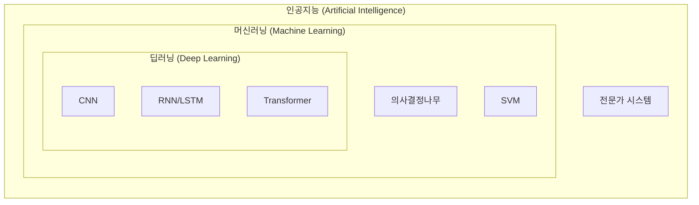
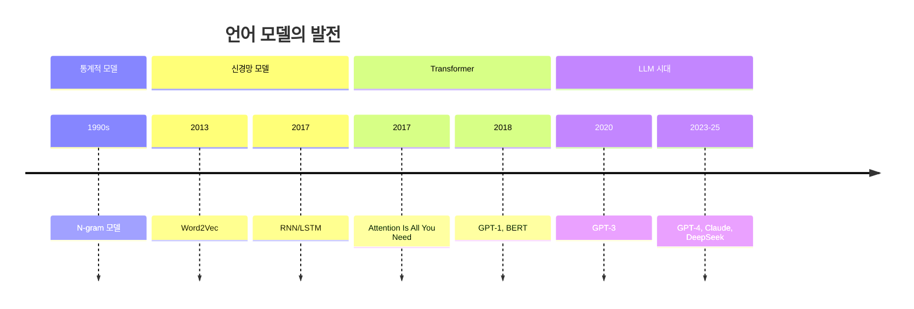

# 제1장: AI 시대의 개막과 개발 환경 준비

## 학습 목표

이 장을 마치면 다음을 수행할 수 있다:

- 인공지능, 머신러닝, 딥러닝의 관계를 설명할 수 있다
- 자연어처리의 개념과 주요 응용 분야를 이해한다
- 언어 모델의 발전 과정을 설명할 수 있다
- Python 기반 딥러닝 개발 환경을 직접 구축할 수 있다

---

## 1.1 인공지능의 이해

### 인공지능이란 무엇인가

인공지능(Artificial Intelligence, AI)은 인간의 지능을 기계로 구현하려는 기술이다. 우리가 일상에서 접하는 음성 비서, 번역 서비스, 추천 시스템 모두 인공지능 기술의 산물이다. 그렇다면 인공지능은 언제, 어떻게 시작되었을까?

인공지능이라는 용어는 1956년 미국 다트머스 대학에서 열린 학술 회의에서 처음 등장했다. 존 매카시(John McCarthy), 마빈 민스키(Marvin Minsky) 등 선구자들은 "기계가 생각할 수 있는가?"라는 질문에서 출발하여 새로운 학문 분야를 개척했다. 이후 인공지능 연구는 기대와 실망을 반복하며 발전해왔다.

1970년대와 1980년대에는 두 차례의 "AI 겨울"이 있었다. 당시 컴퓨터의 성능과 데이터 부족으로 인해 기대만큼의 성과를 내지 못했기 때문이다. 그러나 2012년, 딥러닝 기반의 AlexNet이 이미지 인식 대회에서 압도적인 성능을 보여주면서 인공지능 연구는 새로운 전환점을 맞이했다. 이후 하드웨어 성능 향상과 대규모 데이터의 축적으로 인공지능은 급격히 발전하여 오늘날에 이르렀다.

### 인공지능의 세 가지 수준

인공지능은 그 능력 수준에 따라 세 가지로 분류할 수 있다.

첫째, **약한 인공지능(Narrow AI)**은 특정 작업만 수행할 수 있는 인공지능이다. 현재 우리가 사용하는 대부분의 AI 시스템이 여기에 해당한다. 이미지를 분류하는 AI, 음성을 인식하는 AI, 바둑을 두는 AlphaGo 모두 자신에게 주어진 특정 과제에서만 뛰어난 성능을 보인다. ChatGPT나 Claude 같은 대화형 AI도 현재로서는 약한 인공지능으로 분류된다.

둘째, **강한 인공지능(Artificial General Intelligence, AGI)**은 인간 수준의 범용 지능을 가진 인공지능이다. 새로운 문제에 직면했을 때 학습하고 적응하며, 다양한 영역에서 인간처럼 사고할 수 있다. 아직 실현되지 않았으며, 이를 달성하기 위한 연구가 활발히 진행 중이다.

셋째, **초지능(Artificial Super Intelligence, ASI)**은 모든 영역에서 인간의 지능을 초월한 인공지능이다. 현재로서는 이론적 개념에 가깝다.

### AI, 머신러닝, 딥러닝의 관계

인공지능, 머신러닝, 딥러닝은 종종 혼용되어 사용되지만, 이들 사이에는 명확한 포함 관계가 있다. 이를 이해하기 위해 다음 그림을 살펴보자.



**그림 1.1** AI, 머신러닝, 딥러닝의 포함 관계

**인공지능(AI)**은 가장 넓은 개념으로, 인간의 지능을 모방하는 모든 기술을 포함한다. 초기의 규칙 기반 전문가 시스템부터 현재의 딥러닝 모델까지 모두 인공지능의 범주에 속한다.

**머신러닝(Machine Learning)**은 인공지능의 한 분야로, 명시적으로 프로그래밍하지 않아도 데이터로부터 패턴을 학습하는 기술이다. 전통적인 프로그래밍에서는 사람이 규칙을 직접 작성하지만, 머신러닝에서는 데이터를 통해 컴퓨터가 스스로 규칙을 학습한다.

**딥러닝(Deep Learning)**은 머신러닝의 한 분야로, 여러 층의 인공 신경망을 사용하여 복잡한 패턴을 학습한다. 이미지 인식, 자연어 처리, 음성 인식 등에서 뛰어난 성능을 보여준다.

### 학습 패러다임

머신러닝은 학습 방식에 따라 세 가지로 분류된다.

**지도학습(Supervised Learning)**은 정답이 주어진 데이터로 학습하는 방식이다. 예를 들어, "이 이미지는 고양이다"라는 정답(레이블)과 함께 이미지를 학습시키면, 모델은 새로운 이미지가 고양이인지 아닌지 판별할 수 있게 된다. 분류(Classification)와 회귀(Regression) 문제가 여기에 해당한다.

**비지도학습(Unsupervised Learning)**은 정답 없이 데이터의 구조나 패턴을 스스로 발견하는 방식이다. 비슷한 데이터를 그룹으로 묶는 군집화(Clustering)나 데이터의 차원을 줄이는 차원 축소가 대표적이다.

**강화학습(Reinforcement Learning)**은 환경과 상호작용하며 보상을 최대화하는 방향으로 학습하는 방식이다. 게임 AI나 로봇 제어에 주로 사용된다. AlphaGo가 바둑에서 인간을 이긴 것도 강화학습 덕분이다.

---

## 1.2 자연어처리와 언어 모델

### 자연어처리란 무엇인가

자연어처리(Natural Language Processing, NLP)는 컴퓨터가 인간의 언어를 이해하고 생성하도록 하는 인공지능의 한 분야이다. 여기서 "자연어"란 한국어, 영어, 중국어처럼 인간이 일상적으로 사용하는 언어를 말하며, Python이나 Java 같은 "인공어(프로그래밍 언어)"와 구분된다.

자연어처리가 어려운 이유는 인간 언어의 복잡성에 있다. 같은 문장도 맥락에 따라 다른 의미를 가질 수 있고("배가 고프다" vs "배가 항구에 있다"), 비유나 은유 같은 표현도 이해해야 한다. 또한 문법적으로 틀린 문장도 인간은 자연스럽게 이해하지만, 컴퓨터에게는 이것이 큰 도전이 된다.

### 자연어처리의 주요 응용 분야

자연어처리 기술은 우리 일상 곳곳에서 활용되고 있다.

**기계번역(Machine Translation)**은 한 언어를 다른 언어로 자동 번역하는 기술이다. Google 번역, DeepL, Papago 등이 대표적이다. 과거에는 규칙 기반 번역이 주류였으나, 현재는 신경망 기반 번역이 표준이 되었다.

**챗봇과 대화 시스템**은 사용자와 자연어로 대화하는 시스템이다. ChatGPT, Claude, Gemini 같은 대규모 언어 모델(LLM) 기반 서비스가 이 분야를 혁신하고 있다.

**감성 분석(Sentiment Analysis)**은 텍스트에 담긴 감정이나 의견을 파악하는 기술이다. 제품 리뷰가 긍정적인지 부정적인지 분류하거나, SNS에서 특정 주제에 대한 여론을 분석하는 데 활용된다.

**개체명 인식(Named Entity Recognition, NER)**은 텍스트에서 사람, 장소, 조직 등 특정 유형의 개체를 식별하는 기술이다. "애플이 아이폰 16을 발표했다"라는 문장에서 "애플"은 조직, "아이폰 16"은 제품임을 인식한다.

**질의응답(Question Answering)**은 사용자의 질문에 적절한 답변을 제공하는 시스템이다. 검색 엔진의 "추천 스니펫"이나 고객 상담 자동화에 활용된다.

### 언어 모델이란 무엇인가

언어 모델(Language Model)은 텍스트의 확률 분포를 학습한 모델이다. 쉽게 말해, 주어진 단어들 다음에 어떤 단어가 올 확률이 높은지 예측하는 모델이다.

예를 들어, "오늘 날씨가 정말 ___"라는 문장이 주어졌을 때, 언어 모델은 빈칸에 "좋다", "덥다", "춥다" 등이 올 확률을 계산한다. "맛있다"나 "빠르다"는 맥락상 어울리지 않으므로 낮은 확률을 가진다.

이 간단한 아이디어가 현재 GPT, Claude 같은 대규모 언어 모델의 핵심 원리이다. 다음 단어를 반복적으로 예측하여 문장을 생성하는 것이다.

### 언어 모델의 발전 과정

언어 모델은 통계적 방법에서 시작하여 딥러닝으로 발전해왔다.



**그림 1.2** 언어 모델 발전의 역사

**N-gram 모델(1990년대)**은 최초의 통계적 언어 모델이다. 이전 N-1개의 단어를 보고 다음 단어를 예측한다. 예를 들어, Bigram(N=2) 모델은 바로 앞 단어만 보고 다음 단어를 예측한다. 간단하지만, 문맥을 제한적으로만 고려할 수 있다는 한계가 있다.

**Word2Vec(2013)**은 단어를 벡터로 표현하는 획기적인 방법을 제시했다. 비슷한 의미의 단어는 비슷한 벡터를 가지게 되어, "왕 - 남자 + 여자 = 여왕" 같은 의미 연산이 가능해졌다.

**RNN/LSTM(2010년대 중반)**은 순차적으로 텍스트를 처리하며 이전 정보를 기억할 수 있는 신경망이다. N-gram보다 긴 문맥을 고려할 수 있지만, 매우 긴 문장에서는 앞부분 정보를 잊어버리는 문제가 있었다.

**Transformer(2017)**는 "Attention Is All You Need" 논문에서 제안된 혁신적인 아키텍처이다. 순차 처리 대신 문장 전체를 한 번에 처리하며, Self-Attention 메커니즘으로 단어 간 관계를 효과적으로 모델링한다. 이 아키텍처가 현재 모든 대규모 언어 모델의 기반이 되었다.

**GPT와 BERT(2018)**는 Transformer를 기반으로 한 사전학습 언어 모델이다. GPT(Generative Pre-trained Transformer)는 다음 단어 예측으로 학습하고, BERT(Bidirectional Encoder Representations from Transformers)는 양방향 문맥을 고려하여 학습한다.

**GPT-3, GPT-4(2020-2023)**에 이르러 언어 모델은 수천억 개의 파라미터를 가진 대규모 모델로 발전했다. 이들은 단순한 언어 이해를 넘어 글쓰기, 코딩, 추론 등 다양한 작업을 수행할 수 있게 되었다. 2024년에는 추론 능력을 강화한 모델(OpenAI o1)이 등장했고, 2025년에는 오픈소스 모델(DeepSeek-R1)도 비슷한 수준에 도달했다.

---

## 1.3 AI 개발 생태계

### 주요 딥러닝 프레임워크

딥러닝 모델을 개발하려면 적절한 프레임워크가 필요하다. 현재 가장 많이 사용되는 프레임워크는 PyTorch와 TensorFlow이다.

**PyTorch**는 Meta(구 Facebook)에서 개발한 오픈소스 딥러닝 프레임워크이다. 동적 계산 그래프(Dynamic Computational Graph)를 사용하여 디버깅이 쉽고, Python 문법과 자연스럽게 어울린다. 현재 학계와 연구 분야에서 가장 많이 사용되며, 신규 논문의 75% 이상이 PyTorch를 사용한다.

**TensorFlow**는 Google에서 개발한 딥러닝 프레임워크이다. 정적 계산 그래프로 시작했으나, TensorFlow 2.0부터는 동적 그래프도 지원한다. 프로덕션 배포 도구(TF Serving, TFLite)가 잘 갖춰져 있어 산업계에서 많이 사용된다.

**JAX**는 Google에서 개발한 고성능 수치 연산 라이브러리이다. 함수형 프로그래밍 스타일을 따르며, 자동 미분과 GPU/TPU 가속을 지원한다. 연구 목적으로 점점 사용이 늘고 있다.

**표 1.1** 딥러닝 프레임워크 비교

| 항목 | PyTorch | TensorFlow | JAX |
|------|---------|------------|-----|
| 개발사 | Meta | Google | Google |
| 계산 그래프 | 동적 | 동적/정적 | 동적 |
| 주 사용 분야 | 연구 | 프로덕션 | 연구 |
| 시장 점유율 | 23% (연구 55%+) | 38% | - |
| 학습 난이도 | 쉬움 | 보통 | 어려움 |

본 교재에서는 **PyTorch**를 사용한다. 연구 분야에서 표준으로 자리잡았고, 코드가 직관적이며, Hugging Face 등 최신 라이브러리와의 호환성이 뛰어나기 때문이다.

### Hugging Face 생태계

Hugging Face는 자연어처리 분야의 "GitHub"이라 불릴 만큼 중요한 플랫폼이다. 사전학습된 모델, 데이터셋, 코드를 공유하고 활용할 수 있는 생태계를 제공한다.

**Transformers 라이브러리**는 Hugging Face의 핵심 라이브러리로, BERT, GPT, T5 등 수백 종의 사전학습 모델을 몇 줄의 코드로 사용할 수 있게 해준다. 2025년 현재 하루 300만 회 이상 설치되며, 100만 개 이상의 모델 체크포인트가 공유되어 있다.

**Hub**는 모델과 데이터셋을 공유하는 플랫폼이다. 누구나 자신이 학습시킨 모델을 업로드하고, 다른 사람의 모델을 다운로드하여 사용할 수 있다.

**Datasets**는 다양한 NLP 데이터셋을 쉽게 로드하고 처리할 수 있는 라이브러리이다. IMDB 영화 리뷰, 뉴스 기사 등 수천 개의 데이터셋이 제공된다.

**PEFT(Parameter-Efficient Fine-Tuning)**는 대규모 모델을 효율적으로 파인튜닝할 수 있는 라이브러리이다. LoRA 등의 기법으로 적은 리소스로도 모델을 특정 작업에 맞게 조정할 수 있다.

### 클라우드 GPU 서비스

딥러닝 모델 학습에는 GPU가 필수적이다. 개인용 GPU가 없더라도 클라우드 서비스를 통해 GPU 환경을 사용할 수 있다.

**Google Colab**은 Google이 제공하는 무료 Jupyter 노트북 환경이다. 무료로 T4 GPU를 사용할 수 있어 입문자에게 적합하다. Google Drive와 연동되어 파일 저장과 공유가 편리하다. 단, 무료 버전은 실행 시간과 GPU 사용에 제한이 있다.

**Kaggle Notebooks**는 데이터 과학 플랫폼 Kaggle에서 제공하는 무료 노트북 환경이다. 주당 30시간 GPU 사용이 가능하며, Kaggle의 다양한 데이터셋에 쉽게 접근할 수 있다.

**클라우드 서비스(AWS, GCP, Azure)**는 유료이지만 더 강력한 GPU와 유연한 환경을 제공한다. 실제 프로덕션 환경이나 대규모 학습에 적합하다.

---

## 1.4 실습: 개발 환경 구축

### 실습 목표

이 실습에서는 딥러닝 개발에 필요한 환경을 구축한다:

- Python 가상환경 설정
- 필수 라이브러리 설치 및 확인
- PyTorch 설치 및 GPU 확인

### Python 가상환경 설정

가상환경(Virtual Environment)은 프로젝트별로 독립된 Python 환경을 만드는 기능이다. 프로젝트마다 다른 버전의 라이브러리가 필요할 수 있기 때문에, 가상환경을 사용하면 의존성 충돌을 방지할 수 있다.

Python 내장 모듈 venv를 사용한 가상환경 생성:

```bash
# 가상환경 생성
python3 -m venv venv

# 가상환경 활성화 (macOS/Linux)
source venv/bin/activate

# 가상환경 활성화 (Windows)
venv\Scripts\activate
```

가상환경이 활성화되면 프롬프트 앞에 `(venv)`가 표시된다.

### 필수 라이브러리 설치

딥러닝 개발에 필요한 기본 라이브러리를 설치한다:

```bash
pip install numpy pandas matplotlib
```

- **NumPy**: 수치 연산을 위한 핵심 라이브러리
- **Pandas**: 데이터 분석 및 조작 라이브러리
- **Matplotlib**: 시각화 라이브러리

설치 확인을 위해 다음 스크립트를 실행한다:

```python
# 라이브러리 버전 확인
import numpy as np
import pandas as pd

print(f"NumPy 버전: {np.__version__}")
print(f"Pandas 버전: {pd.__version__}")

# 간단한 테스트
arr = np.array([1, 2, 3, 4, 5])
print(f"배열 평균: {np.mean(arr)}")
```

_전체 코드는 practice/chapter1/code/1-4-환경설정.py 참고_

실행 결과:

```
Python 버전: 3.13.7
NumPy 버전: 2.3.3
배열 생성 테스트: [1 2 3 4 5]
배열 평균: 3.0
✓ NumPy 정상 작동

Pandas 버전: 2.3.3
DataFrame 생성 테스트:
    이름  나이
0  홍길동  25
1  김철수  30
2  이영희  28
✓ Pandas 정상 작동
```

### PyTorch 설치

PyTorch 설치는 시스템 환경에 따라 다르다. 공식 사이트(https://pytorch.org/get-started/locally/)에서 자신의 환경에 맞는 설치 명령어를 확인할 수 있다.

**CPU 버전 설치** (GPU가 없는 경우):

```bash
pip install torch
```

**GPU(CUDA) 버전 설치** (NVIDIA GPU가 있는 경우):

```bash
# CUDA 12.1 기준
pip install torch --index-url https://download.pytorch.org/whl/cu121
```

**Apple Silicon(M1/M2/M3) Mac**의 경우 CPU 버전을 설치하면 자동으로 MPS(Metal Performance Shaders)를 지원한다.

설치 확인:

```python
import torch

print(f"PyTorch 버전: {torch.__version__}")

# GPU 확인
if torch.cuda.is_available():
    print(f"CUDA 사용 가능: {torch.cuda.get_device_name(0)}")
elif hasattr(torch.backends, "mps") and torch.backends.mps.is_available():
    print("Apple MPS 사용 가능")
else:
    print("CPU 모드로 실행")
```

_전체 코드는 practice/chapter1/code/1-4-pytorch확인.py 참고_

PyTorch가 정상적으로 설치되면 간단한 텐서 연산을 수행할 수 있다:

```python
import torch

# 텐서 생성
x = torch.tensor([[1, 2], [3, 4]], dtype=torch.float32)
y = torch.tensor([[5, 6], [7, 8]], dtype=torch.float32)

# 행렬 곱
z = torch.matmul(x, y)
print(z)
```

```
tensor([[19., 22.],
        [43., 50.]])
```

### Google Colab 사용법

로컬 환경에 GPU가 없다면 Google Colab을 활용할 수 있다.

1. https://colab.research.google.com 접속
2. "새 노트북" 생성
3. 런타임 > 런타임 유형 변경 > GPU 선택
4. 코드 셀에 Python 코드 입력 후 실행 (Shift+Enter)

Colab에서 GPU 확인:

```python
import torch
print(torch.cuda.is_available())  # True
print(torch.cuda.get_device_name(0))  # Tesla T4
```

Colab의 장점은 별도 설치 없이 브라우저에서 바로 딥러닝 코드를 실행할 수 있다는 것이다. 단, 무료 버전은 세션 시간 제한(최대 12시간)이 있고, 유휴 상태가 지속되면 연결이 끊길 수 있다.

---

## 핵심 정리

이 장에서 다룬 핵심 내용을 정리하면 다음과 같다:

- **인공지능(AI)**은 인간 지능을 모방하는 기술의 총칭이며, 머신러닝과 딥러닝은 AI의 하위 분야이다
- **자연어처리(NLP)**는 컴퓨터가 인간 언어를 이해하고 생성하게 하는 기술이다
- **언어 모델**은 다음 단어를 예측하는 확률 모델로, N-gram에서 Transformer 기반 LLM으로 발전해왔다
- **PyTorch**는 연구 분야 표준 딥러닝 프레임워크이며, **Hugging Face**는 사전학습 모델의 허브 역할을 한다
- 딥러닝 개발을 위해 Python 가상환경, 기본 라이브러리, PyTorch 설치가 필요하다

---

## 더 알아보기

이 장의 내용을 더 깊이 학습하려면 다음 자료를 참고하라:

- Jurafsky, D. & Martin, J.H. (2024). *Speech and Language Processing (3rd ed.)*. https://web.stanford.edu/~jurafsky/slp3/
- PyTorch 공식 튜토리얼: https://pytorch.org/tutorials/
- Hugging Face NLP 코스: https://huggingface.co/learn/nlp-course/

---

## 다음 장 예고

다음 장에서는 언어 모델의 기초를 더 깊이 다룬다. N-gram 모델을 직접 구현하고, 단어 임베딩(Word Embedding)의 개념과 Word2Vec을 학습한다.

---

## 참고문헌

1. McCarthy, J., Minsky, M.L., Rochester, N. & Shannon, C.E. (1955). A Proposal for the Dartmouth Summer Research Project on Artificial Intelligence.
2. Vaswani, A. et al. (2017). Attention Is All You Need. *Advances in Neural Information Processing Systems*. https://arxiv.org/abs/1706.03762
3. Devlin, J. et al. (2018). BERT: Pre-training of Deep Bidirectional Transformers for Language Understanding. *arXiv*. https://arxiv.org/abs/1810.04805
4. Brown, T. et al. (2020). Language Models are Few-Shot Learners. *NeurIPS*. https://arxiv.org/abs/2005.14165
5. PyTorch Documentation. https://pytorch.org/docs/
6. Hugging Face Documentation. https://huggingface.co/docs
