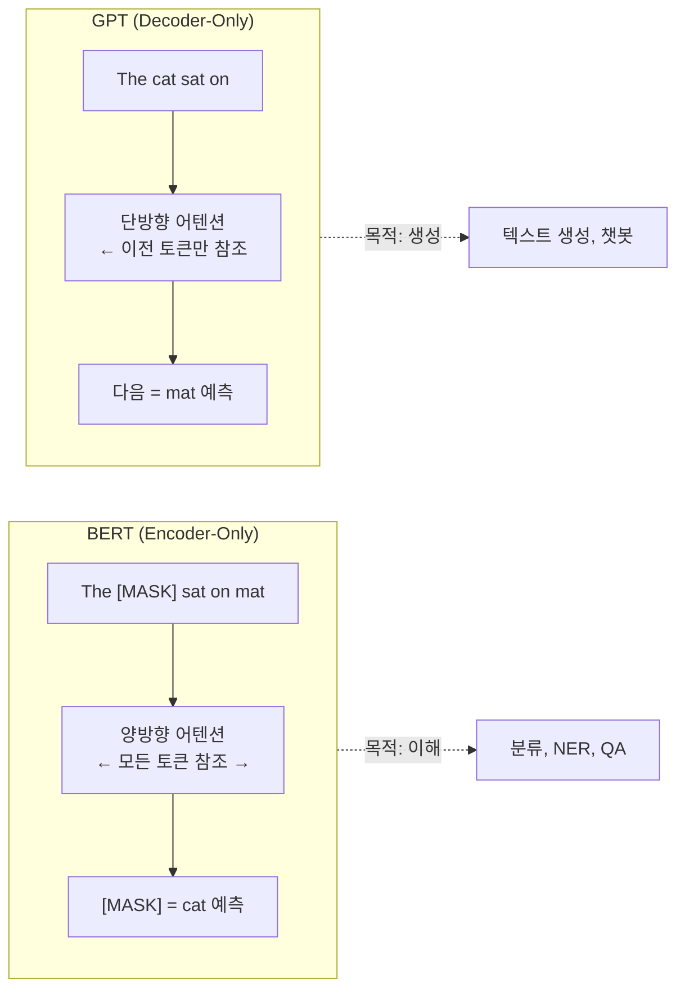
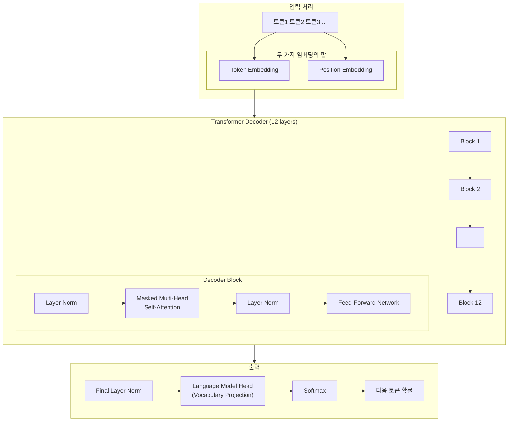
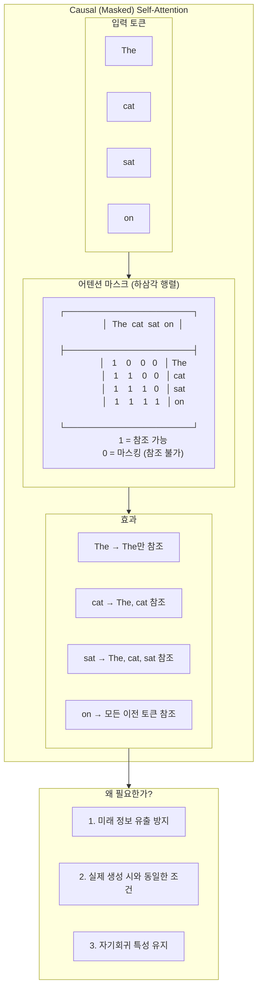
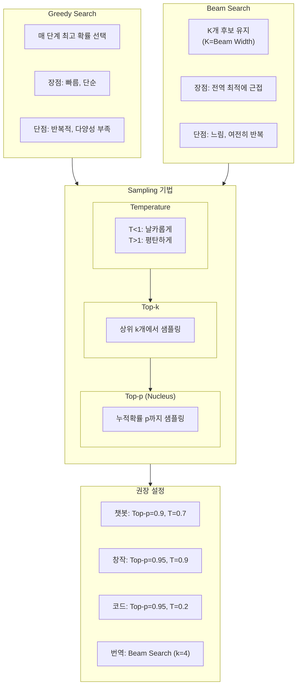
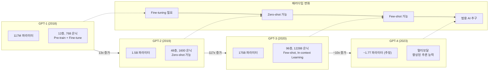

# 제10장: LLM 시대 (2) - GPT 아키텍처와 생성 모델

## 학습 목표

이 장을 마치면 다음을 수행할 수 있다:
- 자기회귀(Autoregressive) 언어 모델의 원리를 이해한다
- GPT의 아키텍처와 Causal Self-Attention을 설명할 수 있다
- 다양한 텍스트 생성 전략(Greedy, Beam, Sampling)을 비교할 수 있다
- GPT-2를 활용하여 텍스트를 생성할 수 있다
- Zero-shot, Few-shot Learning의 개념을 이해한다

---

## 10.1 자기회귀 언어 모델

### 도입: 왜 텍스트 생성이 중요한가

9장에서 다룬 BERT는 텍스트를 "이해"하는 데 뛰어난 성능을 보인다. 그러나 BERT는 새로운 텍스트를 생성하는 데는 적합하지 않다. 우리가 챗봇과 대화하거나, AI에게 글을 쓰도록 요청하거나, 번역 결과를 얻으려면 모델이 텍스트를 생성할 수 있어야 한다. 이것이 바로 GPT(Generative Pre-trained Transformer)가 필요한 이유이다.

GPT는 "생성형" 언어 모델이다. 이름에서 알 수 있듯이, GPT는 새로운 텍스트를 생성하는 것을 주목적으로 설계되었다. 이를 가능하게 하는 핵심 원리가 바로 자기회귀(Autoregressive) 언어 모델링이다.

### 자기회귀 언어 모델링의 원리

자기회귀 언어 모델링을 일상적인 비유로 설명하면, "문장을 완성하는 게임"과 같다. 예를 들어, "오늘 날씨가 정말..."이라는 시작이 주어지면, 우리는 자연스럽게 "좋다", "춥다", "덥다" 같은 단어를 떠올린다. 자기회귀 모델도 정확히 이렇게 작동한다. 이전에 나온 모든 단어들을 보고 다음에 올 단어를 예측하는 것이다.

수학적으로 표현하면, 전체 문장의 확률은 각 토큰의 조건부 확률의 곱으로 계산된다:

P(x₁, x₂, ..., xₙ) = P(x₁) × P(x₂|x₁) × P(x₃|x₁,x₂) × ... × P(xₙ|x₁,...,xₙ₋₁)

이 수식의 의미를 풀어보면:
- **P(x₁)**: 첫 번째 토큰이 나올 확률
- **P(x₂|x₁)**: 첫 번째 토큰이 주어졌을 때 두 번째 토큰이 나올 확률
- **P(xₙ|x₁,...,xₙ₋₁)**: 이전 모든 토큰이 주어졌을 때 n번째 토큰이 나올 확률

핵심은 "왼쪽에서 오른쪽으로" 순차적으로 예측한다는 것이다. 이것이 자기회귀(Autoregressive)라는 이름의 유래이다.

### BERT vs GPT: 두 가지 접근법

9장의 BERT와 이번 장의 GPT는 같은 Transformer 아키텍처를 기반으로 하지만, 근본적으로 다른 목적을 가진다. 다음 다이어그램은 두 접근법의 차이를 보여준다.



**그림 10.1** BERT와 GPT의 어텐션 방식 비교

**표 10.1** BERT와 GPT 비교

| 특성 | BERT | GPT |
|------|------|-----|
| 구조 | Encoder-only | Decoder-only |
| 어텐션 방향 | 양방향 (Bidirectional) | 단방향 (Unidirectional) |
| 학습 목표 | Masked Language Modeling | Next Token Prediction |
| 주요 용도 | 텍스트 분류, NER, QA | 텍스트 생성, 대화 |
| 문맥 활용 | 좌우 모든 문맥 | 왼쪽 문맥만 |

---

## 10.2 GPT 아키텍처

### Decoder-Only 구조의 의미

GPT는 Transformer의 디코더(Decoder) 부분만 사용한다. 원래 Transformer는 인코더-디코더 구조였지만, GPT는 디코더만으로 충분하다는 것을 보여주었다. 인코더 없이 디코더만 사용하면 구조가 단순해지면서도 텍스트 생성에 최적화된 모델을 만들 수 있다.

Decoder-only 구조의 핵심 특징은 다음과 같다:
- 인코더-디코더 간의 Cross-Attention이 없다
- Self-Attention만으로 입력을 처리한다
- 더 적은 파라미터로 효율적인 학습이 가능하다

### GPT-2 아키텍처 구조

다음은 GPT-2의 전체 아키텍처를 보여주는 다이어그램이다:



**그림 10.2** GPT-2 아키텍처 구조

GPT-2의 구성 요소를 살펴보면:

1. **입력 임베딩**: Token Embedding과 Position Embedding을 더하여 각 토큰의 위치 정보를 포함한 벡터를 만든다
2. **Decoder Block**: Masked Self-Attention과 Feed-Forward Network로 구성되며, LayerNorm이 각 서브레이어 앞에 적용된다(Pre-LN)
3. **출력 층**: 최종 은닉 상태를 어휘 크기로 투영하여 다음 토큰의 확률 분포를 생성한다

### GPT-2 모델 규모

GPT-2는 4가지 크기의 모델로 제공된다:

**표 10.2** GPT-2 모델 버전별 비교

| 모델 | 층 수 | 은닉 차원 | 어텐션 헤드 | 파라미터 |
|------|-------|-----------|-------------|----------|
| Small | 12 | 768 | 12 | 124M |
| Medium | 24 | 1024 | 16 | 355M |
| Large | 36 | 1280 | 20 | 774M |
| XL | 48 | 1600 | 25 | 1.5B |

실제로 GPT-2 Small 모델을 로드하여 구조를 확인해보자:

```python
from transformers import GPT2LMHeadModel, GPT2Tokenizer

tokenizer = GPT2Tokenizer.from_pretrained('gpt2')
model = GPT2LMHeadModel.from_pretrained('gpt2')

print(f"어휘 크기: {tokenizer.vocab_size:,}")
print(f"총 파라미터 수: {sum(p.numel() for p in model.parameters()):,}")
```

_전체 코드는 practice/chapter10/code/10-1-gpt-basics.py 참고_

```
실행 결과:
어휘 크기: 50,257
총 파라미터 수: 124,439,808 (124.4M)
층 수: 12
은닉 차원: 768
어텐션 헤드: 12
컨텍스트 길이: 1024
```

GPT-2는 약 1.24억 개의 파라미터를 가지며, 최대 1024개의 토큰을 처리할 수 있다.

---

## 10.3 Causal Self-Attention

### 미래를 볼 수 없는 어텐션

GPT에서 사용하는 Causal Self-Attention(인과적 셀프 어텐션)은 "미래의 토큰을 볼 수 없도록" 마스킹하는 어텐션이다. 이를 Masked Self-Attention이라고도 부른다.

왜 미래 토큰을 마스킹해야 할까? 만약 "The cat sat on the mat"이라는 문장을 학습할 때, "sat"을 예측하는 시점에서 "on", "the", "mat"을 이미 볼 수 있다면, 모델은 정답을 "컨닝"하는 것과 같다. 실제 생성 시에는 미래 토큰이 존재하지 않으므로, 학습 시에도 동일한 조건을 만들어야 한다.



**그림 10.3** Causal Self-Attention 마스크

위 그림에서 하삼각 마스크 행렬을 볼 수 있다. 예를 들어 "sat"을 처리할 때는 "The", "cat", "sat"만 참조할 수 있고, "on"은 참조할 수 없다. 이 마스크는 어텐션 스코어에 적용되어 미래 토큰에 대한 어텐션 가중치를 0으로 만든다.

### Pre-LN vs Post-LN

GPT-1은 원래 Transformer처럼 Post-LayerNorm을 사용했지만, GPT-2부터는 Pre-LayerNorm을 사용한다:

- **Post-LN (GPT-1)**: LayerNorm을 서브레이어 출력 후에 적용
- **Pre-LN (GPT-2+)**: LayerNorm을 서브레이어 입력 전에 적용

Pre-LN은 학습 안정성을 크게 향상시키며, 특히 깊은 네트워크에서 그래디언트 흐름을 개선한다.

---

## 10.4 텍스트 생성 메커니즘

### 토큰 단위 생성 과정

GPT가 텍스트를 생성하는 과정은 다음과 같다:

1. 프롬프트(시작 텍스트)를 입력으로 받는다
2. 모델이 다음 토큰의 확률 분포를 출력한다
3. 확률 분포에서 다음 토큰을 선택한다
4. 선택된 토큰을 입력에 추가한다
5. 종료 조건(EOS 토큰 또는 최대 길이)까지 2-4를 반복한다

3단계에서 "어떻게 다음 토큰을 선택하느냐"에 따라 생성 결과가 크게 달라진다. 이것이 바로 텍스트 생성 전략이다.

### Greedy Search (탐욕 검색)

가장 단순한 방법은 매 단계에서 확률이 가장 높은 토큰을 선택하는 것이다. 이를 Greedy Search라고 한다.

```python
# Greedy Search 핵심 로직
for step in range(max_tokens):
    logits = model(input_ids).logits[:, -1, :]
    next_token = torch.argmax(logits)  # 가장 높은 확률 선택
    input_ids = torch.cat([input_ids, next_token], dim=-1)
```

**장점**: 빠르고 결정적(deterministic)이다
**단점**: 반복적이고 지루한 텍스트를 생성하는 경향이 있다

### Beam Search (빔 검색)

Beam Search는 한 번에 하나의 토큰만 선택하는 대신, K개의 후보 시퀀스를 동시에 유지한다. K를 Beam Width라고 부른다.

**장점**: 전역적으로 더 좋은 시퀀스를 찾을 가능성이 높다
**단점**: Greedy보다 느리고, 반복 문제가 여전히 존재한다

### Temperature Sampling

Temperature는 확률 분포의 "날카로움"을 조절한다:

- **T < 1**: 분포가 날카로워져서 높은 확률 토큰이 더 자주 선택된다
- **T > 1**: 분포가 평탄해져서 다양한 토큰이 선택될 수 있다
- **T → 0**: Greedy Search와 동일해진다

```python
# Temperature Sampling
logits = logits / temperature
probs = F.softmax(logits, dim=-1)
next_token = torch.multinomial(probs, 1)
```

### Top-k Sampling

상위 k개 토큰만 고려하여 샘플링한다. 예를 들어 k=50이면 확률이 가장 높은 50개 토큰 중에서 무작위로 선택한다.

### Top-p (Nucleus) Sampling

누적 확률이 p를 넘는 최소한의 토큰 집합에서 샘플링한다. 예를 들어 p=0.9면 누적 확률이 90%가 될 때까지의 토큰들 중에서 선택한다.

Top-k와의 차이점은 문맥에 따라 후보 수가 동적으로 조절된다는 것이다. 확률이 한 토큰에 집중되면 적은 수의 토큰에서, 확률이 분산되면 많은 토큰에서 샘플링한다.

### 생성 전략 비교 실험

다음은 동일한 프롬프트에 대해 다양한 생성 전략을 적용한 결과이다:

```python
prompt = "The future of AI is"
```

_전체 코드는 practice/chapter10/code/10-4-generation-strategies.py 참고_

```
실행 결과:

프롬프트: 'The future of AI is'

1. Greedy Search:
   The future of AI is uncertain. The future of AI is uncertain.
   The future of AI is uncertain. The future

2. Temperature=0.7:
   The future of AI is the goal of Carl Jung, who helped
   establish the concept of "mind as a problem" in the

3. Temperature=1.2:
   The future of AI is pretty crazy. Again, Dave repeatedly
   meant Tropes invoked panic psychological effects: "you master Nash's

4. Top-k (k=50):
   The future of AI is yet to be determined.
   The latest research finds that a new group of neural
   networks could be
```

결과 분석:
- **Greedy**: "uncertain"이 반복되는 전형적인 반복 문제가 나타난다
- **Temperature 0.7**: 적절한 다양성과 일관성을 유지한다
- **Temperature 1.2**: 다양하지만 일관성이 떨어진다
- **Top-k**: 균형 잡힌 결과를 보여준다



**그림 10.4** 텍스트 생성 전략 비교

---

## 10.5 GPT의 능력: Zero-shot과 Few-shot Learning

### 전통적 접근법의 한계

딥러닝 모델을 새로운 태스크에 적용하려면 일반적으로 해당 태스크의 레이블된 데이터로 미세조정(Fine-tuning)해야 했다. 그러나 GPT-3의 등장으로 이러한 패러다임이 변화했다.

### Zero-shot Learning

Zero-shot Learning은 어떤 예시도 제공하지 않고 태스크 지시만으로 수행하는 것이다:

```
프롬프트: "Translate English to French: Hello, how are you?"
```

모델은 "번역하라"는 지시만으로 번역을 시도한다. 다만 GPT-2 수준에서는 Zero-shot 성능이 제한적이다.

### Few-shot Learning

Few-shot Learning은 몇 개의 예시를 프롬프트에 포함시켜 모델이 패턴을 파악하도록 돕는다:

```python
prompt = """Translate English to French:
Hello = Bonjour
Thank you = Merci
Good morning = Bonjour
How are you? ="""
```

_전체 코드는 practice/chapter10/code/10-8-gpt-applications.py 참고_

```
실행 결과:

Few-shot 감성 분류 예시:
   예시 1: 'This movie was amazing!' → Positive
   예시 2: 'The food was terrible.' → Negative
   질문: 'The book was interesting and engaging.'
   결과: Positive
```

GPT-2는 예시 패턴을 학습하여 새로운 입력에 대해 "Positive"를 올바르게 예측했다. 이것이 In-Context Learning의 힘이다.

### In-Context Learning

In-Context Learning은 모델의 파라미터를 업데이트하지 않고, 프롬프트 내의 예시만으로 새로운 태스크를 수행하는 능력이다. GPT-3에서 특히 강력하게 나타났으며, 모델 크기가 클수록 효과가 증대한다.

### 창발적 능력 (Emergent Abilities)

모델 크기가 특정 임계점을 넘으면 갑자기 새로운 능력이 나타나는 현상을 창발적 능력이라고 한다. 대표적인 예:
- Chain-of-Thought 추론
- 산술 연산
- 복잡한 논리적 추론

이러한 능력은 약 100B 파라미터 이상의 모델에서 뚜렷하게 나타난다.

---

## 10.6 프롬프트 엔지니어링 기초

### 프롬프트의 중요성

동일한 모델이라도 프롬프트를 어떻게 작성하느냐에 따라 결과가 크게 달라진다. 프롬프트 엔지니어링은 원하는 결과를 얻기 위해 프롬프트를 최적화하는 기술이다.

### 효과적인 프롬프트 작성법

좋은 프롬프트의 핵심 요소:

1. **명확한 지시**: 모호하지 않게 원하는 것을 구체적으로 명시한다
2. **맥락 제공**: 배경 정보와 제약 조건을 제공한다
3. **출력 형식 지정**: 원하는 출력 형식을 예시로 보여준다
4. **단계별 분해**: 복잡한 태스크는 여러 단계로 나눈다

### Chain-of-Thought (CoT) Prompting

Chain-of-Thought Prompting은 모델에게 단계별로 추론하도록 유도하는 기법이다. 복잡한 문제에서 성능을 크게 향상시킨다.

```
프롬프트: "If there are 3 cars in the parking lot and 2 more cars arrive,
how many cars are in the parking lot? Let's think step by step."

모델 응답:
1. 처음 주차장에는 3대의 차가 있었습니다.
2. 2대의 차가 더 도착했습니다.
3. 3 + 2 = 5
4. 따라서 주차장에는 5대의 차가 있습니다.
```

"Let's think step by step"이라는 간단한 문구를 추가하는 것만으로 추론 성능이 향상되는 것을 Zero-shot CoT라고 한다. 이 기법은 특히 100B 파라미터 이상의 대규모 모델에서 효과적이다.

---

## 10.7 텍스트 생성 평가

### Perplexity (혼란도)

Perplexity는 언어 모델의 가장 기본적인 평가 지표이다. 직관적으로 "모델이 다음 토큰을 얼마나 잘 예측하는가"를 측정한다.

PPL = exp(평균 Cross-Entropy Loss)

Perplexity가 낮을수록 모델이 테스트 데이터를 잘 예측한다는 의미이다. 예를 들어 PPL=10이면, 모델이 평균적으로 10개의 토큰 중에서 "헷갈려"하고 있다고 해석할 수 있다.

### BLEU Score

BLEU(Bilingual Evaluation Understudy)는 기계 번역 평가에 널리 사용된다. 생성된 텍스트와 참조 텍스트 간의 n-gram 일치율을 측정한다.

- 0-100 스케일
- n-gram 정밀도(Precision) 기반
- 번역, 요약 등 참조 텍스트가 있는 태스크에 적합

### ROUGE Score

ROUGE(Recall-Oriented Understudy for Gisting Evaluation)는 텍스트 요약 평가에 주로 사용된다.

- ROUGE-N: n-gram 재현율
- ROUGE-L: 최장 공통 부분 시퀀스(LCS)
- 재현율(Recall) 기반

### 정성적 평가

자동 메트릭으로 측정하기 어려운 측면들:
- **유창성(Fluency)**: 문법적으로 올바르고 자연스러운가
- **일관성(Coherence)**: 논리적으로 연결되어 있는가
- **관련성(Relevance)**: 주제와 관련 있는 내용인가
- **사실 정확성(Factuality)**: 사실적으로 정확한가

---

## 10.8 실습: GPT-2 텍스트 생성

### 실습 환경 설정

```bash
cd practice/chapter10
python -m venv venv
source venv/bin/activate  # macOS/Linux
pip install transformers torch numpy
```

### GPT-2 모델 로드 및 기본 사용

```python
from transformers import GPT2LMHeadModel, GPT2Tokenizer

tokenizer = GPT2Tokenizer.from_pretrained('gpt2')
model = GPT2LMHeadModel.from_pretrained('gpt2')
model.eval()
```

### BPE 토큰화 이해

GPT-2는 BPE(Byte Pair Encoding) 토큰화를 사용한다:

```python
texts = ["Hello, world!", "artificial intelligence"]
for text in texts:
    tokens = tokenizer.tokenize(text)
    ids = tokenizer.encode(text)
    print(f"텍스트: '{text}'")
    print(f"  토큰: {tokens}")
    print(f"  토큰 ID: {ids}")
```

```
실행 결과:
텍스트: 'Hello, world!'
  토큰: ['Hello', ',', 'Ġworld', '!']
  토큰 ID: [15496, 11, 995, 0]
텍스트: 'artificial intelligence'
  토큰: ['art', 'ificial', 'Ġintelligence']
  토큰 ID: [433, 9542, 4430]
```

'Ġ' 기호는 단어 앞의 공백을 나타낸다. BPE는 자주 나오는 문자 조합을 하나의 토큰으로 만들어 어휘 크기를 효율적으로 관리한다.

### 텍스트 생성 예제

```python
prompt = "Artificial intelligence is"
input_ids = tokenizer.encode(prompt, return_tensors='pt')

# Greedy 생성
generated_ids = input_ids[0].tolist()
for _ in range(15):
    inputs = torch.tensor([generated_ids])
    with torch.no_grad():
        outputs = model(inputs)
        logits = outputs.logits[0, -1, :]
        next_token = torch.argmax(logits).item()
        generated_ids.append(next_token)

generated_text = tokenizer.decode(generated_ids)
print(f"생성된 텍스트: {generated_text}")
```

```
실행 결과:
생성된 텍스트: Artificial intelligence is a new field of research that
has been in the works for a while now
```

_전체 코드는 practice/chapter10/code/10-1-gpt-basics.py 참고_

---

## 10.9 GPT 시리즈의 발전

### GPT-1에서 GPT-4까지



**그림 10.5** GPT 시리즈의 발전

GPT 시리즈는 단순히 크기만 증가한 것이 아니라, 패러다임 자체가 변화했다:

- **GPT-1**: 사전학습 후 미세조정 필요
- **GPT-2**: Zero-shot으로 일부 태스크 가능
- **GPT-3**: Few-shot Learning과 In-context Learning 능력
- **GPT-4**: 멀티모달(이미지+텍스트), 향상된 추론, 더 긴 컨텍스트

### 규모의 법칙 (Scaling Laws)

모델 크기, 데이터 양, 컴퓨팅 자원이 증가함에 따라 모델 성능이 예측 가능하게 향상된다는 것이 Scaling Laws이다. OpenAI, DeepMind 등의 연구에서 검증되었으며, 이것이 대규모 언어 모델 개발의 이론적 근거가 되었다.

---

## 요약

이 장에서 다룬 핵심 내용을 정리하면:

1. **자기회귀 언어 모델**: 이전 토큰들을 조건으로 다음 토큰을 예측하는 방식으로, GPT의 핵심 원리이다.

2. **GPT 아키텍처**: Decoder-only 구조로, Causal Self-Attention을 사용하여 미래 토큰을 마스킹한다.

3. **텍스트 생성 전략**: Greedy Search, Beam Search, Temperature/Top-k/Top-p Sampling 등 다양한 방법이 있으며, 용도에 따라 선택한다.

4. **Zero-shot/Few-shot Learning**: 미세조정 없이 프롬프트만으로 다양한 태스크를 수행할 수 있다.

5. **프롬프트 엔지니어링**: 효과적인 프롬프트 작성이 모델 성능을 크게 좌우한다.

다음 장에서는 BERT와 GPT의 장점을 결합한 Encoder-Decoder 모델과 최신 LLM 동향을 살펴본다.

---

## 참고문헌

- Radford, A., et al. (2018). Improving Language Understanding by Generative Pre-Training (GPT-1)
- Radford, A., et al. (2019). Language Models are Unsupervised Multitask Learners (GPT-2)
- Brown, T., et al. (2020). Language Models are Few-Shot Learners (GPT-3). NeurIPS 2020
- Wei, J., et al. (2022). Chain-of-Thought Prompting Elicits Reasoning in Large Language Models
- Holtzman, A., et al. (2020). The Curious Case of Neural Text Degeneration
- Hugging Face Transformers Documentation: https://huggingface.co/docs/transformers/
