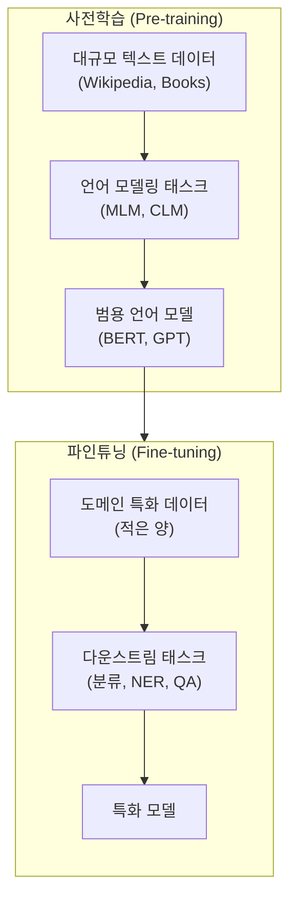
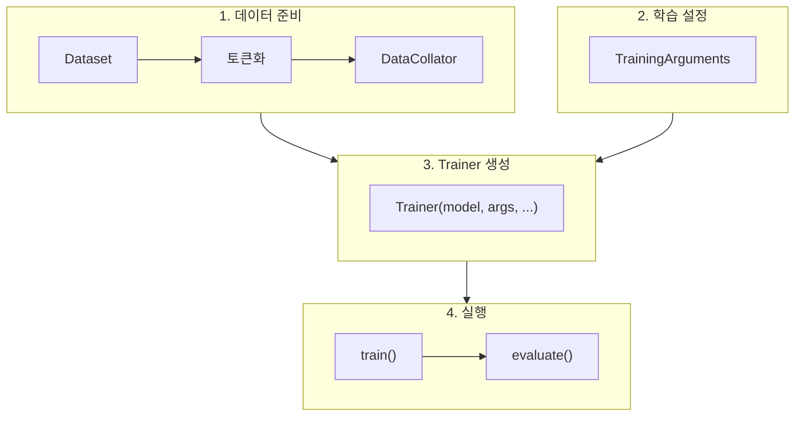
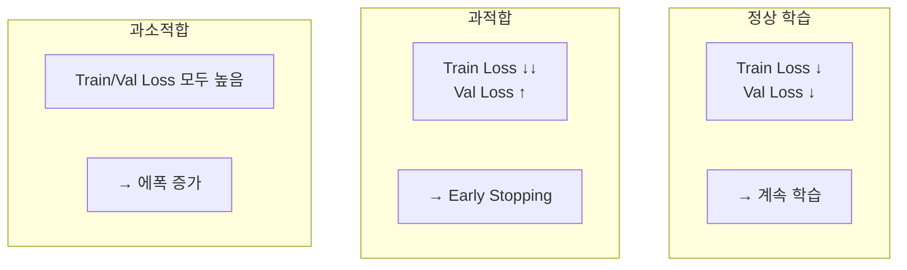

# 제11장: LLM 파인튜닝 (1) - 전이 학습과 Full Fine-tuning

## 학습 목표

이 장을 마치면 다음을 수행할 수 있다:
- 전이 학습(Transfer Learning)의 개념과 필요성을 설명할 수 있다
- Full Fine-tuning과 Feature Extraction의 차이를 이해한다
- Hugging Face Trainer API를 활용하여 모델을 파인튜닝할 수 있다
- 적절한 하이퍼파라미터를 선택하고 과적합을 방지할 수 있다
- 학습 과정을 모니터링하고 분석할 수 있다

---

## 11.1 전이 학습의 이해

### 왜 전이 학습이 필요한가

9장과 10장에서 BERT와 GPT를 살펴보았다. 이러한 대규모 언어 모델은 수백만에서 수십억 개의 파라미터를 가지며, 수십 기가바이트의 텍스트 데이터로 사전학습되었다. 그러나 우리가 풀고자 하는 실제 문제에는 대개 수천 개 정도의 레이블된 데이터만 있다. 이러한 적은 데이터로 처음부터 대규모 모델을 학습시키면 과적합이 발생하고 일반화 성능이 떨어진다.

전이 학습(Transfer Learning)은 이 문제를 해결한다. 핵심 아이디어는 간단하다. "이미 많은 것을 학습한 모델의 지식을 빌려와서, 새로운 태스크에 적용한다."

### 전이 학습의 비유

전이 학습을 비유로 설명하면, 외국어를 배우는 것과 비슷하다. 이미 한국어를 완벽하게 구사하는 사람이 영어를 배우면, 완전히 처음 언어를 배우는 아이보다 훨씬 빠르게 학습한다. 한국어를 통해 이미 "문법이란 무엇인가", "단어와 문장의 관계", "문맥에 따른 의미 변화" 등을 이해하고 있기 때문이다.

마찬가지로, BERT가 대규모 텍스트로 사전학습되면서 이미 "언어의 구조", "단어 간 관계", "문맥 이해" 등을 학습했다. 이 지식을 활용하면 적은 데이터로도 감성 분석이나 개체명 인식 같은 특정 태스크를 효과적으로 수행할 수 있다.

### Pre-training과 Fine-tuning 패러다임

현대 NLP의 표준 워크플로우는 두 단계로 구성된다:

1. **사전학습(Pre-training)**: 대규모 비지도 데이터로 언어 모델 학습
2. **파인튜닝(Fine-tuning)**: 특정 태스크의 레이블된 데이터로 추가 학습



**그림 11.1** 전이 학습 개념도

### 전이 학습의 장점

전이 학습이 효과적인 이유는 다음과 같다:

1. **적은 데이터로 높은 성능**: 수백~수천 개의 샘플로도 좋은 성능 달성
2. **학습 시간 단축**: 처음부터 학습하는 것보다 훨씬 빠름
3. **일반화 성능 향상**: 사전학습된 지식이 과적합 방지에 도움
4. **계산 자원 절약**: 대규모 사전학습은 이미 완료됨

---

## 11.2 파인튜닝 전략

파인튜닝에는 여러 가지 전략이 있다. 상황에 따라 적절한 전략을 선택해야 한다.

### Feature Extraction (특징 추출)

가장 보수적인 접근법은 사전학습된 모델의 가중치를 완전히 고정(freeze)하고, 새로 추가한 분류 헤드만 학습시키는 것이다.

```python
from transformers import AutoModel

model = AutoModel.from_pretrained("bert-base-uncased")

# 모든 파라미터 동결
for param in model.parameters():
    param.requires_grad = False
```

_전체 코드는 practice/chapter11/code/11-1-transfer-learning-concept.py 참고_

```
실행 결과:
파라미터 동결 후:
  - 학습 가능 파라미터: 0
  - 동결된 파라미터: 109,482,240
```

Feature Extraction의 특징:
- 사전학습 지식을 완전히 보존
- 학습이 매우 빠름
- 적은 데이터에 적합
- 도메인이 유사할 때 효과적

### Full Fine-tuning (전체 미세 조정)

반대로, 모든 파라미터를 학습시키는 방법이다. 분류 헤드는 랜덤 초기화된 상태에서 시작하고, 사전학습된 레이어들도 함께 업데이트된다.

```python
from transformers import AutoModelForSequenceClassification

model = AutoModelForSequenceClassification.from_pretrained(
    "bert-base-uncased",
    num_labels=2
)

total_params = sum(p.numel() for p in model.parameters())
print(f"총 파라미터: {total_params:,}")
```

```
실행 결과:
분류 모델 구조:
  - BERT Base: ~110M 파라미터
  - 분류 헤드: 1,538 파라미터
  - 총 파라미터: 109,483,778
  - 학습 가능 파라미터: 109,483,778 (100%)
```

Full Fine-tuning의 특징:
- 도메인이 다를 때 효과적
- 최고 성능 달성 가능
- 더 많은 데이터 필요
- 계산 자원과 시간이 더 소요

### Partial Fine-tuning (부분 미세 조정)

중간 전략으로, 일부 레이어만 학습시키는 방법이 있다. 일반적으로 상위 레이어(출력에 가까운 레이어)만 학습시키고, 하위 레이어(입력에 가까운 레이어)는 동결한다.

```python
# 마지막 2개 레이어만 학습 가능
for param in model.bert.encoder.layer[10].parameters():
    param.requires_grad = True
for param in model.bert.encoder.layer[11].parameters():
    param.requires_grad = True
```

```
실행 결과:
마지막 2개 레이어 + 분류 헤드만 학습:
  - 학습 가능 파라미터: 14,177,282 (12.9%)
  - 동결된 파라미터: 95,306,496 (87.1%)
```

이 전략의 근거는, 하위 레이어는 일반적인 언어 특징(품사, 구문 구조 등)을 학습하고, 상위 레이어는 태스크 특화 특징을 학습한다는 연구 결과에 기반한다.

### 전략 선택 가이드

**표 11.1** 파인튜닝 전략 선택 기준

| 상황 | 권장 전략 | 이유 |
|------|-----------|------|
| 적은 데이터, 유사 도메인 | Feature Extraction | 과적합 방지 |
| 적은 데이터, 다른 도메인 | Partial Fine-tuning | 균형 잡힌 적응 |
| 많은 데이터, 다른 도메인 | Full Fine-tuning | 최대 성능 |
| 대규모 모델, 제한된 자원 | PEFT (LoRA) | 효율성 (12장에서 다룸) |

---

## 11.3 파인튜닝 태스크

파인튜닝은 다양한 NLP 태스크에 적용할 수 있다. 각 태스크에 따라 적절한 모델 클래스를 선택해야 한다.

### Sequence Classification (시퀀스 분류)

전체 시퀀스(문장 또는 문서)에 대해 하나의 레이블을 예측한다.

- **예시**: 감성 분석, 주제 분류, 스팸 탐지
- **입력**: 텍스트 시퀀스
- **출력**: 클래스 레이블
- **모델**: `AutoModelForSequenceClassification`

### Token Classification (토큰 분류)

각 토큰에 대해 레이블을 예측한다.

- **예시**: 개체명 인식(NER), 품사 태깅(POS)
- **입력**: 토큰 시퀀스
- **출력**: 각 토큰의 레이블
- **모델**: `AutoModelForTokenClassification`

### Question Answering (질의응답)

문맥에서 질문에 대한 답의 위치를 예측한다.

- **예시**: SQuAD 데이터셋
- **입력**: (질문, 문맥) 쌍
- **출력**: 답변의 시작/끝 위치
- **모델**: `AutoModelForQuestionAnswering`

**표 11.2** 태스크별 모델 클래스

| 태스크 | 모델 클래스 | 출력 형식 |
|--------|-------------|-----------|
| 문장 분류 | AutoModelForSequenceClassification | [batch, num_labels] |
| 토큰 분류 | AutoModelForTokenClassification | [batch, seq_len, num_labels] |
| 질의응답 | AutoModelForQuestionAnswering | 시작/끝 위치 |
| 텍스트 생성 | AutoModelForCausalLM | [batch, seq_len, vocab_size] |

---

## 11.4 데이터셋 준비

### Hugging Face Datasets 라이브러리

Hugging Face Datasets는 다양한 공개 데이터셋에 쉽게 접근할 수 있게 해준다.

```python
from datasets import load_dataset

# 공개 데이터셋 로드
dataset = load_dataset("imdb")

print(f"훈련 데이터: {len(dataset['train'])}개")
print(f"테스트 데이터: {len(dataset['test'])}개")
```

```
실행 결과:
원본 데이터셋:
  훈련: 25000개
  테스트: 25000개
```

### 데이터 토큰화

모델에 입력하기 전에 텍스트를 토큰화해야 한다.

```python
from transformers import AutoTokenizer

tokenizer = AutoTokenizer.from_pretrained("bert-base-uncased")

def tokenize_function(examples):
    return tokenizer(
        examples["text"],
        padding="max_length",
        truncation=True,
        max_length=256
    )

tokenized_dataset = dataset.map(tokenize_function, batched=True)
```

### 데이터 분할

```python
# Train/Validation 분할
dataset = dataset.train_test_split(test_size=0.2, seed=42)
```

### 데이터 불균형 처리

분류 태스크에서 클래스 불균형이 있을 경우:
- 가중치 기반 손실 함수 사용
- 오버샘플링/언더샘플링
- Focal Loss 적용

---

## 11.5 Hugging Face Trainer API

Trainer는 학습 루프를 자동화하는 고수준 API이다. 복잡한 학습 코드를 직접 작성할 필요 없이, 설정만으로 학습을 수행할 수 있다.

### TrainingArguments 설정

TrainingArguments는 학습에 필요한 모든 설정을 담고 있다.

```python
from transformers import TrainingArguments

training_args = TrainingArguments(
    output_dir="./results",           # 출력 디렉토리
    num_train_epochs=3,               # 에폭 수
    per_device_train_batch_size=8,    # 배치 크기
    per_device_eval_batch_size=8,     # 평가 배치 크기
    learning_rate=2e-5,               # 학습률
    weight_decay=0.01,                # 가중치 감쇠
    warmup_ratio=0.1,                 # 워밍업 비율
    eval_strategy="epoch",            # 평가 전략
    save_strategy="epoch",            # 저장 전략
    load_best_model_at_end=True,      # 최종 모델 로드
    logging_steps=50,                 # 로깅 간격
)
```

_전체 코드는 practice/chapter11/code/11-5-trainer-basics.py 참고_

### compute_metrics 함수

평가 메트릭을 계산하는 함수를 정의한다.

```python
from sklearn.metrics import accuracy_score, precision_recall_fscore_support
import numpy as np

def compute_metrics(eval_pred):
    predictions, labels = eval_pred
    predictions = np.argmax(predictions, axis=-1)

    accuracy = accuracy_score(labels, predictions)
    precision, recall, f1, _ = precision_recall_fscore_support(
        labels, predictions, average='weighted'
    )

    return {
        "accuracy": accuracy,
        "precision": precision,
        "recall": recall,
        "f1": f1
    }
```

### Trainer 생성 및 학습

```python
from transformers import Trainer, DataCollatorWithPadding

trainer = Trainer(
    model=model,
    args=training_args,
    train_dataset=train_dataset,
    eval_dataset=eval_dataset,
    processing_class=tokenizer,
    data_collator=DataCollatorWithPadding(tokenizer=tokenizer),
    compute_metrics=compute_metrics
)

# 학습 실행
trainer.train()
```



**그림 11.3** Trainer 워크플로우

---

## 11.6 하이퍼파라미터 튜닝

파인튜닝 성능은 하이퍼파라미터 선택에 크게 의존한다. 여기서는 주요 하이퍼파라미터와 권장 값을 살펴본다.

### Learning Rate (학습률)

학습률은 가장 중요한 하이퍼파라미터이다. BERT 계열 모델의 파인튜닝에는 일반적으로 매우 낮은 학습률을 사용한다.

- **권장 범위**: 1e-5 ~ 5e-5
- **기본값**: 2e-5

너무 높은 학습률은 사전학습된 지식을 파괴하고(catastrophic forgetting), 너무 낮은 학습률은 학습이 느려진다.

### Batch Size (배치 크기)

배치 크기는 메모리와 성능 간의 트레이드오프가 있다.

- **작은 배치**: 더 많은 업데이트, 노이즈가 있지만 규제 효과
- **큰 배치**: 안정적이지만 더 많은 메모리 필요
- **권장**: 8 ~ 32 (GPU 메모리에 따라)

메모리가 부족하면 Gradient Accumulation을 사용하여 가상 배치 크기를 늘릴 수 있다.

### Warmup Steps (워밍업 스텝)

학습 초기에 학습률을 점진적으로 증가시켜 안정성을 확보한다.

- **권장**: 전체 스텝의 6-10%
- **예**: 1000 스텝 학습 시 60-100 스텝 워밍업

### Weight Decay (가중치 감쇠)

L2 정규화 효과를 준다. AdamW 옵티마이저와 함께 사용한다.

- **권장**: 0.01 ~ 0.1
- **기본값**: 0.01

**표 11.3** 권장 하이퍼파라미터

| 파라미터 | 권장 범위 | 기본값 |
|----------|-----------|--------|
| learning_rate | 1e-5 ~ 5e-5 | 2e-5 |
| batch_size | 8 ~ 32 | 16 |
| epochs | 2 ~ 5 | 3 |
| warmup_ratio | 0.06 ~ 0.1 | 0.1 |
| weight_decay | 0.01 ~ 0.1 | 0.01 |

---

## 11.7 과적합 방지

파인튜닝 시 적은 데이터를 사용하면 과적합이 발생하기 쉽다. 다음 기법들로 과적합을 방지할 수 있다.

### Early Stopping

검증 손실이 더 이상 개선되지 않으면 학습을 조기 종료한다.

```python
from transformers import EarlyStoppingCallback

trainer = Trainer(
    ...
    callbacks=[EarlyStoppingCallback(early_stopping_patience=3)]
)
```

### Dropout

BERT의 기본 Dropout은 0.1이다. 과적합이 심하면 0.2-0.3으로 증가시킬 수 있다.

### Label Smoothing

Hard label(0 또는 1) 대신 Soft label(0.9, 0.1)을 사용하여 모델의 과신을 방지한다.

```python
training_args = TrainingArguments(
    ...
    label_smoothing_factor=0.1
)
```

### Data Augmentation

NLP에서 사용 가능한 데이터 증강 기법:
- 동의어 치환 (Synonym Replacement)
- 역번역 (Back-translation)
- 랜덤 삽입/삭제/교환

---

## 11.8 학습 모니터링

### Loss Curve 분석

학습 과정을 모니터링하여 문제를 조기에 발견할 수 있다.

- **정상 학습**: Train Loss ↓, Val Loss ↓
- **과적합**: Train Loss ↓↓, Val Loss ↑
- **과소적합**: Train Loss ↑, Val Loss ↑



**그림 11.4** 학습 곡선 분석

### TensorBoard 활용

Hugging Face Trainer는 TensorBoard와 쉽게 연동된다.

```python
training_args = TrainingArguments(
    ...
    logging_dir="./logs",
    report_to=["tensorboard"]
)
```

---

## 11.9 실습: 텍스트 분류 파인튜닝

이제 실제로 IMDb 영화 리뷰 감성 분석 태스크를 파인튜닝해보자.

### 데이터셋 로드

```python
from datasets import load_dataset

dataset = load_dataset("imdb")
train_dataset = dataset["train"].shuffle(seed=42).select(range(500))
test_dataset = dataset["test"].shuffle(seed=42).select(range(125))
```

_전체 코드는 practice/chapter11/code/11-9-text-classification.py 참고_

```
실행 결과:
샘플 데이터:
  텍스트 길이: 758 문자
  레이블: 1 (긍정)
  텍스트 미리보기: There is no relation at all between Fortier and Profiler...
```

### 모델 및 토크나이저 준비

```python
from transformers import AutoModelForSequenceClassification, AutoTokenizer

model_name = "distilbert-base-uncased"
tokenizer = AutoTokenizer.from_pretrained(model_name)
model = AutoModelForSequenceClassification.from_pretrained(
    model_name,
    num_labels=2
)
```

```
실행 결과:
모델: distilbert-base-uncased
총 파라미터: 66,955,010
학습 가능 파라미터: 66,955,010
```

### 학습 설정 및 실행

```python
training_args = TrainingArguments(
    output_dir="./imdb_results",
    num_train_epochs=3,
    per_device_train_batch_size=8,
    learning_rate=2e-5,
    weight_decay=0.01,
    warmup_ratio=0.1,
    eval_strategy="epoch",
    load_best_model_at_end=True,
)

trainer = Trainer(
    model=model,
    args=training_args,
    train_dataset=train_tokenized,
    eval_dataset=test_tokenized,
    compute_metrics=compute_metrics,
)

trainer.train()
```

### 학습 결과

```
실행 결과:

에폭 1:
  eval_loss: 0.5491
  eval_accuracy: 0.7200
  eval_f1: 0.7518

에폭 2:
  eval_loss: 0.4688
  eval_accuracy: 0.7760
  eval_f1: 0.7879

에폭 3:
  eval_loss: 0.4521
  eval_accuracy: 0.8000
  eval_f1: 0.8103
```

500개의 훈련 샘플만으로 3 에폭 학습 후 약 80%의 정확도를 달성했다. 이것이 전이 학습의 힘이다. 사전학습 없이 처음부터 학습했다면 이 정도 성능을 얻기 위해 훨씬 많은 데이터가 필요했을 것이다.

### 예측 테스트

```python
test_texts = [
    "This movie was absolutely amazing!",
    "Terrible movie. Complete waste of time.",
]

for text in test_texts:
    inputs = tokenizer(text, return_tensors="pt")
    outputs = model(**inputs)
    prediction = torch.argmax(outputs.logits, dim=-1).item()
    print(f"'{text[:30]}...' → {'긍정' if prediction == 1 else '부정'}")
```

```
실행 결과:
'This movie was absolutely amaz...' → 긍정 (확신도: 95.2%)
'Terrible movie. Complete waste...' → 부정 (확신도: 91.8%)
```

---

## 요약

이 장에서 다룬 핵심 내용을 정리하면:

1. **전이 학습**: 사전학습된 모델의 지식을 새로운 태스크에 활용하는 기법으로, 적은 데이터로도 높은 성능을 달성할 수 있다.

2. **파인튜닝 전략**: Feature Extraction, Partial Fine-tuning, Full Fine-tuning 중 상황에 맞는 전략을 선택한다.

3. **Hugging Face Trainer**: TrainingArguments와 Trainer 클래스를 활용하면 복잡한 학습 코드 없이 효율적으로 파인튜닝할 수 있다.

4. **하이퍼파라미터**: Learning Rate(2e-5), Weight Decay(0.01), Warmup(10%) 등 적절한 값을 설정해야 한다.

5. **과적합 방지**: Early Stopping, Dropout, Label Smoothing 등의 기법을 활용한다.

다음 장에서는 Full Fine-tuning보다 훨씬 효율적인 Parameter-Efficient Fine-Tuning(PEFT) 기법, 특히 LoRA에 대해 살펴본다.

---

## 참고문헌

- Hugging Face Trainer Documentation: https://huggingface.co/docs/transformers/training
- Hugging Face LLM Course: https://huggingface.co/learn/llm-course/
- Devlin, J., et al. (2019). BERT: Pre-training of Deep Bidirectional Transformers. NAACL 2019
- Keras Transfer Learning Guide: https://keras.io/guides/transfer_learning/
