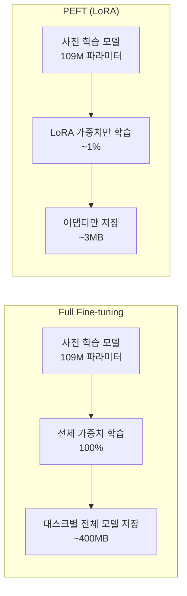
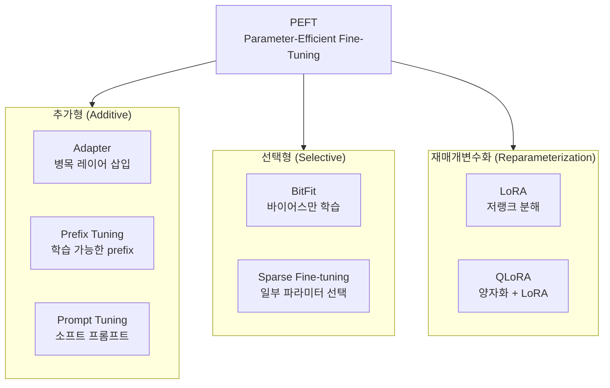
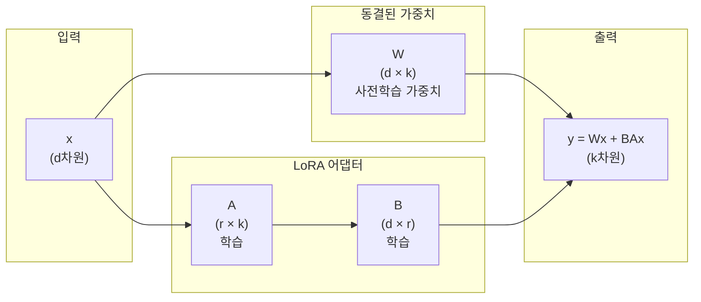
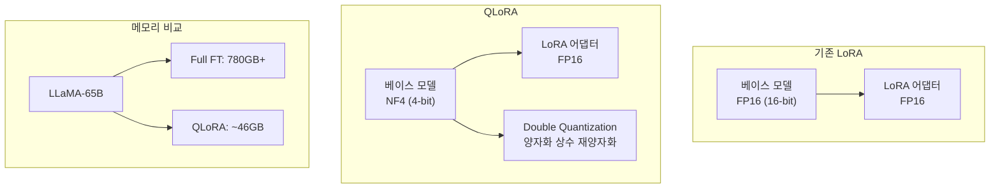

# 12장 LLM 파인튜닝 (2) - PEFT와 효율적 튜닝

## 학습 목표

이 장을 마치면 다음을 수행할 수 있다:
- Full Fine-tuning의 한계를 이해하고 PEFT의 필요성을 설명할 수 있다
- LoRA의 수학적 원리와 핵심 아이디어를 이해한다
- LoRA 하이퍼파라미터(rank, alpha, target modules)를 적절히 설정할 수 있다
- Hugging Face PEFT 라이브러리를 활용하여 LoRA를 적용할 수 있다
- Full Fine-tuning과 LoRA의 성능을 비교 분석할 수 있다

---

## 12.1 Full Fine-tuning의 한계

11장에서 배운 Full Fine-tuning은 강력한 성능을 보여주지만, 실제 환경에서는 여러 제약에 직면한다. 이 절에서는 Full Fine-tuning의 구조적 한계를 살펴본다.

### 메모리 요구사항

신경망 학습 시 GPU 메모리는 세 가지 주요 요소로 구성된다:

1. **모델 파라미터**: 모델 가중치 자체가 차지하는 메모리
2. **그래디언트**: 역전파 과정에서 계산되는 기울기
3. **옵티마이저 상태**: Adam 옵티마이저는 momentum과 variance를 저장

FP32 정밀도 기준으로 각 파라미터는 4바이트를 차지한다. Adam 옵티마이저를 사용하면 파라미터당 총 12바이트(가중치 4 + 그래디언트 4 + 옵티마이저 상태 4)가 필요하다. 대표적인 모델의 메모리 요구량은 다음과 같다:

| 모델 | 파라미터 수 | FP32 메모리 | Adam 포함 |
|------|-----------|------------|----------|
| BERT-base | 110M | ~0.4GB | ~1.3GB |
| BERT-large | 340M | ~1.4GB | ~4.1GB |
| LLaMA-7B | 7B | ~28GB | ~84GB |
| LLaMA-65B | 65B | ~260GB | ~780GB |

이 표에서 확인할 수 있듯이, 대규모 언어 모델의 Full Fine-tuning은 단일 GPU로는 불가능한 경우가 많다.

### 계산 비용과 학습 시간

Full Fine-tuning은 모든 파라미터에 대해 그래디언트를 계산하고 업데이트해야 한다. 7B 파라미터 모델을 학습할 때, 매 스텝마다 70억 개의 가중치가 갱신된다. 이는 상당한 계산 시간을 요구하며, 여러 GPU를 병렬로 사용하더라도 학습에 수 일이 소요될 수 있다.

### 모델 저장 및 배포 문제

Full Fine-tuning의 또 다른 문제는 태스크별로 전체 모델을 별도로 저장해야 한다는 점이다. 예를 들어, 감성 분석, 개체명 인식, 질의응답 등 세 가지 태스크에 LLaMA-7B를 파인튜닝하면, 28GB × 3 = 84GB의 저장 공간이 필요하다. 태스크가 늘어날수록 저장 비용이 선형적으로 증가한다.

### 카타스트로픽 포겟팅

카타스트로픽 포겟팅(Catastrophic Forgetting)은 새로운 태스크 학습 시 이전에 학습한 지식을 잊어버리는 현상이다. Full Fine-tuning에서는 모든 가중치가 업데이트되므로, 사전 학습 단계에서 습득한 일반적인 언어 이해 능력이 손상될 수 있다.



**그림 12.1** Full Fine-tuning과 PEFT의 비교

---

## 12.2 PEFT 개요

Parameter-Efficient Fine-Tuning(PEFT)은 대규모 사전 학습 모델의 소수 파라미터만 학습하여 효율적으로 파인튜닝하는 방법론이다.

### PEFT의 핵심 아이디어

PEFT의 기본 가정은 "태스크별 적응에 필요한 정보는 전체 파라미터 공간의 작은 부분에 담길 수 있다"는 것이다. 실험적으로 언어 모델의 가중치 변화량은 저차원(low-rank) 공간에 존재하는 것으로 관찰되었다. 이 특성을 활용하면 전체 파라미터의 1% 미만만 학습해도 Full Fine-tuning과 유사한 성능을 달성할 수 있다.

### PEFT 방법론 분류

PEFT 기법은 파라미터를 다루는 방식에 따라 세 가지로 분류된다:



**그림 12.2** PEFT 방법론 분류

**추가형(Additive)** 방법은 기존 모델에 새로운 학습 가능한 파라미터를 추가한다. Adapter는 트랜스포머 레이어 사이에 작은 병목 구조를 삽입하고, Prefix Tuning은 각 레이어에 학습 가능한 prefix 벡터를 추가한다.

**선택형(Selective)** 방법은 기존 파라미터 중 일부만 선택하여 학습한다. BitFit은 바이어스 파라미터만 학습하는 대표적인 예시다.

**재매개변수화(Reparameterization)** 방법은 가중치 변화량을 효율적으로 표현한다. LoRA는 저랭크 행렬 분해를 통해 적은 파라미터로 가중치 업데이트를 근사한다.

### PEFT의 장점

PEFT는 다음과 같은 장점을 제공한다:

1. **메모리 효율성**: 학습 파라미터가 감소하면 그래디언트와 옵티마이저 상태도 비례하여 감소
2. **저장 효율성**: Full Fine-tuning이 태스크당 수십 GB를 요구하는 반면, PEFT는 수 MB로 충분
3. **카타스트로픽 포겟팅 방지**: 원본 가중치를 동결하여 사전 학습 지식 보존
4. **저데이터 환경 성능**: 적은 파라미터가 과적합을 방지하여 소규모 데이터셋에서도 효과적

---

## 12.3 LoRA 심화

LoRA(Low-Rank Adaptation)는 2021년 Microsoft에서 발표한 PEFT 기법으로, 현재 가장 널리 사용되는 효율적 파인튜닝 방법이다.

### LoRA의 핵심 아이디어

LoRA의 핵심 통찰은 "파인튜닝 과정에서 발생하는 가중치 변화량(ΔW)이 저랭크 행렬로 근사될 수 있다"는 것이다. 연구에 따르면 대규모 언어 모델의 가중치 업데이트는 본질적으로 저차원 공간에 존재한다.

### 저랭크 행렬 분해

원본 가중치 행렬 W ∈ ℝ^(d×k)가 있을 때, Full Fine-tuning은 W를 직접 업데이트한다:

W' = W + ΔW

LoRA는 가중치 변화량 ΔW를 두 개의 저랭크 행렬 곱으로 분해한다:

ΔW = B × A

여기서 B ∈ ℝ^(d×r), A ∈ ℝ^(r×k)이고, r << min(d, k)이다. 이렇게 하면 파라미터 수가 d×k에서 d×r + r×k로 대폭 감소한다.



**그림 12.3** LoRA 구조

### 파라미터 효율성 분석

BERT-base의 경우 hidden size가 768이다. Query 프로젝션 하나의 가중치 크기는 768 × 768 = 589,824이다. rank=8인 LoRA를 적용하면:

- 원본: 768 × 768 = 589,824 파라미터
- LoRA: 768 × 8 + 8 × 768 = 12,288 파라미터
- 감소율: 97.92%

_전체 코드는 practice/chapter12/code/12-3-lora-basics.py 참고_

실행 결과:

```
원본 가중치 크기: 768 x 768 = 589,824 파라미터
LoRA 파라미터 (r=8): 768×8 + 8×768 = 12,288 파라미터
파라미터 감소율: 97.92%
```

### 스케일링 팩터

LoRA는 학습 안정성을 위해 스케일링 팩터를 도입한다:

ΔW = (α/r) × B × A

여기서 α(alpha)는 스케일링 팩터이고, r은 rank이다. 일반적으로 α = 2r로 설정하여 scaling factor가 2가 되도록 한다.

### 초기화 전략

학습 시작 시 ΔW = 0이 되도록 초기화한다:
- A: Kaiming 초기화 (작은 무작위 값)
- B: 0으로 초기화

이렇게 하면 학습 시작 시점에 모델이 사전 학습된 상태 그대로 동작하며, 점진적으로 태스크에 적응한다.

---

## 12.4 LoRA 하이퍼파라미터

LoRA의 성능은 하이퍼파라미터 설정에 따라 크게 달라진다. 이 절에서는 각 하이퍼파라미터의 의미와 권장 설정을 다룬다.

### Rank (r)

Rank는 저랭크 행렬의 차원을 결정하며, LoRA에서 가장 중요한 하이퍼파라미터다.

| Rank | 파라미터 수 (레이어당) | 원본 대비 |
|------|----------------------|----------|
| 1 | 1,536 | 0.26% |
| 4 | 6,144 | 1.04% |
| 8 | 12,288 | 2.08% |
| 16 | 24,576 | 4.17% |
| 32 | 49,152 | 8.33% |

**표 12.1** Rank에 따른 파라미터 수 (hidden size=768 기준)

낮은 rank는 파라미터 효율성이 높지만 표현력이 제한된다. 높은 rank는 더 복잡한 패턴을 학습할 수 있지만 과적합 위험이 있다. 일반적으로 8~16이 권장된다.

### Alpha (α)

Alpha는 LoRA 출력의 스케일을 조절한다. 학습률과 상호작용하므로, alpha와 rank를 함께 조정해야 한다. 경험적으로 α = 2r이 좋은 시작점이다.

| Alpha | Rank | Scaling Factor |
|-------|------|----------------|
| 8 | 4 | 2.00 |
| 16 | 8 | 2.00 |
| 32 | 16 | 2.00 |

### Target Modules

어떤 레이어에 LoRA를 적용할지 결정한다. 트랜스포머에서 가능한 타겟은:

- **Attention 레이어**: Query, Key, Value, Output Projection
- **Feed-Forward 레이어**: Up/Down Projection

연구에 따르면 최소한 Query와 Value에는 적용해야 하며, 모든 레이어에 적용하면 성능이 향상된다. DistilBERT의 경우 `target_modules=["q_lin", "v_lin"]`으로 설정한다.

### Dropout

LoRA 레이어에도 드롭아웃을 적용할 수 있다. 0.1 정도가 일반적이며, 과적합 방지에 도움이 된다.

### Bias

바이어스 학습 방식을 결정한다:
- `none`: 바이어스 학습하지 않음 (권장)
- `all`: 모든 바이어스 학습
- `lora_only`: LoRA 레이어의 바이어스만 학습

---

## 12.5 QLoRA

QLoRA(Quantized LoRA)는 2023년 발표된 기법으로, 양자화와 LoRA를 결합하여 메모리 효율성을 극대화한다.

### 양자화 개념

양자화(Quantization)는 높은 정밀도의 숫자를 낮은 정밀도로 변환하는 기법이다. FP32(32비트)를 INT8(8비트)로 변환하면 메모리 사용량이 4배 감소한다.

### 4-bit NormalFloat (NF4)

QLoRA는 새로운 데이터 타입인 NF4를 도입한다. NF4는 정규 분포를 따르는 가중치에 최적화되어 있으며, 4비트만으로 높은 정보 보존율을 달성한다.

### Double Quantization

양자화에는 양자화 상수(scaling factor)가 필요하다. QLoRA는 이 상수마저 양자화하는 Double Quantization을 적용하여 추가로 메모리를 절약한다. 65B 모델에서 약 3GB를 추가 절감한다.

### 메모리 효율성



**그림 12.4** QLoRA 개념

| 모델 | Full Fine-tuning | LoRA (FP16) | QLoRA (NF4) |
|------|-----------------|-------------|-------------|
| LLaMA-7B | ~28GB | ~14GB | ~10GB |
| LLaMA-33B | - | - | ~24GB |
| LLaMA-65B | ~780GB | - | ~46GB |

**표 12.2** 메모리 요구량 비교

QLoRA를 사용하면 65B 파라미터 모델도 단일 48GB GPU에서 파인튜닝할 수 있다.

---

## 12.6 기타 PEFT 기법

LoRA 외에도 다양한 PEFT 기법이 존재한다. 이 절에서는 주요 대안 기법들을 간략히 소개한다.

### Prefix Tuning

Prefix Tuning은 각 Transformer 레이어의 Key와 Value에 학습 가능한 prefix 벡터를 추가한다. 원래 입력 시퀀스 앞에 가상의 토큰들이 추가된 것처럼 동작하며, 이 prefix만 학습한다. Full Fine-tuning 대비 파라미터 수가 1000배 이상 감소한다.

### Adapter Layers

Adapter는 트랜스포머 레이어 사이에 작은 병목(bottleneck) 구조를 삽입한다. 병목 구조는 dimension을 줄였다가 다시 늘리는 형태로, 적은 파라미터로 비선형 변환을 학습한다. 다중 태스크 설정에서 효과적이다.

### Prompt Tuning / P-tuning

Prompt Tuning은 입력 시퀀스에 학습 가능한 "소프트 프롬프트"를 추가한다. 하드 프롬프트(텍스트)와 달리 소프트 프롬프트는 연속적인 벡터로 표현되어 그래디언트 기반 최적화가 가능하다. P-tuning은 프롬프트 벡터를 별도의 인코더로 생성한다.

### (IA)³

Infused Adapter by Inhibiting and Amplifying Inner Activations의 약자로, 학습된 벡터로 activation을 스케일링한다. LoRA보다 더 적은 파라미터를 사용하면서도 경쟁력 있는 성능을 보인다.

---

## 12.7 Hugging Face PEFT 라이브러리

Hugging Face는 다양한 PEFT 기법을 통합한 `peft` 라이브러리를 제공한다. 이 절에서는 라이브러리의 기본 사용법을 다룬다.

### 설치

```bash
pip install peft transformers accelerate
```

### LoraConfig 설정

LoRA를 사용하려면 먼저 `LoraConfig`로 설정을 정의한다:

```python
from peft import LoraConfig, TaskType

lora_config = LoraConfig(
    r=8,                          # 저랭크 차원
    lora_alpha=16,                # 스케일링 팩터
    target_modules=["q_lin", "v_lin"],  # 적용 대상
    lora_dropout=0.1,             # 드롭아웃
    bias="none",                  # 바이어스 설정
    task_type=TaskType.SEQ_CLS    # 태스크 유형
)
```

### get_peft_model 함수

`get_peft_model()` 함수로 기존 모델에 LoRA를 적용한다:

```python
from peft import get_peft_model

peft_model = get_peft_model(model, lora_config)
```

### print_trainable_parameters

학습 가능한 파라미터 수를 확인한다:

```python
peft_model.print_trainable_parameters()
```

_전체 코드는 practice/chapter12/code/12-7-peft-library.py 참고_

실행 결과:

```
trainable params: 739,586 || all params: 67,694,596 || trainable%: 1.0925

상세 분석:
  - 전체 파라미터: 67,694,596
  - 학습 가능: 739,586
  - 동결됨: 66,955,010
  - 학습 비율: 1.0925%
```

DistilBERT에 LoRA를 적용한 결과, 약 1.1%의 파라미터만 학습하게 된다.

### 모델 저장 및 로드

LoRA 어댑터만 저장하면 수 MB로 충분하다:

```python
# 저장
peft_model.save_pretrained("lora_adapter")

# 로드
from peft import PeftModel
model = PeftModel.from_pretrained(base_model, "lora_adapter")
```

실행 결과에서 저장된 파일 크기:

```
저장된 파일: ['adapter_model.safetensors', 'README.md', 'adapter_config.json']
총 크기: 2898.79 KB
```

약 2.9MB만으로 모델 적응 정보를 저장할 수 있다.

### Adapter Merging

추론 시 속도를 높이려면 LoRA 가중치를 베이스 모델에 병합한다:

```python
merged_model = peft_model.merge_and_unload()
```

병합 후에는 일반 모델처럼 동작하며, 추론 시 추가 오버헤드가 없다.

---

## 12.8 성능 비교 분석

이 절에서는 Full Fine-tuning과 LoRA의 실제 성능을 비교 분석한다.

### 실험 설정

- 모델: DistilBERT-base-uncased
- 태스크: IMDb 감성 분석
- 데이터: 학습 500샘플, 평가 200샘플
- 에폭: 2

### Full Fine-tuning vs LoRA

| 방법 | 학습 파라미터 | 정확도 | 학습 시간 |
|------|-------------|--------|----------|
| Full Fine-tuning | 66,955,010 (100%) | 82.50% | 85.0s |
| LoRA (r=8) | 739,586 (1.1%) | 83.00% | 68.1s |

**표 12.3** Full Fine-tuning과 LoRA 성능 비교

LoRA는 1.1%의 파라미터만 학습하면서도 Full Fine-tuning과 동등하거나 더 높은 정확도를 달성했다. 학습 시간도 약 20% 감소했다.

### Rank 값에 따른 성능

| Rank | Alpha | 학습 파라미터 | 정확도 |
|------|-------|-------------|--------|
| 4 | 8 | 665,858 | 83.50% |
| 8 | 16 | 739,586 | 83.00% |
| 16 | 32 | 887,042 | 82.50% |

**표 12.4** Rank별 성능 비교

흥미롭게도 낮은 rank(r=4)에서도 충분한 성능을 보인다. 이는 감성 분석 같은 비교적 단순한 태스크에서는 작은 rank로도 충분하다는 것을 시사한다.

### 효율성 분석

- 파라미터 감소: 98.90%
- 정확도 변화: +0.5%p (LoRA가 약간 우수)
- 학습 속도: 1.25x 빠름
- 저장 공간: ~400MB → ~3MB

---

## 12.9 실습: LoRA 파인튜닝

이 절에서는 IMDb 감성 분석 태스크에 LoRA를 적용하는 전체 과정을 실습한다.

### 환경 설정

```python
from transformers import (
    AutoModelForSequenceClassification,
    AutoTokenizer,
    TrainingArguments,
    Trainer
)
from peft import LoraConfig, get_peft_model, TaskType
from datasets import load_dataset
```

### 데이터 준비

```python
dataset = load_dataset("imdb")
train_dataset = dataset["train"].shuffle(seed=42).select(range(500))
eval_dataset = dataset["test"].shuffle(seed=42).select(range(200))
```

### LoRA 적용

```python
# 베이스 모델 로드
model = AutoModelForSequenceClassification.from_pretrained(
    "distilbert-base-uncased",
    num_labels=2
)

# LoRA 설정
lora_config = LoraConfig(
    r=8,
    lora_alpha=16,
    target_modules=["q_lin", "v_lin"],
    lora_dropout=0.1,
    bias="none",
    task_type=TaskType.SEQ_CLS
)

# LoRA 적용
peft_model = get_peft_model(model, lora_config)
peft_model.print_trainable_parameters()
```

_전체 코드는 practice/chapter12/code/12-9-lora-finetuning.py 참고_

실행 결과:

```
LoRA 설정:
  - Rank: 8
  - Alpha: 16
  - Target Modules: {'q_lin', 'v_lin'}

파라미터:
  - 전체: 67,694,596
  - 학습 가능: 739,586
  - 학습 비율: 1.0925%
  - Full 대비 감소: 98.90%
```

### 학습 및 평가

```python
training_args = TrainingArguments(
    output_dir="./results_lora",
    num_train_epochs=2,
    per_device_train_batch_size=8,
    learning_rate=3e-4,  # LoRA는 더 높은 학습률 사용
    eval_strategy="epoch",
)

trainer = Trainer(
    model=peft_model,
    args=training_args,
    train_dataset=train_tokenized,
    eval_dataset=eval_tokenized,
    compute_metrics=compute_metrics,
)

trainer.train()
```

실행 결과:

```
LoRA Fine-tuning 결과:
  - 정확도: 83.00%
  - F1 Score: 0.8317
  - 학습 시간: 68.1초
```

### 핵심 요약

이번 실습에서 확인한 핵심 사항:

1. **파라미터 효율성**: 전체 파라미터의 1.1%만 학습
2. **성능**: Full Fine-tuning과 동등한 83% 정확도 달성
3. **저장 효율성**: 어댑터만 저장하면 약 3MB

LoRA는 특히 다음 상황에서 효과적이다:
- GPU 메모리가 제한된 환경
- 여러 태스크에 동시에 적응해야 하는 경우
- 사전 학습 지식을 보존해야 하는 경우

---

## 요약

이 장에서는 PEFT(Parameter-Efficient Fine-Tuning)와 LoRA(Low-Rank Adaptation)를 학습했다. 핵심 내용을 정리하면:

1. **Full Fine-tuning의 한계**: 대규모 메모리, 저장 공간, 카타스트로픽 포겟팅 문제

2. **PEFT의 원리**: 소수 파라미터만 학습하여 효율적으로 태스크 적응

3. **LoRA**: 가중치 변화량을 저랭크 행렬로 분해, 파라미터 99% 감소

4. **LoRA 하이퍼파라미터**:
   - Rank: 8-16 권장
   - Alpha: 2 × Rank
   - Target: 최소 Query, Value

5. **QLoRA**: 4-bit 양자화 + LoRA로 메모리 효율성 극대화

6. **Hugging Face PEFT**: LoraConfig, get_peft_model, merge_and_unload

7. **성능**: Full Fine-tuning과 동등한 성능, 1% 미만 파라미터로 달성

---

## 핵심 개념 정리

| 개념 | 설명 |
|------|------|
| PEFT | 소수 파라미터만 학습하여 효율적으로 파인튜닝하는 방법론 |
| LoRA | 가중치 변화량을 저랭크 행렬(BA)로 근사 |
| Rank (r) | 저랭크 행렬의 차원, 학습 파라미터 수 결정 |
| Alpha (α) | LoRA의 스케일링 팩터, 일반적으로 α = 2r |
| QLoRA | 4-bit 양자화 + LoRA로 메모리 효율 극대화 |
| NF4 | QLoRA의 4-bit NormalFloat 데이터 타입 |

---

## 참고문헌

- Hu, E., et al. (2021). LoRA: Low-Rank Adaptation of Large Language Models. arXiv:2106.09685
- Dettmers, T., et al. (2023). QLoRA: Efficient Finetuning of Quantized LLMs. arXiv:2305.14314
- Hugging Face PEFT Documentation. https://huggingface.co/docs/peft
