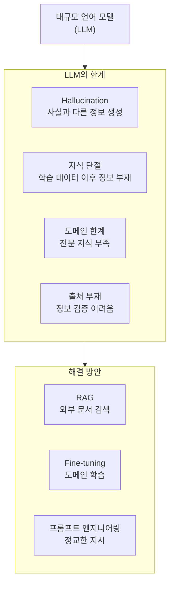
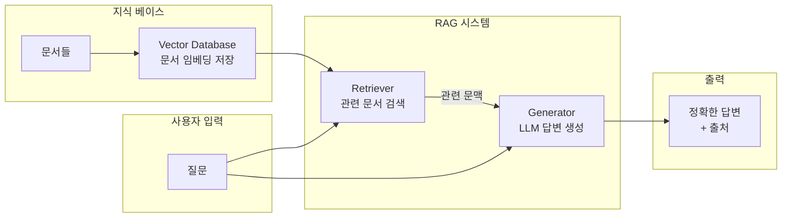
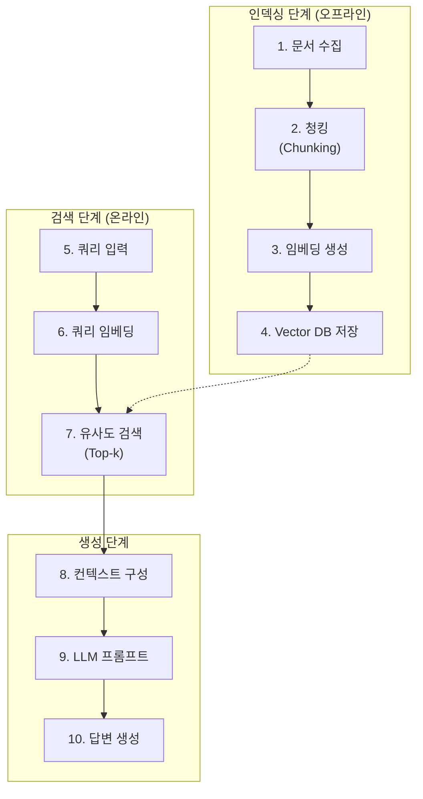
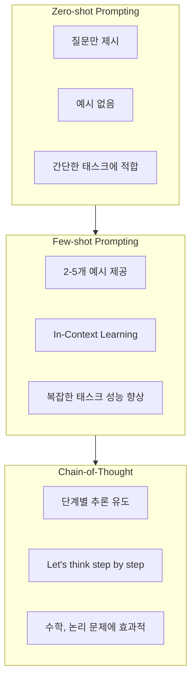

# 13장 LLM 고급 응용 - RAG와 프롬프트 엔지니어링

## 학습 목표

이 장을 마치면 다음을 수행할 수 있다:
- LLM의 한계(Hallucination, 지식 한계)를 이해하고 해결 방안을 설명할 수 있다
- RAG(검색 증강 생성)의 개념과 구성 요소를 이해한다
- Vector Database의 원리와 FAISS를 활용할 수 있다
- LangChain을 활용하여 간단한 RAG 시스템을 구현할 수 있다
- 효과적인 프롬프트 엔지니어링 기법을 적용할 수 있다

---

## 13.1 LLM의 한계

대규모 언어 모델(LLM)은 놀라운 성능을 보여주지만, 실제 응용에서는 여러 한계에 직면한다. 이 절에서는 LLM의 주요 한계점과 그 해결 방안을 살펴본다.

### Hallucination (환각) 문제

Hallucination은 LLM이 사실과 다른 정보를 그럴듯하게 생성하는 현상이다. 모델은 학습 데이터의 패턴을 기반으로 텍스트를 생성하므로, 실제로 존재하지 않는 논문을 인용하거나 잘못된 역사적 사실을 설명할 수 있다. 이는 LLM이 "아는 것"과 "생성하는 것"이 다르기 때문에 발생한다.

### 지식의 한계 (Training Cutoff)

LLM은 학습 데이터의 마감 시점(cutoff date) 이후의 정보를 알 수 없다. 2023년에 학습을 완료한 모델은 2024년에 발생한 사건에 대해 정확히 답변할 수 없다. 실시간 정보가 필요한 응용에서 이는 심각한 제약이 된다.

### 도메인 특화 지식 부족

일반 목적으로 학습된 LLM은 특정 도메인(의료, 법률, 금융 등)의 전문 지식이 부족할 수 있다. 사내 문서, 제품 매뉴얼, 연구 자료 등 비공개 데이터에 대한 지식은 원천적으로 갖추지 못한다.

### 출처 검증의 어려움

LLM은 답변의 출처를 명시하지 않으며, 정보의 신뢰성을 검증하기 어렵다. 중요한 의사결정에 LLM을 활용할 때 이는 큰 문제가 된다.



**그림 13.1** LLM의 한계와 해결 방안

---

## 13.2 RAG 개요

RAG(Retrieval-Augmented Generation)는 검색과 생성을 결합하여 LLM의 한계를 보완하는 기법이다.

### RAG의 정의

RAG는 2020년 Meta AI 연구팀이 발표한 기법으로, 질문에 답변하기 전에 외부 지식 베이스에서 관련 정보를 검색하여 LLM의 입력에 추가한다. 이를 통해 모델이 학습하지 않은 최신 정보나 도메인 특화 지식을 활용할 수 있다.

### RAG vs Fine-tuning

| 항목 | RAG | Fine-tuning |
|------|-----|-------------|
| 지식 업데이트 | 문서 추가로 즉시 반영 | 재학습 필요 |
| 비용 | 낮음 (검색만 수행) | 높음 (GPU 학습) |
| 최신 정보 | 실시간 반영 가능 | 학습 시점에 고정 |
| 출처 추적 | 검색 문서로 확인 가능 | 불가능 |
| 적합한 상황 | 지식 검색, Q&A | 스타일 학습, 태스크 특화 |

**표 13.1** RAG와 Fine-tuning 비교

RAG는 지식을 업데이트해야 하거나 출처 추적이 필요한 경우 적합하다. Fine-tuning은 특정 문체나 태스크에 모델을 적응시킬 때 효과적이다. 두 기법을 조합하면 최적의 성능을 달성할 수 있다.

### RAG의 장점

1. **최신 정보 활용**: 문서만 업데이트하면 최신 정보 반영
2. **도메인 지식 주입**: 전문 문서를 지식 베이스에 추가
3. **Hallucination 감소**: 검색된 문서에 기반한 답변 생성
4. **출처 추적 가능**: 답변의 근거 문서 제시



**그림 13.2** RAG 시스템 개요

---

## 13.3 RAG 시스템 구성 요소

RAG 시스템은 세 가지 핵심 구성 요소로 이루어진다.

### Retriever (검색기)

Retriever는 사용자 질문과 관련된 문서를 지식 베이스에서 검색한다. 주로 벡터 유사도 기반 검색을 사용하며, 질문을 임베딩 벡터로 변환한 후 가장 유사한 문서 벡터를 찾는다. 효과적인 Retriever는 RAG 시스템 성능의 핵심이다.

### Generator (생성기)

Generator는 검색된 문서와 원래 질문을 함께 받아 답변을 생성하는 LLM이다. 검색된 문맥을 기반으로 정확하고 관련성 높은 답변을 생성한다. GPT, Claude, LLaMA 등 다양한 LLM을 Generator로 사용할 수 있다.

### Knowledge Base (지식 베이스)

Knowledge Base는 검색 대상 문서들의 저장소이다. 문서는 임베딩 벡터로 변환되어 Vector Database에 저장된다. 지식 베이스의 품질과 범위가 RAG 시스템의 답변 품질을 결정한다.

---

## 13.4 Vector Database

Vector Database는 고차원 벡터를 효율적으로 저장하고 유사도 검색을 수행하는 특화된 데이터베이스이다.

### 벡터 임베딩의 개념

텍스트를 고차원 벡터로 변환하면 의미적 유사성을 수치로 측정할 수 있다. Sentence Transformers와 같은 임베딩 모델은 문장을 384차원 또는 768차원 벡터로 변환한다.

_전체 코드는 practice/chapter13/code/13-4-vector-database.py 참고_

```python
from sentence_transformers import SentenceTransformer

model = SentenceTransformer('all-MiniLM-L6-v2')
embeddings = model.encode(sentences)
```

실행 결과:

```
문장 수: 6
임베딩 차원: 384
임베딩 타입: float32
```

### 유사도 측정

**코사인 유사도(Cosine Similarity)**: 두 벡터의 방향 유사성을 측정한다. 값이 1에 가까울수록 유사하다.

**유클리드 거리(L2 Distance)**: 두 벡터 간의 직선 거리를 측정한다. 값이 작을수록 유사하다.

실행 결과:

```
쿼리: 'AI와 기계학습에 대해 알려줘'

문장                                 | 코사인 유사도 | L2 거리
인공지능이 세상을 바꾸고 있다.           |      0.5282 |  0.9714
머신러닝은 데이터에서 패턴을 학습한다.    |      0.4786 |  1.0212
자연어처리는 텍스트를 이해한다.          |      0.6080 |  0.8854

가장 유사한 문장: '자연어처리는 텍스트를 이해한다.' (유사도: 0.6080)
```

### FAISS

FAISS(Facebook AI Similarity Search)는 Meta AI Research가 개발한 효율적인 유사도 검색 라이브러리이다. 수십억 개의 벡터에서 밀리초 단위로 검색이 가능하다.

```python
import faiss

# IndexFlatL2: 정확한 L2 거리 기반 검색
index = faiss.IndexFlatL2(d)  # d: 벡터 차원
index.add(embeddings)

# 검색
distances, indices = index.search(query_vec, k=3)
```

### FAISS 인덱스 타입

| 인덱스 | 특징 | 적합한 상황 |
|--------|------|------------|
| IndexFlatL2 | 정확, 느림 | 소규모 (~10K) |
| IndexIVFFlat | 근사, 빠름 | 대규모 (~1M) |
| IndexHNSWFlat | 균형 | 중대규모 |

**표 13.2** FAISS 인덱스 비교

실행 결과:

```
테스트 데이터: 10000개 벡터, 384차원

인덱스 타입          |    검색 시간
IndexFlatL2         |      0.365ms
IndexIVFFlat        |      0.164ms
IndexHNSWFlat       |      0.158ms
```

---

## 13.5 RAG 파이프라인

RAG 파이프라인은 인덱싱 단계와 검색/생성 단계로 구성된다.

### 인덱싱 단계 (오프라인)

1. **문서 수집**: PDF, 텍스트, 웹 페이지 등 다양한 소스에서 문서 수집
2. **청킹(Chunking)**: 문서를 적절한 크기의 청크로 분할. 일반적으로 200~500자
3. **임베딩 생성**: 각 청크를 벡터로 변환
4. **Vector DB 저장**: 임베딩 벡터를 데이터베이스에 저장

### 검색/생성 단계 (온라인)

5. **쿼리 임베딩**: 사용자 질문을 벡터로 변환
6. **유사도 검색**: Vector DB에서 유사한 청크 검색 (Top-k)
7. **컨텍스트 구성**: 검색된 청크들을 프롬프트에 추가
8. **답변 생성**: LLM이 컨텍스트 기반 답변 생성



**그림 13.3** RAG 파이프라인

---

## 13.6 LangChain 소개

LangChain은 LLM 애플리케이션 개발을 위한 프레임워크로, RAG 시스템 구축에 필요한 다양한 컴포넌트를 제공한다.

### 핵심 컴포넌트

**Document Loaders**: 다양한 형식의 문서를 로드한다.

```python
from langchain_community.document_loaders import TextLoader
loader = TextLoader("document.txt")
documents = loader.load()
```

**Text Splitters**: 문서를 청크로 분할한다.

```python
from langchain_text_splitters import RecursiveCharacterTextSplitter

text_splitter = RecursiveCharacterTextSplitter(
    chunk_size=200,
    chunk_overlap=50
)
chunks = text_splitter.split_documents(documents)
```

**Embeddings**: 임베딩 모델을 래핑한다.

```python
from langchain_huggingface import HuggingFaceEmbeddings
embeddings = HuggingFaceEmbeddings(model_name="all-MiniLM-L6-v2")
```

**Vector Stores**: FAISS, Chroma 등을 통합한다.

```python
from langchain_community.vectorstores import FAISS
vectorstore = FAISS.from_documents(chunks, embeddings)
```

**Retrievers**: 검색 인터페이스를 제공한다.

```python
retriever = vectorstore.as_retriever(search_kwargs={"k": 3})
docs = retriever.invoke("질문")
```

_전체 코드는 practice/chapter13/code/13-6-langchain-basics.py 참고_

실행 결과:

```
원본 문서 수: 1
분할된 청크 수: 5
청크 크기 설정: 200
청크 중첩: 50

쿼리: 'BERT와 GPT의 차이점은?'
검색 결과 (Top-3):
  1. (점수: 0.7382) ## BERT와 GPT...
  2. (점수: 1.0059) ## Transformer 아키텍처...
  3. (점수: 1.4358) # 딥러닝 자연어처리 개요...
```

### Vector Store 저장 및 로드

```python
# 저장
vectorstore.save_local("faiss_index")

# 로드
loaded_vectorstore = FAISS.load_local(
    "faiss_index", embeddings,
    allow_dangerous_deserialization=True
)
```

실행 결과:

```
저장된 파일: ['index.faiss', 'index.pkl']
Vector Store 로드 완료
```

---

## 13.7 프롬프트 엔지니어링 심화

프롬프트 엔지니어링은 LLM에서 원하는 출력을 얻기 위해 입력을 최적화하는 기법이다.

### Zero-shot Prompting

예시 없이 직접 질문하는 방식이다. 간단한 태스크에 적합하다.

```
질문: Transformer의 핵심 메커니즘은 무엇인가요?
답변:
```

### Few-shot Prompting

몇 개의 예시를 제공하여 모델을 안내하는 방식이다. In-Context Learning을 활용한다.

```
Q: CNN이란 무엇인가요?
A: CNN은 이미지 처리에 특화된 신경망으로, 합성곱 연산을 사용합니다.

Q: RNN이란 무엇인가요?
A: RNN은 순차 데이터 처리를 위한 신경망으로, 순환 구조를 가집니다.

Q: Transformer란 무엇인가요?
A:
```

### Chain-of-Thought (CoT) Prompting

단계별 추론을 유도하는 기법이다. "Let's think step by step"을 추가하면 모델이 논리적으로 문제를 풀어나간다.

```
문제: 15% 할인된 가격이 85,000원이라면 원래 가격은?

단계별로 풀어보겠습니다:
1. 할인율이 15%이므로 현재 가격은 원래 가격의 85%입니다.
2. 85,000 = 원래 가격 × 0.85
3. 원래 가격 = 85,000 ÷ 0.85 = 100,000원

따라서 원래 가격은 100,000원입니다.
```

CoT는 100B+ 파라미터 모델에서 효과적이며, 수학, 논리, 추론 문제에서 성능을 크게 향상시킨다.



**그림 13.4** 프롬프트 기법 계층

### 고급 기법

**Self-Consistency**: 여러 번 추론하여 가장 일관된 답변 선택
**Tree of Thoughts**: 트리 구조로 여러 추론 경로 탐색
**Auto-CoT**: LLM이 자동으로 CoT 예시 생성

---

## 13.8 API 기반 LLM 활용

실제 RAG 시스템에서는 외부 LLM API를 Generator로 활용하는 경우가 많다.

### 주요 API

**OpenAI API**: GPT-4, GPT-4o 모델 제공. 강력한 성능과 안정성.

**Anthropic Claude API**: Claude 3.5 Sonnet, Claude 3 Opus 등. 긴 컨텍스트 지원.

**Google Gemini API**: Gemini Pro 등. 멀티모달 지원.

### API 사용 시 고려사항

1. **API Key 보안**: 환경 변수로 관리, 코드에 직접 포함 금지
2. **Rate Limiting**: API 호출 횟수 제한 준수
3. **비용 관리**: 토큰 수에 따른 과금, 프롬프트 최적화로 비용 절감
4. **스트리밍**: 긴 응답은 스트리밍으로 사용자 경험 개선

---

## 13.9 실습: RAG 시스템 구현

이 절에서는 LangChain과 FAISS를 활용하여 간단한 문서 기반 Q&A 시스템을 구현한다.

_전체 코드는 practice/chapter13/code/13-9-rag-system.py 참고_

### 지식 베이스 준비

딥러닝 자연어처리에 관한 FAQ 문서를 지식 베이스로 사용한다.

실행 결과:

```
지식 베이스 문서 크기: 1351 문자
```

### 문서 처리 파이프라인

```python
# 1. 문서 로드
loader = TextLoader(kb_file, encoding="utf-8")
documents = loader.load()

# 2. 청킹
text_splitter = RecursiveCharacterTextSplitter(
    chunk_size=300, chunk_overlap=50
)
chunks = text_splitter.split_documents(documents)

# 3. 임베딩 및 Vector Store 생성
embeddings = HuggingFaceEmbeddings(model_name="all-MiniLM-L6-v2")
vectorstore = FAISS.from_documents(chunks, embeddings)
```

실행 결과:

```
1. 문서 로드 완료: 1개
2. 청킹 완료: 6개 청크
3. 임베딩 모델 로드 완료: all-MiniLM-L6-v2
4. Vector Store 생성 완료: 6개 문서 색인
```

### RAG 검색 테스트

```python
retriever = vectorstore.as_retriever(search_kwargs={"k": 3})

questions = [
    "BERT와 GPT의 차이점은 무엇인가요?",
    "LoRA가 무엇인지 설명해주세요.",
    "RAG 시스템은 어떻게 작동하나요?",
]

for q in questions:
    docs = retriever.invoke(q)
    print(f"질문: {q}")
    print(f"검색된 문서 수: {len(docs)}")
```

실행 결과:

```
질문: BERT와 GPT의 차이점은 무엇인가요?
검색된 문서 수: 3
관련 문맥:
  ## Q2: BERT와 GPT의 차이점은?
  BERT는 양방향 인코더 구조...
  GPT는 자기회귀 디코더 구조...

질문: LoRA가 무엇인지 설명해주세요.
검색된 문서 수: 3
관련 문맥:
  ## Q4: LoRA란?
  LoRA(Low-Rank Adaptation)는 PEFT의 대표적인 기법이다...
```

### RAG 프롬프트 템플릿

```python
rag_prompt = f"""당신은 딥러닝 전문가입니다.
제공된 문맥을 기반으로 정확하고 상세하게 답변하세요.
문맥에 없는 내용은 추측하지 마세요.

### 문맥:
{context}

### 질문:
{query}

### 답변:"""
```

---

## 요약

이 장에서는 RAG(Retrieval-Augmented Generation)와 프롬프트 엔지니어링을 학습했다. 핵심 내용을 정리하면:

1. **LLM의 한계**: Hallucination, 지식 단절, 도메인 한계, 출처 부재

2. **RAG 개념**: 검색 + 생성 결합으로 LLM 한계 보완

3. **Vector Database**:
   - FAISS: 효율적인 유사도 검색
   - 코사인 유사도, L2 거리

4. **RAG 파이프라인**:
   - 인덱싱: 청킹 → 임베딩 → 저장
   - 검색/생성: 쿼리 임베딩 → 유사도 검색 → 답변 생성

5. **LangChain**: Document Loaders, Text Splitters, Vector Stores, Retrievers

6. **프롬프트 엔지니어링**:
   - Zero-shot: 예시 없이 직접 질문
   - Few-shot: 예시 제공
   - Chain-of-Thought: 단계별 추론 유도

---

## 핵심 개념 정리

| 개념 | 설명 |
|------|------|
| RAG | 검색 증강 생성, 외부 문서 검색 + LLM 생성 결합 |
| Vector Database | 임베딩 벡터 저장 및 유사도 검색 데이터베이스 |
| FAISS | Facebook AI Similarity Search, 효율적 검색 라이브러리 |
| LangChain | LLM 애플리케이션 개발 프레임워크 |
| Chunking | 문서를 적절한 크기로 분할하는 과정 |
| CoT Prompting | 단계별 추론을 유도하는 프롬프트 기법 |

---

## 참고문헌

- Lewis, P., et al. (2020). Retrieval-Augmented Generation for Knowledge-Intensive NLP Tasks. NeurIPS.
- LangChain Documentation. https://python.langchain.com/docs
- FAISS Documentation. https://faiss.ai
- Wei, J., et al. (2022). Chain-of-Thought Prompting Elicits Reasoning in Large Language Models. NeurIPS.
