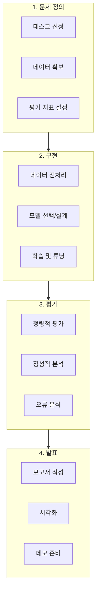
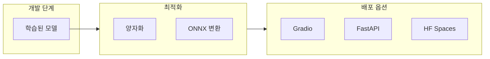
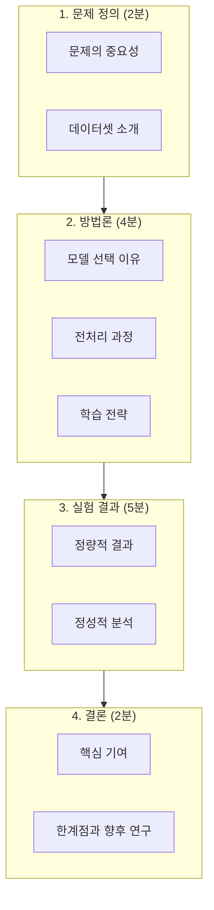

# 14장 최종 프로젝트 개발 및 발표 준비

## 학습 목표

이 장을 마치면 다음을 수행할 수 있다:
- NLP 프로젝트의 평가 지표를 적절히 선택하고 계산할 수 있다
- 학습 결과를 효과적으로 시각화하고 해석할 수 있다
- 모델 배포와 최적화의 기본 개념을 이해한다
- 체계적인 프로젝트 보고서와 발표 자료를 작성할 수 있다

---

## 14.1 프로젝트 발표 가이드라인

NLP 프로젝트는 문제 정의에서 모델 배포까지 체계적인 과정을 따른다. 이 절에서는 프로젝트의 전체 구조와 평가 기준을 설명한다.

### 프로젝트 워크플로우

NLP 프로젝트는 네 가지 핵심 단계로 구성된다.



**그림 14.1** NLP 프로젝트 워크플로우

### 프로젝트 유형별 접근

**텍스트 분류 프로젝트**: 감성 분석, 주제 분류, 스팸 탐지 등이 해당한다. BERT 계열 모델을 Fine-tuning하거나 LoRA를 적용하는 것이 일반적이다. 평가 지표로 Accuracy, F1-Score, Confusion Matrix를 사용한다.

**텍스트 생성 프로젝트**: 요약, 번역, 챗봇 등이 해당한다. GPT 계열 모델을 활용하며, BLEU, ROUGE, 사람 평가를 통해 품질을 측정한다.

**RAG 기반 Q&A 프로젝트**: 문서 기반 질의응답 시스템을 구축한다. 검색 정확도와 생성 품질을 모두 평가해야 한다.

### 평가 기준

| 항목 | 비중 | 세부 내용 |
|------|------|----------|
| 기술적 구현 | 40% | 모델 선택, 학습 전략, 코드 품질 |
| 결과 분석 | 30% | 정량적 평가, 오류 분석, 인사이트 |
| 문서화/발표 | 30% | 보고서 구성, 시각화, 발표 스킬 |

**표 14.1** 프로젝트 평가 기준

---

## 14.2 모델 평가 및 보고서 작성

모델의 성능을 객관적으로 평가하고 체계적인 보고서를 작성하는 것은 프로젝트의 핵심이다.

### 분류 평가 지표

_전체 코드는 practice/chapter14/code/14-3-visualization.py 참고_

```python
from sklearn.metrics import accuracy_score, f1_score, classification_report

accuracy = accuracy_score(y_true, y_pred)
f1_macro = f1_score(y_true, y_pred, average='macro')
print(classification_report(y_true, y_pred, target_names=class_names))
```

실행 결과:

```
정확도 (Accuracy): 0.7500
정밀도 (Precision, Macro): 0.7488
재현율 (Recall, Macro): 0.7361
F1 점수 (F1-Score, Macro): 0.7392

              precision    recall  f1-score   support

          부정       0.80      0.67      0.73         6
          중립       0.57      0.67      0.62         6
          긍정       0.88      0.88      0.88         8

    accuracy                           0.75        20
```

**Precision (정밀도)**: 모델이 긍정으로 예측한 것 중 실제로 긍정인 비율이다. TP / (TP + FP)로 계산한다.

**Recall (재현율)**: 실제 긍정 중에서 모델이 찾아낸 비율이다. TP / (TP + FN)으로 계산한다.

**F1-Score**: Precision과 Recall의 조화 평균이다. 두 지표의 균형을 맞출 때 사용한다.

### 생성 평가 지표

**BLEU (Bilingual Evaluation Understudy)**: 기계 번역 평가의 표준 지표다. N-gram 정밀도를 기반으로 하며, 생성된 텍스트가 참조 텍스트와 얼마나 유사한지 측정한다. 짧은 문장에 대한 페널티(Brevity Penalty)를 포함한다.

**ROUGE (Recall-Oriented Understudy for Gisting Evaluation)**: 텍스트 요약 평가에 주로 사용한다. 재현율 중심이며, ROUGE-1(단어), ROUGE-2(2-gram), ROUGE-L(최장 공통 부분 수열)이 대표적이다.

```
[ROUGE Score 계산 원리]
예측: '딥러닝은 인공지능의 한 분야로 신경망을 사용한다.'
참조: '딥러닝은 인공지능의 핵심 분야로 다층 신경망을 활용한다.'

공통 단어: 딥러닝은, 인공지능의, 분야로, 신경망
ROUGE-1 ≈ 0.67 (공통 단어 비율)
```

### 오류 분석 (Error Analysis)

단순히 정확도만 보는 것은 부족하다. 오류 분석을 통해 모델의 약점을 파악해야 한다.

1. **오류 유형 분류**: 어떤 종류의 오류가 많은지 분석한다
2. **오분류 사례 검토**: 대표적인 오분류 사례를 상세히 분석한다
3. **패턴 발견**: 특정 조건에서 오류가 많은지 확인한다
4. **개선 방향 도출**: 분석 결과를 바탕으로 개선 전략을 수립한다

### Ablation Study

Ablation Study는 모델의 각 구성 요소가 성능에 미치는 영향을 분석하는 실험이다.

| 설정 | Accuracy | F1-Score |
|------|----------|----------|
| Full Model (BERT + LoRA) | 0.85 | 0.84 |
| w/o LoRA (Frozen BERT) | 0.72 | 0.70 |
| w/o Pre-training | 0.45 | 0.42 |

**표 14.2** Ablation Study 예시

---

## 14.3 시각화 및 결과 해석

효과적인 시각화는 결과를 명확하게 전달하고 인사이트를 도출하는 데 필수적이다.

### 학습 곡선 시각화

학습 과정에서 Loss와 Accuracy의 변화를 추적한다.

```python
import matplotlib.pyplot as plt

plt.plot(epochs, train_loss, 'b-', label='Train Loss')
plt.plot(epochs, val_loss, 'r-', label='Validation Loss')
plt.xlabel('Epoch')
plt.ylabel('Loss')
plt.legend()
```

실행 결과:

```
최종 Train Loss: 0.3474
최종 Validation Loss: 0.6538
최종 Train Accuracy: 0.9852
최종 Validation Accuracy: 0.9768
Best Epoch: 15 (가장 낮은 Validation Loss 기준)
```

학습 곡선에서 주의할 패턴:
- **Train Loss만 감소**: 과적합 발생, Early Stopping 필요
- **둘 다 높음**: 학습 부족, 에폭 수 증가 또는 모델 용량 확대
- **진동**: 학습률이 너무 높음, 학습률 감소 필요

### Confusion Matrix 시각화

```
Confusion Matrix:
[[4 2 0]
 [1 4 1]
 [0 1 7]]

정규화 Confusion Matrix:
[[0.67 0.33 0.  ]
 [0.17 0.67 0.17]
 [0.   0.12 0.88]]
```

Confusion Matrix 해석:
- 대각선: 정확하게 분류된 샘플
- 비대각선: 오분류된 샘플
- 행(row): 실제 레이블
- 열(column): 예측 레이블

### 임베딩 시각화

고차원 임베딩을 2차원으로 축소하여 시각화한다.

**t-SNE (t-Distributed Stochastic Neighbor Embedding)**: 로컬 구조 보존에 집중한다. perplexity 파라미터가 중요하며, 일반적으로 5~50 사이 값을 사용한다.

**UMAP (Uniform Manifold Approximation and Projection)**: t-SNE보다 빠르고 글로벌 구조도 어느 정도 보존한다. n_neighbors와 min_dist 파라미터를 조정한다.

```python
from sklearn.manifold import TSNE

tsne = TSNE(n_components=2, random_state=42, perplexity=30)
embeddings_2d = tsne.fit_transform(embeddings)
```

실행 결과:

```
원본 임베딩 형태: (150, 384)
t-SNE 차원 축소 중...
축소된 임베딩 형태: (150, 2)
```

---

## 14.4 실무 적용 시 고려사항

학습된 모델을 실제 서비스에 적용할 때 고려해야 할 사항을 설명한다.

### 모델 배포 전략



**그림 14.2** 모델 배포 파이프라인

**Gradio**: 몇 줄의 코드로 인터랙티브 데모를 만들 수 있다. Python만 알면 되며, Hugging Face Spaces에 무료로 배포할 수 있다.

**FastAPI**: 고성능 REST API를 구축한다. 비동기 처리를 지원하며 자동으로 API 문서를 생성한다.

**Hugging Face Spaces**: Gradio나 Streamlit 앱을 무료로 호스팅한다. GPU도 사용 가능하다(유료).

### Gradio 데모 예시

_전체 코드는 practice/chapter14/code/14-4-deployment-demo.py 참고_

```python
import gradio as gr

def predict(text):
    # 감성 분석 로직
    return f"감성: 긍정\n신뢰도: 0.95"

demo = gr.Interface(fn=predict, inputs="text", outputs="text")
demo.launch()
```

실행 결과:

```
[테스트 결과]

입력: 이 영화 정말 최고예요! 강력 추천합니다.
감성: 긍정 😊
신뢰도: 0.70

입력: 서비스가 너무 별로였어요. 실망입니다.
감성: 부정 😞
신뢰도: 0.70
```

### 추론 최적화

**양자화 (Quantization)**: 모델 가중치를 FP32에서 INT8이나 INT4로 변환한다. 모델 크기가 2~4배 감소하고 추론 속도가 향상된다.

**ONNX 변환**: PyTorch 모델을 ONNX 형식으로 변환하면 다양한 플랫폼에서 최적화된 추론이 가능하다. Hugging Face Optimum 라이브러리를 활용한다.

**배치 처리**: 여러 입력을 한 번에 처리하여 GPU 활용률을 높인다.

### 윤리적 고려사항

**Bias와 Fairness**: 학습 데이터에 편향이 있으면 모델도 편향된 결과를 생성한다. 성별, 인종, 연령 등 민감 속성에 대한 공정성을 검토해야 한다.

**Privacy**: 개인정보가 포함된 데이터를 다룰 때 주의가 필요하다. 모델이 학습 데이터를 기억하여 노출할 위험이 있다.

**책임 있는 AI**: 모델의 한계를 명확히 문서화하고, Hallucination 가능성을 사용자에게 알려야 한다.

---

## 14.5 프로젝트 개발 가이드

성공적인 프로젝트 개발을 위한 실용적인 가이드를 제시한다.

### 프로젝트 주제 예시

1. **도메인 특화 감성 분석**: 금융 뉴스, 제품 리뷰, 소셜 미디어 분석
2. **문서 자동 요약**: 논문 초록, 뉴스 기사, 법률 문서 요약
3. **Q&A 챗봇**: RAG 기반 전문 분야 질의응답 시스템
4. **개체명 인식**: 역사 문헌, 의료 기록, 법률 문서에서 엔티티 추출
5. **텍스트 생성**: 창작 글쓰기, 마케팅 문구, 코드 생성

### 개발 체크리스트

**데이터 준비**
- [ ] 데이터 수집 및 정제
- [ ] Train/Validation/Test 분할
- [ ] 클래스 불균형 확인 및 처리
- [ ] 토큰화 및 전처리 파이프라인 구축

**모델 학습**
- [ ] 베이스라인 모델 학습
- [ ] 하이퍼파라미터 튜닝
- [ ] 학습 곡선 모니터링
- [ ] 체크포인트 저장

**평가 및 분석**
- [ ] 테스트셋 평가
- [ ] 오류 분석
- [ ] Ablation Study
- [ ] 결과 시각화

**문서화**
- [ ] 코드 주석 및 정리
- [ ] README 작성
- [ ] 보고서 작성
- [ ] 발표 자료 준비

### 문제 해결 팁

**과적합 발생 시**:
- Early Stopping 적용
- Dropout 비율 증가
- 데이터 증강
- 정규화 강화 (L2, Label Smoothing)

**성능이 낮을 때**:
- 더 큰 모델 시도
- 학습 데이터 추가
- 전처리 개선
- 앙상블 적용

**학습이 불안정할 때**:
- 학습률 감소
- Gradient Clipping 적용
- Warmup 스케줄 사용
- 배치 크기 조정

---

## 14.6 발표 자료 준비

효과적인 발표는 프로젝트의 가치를 전달하는 핵심 요소다.

### 발표 구조 (10-15분)



**그림 14.3** 발표 구조

### 슬라이드 작성 가이드

**원칙**:
- 한 슬라이드 = 하나의 핵심 메시지
- 텍스트보다 시각 자료 활용
- 코드는 핵심 부분만 발췌
- 결과 표/그래프는 명확하게

**구성 예시**:
1. 제목 슬라이드
2. 문제 정의 및 동기
3. 관련 연구 (선택)
4. 데이터셋 소개
5. 방법론 (모델 아키텍처)
6. 실험 설정
7. 결과 (표/그래프)
8. 사례 분석
9. 결론 및 향후 연구
10. 감사 + 질의응답

### 데모 준비

라이브 데모는 발표의 하이라이트가 될 수 있다.

**Gradio 활용**:
```python
import gradio as gr
from transformers import pipeline

classifier = pipeline("sentiment-analysis")

def predict(text):
    result = classifier(text)[0]
    return f"{result['label']}: {result['score']:.4f}"

demo = gr.Interface(fn=predict, inputs="text", outputs="text")
demo.launch()
```

**데모 팁**:
- 미리 테스트하여 오류 상황 대비
- 네트워크 문제에 대비한 백업 계획
- 흥미로운 예시 입력 준비
- 실패 케이스도 설명할 준비

### 질의응답 준비

**예상 질문 카테고리**:
1. 데이터 관련: "데이터는 어떻게 수집했나요?"
2. 모델 관련: "왜 이 모델을 선택했나요?"
3. 결과 관련: "이 오류의 원인은 무엇인가요?"
4. 확장 관련: "다른 도메인에 적용할 수 있나요?"
5. 한계 관련: "모델의 한계는 무엇인가요?"

---

## 요약

이 장에서는 NLP 프로젝트의 평가, 시각화, 배포, 발표에 대해 학습했다.

1. **평가 지표**:
   - 분류: Accuracy, Precision, Recall, F1-Score
   - 생성: BLEU, ROUGE, BERTScore
   - 오류 분석과 Ablation Study의 중요성

2. **시각화**:
   - 학습 곡선 (Loss, Accuracy)
   - Confusion Matrix 히트맵
   - 임베딩 시각화 (t-SNE, UMAP)

3. **배포**:
   - Gradio: 빠른 데모 구축
   - FastAPI: REST API 서빙
   - 최적화: 양자화, ONNX

4. **발표**:
   - 문제 → 방법론 → 결과 → 결론 구조
   - 시각 자료 활용
   - 라이브 데모 준비

---

## 핵심 개념 정리

| 개념 | 설명 |
|------|------|
| F1-Score | Precision과 Recall의 조화 평균 |
| BLEU | 기계 번역 평가 지표, n-gram 정밀도 기반 |
| ROUGE | 요약 평가 지표, 재현율 중심 |
| Ablation Study | 모델 구성 요소별 성능 기여도 분석 |
| t-SNE/UMAP | 고차원 임베딩 시각화를 위한 차원 축소 기법 |
| Gradio | Python 기반 ML 데모 라이브러리 |
| 양자화 | 모델 가중치 정밀도를 낮춰 경량화 |

---

## 참고문헌

- scikit-learn Documentation. Metrics and scoring. https://scikit-learn.org/stable/modules/model_evaluation.html
- Gradio Documentation. https://www.gradio.app/docs
- Hugging Face. Deploying Models. https://huggingface.co/docs/hub/spaces
- Towards Data Science. Visualizing Your Embeddings (January 2025). https://towardsdatascience.com/visualizing-your-embeddings-4c79332581a9/
