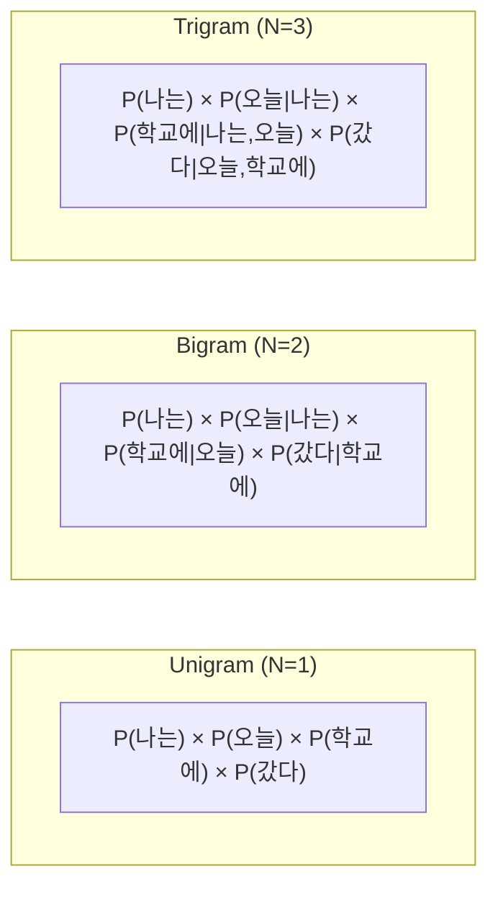
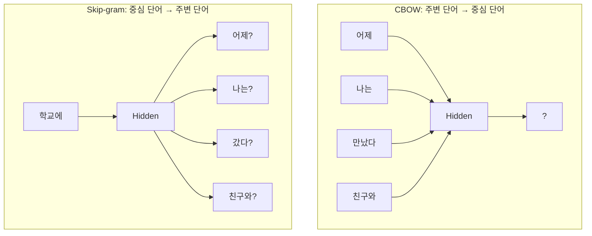

# 제2장: 언어 모델의 진화 - 통계에서 신경망까지

## 학습 목표

이 장을 마치면 다음을 수행할 수 있다:

- 언어 모델의 수학적 정의와 목적을 설명할 수 있다
- N-gram 모델을 직접 구현하고 텍스트를 생성할 수 있다
- Perplexity를 사용하여 언어 모델의 성능을 평가할 수 있다
- Word2Vec의 원리를 이해하고 사전학습 모델을 활용할 수 있다

---

## 2.1 언어 모델의 기초

### 언어 모델이란 무엇인가

언어 모델(Language Model)은 텍스트의 확률 분포를 학습한 모델이다. 쉽게 말해, 단어들이 어떤 순서로 나타날 가능성이 높은지를 수치로 표현하는 것이다. 예를 들어, "나는 학교에 ___"라는 문장에서 빈칸에 "갔다"가 올 확률은 "먹었다"가 올 확률보다 훨씬 높다. 언어 모델은 이러한 직관을 수학적으로 모델링한다.

언어 모델은 다양한 자연어처리 응용에서 핵심 역할을 한다. 스마트폰의 자동 완성 기능, 기계 번역, 음성 인식, 그리고 ChatGPT 같은 대화형 AI까지 모두 언어 모델을 기반으로 한다.

### 조건부 확률과 언어 모델

언어 모델의 목표는 단어 시퀀스 w₁, w₂, ..., wₙ의 **결합 확률(Joint Probability)**을 계산하는 것이다:

P(w₁, w₂, ..., wₙ)

이 확률을 직접 계산하기는 어렵다. 대신 **연쇄 법칙(Chain Rule)**을 사용하여 조건부 확률의 곱으로 분해할 수 있다:

P(w₁, w₂, ..., wₙ) = P(w₁) × P(w₂|w₁) × P(w₃|w₁, w₂) × ... × P(wₙ|w₁, ..., wₙ₋₁)

즉, 각 단어가 이전 모든 단어들이 주어졌을 때 나타날 확률을 순차적으로 곱한다. 그러나 이 방식은 문장이 길어질수록 조건부가 매우 복잡해진다.

이 문제를 해결하기 위해 **마르코프 가정(Markov Assumption)**을 도입한다. 마르코프 가정은 "현재 단어는 바로 직전 몇 개의 단어에만 의존한다"는 단순화 가정이다:

P(wₙ|w₁, ..., wₙ₋₁) ≈ P(wₙ|wₙ₋ₖ, ..., wₙ₋₁)

여기서 k는 고려하는 이전 단어의 수이다. 이 가정을 기반으로 한 모델이 바로 N-gram 모델이다.

### 언어 모델 평가 지표: Perplexity

언어 모델의 성능을 어떻게 평가할 수 있을까? 가장 널리 사용되는 지표는 **Perplexity(혼잡도)**이다.

Perplexity는 직관적으로 "모델이 다음 단어를 예측할 때 평균적으로 몇 개의 선택지 중에서 고민하는가"를 나타낸다. 예를 들어, Perplexity가 100이라면 모델이 매 단어마다 100개의 단어 중에서 선택해야 하는 것처럼 불확실하다는 뜻이다.

수식으로 표현하면:

PPL(W) = 2^(-1/N × Σlog₂P(wᵢ|context))

여기서 N은 테스트 문장의 총 단어 수이다. **Perplexity가 낮을수록 좋은 모델**이다. 모델이 다음 단어를 더 확신 있게 예측할수록 Perplexity는 낮아진다.

실제 최신 언어 모델들의 Perplexity는 매우 낮다. 예를 들어, GPT-2는 영어 텍스트에서 약 20~30 수준의 Perplexity를 달성한다.

---

## 2.2 통계 기반 언어 모델

### N-gram 모델의 원리

N-gram 모델은 가장 기본적인 통계적 언어 모델이다. N-gram은 연속된 N개의 단어 시퀀스를 의미한다.

N-gram 모델은 마르코프 가정을 적용하여, 다음 단어의 확률을 이전 N-1개의 단어만으로 추정한다:

P(wₙ|w₁, ..., wₙ₋₁) ≈ P(wₙ|wₙ₋ₙ₊₁, ..., wₙ₋₁)

확률은 **최대우도추정(Maximum Likelihood Estimation, MLE)**으로 계산한다:

P(wₙ|wₙ₋₁) = Count(wₙ₋₁, wₙ) / Count(wₙ₋₁)

예를 들어, "나는 학교에"라는 Bigram이 학습 데이터에서 10번 나타나고, "나는"이 50번 나타났다면:

P(학교에|나는) = 10/50 = 0.2

### Unigram, Bigram, Trigram 모델

N의 값에 따라 모델의 특성이 달라진다.



**그림 2.1** N-gram 모델별 확률 계산 방식

**Unigram (N=1)**은 각 단어가 독립적으로 출현한다고 가정한다. 문맥을 전혀 고려하지 않아 매우 단순하지만, 실제 언어의 특성을 반영하지 못한다.

**Bigram (N=2)**은 바로 앞 단어 하나만 고려한다. 계산이 간단하면서도 어느 정도 문맥을 반영할 수 있다.

**Trigram (N=3)**은 앞 두 단어를 고려한다. Bigram보다 풍부한 문맥을 포착하지만, 필요한 학습 데이터가 기하급수적으로 증가한다.

**표 2.1** N-gram 모델 비교

| 모델 | 고려 문맥 | 장점 | 단점 |
|------|----------|------|------|
| Unigram | 없음 | 단순, 빠름 | 문맥 무시 |
| Bigram | 1단어 | 적절한 복잡도 | 제한된 문맥 |
| Trigram | 2단어 | 풍부한 문맥 | 데이터 희소성 |

일반적으로 N이 커질수록 더 정확한 예측이 가능하지만, 학습에 필요한 데이터 양이 급격히 증가한다. 실무에서는 Trigram이나 4-gram 정도가 많이 사용된다.

### 희소성 문제와 스무딩 기법

N-gram 모델의 가장 큰 문제는 **희소성(Sparsity)**이다. 학습 데이터에서 한 번도 보지 못한 N-gram의 확률은 0이 된다. 이것이 왜 문제일까?

예를 들어, "나는 자연어처리를"이라는 Bigram이 학습 데이터에 없다면:

P(자연어처리를|나는) = 0/50 = 0

이 확률이 0이면, 이 Bigram을 포함하는 모든 문장의 확률도 0이 된다. 전체 확률이 곱셈으로 계산되기 때문이다.

이 문제를 해결하기 위해 **스무딩(Smoothing)** 기법을 사용한다.

**Add-k Smoothing (Laplace Smoothing)**은 가장 간단한 방법이다. 모든 N-gram 빈도에 작은 값 k를 더한다:

P(wₙ|wₙ₋₁) = (Count(wₙ₋₁, wₙ) + k) / (Count(wₙ₋₁) + k × V)

여기서 V는 어휘 크기이다. k=1인 경우를 Laplace Smoothing이라 한다.

**Backoff**는 높은 차수의 N-gram 확률이 0일 때, 낮은 차수로 "후퇴"하는 방법이다. 예를 들어, Trigram 확률이 0이면 Bigram을, Bigram도 0이면 Unigram을 사용한다.

**Interpolation**은 여러 차수의 N-gram 확률을 가중 합산한다:

P(wₙ|wₙ₋₂, wₙ₋₁) = λ₁P(wₙ) + λ₂P(wₙ|wₙ₋₁) + λ₃P(wₙ|wₙ₋₂, wₙ₋₁)

가중치 λ₁ + λ₂ + λ₃ = 1을 만족해야 한다.

### N-gram 모델의 한계

N-gram 모델은 간단하고 직관적이지만, 근본적인 한계가 있다.

첫째, **고정된 문맥 길이**이다. N-gram은 N-1개의 단어만 고려하므로, 더 먼 문맥의 정보를 활용할 수 없다. "내가 어제 먹은 ... 맛있었다"에서 빈칸을 채우려면 "먹은"이라는 정보가 필요한데, N이 작으면 이를 놓친다.

둘째, **의미적 유사성을 무시**한다. "개"와 "강아지"는 의미가 비슷하지만, N-gram 모델에서는 완전히 다른 단어로 취급된다. 따라서 "나는 개를 좋아한다"를 학습했어도 "나는 강아지를 좋아한다"의 확률은 높아지지 않는다.

셋째, **저장 공간 문제**이다. 가능한 모든 N-gram을 저장해야 하므로, N이 커지면 필요한 저장 공간이 기하급수적으로 증가한다.

이러한 한계를 극복하기 위해 신경망 기반 언어 모델이 등장했다.

---

## 2.3 신경망 기반 언어 모델로의 전환

### 신경망 언어 모델의 등장 배경

2003년 Bengio 등은 최초의 신경망 언어 모델(Neural Probabilistic Language Model)을 제안했다. 이 모델은 N-gram의 두 가지 핵심 한계를 극복하고자 했다:

1. **희소성 문제**: 본 적 없는 N-gram도 유사한 단어의 정보로 확률을 추정
2. **의미적 유사성**: 비슷한 단어를 비슷한 방식으로 처리

핵심 아이디어는 단어를 **밀집 벡터(Dense Vector)**로 표현하는 것이었다.

### 분산 표현의 개념

전통적으로 단어는 **원-핫 인코딩(One-hot Encoding)**으로 표현했다. 어휘가 V개라면, 각 단어는 V차원의 벡터로 표현되고, 해당 단어 위치만 1이고 나머지는 0이다.

예를 들어, 어휘가 ["왕", "여왕", "남자", "여자"]인 경우:
- "왕" = [1, 0, 0, 0]
- "여왕" = [0, 1, 0, 0]
- "남자" = [0, 0, 1, 0]
- "여자" = [0, 0, 0, 1]

원-핫 인코딩의 문제점은 모든 단어 간 거리가 동일하다는 것이다. "왕"과 "여왕"의 거리나 "왕"과 "여자"의 거리가 같다. 의미적 유사성이 전혀 반영되지 않는다.

**분산 표현(Distributed Representation)**은 단어를 저차원의 밀집 벡터로 표현한다. 일반적으로 50~300차원의 실수 벡터를 사용한다:

- "왕" = [0.2, 0.8, -0.3, 0.1, ...]
- "여왕" = [0.3, 0.7, -0.2, 0.15, ...]

이 방식의 핵심은 **비슷한 문맥에서 나타나는 단어는 비슷한 벡터를 갖는다**는 것이다. "왕"과 "여왕"은 유사한 문맥에서 사용되므로, 벡터 공간에서 가까이 위치한다.

### Word Embedding의 필요성

단어를 벡터로 변환하는 과정을 **Word Embedding**이라 한다. 좋은 Word Embedding은 다음 특성을 가진다:

1. **의미적 유사성 보존**: 비슷한 의미의 단어는 가까운 벡터
2. **관계 인코딩**: "왕 - 남자 + 여자 ≈ 여왕" 같은 벡터 연산 가능
3. **일반화**: 본 적 없는 단어 조합도 유사한 단어로부터 추론

Word Embedding은 이후 등장하는 모든 신경망 기반 NLP 모델의 기초가 되었다.

---

## 2.4 단어 임베딩

### Word2Vec

Word2Vec은 2013년 Mikolov 등이 Google에서 발표한 단어 임베딩 알고리즘이다. 간단하면서도 효과적이어서 현재까지 널리 사용된다.

Word2Vec은 **"비슷한 문맥에서 나타나는 단어는 비슷한 의미를 갖는다"**는 분포 가설(Distributional Hypothesis)을 기반으로 한다.

두 가지 학습 방식이 있다:



**그림 2.2** Word2Vec의 두 가지 아키텍처

**CBOW (Continuous Bag of Words)**는 주변 단어들로 중심 단어를 예측한다. 예를 들어, "나는 어제 [?] 만났다"에서 주변 단어 "나는", "어제", "만났다"를 입력으로 받아 중심 단어 "친구를"을 예측한다. CBOW는 학습이 빠르고, 빈번한 단어에 효과적이다.

**Skip-gram**은 반대로 중심 단어로 주변 단어들을 예측한다. "친구를"이라는 단어가 주어지면 "나는", "어제", "만났다" 등을 예측한다. Skip-gram은 학습이 느리지만, 희귀 단어에 더 효과적이다.

**표 2.2** CBOW vs Skip-gram 비교

| 항목 | CBOW | Skip-gram |
|------|------|-----------|
| 예측 방향 | Context → Target | Target → Context |
| 학습 속도 | 빠름 | 느림 |
| 빈번한 단어 | 효과적 | 보통 |
| 희귀 단어 | 보통 | 효과적 |
| 권장 윈도우 | 5 | 10 |

학습 과정에서 **Negative Sampling**이라는 기법을 사용하여 계산 효율을 높인다. 모든 단어에 대해 Softmax를 계산하는 대신, 정답 단어와 무작위로 선택한 몇 개의 오답 단어만 사용하여 이진 분류 문제로 변환한다.

### GloVe

GloVe(Global Vectors for Word Representation)는 2014년 Stanford에서 발표한 모델이다. Word2Vec이 지역적 문맥(윈도우)만 사용하는 반면, GloVe는 **전체 코퍼스의 동시 출현(Co-occurrence) 통계**를 활용한다.

GloVe는 먼저 동시 출현 행렬 X를 구축한다. Xᵢⱼ는 단어 i의 문맥에서 단어 j가 몇 번 나타났는지를 기록한다. 그런 다음, 다음 목표 함수를 최소화하도록 학습한다:

wᵢᵀw̃ⱼ + bᵢ + b̃ⱼ ≈ log(Xᵢⱼ)

GloVe는 전역 통계를 활용하므로 Word2Vec과 상호 보완적인 특성을 가진다.

### FastText

FastText는 2016년 Facebook AI Research에서 발표한 모델이다. 핵심 아이디어는 단어를 **문자 N-gram의 집합**으로 표현하는 것이다.

예를 들어, "where"라는 단어를 문자 3-gram으로 분해하면:
- <wh, whe, her, ere, re>

단어 벡터는 이 서브워드 벡터들의 합으로 계산된다. 이 방식의 장점은 다음과 같다:

1. **OOV 처리**: 학습 때 보지 못한 단어도 서브워드 조합으로 임베딩 생성 가능
2. **형태소 활용**: "run", "running", "runs"가 유사한 벡터를 갖게 됨
3. **오타 강건성**: "helllo"도 "hello"와 유사하게 처리

특히 한국어처럼 형태소가 풍부한 언어에서 FastText가 효과적이다.

### 임베딩 공간의 의미적 특성

잘 학습된 Word Embedding은 놀라운 특성을 보여준다.

**벡터 연산**으로 의미적 관계를 표현할 수 있다:
- "왕" - "남자" + "여자" ≈ "여왕"
- "파리" - "프랑스" + "한국" ≈ "서울"
- "더 좋은" - "좋은" + "나쁜" ≈ "더 나쁜"

**유사도 측정**에는 코사인 유사도가 주로 사용된다:

cos(u, v) = (u · v) / (||u|| × ||v||)

코사인 유사도는 -1에서 1 사이의 값을 가지며, 1에 가까울수록 두 벡터가 유사하다.

**시각화**를 위해 t-SNE나 UMAP 같은 차원 축소 기법을 사용한다. 100차원 이상의 벡터를 2차원으로 줄여 시각화하면, 의미적으로 유사한 단어들이 군집을 이루는 것을 확인할 수 있다.

---

## 2.5 실습

### 실습 목표

이 실습에서는 다음을 직접 구현하고 실험한다:
- N-gram 언어 모델 구현 및 텍스트 생성
- Perplexity를 사용한 모델 평가
- 텍스트 전처리 파이프라인 구축
- Word2Vec 모델 학습 및 단어 유사도 측정

### 실습 환경 준비

```bash
cd practice/chapter2
python3 -m venv venv
source venv/bin/activate  # Windows: venv\Scripts\activate
pip install -r code/requirements.txt
```

### N-gram 모델 구현

N-gram 모델의 핵심 로직은 다음과 같다:

```python
class NGramLanguageModel:
    def __init__(self, n=2, smoothing_k=1.0):
        self.n = n
        self.smoothing_k = smoothing_k
        self.ngram_counts = defaultdict(Counter)
        self.context_counts = Counter()

    def get_probability(self, context, word):
        """Add-k 스무딩을 적용한 조건부 확률"""
        count = self.ngram_counts[context][word]
        context_count = self.context_counts[context]
        vocab_size = len(self.vocabulary)

        prob = (count + self.smoothing_k) / (
            context_count + self.smoothing_k * vocab_size
        )
        return prob
```

_전체 코드는 practice/chapter2/code/2-2-ngram모델.py 참고_

실행 결과:

```
=== 2-gram 모델 학습 시작 ===
학습 문장 수: 12
어휘 크기: 37
고유 1-gram 수: 37

주요 Bigram 빈도:
  ('<s>',) → {'나는': 6, '오늘': 3, '딥러닝은': 1}

테스트 문장 Perplexity: 22.40

생성된 문장 (Bigram):
  1. 나는 오늘 학교에 갔다
  2. 딥러닝은 정말 재미있다

스무딩 효과 비교:
  k= 0.01 → Perplexity: 19.55
  k= 0.10 → Perplexity: 14.57
  k= 1.00 → Perplexity: 22.40
  k=10.00 → Perplexity: 33.28
```

결과를 보면, 스무딩 파라미터 k가 너무 작거나 크면 Perplexity가 높아지고, 적절한 값(여기서는 0.1)에서 가장 좋은 성능을 보인다.

### 텍스트 전처리

자연어처리의 첫 단계는 항상 전처리이다. 전처리 파이프라인은 다음 단계로 구성된다:

1. **정규화**: 반복 문자 축소, 대소문자 통일
2. **정제**: 특수문자, URL, 이메일 제거
3. **토큰화**: 텍스트를 단어 단위로 분리
4. **불용어 제거**: 의미 없는 단어 제거

```python
# 전처리 예시
원본: "자연어처리(NLP)는 인공지능의 중요한 분야입니다!!!"
전처리 결과: ['자연어처리nlp는', '인공지능의', '중요한', '분야입니다']
```

_전체 코드는 practice/chapter2/code/2-5-전처리.py 참고_

### Word2Vec 실습

Gensim 라이브러리를 사용하여 Word2Vec 모델을 학습한다:

```python
from gensim.models import Word2Vec

# 모델 학습
model = Word2Vec(
    sentences=corpus,
    vector_size=50,   # 임베딩 차원
    window=3,         # 문맥 윈도우
    min_count=1,      # 최소 빈도
    sg=1,             # 1=Skip-gram, 0=CBOW
    epochs=100,
)

# 유사 단어 찾기
model.wv.most_similar("나는", topn=5)
```

_전체 코드는 practice/chapter2/code/2-4-word2vec실습.py 참고_

---

## 핵심 정리

이 장에서 다룬 핵심 내용을 정리하면 다음과 같다:

- **언어 모델**은 단어 시퀀스의 확률 분포를 학습하며, Perplexity로 성능을 평가한다
- **N-gram 모델**은 이전 N-1개 단어로 다음 단어를 예측하며, 희소성 문제를 스무딩으로 해결한다
- **Word2Vec**은 단어를 밀집 벡터로 표현하며, CBOW와 Skip-gram 두 가지 방식이 있다
- **GloVe**는 전역 동시 출현 통계를, **FastText**는 서브워드 정보를 활용한다
- 잘 학습된 임베딩은 "왕 - 남자 + 여자 ≈ 여왕" 같은 벡터 연산이 가능하다

---

## 더 알아보기

이 장의 내용을 더 깊이 학습하려면 다음 자료를 참고하라:

- Jurafsky, D. & Martin, J.H. (2024). *Speech and Language Processing*. Chapter 3: N-gram Language Models. https://web.stanford.edu/~jurafsky/slp3/3.pdf
- Mikolov, T. et al. (2013). Efficient Estimation of Word Representations in Vector Space. https://arxiv.org/abs/1301.3781
- Pennington, J. et al. (2014). GloVe: Global Vectors for Word Representation. https://nlp.stanford.edu/pubs/glove.pdf

---

## 다음 장 예고

다음 장에서는 딥러닝의 핵심인 신경망의 기본 구조와 학습 원리를 다룬다. 퍼셉트론부터 다층 신경망까지, 딥러닝의 기초를 단계별로 학습한다.

---

## 참고문헌

1. Jurafsky, D. & Martin, J.H. (2024). Speech and Language Processing (3rd ed.). Chapter 3. https://web.stanford.edu/~jurafsky/slp3/3.pdf
2. Mikolov, T. et al. (2013). Efficient Estimation of Word Representations in Vector Space. *arXiv*. https://arxiv.org/abs/1301.3781
3. Mikolov, T. et al. (2013). Distributed Representations of Words and Phrases and their Compositionality. *NeurIPS*.
4. Pennington, J. et al. (2014). GloVe: Global Vectors for Word Representation. *EMNLP*. https://nlp.stanford.edu/pubs/glove.pdf
5. Bojanowski, P. et al. (2017). Enriching Word Vectors with Subword Information. *TACL*. https://arxiv.org/abs/1607.04606
6. Bengio, Y. et al. (2003). A Neural Probabilistic Language Model. *JMLR*.
