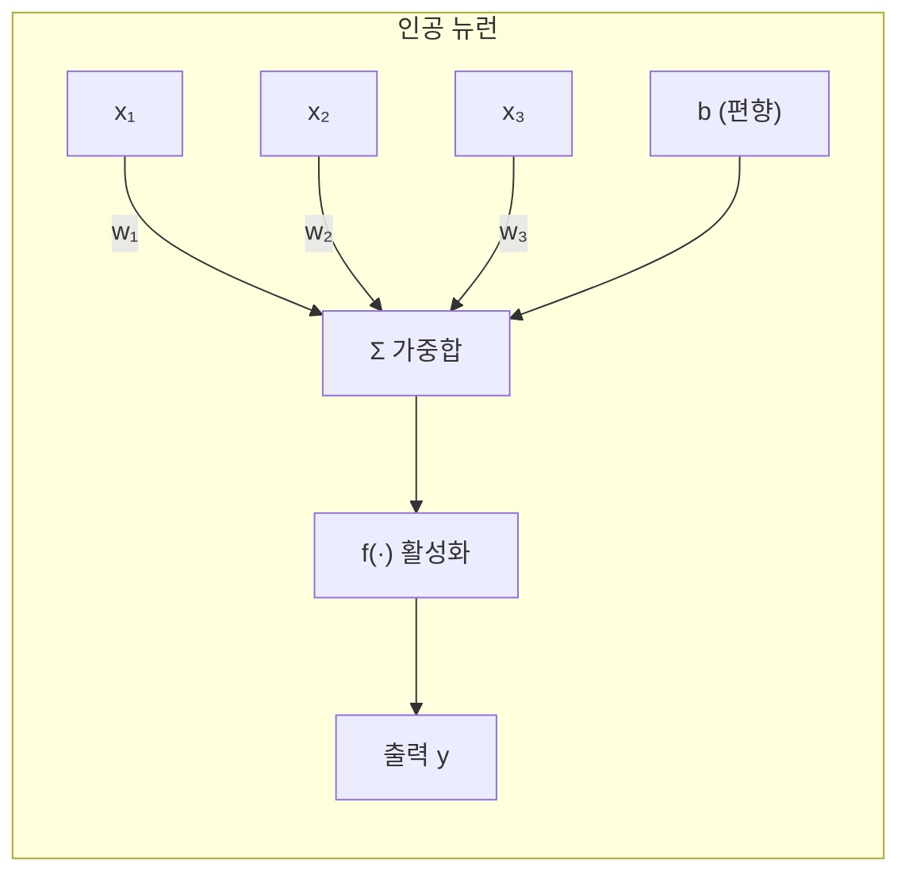
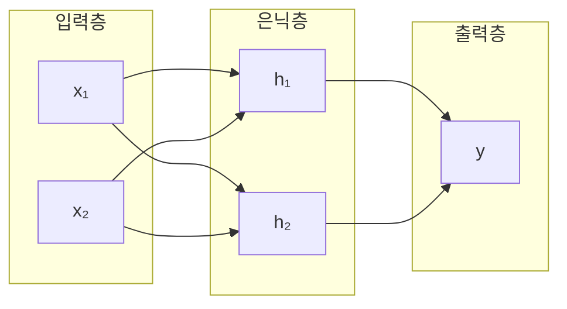
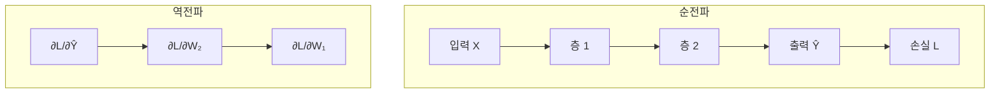

# 제3장: 딥러닝의 핵심 - 신경망과 학습 원리

## 학습 목표

이 장을 마치면 다음을 수행할 수 있다:

- 인공 신경망의 기본 구조와 작동 원리를 설명할 수 있다
- 다양한 활성화 함수의 특징과 사용 시점을 이해한다
- 손실 함수와 경사 하강법의 원리를 설명할 수 있다
- 역전파 알고리즘의 동작 방식을 이해한다
- PyTorch로 간단한 신경망을 구현하고 학습시킬 수 있다

---

## 3.1 인공 신경망의 기본 구조

### 생물학적 뉴런에서 인공 뉴런으로

인공 신경망(Artificial Neural Network)은 인간 뇌의 신경 세포인 뉴런(Neuron)에서 영감을 받아 설계되었다. 생물학적 뉴런은 수상돌기(Dendrite)를 통해 신호를 받아들이고, 세포체(Cell Body)에서 신호를 처리한 후, 축삭(Axon)을 통해 다음 뉴런으로 신호를 전달한다.

인공 뉴런은 이 과정을 수학적으로 모델링한다:

1. **입력 수신**: 여러 개의 입력값 x₁, x₂, ..., xₙ을 받는다
2. **가중합 계산**: 각 입력에 가중치를 곱하고 편향을 더한다: z = Σwᵢxᵢ + b
3. **활성화 함수 적용**: 비선형 함수를 적용하여 출력을 생성한다: y = f(z)



**그림 3.1** 인공 뉴런의 구조

여기서 **가중치(Weight)**는 각 입력의 중요도를 나타내고, **편향(Bias)**은 활성화 임계값을 조정한다. 학습 과정에서 이 값들이 데이터에 맞게 조정된다.

### 퍼셉트론: 최초의 인공 뉴런

퍼셉트론(Perceptron)은 1958년 Frank Rosenblatt이 제안한 최초의 실용적인 인공 뉴런 모델이다. 퍼셉트론은 입력의 가중합이 특정 임계값을 넘으면 1을, 그렇지 않으면 0을 출력한다.

y = step(Σwᵢxᵢ + b) = { 1 if Σwᵢxᵢ + b > 0, 0 otherwise }

퍼셉트론은 AND, OR 같은 논리 게이트를 학습할 수 있었다. 실제로 AND 게이트는 약 9번의 학습 반복만으로 완벽하게 학습된다.

### 퍼셉트론의 한계: XOR 문제

1969년 Minsky와 Papert는 저서 *Perceptrons*에서 단층 퍼셉트론의 근본적인 한계를 증명했다. 단층 퍼셉트론은 **선형 분리 가능(Linearly Separable)**한 문제만 해결할 수 있다.

XOR(배타적 OR) 함수를 예로 들어보자:

| 입력 (x₁, x₂) | XOR 출력 |
|---------------|----------|
| (0, 0) | 0 |
| (0, 1) | 1 |
| (1, 0) | 1 |
| (1, 1) | 0 |

2차원 평면에 이 점들을 그려보면, 출력이 1인 점들(0,1)과 (1,0)이 대각선으로 위치하고, 출력이 0인 점들(0,0)과 (1,1)도 대각선으로 위치한다. **어떤 직선도 이 두 그룹을 분리할 수 없다.** 이것이 XOR 문제이며, 단층 퍼셉트론의 한계이다.

실제로 단층 퍼셉트론으로 XOR을 학습시키면 1000번을 반복해도 정확도가 50%에 머문다.

### 다층 퍼셉트론(MLP)의 등장

XOR 문제의 해결책은 **다층 퍼셉트론(Multi-Layer Perceptron, MLP)**이다. 입력층과 출력층 사이에 **은닉층(Hidden Layer)**을 추가하면 비선형 문제도 해결할 수 있다.



**그림 3.2** XOR 문제를 해결하는 MLP 구조

은닉층의 역할은 입력을 **새로운 특성 공간으로 변환**하는 것이다. 원래 공간에서 선형 분리가 불가능했던 데이터도, 은닉층을 거치면 새로운 공간에서 선형 분리가 가능해진다.

PyTorch로 구현한 MLP는 1000번의 학습만으로 XOR 문제를 100% 정확도로 해결한다:

```
Epoch  200: Loss = 0.0030, Accuracy = 100.0%
Epoch  400: Loss = 0.0010, Accuracy = 100.0%
...
최종 예측:
  [0.0, 0.0] → 0    (0.0000)
  [0.0, 1.0] → 1    (1.0000)
  [1.0, 0.0] → 1    (0.9992)
  [1.0, 1.0] → 0    (0.0001)
```

_전체 코드는 practice/chapter3/code/3-5-mlp.py 참고_

---

## 3.2 활성화 함수

### 왜 활성화 함수가 필요한가?

선형 변환만으로는 복잡한 패턴을 학습할 수 없다. 아무리 많은 선형 층을 쌓아도, 결과는 하나의 선형 변환과 동일하기 때문이다:

W₂(W₁x + b₁) + b₂ = W₂W₁x + W₂b₁ + b₂ = Wx + b

**활성화 함수(Activation Function)**는 비선형성을 도입하여 신경망이 복잡한 함수를 근사할 수 있게 한다.

### Sigmoid 함수

σ(x) = 1 / (1 + e⁻ˣ)

Sigmoid는 출력을 (0, 1) 범위로 압축하여 확률로 해석할 수 있게 한다.

```
x = [-3,   -2,   -1,   0,    1,    2,    3  ]
σ = [0.05, 0.12, 0.27, 0.50, 0.73, 0.88, 0.95]
```

**장점**: 확률 해석 가능, 미분 가능
**단점**: 기울기 소실 문제 — 입력이 크거나 작을 때 기울기가 거의 0에 가까워져 학습이 느려진다. σ(-3)의 기울기는 0.045에 불과하다.

### Tanh 함수

tanh(x) = (eˣ - e⁻ˣ) / (eˣ + e⁻ˣ)

출력 범위가 (-1, 1)로, 0을 중심으로 분포한다. Sigmoid보다 학습이 안정적이지만 여전히 기울기 소실 문제가 있다.

### ReLU (Rectified Linear Unit)

f(x) = max(0, x)

ReLU는 현대 딥러닝에서 가장 널리 사용되는 활성화 함수이다.

```
x = [-3,  -2,  -1,  0,  1,  2,  3]
y = [ 0,   0,   0,  0,  1,  2,  3]
```

**장점**:
- 계산 효율적 (비교 연산만 필요)
- 기울기 소실 문제 완화 (양수 영역에서 기울기 = 1)
- 희소 활성화 (일부 뉴런만 활성화)

**단점**: Dying ReLU 문제 — 음수 입력에서 기울기가 0이므로, 한 번 비활성화된 뉴런은 다시 활성화되기 어렵다.

### Leaky ReLU

f(x) = max(αx, x), α ≈ 0.01

음수 영역에서도 작은 기울기를 유지하여 Dying ReLU 문제를 완화한다.

```
x = [-3,    -2,    -1,    0,  1,  2,  3]
y = [-0.03, -0.02, -0.01, 0,  1,  2,  3]
```

### GELU (Gaussian Error Linear Unit)

GELU(x) = x × Φ(x)

여기서 Φ(x)는 표준 정규 분포의 누적 분포 함수(CDF)이다. GPT, BERT 등 Transformer 모델에서 표준으로 사용된다.

```
x = [-3,     -1,     0,    1,     3    ]
y = [-0.004, -0.159, 0,    0.841, 2.996]
```

GELU는 부드러운 곡선을 가지며, x=0에서도 미분 가능하다. 음수 입력에서도 0이 아닌 기울기를 유지하여 학습이 더 안정적이다.

### Softmax (출력층)

softmax(xᵢ) = eˣⁱ / Σeˣʲ

다중 클래스 분류의 출력층에 사용된다. 모든 출력의 합이 1이 되어 확률 분포로 해석할 수 있다.

```
입력 (logits): [2.0, 1.0, 0.1]
출력 (확률):   [0.659, 0.242, 0.099]
합계: 1.0
```

### 활성화 함수 선택 가이드

| 용도 | 권장 함수 |
|------|----------|
| CNN 은닉층 | ReLU |
| Transformer 은닉층 | GELU |
| RNN 은닉층 | Tanh |
| 이진 분류 출력층 | Sigmoid |
| 다중 분류 출력층 | Softmax |

_전체 코드는 practice/chapter3/code/3-2-활성화함수.py 참고_

---

## 3.3 손실 함수

### 손실 함수란?

손실 함수(Loss Function)는 모델의 예측이 실제 값과 얼마나 다른지를 측정한다. 학습의 목표는 이 손실을 최소화하는 파라미터를 찾는 것이다.

### 회귀 문제의 손실 함수

**MSE (Mean Squared Error)**

MSE = (1/n) Σ(yᵢ - ŷᵢ)²

오차를 제곱하므로 큰 오차에 더 큰 패널티를 부여한다. 이상치에 민감하다.

**MAE (Mean Absolute Error)**

MAE = (1/n) Σ|yᵢ - ŷᵢ|

이상치에 덜 민감하지만, 미분 불연속점이 존재한다.

### 분류 문제의 손실 함수

**Binary Cross-Entropy (이진 분류)**

L = -[y log(p) + (1-y) log(1-p)]

실제 클래스가 1일 때 예측 확률 p가 높을수록, 0일 때 (1-p)가 높을수록 손실이 작아진다.

**Categorical Cross-Entropy (다중 분류)**

L = -Σyᵢ log(pᵢ)

원-핫 인코딩된 레이블 y와 Softmax 출력 p 사이의 교차 엔트로피를 계산한다.

### 손실 함수와 최적화

손실 함수를 파라미터 공간에서 시각화하면 **손실 표면(Loss Surface)**을 얻는다. 학습은 이 표면에서 가장 낮은 지점(최소점)을 찾는 과정이다. 그러나 고차원 공간에서는 **지역 최소점(Local Minimum)**이나 **안장점(Saddle Point)**에 빠질 수 있다.

---

## 3.4 최적화 알고리즘

### 경사 하강법의 원리

경사 하강법(Gradient Descent)은 손실 함수를 최소화하기 위한 기본 알고리즘이다. 직관적으로 설명하면, "언덕에서 가장 가파른 방향으로 내려가는 것"이다.

파라미터 업데이트 공식:

θ = θ - η∇L(θ)

여기서:
- θ: 모델 파라미터 (가중치, 편향)
- η: 학습률 (Learning Rate) — 한 번에 얼마나 이동할지
- ∇L(θ): 손실 함수의 기울기 — 어느 방향으로 이동할지

**학습률의 중요성**: 학습률이 너무 크면 최소점을 지나쳐버리고, 너무 작으면 수렴이 느리다.

### 경사 하강법의 변형

| 방식 | 배치 크기 | 특징 |
|------|----------|------|
| Batch GD | 전체 데이터 | 안정적이지만 느림 |
| Stochastic GD | 1개 샘플 | 빠르지만 불안정 |
| Mini-batch GD | 32, 64 등 | 균형 잡힌 선택 |

실무에서는 **Mini-batch GD**가 가장 많이 사용된다. 적절한 배치 크기는 보통 32~128이다.

### 역전파 알고리즘

역전파(Backpropagation)는 신경망의 기울기를 효율적으로 계산하는 알고리즘이다. 핵심은 **연쇄 법칙(Chain Rule)**을 적용하는 것이다.

**연쇄 법칙**: 합성 함수의 미분은 각 함수 미분의 곱이다.

dz/dx = dz/dy × dy/dx

신경망은 여러 함수의 합성이므로, 역전파는 출력에서 입력 방향으로 연쇄 법칙을 적용하여 각 층의 기울기를 계산한다.



**그림 3.3** 순전파와 역전파의 흐름

역전파의 핵심 아이디어는 "뒤에서 앞으로" 계산하여 **중복 계산을 피하는 것**이다. 이를 통해 복잡한 신경망도 효율적으로 학습할 수 있다.

### 역전파의 문제점

**기울기 소실 (Vanishing Gradient)**: 깊은 네트워크에서 기울기가 층을 거치면서 점점 작아져 학습이 안 된다. Sigmoid나 Tanh 함수에서 주로 발생한다.

**기울기 폭주 (Exploding Gradient)**: 반대로 기울기가 폭발적으로 커지는 문제. Gradient Clipping으로 해결한다.

### 고급 옵티마이저

**SGD with Momentum**: 이전 업데이트 방향을 기억하여 관성을 추가한다. 지역 최소점을 탈출하는 데 도움이 된다.

**Adam (Adaptive Moment Estimation)**: 각 파라미터마다 학습률을 적응적으로 조정한다. 현재 가장 널리 사용되는 옵티마이저이다.

실험 결과, 간단한 선형 회귀에서도 옵티마이저에 따라 수렴 속도가 달라진다:

```
옵티마이저        Loss       w          b
-------------------------------------------------
SGD             0.2409     2.0004     1.0223
SGD+Momentum    0.4552     1.9031     1.0308
Adam            18.4677    1.2317     1.2957
-------------------------------------------------
실제값             -       2.0000     1.0000
```

이 결과에서 SGD가 50 에폭 후 가장 좋은 결과를 보였다. 하지만 일반적으로 복잡한 문제에서는 Adam이 더 빠르게 수렴한다. 학습률을 문제에 맞게 조정하는 것이 중요하다.

---

## 3.5 실습: PyTorch 기초

### 실습 목표

이 실습에서는 PyTorch를 사용하여 다음을 수행한다:
- Tensor의 기본 조작
- Autograd를 이용한 자동 미분
- 간단한 선형 회귀 모델 구현
- MLP 모델 설계 및 학습

### 실습 환경 준비

```bash
cd practice/chapter3
python3 -m venv venv
source venv/bin/activate  # Windows: venv\Scripts\activate
pip install -r code/requirements.txt
```

### Tensor 기본 조작

PyTorch의 Tensor는 NumPy 배열과 유사하지만, GPU 연산과 자동 미분을 지원한다.

```python
import torch

# 텐서 생성
a = torch.tensor([1.0, 2.0, 3.0])
b = torch.randn(2, 3)  # 표준정규분포

# 연산
print(a + torch.tensor([4.0, 5.0, 6.0]))  # [5., 7., 9.]
print(a @ torch.tensor([4.0, 5.0, 6.0]))  # 32.0 (내적)

# 행렬 곱
A = torch.tensor([[1, 2], [3, 4]], dtype=torch.float32)
B = torch.tensor([[5, 6], [7, 8]], dtype=torch.float32)
print(A @ B)  # [[19, 22], [43, 50]]
```

### Autograd: 자동 미분

PyTorch의 `autograd`는 자동으로 기울기를 계산한다.

```python
# y = x²의 기울기 계산
x = torch.tensor(3.0, requires_grad=True)
y = x ** 2

y.backward()  # 역전파
print(x.grad)  # 6.0 (dy/dx = 2x = 6)
```

실행 결과:

```
[기본 예제: y = x²]
x = 3.0
y = x² = 9.0
dy/dx = 2x = 6.0
검증: 2 × 3 = 6 ✓

[복잡한 함수: y = 3x² + 2x + 1]
x = 2.0
y = 3x² + 2x + 1 = 17.0
dy/dx = 6x + 2 = 14.0
검증: 6×2 + 2 = 14 ✓
```

**주의**: 기울기는 기본적으로 누적된다. 매 반복마다 `zero_grad()`를 호출해야 한다.

```python
# 잘못된 예 - 기울기 누적
for i in range(3):
    y = x ** 2
    y.backward()
    print(x.grad)  # 4, 8, 12 (누적됨!)

# 올바른 예
for i in range(3):
    x.grad.zero_()  # 기울기 초기화
    y = x ** 2
    y.backward()
    print(x.grad)  # 4, 4, 4
```

_전체 코드는 practice/chapter3/code/3-5-pytorch기초.py 참고_

### 선형 회귀 구현

PyTorch로 y = 2x + 1을 학습하는 선형 회귀 모델을 구현한다.

```python
import torch.nn as nn
import torch.optim as optim

# 모델 정의
model = nn.Linear(in_features=1, out_features=1)

# 손실 함수와 옵티마이저
criterion = nn.MSELoss()
optimizer = optim.SGD(model.parameters(), lr=0.01)

# 학습 루프
for epoch in range(100):
    y_pred = model(X)                    # 순전파
    loss = criterion(y_pred, y)          # 손실 계산
    optimizer.zero_grad()                # 기울기 초기화
    loss.backward()                      # 역전파
    optimizer.step()                     # 파라미터 업데이트
```

실행 결과:

```
초기 파라미터: w = 0.1564, b = -0.8799

Epoch  20: Loss = 0.7862, w = 2.2164, b = -0.4141
Epoch  40: Loss = 0.6877, w = 2.1956, b = -0.2759
Epoch  60: Loss = 0.6071, w = 2.1768, b = -0.1508
Epoch  80: Loss = 0.5409, w = 2.1598, b = -0.0375
Epoch 100: Loss = 0.4867, w = 2.1444, b = 0.0650

최종 결과: y = 2.1444x + 0.0650
실제 관계: y = 2.0000x + 1.0000
```

_전체 코드는 practice/chapter3/code/3-5-선형회귀.py 참고_

### MLP 구현

`nn.Module`을 상속하여 다층 퍼셉트론을 구현한다.

```python
class MLP(nn.Module):
    def __init__(self, input_size, hidden_sizes, output_size):
        super(MLP, self).__init__()
        layers = []
        prev_size = input_size

        for hidden_size in hidden_sizes:
            layers.append(nn.Linear(prev_size, hidden_size))
            layers.append(nn.ReLU())
            prev_size = hidden_size

        layers.append(nn.Linear(prev_size, output_size))
        self.network = nn.Sequential(*layers)

    def forward(self, x):
        return self.network(x)
```

XOR 문제를 MLP로 해결한 결과:

```
모델 구조:
MLP(
  (network): Sequential(
    (0): Linear(in_features=2, out_features=4, bias=True)
    (1): ReLU()
    (2): Linear(in_features=4, out_features=1, bias=True)
  )
)

Epoch  200: Loss = 0.0030, Accuracy = 100.0%
Epoch 1000: Loss = 0.0002, Accuracy = 100.0%

최종 예측:
  [0.0, 0.0] → 0    (확률: 0.0000)
  [0.0, 1.0] → 1    (확률: 1.0000)
  [1.0, 0.0] → 1    (확률: 0.9992)
  [1.0, 1.0] → 0    (확률: 0.0001)
```

_전체 코드는 practice/chapter3/code/3-5-mlp.py 참고_

---

## 핵심 정리

이 장에서 다룬 핵심 내용을 정리하면 다음과 같다:

- **인공 뉴런**은 입력의 가중합에 활성화 함수를 적용하여 출력을 생성한다
- **단층 퍼셉트론**은 선형 분리 가능한 문제만 해결할 수 있으며, XOR 같은 비선형 문제는 해결할 수 없다
- **다층 퍼셉트론(MLP)**은 은닉층을 추가하여 비선형 문제를 해결한다
- **활성화 함수**는 비선형성을 도입하며, 용도에 따라 ReLU, GELU, Sigmoid, Softmax 등을 선택한다
- **손실 함수**는 모델 예측과 실제 값의 차이를 측정하며, 회귀에는 MSE, 분류에는 Cross-Entropy를 사용한다
- **경사 하강법**은 손실 함수의 기울기를 따라 파라미터를 업데이트한다
- **역전파**는 연쇄 법칙을 사용하여 각 층의 기울기를 효율적으로 계산한다

---

## 더 알아보기

이 장의 내용을 더 깊이 학습하려면 다음 자료를 참고하라:

- Goodfellow, I. et al. (2016). *Deep Learning*. MIT Press. https://www.deeplearningbook.org/
- PyTorch Tutorials. (2025). Autograd. https://docs.pytorch.org/tutorials/beginner/basics/autogradqs_tutorial.html
- 3Blue1Brown. Neural Networks. https://www.3blue1brown.com/topics/neural-networks

---

## 다음 장 예고

다음 장에서는 PyTorch 기반 딥러닝 모델 개발 프로세스를 다룬다. Dataset과 DataLoader를 활용한 데이터 처리, 다양한 옵티마이저와 학습률 스케줄러, 그리고 텍스트 분류 실습을 진행한다.

---

## 참고문헌

1. Rosenblatt, F. (1958). The Perceptron: A Probabilistic Model for Information Storage and Organization in the Brain. *Psychological Review*.
2. Minsky, M. & Papert, S. (1969). *Perceptrons*. MIT Press.
3. Rumelhart, D. et al. (1986). Learning representations by back-propagating errors. *Nature*, 323, 533-536.
4. Goodfellow, I. et al. (2016). *Deep Learning*. MIT Press. https://www.deeplearningbook.org/
5. Hendrycks, D. & Gimpel, K. (2016). Gaussian Error Linear Units (GELUs). *arXiv*. https://arxiv.org/abs/1606.08415
6. PyTorch Documentation. (2025). Autograd: Automatic Differentiation. https://docs.pytorch.org/
