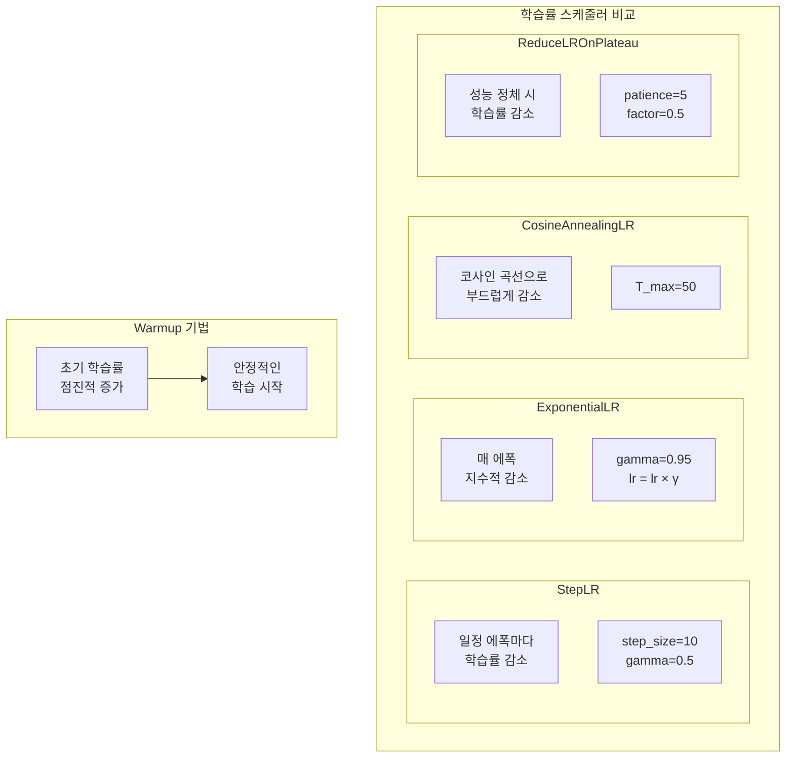
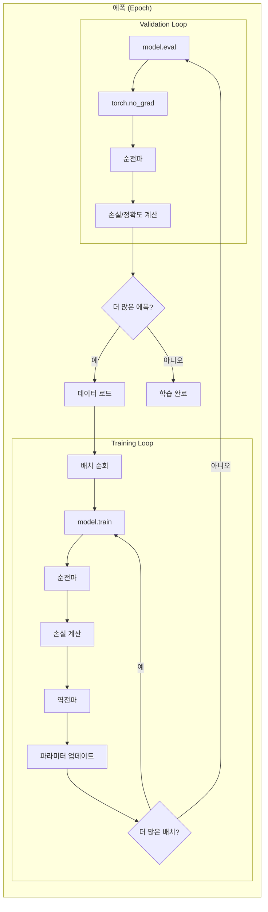

# 4장 PyTorch 기반 딥러닝 모델 개발 프로세스

## 학습 목표

이 장을 마치면 다음을 수행할 수 있다:
- nn.Module을 상속하여 커스텀 모델을 정의할 수 있다
- Dataset과 DataLoader를 활용하여 데이터 파이프라인을 구축할 수 있다
- 다양한 옵티마이저와 학습률 스케줄러를 적용할 수 있다
- Training/Validation Loop를 구현하고 과적합을 방지할 수 있다
- 분류 모델의 성능을 다양한 지표로 평가할 수 있다

---

## 4.1 PyTorch 핵심 구성 요소

딥러닝 모델을 구현하려면 모델의 구조를 정의하고, 파라미터를 관리하며, 학습 과정을 제어해야 한다. PyTorch는 이러한 작업을 위해 `nn.Module` 클래스를 제공한다. 이 절에서는 nn.Module을 활용하여 모델을 정의하는 방법을 학습한다.

### 4.1.1 nn.Module을 활용한 모델 정의

PyTorch에서 모든 신경망 모델은 `nn.Module` 클래스를 상속받아 정의한다. 모델을 정의할 때는 두 가지 메서드를 필수로 구현해야 한다.

첫째, `__init__` 메서드에서는 모델이 사용할 층(layer)을 정의한다. Linear, Conv2d, Embedding 등의 레이어와 ReLU, Dropout 같은 활성화 함수 및 정규화 기법을 여기서 선언한다.

둘째, `forward` 메서드에서는 입력 데이터가 모델을 통과하는 순전파(forward pass) 과정을 정의한다. __init__에서 선언한 레이어들을 순차적으로 연결하여 출력을 생성한다.

다음은 간단한 다층 퍼셉트론(MLP) 모델의 예시이다:

```python
class SimpleMLP(nn.Module):
    def __init__(self, input_size, hidden_size, output_size):
        super(SimpleMLP, self).__init__()
        self.fc1 = nn.Linear(input_size, hidden_size)
        self.relu = nn.ReLU()
        self.fc2 = nn.Linear(hidden_size, output_size)

    def forward(self, x):
        x = self.fc1(x)
        x = self.relu(x)
        x = self.fc2(x)
        return x
```

이 모델은 입력층, 은닉층, 출력층으로 구성된 3층 네트워크이다. 실행 결과 모델 구조는 다음과 같다:

```
SimpleMLP(
  (fc1): Linear(in_features=10, out_features=32, bias=True)
  (relu): ReLU()
  (fc2): Linear(in_features=32, out_features=2, bias=True)
)

총 파라미터 수: 418
```

_전체 코드는 practice/chapter4/code/4-1-모델정의.py 참고_

### 4.1.2 주요 레이어

PyTorch의 `torch.nn` 모듈은 다양한 레이어를 제공한다.

**nn.Linear**: 완전 연결층(Fully Connected Layer)으로, 입력과 출력 차원을 지정하여 선형 변환을 수행한다. 수식으로는 y = Wx + b로 표현된다.

**nn.ReLU, nn.GELU**: 활성화 함수로, 비선형성을 추가한다. ReLU는 음수를 0으로 변환하고 양수는 그대로 유지한다. GELU는 Transformer 모델에서 주로 사용되는 부드러운 활성화 함수이다.

**nn.Dropout**: 학습 시 무작위로 뉴런을 비활성화하여 과적합을 방지한다. 일반적으로 0.2~0.5의 비율을 사용한다.

**nn.BatchNorm1d**: 배치 정규화로, 각 배치에서 입력을 정규화하여 학습을 안정화하고 수렴 속도를 높인다.

**nn.Sequential**: 여러 레이어를 순차적으로 연결할 때 사용한다. 코드를 간결하게 작성할 수 있다.

다음은 BatchNorm과 Dropout을 포함한 유연한 MLP 모델의 예시이다:

```python
class FlexibleMLP(nn.Module):
    def __init__(self, input_size, hidden_sizes, output_size, dropout=0.2):
        super(FlexibleMLP, self).__init__()
        layers = []
        prev_size = input_size
        for hidden_size in hidden_sizes:
            layers.append(nn.Linear(prev_size, hidden_size))
            layers.append(nn.BatchNorm1d(hidden_size))
            layers.append(nn.ReLU())
            layers.append(nn.Dropout(dropout))
            prev_size = hidden_size
        layers.append(nn.Linear(prev_size, output_size))
        self.network = nn.Sequential(*layers)

    def forward(self, x):
        return self.network(x)
```

### 4.1.3 파라미터 관리

모델의 파라미터는 학습 과정에서 업데이트되는 가중치와 편향이다. PyTorch는 파라미터를 효율적으로 관리하기 위한 메서드를 제공한다.

`model.parameters()`는 모델의 모든 파라미터를 반복자(iterator)로 반환한다. 옵티마이저에 전달하여 학습에 사용한다.

`model.named_parameters()`는 파라미터의 이름과 함께 반환한다. 특정 레이어의 파라미터만 선택적으로 학습하거나 디버깅할 때 유용하다.

파라미터 초기화는 모델 성능에 중요한 영향을 미친다. Xavier 초기화는 시그모이드나 tanh 활성화 함수에 적합하고, He 초기화는 ReLU 계열 활성화 함수에 적합하다.

```python
def init_weights(m):
    if isinstance(m, nn.Linear):
        nn.init.xavier_uniform_(m.weight)
        if m.bias is not None:
            nn.init.zeros_(m.bias)

model.apply(init_weights)
```

`model.apply(fn)` 메서드는 모델의 모든 모듈에 함수를 적용한다. 위 예시에서는 모든 Linear 레이어에 Xavier 초기화를 적용한다.

---

## 4.2 데이터 처리 파이프라인

딥러닝 모델 학습에서 데이터 처리는 핵심적인 역할을 한다. 대규모 데이터를 효율적으로 로드하고, 배치 단위로 처리하며, 학습과 검증 데이터를 분리해야 한다. PyTorch는 이러한 작업을 위해 `Dataset`과 `DataLoader` 클래스를 제공한다.

### 4.2.1 Dataset 클래스

Dataset은 데이터 샘플과 레이블을 저장하고 접근하는 인터페이스를 정의한다. 커스텀 Dataset을 작성하려면 세 가지 메서드를 구현해야 한다.

`__init__`: 데이터를 로드하고 초기화한다. 파일에서 데이터를 읽거나, 전처리를 수행하거나, 어휘 사전을 구축하는 작업을 여기서 수행한다.

`__len__`: 데이터셋의 총 샘플 수를 반환한다. DataLoader가 배치를 구성할 때 이 정보를 사용한다.

`__getitem__`: 인덱스를 받아 해당 샘플을 반환한다. 텐서 형태로 변환하여 반환하는 것이 일반적이다.

```python
class SimpleDataset(Dataset):
    def __init__(self, X, y):
        self.X = torch.FloatTensor(X)
        self.y = torch.LongTensor(y)

    def __len__(self):
        return len(self.y)

    def __getitem__(self, idx):
        return self.X[idx], self.y[idx]
```

### 4.2.2 DataLoader 활용

DataLoader는 Dataset을 감싸서 배치 처리, 셔플링, 병렬 로딩 등의 기능을 제공한다. 주요 파라미터는 다음과 같다.

`batch_size`: 한 번에 처리할 샘플 수이다. 일반적으로 32, 64, 128 등의 값을 사용한다. 배치 크기가 크면 학습이 안정적이지만 메모리 사용량이 증가한다.

`shuffle`: True로 설정하면 에폭마다 데이터 순서를 섞는다. 학습 데이터에는 True, 검증 데이터에는 False를 사용한다.

`num_workers`: 병렬로 데이터를 로드하는 워커 수이다. 값이 클수록 데이터 로딩이 빨라지지만, 시스템 리소스를 더 많이 사용한다.

`drop_last`: True로 설정하면 마지막 불완전한 배치를 버린다. BatchNorm을 사용할 때 배치 크기가 1이 되는 것을 방지할 수 있다.

```python
dataloader = DataLoader(
    dataset,
    batch_size=16,
    shuffle=True,
    num_workers=0
)
```

실행 결과:

```
데이터셋 크기: 100
배치 수: 7

[첫 3개 배치]
  배치 1: X shape=torch.Size([16, 10]), y shape=torch.Size([16])
  배치 2: X shape=torch.Size([16, 10]), y shape=torch.Size([16])
  배치 3: X shape=torch.Size([16, 10]), y shape=torch.Size([16])
```

_전체 코드는 practice/chapter4/code/4-2-데이터로더.py 참고_

### 4.2.3 텍스트 데이터 처리

텍스트 데이터를 처리하려면 추가적인 전처리 과정이 필요하다. 텍스트를 토큰화하고, 어휘 사전을 구축하며, 인덱스 시퀀스로 변환해야 한다.

```python
class TextDataset(Dataset):
    def __init__(self, texts, labels, vocab=None, max_len=50):
        self.texts = texts
        self.labels = labels
        self.max_len = max_len
        if vocab is None:
            self.vocab = self._build_vocab(texts)
        else:
            self.vocab = vocab

    def _build_vocab(self, texts):
        vocab = {"<PAD>": 0, "<UNK>": 1}
        for text in texts:
            for word in text.split():
                if word not in vocab:
                    vocab[word] = len(vocab)
        return vocab
```

어휘 사전에는 특수 토큰을 포함한다. `<PAD>`는 시퀀스 길이를 맞추기 위한 패딩 토큰이고, `<UNK>`는 어휘에 없는 미등록 단어를 나타낸다.

### 4.2.4 데이터 분할

학습 데이터를 학습용과 검증용으로 분할하여 모델의 일반화 성능을 평가해야 한다. PyTorch의 `random_split` 함수를 사용하면 쉽게 분할할 수 있다.

```python
from torch.utils.data import random_split

train_size = int(0.8 * len(dataset))
val_size = len(dataset) - train_size
train_dataset, val_dataset = random_split(dataset, [train_size, val_size])
```

일반적으로 80:20 또는 80:10:10 (학습:검증:테스트) 비율로 분할한다.

---

## 4.3 옵티마이저와 학습률 스케줄러

모델 학습에서 옵티마이저는 손실 함수를 최소화하는 방향으로 파라미터를 업데이트하는 역할을 한다. 학습률 스케줄러는 학습 과정에서 학습률을 조절하여 수렴을 돕는다.

### 4.3.1 다양한 옵티마이저

PyTorch는 다양한 옵티마이저를 제공한다. 각 옵티마이저의 특성을 이해하고 적절히 선택하는 것이 중요하다.

**SGD (Stochastic Gradient Descent)**: 가장 기본적인 옵티마이저로, 그래디언트 방향으로 파라미터를 업데이트한다. 수렴이 느리지만 안정적이다.

**SGD with Momentum**: SGD에 관성(momentum)을 추가하여 이전 업데이트 방향을 유지한다. 지역 최소점에서 벗어나는 데 도움이 된다.

**Adam (Adaptive Moment Estimation)**: Momentum과 RMSprop을 결합한 옵티마이저로, 파라미터별로 적응적인 학습률을 사용한다. 빠른 수렴이 장점이다.

**AdamW**: Adam에서 Weight Decay를 분리하여 구현한 옵티마이저이다. L2 정규화가 그래디언트에 적용되는 Adam과 달리, Weight Decay가 파라미터에 직접 적용된다. 더 나은 일반화 성능을 보여 BERT, GPT 등 대규모 모델 학습에 권장된다.

실험 결과, 100 에폭 학습 후 최종 손실은 다음과 같다:

```
SGD: 최종 손실 = 1.0016
SGD+Momentum: 최종 손실 = 0.5740
Adam: 최종 손실 = 0.0125
AdamW: 최종 손실 = 0.0120
```

Adam과 AdamW가 가장 빠르게 수렴하며, SGD만 사용할 경우 수렴이 매우 느린 것을 확인할 수 있다.

_전체 코드는 practice/chapter4/code/4-3-옵티마이저.py 참고_

### 4.3.2 학습률의 중요성

학습률(Learning Rate)은 파라미터 업데이트의 크기를 결정하는 하이퍼파라미터이다. 학습률이 너무 크면 손실이 발산하고, 너무 작으면 수렴이 매우 느려진다.

적절한 학습률을 찾는 것은 모델 학습에서 가장 중요한 하이퍼파라미터 튜닝 중 하나이다. 일반적으로 1e-3에서 시작하여 조절한다.

### 4.3.3 학습률 스케줄러

학습 과정에서 학습률을 동적으로 조절하면 더 나은 수렴을 달성할 수 있다. PyTorch는 다양한 스케줄러를 제공한다.

**StepLR**: 지정된 에폭마다 학습률을 감소시킨다.

```python
scheduler = optim.lr_scheduler.StepLR(optimizer, step_size=10, gamma=0.5)
```

**ExponentialLR**: 매 에폭마다 학습률을 지수적으로 감소시킨다.

```python
scheduler = optim.lr_scheduler.ExponentialLR(optimizer, gamma=0.95)
```

**CosineAnnealingLR**: 코사인 함수 형태로 학습률을 감소시킨다. 부드러운 감소로 지역 최소점을 탈출하는 데 도움이 된다.

```python
scheduler = optim.lr_scheduler.CosineAnnealingLR(optimizer, T_max=50)
```

**ReduceLROnPlateau**: 검증 손실이 일정 에폭 동안 개선되지 않으면 학습률을 감소시킨다.

```python
scheduler = optim.lr_scheduler.ReduceLROnPlateau(optimizer, mode='min', patience=5)
```

스케줄러별 학습률 변화:

```
StepLR: 초기=0.1000, 최종=0.0063
ExponentialLR: 초기=0.1000, 최종=0.0081
CosineAnnealingLR: 초기=0.1000, 최종=0.0001
```



**그림 4.1** 학습률 스케줄러 비교

### 4.3.4 Warmup

Warmup은 학습 초기에 학습률을 낮은 값에서 시작하여 점진적으로 증가시키는 기법이다. 초기 불안정성을 방지하고 Adam의 이동 평균과 편향 보정이 안정화될 시간을 제공한다.

Warmup과 Cosine Annealing을 결합하는 것이 표준적인 조합이다. 초기 Warmup 기간 동안 학습률이 증가하고, 이후 코사인 곡선으로 감소한다.

```
Warmup 기간: 5 에폭
최대 학습률: 0.1000 (에폭 5)
최종 학습률: 0.000122
```

---

## 4.4 모델 학습 루프

딥러닝 모델 학습은 Training Loop와 Validation Loop의 반복으로 이루어진다. 이 절에서는 학습 루프를 구현하고, 과적합을 방지하는 기법을 학습한다.

### 4.4.1 Training Loop 구현

Training Loop는 모델이 학습 데이터로부터 패턴을 학습하는 과정이다. 각 배치에 대해 순전파, 손실 계산, 역전파, 파라미터 업데이트를 수행한다.

```python
def train_epoch(model, dataloader, criterion, optimizer, device):
    model.train()  # 학습 모드
    total_loss = 0
    correct = 0
    total = 0

    for batch_X, batch_y in dataloader:
        batch_X, batch_y = batch_X.to(device), batch_y.to(device)

        optimizer.zero_grad()           # 그래디언트 초기화
        outputs = model(batch_X)        # 순전파
        loss = criterion(outputs, batch_y)  # 손실 계산
        loss.backward()                 # 역전파
        optimizer.step()                # 파라미터 업데이트

        # 통계 계산
        total_loss += loss.item() * batch_X.size(0)
        _, predicted = outputs.max(1)
        total += batch_y.size(0)
        correct += predicted.eq(batch_y).sum().item()

    return total_loss / total, 100.0 * correct / total
```

`model.train()`은 모델을 학습 모드로 설정한다. Dropout과 BatchNorm이 학습에 맞게 동작한다.



**그림 4.2** 학습 루프 구조

### 4.4.2 Validation Loop 구현

Validation Loop는 학습된 모델을 검증 데이터로 평가하는 과정이다. 검증 시에는 그래디언트 계산이 필요 없으므로 `torch.no_grad()`로 비활성화한다.

```python
def validate(model, dataloader, criterion, device):
    model.eval()  # 평가 모드
    total_loss = 0
    correct = 0
    total = 0

    with torch.no_grad():  # 그래디언트 계산 비활성화
        for batch_X, batch_y in dataloader:
            batch_X, batch_y = batch_X.to(device), batch_y.to(device)

            outputs = model(batch_X)
            loss = criterion(outputs, batch_y)

            total_loss += loss.item() * batch_X.size(0)
            _, predicted = outputs.max(1)
            total += batch_y.size(0)
            correct += predicted.eq(batch_y).sum().item()

    return total_loss / total, 100.0 * correct / total
```

`model.eval()`은 모델을 평가 모드로 설정한다. Dropout이 비활성화되고, BatchNorm은 학습 중 계산된 통계를 사용한다.

실행 결과:

```
==================================================
학습 시작
==================================================
Epoch [10/50] Train Loss: 0.0264, Acc: 100.0% | Val Loss: 0.0103, Acc: 100.0%
Epoch [20/50] Train Loss: 0.0088, Acc: 100.0% | Val Loss: 0.0028, Acc: 100.0%
Epoch [30/50] Train Loss: 0.0048, Acc: 100.0% | Val Loss: 0.0015, Acc: 100.0%
Epoch [40/50] Train Loss: 0.0053, Acc: 100.0% | Val Loss: 0.0012, Acc: 100.0%
Epoch [50/50] Train Loss: 0.0045, Acc: 100.0% | Val Loss: 0.0011, Acc: 100.0%

최고 검증 정확도: 100.00%
```

_전체 코드는 practice/chapter4/code/4-4-학습루프.py 참고_

### 4.4.3 과적합과 일반화

과적합(Overfitting)은 모델이 학습 데이터에 과도하게 맞춰져 새로운 데이터에 대한 일반화 성능이 떨어지는 현상이다. 학습 손실은 계속 감소하지만 검증 손실이 증가하기 시작하면 과적합이 발생한 것이다.


**그림 4.3** 과적합과 과소적합

### 4.4.4 정규화 기법

과적합을 방지하기 위한 다양한 정규화 기법이 있다.

**Dropout**: 학습 시 무작위로 뉴런을 비활성화한다. 앙상블 효과를 통해 일반화 성능을 향상시킨다. 일반적으로 0.2~0.5 비율을 사용한다.

**Batch Normalization**: 각 배치에서 입력을 정규화하여 내부 공변량 이동(Internal Covariate Shift)을 줄인다. 학습이 안정화되고 더 높은 학습률을 사용할 수 있다.

**Weight Decay (L2 정규화)**: 큰 가중치에 패널티를 부과하여 모델이 단순해지도록 유도한다. AdamW에서는 그래디언트 업데이트와 분리하여 적용한다.

**Early Stopping**: 검증 손실이 일정 에폭 동안 개선되지 않으면 학습을 조기에 중단한다. 가장 간단하면서도 효과적인 과적합 방지 기법이다.

```python
class EarlyStopping:
    def __init__(self, patience=5, min_delta=0):
        self.patience = patience
        self.min_delta = min_delta
        self.counter = 0
        self.best_loss = None
        self.early_stop = False

    def __call__(self, val_loss):
        if self.best_loss is None:
            self.best_loss = val_loss
        elif val_loss > self.best_loss - self.min_delta:
            self.counter += 1
            if self.counter >= self.patience:
                self.early_stop = True
        else:
            self.best_loss = val_loss
            self.counter = 0
        return self.early_stop
```

---

## 4.5 모델 평가

분류 모델의 성능을 정확하게 평가하려면 다양한 지표를 사용해야 한다. 정확도만으로는 불균형 데이터셋에서 모델 성능을 제대로 파악하기 어렵다.

### 4.5.1 분류 문제 평가 지표

**Accuracy (정확도)**: 전체 예측 중 올바른 예측의 비율이다. 가장 직관적인 지표이지만, 클래스 불균형이 심한 경우 오해의 소지가 있다.

**Precision (정밀도)**: 양성으로 예측한 것 중 실제 양성의 비율이다. 거짓 양성(False Positive)을 줄이는 것이 중요할 때 사용한다.

**Recall (재현율)**: 실제 양성 중 양성으로 예측한 비율이다. 거짓 음성(False Negative)을 줄이는 것이 중요할 때 사용한다.

**F1-Score**: Precision과 Recall의 조화 평균이다. 두 지표의 균형을 고려할 때 사용한다.

F1 = 2 × (Precision × Recall) / (Precision + Recall)

### 4.5.2 Confusion Matrix

Confusion Matrix는 분류 결과를 2차원 표로 나타낸 것이다. 행은 실제 클래스, 열은 예측 클래스를 나타낸다.

|  | 예측: 음성 | 예측: 양성 |
|---|:---:|:---:|
| 실제: 음성 | TN (True Negative) | FP (False Positive) |
| 실제: 양성 | FN (False Negative) | TP (True Positive) |

**표 4.1** Confusion Matrix 구조

Confusion Matrix를 통해 모델이 어떤 클래스에서 오류를 많이 범하는지 파악할 수 있다.

### 4.5.3 학습 과정 시각화

Loss Curve와 Accuracy Curve를 시각화하면 학습 과정을 모니터링하고 문제를 진단할 수 있다.

학습 손실과 검증 손실이 모두 감소하면 정상적으로 학습되고 있는 것이다. 학습 손실만 감소하고 검증 손실이 증가하면 과적합이 발생한 것이다. 두 손실 모두 감소하지 않으면 학습률이 너무 작거나 모델 용량이 부족한 것일 수 있다.

---

## 4.6 실습: 텍스트 분류

이 절에서는 앞서 학습한 내용을 종합하여 영화 리뷰 감성 분석 모델을 구현한다. Bag-of-Words 벡터화와 MLP 기반 분류 모델을 사용한다.

### 4.6.1 데이터셋 준비

한국어 영화 리뷰 데이터를 사용한다. 긍정 리뷰와 부정 리뷰 각 20개로 구성된 간단한 데이터셋이다.

```python
positive = [
    "이 영화 정말 재미있다 추천한다",
    "감동적인 스토리 배우 연기 최고",
    # ...
]
negative = [
    "지루하고 재미없다 최악",
    "시간 낭비였다 별로다",
    # ...
]
```

### 4.6.2 Bag-of-Words 벡터화

Bag-of-Words(BoW)는 텍스트를 단어 빈도 벡터로 표현하는 방법이다. 각 문서는 어휘 사전 크기의 벡터로 변환되며, 각 차원은 해당 단어의 출현 빈도를 나타낸다.

```python
def _text_to_bow(self, text):
    bow = np.zeros(self.vocab_size, dtype=np.float32)
    words = text.split()
    for word in words:
        idx = self.vocab.get(word, self.vocab["<UNK>"])
        bow[idx] += 1
    # L2 정규화
    norm = np.linalg.norm(bow)
    if norm > 0:
        bow = bow / norm
    return bow
```

BoW의 장점은 구현이 간단하고 효과적이라는 것이다. 단점은 단어의 순서 정보가 손실된다는 것이다.

### 4.6.3 MLP 기반 감성 분석 모델

BoW 벡터를 입력으로 받아 긍정/부정을 분류하는 MLP 모델을 구현한다.

```python
class TextClassifier(nn.Module):
    def __init__(self, vocab_size, hidden_size, num_classes, dropout=0.3):
        super(TextClassifier, self).__init__()
        self.classifier = nn.Sequential(
            nn.Linear(vocab_size, hidden_size),
            nn.ReLU(),
            nn.Dropout(dropout),
            nn.Linear(hidden_size, hidden_size // 2),
            nn.ReLU(),
            nn.Dropout(dropout),
            nn.Linear(hidden_size // 2, num_classes),
        )

    def forward(self, x):
        return self.classifier(x)
```

### 4.6.4 학습 및 평가

모델을 30 에폭 동안 학습하고 평가한다.

```
학습 시작
--------------------------------------------------
Epoch [10/30] Train Loss: 0.6655, Acc: 84.4% | Val Loss: 0.6940, Acc: 37.5%
Epoch [20/30] Train Loss: 0.5294, Acc: 100.0% | Val Loss: 0.6667, Acc: 50.0%
Epoch [30/30] Train Loss: 0.2439, Acc: 100.0% | Val Loss: 0.5154, Acc: 87.5%

최종 검증 정확도: 87.5%

모델 평가
==================================================

Accuracy: 0.8750
Precision: 1.0000
Recall: 0.8000
F1-Score: 0.8889

Confusion Matrix:
           Predicted
           Neg   Pos
Actual Neg    3     0
       Pos    1     4
```

Precision이 1.0으로, 모델이 긍정으로 예측한 것은 모두 실제 긍정이다. Recall이 0.8로, 실제 긍정 중 80%를 올바르게 예측했다.

새로운 텍스트에 대한 예측 결과:

```
'정말 재미있는 영화다' → 긍정 (신뢰도: 57.2%)
'지루하고 별로다' → 부정 (신뢰도: 87.7%)
'최고의 명작 강력 추천' → 긍정 (신뢰도: 66.2%)
```

_전체 코드는 practice/chapter4/code/4-6-텍스트분류.py 참고_

---

## 요약

이 장에서는 PyTorch를 활용한 딥러닝 모델 개발 프로세스를 학습했다.

**nn.Module**: 모델 정의의 기본 클래스로, __init__에서 레이어를 정의하고 forward에서 순전파를 정의한다. nn.Sequential을 사용하면 레이어를 간결하게 연결할 수 있다.

**Dataset과 DataLoader**: Dataset은 데이터 접근 인터페이스를 제공하고, DataLoader는 배치 처리와 셔플링을 담당한다. 커스텀 Dataset을 작성하여 다양한 형태의 데이터를 처리할 수 있다.

**옵티마이저**: SGD, Adam, AdamW 등 다양한 옵티마이저가 있으며, AdamW가 대규모 모델 학습에 권장된다. 학습률 스케줄러를 사용하여 학습 과정에서 학습률을 조절할 수 있다.

**학습 루프**: Training Loop에서는 순전파, 손실 계산, 역전파, 업데이트를 수행한다. Validation Loop에서는 model.eval()과 torch.no_grad()를 사용하여 평가한다.

**과적합 방지**: Dropout, BatchNorm, Weight Decay, Early Stopping 등의 기법을 사용한다.

**평가 지표**: Accuracy, Precision, Recall, F1-Score를 사용하여 분류 모델을 평가하고, Confusion Matrix로 오류 패턴을 분석한다.

---

## 연습 문제

1. nn.Module을 상속하여 3개의 은닉층을 가진 MLP 모델을 정의하라. 각 은닉층 사이에 BatchNorm과 Dropout을 추가하라.

2. 커스텀 Dataset을 작성하여 CSV 파일에서 데이터를 로드하라. __getitem__에서 데이터 증강(Data Augmentation)을 적용하라.

3. 동일한 모델에 대해 SGD, Adam, AdamW 옵티마이저를 사용하여 학습하고, 수렴 속도와 최종 성능을 비교하라.

4. Early Stopping을 구현하여 학습을 조기에 중단하라. patience 값을 변경했을 때 학습 결과가 어떻게 달라지는지 관찰하라.

5. 불균형 데이터셋에서 Accuracy만으로 모델을 평가할 때의 문제점을 설명하고, 적절한 대안 지표를 제안하라.

---

## 참고문헌

PyTorch Documentation. (2025). Datasets & DataLoaders Tutorial. https://docs.pytorch.org/tutorials/beginner/basics/data_tutorial.html

Loshchilov, I., & Hutter, F. (2019). Decoupled Weight Decay Regularization. *ICLR 2019*.

Loshchilov, I., & Hutter, F. (2017). SGDR: Stochastic Gradient Descent with Warm Restarts. *ICLR 2017*.

Srivastava, N., Hinton, G., Krizhevsky, A., Sutskever, I., & Salakhutdinov, R. (2014). Dropout: A Simple Way to Prevent Neural Networks from Overfitting. *Journal of Machine Learning Research*, 15(56), 1929-1958.
