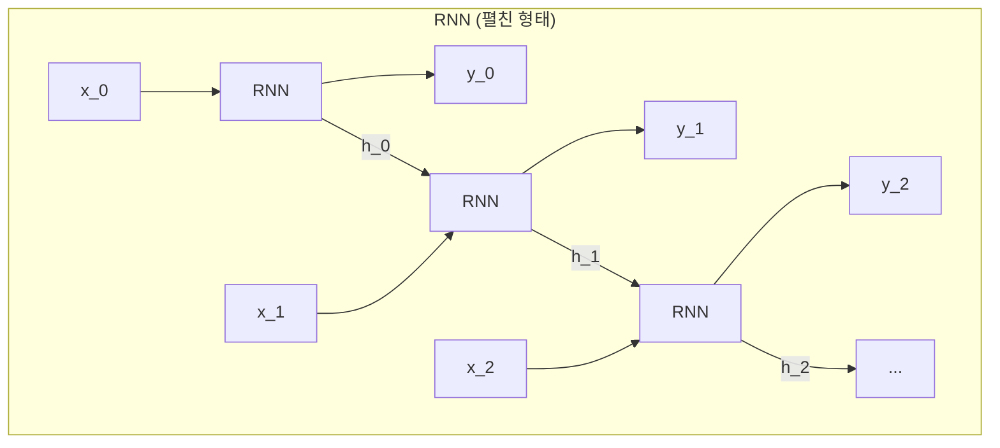
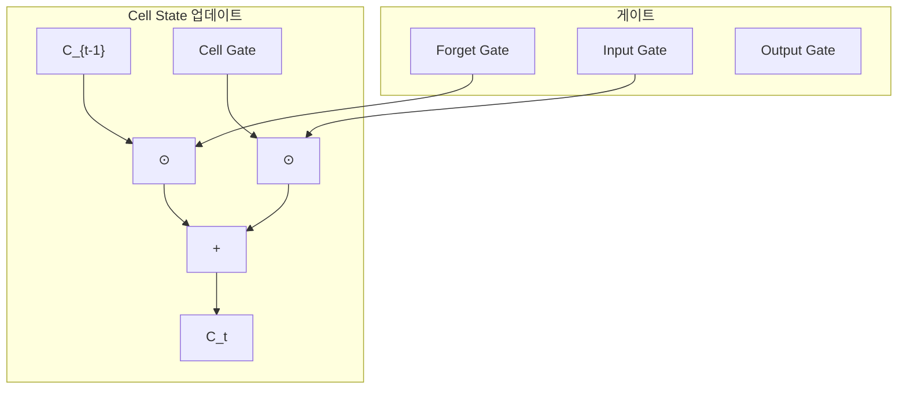
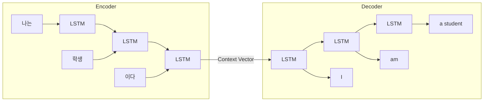

# 5장 순차 데이터 처리: RNN과 LSTM/GRU

## 학습 목표

이 장을 마치면 다음을 수행할 수 있다:
- 순차 데이터의 특성과 기존 신경망의 한계를 이해한다
- RNN의 구조와 작동 원리를 설명할 수 있다
- 장기 의존성 문제와 기울기 소실/폭주 현상을 이해한다
- LSTM과 GRU의 게이트 메커니즘을 설명할 수 있다
- PyTorch로 RNN/LSTM/GRU 기반 언어 모델을 구현할 수 있다

---

## 5.1 순차 데이터의 이해

### 5.1.1 순차 데이터의 특성

순차 데이터(Sequential Data)는 순서가 중요한 데이터이다. 자연어, 시계열 데이터, 오디오 신호, 동영상 프레임 등이 이에 해당한다. "나는 학교에 간다"와 "학교에 나는 간다"는 같은 단어로 구성되지만 순서에 따라 의미가 달라진다.

순차 데이터의 핵심 특성은 시간적 의존성(Temporal Dependency)이다. 현재 시점의 데이터는 이전 시점의 데이터와 관련이 있다. 예를 들어, 문장에서 "그는 사과를 ___"의 빈칸을 채우려면 앞의 문맥을 이해해야 한다.

### 5.1.2 Feedforward 네트워크의 한계

4장에서 학습한 다층 퍼셉트론(MLP)은 고정 길이의 입력만 처리할 수 있다. 10개의 단어로 구성된 문장을 처리하도록 설계된 MLP는 15개의 단어로 구성된 문장을 처리할 수 없다.

더 큰 문제는 MLP가 입력 간의 순서 관계를 파악하지 못한다는 것이다. MLP는 각 입력을 독립적으로 처리하므로, 단어의 순서가 바뀌어도 같은 결과를 낼 수 있다. 이는 언어 처리에서 치명적인 한계이다.

### 5.1.3 순환 구조의 필요성

순차 데이터를 효과적으로 처리하려면 다음 두 가지가 필요하다:

첫째, 가변 길이 입력을 처리할 수 있어야 한다. 문장의 길이가 다양하므로, 모델은 임의의 길이를 가진 시퀀스를 처리할 수 있어야 한다.

둘째, 과거 정보를 기억할 수 있어야 한다. 현재 단어를 처리할 때 이전 단어들의 정보를 활용할 수 있어야 한다.

순환 신경망(RNN)은 이러한 요구사항을 충족하기 위해 설계되었다.

---

## 5.2 순환 신경망(RNN)

### 5.2.1 RNN의 기본 구조

순환 신경망(Recurrent Neural Network, RNN)은 순환 연결을 가진 신경망이다. 일반적인 신경망은 입력에서 출력으로 정보가 한 방향으로만 흐르지만, RNN은 자기 자신에게 연결되는 순환 연결을 가진다.

RNN의 핵심 요소는 Hidden State(은닉 상태)이다. Hidden State는 이전 시간 단계의 정보를 저장하는 메모리 역할을 한다. 각 시간 단계에서 RNN은 현재 입력과 이전 Hidden State를 결합하여 새로운 Hidden State를 생성한다.



**그림 5.1** RNN의 펼친 구조

### 5.2.2 Hidden State의 개념

Hidden State h_t는 시간 t까지의 모든 정보를 요약한 벡터이다. 다음 수식으로 계산된다:

h_t = tanh(W_xh · x_t + W_hh · h_{t-1} + b)

여기서 W_xh는 입력에서 Hidden State로의 가중치, W_hh는 이전 Hidden State에서 현재 Hidden State로의 가중치, b는 편향이다. tanh 함수는 출력을 -1과 1 사이로 정규화한다.

중요한 점은 모든 시간 단계에서 동일한 가중치(W_xh, W_hh, b)를 공유한다는 것이다. 이를 가중치 공유(Weight Sharing)라고 하며, 이로 인해 RNN은 임의 길이의 시퀀스를 처리할 수 있다.

### 5.2.3 RNN의 순전파

PyTorch에서 RNN을 사용하는 방법은 다음과 같다:

```python
rnn = nn.RNN(input_size, hidden_size, batch_first=True)
output, h_n = rnn(x, h0)
```

입력 x의 shape은 (batch, seq_len, input_size)이고, 출력 output의 shape은 (batch, seq_len, hidden_size)이다. h_n은 마지막 시간 단계의 Hidden State이다.

실행 결과:

```
입력 shape: torch.Size([2, 5, 3])
  - 배치 크기: 2
  - 시퀀스 길이: 5
  - 입력 차원: 3

출력 shape: torch.Size([2, 5, 4])
  - (batch=2, seq_len=5, hidden=4)
최종 hidden state shape: torch.Size([1, 2, 4])
```

_전체 코드는 practice/chapter5/code/5-2-rnn기초.py 참고_

### 5.2.4 BPTT (Backpropagation Through Time)

RNN의 역전파는 시간 축을 따라 진행된다. 이를 BPTT(Backpropagation Through Time)라고 한다. RNN을 시간 축으로 펼친 후, 일반적인 역전파를 적용한다.

BPTT에서는 기울기가 시간을 거슬러 올라가며 계산된다. 시간 T에서의 손실이 시간 t의 파라미터에 영향을 미치려면, T-t번의 곱셈을 거쳐야 한다.

---

## 5.3 RNN의 문제점

### 5.3.1 장기 의존성 문제

장기 의존성(Long-term Dependency) 문제는 RNN이 먼 과거의 정보를 현재에 활용하지 못하는 현상이다.

예를 들어, "I grew up in France, so I speak fluent ___"라는 문장에서 빈칸을 채우려면 "France"라는 정보가 필요하다. 그러나 RNN은 시퀀스가 길어지면 초기 정보를 잊어버린다.

이 문제는 Hidden State가 고정 크기의 벡터라는 점에서 기인한다. 모든 과거 정보를 제한된 크기의 벡터에 압축해야 하므로, 오래된 정보는 점점 희석된다.

### 5.3.2 기울기 소실

기울기 소실(Vanishing Gradient)은 BPTT에서 기울기가 시간을 거슬러 올라가면서 기하급수적으로 작아지는 현상이다.

Hidden State 업데이트 수식에서 tanh 함수의 미분값은 최대 1이다. 시간 단계를 거듭할수록 기울기는 계속 곱해지므로, 100 시간 단계 전의 입력에 대한 기울기는 거의 0에 가까워진다.

기울기가 0에 가까워지면 파라미터가 업데이트되지 않는다. 이로 인해 RNN은 먼 과거의 정보를 학습하지 못한다.

### 5.3.3 기울기 폭주

기울기 폭주(Exploding Gradient)는 기울기가 기하급수적으로 커지는 현상이다. 가중치 행렬의 고유값이 1보다 크면 기울기가 폭주할 수 있다.

기울기 폭주는 Gradient Clipping으로 해결할 수 있다. 기울기의 norm이 임계값을 초과하면 잘라내는 방법이다:

```python
torch.nn.utils.clip_grad_norm_(model.parameters(), max_norm=5.0)
```

그러나 기울기 소실은 Clipping으로 해결할 수 없다. 이를 위해 LSTM과 GRU가 개발되었다.

---

## 5.4 LSTM (Long Short-Term Memory)

### 5.4.1 LSTM의 핵심 아이디어

LSTM(Long Short-Term Memory)은 1997년 Hochreiter와 Schmidhuber가 제안한 RNN의 변형이다. LSTM은 기울기 소실 문제를 해결하기 위해 두 가지 핵심 아이디어를 도입했다.

첫째, Cell State라는 별도의 메모리 경로를 추가했다. Cell State는 컨베이어 벨트처럼 정보를 거의 변형 없이 전달한다.

둘째, 게이트(Gate) 메커니즘을 도입했다. 게이트는 정보의 흐름을 제어하는 밸브 역할을 한다. 시그모이드 함수를 사용하여 0과 1 사이의 값을 출력하고, 이 값으로 정보의 통과량을 결정한다.

### 5.4.2 세 가지 게이트

LSTM은 세 가지 게이트를 가진다:

**Forget Gate (망각 게이트)**: 이전 Cell State에서 버릴 정보를 결정한다.

f_t = σ(W_f · [h_{t-1}, x_t] + b_f)

0에 가까우면 해당 정보를 버리고, 1에 가까우면 유지한다.

**Input Gate (입력 게이트)**: 새로운 정보 중 저장할 부분을 결정한다.

i_t = σ(W_i · [h_{t-1}, x_t] + b_i)

**Output Gate (출력 게이트)**: Cell State에서 출력할 정보를 결정한다.

o_t = σ(W_o · [h_{t-1}, x_t] + b_o)

### 5.4.3 LSTM의 정보 흐름

Cell State 업데이트는 다음과 같이 진행된다:

1. 새로운 후보 값 생성: g_t = tanh(W_g · [h_{t-1}, x_t] + b_g)
2. Cell State 업데이트: C_t = f_t ⊙ C_{t-1} + i_t ⊙ g_t
3. Hidden State 계산: h_t = o_t ⊙ tanh(C_t)

여기서 ⊙는 요소별 곱셈(element-wise multiplication)을 의미한다.



**그림 5.2** LSTM Cell의 정보 흐름

### 5.4.4 LSTM이 장기 의존성을 해결하는 방법

LSTM이 기울기 소실을 방지하는 핵심은 Cell State의 **덧셈** 업데이트이다.

C_t = f_t ⊙ C_{t-1} + i_t ⊙ g_t

기존 RNN은 Hidden State를 곱셈과 tanh로 업데이트했다. 곱셈은 기울기를 기하급수적으로 감소시킨다. 반면 LSTM의 Cell State는 덧셈으로 업데이트되므로, 기울기가 직접 흐를 수 있다.

Forget Gate가 1에 가까우면 이전 Cell State가 거의 그대로 유지된다. 이 경우 기울기도 거의 그대로 역전파된다. 네트워크는 학습을 통해 언제 기울기를 유지하고 언제 소멸시킬지 결정한다.

실행 결과:

```
RNN 파라미터: 120
LSTM 파라미터: 480
LSTM/RNN 비율: 4.00x
(LSTM은 4개 게이트로 인해 약 4배 파라미터)
```

_전체 코드는 practice/chapter5/code/5-4-lstm.py 참고_

---

## 5.5 GRU (Gated Recurrent Unit)

### 5.5.1 GRU의 구조

GRU(Gated Recurrent Unit)는 2014년 Cho 등이 제안한 LSTM의 간소화된 버전이다. GRU는 LSTM의 복잡성을 줄이면서도 비슷한 성능을 달성한다.

GRU와 LSTM의 주요 차이점:

첫째, GRU는 Cell State가 없다. Hidden State만 사용한다.

둘째, GRU는 2개의 게이트만 가진다. LSTM의 3개 게이트를 2개로 통합했다.

### 5.5.2 Reset Gate와 Update Gate

**Reset Gate (리셋 게이트)**: 이전 Hidden State를 얼마나 무시할지 결정한다.

r_t = σ(W_r · [h_{t-1}, x_t])

0에 가까우면 과거 정보를 무시하고 새로 시작한다.

**Update Gate (업데이트 게이트)**: 이전 Hidden State와 새로운 후보 값의 혼합 비율을 결정한다.

z_t = σ(W_z · [h_{t-1}, x_t])

이 게이트는 LSTM의 Forget Gate와 Input Gate를 하나로 통합한 것이다.

Hidden State 업데이트:

n_t = tanh(W_n · [r_t ⊙ h_{t-1}, x_t])

h_t = (1 - z_t) ⊙ n_t + z_t ⊙ h_{t-1}

z_t가 1에 가까우면 이전 Hidden State를 유지하고, 0에 가까우면 새로운 값을 사용한다.

### 5.5.3 LSTM vs GRU 비교

| 항목 | LSTM | GRU |
|------|------|-----|
| 게이트 수 | 3개 (input, forget, output) | 2개 (reset, update) |
| 상태 | Hidden State + Cell State | Hidden State만 |
| 파라미터 수 | 더 많음 | ~25% 적음 |
| 학습 속도 | 느림 | 20-40% 빠름 |
| 장기 의존성 | 우수 | 좋음 |

**표 5.1** LSTM과 GRU 비교

실행 결과:

```
[파라미터 수]
  LSTM: 99,328
  GRU:  74,496
  GRU/LSTM: 75.0%

[추론 속도 (100 iterations)]
  LSTM: 1.3067s
  GRU:  0.9444s
  GRU 속도 향상: 27.7%
```

_전체 코드는 practice/chapter5/code/5-5-gru.py 참고_

### 5.5.4 선택 가이드

GRU를 선택하는 경우:
- 데이터셋이 작을 때 (과적합 위험 감소)
- 빠른 학습이 필요할 때
- 메모리가 제한될 때
- 시퀀스가 비교적 짧을 때

LSTM을 선택하는 경우:
- 대용량 데이터셋
- 매우 긴 시퀀스
- 복잡한 장기 의존성이 중요할 때

실무적으로는 먼저 GRU로 빠르게 실험한 후, 성능이 부족하면 LSTM을 시도하는 것이 효율적이다.

---

## 5.6 Sequence-to-Sequence 모델

### 5.6.1 Encoder-Decoder 구조

Sequence-to-Sequence(Seq2Seq) 모델은 입력 시퀀스를 출력 시퀀스로 변환하는 모델이다. 기계 번역, 텍스트 요약, 대화 시스템 등에 활용된다.

Seq2Seq 모델은 Encoder와 Decoder로 구성된다:

**Encoder**: 입력 시퀀스를 고정 길이의 Context Vector로 압축한다. 입력 시퀀스의 모든 단어를 순차적으로 처리한 후, 마지막 Hidden State를 Context Vector로 사용한다.

**Decoder**: Context Vector를 기반으로 출력 시퀀스를 생성한다. 각 시간 단계에서 이전에 생성한 단어와 Hidden State를 입력으로 받아 다음 단어를 예측한다.



**그림 5.3** Sequence-to-Sequence 구조

### 5.6.2 Seq2Seq의 한계

Seq2Seq 모델의 가장 큰 한계는 고정 길이 Context Vector이다. 아무리 긴 입력 시퀀스도 하나의 벡터로 압축해야 한다. 이는 정보 병목(Information Bottleneck)을 야기한다.

입력 문장이 길어질수록 Context Vector가 모든 정보를 담기 어려워진다. 연구에 따르면 입력 문장이 20단어를 넘어가면 번역 품질이 급격히 저하된다.

이 문제를 해결하기 위해 Attention 메커니즘이 개발되었다. Attention은 Decoder가 출력을 생성할 때 입력의 모든 위치를 직접 참조할 수 있게 한다. 이에 대해서는 6장에서 자세히 다룬다.

---

## 5.7 실습: Character-level 언어 모델

이 절에서는 LSTM을 사용하여 문자 단위 언어 모델을 구현한다. 문자 단위 모델은 다음 문자를 예측하는 방식으로 텍스트를 생성한다.

### 5.7.1 Character-level 모델의 특징

문자 단위 모델은 단어 단위 모델과 비교하여 다음과 같은 특징이 있다:

첫째, 어휘 크기가 작다. 영어는 약 100개, 한국어는 약 2000개의 문자만 사용한다. 반면 단어 단위 모델은 수만 개의 어휘가 필요하다.

둘째, 미등록 단어(OOV) 문제가 없다. 모든 텍스트를 문자 조합으로 표현할 수 있다.

셋째, 철자와 형태론적 패턴을 학습할 수 있다.

### 5.7.2 모델 구조

모델은 Embedding → LSTM → Linear로 구성된다:

```python
class CharLSTM(nn.Module):
    def __init__(self, vocab_size, embed_size, hidden_size, num_layers=1):
        super(CharLSTM, self).__init__()
        self.embedding = nn.Embedding(vocab_size, embed_size)
        self.lstm = nn.LSTM(embed_size, hidden_size, num_layers, batch_first=True)
        self.fc = nn.Linear(hidden_size, vocab_size)

    def forward(self, x, hidden=None):
        embed = self.embedding(x)
        output, hidden = self.lstm(embed, hidden)
        logits = self.fc(output)
        return logits, hidden
```

### 5.7.3 Temperature Sampling

텍스트 생성 시 Temperature 파라미터로 다양성을 조절할 수 있다:

```python
logits = logits / temperature
probs = torch.softmax(logits, dim=-1)
next_idx = torch.multinomial(probs, 1)
```

Temperature의 효과:
- T < 1: 높은 확률 문자가 더 자주 선택된다. 안전하지만 반복적인 텍스트가 생성된다.
- T = 1: 학습된 분포 그대로 샘플링한다.
- T > 1: 낮은 확률 문자도 선택될 가능성이 높아진다. 창의적이지만 오류가 증가한다.

실행 결과:

```
[Temperature = 0.5]
  인공지능의 한 분야로 신경망을 깊게 쌓아 복잡한 패턴을 학습한다.

[Temperature = 1.5]
  인공지능은 인간의 학습 능력과 추론 능력을 모방하여 만든 컴퓨터 시스템이다.
```

Temperature가 낮을수록 더 결정적이고, 높을수록 더 다양한 텍스트가 생성된다.

_전체 코드는 practice/chapter5/code/5-7-문자단위언어모델.py 참고_

---

## 요약

이 장에서는 순차 데이터를 처리하는 순환 신경망을 학습했다.

**RNN**: 순환 연결을 통해 과거 정보를 유지한다. Hidden State가 메모리 역할을 하며, 모든 시간 단계에서 가중치를 공유한다. 그러나 장기 의존성 문제와 기울기 소실로 인해 긴 시퀀스 학습에 한계가 있다.

**LSTM**: Cell State와 게이트 메커니즘으로 장기 의존성 문제를 해결한다. Forget Gate, Input Gate, Output Gate가 정보 흐름을 제어하며, Cell State의 덧셈 업데이트로 기울기가 안정적으로 흐른다.

**GRU**: LSTM의 간소화 버전으로, Reset Gate와 Update Gate만 사용한다. 파라미터가 25% 적고 학습이 20-40% 빠르지만, 많은 태스크에서 LSTM과 비슷한 성능을 보인다.

**Seq2Seq**: Encoder-Decoder 구조로 가변 길이 시퀀스 변환을 수행한다. 고정 길이 Context Vector의 한계로 인해 Attention 메커니즘이 필요하다.

---

## 연습 문제

1. RNN에서 기울기 소실이 발생하는 이유를 BPTT 관점에서 설명하라.

2. LSTM의 Forget Gate가 항상 1이고 Input Gate가 항상 0이면 어떤 현상이 발생하는가?

3. 동일한 태스크에 대해 RNN, LSTM, GRU 모델을 학습시키고 성능을 비교하라.

4. Character-level 언어 모델에서 Temperature를 0.1, 1.0, 2.0으로 설정하고 생성된 텍스트의 특성을 비교하라.

5. Seq2Seq 모델에서 입력 문장이 길어질수록 성능이 저하되는 이유를 설명하고, 이를 해결할 수 있는 방법을 제안하라.

---

## 참고문헌

Hochreiter, S., & Schmidhuber, J. (1997). Long Short-Term Memory. *Neural Computation*, 9(8), 1735-1780.

Cho, K., van Merrienboer, B., Gulcehre, C., Bahdanau, D., Bougares, F., Schwenk, H., & Bengio, Y. (2014). Learning Phrase Representations using RNN Encoder-Decoder for Statistical Machine Translation. *EMNLP*.

Sutskever, I., Vinyals, O., & Le, Q. V. (2014). Sequence to Sequence Learning with Neural Networks. *NeurIPS*.

PyTorch Documentation. (2025). Sequence Models and Long Short-Term Memory Networks. https://docs.pytorch.org/tutorials/beginner/nlp/sequence_models_tutorial.html
