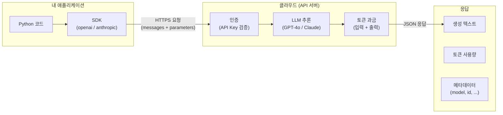
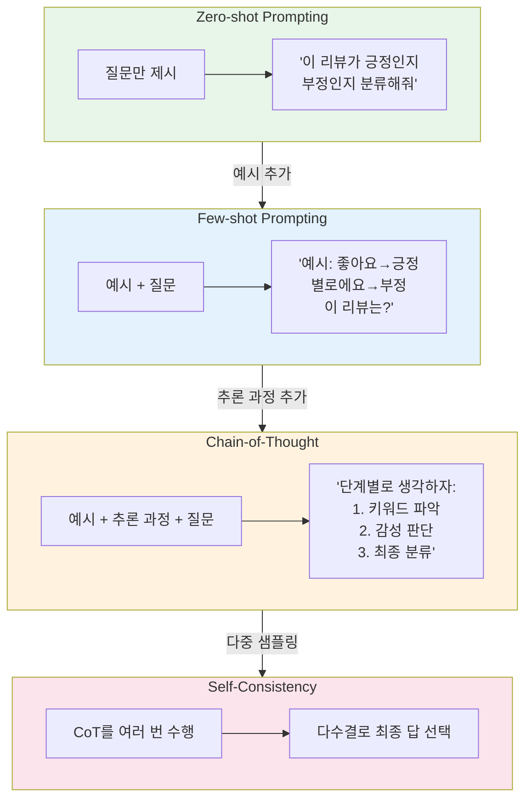
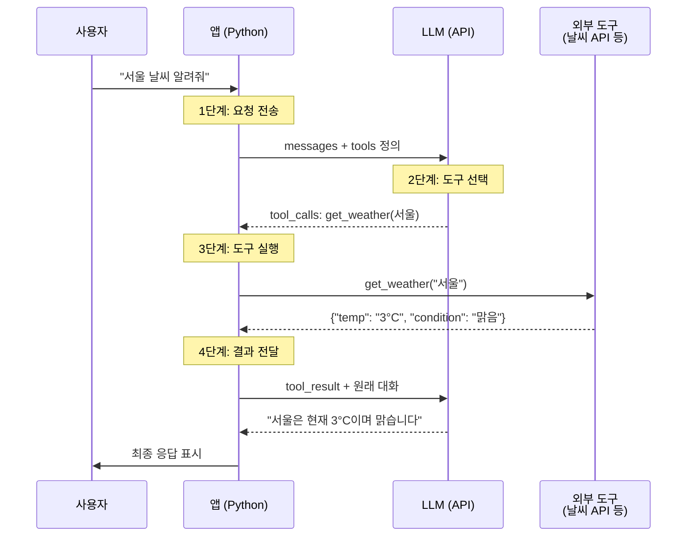
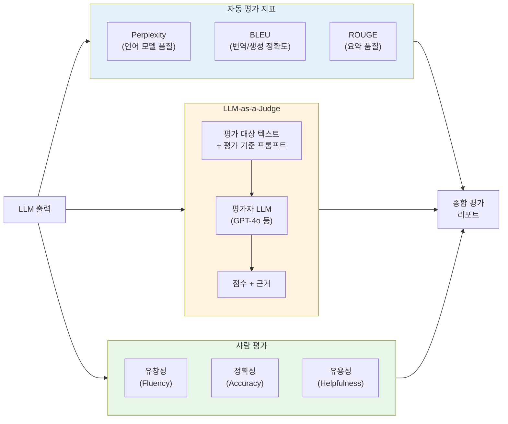

# 제6장: LLM API 활용과 프롬프트 엔지니어링

> **미션**: 수업이 끝나면 LLM API로 나만의 AI 앱 프로토타입을 만든다

## 학습 목표

이 장을 마치면 다음을 수행할 수 있다:

1. 주요 LLM API(OpenAI, Anthropic)의 호출 방식과 토큰 과금 구조를 이해한다
2. Zero-shot, Few-shot, Chain-of-Thought 프롬프팅 기법의 차이를 비교하고 적용할 수 있다
3. Structured Output(JSON Mode, Pydantic)으로 LLM 출력을 구조화할 수 있다
4. Function Calling을 구현하여 LLM에 외부 도구를 연동할 수 있다
5. LLM-as-a-Judge 패턴으로 모델 출력을 자동 평가할 수 있다

### 수업 타임라인

| 시간 | 구분 | 내용 |
|------|------|------|
| 00:00~00:50 | **1교시** | 상용 LLM API + 프롬프트 엔지니어링 |
| 00:50~01:00 | 쉬는시간 | |
| 01:00~01:50 | **2교시** | Structured Output + Function Calling + LLM 평가 |
| 01:50~02:00 | 쉬는시간 | |
| 02:00~02:50 | **3교시** | API 활용 실습 + 과제 |

---

#### 1교시: LLM API와 프롬프트 엔지니어링

## 6.1 상용 LLM API 생태계

**직관적 이해**: 자동차 엔진을 직접 만들 필요 없이 택시를 타면 된다. LLM API는 "수천억 파라미터의 거대한 모델을 인터넷으로 빌려 쓰는 것"이다. 내 컴퓨터에 GPT-4나 Claude를 올릴 수 없지만, API 한 줄 호출로 이 모델들의 능력을 활용할 수 있다. 택시 요금을 내듯 사용한 토큰만큼만 비용을 지불한다.

### API의 필요성

5장까지 BERT와 GPT의 내부 구조를 학습했다. 그런데 이 모델들을 실제 서비스에 적용하려면 수백 GB의 GPU 메모리, 수천 시간의 학습, 수백만 달러의 비용이 필요하다. 대부분의 개발자와 기업은 이런 자원을 갖추기 어렵다.

이 문제를 해결하는 것이 **API(Application Programming Interface)**이다. API 제공자가 대규모 인프라에서 모델을 운영하고, 개발자는 HTTP 요청으로 모델의 추론 결과만 받는다. GPU를 구매할 필요도, 모델을 직접 배포할 필요도 없다.



**그림 6.1** LLM API 호출 흐름

### 주요 API 제공자 비교

현재 LLM API 생태계는 크게 네 축으로 구성된다.

**표 6.1** 주요 LLM API 제공자 비교 (2026년 초 기준)

| 제공자 | 대표 모델 | 특징 | 컨텍스트 길이 |
|--------|----------|------|:---:|
| **OpenAI** | GPT-4o, o1, o3 | 가장 넓은 생태계, Function Calling 선구자 | 128K |
| **Anthropic** | Claude 4.5 Sonnet, Claude Opus 4 | 긴 컨텍스트, 안전성 강조 | 200K |
| **Google** | Gemini 2.0 Flash/Pro | 멀티모달 통합, 1M 토큰 컨텍스트 | 1M |
| **오픈소스** | Llama 4, Mistral, DeepSeek | 로컬 실행 가능, 커스터마이징 자유 | 다양 |

상용 API는 "편의성 + 최고 성능"을, 오픈소스는 "자유도 + 비용 통제"를 제공한다. 프로젝트의 요구사항에 따라 적절히 선택하면 된다.

### API 호출의 기본 구조

모든 LLM API는 동일한 패턴을 따른다: **메시지 리스트를 보내면 생성된 텍스트를 받는다.** 두 주요 SDK의 호출 구조를 비교해 보자.

**OpenAI SDK** (Chat Completions API):

```python
from openai import OpenAI
client = OpenAI()  # OPENAI_API_KEY 환경변수 자동 사용

response = client.chat.completions.create(
    model="gpt-4o",
    messages=[
        {"role": "system", "content": "당신은 NLP 전문가입니다."},
        {"role": "user", "content": "자연어처리가 무엇인지 설명해주세요."},
    ],
)
print(response.choices[0].message.content)
```

**Anthropic SDK** (Messages API):

```python
import anthropic
client = anthropic.Anthropic()  # ANTHROPIC_API_KEY 환경변수 자동 사용

message = client.messages.create(
    model="claude-sonnet-4-5-20250514",
    max_tokens=1024,
    system="당신은 NLP 전문가입니다.",
    messages=[
        {"role": "user", "content": "자연어처리가 무엇인지 설명해주세요."},
    ],
)
print(message.content[0].text)
```

두 SDK의 구조는 유사하지만 세부 사항에서 차이가 있다.

**표 6.2** OpenAI vs Anthropic SDK 구조 비교

| 항목 | OpenAI | Anthropic |
|------|--------|-----------|
| System 메시지 | messages 배열 내 `role: "system"` | 별도 `system=` 파라미터 |
| max_tokens | 선택 (기본값 있음) | **필수** |
| 응답 텍스트 | `response.choices[0].message.content` | `message.content[0].text` |
| 토큰 사전 계산 | 클라이언트(`tiktoken` 라이브러리) | 서버(`count_tokens()` API) |

_전체 코드는 practice/chapter6/code/6-1-api기초.py 참고_

### API Key 관리

API 호출에는 **API Key**가 필요하다. 이 키는 비밀번호와 같으므로 코드에 직접 쓰면 안 된다. `python-dotenv` 라이브러리로 `.env` 파일에서 로드하는 것이 표준 패턴이다.

```python
# .env 파일 (절대 Git에 커밋하지 않는다)
OPENAI_API_KEY=sk-xxxxxxxxxxxx
ANTHROPIC_API_KEY=sk-ant-xxxxxxxxxxxx
```

```python
from dotenv import load_dotenv
load_dotenv()  # .env 파일의 변수를 환경변수로 로드
# 이후 OpenAI(), Anthropic() 생성 시 자동으로 환경변수 참조
```

> **강의 팁**: `.gitignore`에 `.env`를 반드시 추가하도록 안내한다. API Key가 GitHub에 공개되면 수십만 원의 요금이 청구될 수 있다.

### 토큰과 과금

LLM API는 **토큰(Token)** 단위로 과금한다. 토큰은 단어보다 작은 단위로, 영어에서는 단어 1개가 보통 1~2 토큰, 한국어에서는 1개 음절이 보통 1~3 토큰에 해당한다.

```
텍스트별 토큰 수 (GPT-4o, o200k_base 인코딩):
  'Hello, world!'                                       → 4 토큰
  '자연어처리는 인공지능의 핵심 분야입니다.'              → 14 토큰
  'Natural language processing (NLP) is a subfield of AI.' → 14 토큰
```

같은 의미의 문장이라도 한국어는 영어보다 약 1.5~2배 많은 토큰을 소비한다. 한국어 서비스를 운영할 때 비용 추정에 중요한 요소이다.

**표 6.3** 주요 모델 토큰 가격 비교 (2026년 초)

| 모델 | 입력 (1M 토큰) | 출력 (1M 토큰) | 비고 |
|------|:---:|:---:|------|
| GPT-4o | $2.50 | $10.00 | 범용 최고 성능 |
| GPT-4o-mini | $0.15 | $0.60 | 가성비 최강 |
| Claude Sonnet 4.5 | $3.00 | $15.00 | 200K 컨텍스트 |
| Claude Haiku 4.5 | $1.00 | $5.00 | 빠른 응답 |

```
비용 추정 예시 (GPT-4o):
  입력 1,000 토큰 × $2.50/1M = $0.0025
  출력   500 토큰 × $10.00/1M = $0.0050
  합계: $0.0075 (약 10원)
```

하루 1,000회 호출하는 서비스라면 월 약 22만 원이 소요된다. 실무에서는 GPT-4o-mini 같은 경량 모델을 주로 사용하고, 복잡한 작업에만 GPT-4o나 Claude를 투입하는 **계층형 전략**이 일반적이다.

### Rate Limiting

API 서버는 동시 요청 수와 분당 토큰 수를 제한한다. 이를 **Rate Limiting**이라 한다. 제한을 초과하면 `429 Too Many Requests` 에러가 반환된다. 대량 처리 시에는 요청 간 지연을 두거나, 비동기 배치 API를 활용해야 한다.

---

## 6.2 프롬프트 엔지니어링

**직관적 이해**: 프롬프트 엔지니어링은 "AI에게 일 잘 시키는 기술"이다. 같은 직원에게 "이거 해줘"와 "당신은 10년 경력의 데이터 분석가입니다. 아래 데이터를 분석해서 3가지 인사이트를 표 형태로 정리해주세요"라고 요청하면 결과가 완전히 다르다. LLM도 마찬가지다. 프롬프트(지시문)를 어떻게 작성하느냐에 따라 출력의 질이 극적으로 달라진다.

### System Prompt와 Role Prompting

System Prompt는 모델의 **인격과 행동 규칙**을 정의하는 메시지이다. 사용자가 보내는 메시지(User Prompt)와 분리되어 전체 대화에 일관되게 적용된다.

```python
messages = [
    {"role": "system", "content": "당신은 10년 경력의 NLP 연구원입니다. "
                                   "학부생도 이해할 수 있게 설명합니다."},
    {"role": "user", "content": "Attention이 뭔가요?"},
]
```

**Role Prompting**은 System Prompt에 구체적인 역할을 부여하는 기법이다. "초등학교 선생님"에게 물으면 쉬운 비유로, "대학교 교수"에게 물으면 기술 용어로, "유튜버"에게 물으면 유머를 섞어 답한다. 같은 질문이라도 역할에 따라 어휘 수준, 설명 방식, 톤이 완전히 달라진다.

### 프롬프팅 기법의 발전

LLM의 성능을 끌어올리는 프롬프팅 기법은 단순한 것에서 복잡한 것으로 발전해 왔다.



**그림 6.2** 프롬프팅 기법의 발전 계층

### Zero-shot Prompting

가장 단순한 방식이다. 예시 없이 과제만 설명하고 답을 요청한다.

```
프롬프트: "다음 리뷰의 감성을 '긍정' 또는 '부정'으로 분류하세요.
          리뷰: 이 영화는 정말 감동적이었고, 배우들의 연기가 훌륭했습니다."
응답: "긍정"
```

명확한 과제(감성 분류, 번역 등)에서는 Zero-shot만으로 충분한 성능을 낸다. 하지만 모호한 기준이나 복잡한 포맷이 필요한 과제에서는 한계가 있다.

### Few-shot Prompting

**예시(demonstration)를 제공**하여 모델이 패턴을 학습하게 하는 기법이다. Brown et al.(2020)이 GPT-3 논문에서 소개한 이후 LLM 활용의 표준 기법이 되었다.

```
프롬프트: "다음 예시를 참고하여 리뷰의 감성을 분류하세요.

  예시 1: '음식이 맛있고 서비스가 좋았어요' → 긍정
  예시 2: '배달이 너무 늦고 음식이 식었어요' → 부정
  예시 3: '가격 대비 양이 적어서 실망했습니다' → 부정

  리뷰: '직원들이 친절하고 분위기가 아늑해서 다시 오고 싶어요'"
응답: "긍정"
```

Few-shot의 핵심은 **예시가 분류 기준을 암묵적으로 전달**한다는 것이다. 예시를 3~5개 제공하면 대부분의 분류 과제에서 Zero-shot 대비 일관된 성능 향상을 보인다.

### Chain-of-Thought (CoT) Prompting

Wei et al.(2022)이 발견한 획기적인 기법이다. "단계별로 생각하세요(Let's think step by step)"라는 한 줄을 추가하는 것만으로 LLM의 추론 능력이 극적으로 향상된다.

**직관적 이해**: 수학 시험에서 "답만 쓰세요"보다 "풀이 과정을 보여주세요"라고 하면 학생들의 정답률이 올라간다. CoT는 LLM에게 "풀이 과정을 보여줘"라고 요청하는 것과 같다.

다음은 실제 실행 결과이다:

```
문제: "영희는 사과 5개를 가지고 있었습니다. 철수에게 2개를 주고,
      마트에서 3개를 더 샀습니다. 그 중 절반을 이웃에게 나눠주었습니다.
      영희에게 남은 사과는 몇 개인가요?"

─── CoT 없이 (직접 답) ───
  답: 4개  ✗ (오답)

─── CoT 적용 ("단계별로 풀어봅시다." 한 줄 추가) ───
  1단계: 처음 사과 개수 = 5개
  2단계: 철수에게 2개를 줌 → 5 - 2 = 3개
  3단계: 마트에서 3개를 더 삼 → 3 + 3 = 6개
  4단계: 절반을 이웃에게 나눠줌 → 6 ÷ 2 = 3개
  답: 3개  ✓ (정답)
```

CoT가 효과적인 이유는 다음과 같다:

1. **중간 추론 단계를 명시**하므로, 한 번에 답을 내릴 때 발생하는 "점프 오류"를 방지한다
2. 복잡한 문제를 **여러 개의 간단한 하위 문제**로 분해한다
3. 각 단계의 결과가 **다음 단계의 입력**이 되어 논리적 연쇄가 형성된다

### Self-Consistency와 Tree of Thoughts

**Self-Consistency**(Wang et al., 2023)는 CoT를 여러 번 수행한 뒤 **다수결로 최종 답**을 선택하는 기법이다. 하나의 추론 경로가 틀릴 수 있지만, 여러 경로의 합의는 더 신뢰할 수 있다.

**Tree of Thoughts**(Yao et al., 2023)는 한 단계 더 나아가, 추론 과정을 **나무 구조로 확장**한다. 각 추론 단계에서 여러 가지 대안을 탐색하고, 가장 유망한 경로를 선택한다. 탐색, 퍼즐, 계획 수립 같은 복잡한 과제에서 효과적이다.

**표 6.4** 프롬프팅 기법 비교 요약

| 기법 | 원리 | 적합한 과제 | 토큰 비용 |
|------|------|-----------|:---:|
| Zero-shot | 과제만 설명 | 단순 분류, 번역 | 낮음 |
| Few-shot | 예시 제공 | 포맷 제어, 일관성 필요 시 | 중간 |
| CoT | 단계적 추론 유도 | 수학, 논리, 복잡한 추론 | 높음 |
| Self-Consistency | CoT 다수결 | 정확도가 중요한 과제 | 매우 높음 |
| Tree of Thoughts | 나무형 탐색 | 탐색, 퍼즐, 계획 수립 | 매우 높음 |

_전체 코드는 practice/chapter6/code/6-5-프롬프트실습.py 참고_

---

#### 2교시: Structured Output과 LLM 평가

## 6.3 Structured Output과 Function Calling

### Structured Output: LLM 출력 구조화

**직관적 이해**: LLM의 기본 출력은 **에세이**와 같다. 자유롭게 쓰되 형식이 일정하지 않다. 하지만 프로그램에서 LLM 결과를 처리하려면 **양식(Form)**처럼 정해진 형식이 필요하다. Structured Output은 "에세이 작가에게 양식을 작성하게 하는 것"이다.

왜 Structured Output이 중요한가? LLM을 단독으로 쓸 때는 자유 텍스트도 괜찮다. 하지만 LLM을 **프로그램의 부품**으로 쓰려면 출력을 코드로 파싱해야 한다. 자유 텍스트를 파싱하면 "가끔 형식이 깨지는" 문제가 발생한다. Structured Output은 이 문제를 근본적으로 해결한다.

### JSON Mode와 Pydantic

OpenAI와 Anthropic 모두 **Pydantic** 모델을 직접 전달하여 출력 스키마를 강제하는 기능을 지원한다. Pydantic은 Python의 데이터 검증 라이브러리로, 타입 힌트로 데이터 구조를 정의하면 자동으로 검증해 준다.

```python
from pydantic import BaseModel, Field

class NewsExtraction(BaseModel):
    """뉴스 기사에서 추출할 구조화된 정보."""
    company: str = Field(description="기업명")
    period: str = Field(description="실적 기간")
    revenue: str = Field(description="매출액")
    growth_rate: str = Field(description="성장률")
    comparison: str = Field(description="비교 기준")
```

이 Pydantic 모델을 OpenAI API에 전달하면 LLM이 반드시 이 구조에 맞는 JSON을 생성한다:

```python
completion = client.beta.chat.completions.parse(
    model="gpt-4o",
    messages=[{"role": "user", "content": news_text}],
    response_format=NewsExtraction,
)
result = completion.choices[0].message.parsed  # NewsExtraction 객체
```

실행 결과:

```
입력: "삼성전자가 2024년 3분기 매출 79조원을 기록하며
       전년 동기 대비 17% 성장했다고 발표했다."

추출 결과:
  기업명: 삼성전자
  기간: 2024년 3분기
  매출: 79조원
  성장률: 17%
  비교 기준: 전년 동기 대비
```

Pydantic의 **자동 검증** 기능은 LLM 출력의 신뢰성을 높인다. LLM이 잘못된 타입의 값을 반환하면 즉시 `ValidationError`가 발생하여, 오류를 조기에 감지할 수 있다.

### Function Calling: LLM에 팔다리를 달아주다

**직관적 이해**: LLM은 "두뇌"는 뛰어나지만 "팔다리"가 없다. 오늘 날씨를 물으면 "모르겠다"고 답하거나, 학습 데이터의 날씨를 지어낸다(할루시네이션). Function Calling은 LLM에게 **팔다리(외부 도구)를 달아주는 기술**이다. 날씨 API, 검색 엔진, 데이터베이스 등을 "도구"로 정의하면, LLM이 필요할 때 이 도구를 호출하여 실시간 정보를 가져온다.

Function Calling은 4단계로 동작한다.



**그림 6.3** Function Calling 4단계 흐름

각 단계를 코드로 살펴보자.

**1단계**: 사용자 메시지와 함께 사용 가능한 **도구 목록을 정의**하여 전송한다.

```python
tools = [{
    "type": "function",
    "function": {
        "name": "get_weather",
        "description": "지정된 도시의 현재 날씨 정보를 조회한다",
        "parameters": {
            "type": "object",
            "properties": {
                "location": {"type": "string", "description": "도시명"},
                "unit": {"type": "string", "enum": ["celsius", "fahrenheit"]},
            },
            "required": ["location"],
        },
    },
}]
```

**2단계**: LLM이 사용자 요청을 분석하고, 적절한 도구와 인자를 선택한다. LLM은 함수를 직접 실행하지 않고, **"이 함수를 이 인자로 호출해달라"는 요청**을 반환한다.

**3단계**: 애플리케이션이 로컬에서 해당 함수를 실행한다.

**4단계**: 실행 결과를 LLM에게 다시 전달하면, LLM이 자연어로 최종 응답을 생성한다.

실행 결과:

```
사용자: "서울 날씨 알려줘"

  1단계: LLM에게 메시지 + 도구 정보 전송
    finish_reason: tool_calls
  2단계: LLM이 도구 호출 요청
    함수: get_weather
    인자: {"location": "서울", "unit": "celsius"}
  3단계: 도구 실행 결과
    {"temperature": 3, "condition": "맑음", "humidity": 45}
  4단계: LLM 최종 응답
    "서울의 현재 날씨는 맑음이며, 기온은 3°C, 습도는 45%입니다."
```

> **라이브 코딩 시연**: Function Calling 날씨 조회 예제를 라이브로 시연한다. 도구를 정의하고, LLM이 도구를 선택하고, 결과를 받아 자연어로 응답하는 전 과정을 보여준다. 학생들이 "LLM은 함수를 직접 실행하지 않고, 호출 요청만 한다"는 핵심을 이해하도록 강조한다.

Function Calling이 중요한 이유는 이것이 **AI Agent의 기초**이기 때문이다. 12장에서 학습할 AI Agent는 Function Calling을 확장하여 여러 도구를 자율적으로 조합하는 시스템이다.

_전체 코드는 practice/chapter6/code/6-3-function-calling.py 참고_

---

## 6.4 LLM 평가 기초

LLM의 출력은 어떻게 평가할까? 전통적인 분류 문제라면 정확도(Accuracy)로 충분하지만, 자유 형식 텍스트 생성에는 다양한 평가 지표가 필요하다.

### 자동 평가 지표

**Perplexity(혼란도)**는 언어 모델이 다음 토큰을 얼마나 잘 예측하는지 측정한다. 수학적으로 테스트 데이터에 대한 확률의 역수이다.

PPL = 2^( -1/N · Σ log₂ P(wᵢ | w₁, ..., wᵢ₋₁) )

Perplexity가 낮을수록 모델이 텍스트를 잘 예측한다는 의미이다. PPL=1이면 완벽한 예측, PPL=50이면 매 토큰마다 50개 중 고르는 수준의 불확실성이다. 다만, Perplexity는 API 기반 모델에서는 확률값이 제공되지 않아 직접 계산이 어렵다.

**BLEU(Bilingual Evaluation Understudy)**는 기계 번역의 표준 지표로, 생성된 텍스트와 정답 텍스트의 **n-gram 일치도**를 측정한다. 0~1 범위이며 높을수록 좋다. 정밀도(Precision) 기반이므로 "정답에 있는 단어를 얼마나 생성했는가"를 본다.

**ROUGE(Recall-Oriented Understudy for Gisting Evaluation)**는 텍스트 요약의 표준 지표이다. BLEU와 달리 **재현율(Recall)** 기반으로, "정답의 내용이 생성 결과에 얼마나 포함되었는가"를 측정한다.

- ROUGE-1: 단어(unigram) 단위 일치
- ROUGE-2: 2-gram 단위 일치
- ROUGE-L: 최장 공통 부분 수열(LCS) 기반

### LLM-as-a-Judge 패턴

자동 지표만으로는 **유창성, 유용성, 안전성** 같은 질적 측면을 평가하기 어렵다. 사람이 평가하면 가장 정확하지만, 비용이 크고 느리다. 이 간극을 메우는 것이 **LLM-as-a-Judge** 패턴이다.

**직관적 이해**: 학생의 에세이를 다른 교수에게 채점을 맡기는 것과 같다. GPT-4o에게 "이 텍스트를 정확도, 완전성, 명료성 기준으로 10점 만점에 채점하고 근거를 설명해달라"고 요청한다.

```
평가 대상: "Python은 1991년에 귀도 반 로섬이 만든 프로그래밍 언어입니다.
           인터프리터 방식으로 동작하며, 간결한 문법 덕분에 초보자에게 적합합니다."

LLM-as-a-Judge 결과:
  정확도: 9/10
  완전성: 7/10
  명료성: 9/10
  종합:   8.3/10
  피드백: "사실 관계가 정확하고 문장이 명료합니다. 다만, Python의 주요 특징
          (동적 타이핑, 풍부한 라이브러리 생태계 등)을 추가하면 더 완성도 높은
          설명이 될 것입니다."
```

LLM-as-a-Judge의 장점은 **평가 기준을 자연어로 정의**할 수 있다는 것이다. "초등학생 눈높이에 맞는가?", "기술적으로 정확한가?" 같은 맞춤형 기준을 프롬프트에 포함하면 된다.

다만 주의할 점도 있다:

1. **자기 편향(Self-bias)**: 같은 모델의 출력에 높은 점수를 주는 경향
2. **위치 편향(Position bias)**: 여러 답변 중 첫 번째에 높은 점수를 주는 경향
3. **장문 편향(Verbosity bias)**: 더 긴 답변에 높은 점수를 주는 경향

이러한 편향을 완화하기 위해 평가 대상의 순서를 섞거나, 서로 다른 모델(GPT-4o, Claude)을 교차 평가자로 사용하는 기법이 있다.



**그림 6.4** LLM 평가 파이프라인: 자동 지표 + LLM-as-Judge + 사람 평가

### 할루시네이션(Hallucination) 탐지

LLM의 가장 위험한 문제 중 하나가 **할루시네이션**이다. 모델이 사실이 아닌 정보를 그럴듯하게 생성하는 현상을 말한다. 예를 들어, 존재하지 않는 논문을 인용하거나, 실제와 다른 통계를 제시하는 경우가 있다.

할루시네이션을 탐지하는 주요 방법은 다음과 같다:

1. **교차 검증**: 같은 질문을 다른 모델에게 물어 답변을 비교한다
2. **근거 요청**: CoT 패턴으로 답변의 근거를 명시하게 하면, 근거가 부실한 경우 할루시네이션을 의심할 수 있다
3. **RAG 연동**: 11장에서 학습할 RAG 시스템으로 외부 지식을 참조하게 하면 할루시네이션을 크게 줄일 수 있다

---

#### 3교시: API 활용 실습

> **Copilot 활용**: Copilot에게 "OpenAI API로 감성 분석 Function Calling을 구현해줘"와 같이 요청하고, 생성된 코드의 API 버전과 파라미터가 최신인지 검증한다. Copilot이 구버전 API 패턴(`openai.ChatCompletion.create`)을 생성하면 v1.x 패턴(`client.chat.completions.create`)으로 수정해야 한다.

## 6.5 실습

### 실습 환경 준비

이 장의 실습은 **GPU가 필요 없다**. 모든 연산은 API 서버에서 수행되므로 CPU 환경으로 충분하다.

```bash
pip install openai anthropic python-dotenv tiktoken pydantic
```

API Key는 `.env` 파일에 설정한다. 키가 없는 학생은 캐시된 응답으로 실습할 수 있도록 폴백 메커니즘을 구현해 두었다.

### 실습 1: API 기초와 파라미터 실험

OpenAI와 Anthropic API의 기본 호출을 실습하고, temperature 파라미터가 출력에 미치는 영향을 관찰한다.

```
temperature 실험 결과:
  temperature=0.0: "AI의 미래는 인간과 기계가 협력하여 복잡한 문제를 해결하고,
                    더 나은 의사결정을 내리는 시대가 될 것입니다."
  temperature=0.5: "AI의 미래는 개인 맞춤형 교육, 의료 혁신, 그리고 창의적 협업이
                    일상화되는 지능형 파트너 시대로 나아가고 있습니다."
  temperature=1.0: "AI의 미래는 예측 불가능한 창발적 능력과 인간 고유의 직관이
                    뒤섞여, 우리가 상상하지 못한 형태의 문명을 빚어낼 거대한
                    실험이 될 것이다."
```

temperature=0은 결정적(항상 같은 답)이므로 사실 기반 작업에 적합하고, temperature=1은 다양성이 높아 창작에 적합하다.

토큰 비용도 확인한다. 같은 의미라도 **한국어는 영어 대비 약 1.6배**의 토큰을 사용하므로, 한국어 서비스는 비용이 더 높다.

_전체 코드는 practice/chapter6/code/6-1-api기초.py 참고_

### 실습 2: Structured Output과 Function Calling

Pydantic 모델로 뉴스 기사에서 구조화된 정보를 추출하고, Function Calling으로 날씨 조회 도구를 연동한다. Pydantic의 자동 검증 기능으로 LLM 출력의 타입 안전성을 확보하는 패턴을 실습한다.

_전체 코드는 practice/chapter6/code/6-3-function-calling.py 참고_

### 실습 3: 프롬프팅 기법 종합

Zero-shot, Few-shot, CoT의 성능 차이를 직접 비교한다. System Prompt의 역할 설정에 따라 응답 스타일이 어떻게 변하는지 관찰하고, LLM-as-a-Judge 패턴으로 텍스트 품질을 자동 평가한다.

마지막으로 이 기법들을 조합하여 **텍스트 분석 미니앱**을 구현한다. 입력 텍스트에 대해 감성 분석 + 핵심 정보 추출 + 요약을 자동으로 수행하는 파이프라인이다.

_전체 코드는 practice/chapter6/code/6-5-프롬프트실습.py 참고_

**과제**: 도메인 특화 텍스트 분석 시스템을 구축하라. 자신의 전공 분야(법률, 의학, 경제 등)의 텍스트를 입력받아 (1) 핵심 정보를 Structured Output으로 추출하고, (2) Few-shot + CoT로 분류 또는 요약하며, (3) LLM-as-a-Judge로 결과를 자동 평가하는 파이프라인을 구현한다. System Prompt에 도메인 전문가 역할을 부여하여 출력 품질을 높인다.

---

## 핵심 정리

- **LLM API**는 거대 모델을 인터넷으로 빌려 쓰는 서비스이다. GPU 없이 API 한 줄로 GPT-4o, Claude 등을 활용할 수 있으며, 토큰 단위로 과금된다
- **프롬프트 엔지니어링**은 LLM에게 일을 잘 시키는 기술이다. Zero-shot → Few-shot → CoT → Self-Consistency로 발전하며, 각 기법은 더 많은 토큰을 소비하지만 더 높은 성능을 낸다
- **Structured Output**은 Pydantic 모델로 LLM 출력을 구조화하여, 프로그래밍에서 안정적으로 활용할 수 있게 한다
- **Function Calling**은 LLM에 외부 도구(API, DB, 검색)를 연동하는 기술로, AI Agent의 기초이다. LLM은 도구를 직접 실행하지 않고 호출 요청만 한다
- **LLM 평가**는 자동 지표(BLEU, ROUGE), LLM-as-a-Judge, 사람 평가를 종합한다. 할루시네이션은 교차 검증, CoT, RAG로 완화할 수 있다

---

## 더 알아보기

이 장의 내용을 더 깊이 학습하려면 다음 자료를 참고하라:

- Lilian Weng. (2023). Prompt Engineering. *Lil'Log*. https://lilianweng.github.io/posts/2023-03-15-prompt-engineering/
- OpenAI. API Documentation. https://platform.openai.com/docs
- Anthropic. API Documentation. https://docs.anthropic.com/
- Sahoo, P., et al. (2024). A Systematic Survey of Prompt Engineering in Large Language Models. https://arxiv.org/abs/2402.07927

---

## 다음 장 예고

중간고사(7주차) 이후, 8주차부터 본격적인 실무 기술을 다룬다. 8장에서는 대량의 텍스트에서 **숨겨진 주제(토픽)**를 자동으로 발견하는 **토픽 모델링**을 학습한다. LDA부터 BERTopic까지, 비지도 학습으로 텍스트를 분석하는 기법을 익힌다.

---

## 참고문헌

Brown, T. B., et al. (2020). Language Models are Few-Shot Learners. *Advances in Neural Information Processing Systems 33*. https://arxiv.org/abs/2005.14165

Kojima, T., et al. (2022). Large Language Models are Zero-Shot Reasoners. *Advances in Neural Information Processing Systems 35*. https://arxiv.org/abs/2205.11916

Wei, J., et al. (2022). Chain-of-Thought Prompting Elicits Reasoning in Large Language Models. *Advances in Neural Information Processing Systems 35*. https://arxiv.org/abs/2201.11903

Yao, S., et al. (2023). Tree of Thoughts: Deliberate Problem Solving with Large Language Models. *Advances in Neural Information Processing Systems 36*. https://arxiv.org/abs/2305.10601

Sahoo, P., et al. (2024). A Systematic Survey of Prompt Engineering in Large Language Models: Techniques and Applications. https://arxiv.org/abs/2402.07927
