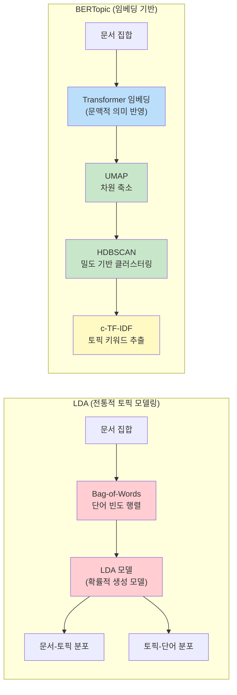
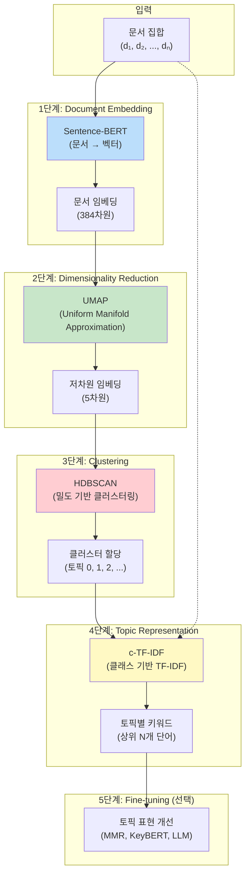
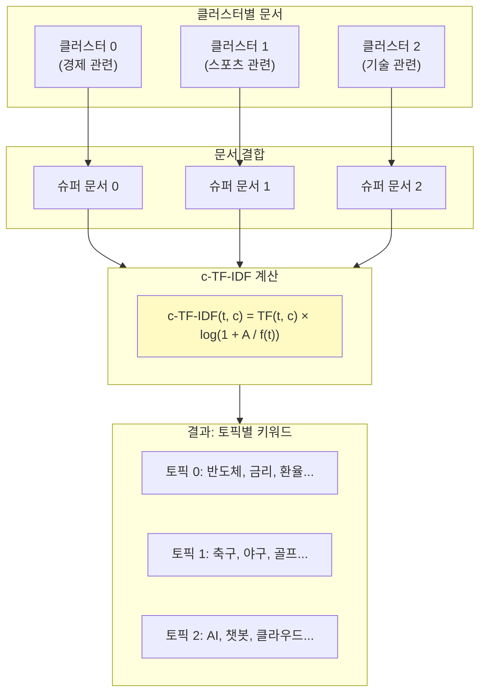

# 8장 텍스트 속 숨겨진 주제 찾기: 임베딩 기반 토픽 모델링

## 학습 목표

이 장을 마치면 다음을 수행할 수 있다:
- 토픽 모델링의 개념과 활용 분야를 이해한다
- 전통적 LDA와 BERTopic의 차이점을 설명할 수 있다
- BERTopic의 5단계 파이프라인을 이해한다
- UMAP, HDBSCAN, c-TF-IDF의 역할을 설명할 수 있다
- BERTopic으로 실제 데이터의 토픽을 추출하고 시각화할 수 있다
- Dynamic Topic Modeling으로 시간에 따른 토픽 변화를 분석할 수 있다

---

## 8.1 토픽 모델링 개요

### 토픽 모델링이란?

토픽 모델링(Topic Modeling)은 대량의 문서 집합에서 숨겨진 주제(토픽)를 자동으로 발견하는 비지도 학습 기법이다. 마치 도서관 사서가 수천 권의 책을 주제별로 분류하듯이, 토픽 모델링은 컴퓨터가 문서들을 자동으로 주제별로 그룹화한다.

예를 들어, 뉴스 기사 10만 건이 있다고 가정하자. 사람이 모든 기사를 읽고 분류하는 것은 불가능에 가깝다. 토픽 모델링은 이러한 대량의 텍스트 데이터에서 "경제", "스포츠", "정치", "문화" 등의 주제를 자동으로 발견하고, 각 문서가 어떤 주제에 해당하는지 분류한다.

### 토픽 모델링 활용 분야

토픽 모델링은 다양한 분야에서 활용된다.

첫째, 뉴스 기사 분류에 활용된다. 실시간으로 쏟아지는 뉴스를 자동으로 카테고리별로 분류하거나, 특정 주제의 기사만 추출할 수 있다.

둘째, 학술 논문 트렌드 분석에 사용된다. 특정 분야의 논문들을 분석하여 연구 트렌드의 변화를 파악하거나, 새롭게 떠오르는 연구 주제를 발견할 수 있다.

셋째, 소셜 미디어 여론 분석에 적용된다. 트위터, 인스타그램 등의 게시물을 분석하여 대중이 어떤 주제에 관심을 가지는지 파악할 수 있다.

넷째, 고객 피드백 분석에 활용된다. 고객 리뷰나 설문 응답을 분석하여 주요 불만 사항이나 만족 요인을 자동으로 추출할 수 있다.

### 전통적 LDA (Latent Dirichlet Allocation)

LDA는 2003년 Blei 등이 제안한 확률적 생성 모델이다. LDA의 핵심 아이디어는 다음과 같다. 문서는 여러 토픽의 혼합으로 구성되며, 각 토픽은 특정 단어들의 분포로 표현된다.

LDA의 작동 원리를 직관적으로 이해해보자. 어떤 문서가 "경제" 토픽 60%, "정치" 토픽 40%로 구성되어 있다면, 이 문서에서는 경제 관련 단어가 정치 관련 단어보다 더 많이 등장할 것이다. LDA는 이러한 확률적 가정을 바탕으로 문서-토픽 분포와 토픽-단어 분포를 동시에 학습한다.

### LDA의 한계점

그러나 LDA는 몇 가지 중요한 한계를 가진다.

첫째, Bag-of-Words 기반이다. LDA는 문서를 단순히 단어들의 집합으로 취급하며, 단어의 순서나 문맥을 고려하지 않는다. 따라서 "은행에서 돈을 찾다"와 "강둑(bank)에서 물고기를 찾다"를 구분하지 못한다.

둘째, 토픽 수를 사전에 지정해야 한다. 분석을 시작하기 전에 토픽이 몇 개인지 미리 결정해야 하는데, 최적의 토픽 수를 찾는 것은 쉽지 않다.

셋째, 짧은 문서에서 성능이 저하된다. 트윗이나 짧은 리뷰처럼 단어 수가 적은 문서에서는 통계적 추정이 어려워 성능이 떨어진다.



**그림 8.1** LDA와 BERTopic의 접근 방식 비교

---

## 8.2 BERTopic 소개

### BERTopic의 등장 배경

BERTopic은 2022년 Maarten Grootendorst가 제안한 토픽 모델링 기법이다. BERTopic은 Transformer 기반 사전학습 언어모델의 강력한 문맥 이해 능력을 토픽 모델링에 활용한다.

BERTopic의 핵심 아이디어는 단순하다. 문서를 Sentence-BERT와 같은 임베딩 모델로 벡터화하면, 의미적으로 유사한 문서들은 벡터 공간에서 가까이 위치하게 된다. 이렇게 가까이 모인 문서들을 클러스터링하면, 자연스럽게 주제별로 그룹화된다.

### BERTopic vs LDA 비교

BERTopic과 LDA의 주요 차이점을 정리하면 다음과 같다.

| 특성 | LDA | BERTopic |
|------|-----|----------|
| 문서 표현 | Bag-of-Words | Transformer 임베딩 |
| 토픽 수 | 사전 지정 필요 | 자동 결정 (HDBSCAN) |
| 문맥 이해 | 불가능 | 가능 |
| 짧은 문서 | 성능 저하 | 우수 |
| 토픽 일관성 (Cv) | 약 0.38 | 약 0.76 |
| 노이즈 처리 | 없음 | Topic -1로 처리 |

**표 8.1** LDA와 BERTopic 비교

특히 주목할 점은 토픽 일관성(Coherence) 점수이다. 최근 연구(Mutsaddi et al., 2025)에 따르면, BERTopic의 C_v 일관성 점수는 LDA의 약 두 배에 달한다. 이는 BERTopic이 더 의미 있고 해석하기 쉬운 토픽을 생성한다는 것을 의미한다.

### BERTopic의 강점

BERTopic의 주요 강점은 다음과 같다.

첫째, 짧은 문서에서도 우수한 성능을 보인다. 임베딩 기반 접근법은 단어 빈도가 아닌 문장의 의미를 파악하므로, 트윗이나 짧은 리뷰에서도 효과적이다.

둘째, 직관적인 토픽 키워드를 생성한다. c-TF-IDF를 통해 각 토픽을 대표하는 핵심 키워드를 명확하게 추출한다.

셋째, 다양한 시각화 기능을 제공한다. Plotly 기반의 인터랙티브 시각화로 토픽 간 관계, 키워드 분포, 시간별 트렌드 등을 직관적으로 파악할 수 있다.

넷째, 모듈화된 파이프라인을 가진다. 임베딩 모델, 차원 축소 알고리즘, 클러스터링 알고리즘을 필요에 따라 교체할 수 있어 유연성이 높다.

---

## 8.3 BERTopic 아키텍처

BERTopic은 5단계 파이프라인으로 구성된다. 각 단계는 독립적으로 작동하며, 필요에 따라 각 구성 요소를 교체할 수 있다.



**그림 8.2** BERTopic 5단계 파이프라인

### 1단계: Document Embedding

첫 번째 단계에서는 각 문서를 고차원 벡터로 변환한다. Sentence-BERT(SBERT)와 같은 사전학습된 임베딩 모델을 사용하여, 문서의 의미를 숫자 벡터로 표현한다.

이 단계의 핵심은 의미적으로 유사한 문서들이 벡터 공간에서 가까이 위치하게 된다는 것이다. 예를 들어, "삼성전자 반도체 실적 호조"와 "SK하이닉스 메모리 매출 증가"는 모두 반도체 관련 뉴스이므로, 두 문서의 임베딩 벡터는 서로 가깝게 위치한다.

### 2단계: Dimensionality Reduction

두 번째 단계에서는 고차원 임베딩을 저차원으로 축소한다. 일반적으로 384차원 또는 768차원의 임베딩을 5차원 정도로 축소한다.

UMAP(Uniform Manifold Approximation and Projection)을 사용하는데, 이는 데이터의 로컬 구조와 글로벌 구조를 모두 보존하면서 차원을 축소한다. 차원 축소는 클러스터링의 효율성을 높이고, 노이즈를 제거하는 효과가 있다.

### 3단계: Clustering

세 번째 단계에서는 저차원 공간에서 문서들을 클러스터링한다. HDBSCAN(Hierarchical Density-Based Spatial Clustering of Applications with Noise)을 사용한다.

HDBSCAN의 장점은 클러스터 수를 자동으로 결정한다는 것이다. 또한 다양한 밀도의 클러스터를 탐지할 수 있고, 어느 클러스터에도 속하지 않는 노이즈 포인트를 별도로 처리한다.

### 4단계: Topic Representation

네 번째 단계에서는 각 클러스터(토픽)를 대표하는 키워드를 추출한다. c-TF-IDF(Class-based TF-IDF)를 사용하여, 각 토픽에서 중요하면서 다른 토픽에서는 드문 단어들을 선별한다.

### 5단계: Fine-tuning (선택)

마지막으로, 토픽 표현을 개선하는 선택적 단계가 있다. MMR(Maximal Marginal Relevance)로 키워드 다양성을 높이거나, LLM을 활용하여 토픽 레이블을 자동 생성할 수 있다.

---

## 8.4 주요 구성 요소 심화

### Sentence Transformers

Sentence Transformers는 문장 수준의 임베딩을 생성하는 프레임워크이다. 기본 BERT가 토큰 단위 임베딩을 생성하는 것과 달리, Sentence Transformers는 문장 전체를 하나의 벡터로 표현한다.

BERTopic에서 자주 사용되는 모델은 다음과 같다.

`all-MiniLM-L6-v2`는 경량 모델로, 384차원 임베딩을 생성한다. 속도가 빠르고 메모리 사용량이 적어 대규모 데이터셋에 적합하다.

`paraphrase-multilingual-MiniLM-L12-v2`는 다국어를 지원하는 모델이다. 한국어를 포함한 50개 이상의 언어에서 사용할 수 있다.

한국어 전용 모델로는 `ko-sbert-nli`, `KoSimCSE`, `Ko-Sentence-BERT` 등이 있다. 한국어 데이터를 분석할 때는 다국어 모델보다 한국어 특화 모델이 더 좋은 성능을 보일 수 있다.

### UMAP (Uniform Manifold Approximation and Projection)

UMAP은 2018년 McInnes 등이 제안한 비선형 차원 축소 알고리즘이다. 리만 기하학과 위상 데이터 분석에 기반하며, t-SNE보다 빠르면서도 글로벌 구조를 더 잘 보존한다.

UMAP의 핵심 하이퍼파라미터는 다음과 같다.

`n_neighbors`는 로컬 구조를 결정하는 파라미터이다. 값이 클수록 더 넓은 범위의 이웃을 고려하여 글로벌 구조를 더 잘 보존하지만, 계산 시간이 증가한다. BERTopic에서는 보통 15를 기본값으로 사용한다.

`n_components`는 출력 차원 수이다. 시각화 목적으로는 2를, 클러스터링 목적으로는 5를 주로 사용한다.

`min_dist`는 저차원 공간에서 포인트 간 최소 거리이다. 값이 작을수록 더 밀집된 클러스터가 형성된다. 클러스터링 목적으로는 0.0을 사용한다.

### HDBSCAN (Hierarchical Density-Based Spatial Clustering)

HDBSCAN은 밀도 기반 클러스터링 알고리즘이다. DBSCAN의 확장 버전으로, 다양한 밀도의 클러스터를 탐지할 수 있다는 장점이 있다.

HDBSCAN의 핵심 하이퍼파라미터는 다음과 같다.

`min_cluster_size`는 클러스터로 인정받기 위한 최소 포인트 수이다. 이 값보다 적은 포인트로 구성된 그룹은 클러스터로 인정되지 않는다. 토픽 모델링에서는 보통 10-50 사이의 값을 사용한다.

`min_samples`는 밀도 추정에 사용되는 샘플 수이다. 값이 클수록 더 보수적인 클러스터링이 수행된다.

HDBSCAN의 특징은 노이즈 포인트를 -1로 할당한다는 것이다. BERTopic에서 Topic -1은 어느 토픽에도 명확히 속하지 않는 아웃라이어 문서들을 의미한다.

### c-TF-IDF (Class-based TF-IDF)

c-TF-IDF는 BERTopic의 핵심 구성 요소로, 각 토픽을 대표하는 키워드를 추출한다. 전통적인 TF-IDF가 문서 단위로 계산되는 것과 달리, c-TF-IDF는 클래스(토픽) 단위로 계산된다.



**그림 8.3** c-TF-IDF 계산 과정

c-TF-IDF의 계산 과정은 다음과 같다.

첫째, 각 클러스터에 속한 모든 문서를 하나의 "슈퍼 문서"로 결합한다.

둘째, 각 슈퍼 문서에 대해 TF-IDF를 계산한다. 이때 TF는 해당 클래스 내 단어 빈도를, IDF는 전체 문서에서의 역문서 빈도를 나타낸다.

수식으로 표현하면:

c-TF-IDF(t, c) = TF(t, c) × log(1 + A / f(t))

여기서 t는 단어, c는 클래스(토픽), TF(t, c)는 클래스 c 내 단어 t의 빈도, A는 전체 문서 수, f(t)는 단어 t가 등장한 문서 수이다.

높은 c-TF-IDF 점수를 가진 단어는 해당 토픽에서 중요하면서 다른 토픽에서는 드문 단어이다. 이러한 단어들이 토픽의 대표 키워드가 된다.

---

## 8.5 토픽 표현 및 해석

### 토픽별 주요 키워드 추출

BERTopic 모델이 학습되면, `get_topic_info()` 메서드로 전체 토픽 정보를 확인할 수 있다. 각 토픽의 문서 수, 대표 키워드 등을 한눈에 볼 수 있다.

특정 토픽의 상세 키워드를 확인하려면 `get_topic(topic_id)` 메서드를 사용한다. 이 메서드는 해당 토픽의 키워드와 c-TF-IDF 점수를 반환한다.

### 토픽 레이블링

BERTopic은 기본적으로 토픽에 번호(0, 1, 2, ...)를 할당한다. 그러나 실제 분석에서는 의미 있는 레이블이 필요하다.

수동 레이블링은 분석자가 토픽 키워드를 보고 직접 레이블을 부여하는 방법이다. 예를 들어, 키워드가 "반도체, 삼성, SK하이닉스, 수출"이면 "반도체 산업"으로 레이블링할 수 있다.

자동 레이블링은 LLM을 활용하는 방법이다. BERTopic은 OpenAI API나 다른 LLM과 연동하여 토픽 레이블을 자동으로 생성할 수 있다.

### Outlier 처리

HDBSCAN은 어느 클러스터에도 명확히 속하지 않는 문서들을 Topic -1(아웃라이어)로 할당한다. 데이터에 따라 아웃라이어 비율이 높을 수 있는데, 이를 처리하는 방법이 있다.

`reduce_outliers()` 메서드는 아웃라이어 문서를 가장 가까운 토픽에 재할당한다. 코사인 유사도를 기반으로 각 아웃라이어 문서와 가장 유사한 토픽을 찾아 할당한다.

다만, 모든 아웃라이어를 강제로 할당하면 토픽의 순수성이 떨어질 수 있으므로, 상황에 따라 적절히 사용해야 한다.

### 토픽 간 유사도 분석

BERTopic은 토픽 임베딩을 제공하여 토픽 간 유사도를 분석할 수 있다. 유사한 토픽들은 벡터 공간에서 가깝게 위치한다.

계층적 토픽 구조를 분석하면, 상위 토픽과 하위 토픽의 관계를 파악할 수 있다. 예를 들어, "반도체"와 "배터리" 토픽이 "전자 산업"이라는 상위 토픽으로 묶일 수 있다.

---

## 8.6 고급 기능

### Dynamic Topic Modeling

Dynamic Topic Modeling(DTM)은 시간에 따른 토픽 변화를 추적하는 기법이다. BERTopic의 `topics_over_time()` 메서드를 사용하면, 각 시점별로 토픽 키워드가 어떻게 변화했는지 분석할 수 있다.

예를 들어, 2020년부터 2025년까지의 AI 관련 뉴스를 분석한다고 가정하자. DTM을 적용하면 다음과 같은 변화를 관찰할 수 있다.

2020년: "머신러닝", "딥러닝", "자율주행"
2023년: "ChatGPT", "생성형 AI", "LLM"
2025년: "AI 에이전트", "AGI", "멀티모달"

이처럼 DTM은 시간의 흐름에 따라 토픽 내용이 어떻게 진화하는지 파악하는 데 유용하다.

### Guided Topic Modeling

Guided Topic Modeling은 사전 지식을 활용하여 토픽 형성을 유도하는 기법이다. `seed_topic_list` 파라미터에 시드 단어를 지정하면, 해당 단어들이 포함된 토픽이 형성되도록 유도할 수 있다.

예를 들어, 다음과 같이 시드 단어를 지정할 수 있다.

```python
seed_topic_list = [
    ["경제", "금융", "투자"],
    ["스포츠", "축구", "야구"],
    ["기술", "AI", "반도체"]
]
```

이렇게 하면 각 시드 단어 그룹과 유사한 문서들이 같은 토픽으로 묶이게 된다.

### Hierarchical Topic Modeling

Hierarchical Topic Modeling은 토픽 간 계층 구조를 분석하는 기법이다. `hierarchical_topics()` 메서드를 사용하면, 유사한 토픽들을 상위 토픽으로 병합한 계층 구조를 생성할 수 있다.

이 기능은 토픽 수가 많을 때 전체적인 구조를 파악하는 데 유용하다. 예를 들어, 50개의 세부 토픽이 10개의 대주제로, 다시 3개의 핵심 테마로 묶이는 구조를 시각화할 수 있다.

### 토픽 병합 및 축소

실제 분석에서는 너무 세분화된 토픽을 병합하거나, 전체 토픽 수를 줄여야 할 때가 있다.

`reduce_topics(nr_topics)` 메서드는 토픽 수를 지정한 개수로 축소한다. 유사한 토픽들이 자동으로 병합된다.

`merge_topics(topics_to_merge)` 메서드는 특정 토픽들을 수동으로 병합한다. 분석자가 판단하기에 같은 주제인 토픽들을 하나로 합칠 수 있다.

---

## 8.7 실습: BERTopic 활용

이 절에서는 BERTopic을 사용하여 실제 데이터에서 토픽을 추출하고 시각화하는 과정을 실습한다.

### 기본 토픽 모델링

_전체 코드는 practice/chapter8/code/8-1-bertopic-basic.py 참고_

다음은 BERTopic의 기본 사용법을 보여주는 핵심 코드이다.

```python
from bertopic import BERTopic
from sentence_transformers import SentenceTransformer

# 임베딩 모델 (다국어 지원)
embedding_model = SentenceTransformer("paraphrase-multilingual-MiniLM-L12-v2")

# BERTopic 모델 생성 및 학습
topic_model = BERTopic(embedding_model=embedding_model)
topics, probs = topic_model.fit_transform(documents)
```

실행 결과:

```
============================================================
BERTopic 기본 토픽 모델링
============================================================

총 문서 수: 28

[1단계] 임베딩 모델 로딩...
   - 모델: paraphrase-multilingual-MiniLM-L12-v2
   - 임베딩 차원: 384

[2단계] UMAP 차원 축소 설정...
   - n_neighbors: 5
   - n_components: 5

[3단계] HDBSCAN 클러스터링 설정...
   - min_cluster_size: 3
   - min_samples: 2

[4단계] CountVectorizer 설정...
   - ngram_range: (1, 2)

[5단계] BERTopic 모델 학습...

============================================================
토픽 모델링 결과
============================================================

발견된 토픽 수: 5
아웃라이어 문서 수: 3

[토픽별 상세 정보]

토픽 -1 (아웃라이어): 3개 문서

토픽 0: 7개 문서
   키워드: 한국, 글로벌, 15호골, 회복세, 월드컵

토픽 1: 6개 문서
   키워드: pop, 1위, 1300원대, 은퇴 배구, 해설위원

토픽 2: 5개 문서
   키워드: 확대, 국내, 시장, 1조원, 출시

토픽 3: 4개 문서
   키워드: 반도체, 생산량, 최대 실적, sk하이닉스 hbm, lg에너지솔루션

토픽 4: 3개 문서
   키워드: 3000선, 투자자 관심, 동결 결정, 급증, 반응

[문서-토픽 할당 예시 (처음 10개)]
------------------------------------------------------------
토픽  3 | 삼성전자 반도체 수출 사상 최대 실적 달성...
토픽  4 | 한국은행 기준금리 동결 결정 배경 분석...
토픽  4 | 코스피 지수 3000선 돌파 투자자 관심 급증...
토픽  3 | 현대차 전기차 생산량 전년 대비 30% 증가...
토픽  3 | SK하이닉스 HBM 반도체 글로벌 시장 점유율 1위...
토픽  1 | 원달러 환율 1300원대 진입 수출기업 영향...
토픽  4 | 카카오뱅크 대출 금리 인하 소비자 반응...
토픽  3 | LG에너지솔루션 배터리 수주 역대 최고치...
토픽  0 | 손흥민 시즌 15호골 기록 팀 승리 이끌어...
토픽 -1 | 프로야구 개막전 관중 10만명 돌파 기대...
```

### 토픽 시각화

_전체 코드는 practice/chapter8/code/8-5-topic-visualization.py 참고_

BERTopic은 다양한 시각화 기능을 제공한다. 주요 시각화 메서드는 다음과 같다.

```python
# 토픽 간 거리 시각화 (Intertopic Distance Map)
topic_model.visualize_topics()

# 토픽별 키워드 점수 (Bar Chart)
topic_model.visualize_barchart()

# 토픽 계층 구조 (Hierarchy)
topic_model.visualize_hierarchy()
```

실행 결과:

```
============================================================
BERTopic 토픽 시각화
============================================================

총 문서 수: 40
BERTopic 모델 학습 중...
학습 완료. 발견된 토픽 수: 5

============================================================
토픽 모델링 결과 요약
============================================================

총 문서 수: 40
발견된 토픽 수: 5
아웃라이어 문서 수: 1

[토픽별 대표 키워드]
------------------------------------------------------------
Topic -1 (Outliers): 1개 문서
Topic 0 (16개): 반도체, 시장, 수출, 증가, 확대
Topic 1 (8개): 1위, pop, 음원차트, 1300원대, 위상
Topic 2 (6개): 한국, 글로벌, 2년, 우승, 진출
Topic 3 (5개): 승리, 기대, 10만명, 평가전 승리, 프로야구 개막전
Topic 4 (4개): 금리, 분석, 3000선, 소비자 반응, 급증 카카오뱅크

   [토픽별 문서 할당 결과]
   --------------------------------------------------------

   [Topic 0 (반도체)] - 16개 문서
      - 삼성전자 반도체 수출 사상 최대 실적 달성...
      - 현대차 전기차 생산량 전년 대비 30% 증가...
      - SK하이닉스 HBM 반도체 글로벌 시장 점유율...

   [Topic 1 (1위)] - 8개 문서
      - 원달러 환율 1300원대 진입 수출기업 영향...
      - 김연경 은퇴 후 배구 해설위원 활동 시작...

   [Topic 2 (한국)] - 6개 문서
      - 한국 축구 대표팀 월드컵 예선 3연승 달성...
      - LPGA 한국 선수 우승 국내 골프 열기...

   [Topic 3 (승리)] - 5개 문서
      - 손흥민 시즌 15호골 기록 팀 승리 이끌어...
      - 프로야구 개막전 관중 10만명 돌파 기대...

   [Topic 4 (금리)] - 4개 문서
      - 한국은행 기준금리 동결 결정 배경 분석...
      - 코스피 지수 3000선 돌파 투자자 관심 급증...
```

### 시간별 토픽 트렌드 분석

_전체 코드는 practice/chapter8/code/8-6-dynamic-topics.py 참고_

Dynamic Topic Modeling으로 시간에 따른 토픽 변화를 분석할 수 있다.

```python
# 시간별 토픽 분석
topics_over_time = topic_model.topics_over_time(documents, timestamps)

# 시각화
topic_model.visualize_topics_over_time(topics_over_time)
```

실행 결과:

```
============================================================
Dynamic Topic Modeling - 시간별 토픽 변화 분석
============================================================

분석 기간: 2023-02 ~ 2025-03
총 문서 수: 42

BERTopic 모델 학습 중...
학습 완료. 발견된 토픽 수: 3

[토픽 개요]
   Topic 0 (29개): ai, 발표, 논의, 도입
   Topic 1 (9개): gpt, 출시, llm, 오픈소스 llm
   Topic 2 (4개): 알트만, agi, 파문 알트만, agi 달성

============================================================
시간별 토픽 변화 분석 결과
============================================================

[2023-01]
----------------------------------------
   Topic 0: ai, ai 챗봇, 챗봇 (freq: 6)
   Topic 1: 출시, gpt, 챗gpt (freq: 5)

[2023-06]
----------------------------------------
   Topic 0: ai, 발표, 논의 (freq: 4)
   Topic 1: 메타 오픈소스, 업계 파장, 메타 (freq: 1)

[2023-10]
----------------------------------------
   Topic 0: ai, 동영상, 생성 충격적 (freq: 2)
   Topic 1: 제미나이 울트라, 울트라 gpt, 능가 (freq: 1)
   Topic 2: 알트만, 해임 파문, 오픈ai 복귀 (freq: 2)

[2024-02]
----------------------------------------
   Topic 0: ai, 온디바이스, 애플 (freq: 3)
   Topic 1: 대화, 실시간 대화, 실시간 (freq: 1)
   Topic 2: 벤치마크, 클로드3, 벤치마크 최고 (freq: 1)

============================================================
토픽 진화 패턴 분석
============================================================

[Topic 0]
   핵심 키워드: ai, 발표, 논의, 도입, 경쟁
   빈도 변화: 6 -> 8 (상승, 33.3%)

[Topic 1]
   핵심 키워드: gpt, 출시, llm, 오픈소스 llm, 챗gpt
   빈도 변화: 5 -> 1 (하락, 80.0%)

[Topic 2]
   핵심 키워드: 알트만, agi, 파문 알트만, agi 달성, ceo
   빈도 변화: 2 -> 1 (하락, 50.0%)
```

위 결과에서 볼 수 있듯이, AI 관련 뉴스의 토픽이 시간에 따라 변화한다. 2023년 초에는 "ChatGPT", "챗봇" 등의 키워드가 중심이었으나, 시간이 지나면서 "AI 에이전트", "AGI" 등 더 발전된 개념으로 토픽이 진화하는 것을 확인할 수 있다.

---

## 정리

이 장에서는 BERTopic을 활용한 임베딩 기반 토픽 모델링을 학습했다. 주요 내용을 정리하면 다음과 같다.

첫째, 토픽 모델링은 대량의 문서에서 숨겨진 주제를 자동으로 발견하는 비지도 학습 기법이다. 전통적인 LDA는 Bag-of-Words 기반으로 문맥을 고려하지 못하는 한계가 있다.

둘째, BERTopic은 Transformer 임베딩, UMAP, HDBSCAN, c-TF-IDF를 결합한 현대적인 토픽 모델링 기법이다. 문맥을 반영하고, 토픽 수를 자동으로 결정하며, 짧은 문서에서도 우수한 성능을 보인다.

셋째, BERTopic의 5단계 파이프라인은 각각 문서 임베딩, 차원 축소, 클러스터링, 토픽 표현, 미세 조정으로 구성된다. 각 단계는 독립적으로 작동하며 필요에 따라 교체할 수 있다.

넷째, Dynamic Topic Modeling, Guided Topic Modeling, Hierarchical Topic Modeling 등의 고급 기능을 통해 더 심층적인 분석이 가능하다.

다음 장에서는 사전학습 언어모델의 대표 주자인 BERT에 대해 학습한다.

---

## 참고문헌

Grootendorst, M. (2022). BERTopic: Neural topic modeling with a class-based TF-IDF procedure. *arXiv preprint*. https://arxiv.org/abs/2203.05794

McInnes, L., Healy, J., & Melville, J. (2018). UMAP: Uniform Manifold Approximation and Projection for Dimension Reduction. *arXiv preprint*. https://arxiv.org/abs/1802.03426

Campello, R. J., Moulavi, D., & Sander, J. (2013). Density-Based Clustering Based on Hierarchical Density Estimates. *Advances in Knowledge Discovery and Data Mining*.

Blei, D. M., Ng, A. Y., & Jordan, M. I. (2003). Latent Dirichlet Allocation. *Journal of Machine Learning Research*.

BERTopic Documentation. https://maartengr.github.io/BERTopic/
