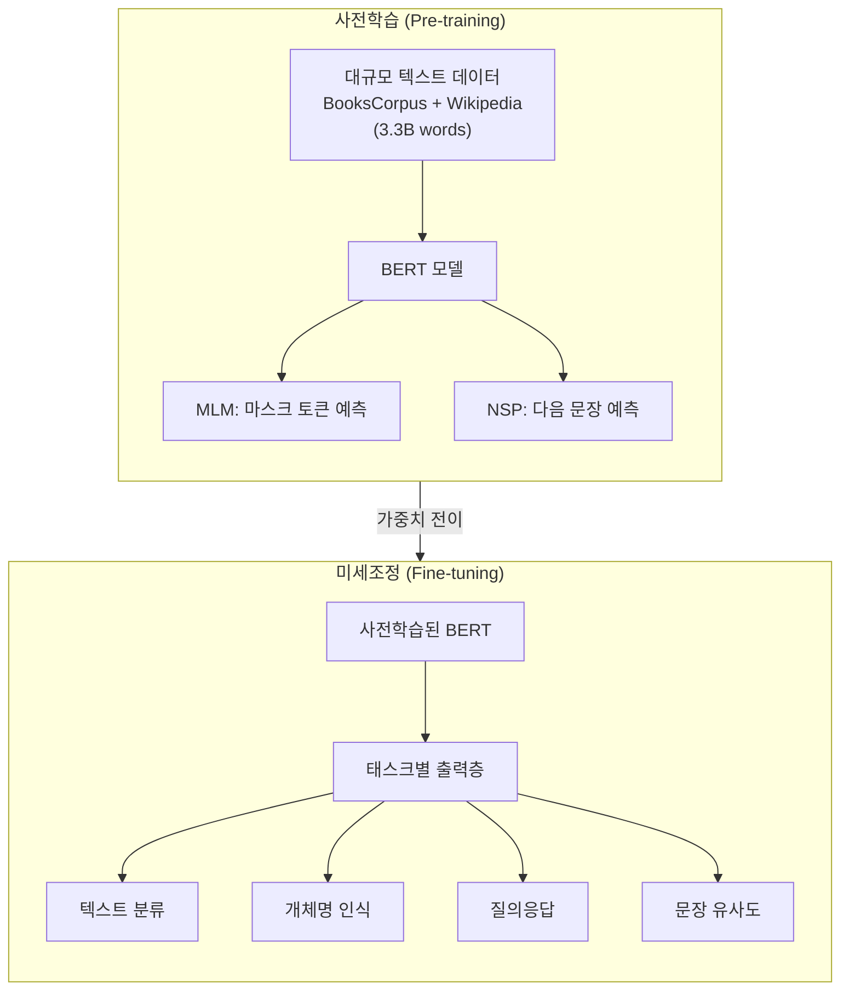
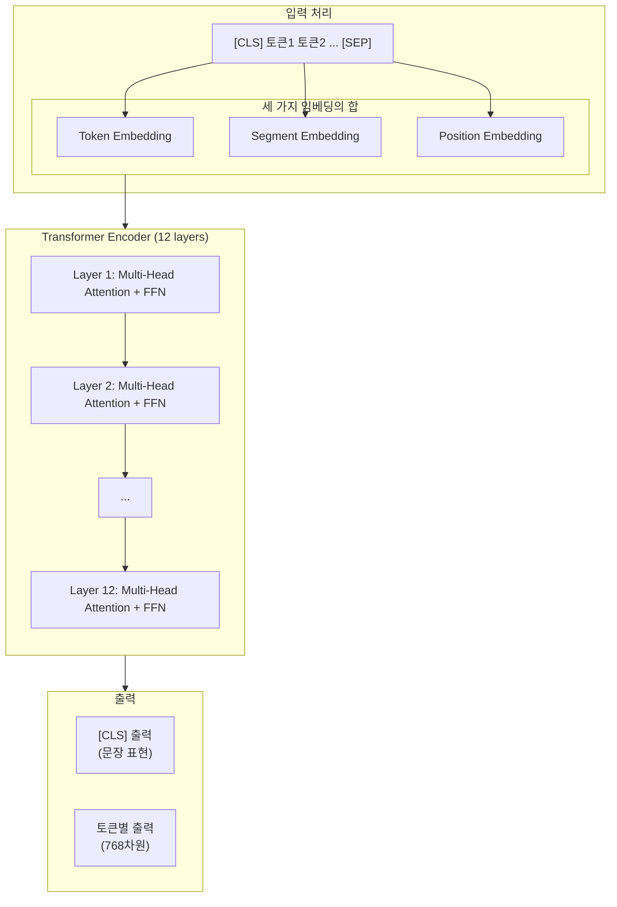
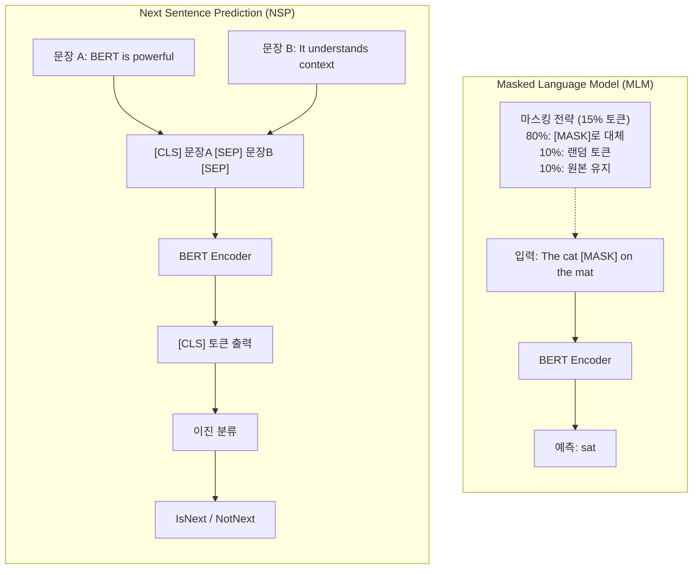
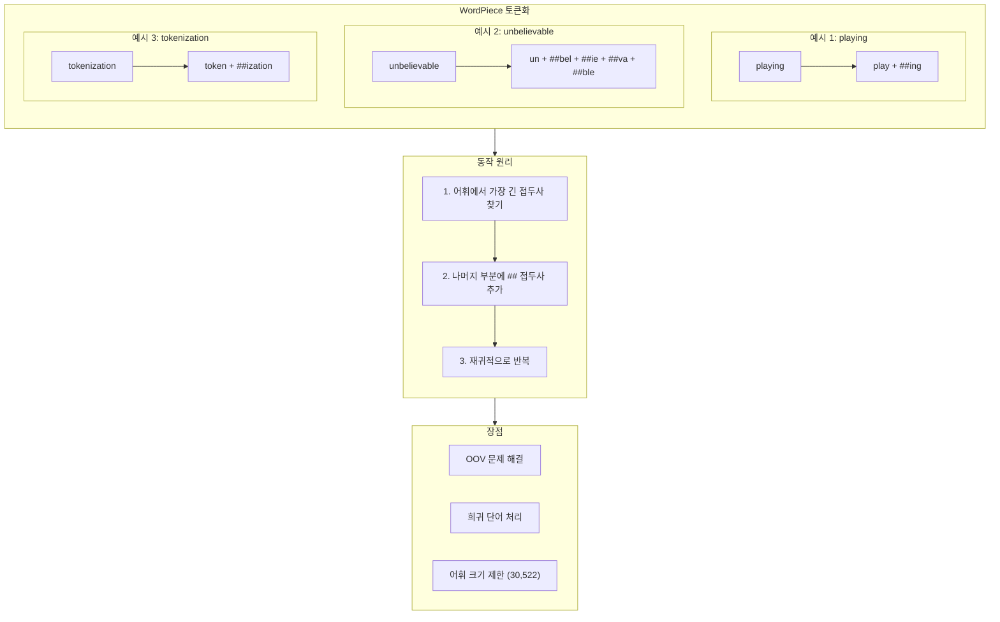
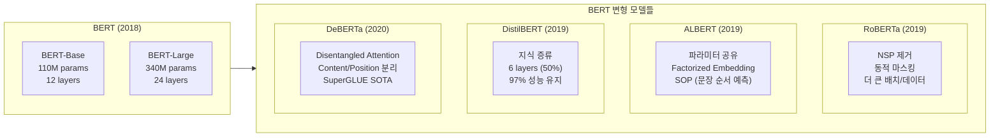

# 제9장: LLM 시대 (1) - BERT 아키텍처와 활용

## 학습 목표

이 장을 마치면 다음을 수행할 수 있다:
- BERT의 아키텍처와 사전학습 방법(MLM, NSP)을 설명할 수 있다
- WordPiece 토큰화의 원리와 장점을 이해한다
- Hugging Face Transformers를 사용하여 BERT 모델을 활용할 수 있다
- 텍스트 분류, NER, 문장 유사도 등 다양한 태스크에 BERT를 적용할 수 있다

---

## 9.1 사전학습과 미세조정 패러다임

### 기존 방식의 한계

2018년 이전의 자연어처리 모델은 각 태스크마다 처음부터 학습해야 했다. 감성 분석을 위한 모델, 개체명 인식을 위한 모델, 질의응답을 위한 모델을 각각 별도로 학습시켜야 했으며, 이 과정에서 막대한 레이블 데이터와 학습 시간이 필요했다.

이러한 접근 방식은 마치 새로운 요리를 배울 때마다 칼 쓰는 법부터 다시 배우는 것과 같다. 기본적인 조리 기술을 미리 익혀두면 새로운 요리를 훨씬 빠르게 배울 수 있듯이, 언어의 기본 구조를 미리 학습한 모델이 있다면 다양한 NLP 태스크에 빠르게 적응할 수 있을 것이다.

### Pre-training과 Fine-tuning

BERT는 이러한 아이디어를 실현한 모델이다. BERT의 학습은 두 단계로 나뉜다.

**사전학습 (Pre-training)** 단계에서는 레이블이 없는 대규모 텍스트 데이터로 언어의 일반적인 특성을 학습한다. BERT는 BooksCorpus(8억 단어)와 영어 위키피디아(25억 단어)를 합쳐 총 약 33억 단어로 사전학습되었다. 이 과정에서 모델은 문법, 의미, 문맥 등 언어의 근본적인 특성을 파악한다.

**미세조정 (Fine-tuning)** 단계에서는 사전학습된 모델을 특정 태스크에 맞게 조정한다. 이때 필요한 레이블 데이터의 양은 사전학습에 비해 훨씬 적다. 수천 개에서 수만 개 정도의 학습 샘플만으로도 우수한 성능을 달성할 수 있다.



**그림 9.1** 사전학습과 미세조정 패러다임

### 전이 학습의 효과

이 패러다임의 핵심은 **전이 학습(Transfer Learning)**이다. 사전학습 과정에서 학습한 언어에 대한 지식이 미세조정 과정에서 그대로 전이된다. 이를 통해 얻을 수 있는 이점은 다음과 같다.

첫째, 적은 데이터로도 높은 성능을 달성할 수 있다. 기본적인 언어 이해 능력을 이미 갖추고 있기 때문에, 태스크 특화 학습에 필요한 데이터 양이 크게 줄어든다.

둘째, 학습 시간이 단축된다. 처음부터 학습하는 대신 사전학습된 가중치에서 시작하므로, 수렴에 필요한 시간이 줄어든다.

셋째, 일반화 성능이 향상된다. 대규모 데이터에서 학습한 일반적인 언어 지식이 다양한 상황에서 활용될 수 있다.

---

## 9.2 BERT 아키텍처

### Transformer Encoder

BERT는 Transformer의 인코더(Encoder) 부분만 사용한다. 8장에서 살펴본 Transformer는 인코더와 디코더로 구성되어 있었다. 인코더는 입력 시퀀스를 이해하는 역할을, 디코더는 출력 시퀀스를 생성하는 역할을 담당한다. BERT는 텍스트를 이해하는 것이 목표이므로 인코더만 사용한다.

BERT-Base 모델은 12개의 Transformer 인코더 층을 쌓아올린 구조이다. 각 층은 Multi-Head Self-Attention과 Feed-Forward Network로 구성된다. 은닉 차원은 768이며, 12개의 어텐션 헤드를 사용한다.



**그림 9.2** BERT 아키텍처 구조

### 세 가지 임베딩

BERT의 입력은 세 가지 임베딩의 합으로 구성된다.

**Token Embedding**은 각 토큰을 벡터로 변환한다. WordPiece 토크나이저로 분리된 각 토큰이 768차원의 벡터로 변환된다.

**Segment Embedding**은 문장을 구분한다. 첫 번째 문장의 토큰에는 Segment A 임베딩이, 두 번째 문장의 토큰에는 Segment B 임베딩이 더해진다. 이를 통해 모델이 두 문장을 구분할 수 있다.

**Position Embedding**은 토큰의 위치 정보를 제공한다. Transformer는 순차적으로 처리하지 않으므로, 위치 정보를 명시적으로 주입해야 한다.

### 모델 크기

BERT는 Base와 Large 두 가지 버전으로 제공된다.

**표 9.1** BERT 모델 크기 비교

| 모델 | 층 수 | 은닉 차원 | 어텐션 헤드 | 파라미터 |
|------|-------|-----------|-------------|----------|
| BERT-Base | 12 | 768 | 12 | 110M |
| BERT-Large | 24 | 1024 | 16 | 340M |

실습에서 확인한 결과, BERT-Base 모델의 실제 파라미터 수는 109,482,240개(약 109.5M)이다.

---

## 9.3 BERT 사전학습: MLM과 NSP

BERT는 두 가지 목표를 동시에 학습한다: Masked Language Model(MLM)과 Next Sentence Prediction(NSP)이다.

### Masked Language Model (MLM)

MLM은 문장 내 일부 토큰을 가리고, 가려진 토큰이 무엇인지 예측하는 태스크이다. 이것은 마치 빈칸 채우기 문제와 같다.

예를 들어, "The cat sat on the mat"라는 문장에서 "sat"을 [MASK] 토큰으로 대체하면:
- 입력: "The cat [MASK] on the mat"
- 예측 목표: "sat"

BERT는 입력 토큰의 15%를 무작위로 선택하여 마스킹한다. 선택된 토큰에 대해 다음과 같은 전략을 적용한다:
- 80%는 [MASK] 토큰으로 대체
- 10%는 랜덤한 다른 토큰으로 대체
- 10%는 원래 토큰 그대로 유지



**그림 9.3** MLM과 NSP 사전학습 태스크

왜 15%만 마스킹하고, 왜 마스킹 전략이 필요한가? 너무 많은 토큰을 마스킹하면 문맥 정보가 부족해지고, 너무 적으면 학습 효율이 떨어진다. 또한 미세조정 시에는 [MASK] 토큰이 없으므로, 사전학습과 미세조정 간의 불일치를 줄이기 위해 일부 토큰은 원본 그대로 두거나 랜덤 토큰으로 대체한다.

### Next Sentence Prediction (NSP)

NSP는 두 문장이 원래 연속된 문장인지 판단하는 태스크이다. 학습 데이터의 50%는 실제 연속 문장 쌍(IsNext), 50%는 무작위로 선택된 문장 쌍(NotNext)으로 구성된다.

이 태스크는 질의응답이나 자연어 추론처럼 두 문장 간의 관계를 이해해야 하는 다운스트림 태스크에 도움이 된다.

### 실습: MLM 예측

Hugging Face의 fill-mask 파이프라인을 사용하여 MLM을 직접 체험해볼 수 있다.

```python
from transformers import pipeline

# Fill-mask 파이프라인 생성
unmasker = pipeline("fill-mask", model="bert-base-uncased")

# 마스크 토큰 예측
result = unmasker("The capital of France is [MASK].")
```

_전체 코드는 practice/chapter9/code/9-1-bert-pipeline.py 참고_

실행 결과:

```
입력: The capital of France is [MASK].
예측 (Top 3):
    1. paris (0.4168)
    2. lille (0.0714)
    3. lyon (0.0634)
```

BERT는 "paris"를 41.68%의 확률로 가장 유력한 답으로 예측했다. 이는 BERT가 사전학습 과정에서 "프랑스의 수도는 파리"라는 세계 지식을 학습했음을 보여준다.

다른 예시들도 확인해보자:

```
입력: I love to [MASK] books in my free time.
예측: read (0.9515)

입력: The [MASK] is shining brightly today.
예측: sun (0.7397)

입력: She is a brilliant [MASK] at the university.
예측: student (0.8072)
```

BERT는 문맥을 파악하여 적절한 단어를 높은 신뢰도로 예측한다.

---

## 9.4 WordPiece 토큰화

### 서브워드 토큰화의 필요성

언어 모델이 처리할 수 있는 어휘의 크기는 제한적이다. 모든 단어를 개별 토큰으로 처리하면 어휘 크기가 너무 커지고, 학습 데이터에 없던 단어(OOV, Out-of-Vocabulary)는 처리할 수 없다.

서브워드 토큰화는 이 문제를 해결한다. 자주 등장하는 단어는 그대로 유지하고, 희귀 단어는 더 작은 단위로 분해한다. 예를 들어, "playing"은 어휘에 있으므로 그대로 유지되지만, "antidisestablishmentarianism"처럼 긴 단어는 여러 조각으로 나뉜다.

### WordPiece 동작 원리

WordPiece는 BERT에서 사용하는 서브워드 토큰화 알고리즘이다. 핵심 원리는 "가장 긴 매칭 접두사 찾기"이다.

1. 어휘에서 입력 단어와 가장 길게 매칭되는 접두사를 찾는다
2. 매칭된 부분을 토큰으로 추출한다
3. 나머지 부분에 대해 `##` 접두사를 붙이고 1-2를 반복한다

`##` 접두사는 "이 토큰이 단어의 시작이 아니라 이전 토큰에 이어지는 부분"임을 나타낸다.



**그림 9.4** WordPiece 토큰화 과정

### 실습: WordPiece 토큰화

```python
from transformers import BertTokenizer

tokenizer = BertTokenizer.from_pretrained('bert-base-uncased')

# 다양한 단어 토큰화
words = ["playing", "tokenization", "antidisestablishmentarianism"]
for word in words:
    tokens = tokenizer.tokenize(word)
    print(f"  {word} → {tokens}")
```

_전체 코드는 practice/chapter9/code/9-4-bert-tokenizer.py 참고_

실행 결과:

```
[WordPiece 분해 결과]
  playing                             → ['playing']
  tokenization                        → ['token', '##ization']
  antidisestablishmentarianism        → ['anti', '##dis', '##est', '##ab',
                                          '##lish', '##ment', '##arian', '##ism']
```

일반적인 단어 "playing"은 그대로 유지되지만, 긴 단어는 여러 서브워드로 분해된다. 이를 통해 30,522개의 어휘만으로도 거의 모든 영어 텍스트를 처리할 수 있다.

### Special Tokens

BERT는 다섯 가지 특수 토큰을 사용한다:

**표 9.2** BERT Special Tokens

| 토큰 | ID | 역할 |
|------|-----|------|
| [CLS] | 101 | 문장 시작, 분류 태스크용 표현 |
| [SEP] | 102 | 문장 구분자 |
| [MASK] | 103 | MLM 학습용 마스킹 |
| [PAD] | 0 | 패딩 |
| [UNK] | 100 | 미등록 단어 |

### 문장 쌍 인코딩

두 문장을 함께 처리할 때는 다음과 같은 구조를 사용한다:

```
[CLS] 문장1 [SEP] 문장2 [SEP]
```

token_type_ids를 통해 각 토큰이 어느 문장에 속하는지 구분한다. 실습 결과를 살펴보자:

```
문장 1: "BERT uses transformers."
문장 2: "It was developed by Google."

토큰: ['[CLS]', 'bert', 'uses', 'transformers', '.', '[SEP]',
       'it', 'was', 'developed', 'by', 'google', '.', '[SEP]']

token_type_ids: [0, 0, 0, 0, 0, 0, 1, 1, 1, 1, 1, 1, 1]
```

0은 첫 번째 문장, 1은 두 번째 문장에 속하는 토큰임을 나타낸다.

---

## 9.5 BERT 변형 모델

BERT의 성공 이후 다양한 변형 모델이 등장했다. 각 모델은 BERT의 한계를 극복하거나 특정 측면을 개선하기 위해 개발되었다.

### RoBERTa (2019)

Facebook AI Research에서 개발한 RoBERTa는 BERT의 학습 방법을 최적화했다. 주요 변경 사항은 다음과 같다:

- NSP 태스크 제거: 연구 결과 NSP가 성능 향상에 크게 기여하지 않음을 발견
- 동적 마스킹: 매 에폭마다 새로운 마스킹 패턴 적용
- 더 큰 배치 크기 (8K)와 더 많은 학습 데이터 (160GB)

이러한 변경으로 RoBERTa는 BERT보다 상당히 높은 성능을 달성했다.

### ALBERT (2019)

Google Research에서 개발한 ALBERT는 파라미터 효율성을 극대화했다.

- **Factorized Embedding**: 임베딩 차원을 128로 줄이고 별도의 프로젝션 레이어 사용
- **Cross-layer Parameter Sharing**: 모든 Transformer 층이 동일한 파라미터 공유
- **SOP (Sentence Order Prediction)**: NSP 대신 문장 순서 예측 태스크 사용

결과적으로 ALBERT-xxlarge는 BERT-Large 대비 18배 적은 파라미터로 더 높은 성능을 달성했다.

### DistilBERT (2019)

Hugging Face에서 개발한 DistilBERT는 지식 증류(Knowledge Distillation)를 적용했다.

- BERT-Base의 6개 층만 사용 (절반)
- 원본 BERT의 97% 성능 유지
- 40% 작은 크기, 60% 빠른 추론 속도

실습에서 확인한 결과:

```
BERT-Base            :  109,482,240 parameters (109.5M)
DistilBERT           :   66,362,880 parameters (66.4M)
ALBERT-Base          :   11,683,584 parameters (11.7M)
```

DistilBERT는 BERT-Base 대비 약 40% 적은 파라미터를 가지며, ALBERT-Base는 파라미터 공유 덕분에 가장 적은 파라미터를 가진다.

### DeBERTa (2020)

Microsoft에서 개발한 DeBERTa는 어텐션 메커니즘을 개선했다.

- **Disentangled Attention**: 내용(content)과 위치(position) 정보를 분리하여 처리
- **Enhanced Mask Decoder**: MLM에서 절대 위치 정보 활용 개선

DeBERTa-Large는 2021년 SuperGLUE 벤치마크에서 인간 수준의 성능을 달성했다.



**그림 9.5** BERT 변형 모델 계보

**표 9.3** BERT 변형 모델 비교

| 모델 | 파라미터 | 특징 | GLUE 점수 |
|------|----------|------|-----------|
| BERT-Base | 110M | 기본 | 79.6 |
| RoBERTa | 125M | 학습 최적화 | 88.5 |
| ALBERT-xxlarge | 235M | 파라미터 공유 | 89.4 |
| DistilBERT | 66M | 지식 증류 | 77.0 |
| DeBERTa-Large | 390M | Disentangled | 90.3 |

---

## 9.6 Hugging Face Transformers

### 라이브러리 소개

Hugging Face Transformers는 BERT를 포함한 수천 개의 사전학습 모델을 쉽게 사용할 수 있게 해주는 파이썬 라이브러리이다. 2019년 출시 이후 NLP 연구와 개발의 표준 도구로 자리 잡았다.

주요 특징은 다음과 같다:
- 수천 개의 사전학습 모델 제공
- PyTorch와 TensorFlow 모두 지원
- 토크나이저, 모델, 파이프라인의 통합된 API
- 모델 허브를 통한 커뮤니티 모델 공유

### Pipeline API

Pipeline API는 가장 쉬운 사용 방법이다. 태스크 이름만 지정하면 적절한 모델과 토크나이저가 자동으로 로드된다.

```python
from transformers import pipeline

# 감성 분석 파이프라인
classifier = pipeline("sentiment-analysis")
result = classifier("I love this movie!")
```

_전체 코드는 practice/chapter9/code/9-1-bert-pipeline.py 참고_

실행 결과:

```
[감성 분석 결과]
  POSITIVE (0.9999): I love this movie! It's absolutely fantastic.
  NEGATIVE (0.9998): This is the worst product I've ever bought.
  POSITIVE (0.9998): The weather is okay today.
```

### 주요 파이프라인 태스크

**표 9.4** Hugging Face 주요 파이프라인

| 태스크 | 설명 | 예시 모델 |
|--------|------|-----------|
| sentiment-analysis | 감성 분석 | distilbert-base-uncased-finetuned-sst-2-english |
| ner | 개체명 인식 | dbmdz/bert-large-cased-finetuned-conll03-english |
| question-answering | 질의응답 | distilbert-base-cased-distilled-squad |
| fill-mask | 마스크 토큰 예측 | bert-base-uncased |
| zero-shot-classification | 제로샷 분류 | facebook/bart-large-mnli |

### 직접 모델 로드

더 세밀한 제어가 필요한 경우 모델과 토크나이저를 직접 로드할 수 있다.

```python
from transformers import BertTokenizer, BertModel

# 토크나이저와 모델 로드
tokenizer = BertTokenizer.from_pretrained('bert-base-uncased')
model = BertModel.from_pretrained('bert-base-uncased')

# 입력 준비 및 추론
inputs = tokenizer("Hello world", return_tensors="pt")
outputs = model(**inputs)
```

---

## 9.7 실습: BERT 활용 응용

이 절에서는 BERT를 다양한 NLP 태스크에 적용하는 방법을 실습한다.

### 실습 환경 준비

```bash
cd practice/chapter9
python3 -m venv venv
source venv/bin/activate  # Windows: venv\Scripts\activate
pip install -r code/requirements.txt
```

### 감성 분석 (Text Classification)

감성 분석은 텍스트의 감정이나 의견을 분류하는 태스크이다. BERT의 [CLS] 토큰 출력에 분류층을 추가하여 구현한다.

```python
from transformers import AutoTokenizer, BertForSequenceClassification
import torch

model_name = "nlptown/bert-base-multilingual-uncased-sentiment"
tokenizer = AutoTokenizer.from_pretrained(model_name)
model = BertForSequenceClassification.from_pretrained(model_name)

text = "This product is absolutely amazing! Best purchase ever."
inputs = tokenizer(text, return_tensors="pt", truncation=True)
outputs = model(**inputs)
predicted_class = torch.argmax(outputs.logits, dim=1).item() + 1
```

_전체 코드는 practice/chapter9/code/9-7-bert-applications.py 참고_

실행 결과:

```
[감성 분석 결과] (1-5 별점)

  텍스트: "This product is absolutely amazing! Best purchase ..."
  예측 별점: ⭐⭐⭐⭐⭐ (5/5)
  신뢰도: 0.9816

  텍스트: "Terrible experience. Would not recommend to anyone..."
  예측 별점: ⭐ (1/5)
  신뢰도: 0.8933

  텍스트: "It's okay, nothing special but does the job...."
  예측 별점: ⭐⭐⭐ (3/5)
  신뢰도: 0.8589
```

모델은 긍정적인 리뷰에는 5점, 부정적인 리뷰에는 1점, 중립적인 리뷰에는 3점을 높은 신뢰도로 예측한다.

### 개체명 인식 (NER)

NER은 텍스트에서 인물, 조직, 장소 등의 개체를 추출하는 태스크이다.

```python
from transformers import pipeline

ner_pipeline = pipeline(
    "ner",
    model="dbmdz/bert-large-cased-finetuned-conll03-english",
    aggregation_strategy="simple"
)

text = "Apple Inc. was founded by Steve Jobs in Cupertino, California."
entities = ner_pipeline(text)
```

실행 결과:

```
텍스트: "Apple Inc. was founded by Steve Jobs in Cupertino, California."
발견된 개체:
    🏢 [ORG] Apple Inc (신뢰도: 0.9996)
    👤 [PER] Steve Jobs (신뢰도: 0.9892)
    📍 [LOC] Cupertino (신뢰도: 0.9711)
    📍 [LOC] California (신뢰도: 0.9989)
```

모델은 조직(ORG), 인물(PER), 장소(LOC)를 높은 정확도로 인식한다.

### 질의응답 (Question Answering)

질의응답은 주어진 지문에서 질문에 대한 답을 찾는 태스크이다.

```python
qa = pipeline("question-answering", model="distilbert-base-cased-distilled-squad")

context = """
BERT (Bidirectional Encoder Representations from Transformers) is a
language model developed by Google AI Language team in 2018.
"""

result = qa(question="Who developed BERT?", context=context)
```

실행 결과:

```
Q: Who developed BERT?
A: Google AI Language team (신뢰도: 0.9486)

Q: When was BERT created?
A: 2018 (신뢰도: 0.9696)

Q: What architecture does BERT use?
A: transformer (신뢰도: 0.5598)
```

### 문장 유사도 (Sentence Similarity)

문장 유사도는 두 문장이 얼마나 의미적으로 비슷한지 측정하는 태스크이다. BERT의 문장 임베딩을 추출하고 코사인 유사도를 계산한다.

```python
import torch
from transformers import BertTokenizer, BertModel

def get_sentence_embedding(text, model, tokenizer):
    inputs = tokenizer(text, return_tensors="pt", truncation=True)
    with torch.no_grad():
        outputs = model(**inputs)
    # Mean Pooling
    hidden_state = outputs.last_hidden_state
    attention_mask = inputs['attention_mask']
    mask_expanded = attention_mask.unsqueeze(-1).expand(hidden_state.size()).float()
    sum_embeddings = torch.sum(hidden_state * mask_expanded, dim=1)
    return (sum_embeddings / mask_expanded.sum(dim=1))[0]

def cosine_similarity(vec1, vec2):
    return torch.nn.functional.cosine_similarity(
        vec1.unsqueeze(0), vec2.unsqueeze(0)
    ).item()
```

_전체 코드는 practice/chapter9/code/9-7-bert-applications.py 참고_

실행 결과:

```
[문장 유사도 결과]

  문장 1: "The cat sits on the mat."
  문장 2: "A cat is sitting on a mat."
  유사도: [█████████████████░░░] 0.8882

  문장 1: "I love programming in Python."
  문장 2: "Python is my favorite language."
  유사도: [████████████████░░░░] 0.8307

  문장 1: "The weather is sunny today."
  문장 2: "I need to buy groceries."
  유사도: [███████████░░░░░░░░░] 0.5918

  문장 1: "Machine learning is fascinating."
  문장 2: "AI is an interesting field."
  유사도: [███████████████░░░░░] 0.7985
```

의미적으로 유사한 문장 쌍은 0.8 이상의 높은 유사도를 보이고, 관련 없는 문장 쌍("날씨" vs "장보기")은 0.59의 낮은 유사도를 보인다.

### 텍스트 임베딩 추출

BERT에서 임베딩을 추출하는 방법은 여러 가지가 있다.

```python
# 모델 출력
outputs = model(**inputs)
last_hidden_state = outputs.last_hidden_state  # (batch, seq_len, 768)
pooler_output = outputs.pooler_output          # (batch, 768)
```

실행 결과:

```
[출력 텐서 크기]
  last_hidden_state: torch.Size([1, 13, 768])
    - (batch_size=1, seq_len=13, hidden_size=768)
  pooler_output: torch.Size([1, 768])
    - [CLS] 토큰의 변환된 표현

[임베딩 추출 방법]
  1. [CLS] 토큰: shape=torch.Size([768]), mean=-0.0102
  2. Pooler Output: shape=torch.Size([768]), mean=-0.0139
  3. Mean Pooling: shape=torch.Size([768]), mean=-0.0130
```

문장 표현을 얻는 세 가지 방법:
1. **[CLS] 토큰**: last_hidden_state의 첫 번째 토큰
2. **Pooler Output**: [CLS] 토큰에 추가 Dense 레이어 적용
3. **Mean Pooling**: 모든 토큰 임베딩의 평균 (일반적으로 가장 좋은 성능)

---

## 핵심 정리

이 장에서 다룬 핵심 내용을 정리하면 다음과 같다:

- **사전학습-미세조정 패러다임**: BERT는 대규모 텍스트로 사전학습한 후, 적은 데이터로 특정 태스크에 미세조정할 수 있다. 이를 통해 학습 효율성과 성능이 크게 향상된다.

- **BERT 아키텍처**: Transformer 인코더 12개 층을 사용하며, Token/Segment/Position 세 가지 임베딩의 합을 입력으로 받는다.

- **MLM과 NSP**: 마스크 토큰 예측(MLM)과 다음 문장 예측(NSP)을 통해 양방향 문맥 이해 능력을 학습한다.

- **WordPiece 토큰화**: 서브워드 단위 토큰화로 OOV 문제를 해결하며, ## 접두사로 단어 내부 토큰을 표시한다.

- **BERT 변형 모델**: RoBERTa(학습 최적화), ALBERT(파라미터 효율), DistilBERT(경량화), DeBERTa(어텐션 개선) 등이 있다.

- **Hugging Face Transformers**: Pipeline API로 쉽게 사용할 수 있으며, 감성 분석, NER, QA 등 다양한 태스크를 지원한다.

---

## 더 알아보기

이 장의 내용을 더 깊이 학습하려면 다음 자료를 참고하라:

- Devlin, J., et al. (2018). BERT: Pre-training of Deep Bidirectional Transformers for Language Understanding. arXiv:1810.04805
- Hugging Face Transformers 공식 문서: https://huggingface.co/docs/transformers/
- Hugging Face Model Hub: https://huggingface.co/models

---

## 다음 장 예고

다음 장에서는 GPT(Generative Pre-trained Transformer)를 다룬다. BERT가 텍스트를 "이해"하는 모델이라면, GPT는 텍스트를 "생성"하는 모델이다. GPT의 아키텍처, 학습 방법, 그리고 ChatGPT로 이어지는 발전 과정을 살펴볼 것이다.

---

## 참고문헌

1. Devlin, J., Chang, M. W., Lee, K., & Toutanova, K. (2018). BERT: Pre-training of Deep Bidirectional Transformers for Language Understanding. arXiv:1810.04805. https://arxiv.org/abs/1810.04805
2. Liu, Y., et al. (2019). RoBERTa: A Robustly Optimized BERT Pretraining Approach. arXiv:1907.11692. https://arxiv.org/abs/1907.11692
3. Lan, Z., et al. (2019). ALBERT: A Lite BERT for Self-supervised Learning of Language Representations. arXiv:1909.11942. https://arxiv.org/abs/1909.11942
4. Sanh, V., et al. (2019). DistilBERT, a distilled version of BERT: smaller, faster, cheaper and lighter. arXiv:1910.01108. https://arxiv.org/abs/1910.01108
5. He, P., et al. (2020). DeBERTa: Decoding-enhanced BERT with Disentangled Attention. arXiv:2006.03654. https://arxiv.org/abs/2006.03654
6. Wolf, T., et al. (2020). Transformers: State-of-the-Art Natural Language Processing. Proceedings of EMNLP 2020. https://www.aclweb.org/anthology/2020.emnlp-demos.6/
