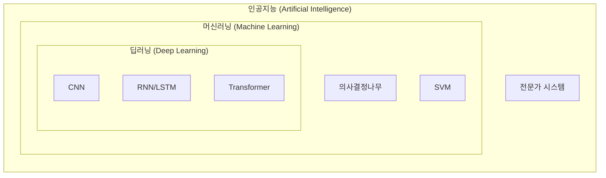
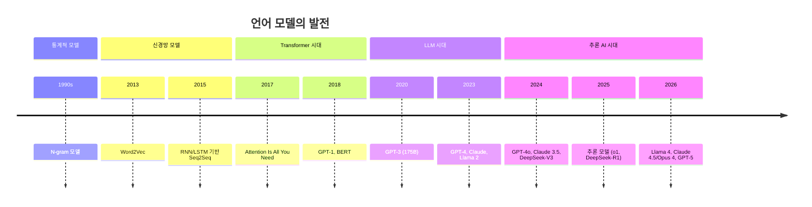

# 제1장: AI 시대의 개막과 개발 환경 구축

> **미션**: 수업이 끝나면 PyTorch로 첫 번째 딥러닝 모델을 돌려본다

## 학습 목표

이 장을 마치면 다음을 수행할 수 있다:

1. AI, 머신러닝, 딥러닝의 관계를 설명할 수 있다
2. PyTorch 개발 환경을 구축하고 GPU를 활용할 수 있다
3. Tensor 연산과 Autograd 자동 미분을 이해하고 구현할 수 있다
4. VS Code + GitHub Copilot 실습 환경을 설정할 수 있다

### 수업 타임라인

| 시간 | 구분 | 내용 |
|------|------|------|
| 00:00~00:50 | **1교시** | AI/ML/DL 개요 + NLP 발전사 |
| 00:50~01:00 | 쉬는시간 | |
| 01:00~01:50 | **2교시** | 개발 환경 구축 + Python 딥러닝 기초 |
| 01:50~02:00 | 쉬는시간 | |
| 02:00~02:50 | **3교시** | Copilot 환경 설정 + Tensor 실습 + 과제 |

---

#### 1교시: AI와 자연어처리 개요

## 1.1 인공지능과 자연어처리 개요

### 인공지능이란 무엇인가

인공지능(Artificial Intelligence, AI)은 인간의 지능을 기계로 구현하려는 기술이다. 음성 비서, 번역 서비스, 추천 시스템 등 우리 일상 곳곳에 인공지능 기술이 녹아 있다.

인공지능이라는 용어는 1956년 다트머스 대학 학술 회의에서 처음 등장했다. 존 매카시(John McCarthy), 마빈 민스키(Marvin Minsky) 등 선구자들이 "기계가 생각할 수 있는가?"라는 질문에서 출발하여 새로운 학문 분야를 개척했다. 이후 1970~80년대 두 차례의 "AI 겨울"을 겪었으나, 2012년 딥러닝 기반 AlexNet이 이미지 인식 대회에서 압도적 성능을 보여주면서 새로운 전환점을 맞이했다. 하드웨어 성능 향상과 대규모 데이터 축적에 힘입어 인공지능은 급격히 발전하여 오늘날에 이르렀다.

### AI, 머신러닝, 딥러닝의 관계

인공지능, 머신러닝, 딥러닝은 종종 혼용되지만, 이들 사이에는 명확한 포함 관계가 있다.

**직관적 이해**: 러시아 인형(마트료시카)을 떠올려 보자. 가장 큰 인형이 AI, 그 안에 머신러닝, 그 안에 딥러닝이 들어 있다. AI라는 큰 우산 아래에 머신러닝이 있고, 머신러닝 중에서도 신경망을 깊게 쌓은 것이 딥러닝이다.



**그림 1.1** AI, 머신러닝, 딥러닝의 포함 관계

**인공지능(AI)**은 가장 넓은 개념으로, 인간의 지능을 모방하는 모든 기술을 포함한다. 초기의 규칙 기반 전문가 시스템부터 현재의 딥러닝 모델까지 모두 AI의 범주에 속한다.

**머신러닝(Machine Learning)**은 AI의 한 분야로, 명시적으로 프로그래밍하지 않아도 데이터로부터 패턴을 학습하는 기술이다. 전통적 프로그래밍에서는 사람이 규칙을 직접 작성하지만, 머신러닝에서는 데이터를 통해 컴퓨터가 스스로 규칙을 학습한다. 학습 방식에 따라 지도학습(정답이 있는 데이터로 학습), 비지도학습(정답 없이 패턴 발견), 강화학습(보상 최대화)으로 분류된다.

**딥러닝(Deep Learning)**은 머신러닝의 한 분야로, 여러 층의 인공 신경망을 사용하여 복잡한 패턴을 학습한다. 이미지 인식, 자연어 처리, 음성 인식 등에서 기존 방법을 크게 뛰어넘는 성능을 보여준다.

### 자연어처리란 무엇인가

자연어처리(Natural Language Processing, NLP)는 컴퓨터가 인간의 언어를 이해하고 생성하도록 하는 AI의 한 분야이다. "자연어"란 한국어, 영어처럼 인간이 일상에서 사용하는 언어를 말하며, Python 같은 프로그래밍 언어와 구분된다.

자연어처리가 어려운 이유는 인간 언어의 복잡성에 있다. 같은 문장도 맥락에 따라 다른 의미를 가질 수 있고("배가 고프다" vs "배가 항구에 있다"), 비유나 은유 같은 표현도 이해해야 한다.

NLP의 주요 응용 분야는 다음과 같다:

- **기계번역**: Google 번역, DeepL, Papago 등 한 언어를 다른 언어로 자동 번역
- **챗봇/대화 시스템**: ChatGPT, Claude, Gemini 같은 LLM 기반 대화 서비스
- **감성 분석**: 제품 리뷰나 SNS에서 긍정/부정 의견 파악
- **개체명 인식(NER)**: 텍스트에서 사람, 장소, 조직 등 식별
- **질의응답/요약**: 문서에서 답변 추출, 긴 텍스트 자동 요약

### 언어 모델의 발전 과정

언어 모델(Language Model)은 텍스트의 확률 분포를 학습한 모델이다. 쉽게 말해, "오늘 날씨가 정말 ___"라는 문장에서 빈칸에 올 단어의 확률을 예측하는 모델이다. 이 간단한 아이디어가 GPT, Claude 같은 대규모 언어 모델의 핵심 원리이다.



**그림 1.2** 언어 모델 발전의 역사

**N-gram 모델(1990년대)**은 최초의 통계적 언어 모델이다. 이전 N-1개의 단어를 보고 다음 단어를 예측한다. 간단하지만 문맥을 제한적으로만 고려할 수 있었다.

**Word2Vec(2013)**은 단어를 벡터로 표현하는 획기적인 방법을 제시했다. "왕 - 남자 + 여자 = 여왕" 같은 의미 연산이 가능해졌다.

**RNN/LSTM(2010년대 중반)**은 순차적으로 텍스트를 처리하며 이전 정보를 기억하는 신경망이다. 그러나 문장이 길면 앞부분 정보를 잊어버리는 한계가 있었다.

**Transformer(2017)**는 "Attention Is All You Need" 논문에서 제안된 아키텍처이다. 문장 전체를 한 번에 처리하며, Self-Attention으로 단어 간 관계를 효과적으로 모델링한다. 현재 모든 대규모 언어 모델의 기반이다.

**GPT/BERT(2018)**는 Transformer 기반 사전학습 모델이다. GPT는 다음 단어 예측, BERT는 양방향 문맥을 학습한다.

**GPT-3~4(2020-2023)**에 이르러 수천억 파라미터의 대규모 모델이 등장했다. 글쓰기, 코딩, 추론 등 범용 작업을 수행할 수 있게 되었다.

### 2024-2026 NLP 산업 동향

2024년부터 AI 산업은 새로운 국면에 접어들었다. 이 흐름을 이해하면 어떤 역량을 키워야 하는지 방향을 잡을 수 있다.

**추론 능력의 비약적 발전**. 2024년 OpenAI의 o1 모델은 "생각하는 AI"의 시대를 열었다. 문제를 단계적으로 추론하는 Chain-of-Thought 방식을 모델 내부에 내재화하여, 수학·코딩·과학 문제에서 전문가 수준의 성능을 보여주었다. 2025년에는 중국의 DeepSeek-R1이 오픈소스로 비슷한 성능을 달성하면서, 추론 AI가 보편화되는 계기가 되었다.

**오픈소스 LLM의 부상**. Meta의 Llama 시리즈(Llama 2 → 3 → 4)를 필두로, Mistral, Qwen(알리바바), DeepSeek 등 오픈소스 모델이 상용 모델에 근접하거나 일부 영역에서 능가하는 성능을 달성했다. 기업은 이제 자체 인프라에서 LLM을 운영할 수 있는 선택지를 갖게 되었다.

**AI Agent의 등장**. 단순 대화를 넘어, LLM이 도구를 사용하고 계획을 세우며 자율적으로 작업을 수행하는 AI Agent가 실용화되고 있다. 검색, 코드 실행, 데이터베이스 조회 등을 LLM이 직접 수행하는 시스템이 산업 전반에 확산 중이다.

**멀티모달 AI**. GPT-4o, Gemini 2 등은 텍스트뿐 아니라 이미지, 음성, 영상을 통합적으로 처리한다. NLP는 이제 "언어만의 처리"를 넘어 멀티모달 AI의 한 축으로 자리 잡고 있다.

**AI 엔지니어에게 요구되는 핵심 역량**:

**표 1.1** 2026년 NLP/AI 엔지니어 핵심 역량

| 역량 | 설명 | 본 교재 해당 주차 |
|------|------|:---:|
| Transformer 아키텍처 이해 | 모델 내부 작동 원리 | 3-4주차 |
| LLM 파인튜닝 (LoRA/QLoRA) | 제한된 자원으로 모델 커스터마이징 | 9-10주차 |
| RAG 시스템 구축 | 외부 지식 기반 AI 시스템 | 11주차 |
| AI Agent 개발 | 자율 작업 수행 시스템 | 12주차 |
| 프롬프트 엔지니어링 | LLM API 효과적 활용 | 6주차 |
| 모델 배포 (API/Docker) | 프로덕션 서비스 구축 | 13주차 |

이 교재는 위 역량을 15주에 걸쳐 체계적으로 학습하도록 설계되어 있다.

---

#### 2교시: 개발 환경과 PyTorch 기초

> **라이브 코딩 시연**: 교수가 PyTorch Tensor를 생성하고, GPU로 이동시키고, Autograd로 자동 미분을 수행하는 과정을 한 줄씩 시연한다.

## 1.2 개발 환경 구축

### 자동 환경 설정 (원클릭 설치)

본 교재는 15주차 전체 실습에 필요한 패키지를 **한 번에 설치**하는 자동 설정 스크립트를 제공한다. 이 스크립트는 GPU를 자동 감지하여 적합한 PyTorch + CUDA 버전을 설치하며, GPU가 없으면 CPU 버전으로 자동 폴백한다.

```bash
# 자동 설정 실행 (GPU 자동 감지 + 전체 패키지 설치)
python scripts/setup_env.py

# 옵션: CPU 버전 강제 설치
python scripts/setup_env.py --cpu

# 옵션: CUDA 버전 수동 지정 (실습실 GPU 사양에 맞춤)
python scripts/setup_env.py --cuda 12.1
```

스크립트가 수행하는 7단계:

1. **시스템 확인**: Python 버전, 운영체제 확인
2. **GPU 자동 감지**: `nvidia-smi`로 NVIDIA GPU 모델, VRAM, 드라이버 버전, 지원 CUDA 버전을 자동 탐지. Apple Silicon이면 MPS 감지
3. **가상환경 생성**: 프로젝트 루트에 `venv/` 디렉토리 생성
4. **PyTorch 설치**: 감지된 GPU에 맞는 CUDA 버전의 PyTorch 자동 설치
5. **전체 패키지 설치**: `requirements.txt`의 모든 실습 패키지 일괄 설치
6. **설치 검증**: 핵심 패키지 import 테스트 + GPU 연결 확인
7. **GPU 벤치마크**: 4096×4096 행렬 연산으로 CPU vs GPU 속도 비교

실행 결과 예시 (NVIDIA GPU 환경):

```
═══════════════════════════════════════════════════
  2단계: GPU 자동 감지
═══════════════════════════════════════════════════
  ✓ NVIDIA GPU 감지: NVIDIA GeForce RTX 4090
  ℹ VRAM: 24.0 GB
  ℹ 드라이버: 550.54
  ℹ CUDA 지원 버전: 12.4
...
═══════════════════════════════════════════════════
  7단계: GPU 벤치마크 (CPU vs GPU)
═══════════════════════════════════════════════════
  ✓ 행렬 크기: 4096×4096
  ℹ CPU 소요 시간: 1.2340초
  ℹ GPU 소요 시간: 0.0156초 (NVIDIA GeForce RTX 4090)
  ✓ GPU 가속: 79.1배 빠름
```

> **참고**: GPU가 없는 학생도 모든 코드는 CPU에서 정상 동작한다. 다만 9-10주차 파인튜닝 실습은 GPU가 사실상 필수이므로, Google Colab 또는 실습실 GPU를 사용한다.

_전체 코드는 scripts/setup_env.py 참고_

### 주요 딥러닝 프레임워크

딥러닝 모델을 개발하려면 적절한 프레임워크가 필요하다.

**표 1.2** 딥러닝 프레임워크 비교

| 항목 | PyTorch | TensorFlow | JAX |
|------|---------|------------|-----|
| 개발사 | Meta | Google | Google |
| 계산 그래프 | 동적 | 동적/정적 | 동적 |
| 주 사용 분야 | 연구 + 프로덕션 | 프로덕션 | 연구 |
| 학습 난이도 | 쉬움 | 보통 | 어려움 |

본 교재에서는 **PyTorch**를 사용한다. 학계와 산업계 모두에서 표준으로 자리잡았고, 코드가 직관적이며, Hugging Face 등 최신 라이브러리와의 호환성이 뛰어나기 때문이다.

### Python 가상환경과 PyTorch 설치 (수동 설정)

자동 설정 스크립트가 내부에서 수행하는 과정을 이해하기 위해 수동 설치 방법을 설명한다. 가상환경(Virtual Environment)은 프로젝트별로 독립된 Python 환경을 만드는 기능이다. 프로젝트마다 다른 버전의 라이브러리가 필요할 수 있으므로, 가상환경을 사용하면 의존성 충돌을 방지할 수 있다.

```bash
# 가상환경 생성 및 활성화
python3 -m venv venv
source venv/bin/activate          # macOS/Linux
# venv\Scripts\activate           # Windows

# 기본 라이브러리 설치
pip install numpy pandas matplotlib

# PyTorch 설치 — GPU에 따라 선택
pip install torch                                              # CPU / Apple MPS
pip install torch --index-url https://download.pytorch.org/whl/cu118  # CUDA 11.8
pip install torch --index-url https://download.pytorch.org/whl/cu121  # CUDA 12.1
pip install torch --index-url https://download.pytorch.org/whl/cu124  # CUDA 12.4
```

**CUDA 버전 확인 방법**: NVIDIA GPU가 있다면 터미널에서 `nvidia-smi`를 실행하면 드라이버가 지원하는 CUDA 버전을 확인할 수 있다. 이 버전 이하의 PyTorch CUDA 빌드를 선택하면 된다.

```bash
nvidia-smi
# 출력 상단에 "CUDA Version: 12.4" 같은 정보가 표시된다
```

> **참고**: Apple Silicon(M1/M2/M3/M4) Mac에서는 기본 `pip install torch`로 설치하면 자동으로 MPS(Metal Performance Shaders) GPU 가속을 지원한다.

설치 확인 스크립트를 실행하면 전체 환경을 한눈에 점검할 수 있다:

```
Python 버전: 3.13.7
✓ Python 3.10 이상 확인됨 (권장 버전)

NumPy 버전: 2.3.5
✓ NumPy 정상 작동

Pandas 버전: 2.3.3
✓ Pandas 정상 작동

Matplotlib 버전: 3.10.8
✓ Matplotlib 정상 작동

PyTorch 버전: 2.10.0
✓ Apple MPS 사용 가능

행렬 곱 결과:
tensor([[19., 22.],
        [43., 50.]])
✓ 텐서 연산 정상 작동
```

_전체 코드는 practice/chapter1/code/1-2-환경설정.py 참고_

### VS Code + GitHub Copilot 설정

본 교재의 모든 실습은 **VS Code**에서 **GitHub Copilot**을 활용하여 진행한다. Copilot은 코드의 "주 작성자"가 아니라 구현의 **가속 도구**이다. 원리를 이해한 뒤 Copilot으로 반복 작업을 효율화하는 것이 핵심이다.

**설치 순서**:

1. **VS Code 설치**: https://code.visualstudio.com 에서 다운로드
2. **Python 확장 설치**: VS Code 확장 마켓플레이스에서 "Python" 검색 후 설치
3. **GitHub Copilot 설치**: "GitHub Copilot" + "GitHub Copilot Chat" 확장 설치
4. **GitHub Student Developer Pack**: https://education.github.com 에서 학생 인증 후 Copilot Pro 무료 사용

> **강의 팁**: 1-2교시에는 Copilot 없이 이론과 원리를 먼저 학습하고, 3교시에 Copilot을 활용하여 실습한다. 이렇게 구분하면 학생이 원리를 스스로 이해한 뒤 도구를 쓰는 습관을 기를 수 있다.

### Hugging Face 생태계

Hugging Face는 NLP 분야의 "GitHub"이라 불릴 만큼 중요한 플랫폼이다. 사전학습 모델, 데이터셋, 코드를 공유하고 활용할 수 있다.

- **Transformers**: BERT, GPT 등 수백 종의 모델을 몇 줄로 사용할 수 있는 핵심 라이브러리
- **Hub**: 100만 개 이상의 모델 체크포인트가 공유된 플랫폼
- **Datasets**: IMDB 리뷰, 뉴스 기사 등 수천 개의 NLP 데이터셋 제공
- **PEFT**: LoRA 등 효율적 파인튜닝 라이브러리

### 클라우드 GPU 서비스

딥러닝 학습에는 GPU가 필수적이다. 개인용 GPU가 없더라도 다음 클라우드 서비스를 활용할 수 있다.

**표 1.3** 클라우드 GPU 서비스 비교

| 서비스 | GPU | 무료 여부 | 제한 |
|--------|-----|----------|------|
| Google Colab | T4 | 무료 (Pro 유료) | 세션 시간 제한 |
| Kaggle Notebooks | T4/P100 | 무료 | 주당 30시간 |
| AWS/GCP/Azure | A100 등 | 유료 | 없음 (비용 발생) |

이 교재의 실습은 로컬 환경(CPU 또는 Apple MPS)에서 대부분 수행 가능하도록 설계되어 있다. 다만 9-10주차 파인튜닝 실습은 GPU가 사실상 필수이므로, 실습실 GPU 또는 Colab/Kaggle을 활용한다.

### 표준 디바이스 설정 패턴

이 교재의 **모든 실습 코드**는 아래 패턴으로 디바이스를 설정한다. GPU가 있으면 자동으로 사용하고, 없으면 CPU로 폴백한다:

```python
import torch

# 디바이스 자동 설정 (CUDA > MPS > CPU)
device = torch.device(
    "cuda" if torch.cuda.is_available()
    else "mps" if hasattr(torch.backends, "mps") and torch.backends.mps.is_available()
    else "cpu"
)
print(f"Using device: {device}")

# 모델과 데이터를 디바이스로 이동
model = model.to(device)
x = x.to(device)
```

이 패턴은 2장부터 모든 장에서 반복 사용되므로 반드시 숙지한다.

---

## 1.3 Python 딥러닝 기초

이 절에서는 PyTorch의 핵심 자료구조인 **Tensor**와 자동 미분 엔진 **Autograd**를 학습한다. 이 두 가지는 앞으로 모든 장에서 반복적으로 사용되는 가장 기본적인 도구이다.

### Tensor: 숫자를 담는 다차원 상자

**직관적 이해**: Tensor는 "숫자를 담는 다차원 상자"이다. 스칼라(점)는 0차원, 벡터(선)는 1차원, 행렬(면)은 2차원, 그 이상은 3차원 이상의 텐서이다. 딥러닝에서 모든 데이터(이미지, 텍스트, 음성)는 결국 Tensor로 표현된다.

| 차원 | 이름 | 예시 | PyTorch |
|------|------|------|---------|
| 0 | 스칼라 | 숫자 하나 (3.14) | `torch.tensor(3.14)` |
| 1 | 벡터 | 단어 임베딩 | `torch.tensor([1, 2, 3])` |
| 2 | 행렬 | 문장의 임베딩 행렬 | `torch.tensor([[1,2],[3,4]])` |
| 3+ | 텐서 | 배치 데이터 | `torch.randn(32, 10, 768)` |

### Tensor 생성

PyTorch에서 텐서를 생성하는 다양한 방법이 있다:

```python
import torch
import numpy as np

# Python 리스트에서 생성
t1 = torch.tensor([1, 2, 3])

# 2차원 텐서 (행렬)
t2 = torch.tensor([[1, 2, 3], [4, 5, 6]])
print(f"shape: {t2.shape}, dtype: {t2.dtype}")

# 특수 텐서
zeros = torch.zeros(2, 3)    # 모두 0
ones = torch.ones(2, 3)      # 모두 1
rand = torch.randn(2, 3)     # 표준정규분포

# NumPy 배열에서 변환
np_arr = np.array([10, 20, 30])
t_from_np = torch.from_numpy(np_arr)
```

실행 결과:

```
2D 텐서:
tensor([[1, 2, 3],
        [4, 5, 6]])
  shape: torch.Size([2, 3]), dtype: torch.int64
NumPy → Tensor: tensor([10, 20, 30])
arange(0, 10, 2): tensor([0, 2, 4, 6, 8])
linspace(0, 1, 5): tensor([0.0000, 0.2500, 0.5000, 0.7500, 1.0000])
```

### Tensor 연산

Tensor는 요소별 연산과 행렬 연산을 모두 지원한다:

```python
a = torch.tensor([1.0, 2.0, 3.0])
b = torch.tensor([4.0, 5.0, 6.0])

print(f"a + b = {a + b}")      # 요소별 덧셈
print(f"a * b = {a * b}")      # 요소별 곱 (Hadamard product)

x = torch.tensor([[1.0, 2.0], [3.0, 4.0]])
y = torch.tensor([[5.0, 6.0], [7.0, 8.0]])
print(f"행렬 곱 (x @ y):\n{x @ y}")
```

실행 결과:

```
a + b = tensor([5., 7., 9.])
a * b = tensor([ 4., 10., 18.])

행렬 곱 (x @ y):
tensor([[19., 22.],
        [43., 50.]])
```

### Tensor 인덱싱과 슬라이싱

NumPy와 유사한 방식으로 텐서의 요소에 접근할 수 있다:

```python
t = torch.tensor([[1, 2, 3, 4],
                   [5, 6, 7, 8],
                   [9, 10, 11, 12]])

print(f"t[0]: {t[0]}")          # 첫 번째 행
print(f"t[1, 2]: {t[1, 2]}")    # 2행 3열 (값: 7)
print(f"t[:, 0]: {t[:, 0]}")    # 첫 번째 열

# 조건부 인덱싱
print(f"5보다 큰 요소: {t[t > 5]}")
```

실행 결과:

```
t[0]: tensor([1, 2, 3, 4])
t[1, 2]: 7
t[:, 0]: tensor([1, 5, 9])
5보다 큰 요소: tensor([ 6,  7,  8,  9, 10, 11, 12])
```

### Tensor의 GPU 이동

딥러닝에서 GPU를 사용하면 행렬 연산을 병렬로 처리하여 학습 속도를 크게 높일 수 있다. PyTorch에서는 `.to(device)` 메서드로 텐서를 GPU로 이동한다:

```python
# 디바이스 설정 (CUDA > MPS > CPU 순서로 탐색)
if torch.cuda.is_available():
    device = torch.device("cuda")
elif hasattr(torch.backends, "mps") and torch.backends.mps.is_available():
    device = torch.device("mps")
else:
    device = torch.device("cpu")

x = torch.randn(3, 3)
x_gpu = x.to(device)          # GPU로 이동
z_cpu = x_gpu.cpu().numpy()   # CPU로 복원 (NumPy 변환 시 필요)
```

실행 결과:

```
사용 디바이스: Apple MPS
x 디바이스 (이동 전): cpu
x 디바이스 (이동 후): mps:0
GPU 연산 결과 디바이스: mps:0
```

> **참고**: NVIDIA GPU 환경에서는 `cuda:0`으로, Apple Silicon에서는 `mps:0`으로 표시된다. CPU만 있는 환경에서도 모든 연산은 동일하게 작동하며, 속도만 차이가 난다.

_전체 코드는 practice/chapter1/code/1-3-텐서기초.py 참고_

### Autograd: 자동 미분

**직관적 이해**: Autograd는 "수학 시험에서 풀이 과정을 자동으로 역추적하는 기능"이다. 딥러닝에서 모델을 학습시키려면 "현재 예측이 정답과 얼마나 다른가(손실)"를 계산한 뒤, 그 차이를 줄이는 방향으로 가중치를 조정해야 한다. 이때 "어느 방향으로 얼마나 조정할지"를 알려주는 것이 **미분(기울기)**이고, PyTorch가 이를 자동으로 계산해준다.

핵심 개념은 세 가지이다:

1. **`requires_grad=True`**: "이 텐서에 대한 기울기를 추적하라"는 설정
2. **`loss.backward()`**: 손실에서 역방향으로 기울기를 계산 (역전파)
3. **`x.grad`**: 계산된 기울기 값

간단한 예로 확인해보자. y = x² + 2x + 1일 때, dy/dx = 2x + 2이다:

```python
x = torch.tensor(3.0, requires_grad=True)
y = x ** 2 + 2 * x + 1    # y = 16
y.backward()               # 역전파
print(f"dy/dx = {x.grad}")  # 2*3 + 2 = 8
```

실행 결과:

```
x = 3.0
y = x² + 2x + 1 = 16.0
dy/dx = 2x + 2 = 8.0
검증: 2 * 3.0 + 2 = 8.0
```

벡터에 대한 자동 미분도 동일하게 작동한다:

```python
w = torch.tensor([1.0, 2.0, 3.0], requires_grad=True)
loss = (w ** 2).sum()     # L = 1² + 2² + 3² = 14
loss.backward()
print(f"dL/dw = {w.grad}")  # [2, 4, 6]
```

실행 결과:

```
w = tensor([1., 2., 3.])
L = sum(w²) = 14.0
dL/dw = 2w = tensor([2., 4., 6.])
```

Autograd는 **연쇄 법칙(Chain Rule)**을 자동으로 적용한다. 아무리 복잡한 함수의 합성이라도 `.backward()` 한 줄이면 모든 중간 변수에 대한 기울기를 계산해준다:

```
a = 2.0
d = 9a² + 5 = 41.0        (b=3a, c=b², d=c+5)
dd/da = 18a = 36.0
```

### 미니 경사 하강법

Autograd를 활용하면 **경사 하강법(Gradient Descent)**을 구현할 수 있다. f(x) = (x - 3)²의 최솟값(x = 3)을 자동으로 찾아가는 과정이다:

```
목표 함수: f(x) = (x - 3)²
시작점: x = 0.0000, 학습률: 0.1

  Step  1: x = 0.6000, f(x) = 5.760000
  Step  2: x = 1.0800, f(x) = 3.686400
  Step  5: x = 2.0170, f(x) = 0.966368
  Step 10: x = 2.6779, f(x) = 0.103763
  Step 20: x = 2.9654, f(x) = 0.001196

최종 결과: x = 2.9654 (목표: 3.0)
```

20번의 업데이트만으로 x가 0에서 2.97까지 이동하여 정답 3.0에 매우 가까워졌다. 이것이 딥러닝 학습의 핵심 원리이다: **손실을 계산하고, 기울기를 구하고, 파라미터를 업데이트**하는 과정을 반복한다.

_전체 코드는 practice/chapter1/code/1-3-텐서기초.py 참고_

---

#### 3교시: Copilot 활용 실습

> **Copilot 활용**: Copilot에게 "PyTorch Tensor를 생성하고 GPU로 이동하는 코드를 작성해줘"와 같은 프롬프트로 시작하되, 생성된 코드의 각 줄이 무엇을 하는지 반드시 이해한다.

## 1.4 실습: 환경 설정 + Autograd로 선형 회귀

### 실습 1: 자동 환경 설정 스크립트 실행

실습의 첫 단계로 자동 설정 스크립트를 실행하여 15주차 전체 환경을 구축한다:

```bash
# 1. 프로젝트 디렉토리로 이동
cd 2026NLP

# 2. 자동 환경 설정 실행
python scripts/setup_env.py

# 3. 가상환경 활성화 (스크립트가 생성한 venv)
source venv/bin/activate          # macOS/Linux
# venv\Scripts\activate           # Windows

# 4. GPU 확인
python -c "import torch; print(f'Device: {torch.device(\"cuda\" if torch.cuda.is_available() else \"cpu\")}')"
```

스크립트 실행 후 GPU 벤치마크 결과에서 CPU 대비 GPU 가속 배수를 확인한다. 이 차이가 딥러닝에서 GPU가 필수인 이유이다.

### 실습 2: Copilot 환경 설정

GitHub Copilot 환경을 확인한다:

1. VS Code에서 Copilot 아이콘(사이드바)이 활성화되어 있는지 확인
2. Copilot Chat 패널(Ctrl+Shift+I)을 열어 동작 테스트
3. 프로젝트 루트에 `copilot-instructions.md` 파일을 만들어 코딩 스타일 지정 가능

### 실습 3: Autograd로 선형 회귀

이 실습에서는 2교시에 배운 Tensor와 Autograd를 활용하여 **선형 회귀(Linear Regression)** 모델을 밑바닥부터 구현한다. y = 2x + 1이라는 관계를 데이터로부터 학습하는 과정이다.

### 선형 회귀 구현

선형 회귀의 학습 루프는 다음 4단계를 반복한다:

1. **순전파**: 예측값 계산 (ŷ = wx + b)
2. **손실 계산**: 정답과의 차이 (MSE = mean((ŷ - y)²))
3. **역전파**: `loss.backward()`로 기울기 계산
4. **파라미터 업데이트**: w ← w - lr × ∂L/∂w

핵심 코드:

```python
# 학습 가능한 파라미터
w = torch.randn(1, requires_grad=True)
b = torch.zeros(1, requires_grad=True)

for epoch in range(200):
    y_pred = w * x + b                       # 순전파
    loss = ((y_pred - y) ** 2).mean()         # MSE 손실
    loss.backward()                           # 역전파

    with torch.no_grad():                     # 기울기 추적 중지
        w -= 0.01 * w.grad                    # 파라미터 업데이트
        b -= 0.01 * b.grad
    w.grad.zero_()                            # 기울기 초기화
    b.grad.zero_()
```

실행 결과:

```
데이터: 50개 샘플
정답 파라미터: w = 2.0, b = 1.0
초기값: w = 1.5410, b = 0.0000

  Epoch   1: Loss = 1.8068, w = 1.5695, b = 0.0206
  Epoch   5: Loss = 1.3863, w = 1.6669, b = 0.0988
  Epoch  50: Loss = 0.2443, w = 1.9796, b = 0.6541
  Epoch 100: Loss = 0.1164, w = 1.9971, b = 0.8923
  Epoch 200: Loss = 0.0973, w = 1.9978, b = 1.0106

학습 완료!
  학습된 w = 1.9978 (정답: 2.0)
  학습된 b = 1.0106 (정답: 1.0)
```

200 에포크 학습 결과, w는 2.0에, b는 1.0에 매우 가깝게 수렴했다. 이것이 딥러닝 학습의 본질이다: 데이터로부터 패턴(파라미터)을 자동으로 찾아내는 것이다.

### nn.Module 방식 (2장 미리보기)

위의 밑바닥 구현은 원리 이해에 좋지만, 실무에서는 PyTorch의 `nn.Module`을 사용한다. 2장에서 본격적으로 다루지만, 맛보기로 같은 문제를 `nn.Linear`로 풀어보면:

```python
model = torch.nn.Linear(1, 1)
optimizer = torch.optim.SGD(model.parameters(), lr=0.01)
criterion = torch.nn.MSELoss()

for epoch in range(200):
    y_pred = model(x)
    loss = criterion(y_pred, y)
    optimizer.zero_grad()
    loss.backward()
    optimizer.step()
```

실행 결과:

```
학습 완료!
  학습된 w = 1.9978 (정답: 2.0)
  학습된 b = 1.0002 (정답: 1.0)
```

밑바닥 구현과 동일한 결과를 얻지만, 코드가 훨씬 간결하다. 2장에서 `nn.Module`, `DataLoader`, `Optimizer` 등 PyTorch의 모델 개발 패턴을 본격적으로 학습한다.

_전체 코드는 practice/chapter1/code/1-4-실습.py 참고_

**과제**: 자동 환경 설정 결과 + PyTorch Tensor 조작 과제 제출

1. `python scripts/setup_env.py` 실행 결과 캡처 (GPU 감지 결과 + 벤치마크 포함)
2. 3×3 행렬 두 개를 생성하여 행렬 곱, 전치, 요소별 곱 수행 (GPU에서 연산 후 결과 출력)
3. Autograd로 f(x) = x³ - 2x² + x의 x = 2에서의 미분값 계산
4. (도전) 선형 회귀 코드를 수정하여 y = -0.5x + 3 관계를 학습 (GPU에서 학습)

---

## 핵심 정리

이 장에서 다룬 핵심 내용을 정리하면 다음과 같다:

- **인공지능(AI)**은 인간 지능을 모방하는 기술의 총칭이며, 머신러닝과 딥러닝은 AI의 하위 분야이다
- **자연어처리(NLP)**는 컴퓨터가 인간 언어를 이해하고 생성하게 하는 기술로, 번역·챗봇·감성 분석 등에 활용된다
- **언어 모델**은 다음 단어를 예측하는 확률 모델로, N-gram에서 Transformer 기반 LLM으로 발전해왔다
- 2024-2026년에는 추론 AI, 오픈소스 LLM, AI Agent, 멀티모달이 핵심 트렌드이다
- **PyTorch**는 딥러닝 표준 프레임워크이며, **Hugging Face**는 모델과 데이터셋의 허브이다
- **자동 환경 설정**: `scripts/setup_env.py`로 GPU 감지, CUDA 설정, 전체 패키지 설치를 한 번에 수행한다
- **표준 디바이스 패턴**: `device = torch.device("cuda" if torch.cuda.is_available() else "cpu")`로 GPU 자동 활용 + CPU 폴백
- **Tensor**는 딥러닝의 기본 자료구조로, 다차원 배열에 GPU 연산과 자동 미분을 지원한다
- **Autograd**는 `requires_grad=True` → `loss.backward()` → `x.grad`의 3단계로 자동 미분을 수행한다
- **경사 하강법**은 손실 함수의 기울기를 따라 파라미터를 반복 업데이트하여 최적값을 찾는 알고리즘이다

---

## 더 알아보기

이 장의 내용을 더 깊이 학습하려면 다음 자료를 참고하라:

- PyTorch 공식 튜토리얼: https://pytorch.org/tutorials/
- 3Blue1Brown "Neural Networks" 시리즈: https://www.youtube.com/playlist?list=PLZHQObOWTQDNU6R1_67000Dx_ZCJB-3pi
- Hugging Face NLP 코스: https://huggingface.co/learn/nlp-course/
- Jurafsky, D. & Martin, J.H. (2024). *Speech and Language Processing (3rd ed.)*. https://web.stanford.edu/~jurafsky/slp3/

---

## 다음 장 예고

다음 장에서는 **딥러닝의 핵심 원리**를 학습한다. 신경망의 기본 구조(퍼셉트론 → MLP), 활성화 함수, 손실 함수, 역전파 알고리즘을 이해하고, PyTorch의 `nn.Module`을 활용하여 텍스트 분류 모델을 직접 학습시킨다.

---

## 참고문헌

1. McCarthy, J., Minsky, M.L., Rochester, N. & Shannon, C.E. (1955). A Proposal for the Dartmouth Summer Research Project on Artificial Intelligence.
2. Vaswani, A. et al. (2017). Attention Is All You Need. *Advances in Neural Information Processing Systems*. https://arxiv.org/abs/1706.03762
3. Devlin, J. et al. (2018). BERT: Pre-training of Deep Bidirectional Transformers for Language Understanding. *arXiv*. https://arxiv.org/abs/1810.04805
4. Brown, T. et al. (2020). Language Models are Few-Shot Learners. *NeurIPS*. https://arxiv.org/abs/2005.14165
5. PyTorch Documentation. https://pytorch.org/docs/
6. Hugging Face Documentation. https://huggingface.co/docs
