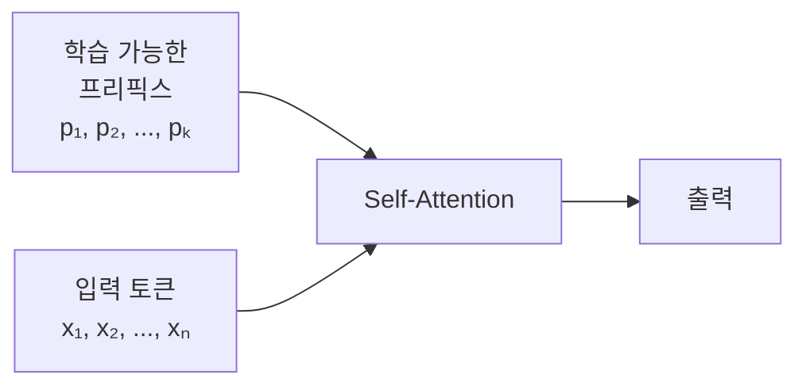

## 10주차 A회차: 작은 GPU로 거대 모델 길들이기 — PEFT, LoRA, QLoRA

> **미션**: 수업이 끝나면 LLM 경량화 기법의 전체 지형이 머릿속에 그려지고, QLoRA로 거대 모델을 8GB GPU에서 파인튜닝할 수 있다

### 학습목표

이 회차를 마치면 다음을 수행할 수 있다:

1. "왜 LLM 파인튜닝이 그렇게 메모리를 잡아먹는가"를 한 문장으로 설명하고, 해결 방향을 네 가지로 분류한다
2. PEFT의 핵심 아이디어를 이해하고, Adapter·Prefix Tuning·Prompt Tuning을 비유로 구분한다
3. LoRA가 왜 "안경 한 개만 끼면 되는" 방식인지 — 저랭크 분해의 직관을 설명한다
4. QLoRA의 양자화 기법(4-bit, NF4, Double Quantization)이 어떤 문제를 어떻게 푸는지 설명한다
5. 자원과 태스크 조건이 주어졌을 때 적절한 경량화·튜닝 전략을 고른다

---

### 오늘의 질문 + 빠른 진단

**오늘의 질문**: "내 노트북 GPU(8GB)에 700억 파라미터 모델을 올려 파인튜닝할 수 있을까?"

대답은 — *그냥은 못 한다*. 하지만 오늘 배우는 도구들이 있으면 가능하다.

**빠른 진단 (1문항)**:

Llama 70B 모델의 파라미터 하나(float32)는 약 4바이트를 차지한다. 70억 개를 저장하고, 거기에 역전파를 위한 그래디언트까지 따로 둔다면 메모리는 얼마나 필요할까?

① 약 28GB
② 약 56GB(파라미터) + 56GB(그래디언트) = 112GB
③ 약 28GB(파라미터) + 28GB(그래디언트) = 56GB
④ 약 14GB

정답: **② (총 112GB 이상, 옵티마이저 상태까지 더하면 1,120GB)**

> 이게 바로 오늘의 출발점이다. 노트북 GPU 한 대에 모두 우겨넣으려면 *무언가는 줄여야* 한다.

---

### 이론 강의

#### 10.1 코끼리를 욕조에 넣는 네 가지 방법

##### 일단 상황 파악부터

언어모델은 해마다 커진다. BERT-Base가 1.1억 개로 출발했는데, GPT-3는 1,750억, GPT-4는 추정 1조 이상이다. 성능은 올랐지만 함께 따라온 청구서가 무겁다:

- **메모리**: Llama 70B를 *그냥* 파인튜닝하면 모델 280GB + 그래디언트 280GB + 옵티마이저 560GB ≈ **1,120GB**. 일반 GPU 한 대(24GB)는커녕 데이터센터 GPU(80GB) 14대가 필요하다.
- **돈**: GPT-3 한 번 학습에만 약 450만 달러.
- **속도**: 파라미터가 많을수록 추론·학습 모두 느리다.
- **배포**: 수백 GB짜리 모델을 스마트폰에 넣을 수는 없다.

요컨대 우리는 **욕조에 코끼리를 넣어야 하는** 상황이다. 방법은 크게 네 가지로 나뉜다.

**표 10.1** 경량화의 네 작전

| 작전 | 무엇을 줄이나 | 한 줄 비유 | 대표 기법 |
|----|------|-------------|----------|
| ① 가지치기(Pruning) | 모델의 **불필요한 부분** | 죽은 가지를 자른다 | SparseGPT, Magnitude Pruning |
| ② 양자화(Quantization) | 파라미터의 **정밀도** | 1mm 자 대신 1cm 자를 쓴다 | NF4, GPTQ, AWQ |
| ③ 지식 증류(Distillation) | 모델 자체의 **크기** | 베테랑의 핵심만 신입에게 가르친다 | DistilBERT, TinyLlama |
| ④ PEFT | **학습할 파라미터** | 원본은 두고 안경만 새로 맞춘다 | LoRA, Adapter |

①·②·③은 "**모델을 작게**" 만드는 작전이고, ④는 "**학습을 작게**" 만드는 작전이다. 오늘은 네 가지를 모두 훑은 뒤, 마지막 두 작전(④ + ②의 결합 = **QLoRA**)에 깊이 들어간다.

##### 작전 ① 가지치기 — 죽은 가지를 자른다

정원사를 떠올려 보자. 나무에서 죽은 가지를 잘라내도 나무는 멀쩡히 살아간다. 신경망도 비슷하다. 학습이 끝난 모델 안에는 거의 0에 가까운 가중치가 수두룩하다. 이걸 잘라내도 성능은 거의 그대로다.

가지치기는 *무엇을 잘라내느냐*에 따라 두 갈래로 나뉜다.

| 방식 | 잘라내는 단위 | 압축률 | 진짜 빨라지나? |
|------|----------|--------|-------------|
| **비정형(Unstructured)** | 개별 가중치 하나하나 | 70~90% | 특수 하드웨어 있어야 빨라짐 |
| **정형(Structured)** | 뉴런·어텐션 헤드·층 통째 | 30~50% | 표준 GPU에서 바로 빨라짐 |

비정형은 더 많이 잘라낼 수 있지만 일반 GPU는 "0 곱하기"라는 사실을 따로 활용하지 못한다. 그래서 메모리는 줄지만 속도는 안 빨라지는 경우가 흔하다.

> **대표 사례**: **SparseGPT**(Frantar & Alistarh, 2023)는 LLM에 한 번만 패스해도 가중치 60%를 잘라낸다. perplexity는 거의 떨어지지 않는다.

**한계**: 너무 많이 자르면 성능이 한순간에 무너지고, 자른 뒤 다시 학습이 필요할 때가 많다.

##### 작전 ③ 지식 증류 — 베테랑의 직관을 신입에게

20년 차 베테랑 의사(Teacher)가 신입 의사(Student)를 가르친다고 해 보자. 베테랑은 *교과서 정답*만 알려주지 않는다. "이 환자는 폐렴이긴 한데 결핵 가능성도 20% 있고…" 같은 **흐릿한 판단 분포**까지 전수한다. 이게 지식 증류의 핵심이다.

- **하드 라벨**(일반 학습): `[고양이: 1, 개: 0, 표범: 0]` — "정답만 안다"
- **소프트 타겟**(증류): `[고양이: 0.7, 표범: 0.2, 개: 0.1]` — "고양이와 표범은 비슷하다는 암묵 지식까지 안다"

Student가 학습할 손실 함수는 두 항의 합이다:

**L = α × L_hard + (1−α) × T² × KL(p_Teacher ∥ p_Student)**

여기서 T는 *온도(temperature)*다. 높을수록 분포가 부드러워져서 "확실하지는 않지만 비슷한 후보"의 정보가 더 잘 전달된다.

> **대표 사례**:
> - **DistilBERT**(Sanh et al., 2019): BERT의 40% 크기로 성능 97% 유지
> - **TinyLlama**: 1.1B 파라미터로 Llama-2 7B의 지식을 받음

**한계**: Teacher를 먼저 학습시켜야 하니 *전체* 비용은 오히려 늘 수 있다. Student의 구조가 Teacher와 너무 다르면 지식이 잘 전달되지 않는다.

---

지금까지(①·③)는 **모델 자체**를 손대는 방식이다. 그런데 이건 위험하다. 원본을 잘못 건드리면 회복이 어렵다. 그래서 등장한 작전이 ④ PEFT다.

#### 10.2 작전 ④ PEFT — 원본은 두고 곁가지만 학습

##### 발상의 전환

여기서 잠깐. *파인튜닝*이 정말로 모델 전체를 다시 배우는 작업일까? 그렇지 않다.

사전학습이 끝난 LLM은 이미 언어를 안다. 문법, 상식, 추론 — 다 안다. 파인튜닝은 그저 "특정 태스크 말투에 맞게 살짝 조정"하는 단계다. **그러면 살짝 조정하는 데 필요한 추가 파라미터도 살짝이면 되지 않을까?**

이게 **PEFT(Parameter-Efficient Fine-Tuning)**의 출발이다.

> 원본 모델은 얼리고(frozen), **작은 추가 파라미터만 학습**한다.

PEFT는 한 가지 방법이 아니라 *가족*이다. 가족 구성원의 차이는 "추가 파라미터를 *어디에 어떻게* 붙이느냐"다.

**표 10.2** PEFT 가족 한눈에 보기

| 방법          | 추가 파라미터 | 어디에 붙나                          | 메모리 절약 |
| ------------- | ------------- | ------------------------------------ | ----------- |
| Adapter       | 0.4~2%        | 각 층 뒤에 작은 모듈을 끼워넣기      | 약 90%      |
| Prefix Tuning | 0.1%          | 입력 토큰 *앞에* 학습 가능 벡터      | 약 95%      |
| Prompt Tuning | 0.01%         | 입력 임베딩에 소프트 프롬프트 붙이기 | 약 99%      |
| LoRA          | 0.1%          | 가중치 변화량을 저랭크로 근사        | 약 99%      |

세 가족 멤버를 비유로 구분해 보자.

##### Adapter — 큰길 옆에 작은 샛길 내기

도시 한복판을 가로지르는 8차선 도로(원본 가중치)는 그대로 두고, 옆에 좁은 샛길을 하나 낸다. 차(정보)는 큰길로 가다가 필요할 때만 샛길로 우회한다.


**그림 10.1** Adapter 구조 (큰길 + 샛길)

샛길은 세 단계로 만들어진다.

```
입력(d차원) → [좁히기 d→r] → [활성화 ReLU] → [넓히기 r→d] → 원본 입력과 더하기 → 출력
```

- **좁히기**: 768차원을 64차원으로 압축 (정보를 작은 노트에 요약)
- **활성화**: 비선형성 한 번 (단순 선형 변환을 넘어선 표현)
- **넓히기**: 다시 768차원으로 복원
- **잔차 연결**: 원본 입력에 *보정값*만 얹어 더함

r이 작을수록(예: 64) 원본 가중치(768×768) 대비 추가 파라미터가 훨씬 적다. 전체 모델 대비 **3~5% 수준**만 학습하면 된다.

> **실제 활용 사례**
> - **Google(2019)**: BERT에 Adapter를 붙여 GLUE 22개 태스크를 한 모델로 처리. 파라미터 3.6% 추가로 97% 성능.
> - **의료 NLP**: 병원별 EHR 도메인에 적응. 병원이 바뀌면 Adapter만 교체.
> - **다국어 서비스**: mBERT + 언어별 Adapter. 새 언어 지원이 곧 새 Adapter 추가.

##### Prefix Tuning — 시험장에 참고자료를 먼저 깔아두기

수학 시험을 보러 가는 수험생을 상상해 보자. 머릿속(원본 모델)은 그대로다. 하지만 시험장에 들어서기 전에 "오늘 시험에 쓸 참고자료"를 책상 위에 미리 깔아둔다. *자기 기억 + 참고자료*로 답하는 것이다. **참고자료만 매번 갈아 끼우면** 같은 수험생이 다른 시험을 잘 본다.



**그림 10.2** Prefix Tuning 구조

프리픽스는 Self-Attention의 Key·Value 앞에 붙는다. 모델이 질문(Q)을 처리할 때 프리픽스를 *함께* 참고하는 셈이다. Adapter와 달리 매 층마다 추가 연산을 끼워 넣지 않으므로 **추론 속도가 거의 그대로**다 (시퀀스 길이만 약간 늘어남).

> **실제 활용 사례**
> - **요약 생성**: GPT-2에 "뉴스 요약용 프리픽스", "법률 요약용 프리픽스"를 각각 학습. 프리픽스만 갈아 끼우면 스타일이 바뀜.
> - **표 → 텍스트**: 0.1% 파라미터로 Full Fine-tuning에 근접한 성능.
> - **코드 생성 스타일 제어**: Python용·JS용 프리픽스를 따로.

##### Prompt Tuning — 입구에 그날의 메뉴판 걸기

식당에 들어선 손님(입력)을 떠올려 보자. 입구에 "오늘의 메뉴판"(소프트 프롬프트)이 걸려 있다. 손님은 그걸 보고 주문 방향이 결정된다. 메뉴판은 사람이 읽는 글자가 아니라 모델만 이해하는 **벡터**다.

```
Input = Concat(soft_prompt, original_input_embeddings)
```

예) 입력 "이 영화는"에 소프트 프롬프트 4개를 앞에 붙이면:

```
[soft_prompt_1, soft_prompt_2, soft_prompt_3, soft_prompt_4, 이, 영, 화, 는, ...]
```

추가 파라미터는 프롬프트 길이 k × d차원이 전부다. PEFT 가족 중 **가장 가볍다**.

> **실제 활용 사례**
> - **Google T5(2022)**: 수십 개 태스크에 소프트 프롬프트만 학습 → 본체 공유.
> - **API 서비스**: 모델 가중치에 접근 못해도 입력 앞에만 붙이면 됨.
> - **개인화 추천**: 사용자별 소프트 프롬프트로 같은 모델이 다른 응답.

**표 10.3** Adapter · Prefix · Prompt 비교

| 특성             | Adapter   | Prefix   | Prompt    |
| ---------------- | --------- | -------- | --------- |
| 추가 파라미터    | 0.4~2%    | 0.1~0.5% | 0.01~0.1% |
| 추론 레이턴시    | 약간 증가 | 거의 무증가 | 거의 무증가 |
| 새 태스크 적응성 | 중간      | 좋음     | 보통      |
| 구현 복잡도      | 중간      | 높음     | 낮음      |

---

가족 중 가장 인기 있는 막내가 **LoRA**다. 별도 절로 깊이 들어간다.

#### 10.3 LoRA — 안경 한 개로 시력 보정하기

##### 핵심 비유

눈이 나빠진 사람을 떠올려 보자. 시력을 고치는 방법은 두 가지다.

- **수술**(Full Fine-tuning): 각막을 직접 깎는다. 효과 확실. 비싸고, 잘못되면 회복 어렵다.
- **안경**(LoRA): 안경 하나만 끼면 된다. 본체(눈)는 그대로. 도수가 안 맞으면 안경만 바꾸면 된다.

LoRA는 안경 쪽이다.

##### 수식: 가중치 변화량을 두 조각으로 쪼개기

학습 중 가중치 W가 W'로 바뀐다고 하자. 변화량을 ΔW라고 부른다. Full Fine-tuning은 거대한 ΔW 전체를 계산·저장한다. LoRA는 다르다. **ΔW를 좁고 긴 두 행렬의 곱으로 근사**한다.

**ΔW ≈ A × B**, 그러면 최종 가중치는 **W' = W + A × B**

여기서 A와 B는 *훨씬 작은* 행렬이다. 원본 W가 4096×4096이라면, A는 4096×8, B는 8×4096처럼 만들 수 있다. r(여기서 8)을 **rank**라고 부른다.

##### 왜 이게 통하나? — 저랭크의 직관

여기서 의문이 생긴다. "그렇게 작은 두 행렬로 거대한 변화를 표현할 수 있다고?" 답은: **파인튜닝에서 일어나는 변화는 의외로 단순한 구조**를 가진다.

BERT를 특정 태스크로 파인튜닝한 뒤 ΔW의 특이값을 보면 — 상위 몇 개에 분산이 몰려 있다.

```
특이값 순위  | 특이값 크기 | 누적 설명 비율
1           | 2.85      | 15.8%
2           | 2.41      | 28.2%
3           | 1.94      | 37.4%
...
16          | 0.50      | 90.2%
...
100         | 0.15      | 91.2%
```

전체 768개 차원 중 **상위 16개만 살려도 분산의 90%가 설명된다**. 그래서 r=16 정도면 대부분의 태스크에 충분하다.

> **다른 비유**: 거대한 행렬은 사진 한 장이다. JPEG 압축이 가능한 이유는, 사진의 정보 대부분이 *몇 개의 주성분*에 몰려 있어서다. ΔW도 마찬가지다.

##### 효과: 학습할 파라미터 99% 절감

4096×4096 가중치 한 층, r=8로 LoRA를 걸면:

```
Full Fine-tuning:  4,096 × 4,096 = 16,777,216개
LoRA (A + B):      8 × (4,096 + 4,096) = 65,536개
절감율: 약 99.6%
```

> **쉽게 말해**: 거대한 정사각 행렬 하나를 학습하는 대신, "얇고 긴" 두 장으로 쪼개 학습한다. 학습 속도·메모리가 그만큼 가볍다.

> **실제 활용 사례**
> - **LLaMA 계열**: LoRA가 사실상 표준. Alpaca, Vicuna, WizardLM 등 오픈소스 명령 수행 모델 대부분이 LoRA로 단일 GPU에서 파인튜닝됨.
> - **의료 AI**: 공개 LLM에 의료 데이터로 LoRA. 병원 서버에서 LoRA 가중치만 교체.
> - **기업 고객 지원**: 콜센터 로그로 LoRA → 신제품 출시 시 LoRA만 재학습.
> - **이미지 생성(Stable Diffusion)**: 특정 화풍·인물·제품의 LoRA 어댑터 수십 MB 단위로 공유·배포.

##### 안경의 도수 — 하이퍼파라미터 세 가지

**초기값**: A는 가우시안, B는 **0**으로 시작한다. 이렇게 하면 학습 시작 순간 ΔW = A × 0 = 0이라, *원본 모델과 정확히 같은 상태*에서 출발한다. 안정적인 학습의 조건이다.

**Rank(r)**: r이 클수록 표현력↑ · 메모리↑. 대부분의 태스크에서 **r=16**이 기본값. 단순 분류는 r=8, 새로운 언어·도메인 적응은 r=64 이상.

**lora_alpha**: 안경의 도수에 해당. 어댑터 출력 강도를 조절한다. **lora_alpha = 2 × r**(예: r=16 → alpha=32)이 안정적인 출발점.

---

#### 10.4 작전 ② 양자화 — 1mm 자 대신 1cm 자

##### 또 다른 시각: 모델은 그대로 두되 정밀도만 낮추기

LoRA는 *학습할 파라미터*를 줄이는 작전이었다. 그런데 *원본 모델 자체*가 메모리에 안 들어간다면? 그래서 등장하는 게 양자화다.

자(ruler)를 떠올려 보자.

- **float32**: 1mm 눈금의 정밀 자. 정확하지만 길고 무겁다.
- **float16**: 5mm 눈금. 일상에 충분.
- **int8**: 1cm 눈금. 가구 잴 땐 이걸로 충분.
- **int4**: 손가락으로 대충. 정밀도는 떨어지지만 거의 공간을 차지하지 않는다.

신경망은 다행히도 *대충 측정에 강하다*. 가중치 하나를 0.001 단위로 정확히 모르더라도 전체 성능은 거의 그대로다.

**표 10.4** 정밀도별 메모리 (Llama 70B 기준)

| 정밀도  | 메모리 | 상대값 | 자 비유         | 정확도 손실      |
| ------- | ------ | ------ | --------------- | ---------------- |
| float32 | 280GB  | 1×     | 정밀 자 (1mm)   | 없음 (기준)      |
| float16 | 140GB  | 0.5×   | 보통 자 (5mm)   | 거의 없음        |
| int8    | 70GB   | 0.25×  | 줄자 (1cm)      | 약간 있음        |
| int4    | 35GB   | 0.125× | 손가락 (대충)   | 있지만 용인 가능 |

float32로는 GPU에 못 올리던 70B 모델이, int4면 **35GB**다. 24GB GPU에 거의 들어간다.

##### 4-bit 양자화는 어떻게 동작하나

4-bit 정수는 16개 값(예: 0~15)만 표현한다. 원본 가중치는 보통 -2~2 사이에 흩어져 있다. *어떻게 맞추나?* — 원본 범위를 16칸에 균등하게 매핑한 뒤, 쓸 때만 원래 범위로 복원한다.

```
원본 값: [0.5, 1.2, -0.8, 1.9, 0.1]
최소값: -0.8, 최대값: 1.9, 범위: 2.7

양자화 후 (4-bit): [13, 15, 0, 15, 6]

역양자화 (사용 시):
- 13 / 15 × 2.7 + (-0.8) = 0.576
- 15 / 15 × 2.7 + (-0.8) = 1.9
- 0  / 15 × 2.7 + (-0.8) = -0.8
- 6  / 15 × 2.7 + (-0.8) = 0.282
```

정보 손실은 분명히 있다. 하지만 *모델 전체* 성능에는 거의 영향이 없다. 오케스트라에서 바이올린 한 명이 음을 0.01초 늦게 켜도 전체 하모니는 그대로인 것과 같다.

##### NF4 — 자주 쓰는 곳에 칸을 더 몰아주기

일반 4-bit는 16칸을 *균등하게* 나눈다. 그런데 신경망 가중치는 0 근처에 몰려 있고 극단값은 드물다. 균등 배치는 자주 쓰는 곳(0 근처)에 칸이 부족하고 거의 안 쓰는 곳에 칸이 낭비된다.

> **비유**: 주차장 16칸을 만드는데, 출구 근처(차가 자주 멈추는 곳)에 1칸만 두고, 안쪽 구석에 15칸을 둔다면 비효율적이다. 자주 쓰는 곳에 더 많이 몰아줘야 한다.

**NF4(Normalized Float 4-bit)**는 정규분포 모양에 맞춰 **0 근처에 칸을 촘촘하게, 극단값에는 드물게** 배치한다. 같은 16칸인데 자주 등장하는 값을 더 정밀히 표현한다.

##### Double Quantization — 라벨까지 압축하기

양자화에는 *어디까지가 -0.8이고 어디까지가 1.9인지* 기록하는 **기준값(스케일)**이 필요하다. 이 스케일 자체도 메모리를 차지한다.

> **비유**: 짐을 진공 압축팩에 넣었다. 그런데 겉면 라벨이 손바닥만 하다. 라벨까지 축소 인쇄하면 짐 더미가 더 작아진다.

**Double Quantization**은 이 스케일 값마저 한 번 더 양자화한다. 70B 모델 기준 35GB에서 **약 18GB**까지 추가로 줄어든다.

##### bitsandbytes로 한 줄에 끝내기

이 모든 걸 직접 구현할 필요는 없다. **bitsandbytes** 라이브러리가 안정적인 4-bit 연산·역전파를 제공한다.

```python
import torch
from transformers import AutoModelForCausalLM

model = AutoModelForCausalLM.from_pretrained(
    "meta-llama/Llama-2-70b",
    load_in_4bit=True,
    bnb_4bit_compute_dtype=torch.bfloat16,
    bnb_4bit_use_double_quant=True,
    bnb_4bit_quant_type="nf4",
    device_map="auto"
)
```

- `load_in_4bit=True`: 4-bit로 로딩
- `bnb_4bit_compute_dtype=bfloat16`: 연산은 bfloat16으로
- `bnb_4bit_use_double_quant=True`: Double Quantization 켜기
- `bnb_4bit_quant_type="nf4"`: 일반 4-bit 대신 NF4
- `device_map="auto"`: GPU/CPU 자동 배치

이렇게 로딩하면 70B 모델이 약 15~20GB만 차지한다.

---

#### 10.5 두 작전의 결합 — QLoRA

##### 아이디어

이제 무대가 갖춰졌다.

- **양자화**(작전 ②)로 원본 모델을 4-bit로 압축해서 메모리에 올린다 → 원본은 *학습 안 함*
- **LoRA**(작전 ④)로 작은 어댑터만 따로 학습한다 → 어댑터는 *full precision*

이 둘의 결합이 **QLoRA(Quantized LoRA)**다.

```
1. 원본 모델 가중치 → 4-bit NF4로 양자화 (얼림)
2. LoRA 어댑터 A, B → bfloat16으로 학습
3. 역전파는 4-bit 모델을 통과하지만, 업데이트는 어댑터에만 적용
```

##### 메모리 견적

```
4-bit 양자화 모델 가중치:    14GB  (70B 기준)
LoRA 어댑터 (bfloat16):       1GB  (r=16)
옵티마이저 상태:               2GB  (Adam의 m, v)
그래디언트 (bfloat16):         1GB
─────────────────────────────────
총합:                       약 18GB
```

비교:

| 방식 | 70B 모델 학습 시 메모리 |
|----|------|
| Full Fine-tuning | **1,120GB +** |
| QLoRA | **약 18GB** |
| 절감 | **60배 이상** |

24GB GPU 한 대로 70B를 파인튜닝할 수 있게 된 것이다.

> **실제 활용 사례**
> - **단일 소비자 GPU**: RTX 3090(24GB) 한 대로 LLaMA-2 65B 파인튜닝. QLoRA 이전엔 A100 80GB 4대급 작업.
> - **소규모 팀 LLM 연구**: QLoRA 논문(Dettmers et al., 2023) 이후 진입장벽이 급락.
> - **엣지 디바이스**: 4-bit 양자화 모델을 스마트폰·임베디드에서 구동.
> - **한국어 특화 모델**: EXAONE, HyperCLOVA X 등이 한국어 데이터에 QLoRA로 적응.

##### 실전 설정 — 세 가지만 조절하면 된다

**① target_modules — LoRA를 어느 층에 붙일까?**

Transformer 안에는 수십 개의 가중치 행렬이 있다. 다 붙이면 파라미터가 늘어난다. 보통 **Attention의 Query(q)와 Value(v)** 두 곳이면 충분하다.

> **비유**: 100개 사무실 빌딩에서 핵심 회의실 2곳만 리모델링해도 회사 분위기가 충분히 바뀐다.

| 선택 범위 | 설정값 | 특징 |
|---|---|---|
| 최소 (권장 시작점) | `["q_proj", "v_proj"]` | 가장 가볍고 빠름 |
| 중간 | `["q_proj", "k_proj", "v_proj", "out_proj"]` | 균형 |
| 최대 | Attention + FFN 전체 | 성능 최고, 메모리 많이 사용 |

**② lora_alpha — 안경의 도수**

원본과 어댑터의 영향력 비율. **lora_alpha = 2 × r**(예: r=16 → alpha=32)이 대부분에서 잘 작동.

**③ lora_dropout — 과적합 방지**

학습 중 일부 연결을 무작위로 끊는다. **0.05(5%)**가 출발점.

```python
from peft import LoraConfig

lora_config = LoraConfig(
    r=16,
    lora_alpha=32,                          # r의 2배
    target_modules=["q_proj", "v_proj"],   # 권장 시작점
    lora_dropout=0.05,
    task_type="CAUSAL_LM"
)
```

##### 추가 절약 카드: Gradient Checkpointing

여전히 메모리가 빠듯하다면 한 장 더 있다. 학습 중에는 역전파를 위해 중간 계산 결과를 모두 저장한다. 모델이 크면 이 *중간 기록*만으로도 메모리가 터진다.

**Gradient Checkpointing**은 중간 기록을 저장하지 않고, 역전파 시점에 **필요한 부분만 다시 계산**한다. 메모리 30~50% 절약, 계산은 약 20% 더.

> **비유**: 시험 답안에 풀이 과정을 다 안 적고 최종 답만 써둔 셈. 검토할 땐 처음부터 다시 풀어야 하지만, 공책은 훨씬 덜 쓴다.

```python
model.gradient_checkpointing_enable()
```

---

#### 10.6 어떤 작전을 언제 쓸까

지금까지 도구는 다 모았다. 이제는 *상황별 처방전*이다.

**표 10.5** 상황별 추천

| 상황 | 추천 | 이유 |
|------|----------|------|
| GPU 메모리 부족 + 파인튜닝 필요 | **QLoRA** | 4-bit + LoRA로 8GB GPU도 가능 |
| 추론 속도/비용 절감 | **Pruning + Quantization** | 모델 자체를 작게 → 서빙 비용 ↓ |
| 작고 성능 좋은 모델 필요 | **Knowledge Distillation** | Teacher의 핵심만 Student로 |
| 같은 모델로 다중 태스크 서빙 | **LoRA / Adapter** | 본체 공유, 어댑터만 교체 |
| 리소스 무제한, 최고 성능 | **Full Fine-tuning** | 모든 파라미터 직접 업데이트 |
| 엣지·모바일 배포 | **Quantization + Distillation** | 크기·정밀도 동시 축소 |

> **실무 팁**: 작전들은 *배타적이지 않다*. QLoRA로 파인튜닝하고 → 배포 시 Pruning + 정적 양자화 추가 적용 → 한국어 Distillation까지 — 식의 **조합**이 최근 트렌드다.

---

#### 10.7 앞으로 더 알아두면 좋은 것들

경량화는 빠르게 진화 중이다. 이름 정도는 익혀두자.

- **AdaLoRA**(Zhang et al., 2023): 층마다 같은 rank를 쓰지 않고, 중요한 층에는 큰 rank, 덜 중요한 층에는 작은 rank를 **동적으로** 할당. 같은 파라미터 예산에서 성능↑.
- **UniPELT**: Adapter + Prefix + LoRA를 한 우산 아래 통합, 게이트 메커니즘으로 각 방법의 기여를 자동 조절. 어느 PEFT가 좋을지 모를 때 유용.
- **SparseGPT + LoRA**: 먼저 가지치기로 모델을 희소화한 뒤 LoRA로 성능 회복. 크기와 태스크 적응을 동시에.
- **GPTQ / AWQ**: 3-bit, 2-bit까지 내려가는 가중치 전용 양자화. bitsandbytes와 함께 양자화의 양대 축.

> **한 줄 정리**: 흐름은 "단일 기법"에서 "**여러 기법의 조합**"으로 이동 중이다.

---

### 라이브 코딩 시연

오늘 실습의 큰 그림은 한 문장이다 — **"한국어를 *알지만* 질문을 *못 알아듣는* 모델을, 8GB GPU 위에서 *말귀를 알아듣게* 만든다."**

실습은 네 개의 독립 .py로 나뉘는데, 라이브 코딩에서 **무대 위에 올라가는 것은 00 → 02 순서**다. 01·03은 보조 자료(이론 시연·메모리 차트)다.

| 파일 | 역할 | GPU |
|---|---|---|
| `practice/chapter10/code/00-모델질문해보기.py` | **인터랙티브**: 베이스 모델만 로딩, 직접 한국어 질문 입력 → 응답 확인 | NVIDIA·Mac·CPU |
| `practice/chapter10/code/01-양자화수학.py` | 4-bit·NF4·LoRA 절감의 수학적 직관을 숫자로 시연 | 불필요 |
| `practice/chapter10/code/02-qlora파인튜닝.py` | **자동**: 환경 자동 구성 + 모델 로딩 + Before/After 비교 (라이브 코딩 주역) | NVIDIA 권장 |
| `practice/chapter10/code/03-메모리비교.py` | 모델 크기별 메모리 견적 차트 저장 | 불필요 |

권장 학습 흐름:

1. **`python code/02-qlora파인튜닝.py`** — 처음에 한 번 실행해 환경 자동 구성을 마치고, 자동으로 Before/After 비교까지 본다.
2. **`python code/00-모델질문해보기.py`** — 환경이 깔린 뒤, *자기 질문*을 베이스 모델에 직접 던져보며 "베이스 모델은 정말로 질문을 못 알아듣는다"를 손으로 체험한다.

(처음부터 00을 돌려도 되지만, 환경 자동 구성이 02에만 있으므로 02를 먼저 한 번 돌리는 게 막힘이 없다.)

**실습 환경 및 데이터**

| 항목 | 내용 |
|------|------|
| **실습 모델** | `EleutherAI/polyglot-ko-1.3b` (한국어 전용 GPT-NeoX, fp16 ~2.6GB) |
| **학습 데이터** | `beomi/KoAlpaca-v1.1a` 500개 샘플 (한국어 Instruction, Apache-2.0) |
| **출력 위치** | `practice/chapter10/data/output/` (Before/After 비교, LoRA 어댑터) |
| **Windows** | NVIDIA RTX 4060(8GB)+ → **QLoRA** (4-bit 양자화 + LoRA) |
| **macOS** | Apple Silicon → **LoRA** (float16, 양자화 없음) |

> **주의**: 첫 실행 시 모델(~2.6GB)·데이터 다운로드. 이후 HuggingFace 캐시(`~/.cache/huggingface/`)에서 재사용.

---

#### Phase 1 — 환경 자동 구성: 신경 쓰지 않아도 되는 영역

QLoRA 실습의 가장 큰 진입장벽은 *학습이 아니라 환경 설정*이다. NVIDIA 드라이버 버전에 맞는 PyTorch+CUDA, bitsandbytes의 OS별 가용성, peft·accelerate 버전 호환 — 이걸 손으로 맞추다 보면 실습이 산으로 간다.

`02-qlora파인튜닝.py`는 처음 실행될 때 **자기가 어디서 도는지 스스로 알아낸다**. NVIDIA GPU가 보이면 드라이버 버전을 읽어서 그에 맞는 CUDA 빌드를 pip로 설치하고, Apple Silicon이면 MPS 경로로 돌리고, 그 외에는 CPU로 떨어진다.

이 단계에서 두 종류의 일이 일어나는데, **둘은 다르다**:

- **설치 (pip)** — Python 라이브러리. 다음 줄들이 *없으면* 자동으로 깐다:
  - `torch` (드라이버에 맞는 CUDA 빌드)
  - `transformers` — 베이스 모델을 로딩·실행하는 HuggingFace API
  - `peft` — LoRA 어댑터를 *모델 위에 끼우는* 라이브러리
  - `bitsandbytes` — 4-bit 양자화 CUDA 커널 (Mac에서는 건너뜀)
  - `accelerate` — 가중치를 GPU/CPU에 자동 배치
  - `datasets` — KoAlpaca 같은 공개 데이터셋 로딩
- **다운로드 (HuggingFace Hub)** — 모델 가중치와 학습 데이터:
  - `EleutherAI/polyglot-ko-1.3b` — **이번 실습의 주인공 모델**. 1.3B 파라미터, fp16 기준 약 2.6GB. EleutherAI가 한국어 텍스트로 사전학습한 GPT-NeoX 계열 LM. 이 모델은 "다음 단어 예측"만 학습됐을 뿐, 질문-답변 형식을 본 적이 없다 — 이게 바로 단계 2에서 확인하게 될 사실이다.
  - `beomi/KoAlpaca-v1.1a` — 한국어 Instruction 데이터셋(21K). 이 중 500개만 무작위 추출해 학습에 쓴다.

두 종류 모두 *첫 실행 한 번*만 일어난다. 다음부터는 `~/.cache/huggingface/`에 저장된 캐시를 재사용한다.

> **"한 번만 `python code/02-qlora파인튜닝.py`를 치면, 그다음은 모델이 *알아서* 다 한다."** 자기 노트북에 가져가서 돌릴 때도 막히지 않는다.

---

#### 단계 0 — 베이스 모델에 직접 질문해보기 (인터랙티브)

라이브 코딩의 첫 장면은 *코드*가 아니라 *체험*이다. **`00-모델질문해보기.py`**를 실행하면 콘솔에 한국어 질문을 입력하고 즉시 응답을 받아볼 수 있다 — 파인튜닝 *없이*.

```
[질문 1] 인공지능이 우리 생활에 미치는 영향을 설명해주세요.
  ... 응답 생성 중
[응답 1]
(질문과 무관한 한국어 문장이 흘러나옴)
------------------------------------------------------------
[질문 2] _
```

`exit` 또는 `quit`을 입력할 때까지 *얼마든지 다른 질문*을 시도할 수 있다. "건강한 식습관을 알려주세요", "오늘 날씨가 어때요?" — 어떤 질문이든 베이스 모델은 일관되게 *질문과 어긋난* 한국어를 생성한다.

이 단계의 *학습 목적*은 명확하다 — **"베이스 LLM은 한국어를 *알지만* 질문에 답하는 *형식*은 모른다"**는 사실을 직접 손가락 끝으로 확인하는 것이다. 단계 2의 자동 비교(Before/After)는 객관적 증거이지만, *직접* 질문을 던져보지 않으면 그 의미가 추상적으로만 남는다.

내부적으로 이 스크립트는 단계 1과 동일하게 모델을 로딩하지만 — **LoRA 어댑터는 붙이지 않는다**. 즉 *날 것 그대로의* 베이스 모델과 직접 대화하는 셈이다.

> **선행 조건**: 의존성 자동 설치는 02에만 들어 있으므로, 처음 실행이라면 `python code/02-qlora파인튜닝.py`를 한 번 먼저 돌려 환경을 깔아두는 게 매끄럽다. 그 이후 00은 곧바로 동작한다.

---

#### 단계 1 — 모델 로딩: 디스크에서 GPU로

Phase 1에서 캐시에 받아둔 `polyglot-ko-1.3b`의 가중치 파일들을 읽어 **GPU 메모리에 올리는** 단계다. 동시에 두 개의 객체가 만들어진다:

- **모델 (`AutoModelForCausalLM`)** — 실제 신경망. 이 시점부터 `model(input_ids=...)`로 호출할 수 있다.
- **토크나이저 (`AutoTokenizer`)** — 한국어 문자열을 모델이 이해하는 *토큰 ID*로 바꿔주는 사전(辭典). 같은 이름 `polyglot-ko-1.3b`로 받지만 모델과는 별개 파일이다.

여기서 *결정*되는 건 **"가중치를 어떤 정밀도로 메모리에 올릴 것인가"** 하나다. 그리고 그 선택은 실행 환경의 하드웨어가 대신 해 준다.

- **NVIDIA GPU**라면 — `BitsAndBytesConfig`로 **4-bit NF4 + Double Quantization**을 켜고 로딩한다. 1.3B 모델이 디스크의 2.6GB → 메모리의 약 0.8GB 수준으로 압축된다. 연산 시점에는 bfloat16으로 복원해서 계산한다.
- **Apple Silicon / CPU**라면 — bitsandbytes의 CUDA 커널을 못 쓰므로 양자화는 생략하고 그냥 float16(또는 float32)으로 로딩한다. 즉 *QLoRA*가 아니라 *LoRA*가 된다.

이 분기는 `02-qlora파인튜닝.py`의 `load_model()` 함수가 처리한다. 직접 코드를 만질 필요는 없다.

핵심 한 줄만 본다면:

```python
# NVIDIA만 해당. Mac/CPU에서는 양자화 없이 fp16/fp32로 로딩
BitsAndBytesConfig(load_in_4bit=True, bnb_4bit_quant_type="nf4", bnb_4bit_use_double_quant=True)
```

여기서 `"nf4"`는 *균등 4-bit*가 아니라 정규분포 모양에 맞춘 NF4를, `use_double_quant=True`는 스케일 값까지 한 번 더 압축하는 *이중 양자화*를 의미한다. 둘 다 §10.4에서 본 개념이 그대로 옵션 한 줄에 대응된다.

---

#### 단계 2 — Before: 방금 받은 모델에게 한국어로 질문해 본다

이제 단계 1에서 메모리에 올라간 *그 모델에게 직접 질문*한다. 추론 과정은 네 단계로 일어난다.

1. **프롬프트 만들기** — 입력한 질문을 KoAlpaca와 같은 형식으로 감싼다:
   > `### 질문: 인공지능이 우리 생활에 미치는 영향을 설명해주세요.\n\n### 답변: `

   `### 답변:` 뒤가 *비어* 있다는 점이 핵심이다. 모델은 이 빈자리를 *이어 써야 하는* 자리로 인식한다.

2. **토크나이즈** — 토크나이저가 위 한국어 문자열을 정수 ID 시퀀스(예: `[12, 4825, 109, ...]`)로 바꾼다. 모델은 한국어 글자가 아니라 *숫자*만 이해한다.

3. **생성 (`model.generate(...)`)** — 모델이 토큰 ID 시퀀스를 받아 *다음에 올 토큰*을 한 개씩 예측한다. 예측한 토큰을 입력 끝에 붙이고, 그 새로운 시퀀스로 다시 다음 토큰을 예측한다. 이 자기회귀(autoregressive) 과정을 80번 정도 반복(`max_new_tokens=80`)한다.

4. **디코딩** — 생성된 토큰 ID들을 토크나이저가 다시 한국어 문자열로 풀어낸다. 이게 우리가 보는 *모델의 응답*이다.

문제는 **무엇이 *이어 써지느냐*** 다. 베이스 polyglot-ko-1.3b는 한국어 문장을 매끄럽게 이어 쓰는 데는 익숙하지만, "`### 답변:` 다음에는 그 위의 질문에 대한 답이 와야 한다"라는 *형식 규약*을 학습한 적이 없다. 그래서 답변 자리에 흘러나오는 것은 — **질문과 거의 무관한 한국어**다. 광고 카피, 블로그 글의 일부, 토픽 드리프트.

이게 바로 **Instruction Tuning이 가르치려는 것**이다. 이 순간을 *눈으로* 확인하는 게 중요하다. 모델이 멍청해서가 아니라, *질문-답변이라는 게임의 규칙*을 모르기 때문이다.

`02-qlora파인튜닝.py`는 미리 정의된 3개의 한국어 질문(`TEST_PROMPTS`)을 위 4단계로 베이스 모델에 차례로 던지고, 각 응답을 `before_results`에 저장해 둔다. 나중에 단계 5에서 같은 질문을 다시 던져 *나란히 비교*하기 위해서다.

---

#### 단계 3 — LoRA 설정: 어디에 어떤 안경을 끼울까

여기서 *처음으로 결정*해야 하는 부분이 등장한다. LoRA를 *어디에* 붙이고, *얼마나 두꺼운 안경*을 끼울 것인가.

```python
LoraConfig(r=16, lora_alpha=32, target_modules=["query_key_value"], lora_dropout=0.05)
```

네 가지 결정이 압축되어 있다:

- **`r=16`** — §10.3에서 본 안경 도수. 16이면 대부분의 태스크에서 충분하다. 더 단순한 작업이라면 8, 새로운 언어·도메인이라면 32~64.
- **`lora_alpha=32`** — 안경의 강도. 관례적으로 `2 × r`. 이걸 너무 키우면 어댑터가 원본을 압도하고, 너무 작으면 학습 신호가 약해진다.
- **`target_modules=["query_key_value"]`** — **여기가 이번 실습의 미묘한 함정**이다. 다른 자료에서 흔히 보는 `["q_proj", "v_proj"]`가 아니다. polyglot-ko-1.3b가 쓰는 **GPT-NeoX 아키텍처에서는 Q·K·V 프로젝션이 하나의 행렬에 통째로 묶여 있기 때문**이다. 같은 LoRA를 Llama에 적용한다면 다시 `["q_proj", "v_proj"]`로 바뀐다. 즉 *모델 아키텍처가 바뀌면 이 한 줄이 바뀐다*.
- **`lora_dropout=0.05`** — 학습 중 어댑터 일부 연결을 5% 확률로 끊는다. 500샘플처럼 작은 데이터에서 과적합을 막는다.

데이터 쪽도 한 가지 디테일이 있다. KoAlpaca의 21,000개 샘플 중 **500개만** 무작위로 뽑는다(`seed=42`). 실습 시간 내에 끝나야 하므로 일부러 작게 잡았다. 각 샘플은 `### 질문: ... \n\n### 답변: ...` 포맷으로 토크나이즈된다 — 이 포맷이 단계 2에서 던진 질문과 같다는 점이 중요하다. **모델은 "이런 포맷이 오면 답변을 쓰는 거다"라는 *형식 자체*를 학습**한다.

이 단계 전체는 `02-qlora파인튜닝.py`의 `finetune_with_koalpaca()` 안쪽에서 처리된다.

---

#### 단계 4 — 학습: 단 20스텝의 변화

```python
TrainingArguments(max_steps=20, per_device_train_batch_size=2, gradient_accumulation_steps=4,
                  learning_rate=5e-4, bf16=True, gradient_checkpointing=True)
```

각 옵션이 무엇을 *결정*하는지 한 줄씩 짚으면:

- **`max_steps=20`** — 강의 한 호흡 안에 끝나는 분량. 진짜 품질을 원하면 50~100이지만, *Instruction 포맷의 학습은 놀라울 정도로 빨리* 일어난다. 20스텝만 돌려도 응답이 눈에 띄게 달라진다.
- **`per_device_train_batch_size=2` × `gradient_accumulation_steps=4`** — 실효 배치 8. 작은 GPU에서 큰 배치 효과를 내는 표준 트릭이다.
- **`learning_rate=5e-4`** — Full FT(보통 2e-5~5e-5)보다 *10배 이상* 크다. LoRA는 학습할 파라미터가 적기 때문에 더 큰 learning rate가 안정적이다.
- **`bf16=True`** — 연산 정밀도. NVIDIA에서만 켠다. Mac에서는 자동으로 꺼진다.
- **`gradient_checkpointing=True`** — §10.5의 마지막 보험. 중간 활성화를 저장하지 않고 역전파 시 다시 계산해서 메모리를 30~50% 더 아낀다. 8GB GPU에서 1.3B 모델을 돌리려면 거의 필수다.

학습이 끝나면 **새로 학습된 파라미터는 LoRA 어댑터에만** 들어 있다. 원본 모델 가중치는 4-bit로 얼어 있는 그대로다. 디스크에 저장하면 어댑터는 약 50MB — 원본 2.6GB의 2% 미만이다.

---

#### 단계 5 — After: "같은 질문, 다른 답"

단계 2에서 던졌던 *바로 그 세 질문*을 어댑터가 붙은 모델에 다시 던진다. 그리고 응답을 단계 2의 응답과 나란히 출력한다.

```
[질문] 인공지능이 우리 생활에 미치는 영향을 설명해주세요.

Before: (질문과 무관한 한국어 텍스트가 흘러나옴)
After:  인공지능은 우리 생활에 다양한 영향을 미치고 있습니다. 첫째, ...
```

이 순간 *눈으로 확인할 수 있다* — **같은 모델 가중치, 같은 질문**인데, LoRA 어댑터 약 50MB가 붙은 것만으로 모델이 *질문에 답한다*. 베이스 모델의 한국어 능력은 그대로 보존된 채, *질문-답변 형식*이라는 새로운 기술 하나만 추가된 것이다.

비교 결과는 `data/output/before_after_comparison.txt`에 저장된다.

---

#### 라이브 코딩에서 가져가야 할 네 가지

1. **Instruction Tuning은 "지식을 가르치는 게 아니라 *형식*을 가르치는 일"**에 가깝다. 베이스 모델은 이미 한국어를 안다. 부족한 건 "질문 → 답변"이라는 게임의 규칙뿐이다.
2. **QLoRA vs LoRA의 차이는 *코드의 한두 줄*에 불과**하다. 같은 파이프라인이 Windows에서는 QLoRA로, Mac에서는 LoRA로 자동 분기된다.
3. **`target_modules`는 아키텍처마다 다르다**. GPT-NeoX의 `query_key_value`와 Llama의 `q_proj/v_proj`를 기억하자. 실무에서 새 모델을 만나면 *층 이름부터 확인*하는 습관이 필요하다.
4. **저장 효율성**: 한 베이스 모델 + 여러 LoRA 어댑터로 *여러 도메인을 동시 서빙*할 수 있다. 의료용 어댑터(50MB), 법률용 어댑터(50MB), 고객 응대용 어댑터(50MB)를 교체하며 같은 본체를 재사용한다.

---

#### 이 회차의 핵심 내용


**Copilot 활용 가이드**:

- 기본: "polyglot-ko-1.3b를 4-bit로 로딩하고 LoRA를 적용해줘"
- 심화: "rank를 8, 16, 32로 바꾸어 Before/After 품질을 비교해줘"
- 심화: "학습 스텝을 50, 100으로 늘리면 응답 품질이 어떻게 변하는지 실험해줘"
- 검증: "GPT-NeoX와 Llama 아키텍처에서 target_modules가 다른 이유를 설명해줘"

---
