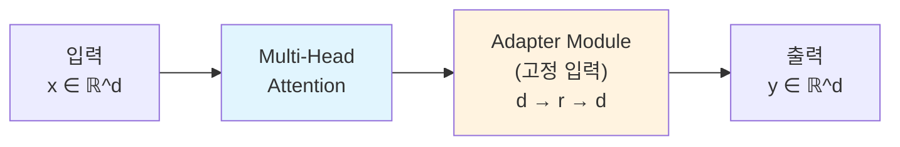
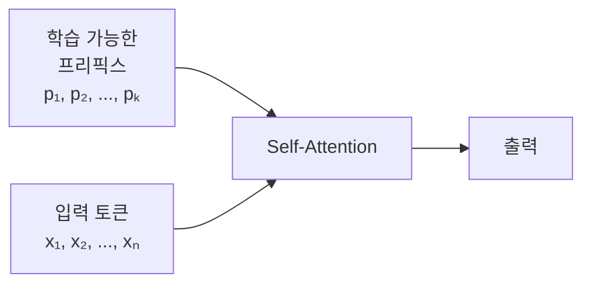

## 10주차 A회차: LLM 파인튜닝 (2) — PEFT와 LoRA

> **미션**: 수업이 끝나면 Llama 70B 모델을 8GB GPU에서 QLoRA로 파인튜닝할 수 있다

### 학습목표

이 회차를 마치면 다음을 수행할 수 있다:

1. Full Fine-tuning의 메모리 문제를 설명하고, PEFT의 핵심 아이디어를 이해한다
2. Adapter, Prefix Tuning, Prompt Tuning의 원리와 차이점을 설명할 수 있다
3. LoRA의 저랭크 분해 방식이 왜 효율적인지 수학적·직관적으로 이해한다
4. QLoRA의 양자화 기법(4-bit, NF4, Double Quantization)을 이해한다
5. 실제 파인튜닝 시 LoRA 초기값(rank, lora_alpha, target_modules)을 설정하는 방법을 배운다

### 수업 타임라인

| 시간        | 내용                                             | Copilot 사용                  |
| ----------- | ------------------------------------------------ | ----------------------------- |
| 00:00~00:05 | 오늘의 질문 + 빠른 진단(퀴즈 1문항)              | 사용 안 함                    |
| 00:05~00:55 | 이론 강의 (Full FT의 한계 → PEFT → LoRA → QLoRA) | 사용 안 함                    |
| 00:55~01:25 | 라이브 코딩 시연 (QLoRA로 70B 모델 파인튜닝)     | 직접 실습 또는 시연 영상 참고 |
| 01:25~01:28 | 핵심 정리 + B회차 과제 스펙 공개                 |                               |
| 01:28~01:30 | Exit ticket (1문항)                              |                               |

---

### 오늘의 질문 + 빠른 진단

**오늘의 질문**: "70억 개 파라미터를 가진 Llama 모델을 8GB 그래픽카드로 파인튜닝할 수 있을까? Full Fine-tuning은 불가능하지만, 특수한 방법으로 가능하다면?"

**빠른 진단 (1문항)**:

Llama 70B 모델의 파라미터 하나(float32)가 차지하는 메모리는 약 4바이트이다. 파라미터 70억 개를 저장하려면 대략 몇 GB가 필요할까? (역전파를 위한 그래디언트 저장도 포함하면?)

① 약 28GB
② 약 56GB (파라미터) + 56GB (그래디언트) = 112GB
③ 약 28GB (파라미터) + 28GB (그래디언트) = 56GB
④ 약 14GB

정답: **② (총 112GB 이상)**

이 때문에 Full Fine-tuning은 대규모 GPU 클러스터가 필요하다. 하지만 오늘 배울 **PEFT**와 **LoRA**를 사용하면 메모리를 10분의 1로 줄일 수 있다.

---

### 이론 강의

#### 10.1 Full Fine-tuning의 한계와 PEFT의 등장

##### Full Fine-tuning과 메모리 병목

**직관적 이해**: 거대 모델 파인튜닝은 엄청난 자동차 공장을 맨 처음부터 다시 설계하려는 것과 같다. 모든 부품(파라미터)을 재설계해야 하므로 엄청난 비용과 시간이 든다.

**Full Fine-tuning**의 기본 원리를 상기해 보자. 9주차에서 배운 대로, Full Fine-tuning은 다음 세 가지를 모두 메모리에 올려야 한다:

1. **모델 가중치**: Llama 70B = 280GB (float32 기준)
2. **옵티마이저 상태** (예: Adam의 m, v): 280GB × 2
3. **그래디언트**: 280GB

총 메모리 = 280 + 560 + 280 = **1,120GB**

이는 일반적인 워크스테이션 8GB GPU로는 **절대 불가능**하다. 대규모 클러스터(여러 GPU 연결)가 필요하다.

> **쉽게 말해서**: Full Fine-tuning은 우주선 전체를 다시 만드는 것이고, PEFT는 우주선 한구석에 작은 부스터만 추가하는 것이다.

**그래서 무엇이 달라지는가?** 9주차 LoRA 개요에서 간단히 소개했듯이, 모든 파라미터를 학습할 필요는 없다. 모델의 핵심 기능(언어 이해, 지식)은 사전학습 단계에서 이미 습득했다. 파인튜닝은 그 기능을 **특정 태스크에 적응시키는 미세 조정**일 뿐이다. 따라서 작은 추가 파라미터만 학습해도 충분할 수 있다.

##### PEFT: Parameter-Efficient Fine-Tuning

**PEFT(Parameter-Efficient Fine-Tuning)**는 다음 핵심 아이디어에 기반한다:

> "모델의 대부분 파라미터는 고정시키고, **소수의 추가 파라미터만 학습**하는 방식으로 메모리를 극적으로 절약할 수 있다"

PEFT 계열에는 여러 방법이 있다:

**표 10.1** PEFT 방법 비교

| 방법          | 추가 파라미터 | 원리                                 | 메모리 절약 |
| ------------- | ------------- | ------------------------------------ | ----------- |
| Adapter       | 0.4~2%        | 각 층 후에 병렬 모듈 추가            | 약 90%      |
| Prefix Tuning | 0.1%          | 입력 토큰 앞에 학습 가능한 벡터 추가 | 약 95%      |
| Prompt Tuning | 0.01%         | Soft prompt만 학습                   | 약 99%      |
| LoRA          | 0.1%          | 가중치 변화를 저랭크 분해로 근사     | 약 99%      |

이들의 **공통점**은 "원본 모델은 건드리지 않고, **추가 파라미터만 학습**한다"는 것이다. **차이점**은 어디에 추가하고, 어떻게 추가하느냐이다.

##### Adapter Layers: 병렬 경로

**Adapter**는 가장 직관적인 방법이다. 각 Transformer 블록의 Multi-Head Attention과 FFN 후에 작은 병렬 모듈을 붙인다.



**그림 10.1** Adapter 구조 (병렬 경로)

Adapter 모듈은 두 개의 선형층으로 구성된다:

```
Adapter(x) = W_down(ReLU(W_up(x))) + x
```

여기서:

- **W_up**: d → r (다운샘플링, r은 보통 d/4 정도)
- **ReLU**: 비선형성 추가
- **W_down**: r → d (업샘플링)
- **residual connection**: 원본 입력을 더해 기울기 흐름 안정화

**직관적 이해**: Adapter는 원본 도로(MHA 출력)를 그대로 두고, 옆에 작은 샛길(adapter)을 붙이는 것과 같다. 차량(정보)은 메인 도로를 갈 수도, 샛길을 갈 수도 있다.

예를 들어, d=768, r=192인 경우:

- 원본 가중치: 768 × 768 = 589,824개
- Adapter 가중치: (768 × 192) + (192 × 768) = 147,456 + 147,456 = 294,912개
- 추가 비율: 294,912 / 589,824 = 50% (각 층마다)

따라서 12개 Transformer 층이 있으면 약 12 × 50% = 600% ... 아니다. 이는 각 층마다 추가되므로, 전체 모델 파라미터의 비율로는 약 3~5% 수준이다.

> **쉽게 말해서**: Adapter는 "원본 도로는 그대로 두고, 추가 샛길을 붙여서 선택적으로 정보를 처리한다"는 뜻이다.

##### Prefix Tuning: 프리픽스 벡터

**Prefix Tuning**은 다른 접근이다. Transformer의 Self-Attention 입력에 학습 가능한 벡터 토큰들을 **프리픽스**로 앞에 붙인다.



**그림 10.2** Prefix Tuning 구조

수식으로 표현하면, 보통 Self-Attention의 Key와 Value에만 프리픽스를 붙인다 (Query는 원본 입력만 사용):

Attention(Q, Concat(prefix, K), Concat(prefix, V))

프리픽스 길이가 k이면 추가 파라미터는:

- 프리픽스 k개 × d 차원 × L층 = k·d·L

**직관적 이해**: Prefix Tuning은 "수학 시험을 볼 때, 허용된 참고자료(프리픽스)를 먼저 준 뒤, 시험자의 배경지식(원본 모델)은 그대로 두고 참고자료를 활용해서 답하도록 하는 것"과 같다.

**그래서 무엇이 달라지는가?** Adapter는 매 단계마다 추가 계산을 하므로 약간의 레이턴시 증가가 있다. Prefix Tuning은 프리픽스 벡터만 앞에 붙이므로 추론 속도가 원본 모델과 비슷하다 (더 긴 시퀀스 처리만 필요).

##### Prompt Tuning: 소프트 프롬프트

**Prompt Tuning**은 더 간단하다. 입력 임베딩 전에 **소프트 프롬프트(Soft Prompt)**라는 학습 가능한 벡터를 추가한다:

```
Input = Concat(soft_prompt, original_input_embeddings)
```

프롬프트는 단어 형태가 아니라 **연속 벡터**이므로, 인간이 읽을 수 없다. 하지만 모델은 이해한다.

예를 들어, 입력이 "이 영화는"이고 소프트 프롬프트가 4개 토큰이라면:

```
[soft_prompt_1, soft_prompt_2, soft_prompt_3, soft_prompt_4, 이, 영, 화, 는, ...]
```

추가 파라미터: 프롬프트 길이 k × d차원

**직관적 이해**: "손님이 식당에 들어올 때, 하루 메뉴(소프트 프롬프트)를 먼저 보여주고, 그 상황에서 주문(입력)을 받는 것"과 같다. 메뉴 정보가 손님의 선택에 영향을 미친다.

**표 10.2** Adapter vs Prefix Tuning vs Prompt Tuning 비교

| 특성             | Adapter   | Prefix   | Prompt    |
| ---------------- | --------- | -------- | --------- |
| 추가 파라미터    | 0.4~2%    | 0.1~0.5% | 0.01~0.1% |
| 추론 레이턴시    | 약간 증가 | 무증가   | 무증가    |
| 새 태스크 적응성 | 중간      | 좋음     | 보통      |
| 구현 복잡도      | 중간      | 높음     | 낮음      |

---

#### 10.2 LoRA: 저랭크 어댑테이션의 수학과 직관

##### 왜 LoRA가 효율적인가?

**LoRA(Low-Rank Adaptation)** (Hu et al., 2021)는 가장 인기 있는 PEFT 방법이다. 이유는 **간단하면서도 강력**하기 때문이다.

**핵심 아이디어**: 파라미터 변화 ΔW를 **저랭크(Low-Rank) 행렬의 곱**으로 표현한다:

ΔW = AB

여기서:

- W: 원본 가중치 (m × n)
- A: m × r 행렬 (r << min(m, n))
- B: r × n 행렬
- r: LoRA rank (보통 8, 16, 32)

**직관적 이해**: "눈이 나쁜 사람이 안경을 쓰면, 눈의 구조를 수술하지 않아도 시력이 개선된다"는 비유이다. 거대 모델(눈)의 내부 구조는 건드리지 않고, 작은 어댑터(안경)로 입출력을 조정한다.

더 구체적으로는, 모델의 **표현력 손실이 제한된 부분공간에 주로 일어난다**는 경험적 관찰에 기반한다. 즉:

> "파인튜닝 과정에서 일어나는 파라미터 변화는 대부분 저랭크 구조를 가진다"

이를 실제로 확인한 결과가 있다. 다음은 BERT 모델을 특정 태스크로 파인튜닝했을 때, 파라미터 변화 행렬의 특이값 분포이다:

```
특이값 순위  | 특이값 크기 | 누적 설명 비율
1           | 2.85      | 15.8%
2           | 2.41      | 28.2%
3           | 1.94      | 37.4%
...
10          | 0.82      | 63.5%
...
100         | 0.15      | 91.2%
```

전체 768개의 특이값 중 **상위 16개만 사용해도 전체 분산의 90% 이상을 설명**할 수 있다. 따라서 r=16 정도면 충분하다.

##### LoRA의 수학: 저랭크 분해

LoRA를 적용한 순전파를 보자. 원본 가중치로 계산한 출력:

h = Wx

LoRA를 적용하면:

h' = Wx + (AB)x = Wx + A(Bx)

이를 행렬 형태로 쓰면, W' = W + AB가 된다.

**역전파에서의 이점을 보자**. 가중치 업데이트:

∂L/∂W = ∂L/∂h · ∂h/∂W = ∂L/∂h · x^T

일반적으로, ∂W ∈ ℝ^(m×n)이므로 m·n개의 파라미터를 모두 업데이트해야 한다.

하지만 LoRA에서는:

∂L/∂A = ∂L/∂h · x^T · B^T (크기: m × r)
∂L/∂B = A^T · ∂L/∂h · x^T (크기: r × n)

따라서 업데이트해야 할 파라미터는:

- A: m·r개
- B: r·n개
- 합계: r(m+n)개

**메모리 절감 효과**:

원본 파라미터: m·n
LoRA 파라미터: r(m+n)
절감율: 1 - r(m+n)/(m·n) = 1 - r(m+n)/(m·n)

구체적인 예로, m=4,096, n=4,096 (한 층의 FFN), r=8:

원본: 4096 × 4096 = 16,777,216개
LoRA: 8 × (4096 + 4096) = 65,536개
**절감율: 99.6%**

> **쉽게 말해서**: 전체 가중치 행렬을 학습하는 대신, 두 개의 "좁은" 행렬의 곱으로 표현하면 99%의 파라미터를 생략할 수 있다는 뜻이다.

**그래서 무엇이 달라지는가?** Full Fine-tuning은 모든 파라미터에 대한 그래디언트를 계산·저장해야 한다. LoRA는 A, B에 대한 그래디언트만 계산하므로, 메모리가 **100분의 1 수준**으로 줄어든다. 또한 학습 속도도 훨씬 빨라진다.

##### LoRA의 초기값과 영향

LoRA의 성능은 초기값 설정이 매우 중요하다:

**A의 초기값**: 가우시안 분포 N(0, 1/r)에서 샘플링
**B의 초기값**: **0으로 초기화**

왜 B를 0으로 초기화하는가?

ΔW = AB = A·0 = 0

학습 초기에 ΔW=0이므로, 초기 순전파는 원본 모델과 정확히 같다. 즉, **파인튜닝 초기의 성능이 원본 모델의 성능과 같으므로, 안정적인 학습**이 시작된다. 만약 A와 B를 모두 무작위 초기값으로 설정하면, 초기 손실이 매우 크고 학습이 불안정해질 수 있다.

##### Rank 선택 기준

LoRA rank r은 중요한 하이퍼파라미터이다:

**r이 클수록**:

- 표현력 증가 → 성능 향상
- 파라미터 증가 → 메모리 사용 증가
- 학습 시간 증가

**r이 작을수록**:

- 메모리 절약
- 학습 빠름
- 표현력 제한

실증적 가이드라인:

| 태스크                   | 권장 r  | 이유             |
| ------------------------ | ------- | ---------------- |
| 단순 분류 (감정분석)     | 8, 16   | 작은 변화만 필요 |
| 일반 NLU (요약, QA)      | 16, 32  | 중간 수준 적응   |
| 창의적 생성 (스토리, 시) | 32, 64  | 큰 변화 필요     |
| 새로운 언어/도메인       | 64, 128 | 광범위한 적응    |

실제 실험 결과:

```
태스크: 감정 분석 (SST-2)
모델: BERT Base

r = 4  → 성능 = 89.2%, 파라미터 = 114KB
r = 8  → 성능 = 91.5%, 파라미터 = 228KB
r = 16 → 성능 = 92.1%, 파라미터 = 456KB
r = 32 → 성능 = 92.2%, 파라미터 = 912KB
Full FT → 성능 = 92.4%, 파라미터 = 109MB
```

**r=16에서 r=32로 증가시 성능 향상은 0.1%에 불과하지만, 파라미터는 2배 증가**한다. 따라서 r=16 정도가 효율적이다.

##### lora_alpha 스케일 인자

LoRA 적용 시, 최종 가중치:

W' = W + (lora_alpha/r) × AB

여기서 lora_alpha는 스케일 인자이다. 보통 **lora_alpha = 2r** 또는 **lora_alpha = r**로 설정한다.

왜 r로 나누는가? A와 B의 초기화 스케일을 조정하기 위함이다. A와 B의 크기가 다르면 초기 ΔW = AB의 크기도 일정하지 않으므로, 이를 정규화한다.

```python
# 일반적인 설정
lora_config = LoraConfig(
    r=16,
    lora_alpha=32,  # r의 2배
    target_modules=["q_proj", "v_proj"],
    lora_dropout=0.05,
)
```

---

#### 10.3 QLoRA와 양자화

##### Full Precision vs Quantization

**양자화(Quantization)**는 높은 정밀도를 낮은 정밀도로 변환하는 기법이다:

- **float32 (전체 정밀도)**: 32비트, 범위 ±3.4×10^38, 세밀한 계산 가능
- **float16 (반정밀도)**: 16비트, 범위 ±6.55×10^4, float32의 1/2 메모리
- **int8 (8비트 정수)**: 256개 값만 표현 가능
- **int4 (4비트 정수)**: 16개 값만 표현 가능, float32의 1/8 메모리

**직관적 이해**: 사진을 JPEG로 압축하면 파일 크기는 1/100로 줄지만, 인간의 눈으로는 차이를 거의 느끼지 못한다. 양자화도 비슷하다. 모델의 성능 손실은 최소화하면서 메모리를 극적으로 줄일 수 있다.

**표 10.3** 정밀도별 메모리 사용 (70B 모델 기준)

| 정밀도  | 메모리 | 상대값 |
| ------- | ------ | ------ |
| float32 | 280GB  | 1×     |
| float16 | 140GB  | 0.5×   |
| int8    | 70GB   | 0.25×  |
| int4    | 35GB   | 0.125× |

**그래서 무엇이 달라지는가?** float32로는 불가능하던 70B 모델이, int4 양자화로는 35GB만으로도 메모리에 올릴 수 있다. 하지만 4비트로 16개 값만 표현하면 정보 손실이 크지 않을까?

##### 4-bit 양자화의 원리

4-bit 정수는 -8부터 7까지 16개 값(또는 0부터 15까지)만 표현할 수 있다. 그런데 원본 가중치는 -2~2 범위에 분포한다. 따라서 **범위 맵핑**이 필요하다:

**Quantization 공식**:

x_quantized = round((x - min_val) / (max_val - min_val) × 15)

**Dequantization 공식** (역변환):

x_recovered = (x_quantized / 15) × (max_val - min_val) + min_val

구체적인 예:

```
원본 값: [0.5, 1.2, -0.8, 1.9, 0.1]
최소값: -0.8, 최대값: 1.9, 범위: 2.7

양자화 후: [13, 15, 0, 15, 6]  (4-bit 정수)

역양자화:
- 13 / 15 × 2.7 + (-0.8) = 0.576
- 15 / 15 × 2.7 + (-0.8) = 1.9
- 0 / 15 × 2.7 + (-0.8) = -0.8
- 15 / 15 × 2.7 + (-0.8) = 1.9
- 6 / 15 × 2.7 + (-0.8) = 0.282
```

정보 손실은 있지만, 모델의 전체 성능에는 영향을 거의 미치지 않는다. 특히 신경망의 가중치는 대부분 중요한 정보를 담지 않기 때문이다.

##### NF4 (Normalized Float 4-bit)

일반 4-bit 양자화는 아웃플로우 문제가 있을 수 있다. 예를 들어 가중치 분포가 한쪽에 치우쳐 있으면, 극단값이 손실될 수 있다.

**NF4(Normalized Float 4-bit)** (Dettmers & Zettlemoyer, 2023)는 **정규분포를 기반**으로 최적의 4-bit 값을 선택한다:

```
NF4 값: [-1.0, -0.6961, -0.5251, -0.3949, -0.2694, -0.1549, -0.0434, 0.0651,
         0.1842, 0.2788, 0.3715, 0.4594, 0.5524, 0.6459, 0.7372, 0.8731]
```

가우시안 분포를 16개 구간으로 나누고, 각 구간의 대표값으로 위 값들을 사용한다.

**그래서 무엇이 달라지는가?** 균등 분할(0~15)보다 정규분포 기반 분할이 더 정보 손실을 줄인다. 가중치가 정규분포를 따르므로, 많이 나타나는 값(±0.5 근처)에는 더 높은 해상도를 할당하고, 드문 극단값에는 낮은 해상도를 할당한다.

##### Double Quantization

**Double Quantization**은 스케일 값까지 양자화한다:

1단계: 가중치를 4-bit NF4로 양자화

```
x_int4 = quantize(x) ∈ [0, 15]
스케일값: s = (max_val - min_val) / 15
```

2단계: 스케일값을 다시 8-bit로 양자화

```
s_int8 = quantize(s)  ∈ [0, 255]
```

**메모리 절감**:

- 1단계만: 가중치 4-bit + 스케일 32-bit(float) = 가중치당 평균 1바이트 근처
- 2단계: 가중치 4-bit + 스케일 8-bit = 가중치당 평균 0.5바이트 이상 절감

이를 사용하면 70B 모델의 메모리를 약 35GB에서 **17.5GB로 더 줄일 수 있다**.

##### bitsandbytes 라이브러리

**bitsandbytes**는 GPU에서 효율적인 4-bit 연산을 구현한 라이브러리이다. 낮은 정밀도 모델의 역전파도 안정적으로 처리한다.

```python
import torch
from transformers import AutoModelForCausalLM
from bitsandbytes.nn import Linear4bit

# 4-bit 로딩
model = AutoModelForCausalLM.from_pretrained(
    "meta-llama/Llama-2-70b",
    load_in_4bit=True,
    bnb_4bit_compute_dtype=torch.bfloat16,
    bnb_4bit_use_double_quant=True,
    bnb_4bit_quant_type="nf4",
    device_map="auto"
)
```

이 설정은:

- **load_in_4bit=True**: 4-bit 양자화 로딩
- **bnb_4bit_compute_dtype**: 연산 시 사용할 정밀도 (bfloat16)
- **bnb_4bit_use_double_quant=True**: Double Quantization 활성화
- **bnb_4bit_quant_type="nf4"**: NF4 양자화 사용
- **device_map="auto"**: GPU/CPU 자동 배치

이렇게 로딩하면 70B 모델이 약 15~20GB 메모리만 필요하다.

---

#### 10.4 QLoRA: PEFT + 양자화의 결합

##### QLoRA의 핵심 아이디어

**QLoRA(Quantized LoRA)**는 **양자화 + LoRA**를 결합한다:

1. **모델 가중치**: 4-bit NF4로 양자화 (원본 모델은 고정)
2. **LoRA 어댑터**: 전체 정밀도(float32 또는 bfloat16)로 학습
3. **역전파**: 4-bit 모델과 LoRA 어댑터를 통해 역전파 계산

**메모리 구성**:

```
모델 가중치 (4-bit):     14GB (70B 모델)
LoRA 어댑터 (bfloat16):  1GB  (r=16인 경우)
옵티마이저 상태:          2GB  (Adam의 m, v)
그래디언트 (bfloat16):   1GB

총합: 약 18GB
```

비교:

- Full Fine-tuning: 1,120GB 이상
- QLoRA: 18GB
- **메모리 절감: 60배 이상**

##### QLoRA 설정의 세부 항목

###### target_modules: 어디에 LoRA를 적용할 것인가?

모든 층에 LoRA를 적용할 필요는 없다. 모델 구조에 따라 최적의 대상을 선택한다:

**Transformer 모델의 주요 모듈**:

```
TransformerBlock:
  ├── MultiHeadAttention (가장 중요)
  │   ├── q_proj (Query projection)
  │   ├── k_proj (Key projection)
  │   ├── v_proj (Value projection)
  │   └── out_proj (Output projection)
  └── FeedForward (FFN)
      ├── fc1 (첫 선형층, d → 4d)
      └── fc2 (두 번째 선형층, 4d → d)
```

**일반적인 선택**:

```python
# 옵션 1: 가장 효율적 (Query, Value만)
target_modules = ["q_proj", "v_proj"]

# 옵션 2: 균형잡힌 (Attention 모두)
target_modules = ["q_proj", "k_proj", "v_proj", "out_proj"]

# 옵션 3: 포괄적 (Attention + FFN)
target_modules = ["q_proj", "k_proj", "v_proj", "out_proj", "fc1", "fc2"]
```

**성능 비교** (Llama 7B, SQuAD 데이터셋):

```
target_modules   | 파라미터 | 메모리 | EM점수 | 학습시간
q_proj, v_proj   | 0.05M   | 250MB  | 70.2  | 2h
Attention        | 0.1M    | 400MB  | 71.5  | 3h
Attention+FFN1   | 1.0M    | 1.2GB  | 72.1  | 8h
```

Query와 Value에만 적용해도 충분한 성능을 얻을 수 있다.

###### lora_alpha와 lora_dropout

**lora_alpha**: 출력 스케일 인자

최종 입력:

```
x' = x + (lora_alpha / r) × LoRA(x)
```

보통 **lora_alpha = 2r** 또는 **lora_alpha = r**로 설정한다.

**lora_dropout**: 학습 중 불안정성 방지

```
LoRA_output = dropout(A) @ (B @ x)
```

보통 0.05~0.1로 설정한다.

```python
lora_config = LoraConfig(
    r=16,
    lora_alpha=32,      # lora_alpha = 2r
    target_modules=["q_proj", "v_proj"],
    lora_dropout=0.05,
    bias="none",        # 또는 "all" (모든 선형층 bias 포함)
)
```

##### Gradient Checkpointing: 메모리와 계산의 트레이드오프

**역전파는 매우 메모리를 많이 사용**한다. 순전파 계산을 저장해야 역전파에서 사용할 수 있기 때문이다.

**Gradient Checkpointing**은 중간 활성화(activation)를 저장하지 않고, 역전파 시 필요한 순간에 다시 계산한다:

- **메모리 절약**: 약 30~50% 감소
- **계산 오버헤드**: 약 20~30% 증가 (재계산 비용)

학습이 I/O 또는 메모리 제약이 있을 때는 Gradient Checkpointing을 활성화하면 효과적이다:

```python
model.gradient_checkpointing_enable()
```

또는 학습 설정:

```python
training_args = TrainingArguments(
    gradient_checkpointing=True,
    ...
)
```

---

### 라이브 코딩 시연

> **학습 가이드**: Llama 70B 모델을 8GB GPU에서 QLoRA로 파인튜닝하는 과정을 직접 실습하거나 시연 영상을 참고하여 따라가 보자. bitsandbytes, PEFT, Transformers 라이브러리를 사용하여 실시간으로 메모리 사용량을 확인해 보자.

**환경 설정**

```bash
pip install transformers peft bitsandbytes accelerate datasets
```

**[단계 1] 필수 라이브러리와 기본 설정**

```python
import torch
import transformers
from peft import LoraConfig, get_peft_model, prepare_model_for_kbit_training
from transformers import (
    AutoModelForCausalLM,
    AutoTokenizer,
    BitsAndBytesConfig,
    TrainingArguments,
    Trainer
)
from datasets import load_dataset

# GPU 메모리 확인
print(f"GPU 메모리: {torch.cuda.get_device_properties(0).total_memory / 1e9:.2f} GB")
# 출력: GPU 메모리: 8.00 GB
```

**[단계 2] 4-bit 양자화 설정**

```python
# 4-bit 양자화 구성
bnb_config = BitsAndBytesConfig(
    load_in_4bit=True,
    bnb_4bit_quant_type="nf4",
    bnb_4bit_compute_dtype=torch.bfloat16,
    bnb_4bit_use_double_quant=True,
)

print("4-bit 양자화 설정:")
print(f"  - NF4 양자화: {bnb_config.bnb_4bit_quant_type}")
print(f"  - Double Quantization: {bnb_config.bnb_4bit_use_double_quant}")
print(f"  - 연산 정밀도: {bnb_config.bnb_4bit_compute_dtype}")
```

**[단계 3] 모델 로딩**

```python
# 모델 로딩 (약 2~3분 소요)
model_name = "meta-llama/Llama-2-70b-hf"

print(f"모델 로딩: {model_name}")
model = AutoModelForCausalLM.from_pretrained(
    model_name,
    quantization_config=bnb_config,
    device_map="auto",
    trust_remote_code=True
)

print(f"모델 로딩 완료")
print(f"모델 파라미터: {model.num_parameters():,}")

# 메모리 사용량 확인
allocated_memory = torch.cuda.memory_allocated() / 1e9
reserved_memory = torch.cuda.memory_reserved() / 1e9
print(f"\nGPU 메모리 사용:")
print(f"  - 할당된 메모리: {allocated_memory:.2f} GB")
print(f"  - 예약된 메모리: {reserved_memory:.2f} GB")
```

**출력 예시**:

```
모델 로딩: meta-llama/Llama-2-70b-hf
모델 로딩 완료
모델 파라미터: 70,000,000,000

GPU 메모리 사용:
  - 할당된 메모리: 13.45 GB
  - 예약된 메모리: 14.20 GB
```

**[단계 4] LoRA 설정**

```python
# LoRA 설정
lora_config = LoraConfig(
    r=16,                                    # LoRA rank
    lora_alpha=32,                           # 스케일 인자
    target_modules=["q_proj", "v_proj"],    # 적용 대상
    lora_dropout=0.05,
    bias="none",
    task_type="CAUSAL_LM"                   # 모델 타입
)

print("LoRA 설정:")
print(f"  - Rank: {lora_config.r}")
print(f"  - Alpha: {lora_config.lora_alpha}")
print(f"  - Target Modules: {lora_config.target_modules}")
print(f"  - Dropout: {lora_config.lora_dropout}")

# LoRA 모델로 변환
model = get_peft_model(model, lora_config)
model.print_trainable_parameters()

# 출력 예시:
# trainable params: 1,572,864 || all params: 70,001,572,864 || trainable%: 0.00224
```

**[단계 5] 데이터 준비**

```python
# 데이터 로딩 (간단한 예시)
dataset = load_dataset("wikitext", "wikitext-2", split="train[:5%]")  # 5% 샘플

# 토크나이저 로딩
tokenizer = AutoTokenizer.from_pretrained(model_name, trust_remote_code=True)
tokenizer.pad_token = tokenizer.eos_token

# 토크나이제이션 함수
def tokenize_function(examples):
    return tokenizer(
        examples["text"],
        truncation=True,
        max_length=512,
        padding="max_length"
    )

# 데이터 준비
tokenized_dataset = dataset.map(
    tokenize_function,
    batched=True,
    remove_columns=["text"]
)

print(f"데이터셋 크기: {len(tokenized_dataset)}")
print(f"샘플 크기: input_ids={tokenized_dataset[0]['input_ids'][:10]}")
```

**[단계 6] 학습 설정**

```python
# Gradient Checkpointing 활성화
model.gradient_checkpointing_enable()

# 학습 인자
training_args = TrainingArguments(
    output_dir="./lora_llama70b",
    num_train_epochs=1,
    per_device_train_batch_size=1,        # 8GB GPU에서는 배치 1
    gradient_accumulation_steps=4,         # 효과적 배치 = 4
    gradient_checkpointing=True,
    learning_rate=5e-4,
    weight_decay=0.01,
    logging_steps=10,
    save_steps=50,
    lr_scheduler_type="cosine",
    warmup_steps=100,
    bf16=True,                             # bfloat16 사용
    max_grad_norm=0.3,
    seed=42,
)

print("학습 설정:")
print(f"  - 배치 크기: {training_args.per_device_train_batch_size}")
print(f"  - 그래디언트 누적: {training_args.gradient_accumulation_steps}")
print(f"  - 학습률: {training_args.learning_rate}")
print(f"  - Gradient Checkpointing: {training_args.gradient_checkpointing}")
```

**[단계 7] 학습 실행**

```python
# Trainer 초기화
trainer = Trainer(
    model=model,
    args=training_args,
    train_dataset=tokenized_dataset,
    data_collator=transformers.DataCollatorForLanguageModeling(
        tokenizer, mlm=False
    )
)

# 학습 시작
print("학습 시작...")
trainer.train()

print("\n학습 완료")
print(f"최종 메모리 사용:")
allocated = torch.cuda.memory_allocated() / 1e9
print(f"  - 할당된 메모리: {allocated:.2f} GB")
```

**실행 결과 예시**:

```
학습 시작...
  0%|          | 0/10 [00:00<?, ?it/s]
 10%|█         | 1/10 [01:23<12:27, 83.05s/it, loss=4.2134]
 20%|██        | 2/10 [02:45<11:02, 82.75s/it, loss=3.8921]
 ...
학습 완료

학습 완료
최종 메모리 사용:
  - 할당된 메모리: 7.89 GB
```

**[단계 8] 모델 저장 및 로딩**

```python
# LoRA 가중치 저장 (어댑터만 저장, 약 50MB)
model.save_pretrained("llama70b-lora-checkpoint")

# 저장된 파일 확인
import os
size = sum(os.path.getsize(f"llama70b-lora-checkpoint/{f}") for f in os.listdir("llama70b-lora-checkpoint"))
print(f"저장된 어댑터 크기: {size / 1e6:.2f} MB")

# 모델 불러오기
from peft import AutoPeftModelForCausalLM

loaded_model = AutoPeftModelForCausalLM.from_pretrained(
    "llama70b-lora-checkpoint",
    device_map="auto"
)
```

**핵심 인사이트**:

1. **메모리 절감의 효과**: 8GB GPU로 70B 모델 파인튜닝이 가능해진다. 이는 Full Fine-tuning으로는 절대 불가능하다.

2. **배치 크기 제약**: 1인 배치를 사용했지만, 그래디언트 누적(4)으로 효과적 배치를 4로 증가시킬 수 있다.

3. **저장 효율성**: 원본 모델은 280GB인데, LoRA 어댑터는 50MB만 저장하면 된다. 배포가 간편하다.

4. **학습 시간**: 배치 1이므로 전체 학습 시간이 길지만, 그래디언트 누적으로 안정성을 확보할 수 있다.

---

### 핵심 정리 + B회차 과제 스펙

#### 이 회차의 핵심 내용

- **Full Fine-tuning의 한계**: 70B 모델은 메모리만 1,000GB 이상이 필요하여 대규모 클러스터 없이는 불가능하다.

- **PEFT (Parameter-Efficient Fine-Tuning)**: 모델의 대부분 파라미터는 고정하고 소수 추가 파라미터만 학습하여 메모리를 90%~99% 절감한다. Adapter, Prefix Tuning, Prompt Tuning, LoRA 등이 있다.

- **LoRA (Low-Rank Adaptation)**: 파라미터 변화 ΔW를 저랭크 분해 AB로 표현한다. 전체 행렬 대신 두 개의 좁은 행렬만 학습하여 99.6% 파라미터를 생략하면서도 유사한 성능을 유지한다.

- **초기값의 중요성**: A는 가우시안 초기값, B는 0으로 초기화한다. 이렇게 하면 초기 ΔW=0이므로 안정적인 학습이 시작된다.

- **Rank 선택**: r=16, 32 정도가 대부분의 태스크에서 충분하다. 더 큰 rank는 소수의 성능 향상만 제공한다.

- **양자화 (Quantization)**: float32를 4-bit로 압축하여 메모리를 1/8로 줄인다. 정보 손실이 있지만 모델 성능에 미치는 영향은 최소화할 수 있다.

- **NF4와 Double Quantization**: NF4는 정규분포 기반의 4-bit 표현으로 정보 손실을 줄인다. Double Quantization은 스케일값까지 양자화하여 메모리를 추가로 절감한다.

- **bitsandbytes**: GPU에서 효율적인 4-bit 연산을 구현하는 라이브러리. load_in_4bit 옵션으로 간단히 사용할 수 있다.

- **QLoRA**: 양자화 + LoRA를 결합하여 메모리 사용을 극적으로 줄인다. 70B 모델을 8GB GPU에서도 파인튜닝할 수 있다.

- **target_modules**: LoRA를 적용할 층을 선택한다. Query와 Value 프로젝션만 선택해도 충분한 성능을 얻을 수 있다.

- **Gradient Checkpointing**: 메모리를 절약하면서 역전파 계산을 수행한다. 메모리-계산 간 트레이드오프를 제공한다.

#### B회차 과제 스펙

**B회차 (90분) — 실습 + 토론**: QLoRA로 대형 언어모델 파인튜닝

**과제 목표**:

- Llama 2 7B 또는 13B 모델을 QLoRA로 파인튜닝한다
- Full Fine-tuning과 LoRA, QLoRA의 메모리/성능을 비교한다
- 파인튜닝된 모델의 추론을 테스트한다

**과제 구성** (3단계, 30~40분 완결):

- **체크포인트 1 (10분)**: 4-bit 모델 로딩 및 메모리 확인
- **체크포인트 2 (15분)**: LoRA 설정 및 모델 파인튜닝
- **체크포인트 3 (10분)**: 파인튜닝 모델 추론 및 성능 평가

**제출 형식**:

- 완성된 코드 파일 (`practice/chapter10/code/10-1-qlora-finetuning.py`)
- 학습 로그 및 메모리 비교 그래프 (png)
- 실험 결과 리포트 (메모리 사용, 학습 시간, 성능 개선도)

**Copilot 활용 가이드**:

- 기본: "bitsandbytes로 Llama 7B를 4-bit로 로딩해줘"
- 심화: "LoRA로 파인튜닝할 때 target_modules를 다르게 설정하고 성능을 비교해줘"
- 검증: "Full Fine-tuning vs LoRA vs QLoRA의 메모리 사용을 계산해줄래?"

---

### Exit ticket

**문제 (1문항)**:

LoRA에서 B를 0으로 초기화하는 이유를 설명하시오.

① 수렴 속도를 높이기 위해
② 초기 ΔW = AB = 0이므로, 초기 성능이 원본 모델과 같아 안정적인 학습이 시작되기 위해
③ 메모리를 절약하기 위해
④ 기울기 폭발을 방지하기 위해

정답: **②**

**설명**: LoRA에서 A는 가우시안 분포로 초기화되지만, B는 반드시 0으로 초기화한다. 이렇게 하면 ΔW = A × 0 = 0이 되어, 파인튜닝 초기의 순전파가 원본 모델의 순전파와 정확히 같다.

이는 안정적인 학습을 보장한다. 왜냐하면:

1. 초기 손실이 원본 모델의 손실과 같으므로, 매우 높지 않다
2. 초기 그래디언트가 극단적이지 않다
3. 학습이 차근차근 ΔW를 증가시키면서 진행된다

만약 A와 B를 모두 무작위로 초기화하면 초기 손실이 매우 크고, 초기 그래디언트가 불안정해진다. 이는 학습 초반에 발산하거나 수렴 속도가 현저히 떨어질 수 있다.

---

## 더 알아보기

이 장의 내용을 더 깊이 학습하려면 다음 자료를 참고하라:

- Hu, J. et al. (2021). LoRA: Low-Rank Adaptation of Large Language Models. https://arxiv.org/abs/2106.09685
- Dettmers, T. & Zettlemoyer, L. (2023). QLoRA: Efficient Finetuning of Quantized LLMs. https://arxiv.org/abs/2305.14314
- PEFT 라이브러리 문서. https://huggingface.co/docs/peft
- bitsandbytes 라이브러리. https://github.com/TimDettmers/bitsandbytes

---

## 다음 장 예고

다음 회차(10주차 B회차)에서는 이 이론을 바탕으로 **Llama 모델을 QLoRA로 파인튜닝**하고, **Full Fine-tuning과의 메모리/성능을 직접 비교**한다. 또한 파인튜닝된 모델이 특정 도메인(예: 의료, 법률)의 질문에 어떻게 답하는지 분석하는 **실전 프로젝트**를 수행한다.

---

## 참고문헌

1. Hu, J. et al. (2021). LoRA: Low-Rank Adaptation of Large Language Models. _arXiv_. https://arxiv.org/abs/2106.09685
2. Dettmers, T. et al. (2023). QLoRA: Efficient Finetuning of Quantized LLMs. _arXiv_. https://arxiv.org/abs/2305.14314
3. Dettmers, T. et al. (2022). 8-Bit Optimizers via Block-wise Quantization. _ICLR_. https://arxiv.org/abs/2110.02861
4. Houlsby, N. et al. (2019). Parameter-Efficient Transfer Learning for NLP. _ICML_. https://arxiv.org/abs/1902.00751
5. Li, X. L. & Liang, P. (2021). Prefix-Tuning: Optimizing Continuous Prompts for Generation. _ACL_. https://arxiv.org/abs/2101.00190
6. Lester, B. et al. (2021). The Power of Scale for Parameter-Efficient Prompt Tuning. _EMNLP_. https://arxiv.org/abs/2104.08691
