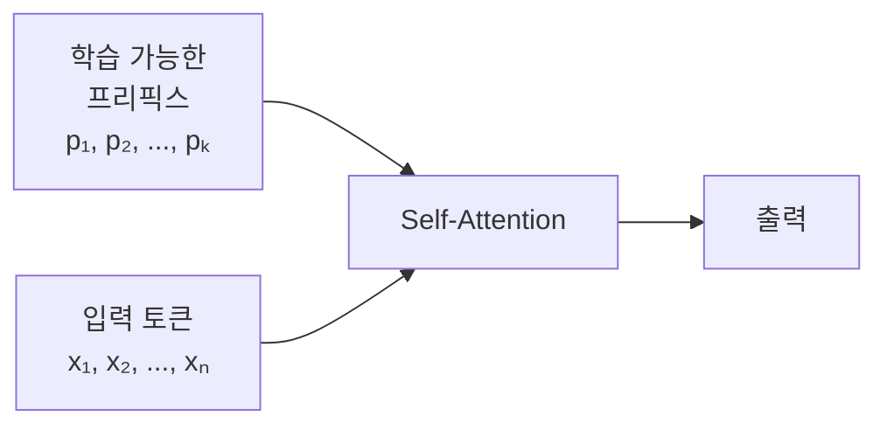

## 10주차 A회차: 모델 경량화와 효율적 튜닝 — PEFT, LoRA, QLoRA

> **미션**: 수업이 끝나면 LLM 경량화 기법의 전체 지형을 이해하고, QLoRA로 거대 모델을 8GB GPU에서 파인튜닝할 수 있다

### 학습목표

이 회차를 마치면 다음을 수행할 수 있다:

1. LLM의 크기/비용 문제를 설명하고, 경량화 기법(가지치기, 양자화, 지식 증류)의 원리와 차이를 이해한다
2. PEFT의 핵심 아이디어를 이해하고, Adapter, Prefix Tuning, Prompt Tuning의 차이점을 설명할 수 있다
3. LoRA의 저랭크 분해 방식이 왜 효율적인지 수학적·직관적으로 이해한다
4. QLoRA의 양자화 기법(4-bit, NF4, Double Quantization)을 이해한다
5. 태스크와 자원 조건에 따라 적절한 경량화-튜닝 전략을 선택할 수 있다

---

### 오늘의 질문 + 빠른 진단

**오늘의 질문**: "70억 개 파라미터를 가진 LLM이 있다. 이 모델을 (1) 더 작고 빠르게 만들거나, (2) 적은 메모리로 파인튜닝하거나, (3) 둘 다 하고 싶다면 — 어떤 방법들이 있을까?"

**빠른 진단 (1문항)**:

Llama 70B 모델의 파라미터 하나(float32)가 차지하는 메모리는 약 4바이트이다. 파라미터 70억 개를 저장하려면 대략 몇 GB가 필요할까? (역전파를 위한 그래디언트 저장도 포함하면?)

① 약 28GB
② 약 56GB (파라미터) + 56GB (그래디언트) = 112GB
③ 약 28GB (파라미터) + 28GB (그래디언트) = 56GB
④ 약 14GB

정답: **② (총 112GB 이상)**

이 때문에 Full Fine-tuning은 대규모 GPU 클러스터가 필요하다. 하지만 오늘 배울 **경량화 기법**과 **PEFT/LoRA/QLoRA**를 사용하면 이 문제를 해결할 수 있다.

---

### 이론 강의

#### 10.1 LLM의 크기 문제와 경량화 개요

##### 왜 경량화가 필요한가

최근 언어모델은 급격히 커졌다. BERT-Base(1.1억)에서 GPT-3(1,750억), GPT-4(추정 1조 이상)까지 — 모델이 클수록 성능은 좋지만 비용도 급증한다:

- **메모리**: Llama 70B를 Full Fine-tuning하면 모델(280GB) + 옵티마이저(560GB) + 그래디언트(280GB) = **1,120GB** 이상 필요
- **비용**: GPT-3 학습에만 약 450만 달러 소요
- **속도**: 파라미터가 많을수록 추론과 학습 모두 느려진다
- **배포**: 수백 GB 모델은 모바일·엣지 기기에 올릴 수 없다

이 문제를 해결하는 경량화 접근은 크게 **네 가지 축**으로 나뉜다:

**표 10.1** 경량화 접근법의 네 축

| 축 | 방법 | 핵심 아이디어 | 대표 기법 |
|----|------|-------------|----------|
| 크기 줄이기 | 가지치기(Pruning) | 불필요한 파라미터를 제거 | SparseGPT, Magnitude Pruning |
| 정밀도 줄이기 | 양자화(Quantization) | 파라미터의 비트 수를 낮춤 | NF4, GPTQ, AWQ |
| 지식 옮기기 | 지식 증류(Distillation) | 큰 모델의 지식을 작은 모델로 전달 | DistilBERT, TinyLlama |
| 학습 효율화 | PEFT | 소수 파라미터만 학습 | LoRA, Adapter, Prefix Tuning |

이 장에서는 네 축을 모두 개관한 뒤, 실습에서 직접 사용할 **PEFT + 양자화의 결합(QLoRA)**을 깊이 다룬다.

##### 가지치기 (Pruning)

**직관적 이해**: 정원사가 나무의 죽은 가지를 잘라내도 나무는 건강하게 자란다. 마찬가지로 신경망에서 중요도가 낮은 연결(가중치)을 제거해도 모델 성능은 대부분 유지된다.

가지치기는 두 가지 방식으로 나뉜다:

| 방식 | 제거 단위 | 압축률 | 실제 속도 향상 | 난이도 |
|------|----------|--------|-------------|--------|
| **비정형(Unstructured)** | 개별 가중치를 0으로 | 높음 (70~90%) | 낮음 (희소 행렬 하드웨어 필요) | 낮음 |
| **정형(Structured)** | 뉴런·어텐션 헤드·층 단위 | 중간 (30~50%) | 높음 (표준 하드웨어에서 즉시) | 높음 |

> **대표 사례**: **SparseGPT**(Frantar & Alistarh, 2023)는 LLM에 대해 1회 패스만으로 비정형 가지치기를 수행한다. 60% 가중치를 제거해도 perplexity 저하가 거의 없다.

**한계**: 가지치기 후 재학습(fine-tuning)이 필요한 경우가 많고, 과도하게 제거하면 성능이 급락한다. 또한 비정형 가지치기는 희소 행렬 연산을 지원하는 특수 하드웨어 없이는 실제 추론 속도가 개선되지 않는다.

##### 지식 증류 (Knowledge Distillation)

**직관적 이해**: 베테랑 교수(Teacher)가 20년간 쌓은 경험을 신입 조교(Student)에게 핵심만 가르친다. 조교는 교수의 모든 지식을 갖추진 못하지만, 핵심 판단력은 빠르게 습득한다.

지식 증류의 핵심은 **소프트 타겟(Soft Target)**이다. 일반 학습에서는 "정답은 고양이"라는 하드 라벨만 사용하지만, 증류에서는 Teacher 모델이 출력한 확률 분포 전체를 Student에게 전달한다:

- **하드 라벨**: [고양이: 1, 개: 0, 표범: 0]
- **소프트 타겟**: [고양이: 0.7, 표범: 0.2, 개: 0.1] — "고양이와 표범이 비슷하다"는 암묵적 지식 포함

Student 모델의 손실 함수:

**L = α × L_hard + (1−α) × T² × KL(p_Teacher ∥ p_Student)**

여기서 T는 Temperature(소프트 타겟을 얼마나 부드럽게 할지), α는 두 손실의 비중이다.

> **대표 사례**:
> - **DistilBERT**(Sanh et al., 2019): BERT의 40%로 압축하면서 성능 97% 유지
> - **TinyLlama**: 1.1B 파라미터로 Llama-2 7B의 지식을 증류, 소형 기기 배포 가능

**한계**: Teacher 모델을 먼저 학습해야 하므로 전체 비용이 추가된다. 또한 Teacher와 Student의 아키텍처가 크게 다르면 지식 전달 효율이 떨어진다.

---

#### 10.2 PEFT: Parameter-Efficient Fine-Tuning

앞서 살펴본 가지치기·양자화·지식 증류가 **모델 자체를 작게** 만드는 방법이라면, PEFT는 **학습해야 할 파라미터를 작게** 만드는 접근이다. 모델의 핵심 기능(언어 이해, 지식)은 사전학습에서 이미 습득했으므로, 파인튜닝은 특정 태스크에 적응시키는 미세 조정일 뿐이다. 작은 추가 파라미터만 학습해도 충분하다.

##### PEFT: Parameter-Efficient Fine-Tuning

**PEFT(Parameter-Efficient Fine-Tuning)**는 다음 핵심 아이디어에 기반한다:

> "모델의 대부분 파라미터는 고정시키고, **소수의 추가 파라미터만 학습**하는 방식으로 메모리를 극적으로 절약할 수 있다"

PEFT 계열에는 여러 방법이 있다:

**표 10.2** PEFT 방법 비교

| 방법          | 추가 파라미터 | 원리                                 | 메모리 절약 |
| ------------- | ------------- | ------------------------------------ | ----------- |
| Adapter       | 0.4~2%        | 각 층 후에 병렬 모듈 추가            | 약 90%      |
| Prefix Tuning | 0.1%          | 입력 토큰 앞에 학습 가능한 벡터 추가 | 약 95%      |
| Prompt Tuning | 0.01%         | Soft prompt만 학습                   | 약 99%      |
| LoRA          | 0.1%          | 가중치 변화를 저랭크 분해로 근사     | 약 99%      |

이들의 **공통점**은 "원본 모델은 건드리지 않고, **추가 파라미터만 학습**한다"는 것이다. **차이점**은 어디에 추가하고, 어떻게 추가하느냐이다.

##### Adapter Layers: 병렬 경로

**Adapter**는 가장 직관적인 방법이다. 각 Transformer 블록의 Multi-Head Attention과 FFN 후에 작은 병렬 모듈을 붙인다.


**그림 10.1** Adapter 구조 (병렬 경로)

Adapter 모듈은 **좁혔다가 다시 넓히는** 두 단계로 구성된다:

```
입력 → [좁히기: d → r] → [활성화] → [넓히기: r → d] → 원본 입력과 더하기 → 출력
```

- **좁히기(down)**: 입력 차원(d)을 작은 차원(r)으로 압축. 예: 768 → 64
- **활성화(ReLU)**: 비선형성을 추가해 단순 선형 변환보다 표현력을 높임
- **넓히기(up)**: 다시 원래 차원(d)으로 복원. 예: 64 → 768
- **잔차 연결**: 압축-복원을 거친 결과와 원래 입력을 더함 → 원본 정보를 보존하면서 보정값만 추가

**직관적 이해**: Adapter는 원본 도로(Attention 출력)를 그대로 두고, 옆에 작은 샛길(adapter)을 붙이는 것과 같다. 차량(정보)은 메인 도로를 갈 수도, 샛길을 갈 수도 있다.

**왜 효율적인가?** r이 작을수록(예: 64) 원본 가중치 크기(768×768)에 비해 훨씬 적은 파라미터만 추가된다. 전체 모델 파라미터 대비 약 **3~5% 수준**의 파라미터만 학습하면 된다.

> **쉽게 말해서**: "원본 도로는 그대로 두고, 작은 샛길을 붙여 선택적으로 정보를 보정한다"는 뜻이다.

> **실제 활용 사례**
> - **Google(2019)**: BERT에 Adapter를 붙여 GLUE 벤치마크 22개 태스크를 단일 모델로 처리. Full Fine-tuning 대비 파라미터 3.6% 추가로 97% 수준의 성능 달성.
> - **의료 NLP**: 공개 BERT 모델에 Adapter를 붙여 병원별 진단 기록(EHR) 도메인에 적응. 병원이 바뀌면 Adapter만 교체하면 되므로 데이터 보안 유지에 유리.
> - **다국어 서비스**: 하나의 다국어 모델(mBERT)에 언어별 Adapter를 붙여 언어 전용 특성을 추가. 새 언어 지원 시 Adapter만 추가.

##### Prefix Tuning: 프리픽스 벡터

**Prefix Tuning**은 다른 접근이다. Transformer의 Self-Attention 입력에 학습 가능한 벡터 토큰들을 **프리픽스**로 앞에 붙인다.



**그림 10.2** Prefix Tuning 구조

프리픽스는 Self-Attention에서 Key와 Value 앞에 붙는다. 즉, 모델이 "질문(Q)"을 처리할 때 프리픽스를 참고자료처럼 함께 살펴보게 된다. 추가 파라미터 수는 프리픽스 길이와 모델 층 수에 비례하지만, 전체 모델 대비 매우 소량(약 0.1%)이다.

**직관적 이해**: Prefix Tuning은 "수학 시험을 볼 때, 허용된 참고자료(프리픽스)를 먼저 준 뒤, 시험자의 배경지식(원본 모델)은 그대로 두고 참고자료를 활용해서 답하도록 하는 것"과 같다.

**그래서 무엇이 달라지는가?** Adapter는 매 단계마다 추가 계산을 하므로 약간의 레이턴시 증가가 있다. Prefix Tuning은 프리픽스 벡터만 앞에 붙이므로 추론 속도가 원본 모델과 비슷하다 (더 긴 시퀀스 처리만 필요).

> **실제 활용 사례**
> - **요약 생성**: GPT-2에 Prefix를 추가해 "뉴스 요약", "학술 요약", "법률 요약" 태스크 전용 프리픽스를 각각 학습. 요약 스타일을 프리픽스 교체만으로 전환.
> - **표 → 텍스트**: 데이터베이스 테이블을 자연어 설명으로 변환하는 태스크에서 Prefix Tuning이 Full Fine-tuning에 근접한 성능을 0.1% 파라미터로 달성.
> - **코드 생성 스타일 제어**: 동일 모델에 Python용/JS용 프리픽스를 따로 학습해 언어별 코딩 스타일을 제어.

##### Prompt Tuning: 소프트 프롬프트

**Prompt Tuning**은 더 간단하다. 입력 임베딩 전에 **소프트 프롬프트(Soft Prompt)**라는 학습 가능한 벡터를 추가한다:

```
Input = Concat(soft_prompt, original_input_embeddings)
```

프롬프트는 단어 형태가 아니라 **연속 벡터**이므로, 인간이 읽을 수 없다. 하지만 모델은 이해한다.

예를 들어, 입력이 "이 영화는"이고 소프트 프롬프트가 4개 토큰이라면:

```
[soft_prompt_1, soft_prompt_2, soft_prompt_3, soft_prompt_4, 이, 영, 화, 는, ...]
```

추가 파라미터: 프롬프트 길이 k × d차원

**직관적 이해**: "손님이 식당에 들어올 때, 하루 메뉴(소프트 프롬프트)를 먼저 보여주고, 그 상황에서 주문(입력)을 받는 것"과 같다. 메뉴 정보가 손님의 선택에 영향을 미친다.

> **실제 활용 사례**
> - **Google T5(2022)**: 수십 개의 분류·생성 태스크에 소프트 프롬프트만 학습해 태스크별 Full Fine-tuning 수준의 성능 달성. 모델 본체는 공유.
> - **API 기반 서비스**: 모델 가중치에 접근할 수 없는 상황(예: GPT API 사용)에서도 입력 앞에 학습된 소프트 프롬프트를 추가해 도메인 특화 적응.
> - **개인화 추천**: 사용자별 소프트 프롬프트를 학습해 동일 모델이 각 사용자의 취향에 맞는 응답 생성.

**표 10.3** Adapter vs Prefix Tuning vs Prompt Tuning 비교

| 특성             | Adapter   | Prefix   | Prompt    |
| ---------------- | --------- | -------- | --------- |
| 추가 파라미터    | 0.4~2%    | 0.1~0.5% | 0.01~0.1% |
| 추론 레이턴시    | 약간 증가 | 무증가   | 무증가    |
| 새 태스크 적응성 | 중간      | 좋음     | 보통      |
| 구현 복잡도      | 중간      | 높음     | 낮음      |

---

#### 10.3 LoRA: 저랭크 어댑테이션의 수학과 직관

##### 왜 LoRA가 효율적인가?

**LoRA(Low-Rank Adaptation)** (Hu et al., 2021)는 가장 인기 있는 PEFT 방법이다. 이유는 **간단하면서도 강력**하기 때문이다.

**핵심 아이디어**: 원본 가중치 W는 고정하고, 학습 중에 변화분(ΔW)만 A와 B라는 두 개의 좁은 행렬로 표현한다:

**ΔW = A × B**

즉, 파인튜닝 후 최종 가중치는:

**W' = W + A × B**

**직관적 이해**: "눈이 나쁜 사람이 안경을 쓰면, 눈의 구조를 수술하지 않아도 시력이 개선된다"는 비유이다. 거대 모델(눈)의 내부 구조는 건드리지 않고, 작은 어댑터(안경 = A×B)로 입출력을 보정한다.

더 구체적으로는, 모델의 **표현력 손실이 제한된 부분공간에 주로 일어난다**는 경험적 관찰에 기반한다. 즉:

> "파인튜닝 과정에서 일어나는 파라미터 변화는 대부분 저랭크 구조를 가진다"

이를 실제로 확인한 결과가 있다. 다음은 BERT 모델을 특정 태스크로 파인튜닝했을 때, 파라미터 변화 행렬의 특이값 분포이다:

```
특이값 순위  | 특이값 크기 | 누적 설명 비율
1           | 2.85      | 15.8%
2           | 2.41      | 28.2%
3           | 1.94      | 37.4%
...
10          | 0.82      | 63.5%
...
100         | 0.15      | 91.2%
```

전체 768개의 특이값 중 **상위 16개만 사용해도 전체 분산의 90% 이상을 설명**할 수 있다. 따라서 r=16 정도면 충분하다.

##### LoRA의 파라미터 절감 효과

Full Fine-tuning은 모든 파라미터의 변화를 직접 계산·저장해야 한다. LoRA는 A와 B만 업데이트하므로 학습해야 할 파라미터 수가 극적으로 줄어든다.

구체적인 예로, 한 층의 가중치 크기가 4,096 × 4,096이고 r=8이면:

```
Full Fine-tuning:  4,096 × 4,096 = 16,777,216개
LoRA (A + B):      8 × (4,096 + 4,096) = 65,536개
절감율: 약 99.6%
```

> **쉽게 말해서**: 거대한 정사각형 행렬 대신, 두 개의 "얇고 긴" 행렬만 학습하면 99%의 계산을 생략할 수 있다는 뜻이다. 학습 속도도 그만큼 빨라진다.

> **실제 활용 사례**
> - **Meta(2023) — LLaMA 계열**: LoRA가 사실상 표준이 됨. Alpaca, Vicuna, WizardLM 등 오픈소스 명령 수행 모델 대부분이 LoRA로 7B~65B 모델을 단일 GPU에서 파인튜닝.
> - **의료 AI**: 공개 LLM에 의료 문헌·임상 데이터로 LoRA를 학습해 진단 보조·처방 검토 모델 구축. 병원 서버에서 전체 모델 재학습 없이 LoRA 가중치만 교체.
> - **기업 고객 지원**: 콜센터 로그·FAQ 데이터로 LLM에 LoRA를 적용해 브랜드/제품 특화 응답 생성. 신제품 출시 시 LoRA만 재학습.
> - **이미지 생성(Stable Diffusion)**: 특정 화풍·인물·제품의 LoRA를 학습해 Stable Diffusion에 삽입. 원본 모델은 공유, LoRA만 수십 MB 단위로 배포.

##### LoRA 하이퍼파라미터 요약

**초기값**: A는 가우시안, B는 **0으로 초기화**한다. B=0이면 학습 시작 시 ΔW=0 → 원본 모델과 동일한 상태에서 안정적으로 출발한다.

**Rank(r)**: r이 클수록 표현력↑ · 메모리↑. 대부분의 태스크에서 **r=16**이 출발점으로 적합하다. 감정분석 같은 단순 분류는 r=8, 새로운 언어·도메인 적응에는 r=64 이상을 고려한다.

**lora_alpha**: 어댑터 출력의 강도 조절. **lora_alpha = r × 2** (예: r=16 → alpha=32)가 일반적인 안정 설정이다.

---

#### 10.4 양자화와 QLoRA

##### Full Precision vs Quantization

10.1에서 경량화의 네 축을 소개했다. 가지치기가 불필요한 파라미터를 **제거**한다면, 양자화는 남은 파라미터의 **정밀도를 낮추는** 방식이다.

**양자화(Quantization)**는 높은 정밀도(float32)를 낮은 정밀도(int8, int4)로 변환하는 기법이다.

> **직관적 이해**: 자(ruler)를 생각해 보자. float32는 1mm 눈금의 긴 자 — 정밀하지만 크고 무겁다. int4는 손가락으로 대충 재는 것 — 정밀도는 떨어지지만 거의 공간을 차지하지 않는다. 딥러닝 모델은 약간의 부정확성에 강하므로, "대충 재도" 성능은 거의 유지된다.

**표 10.4** 정밀도별 메모리 사용 (70B 모델 기준)

| 정밀도  | 메모리 | 상대값 | 자 비유         | 정확도 손실      |
| ------- | ------ | ------ | --------------- | ---------------- |
| float32 | 280GB  | 1×     | 정밀 자 (1mm)   | 없음 (기준)      |
| float16 | 140GB  | 0.5×   | 보통 자 (5mm)   | 거의 없음        |
| int8    | 70GB   | 0.25×  | 줄자 (1cm)      | 약간 있음        |
| int4    | 35GB   | 0.125× | 손가락 (대충)   | 있지만 용인 가능 |

**그래서 무엇이 달라지는가?** float32로는 불가능하던 70B 모델(280GB 필요)이, int4 양자화로는 **35GB만으로도 메모리에 올릴 수 있다**. 하지만 4비트로 16개 값만 표현하면 정보 손실이 크지 않을까?

##### 4-bit 양자화의 원리

4-bit 정수는 -8부터 7까지 16개 값(또는 0부터 15까지)만 표현할 수 있다. 그런데 원본 가중치는 -2~2 범위에 분포한다. **어떻게 범위를 맞추는가?** 원본 가중치(예: -0.8 ~ 1.9)의 범위를 4-bit가 표현할 수 있는 16개 값(0~15)에 균등하게 대응시킨다. 그리고 사용할 때는 다시 원래 범위로 복원한다.

구체적인 예:

```
원본 값: [0.5, 1.2, -0.8, 1.9, 0.1]
최소값: -0.8, 최대값: 1.9, 범위: 2.7

양자화 후: [13, 15, 0, 15, 6]  (4-bit 정수)

역양자화:
- 13 / 15 × 2.7 + (-0.8) = 0.576
- 15 / 15 × 2.7 + (-0.8) = 1.9
- 0 / 15 × 2.7 + (-0.8) = -0.8
- 15 / 15 × 2.7 + (-0.8) = 1.9
- 6 / 15 × 2.7 + (-0.8) = 0.282
```

정보 손실은 있지만, 모델의 전체 성능에는 영향을 거의 미치지 않는다. 오케스트라에서 바이올린 연주자 한 명이 음을 0.01초 늦게 연주해도 전체 하모니는 변하지 않는 것과 같다. 양자화는 "연주자를 없애는 것(가지치기)"이 아니라 "약간 부정확하게 연주하도록 하는 것"이다.

##### NF4 (Normalized Float 4-bit)

일반 4-bit 양자화는 16개의 값(칸)을 **균등하게** 나눠 배치한다. 그런데 신경망 가중치는 0 근처에 몰려 있고 큰 값은 드물다. 균등 배치는 자주 등장하는 값(0 근처)은 구분이 거칠고, 드문 극단값에는 칸이 낭비된다.

> **비유**: 주차장 100칸을 만들 때, 출구 근처(자주 쓰는 곳)에 1칸, 구석(거의 안 쓰는 곳)에 99칸을 배치하면 비효율적이다. 자주 쓰는 곳에 칸을 더 많이 몰아줘야 한다.

**NF4(Normalized Float 4-bit)**는 이 문제를 해결한다. 가중치가 0 근처에 많이 분포한다는 사실을 활용해, **0 근처에 칸을 촘촘하게, 극단값 쪽에는 드물게** 배치한다.

**그래서 무엇이 달라지는가?** 같은 16칸이지만 자주 등장하는 값을 더 세밀하게 표현할 수 있어, 일반 4-bit보다 정보 손실이 줄어든다.

##### Double Quantization

양자화를 할 때는 원본 가중치의 범위를 기록해 두는 **기준값**이 필요하다. 나중에 복원할 때 "원래 값이 어느 범위였는지" 알아야 하기 때문이다. 그런데 이 기준값 자체도 메모리를 차지한다.

**Double Quantization(이중 양자화)**은 이 기준값까지 한 번 더 압축한다.

> **비유**: 짐을 상자에 넣어 압축했다. 그런데 상자의 겉면에 붙인 라벨(기준값)도 꽤 크다. 라벨도 축소 인쇄하면 공간을 더 아낄 수 있다.

결과적으로 70B 모델 기준 약 35GB에서 **18GB 수준으로 메모리를 추가로 줄일 수 있다**.

##### bitsandbytes 라이브러리

**bitsandbytes**는 GPU에서 효율적인 4-bit 연산을 구현한 라이브러리이다. 낮은 정밀도 모델의 역전파도 안정적으로 처리한다.

```python
import torch
from transformers import AutoModelForCausalLM
from bitsandbytes.nn import Linear4bit

# 4-bit 로딩
model = AutoModelForCausalLM.from_pretrained(
    "meta-llama/Llama-2-70b",
    load_in_4bit=True,
    bnb_4bit_compute_dtype=torch.bfloat16,
    bnb_4bit_use_double_quant=True,
    bnb_4bit_quant_type="nf4",
    device_map="auto"
)
```

이 설정은:

- **load_in_4bit=True**: 4-bit 양자화 로딩
- **bnb_4bit_compute_dtype**: 연산 시 사용할 정밀도 (bfloat16)
- **bnb_4bit_use_double_quant=True**: Double Quantization 활성화
- **bnb_4bit_quant_type="nf4"**: NF4 양자화 사용
- **device_map="auto"**: GPU/CPU 자동 배치

이렇게 로딩하면 70B 모델이 약 15~20GB 메모리만 필요하다.

##### QLoRA: 양자화 + LoRA의 결합

**QLoRA(Quantized LoRA)**는 **양자화 + LoRA**를 결합한다:

1. **모델 가중치**: 4-bit NF4로 양자화 (원본 모델은 고정)
2. **LoRA 어댑터**: 전체 정밀도(float32 또는 bfloat16)로 학습
3. **역전파**: 4-bit 모델과 LoRA 어댑터를 통해 역전파 계산

**메모리 구성**:

```
모델 가중치 (4-bit):     14GB (70B 모델)
LoRA 어댑터 (bfloat16):  1GB  (r=16인 경우)
옵티마이저 상태:          2GB  (Adam의 m, v)
그래디언트 (bfloat16):   1GB

총합: 약 18GB
```

비교:

- Full Fine-tuning: 1,120GB 이상
- QLoRA: 18GB
- **메모리 절감: 60배 이상**

> **실제 활용 사례**
> - **단일 소비자 GPU 파인튜닝**: RTX 3090(24GB) 1대로 LLaMA-2 65B 모델을 파인튜닝. QLoRA 없이는 A100 80GB 4대가 필요했던 작업.
> - **연구실·스타트업 LLM 개발**: QLoRA 논문(Dettmers et al., 2023) 발표 이후 고사양 클라우드 없이도 70B급 모델 커스터마이징이 가능해져, 소규모 팀의 LLM 연구 진입장벽이 크게 낮아짐.
> - **엣지 디바이스 배포**: 4-bit 양자화된 모델을 스마트폰·임베디드 장치에서 구동. Qualcomm·Apple Silicon에서 7B 모델 로컬 추론 가능.
> - **한국어 특화 모델(EXAONE, HyperCLOVA X)**: 한국어 데이터로 QLoRA를 적용해 영어 중심 베이스 모델을 한국어 태스크에 특화.

##### QLoRA 주요 설정값 가이드

QLoRA를 실제로 쓸 때 조절해야 하는 설정값은 크게 세 가지이다.

**① target_modules — LoRA를 어느 층에 붙일 것인가?**

Transformer 안에는 수십 개의 층이 있는데, 모든 층에 LoRA를 붙이면 파라미터가 늘어난다. 보통 **Attention의 Query(q)와 Value(v) 두 곳**에만 붙여도 충분하다.

> **비유**: 100개 사무실이 있는 빌딩에서, 핵심 회의실 2곳만 리모델링해도 업무 효율이 충분히 오른다.

| 선택 범위 | 설정값 예시 | 특징 |
|---|---|---|
| 최소 (권장 시작점) | `["q_proj", "v_proj"]` | 가장 가볍고 빠름 |
| 중간 | `["q_proj", "k_proj", "v_proj", "out_proj"]` | 균형잡힌 성능 |
| 최대 | Attention + FFN 전체 | 성능 최고, 메모리 많이 사용 |

**② lora_alpha — 어댑터를 얼마나 강하게 적용할 것인가?**

원본 모델과 LoRA 어댑터의 영향력 비율을 조절한다. **lora_alpha = r × 2** 공식(예: r=16이면 alpha=32)이 대부분의 경우에 잘 작동한다.

**③ lora_dropout — 과적합 방지**

학습 중 일부 연결을 무작위로 끊어 모델이 훈련 데이터에만 지나치게 맞춰지는 것을 방지한다. **0.05** (5%)가 일반적인 출발점이다.

```python
lora_config = LoraConfig(
    r=16,
    lora_alpha=32,                          # r의 2배
    target_modules=["q_proj", "v_proj"],   # 권장 시작점
    lora_dropout=0.05,
    task_type="CAUSAL_LM"
)
```

##### Gradient Checkpointing — 메모리 절약의 마지막 수단

학습 중에는 "어디서 실수했는지 추적"하기 위해 중간 계산 결과를 모두 메모리에 보관해야 한다. 모델이 클수록 이 중간 기록이 방대해진다.

**Gradient Checkpointing**은 이 중간 기록을 **저장하지 않고 필요할 때 다시 계산**한다. 메모리를 30~50% 아끼는 대신, 계산을 약 20% 더 한다. 메모리가 빠듯할 때 켜는 옵션이다.

> **비유**: 시험 답안을 중간 과정 없이 최종 답만 써두는 것. 나중에 검토할 때 처음부터 다시 풀어야 하지만, 공책(메모리)은 훨씬 덜 쓴다.

```python
model.gradient_checkpointing_enable()
```

또는 학습 설정:

```python
training_args = TrainingArguments(
    gradient_checkpointing=True,
    ...
)
```

---

#### 10.5 실무 적용 선택 가이드

지금까지 배운 기법들을 실무에서 어떻게 선택해야 할까? 핵심은 **목적과 자원 제약**에 따라 달라진다.

**표 10.5** 상황별 추천 전략

| 상황 | 추천 기법 | 이유 |
|------|----------|------|
| GPU 메모리 부족 + 파인튜닝 필요 | **QLoRA** | 4-bit 양자화 + LoRA로 8GB GPU에서도 가능 |
| 추론 속도/비용 절감 | **Pruning + Quantization** | 모델 자체를 작게 만들어 서빙 비용 감소 |
| 고성능 소형 모델 필요 | **Knowledge Distillation** | Teacher의 지식을 작은 Student로 전달 |
| 동일 모델로 다중 태스크 서빙 | **LoRA / Adapter** | 기본 모델 공유, 어댑터만 교체 |
| 리소스 무제한, 최고 성능 | **Full Fine-tuning** | 모든 파라미터를 직접 업데이트 |
| 엣지/모바일 배포 | **Quantization + Distillation** | 크기와 정밀도 모두 축소 |

> **실무 팁**: 방법들은 배타적이지 않다. 예를 들어 QLoRA로 파인튜닝한 뒤, 배포 시에는 추가로 Pruning이나 정적 양자화를 적용할 수 있다. 최근 트렌드는 여러 기법을 **조합**하는 것이다.

---

#### 10.6 향후 발전 방향

경량화와 효율적 튜닝은 빠르게 발전하고 있다. 주목할 기법들:

- **AdaLoRA** (Zhang et al., 2023): 모든 층에 동일한 rank를 쓰는 대신, 중요한 층에는 높은 rank, 덜 중요한 층에는 낮은 rank를 **동적으로** 할당한다. LoRA 대비 같은 파라미터 예산에서 성능이 향상된다.

- **UniPELT**: Adapter + Prefix Tuning + LoRA를 통합하고, 게이트 메커니즘으로 각 방법의 기여를 자동 조절한다. 어떤 PEFT 방법이 좋을지 모를 때 유용하다.

- **SparseGPT + LoRA**: 가지치기와 LoRA를 결합한다. 먼저 SparseGPT로 모델을 희소화한 뒤, LoRA로 성능을 회복한다. 크기 절감과 태스크 적응을 동시에 달성한다.

- **GPTQ / AWQ**: 가중치 전용 양자화의 진화. 3-bit, 2-bit까지 내려가면서도 성능 저하를 최소화한다. bitsandbytes와 함께 양자화의 양대 축이다.

> **한 줄 정리**: 경량화의 방향은 "하나의 기법"에서 "**여러 기법의 조합**(Pruning + LoRA + Quantization)"으로 이동하고 있다.

---

### 라이브 코딩 시연

> **학습 가이드**: 한국어 모델(polyglot-ko-1.3b)을 KoAlpaca 데이터로 Instruction Tuning한다. 파인튜닝 **전후 동일 질문에 대한 응답 변화**를 직접 확인한다. 실습 스크립트(`practice/chapter10/code/10-1-qlora파인튜닝.py`)가 환경 감지부터 학습, Before/After 비교까지 자동으로 진행한다.

**실습 환경 및 데이터**

| 항목 | 내용 |
|------|------|
| **실습 모델** | `EleutherAI/polyglot-ko-1.3b` (한국어 전용 GPT-NeoX, fp16 ~2.6GB) |
| **학습 데이터** | `beomi/KoAlpaca-v1.1a` 500개 샘플 (한국어 Instruction, Apache-2.0) |
| **출력 위치** | `practice/chapter10/data/output/` (Before/After 비교, 메모리 차트, LoRA 어댑터) |
| **Windows** | NVIDIA RTX 4060(8GB)+ → **QLoRA** (4-bit 양자화 + LoRA) |
| **macOS** | Apple Silicon → **LoRA** (float16, 양자화 없음) |

> **주의**: 첫 실행 시 모델(~2.6GB)과 데이터 다운로드가 필요하다. 이후 HuggingFace 캐시(`~/.cache/huggingface/`)에서 재사용된다.

**실습 스크립트의 자동 환경 구성**

스크립트가 Phase 1을 자동 수행한다. 수동 설치 없이 실행만 하면 된다:

1. **하드웨어 감지**: NVIDIA GPU / Apple MPS / CPU 자동 탐지
2. **CUDA 자동 설치**: NVIDIA GPU 사용 시, 드라이버에 맞는 PyTorch+CUDA pip 설치
3. **라이브러리 자동 설치**: peft, bitsandbytes(CUDA 전용), accelerate, datasets 자동 설치

**[단계 1] 모델 로딩 (플랫폼 적응)**

```python
from transformers import AutoModelForCausalLM, AutoTokenizer, BitsAndBytesConfig

model_name = "EleutherAI/polyglot-ko-1.3b"

# NVIDIA GPU: 4-bit QLoRA
bnb_config = BitsAndBytesConfig(
    load_in_4bit=True,
    bnb_4bit_quant_type="nf4",
    bnb_4bit_compute_dtype=torch.bfloat16,
    bnb_4bit_use_double_quant=True,
)
model = AutoModelForCausalLM.from_pretrained(
    model_name, quantization_config=bnb_config, device_map="auto"
)

# Apple Silicon: float16 LoRA (양자화 없음)
# model = AutoModelForCausalLM.from_pretrained(
#     model_name, torch_dtype=torch.float16
# ).to("mps")
```

**[단계 2] Before — 파인튜닝 전 추론**

```python
tokenizer = AutoTokenizer.from_pretrained(model_name)
tokenizer.pad_token = tokenizer.eos_token

# Instruction 형식으로 질문
prompt = "### 질문: 인공지능이 우리 생활에 미치는 영향을 설명해주세요.\n\n### 답변: "
inputs = tokenizer(prompt, return_tensors="pt").to(model.device)
output = model.generate(**inputs, max_new_tokens=80, temperature=0.7)
print(tokenizer.decode(output[0], skip_special_tokens=True))
```

베이스 모델은 Instruction 형식을 이해하지 못해 질문과 무관한 텍스트를 생성한다.

**[단계 3] LoRA 설정 + KoAlpaca 데이터 준비**

```python
from peft import LoraConfig, get_peft_model
from datasets import load_dataset

# GPT-NeoX는 QKV가 융합되어 있으므로 query_key_value에 적용
lora_config = LoraConfig(
    r=16,
    lora_alpha=32,
    target_modules=["query_key_value"],
    lora_dropout=0.05,
    task_type="CAUSAL_LM",
)
model = get_peft_model(model, lora_config)
model.print_trainable_parameters()

# KoAlpaca 한국어 Instruction 데이터 로딩
dataset = load_dataset("beomi/KoAlpaca-v1.1a", split="train")
dataset = dataset.shuffle(seed=42).select(range(500))

def format_and_tokenize(example):
    text = f"### 질문: {example['instruction']}\n\n### 답변: {example['output']}{tokenizer.eos_token}"
    return tokenizer(text, truncation=True, max_length=256, padding="max_length")

tokenized = dataset.map(format_and_tokenize, remove_columns=dataset.column_names)
```

> **참고**: `target_modules`가 `["q_proj", "v_proj"]`가 아닌 `["query_key_value"]`인 이유는 GPT-NeoX 아키텍처에서 Q, K, V 프로젝션이 하나의 행렬로 융합되어 있기 때문이다. 모델 아키텍처에 따라 target_modules가 달라진다.

**[단계 4] 학습 실행**

```python
training_args = TrainingArguments(
    output_dir="./lora_checkpoint",
    max_steps=20,
    per_device_train_batch_size=2,
    gradient_accumulation_steps=4,
    learning_rate=5e-4,
    bf16=True,  # macOS에서는 bf16=False
    gradient_checkpointing=True,
    seed=42,
)

trainer = Trainer(
    model=model,
    args=training_args,
    train_dataset=tokenized,
    data_collator=DataCollatorForLanguageModeling(tokenizer, mlm=False),
)
trainer.train()
```

**[단계 5] After — Before/After 비교**

동일한 질문으로 다시 추론하면, 모델이 Instruction 형식을 학습하여 구조화된 응답을 생성한다:

```
[질문] 인공지능이 우리 생활에 미치는 영향을 설명해주세요.

Before: (질문과 무관한 랜덤 한국어 텍스트)
After:  인공지능은 우리 생활에 다양한 영향을 미치고 있습니다. 첫째, ...
```

20 스텝만으로도 Instruction 형식 준수가 확인된다. 응답 품질을 높이려면 50~100 스텝으로 늘린다.

**핵심 인사이트**:

1. **Before/After 차이**: 베이스 모델은 한국어 생성만 할 수 있지만, KoAlpaca로 Instruction Tuning하면 질문-답변 형식을 학습한다.

2. **크로스 플랫폼**: Windows(QLoRA) / macOS(LoRA) 모두 동일한 파이프라인으로 실습 가능. 양자화 여부만 다르다.

3. **저장 효율성**: 1.3B 모델(2.6GB) 대비 LoRA 어댑터는 ~50MB. 여러 태스크의 어댑터를 교체하여 하나의 모델로 다중 서비스 가능.

4. **GPT-NeoX vs Llama**: 아키텍처에 따라 `target_modules`가 다르다. 실무에서는 모델의 레이어 이름을 확인하고 적절한 모듈을 선택해야 한다.

---

### 핵심 정리 + B회차 과제 스펙

#### 이 회차의 핵심 내용

- **경량화의 네 축**: LLM의 크기/비용 문제를 해결하는 방법은 가지치기(Pruning), 양자화(Quantization), 지식 증류(Knowledge Distillation), PEFT 네 가지로 분류된다.

- **가지치기(Pruning)**: 중요도가 낮은 가중치를 제거하여 모델을 압축한다. 비정형(개별 가중치)과 정형(뉴런·헤드 단위) 방식이 있다.

- **지식 증류(Knowledge Distillation)**: 큰 Teacher 모델의 소프트 타겟을 작은 Student 모델에 전달한다. DistilBERT는 BERT의 40%로 성능 97%를 유지한다.

- **Full Fine-tuning의 한계**: 70B 모델은 메모리만 1,000GB 이상이 필요하여 대규모 클러스터 없이는 불가능하다.

- **PEFT (Parameter-Efficient Fine-Tuning)**: 모델의 대부분 파라미터는 고정하고 소수 추가 파라미터만 학습하여 메모리를 90%~99% 절감한다. Adapter, Prefix Tuning, Prompt Tuning, LoRA 등이 있다.

- **LoRA (Low-Rank Adaptation)**: 파라미터 변화 ΔW를 저랭크 분해 AB로 표현한다. 전체 행렬 대신 두 개의 좁은 행렬만 학습하여 99.6% 파라미터를 생략하면서도 유사한 성능을 유지한다.

- **초기값의 중요성**: A는 가우시안 초기값, B는 0으로 초기화한다. 이렇게 하면 초기 ΔW=0이므로 안정적인 학습이 시작된다.

- **Rank 선택**: r=16, 32 정도가 대부분의 태스크에서 충분하다. 더 큰 rank는 소수의 성능 향상만 제공한다.

- **양자화 (Quantization)**: float32를 4-bit로 압축하여 메모리를 1/8로 줄인다. 정보 손실이 있지만 모델 성능에 미치는 영향은 최소화할 수 있다.

- **NF4와 Double Quantization**: NF4는 정규분포 기반의 4-bit 표현으로 정보 손실을 줄인다. Double Quantization은 스케일값까지 양자화하여 메모리를 추가로 절감한다.

- **bitsandbytes**: GPU에서 효율적인 4-bit 연산을 구현하는 라이브러리. load_in_4bit 옵션으로 간단히 사용할 수 있다.

- **QLoRA**: 양자화 + LoRA를 결합하여 메모리 사용을 극적으로 줄인다. 70B 모델을 8GB GPU에서도 파인튜닝할 수 있다.

- **target_modules**: LoRA를 적용할 층을 선택한다. Query와 Value 프로젝션만 선택해도 충분한 성능을 얻을 수 있다.

- **Gradient Checkpointing**: 메모리를 절약하면서 역전파 계산을 수행한다. 메모리-계산 간 트레이드오프를 제공한다.

- **실무 선택 가이드**: GPU 부족→QLoRA, 추론 속도→Pruning+Quantization, 소형 고성능→KD, 다중 태스크→LoRA/Adapter. 기법들은 조합하여 사용할 수 있다.

#### B회차 과제 스펙

**B회차 (90분) — 실습**: QLoRA/LoRA로 한국어 Instruction Tuning

**실습 환경**:

| 항목 | 내용 |
|------|------|
| 모델 | `EleutherAI/polyglot-ko-1.3b` (한국어 전용, 첫 실행 ~2.6GB 다운로드) |
| 데이터 | `beomi/KoAlpaca-v1.1a` 500개 샘플 (한국어 Instruction, Apache-2.0) |
| Windows | NVIDIA RTX 4060(8GB)+ → QLoRA (4-bit + LoRA) |
| macOS | Apple Silicon → LoRA (float16) |
| 실습 파일 | `practice/chapter10/code/10-1-qlora파인튜닝.py` |
| 출력 | `practice/chapter10/data/output/` (Before/After 비교, 차트, LoRA 어댑터) |

> 스크립트가 NVIDIA GPU / Apple MPS 감지 → 환경 자동 구성을 수행하므로, `python code/10-1-qlora파인튜닝.py` 만 실행하면 된다.

**과제 목표**:

- polyglot-ko-1.3b 모델을 KoAlpaca 데이터로 Instruction Tuning한다
- 파인튜닝 전후 동일 질문에 대한 응답 변화(Before/After)를 비교한다
- Full FT / LoRA / QLoRA의 메모리 사용량을 분석한다

**과제 구성** (3단계, 30~40분 완결):

- **체크포인트 1 (10분)**: 환경 구성 + 모델 로딩 + Before 추론 테스트
- **체크포인트 2 (15분)**: LoRA/QLoRA 설정 + KoAlpaca 파인튜닝 (20 step)
- **체크포인트 3 (10분)**: After 추론 + Before/After 비교 + 메모리 차트 분석

**제출 형식**:

- Before/After 비교 결과 (`data/output/before_after_comparison.txt`)
- 메모리 비교 그래프 (`data/output/memory_comparison.png`)
- 실험 결과 리포트 (Before/After 차이 분석, 메모리 사용량, 개선 제안)

**Copilot 활용 가이드**:

- 기본: "polyglot-ko-1.3b를 4-bit로 로딩하고 LoRA를 적용해줘"
- 심화: "rank를 8, 16, 32로 바꾸어 Before/After 품질을 비교해줘"
- 심화: "학습 스텝을 50, 100으로 늘리면 응답 품질이 어떻게 변하는지 실험해줘"
- 검증: "GPT-NeoX와 Llama 아키텍처에서 target_modules가 다른 이유를 설명해줘"

---

### Exit ticket

**문제 (1문항)**:

LoRA에서 B를 0으로 초기화하는 이유를 설명하시오.

① 수렴 속도를 높이기 위해
② 초기 ΔW = AB = 0이므로, 초기 성능이 원본 모델과 같아 안정적인 학습이 시작되기 위해
③ 메모리를 절약하기 위해
④ 기울기 폭발을 방지하기 위해

정답: **②**

**설명**: LoRA에서 A는 가우시안 분포로 초기화되지만, B는 반드시 0으로 초기화한다. 이렇게 하면 ΔW = A × 0 = 0이 되어, 파인튜닝 초기의 순전파가 원본 모델의 순전파와 정확히 같다.

이는 안정적인 학습을 보장한다. 왜냐하면:

1. 초기 손실이 원본 모델의 손실과 같으므로, 매우 높지 않다
2. 초기 그래디언트가 극단적이지 않다
3. 학습이 차근차근 ΔW를 증가시키면서 진행된다

만약 A와 B를 모두 무작위로 초기화하면 초기 손실이 매우 크고, 초기 그래디언트가 불안정해진다. 이는 학습 초반에 발산하거나 수렴 속도가 현저히 떨어질 수 있다.

---

## 더 알아보기

이 장의 내용을 더 깊이 학습하려면 다음 자료를 참고하라:

- Hu, J. et al. (2021). LoRA: Low-Rank Adaptation of Large Language Models. https://arxiv.org/abs/2106.09685
- Dettmers, T. & Zettlemoyer, L. (2023). QLoRA: Efficient Finetuning of Quantized LLMs. https://arxiv.org/abs/2305.14314
- PEFT 라이브러리 문서. https://huggingface.co/docs/peft
- bitsandbytes 라이브러리. https://github.com/TimDettmers/bitsandbytes

---

## 다음 장 예고

다음 주(11주차)에서는 파인튜닝된 모델을 실전에서 활용하는 핵심 기법인 **RAG(Retrieval-Augmented Generation)**를 다룬다. 모델이 학습하지 않은 최신 정보나 도메인 지식을 **검색을 통해 보강**하는 방법을 배운다.

---

## 참고문헌

1. Hu, J. et al. (2021). LoRA: Low-Rank Adaptation of Large Language Models. _arXiv_. https://arxiv.org/abs/2106.09685
2. Dettmers, T. et al. (2023). QLoRA: Efficient Finetuning of Quantized LLMs. _arXiv_. https://arxiv.org/abs/2305.14314
3. Dettmers, T. et al. (2022). 8-Bit Optimizers via Block-wise Quantization. _ICLR_. https://arxiv.org/abs/2110.02861
4. Houlsby, N. et al. (2019). Parameter-Efficient Transfer Learning for NLP. _ICML_. https://arxiv.org/abs/1902.00751
5. Li, X. L. & Liang, P. (2021). Prefix-Tuning: Optimizing Continuous Prompts for Generation. _ACL_. https://arxiv.org/abs/2101.00190
6. Lester, B. et al. (2021). The Power of Scale for Parameter-Efficient Prompt Tuning. _EMNLP_. https://arxiv.org/abs/2104.08691
7. Hinton, G. et al. (2015). Distilling the Knowledge in a Neural Network. _arXiv_. https://arxiv.org/abs/1503.02531
8. Sanh, V. et al. (2019). DistilBERT, a distilled version of BERT. _arXiv_. https://arxiv.org/abs/1910.01108
9. Frantar, E. & Alistarh, D. (2023). SparseGPT: Massive Language Models Can Be Accurately Pruned in One-Shot. _ICML_. https://arxiv.org/abs/2301.00774
