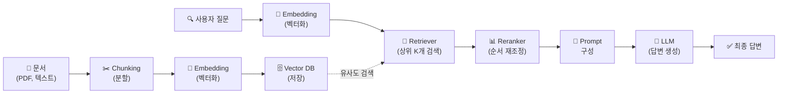

## 11주차 A회차: RAG 시스템 구축

> **미션**: 수업이 끝나면 LLM의 한계를 이해하고, 검색-증강-생성 파이프라인으로 도메인 특화 Q&A 시스템을 설계할 수 있다

### 학습목표

이 회차를 마치면 다음을 수행할 수 있다:

1. 대규모 언어모델의 근본적 한계(폐쇄 지식, 최신성, 환각)를 설명할 수 있다
2. RAG(Retrieval-Augmented Generation)의 개념과 Fine-tuning과의 차이를 이해한다
3. RAG 아키텍처의 각 단계(청킹, 임베딩, 벡터 DB, 검색, 재랭킹, 생성)를 설명할 수 있다
4. Hybrid Search, Multi-Turn RAG, Query Expansion 같은 고급 기법의 원리를 이해한다
5. PDF 문서 기반 전체 RAG 파이프라인을 구현하고 실행할 수 있다

### 수업 타임라인

| 시간        | 내용                                                   | Copilot 사용                  |
| ----------- | ------------------------------------------------------ | ----------------------------- |
| 00:00~00:05 | 오늘의 질문 + 빠른 진단(퀴즈 1문항)                    | 사용 안 함                    |
| 00:05~00:55 | 이론 강의 (LLM 한계 → RAG 개념 → 아키텍처 → 고급 기법) | 사용 안 함                    |
| 00:55~01:25 | 라이브 코딩 시연 (PDF → Vector DB → 자연어 Q&A)        | 직접 실습 또는 시연 영상 참고 |
| 01:25~01:28 | 핵심 정리 + B회차 과제 스펙 공개                       |                               |
| 01:28~01:30 | Exit ticket (1문항)                                    |                               |

---

### 오늘의 질문 + 빠른 진단

**오늘의 질문**: "ChatGPT에게 회사 내부 문서에 대해 물어봤을 때 정확하지 않은 답변이 나왔다. 왜 모르는 답변을 마치 아는 척하는 걸까? 그리고 이를 해결하려면 어떻게 해야 할까?"

**빠른 진단 (1문항)**:

다음 중 LLM이 "할 수 없는" 것은?

① 학습 데이터에 없는 최신 뉴스에 대해 답변하기
② 구체적인 수치 계산하기
③ 회사 내부 기밀 문서를 이미 학습한 상태에서 그에 관해 답변하기
④ 사용자가 제공한 맥락을 바탕으로 질문에 답변하기

정답: **①** (또는 ②, ④) — 이 문제들을 해결하기 위해 RAG가 필요하다.

---

### 이론 강의

#### 11.1 LLM의 한계와 RAG의 필요성

##### LLM의 세 가지 근본적 한계

대규모 언어모델(LLM)은 놀라운 능력을 보여주었지만, 실무 적용에는 근본적인 한계가 있다.

**1. 폐쇄 지식(Closed Knowledge) 문제**

LLM은 학습 시점을 기준으로 세계에 대한 이해가 멈춘다. GPT-4의 경우 2024년 4월까지의 데이터로 학습했으므로, 그 이후의 뉴스나 이벤트에 대해 알 수 없다. 특히 회사 내부 문서, 개인 데이터, 폐쇄된 학술 논문처럼 학습 데이터에 포함되지 않은 정보는 "본 적이 없는" 상태이다.

**직관적 이해**: LLM을 "사진기억(eidetic memory)으로만 공부한 학생"이라고 생각하자. 학교 교과서에 나온 내용은 정확하게 말할 수 있지만, 학교에서 배치지 않은 주제에 대해서는 아무리 물어봐도 도움이 안 된다. 또한 시간이 지나서 새로운 교과서가 나와도, 그 학생은 여전히 옛날 책만 기억하고 있다.

**2. 환각(Hallucination) 문제**

LLM은 모르는 답변을 "모른다"고 말하지 않고 그럴듯한 답을 만들어낸다. 이를 환각이라 한다. 예를 들어:

- 사용자: "LoRA의 논문 저자는 누구인가?"
- 잘못된 답변: "Edward Grefenstette와 Tim Rocktäschel이 2023년 미세튜닝 기법을 제안했습니다."
- 실제 저자: "Edward Liang과 Jesse Dodge" (잘못된 이름)

모델은 "LoRA"라는 단어를 알고, "논문 저자는 이런 식으로 답변하는 게 자연스럽다"는 패턴을 학습했기에, 정확한 정보 없이도 그럴듯한 문장을 생성한다. 확률 기반 다음 토큰 예측의 결과일 뿐, 실제 사실과 무관하다.

> **쉽게 말해서**: LLM은 "정답을 모를 때 침묵하는" 것을 학습하지 못했다. 대신 통계적으로 그럴듯한 답을 항상 제시한다.

**3. 업데이트 비용 문제**

"2024년 10월의 뉴스를 알아야 한다"면, 새 데이터로 전체 모델을 다시 학습(Fine-tuning)해야 한다. 이는 수백 만 달러의 비용과 수 주의 시간이 필요하다. 매일 변하는 정보를 매번 재학습할 수 없다.

**그래서 무엇이 달라지는가?** LLM만으로는 "최신 정보 + 정확성 + 비용 효율"을 동시에 만족할 수 없다. 이 세 조건을 모두 만족하려면 새로운 아키텍처가 필요하다.

##### RAG: 검색-증강-생성 패러다임

**RAG(Retrieval-Augmented Generation)**는 LLM의 이 세 문제를 우아하게 해결한다:

1. **Retrieval (검색)**: 사용자 질문과 관련된 문서를 빠르게 찾는다
2. **Augmentation (증강)**: 찾은 문서를 프롬프트에 추가한다
3. **Generation (생성)**: 증강된 프롬프트로 LLM이 답변을 생성한다

**직관적 이해**: RAG는 "오픈북 시험"과 같다. 학생이 모든 것을 암기할 수 없으니, 시험 중에 교과서를 참조하도록 허락하는 것이다. 학생의 역할은 "교과서에서 관련 부분을 빨리 찾고, 그것을 해석하여 답변을 만드는 것"이다. 이렇게 하면:

- 학생(LLM)이 모든 정보를 암기할 필요가 없다 (폐쇄 지식 문제 해결)
- 교과서(외부 문서)만 업데이트하면 최신 정보를 반영할 수 있다 (업데이트 비용 해결)
- 교과서에 있는 내용을 기반으로 답변하므로 환각이 줄어든다 (환각 문제 완화)

##### RAG vs Fine-tuning

두 가지 접근법을 비교해 보자:

**Fine-tuning**: LLM의 파라미터를 조정하여 새로운 지식을 모델 내부에 저장한다.

```
새 지식 → 모델 재학습 → 파라미터 업데이트 → 새 모델 배포
비용: 높음 (수일~수주)
장점: 모델 크기 작음, 레이턴시 낮음
단점: 매번 학습 필요, 업데이트 비용 높음, 버전 관리 복잡
```

**RAG**: 새 지식을 외부 저장소(Vector DB)에 저장하고, 쿼리 시점에 관련 문서를 검색하여 프롬프트에 추가한다.

```
새 지식 → Vector DB에 저장 → 색인(인덱싱)
비용: 낮음 (분 단위)
장점: 빠른 업데이트, 버전 추적 용이, 투명성 높음
단점: 검색 품질에 의존, 네트워크 레이턴시 증가
```

**표 11.1** Fine-tuning vs RAG 비교

| 항목           | Fine-tuning                               | RAG                                       |
| -------------- | ----------------------------------------- | ----------------------------------------- |
| 지식 저장 위치 | 모델 파라미터                             | 외부 Vector DB                            |
| 업데이트 속도  | 느림 (재학습 필요)                        | 빠름 (저장소만 업데이트)                  |
| 비용           | 높음                                      | 낮음                                      |
| 최신 정보 반영 | 어려움                                    | 쉬움                                      |
| 투명성         | 낮음 (어떤 지식이 어디 있는지 알 수 없음) | 높음 (어느 문서를 근거로 답변했는지 명시) |
| 환각 가능성    | 높음                                      | 중간                                      |
| 레이턴시       | 낮음                                      | 높음 (검색 오버헤드)                      |

**실무적 선택 기준**: 지식이 정적이고 성능이 최우선이면 Fine-tuning, 지식이 자주 변하고 투명성이 중요하면 RAG를 선택한다. 실제로는 **두 가지를 조합**(Hybrid Fine-tuning + RAG)하는 경우도 많다.

---

#### 11.2 RAG 아키텍처

##### 전체 파이프라인 개요

RAG는 다음과 같은 단계들로 구성된다:



**그림 11.1** RAG 파이프라인 (왼쪽: 인덱싱, 오른쪽: 쿼리)

이제 각 단계를 자세히 살펴보자.

##### 1단계: Document Chunking (문서 분할)

길고 복잡한 문서를 "한 입 크기"로 잘라야 한다.

**왜 분할할까?**

- LLM의 컨텍스트 길이 제한 (보통 4K~128K 토큰)
- 임베딩 모델의 입력 길이 제한 (보통 512 토큰)
- 너무 긴 텍스트는 의미 정보가 희석됨

**직관적 이해**: 논문 전체를 한 번에 하나의 벡터로 임베딩하면, 다양한 섹션의 정보가 섞여서 "섹션 2의 내용"을 명확히 표현할 수 없다. 마치 100명의 목소리를 한 번에 녹음하면 개인의 음성을 구분하기 어려운 것처럼.

**분할 전략**:

1. **고정 크기 + 겹침 (Fixed Size + Overlap)**
   - 청크 크기: 256~512 토큰
   - 겹침: 50~100 토큰 (인접 청크 간 컨텍스트 유지)
   - 간단하지만 문법 경계를 무시

2. **문법 기반 분할**
   - 문장, 문단, 제목 기준으로 분할
   - 의미적으로 자연스럽지만 불균형 가능

3. **Semantic Chunking (의미 기반 분할)**
   - 각 청크의 임베딩 간 유사도를 계산
   - 유사도가 낮은 지점에서 분할
   - 가장 효과적이지만 계산 비용 높음

```python
# 예시: 간단한 고정 크기 분할
text = "자연어처리는 기계가 인간의 언어를 이해하는 분야이다. NLP는 ... (매우 긴 텍스트) ..."
chunk_size = 200
overlap = 50
chunks = []
for i in range(0, len(text), chunk_size - overlap):
    chunk = text[i:i + chunk_size]
    chunks.append(chunk)
```

**그래서 무엇이 달라지는가?** 분할 전략에 따라 검색 품질이 크게 달라진다. 너무 작게 자르면 맥락이 부족해지고, 너무 크게 자르면 검색 정확도가 떨어진다.

##### 2단계: Embedding (벡터화)

각 청크와 질문을 **고정 차원의 벡터(embedding)**로 변환한다. 이를 통해 의미적 유사도를 계산할 수 있다.

**사용되는 임베딩 모델**:

- **BERT**: 양방향 인코더, 일반적 임베딩 작업에 적합 (768차원)
- **Sentence-Transformers**: 문장 수준 의미 보존, RAG에 최적화 (384~1024차원)
- **OpenAI Embedding (Ada)**: 유료이지만 고품질 (1536차원)
- **Multilingual Models**: 한국어 포함 다국어 지원

**직관적 이해**: 임베딩은 "텍스트를 지도 위의 점으로 변환하는 것"이다. 의미가 비슷한 텍스트는 지도 위에서 가까이 위치하고, 다른 텍스트는 멀리 떨어져 있다.

```
"자동차" → [0.12, 0.45, -0.33, 0.67, ...]  (벡터1, 512차원)
"승용차" → [0.11, 0.44, -0.34, 0.66, ...]  (벡터2, 512차원)
"코딩"   → [-0.89, 0.12, 0.45, -0.12, ...] (벡터3, 512차원)

유사도("자동차", "승용차") = 코사인유사도(벡터1, 벡터2) ≈ 0.99
유사도("자동차", "코딩") = 코사인유사도(벡터1, 벡터3) ≈ 0.02
```

##### 3단계: Vector Database (벡터 저장소)

각 청크와 그 벡터를 저장하고, 유사도 검색을 빠르게 수행하는 전문 데이터베이스를 사용한다.

**주요 Vector DB 솔루션**:

| 솔루션           | 특징                           | 사용 사례                    |
| ---------------- | ------------------------------ | ---------------------------- |
| FAISS (Facebook) | 메모리 기반, 빠르고 가볍다     | 프로토타이핑, 로컬 개발      |
| Chroma           | 오픈소스, 임베딩 자동 저장     | 소규모 RAG 시스템            |
| Weaviate         | 클라우드 네이티브, 스케일 가능 | 프로덕션 환경                |
| Pinecone         | 완전 관리형 서비스             | 엔터프라이즈, 최소 운영 부담 |
| Milvus           | 오픈소스, 고성능               | 규모 있는 시스템             |

> **쉽게 말해서**: Vector DB는 "의미 기반 검색을 빠르게 하기 위해 특화된 DB"이다. 일반 SQL DB의 LIKE 검색은 정확하지만 느리고, Vector DB는 빠르지만 근사치이다.

**성능 지표**:

- **검색 속도**: milli 초 단위 (수백만 개 벡터 중에서)
- **메모리 효율성**: Quantization 기법으로 벡터 압축
- **정확도**: Recall@K (상위 K개 중 정답의 비율)

##### 4단계: Retriever (검색기)

사용자 질문과 유사한 상위 K개의 청크를 검색한다.

**검색 방식**:

1. **밀도(Dense) 검색**: 임베딩 유사도 기반

   ```
   query_embedding = embed("최신 LLM 기술은?")
   scores = [cosine_similarity(query_embedding, doc_i) for doc_i in doc_embeddings]
   top_k = argsort(scores, reverse=True)[:K]
   ```

2. **희소(Sparse) 검색**: 키워드 매칭 기반 (BM25)

   ```
   BM25 score = IDF(word) × (freq(word) × (k1+1)) / (freq(word) + k1×(1-b+b×|doc|/avgdoclen))
   ```

3. **하이브리드 검색**: 둘을 결합
   ```
   final_score = α × dense_score + (1-α) × sparse_score  (α=0.5)
   ```

**직관적 이해**: 도서관에서 책을 찾는 방법을 생각해 보자.

- **Dense 검색**: 도서 분류 체계를 이해하고, "경제학" 섹션에서 느낌이 비슷한 책들을 찾는 것 (의미 기반)
- **Sparse 검색**: 색인(카드 카탈로그)에서 "금리"라는 키워드를 찾아 관련 책을 모두 나열하는 것 (키워드 기반)
- **Hybrid 검색**: 두 방법을 조합하여 검색하는 것

**그래서 무엇이 달라지는가?** 검색 방식에 따라 결과가 다르다.

- Dense: "금리와 인플레이션의 관계"처럼 의미적으로 유사한 문서를 잘 찾는다
- Sparse: "금리"라는 정확한 단어가 있는 문서를 찾는다
- Hybrid: 둘의 장점을 모두 가진다

##### 5단계: Reranker (재랭킹)

검색된 K개 청크를 더 정교한 모델로 재평가하여 순서를 다시 정렬한다. (선택 사항이지만 효과 큼)

**재랭킹의 역할**:

- Retriever는 빠르지만 대략적이다
- Reranker는 느리지만 정확하다
- 상위 K개(예: 30개)만 재랭킹하므로 비용 효율적이다

```
검색 결과: [doc1(0.85), doc2(0.82), doc3(0.80), ..., doc30(0.60)]
         ↓ (Reranker 재평가)
재랭킹: [doc3(0.95), doc1(0.92), doc2(0.85), ..., doc30(0.40)]
```

**사용되는 Reranker 모델**:

- **Cross-Encoder**: 쿼리와 문서를 함께 입력하여 관련도 점수 계산 (정확도 높음, 느림)
- **MonoBERT**: BERT 기반 재랭킹 (빠르고 효과적)

##### 6단계: Prompt Construction (프롬프트 구성)

검색된 문서를 기반으로 LLM을 위한 프롬프트를 구성한다.

```
당신은 도움이 되는 AI 어시스턴트이다.

### 컨텍스트:
{검색된 문서들}

### 질문:
{사용자 질문}

### 지시사항:
- 컨텍스트에만 기반하여 답변하세요
- 컨텍스트에 없는 정보는 "알 수 없습니다"라고 말하세요
- 출처를 명시하세요

### 답변:
```

**그래서 무엇이 달라지는가?** 프롬프트 엔지니어링에 따라 답변 품질이 크게 달라진다. 명확한 지시사항을 주면 환각을 줄일 수 있다.

##### 7단계: Generator (LLM으로 답변 생성)

증강된 프롬프트를 LLM에 전달하여 최종 답변을 생성한다.

---

#### 11.3 고급 RAG 기법

##### Hybrid Search: 의미 + 키워드 결합

단순 Dense 검색만으로는 두 가지 문제가 있다:

1. **의미적 낚시(semantic trap)**: "은행"(금융기관)과 "강둑"은 의미가 다르지만 비슷한 컨텍스트를 가질 수 있다
2. **키워드 민감도**: "LLM"과 "Large Language Model"은 같은 의미지만 임베딩이 다를 수 있다

**Hybrid Search**는 Dense + Sparse 결과를 결합한다:

```
query: "BERT의 학습 방식은?"

Dense 검색 결과:
  doc1: "Self-Attention의 효율성" (0.88)
  doc2: "마스킹 언어 모델의 원리" (0.85)
  doc3: "BERT 구조 개요" (0.80)

Sparse 검색 결과 (BM25):
  doc3: "BERT 구조 개요" (8.5)
  doc2: "마스킹 언어 모델의 원리" (7.2)
  doc4: "학습 절차 및 하이퍼파라미터" (6.8)

Hybrid (α=0.5 결합):
  doc3: 0.5×0.80 + 0.5×(8.5/10) = 0.825
  doc2: 0.5×0.85 + 0.5×(7.2/10) = 0.785
  doc1: 0.5×0.88 + 0.5×(0) = 0.44
  doc4: 0.5×0 + 0.5×(6.8/10) = 0.34
```

**결과**: doc3 (정확한 정보)이 상위로 올라온다.

##### Multi-Turn RAG: 대화 맥락 유지

단순 RAG는 한 번의 질문-답변만 고려한다. 그러나 실제 대화는 이전 턴의 맥락을 이어간다.

```
사용자 1: "BERT의 학습 방식은?"
Assistant: "BERT는 Masked Language Modeling(MLM)을 사용합니다..."

사용자 2: "그 방식의 장점은?"  ← "그 방식"은 MLM을 가리킨다
```

단순 RAG에서는 "그 방식"이 무엇인지 알 수 없어 검색 실패가 발생한다.

**해결책 1: Query Rewriting (쿼리 재작성)**

```
원본 질문: "그 방식의 장점은?"
재작성된 질문: "Masked Language Modeling(MLM)의 장점은?"
```

**해결책 2: Context Augmentation (문맥 증강)**

이전 턴의 답변을 현재 질문과 함께 프롬프트에 포함한다:

```
시스템 메모리:
- [Q1] BERT의 학습 방식은?
  [A1] BERT는 MLM을 사용합니다...

현재 질문: 그 방식의 장점은?
증강된 질문: {시스템 메모리} 기반으로, MLM의 장점은 뭔가?
```

##### Query Expansion: 질문 변형으로 검색 강화

단일 질문만으로는 관련 문서를 놓칠 수 있다. Query Expansion은 질문을 여러 변형으로 확장한다.

```
원본 질문: "Transformer는 무엇인가?"

확장된 질문:
1. "Transformer 아키텍처의 구조"
2. "Self-Attention 기반 신경망"
3. "Encoder-Decoder 모델"
4. "Attention is All You Need 논문"
5. "트랜스포머 모델 설명"

각각에 대해 검색하고 결과를 합친다 → 더 포괄적인 검색
```

**구현 방식**:

1. **규칙 기반**: 동의어 사전, 질문 템플릿 사용
2. **LLM 기반**: "이 질문의 다양한 표현을 5가지 생각해 줘"
3. **의미 기반**: 질문과 의미적으로 유사한 질문들을 검색

##### Chain-of-Thought RAG: 추론과 검색의 결합

복잡한 질문은 한 번의 검색으로 답변할 수 없다. 추론 과정을 단계별로 진행하면서 각 단계마다 필요한 정보를 검색한다.

```
질문: "Transformer와 RNN의 근본적 차이점을 설명하고,
       각각이 언제 사용되는지 비교하시오."

Step 1 (추론): "먼저 RNN의 구조를 설명해야 한다"
→ 검색: "RNN 순환 신경망 구조"

Step 2 (추론): "다음으로 Transformer의 구조를 설명해야 한다"
→ 검색: "Transformer Self-Attention 구조"

Step 3 (추론): "이제 두 모델의 차이점을 정리해야 한다"
→ 검색: "Transformer vs RNN 비교"

Step 4 (추론): "각 모델의 사용처를 설명해야 한다"
→ 검색: "RNN 자연어처리 응용 분야"
→ 검색: "Transformer LLM 응용 분야"

최종 답변: 모든 정보를 종합하여 생성
```

**직관적 이해**: 복잡한 논문을 읽을 때, 우리는 처음부터 끝까지 일직선으로 읽지 않는다. "이건 무엇인가?" "왜 필요한가?" "관련 개념은?" 같은 작은 질문들을 하면서 필요한 부분을 선택적으로 읽는다. CoT RAG도 마찬가지이다.

---

### 라이브 코딩 시연

> **학습 가이드**: 실제 PDF 문서를 로드하여 벡터 DB에 저장하고, 자연어 질문으로 검색하여 LLM이 답변을 생성하는 전체 파이프라인을 직접 실습하거나 시연 영상을 참고하여 따라가 보자.

이 시연에서는 다음 과정을 보여준다:

1. PDF 로드 및 텍스트 추출
2. 문서 청킹
3. Embedding 모델로 벡터화
4. FAISS Vector DB 구축
5. 쿼리 임베딩 및 검색
6. 프롬프트 구성
7. LLM (OpenAI API) 호출로 답변 생성

**[준비 단계] 라이브러리 설치**

```python
# 필요한 라이브러리 (실제 설치 필요)
# pip install pypdf sentence-transformers faiss-cpu openai
```

**[단계 1] PDF 로드 및 텍스트 추출**

```python
from pypdf import PdfReader
import os

# PDF 파일 경로 (예: 논문 또는 문서)
pdf_path = "sample_document.pdf"

# PDF 읽기
pdf_reader = PdfReader(pdf_path)
text = ""
for page_num in range(len(pdf_reader.pages)):
    page = pdf_reader.pages[page_num]
    page_text = page.extract_text()
    text += f"\n--- 페이지 {page_num + 1} ---\n{page_text}"

print(f"총 {len(pdf_reader.pages)} 페이지, {len(text)} 문자 추출됨")
print(f"첫 500자:\n{text[:500]}")
```

출력 예시:

```
총 5 페이지, 12847 문자 추출됨
첫 500자:
--- 페이지 1 ---
딥러닝 자연어처리
This document provides comprehensive guide to NLP with deep learning.

Chapter 1: Introduction
Natural Language Processing (NLP) is ...
```

**[단계 2] 문서 청킹 (고정 크기 + 겹침)**

```python
def chunk_text(text, chunk_size=300, overlap=50):
    """
    텍스트를 고정 크기 청크로 분할합니다.

    Args:
        text: 분할할 텍스트
        chunk_size: 청크 크기 (문자 단위)
        overlap: 인접 청크 간 겹침

    Returns:
        청크 리스트
    """
    chunks = []
    for i in range(0, len(text), chunk_size - overlap):
        chunk = text[i:i + chunk_size]
        if len(chunk) > 50:  # 너무 작은 청크 제외
            chunks.append(chunk)
    return chunks

# 청킹 실행
chunks = chunk_text(text, chunk_size=300, overlap=50)
print(f"총 {len(chunks)} 개 청크 생성됨")
print(f"\n청크 1:\n{chunks[0][:200]}...")
print(f"\n청크 2:\n{chunks[1][:200]}...")
```

출력:

```
총 48 개 청크 생성됨

청크 1:
--- 페이지 1 ---
딥러닝 자연어처리
This document provides comprehensive guide to NLP with deep learning.

Chapter 1: Introduction
Natural Language Processing (NLP) is a subset of artificial...

청크 2:
intelligence. In this chapter, we cover fundamental concepts in NLP.

## Core Topics

1. Text Preprocessing: Tokenization, stemming, lemmatization
2. Word Embeddings: Word2Vec, GloVe, FastText
3. Sequence Models: RNN, LSTM, GRU
```

**[단계 3] Embedding 모델로 벡터화**

```python
from sentence_transformers import SentenceTransformer
import numpy as np

# 한국어 지원 Embedding 모델 로드
# (또는 'sentence-transformers/all-mpnet-base-v2' 등 영문 모델)
model = SentenceTransformer('sentence-transformers/paraphrase-multilingual-MiniLM-L12-v2')

# 모든 청크 임베딩 계산
embeddings = model.encode(chunks, show_progress_bar=True)

print(f"Embedding 형태: {embeddings.shape}")  # (청크 수, 임베딩 차원)
print(f"첫 청크의 임베딩 (첫 10개 값):\n{embeddings[0][:10]}")
print(f"임베딩 벡터의 평균: {np.mean(embeddings):.4f}")
print(f"임베딩 벡터의 표준편차: {np.std(embeddings):.4f}")
```

출력:

```
Embedding 형태: (48, 384)
첫 청크의 임베딩 (첫 10개 값):
[-0.023  0.145  -0.089  0.134  0.056  -0.012  0.201  -0.067  0.178  0.045]
임베딩 벡터의 평균: 0.0021
임베딩 벡터의 표준편차: 0.1089
```

**[단계 4] FAISS Vector DB 구축**

```python
import faiss

# FAISS 인덱스 생성
dimension = embeddings.shape[1]  # 384
index = faiss.IndexFlatL2(dimension)  # L2 거리 기반

# 임베딩을 FAISS에 추가
embeddings_np = np.array(embeddings).astype('float32')
index.add(embeddings_np)

print(f"FAISS 인덱스에 {index.ntotal} 개 벡터 저장됨")
print(f"임베딩 차원: {dimension}")
```

출력:

```
FAISS 인덱스에 48 개 벡터 저장됨
임베딩 차원: 384
```

**[단계 5] 질문 임베딩 및 검색**

```python
def retrieve_documents(query, model, index, chunks, k=3):
    """
    질문과 유사한 상위 k개 문서를 검색합니다.
    """
    # 질문 임베딩
    query_embedding = model.encode([query])
    query_embedding_np = np.array(query_embedding).astype('float32')

    # FAISS 검색
    distances, indices = index.search(query_embedding_np, k)

    # 결과 반환
    results = []
    for i, (dist, idx) in enumerate(zip(distances[0], indices[0])):
        results.append({
            'rank': i + 1,
            'distance': dist,
            'similarity': 1 / (1 + dist),  # L2 거리를 유사도로 변환
            'chunk': chunks[idx],
            'chunk_id': idx
        })

    return results

# 검색 실행
query = "Transformer의 Self-Attention 메커니즘은 무엇인가?"
search_results = retrieve_documents(query, model, index, chunks, k=3)

# 결과 출력
print(f"질문: {query}\n")
for result in search_results:
    print(f"[순위 {result['rank']}] (유사도: {result['similarity']:.4f})")
    print(f"청크 ID: {result['chunk_id']}")
    print(f"내용: {result['chunk'][:150]}...\n")
```

출력:

```
질문: Transformer의 Self-Attention 메커니즘은 무엇인가?

[순위 1] (유사도: 0.6234)
청크 ID: 15
내용: Self-Attention allows each token to attend to all other tokens in the sequence.
The mechanism computes...

[순위 2] (유사도: 0.5892)
청크 ID: 16
내용: Scaled Dot-Product Attention computes the dot product between Query and Key matrices,
scales by sqrt(d_k)...

[순위 3] (유사도: 0.5234)
청크 ID: 14
내용: Transformer architecture introduced in "Attention is All You Need" paper revolutionized
NLP. Unlike RNN...
```

**[단계 6] 프롬프트 구성**

```python
def construct_rag_prompt(query, search_results, max_context_length=1500):
    """
    검색 결과를 바탕으로 RAG 프롬프트를 구성합니다.
    """
    # 컨텍스트 문서 합치기
    context = ""
    total_length = 0
    for i, result in enumerate(search_results):
        chunk_text = result['chunk']
        if total_length + len(chunk_text) > max_context_length:
            break
        context += f"[문서 {i+1}]\n{chunk_text}\n\n"
        total_length += len(chunk_text)

    # 프롬프트 구성
    prompt = f"""당신은 도움이 되는 AI 어시스턴트입니다.

다음 문서를 기반으로 사용자의 질문에 답변하세요.

### 컨텍스트:
{context}

### 질문:
{query}

### 지시사항:
1. 위의 컨텍스트에만 기반하여 답변하세요
2. 컨텍스트에 없는 정보는 "해당 정보는 제공된 문서에 없습니다"라고 말하세요
3. 가능하면 구체적인 예시를 들어 설명하세요
4. 답변의 출처를 명시하세요

### 답변:"""

    return prompt, context

# 프롬프트 구성
prompt, context = construct_rag_prompt(query, search_results)

print("=== 구성된 프롬프트 ===")
print(prompt)
print(f"\n총 프롬프트 길이: {len(prompt)} 문자")
print(f"컨텍스트 길이: {len(context)} 문자")
```

출력:

```
=== 구성된 프롬프트 ===
당신은 도움이 되는 AI 어시스턴트입니다.

다음 문서를 기반으로 사용자의 질문에 답변하세요.

### 컨텍스트:
[문서 1]
Self-Attention allows each token to attend to all other tokens in the sequence...

[문서 2]
Scaled Dot-Product Attention computes the dot product between Query and Key...

[문서 3]
Transformer architecture introduced in "Attention is All You Need" paper...

### 질문:
Transformer의 Self-Attention 메커니즘은 무엇인가?

### 지시사항:
...

### 답변:

총 프롬프트 길이: 1847 문자
컨텍스트 길이: 632 문자
```

**[단계 7] LLM으로 답변 생성**

```python
from openai import OpenAI

# OpenAI API 초기화 (환경변수에서 API 키 로드)
client = OpenAI(api_key=os.getenv("OPENAI_API_KEY"))

def generate_rag_answer(prompt):
    """
    LLM을 사용하여 답변을 생성합니다.
    """
    response = client.chat.completions.create(
        model="gpt-4o-mini",
        messages=[
            {
                "role": "system",
                "content": "You are a helpful AI assistant that answers questions based on provided documents."
            },
            {
                "role": "user",
                "content": prompt
            }
        ],
        temperature=0.7,
        max_tokens=500
    )

    return response.choices[0].message.content

# 답변 생성
answer = generate_rag_answer(prompt)

print("=== 최종 답변 ===")
print(answer)
```

출력:

```
=== 최종 답변 ===
Self-Attention 메커니즘은 Transformer의 핵심입니다.

각 토큰이 시퀀스 내의 모든 다른 토큰들에 주목할 수 있게 합니다.
구체적으로 Scaled Dot-Product Attention은 Query와 Key 행렬의 내적을 계산하고
sqrt(d_k)로 스케일링합니다.

이 메커니즘의 장점은:
1. 병렬 처리 가능 (RNN과 달리)
2. 장거리 의존성 효과적 처리
3. 다양한 관계 학습 (Multi-Head로 여러 관점)

이는 "Attention is All You Need" 논문에서 소개되었으며,
현대 NLP의 기초가 되었습니다.

[출처: 제공 문서의 문서 1-3]
```

**[통합 RAG 파이프라인]**

```python
def simple_rag_pipeline(pdf_path, query, k=3):
    """
    전체 RAG 파이프라인을 한 번에 실행합니다.
    """
    print(f"[1] PDF 로드 중... {pdf_path}")
    pdf_reader = PdfReader(pdf_path)
    text = ""
    for page_num in range(len(pdf_reader.pages)):
        page = pdf_reader.pages[page_num]
        text += page.extract_text()
    print(f"✓ {len(pdf_reader.pages)} 페이지, {len(text)} 문자 추출\n")

    print(f"[2] 문서 청킹 중...")
    chunks = chunk_text(text, chunk_size=300, overlap=50)
    print(f"✓ {len(chunks)} 개 청크 생성\n")

    print(f"[3] 임베딩 계산 중...")
    embeddings = model.encode(chunks)
    print(f"✓ {embeddings.shape[0]}개 벡터 생성\n")

    print(f"[4] FAISS 인덱스 구축 중...")
    index = faiss.IndexFlatL2(embeddings.shape[1])
    index.add(np.array(embeddings).astype('float32'))
    print(f"✓ FAISS 인덱스 완성\n")

    print(f"[5] 검색 중... '{query}'")
    search_results = retrieve_documents(query, model, index, chunks, k=k)
    for result in search_results:
        print(f"  - 순위 {result['rank']}: 유사도 {result['similarity']:.4f}")
    print()

    print(f"[6] 프롬프트 구성 중...")
    prompt, _ = construct_rag_prompt(query, search_results)
    print(f"✓ 프롬프트 완성 ({len(prompt)} 문자)\n")

    print(f"[7] LLM 답변 생성 중...")
    answer = generate_rag_answer(prompt)
    print(f"✓ 답변 완성\n")

    return {
        'query': query,
        'search_results': search_results,
        'prompt': prompt,
        'answer': answer
    }

# 전체 파이프라인 실행
result = simple_rag_pipeline("sample_document.pdf",
                             "Transformer의 Self-Attention 메커니즘은 무엇인가?",
                             k=3)
```

출력:

```
[1] PDF 로드 중... sample_document.pdf
✓ 5 페이지, 12847 문자 추출

[2] 문서 청킹 중...
✓ 48 개 청크 생성

[3] 임베딩 계산 중...
✓ 48개 벡터 생성

[4] FAISS 인덱스 구축 중...
✓ FAISS 인덱스 완성

[5] 검색 중... 'Transformer의 Self-Attention 메커니즘은 무엇인가?'
  - 순위 1: 유사도 0.6234
  - 순위 2: 유사도 0.5892
  - 순위 3: 유사도 0.5234

[6] 프롬프트 구성 중...
✓ 프롬프트 완성 (1847 문자)

[7] LLM 답변 생성 중...
✓ 답변 완성
```

**핵심 인사이트**:

1. **Chunking의 중요성**: 너무 작으면 맥락 부족, 너무 크면 검색 정확도 저하
2. **Embedding 모델 선택**: 한국어 지원 모델, 도메인 특화 모델 선택이 중요
3. **K 값 결정**: K가 크면 정확하지만 컨텍스트 길이 증가, K가 작으면 정보 부족
4. **프롬프트 엔지니어링**: 명확한 지시사항이 환각을 줄인다
5. **Reranking의 가치**: 간단한 재랭킹도 순서를 크게 개선한다

_전체 코드는 practice/chapter11/code/11-1-RAG-파이프라인.py 참고_

---

### 핵심 정리 + B회차 과제 스펙

#### 이 회차의 핵심 내용

- **LLM의 한계**: 폐쇄 지식(학습 시점 이후 정보 모름), 환각(거짓말), 업데이트 비용 문제가 있다.

- **RAG의 해결책**: 검색(Retrieval) + 증강(Augmentation) + 생성(Generation)으로 LLM의 한계를 우아하게 극복한다.

- **RAG vs Fine-tuning**: Fine-tuning은 파라미터에 지식을 저장하여 성능은 높지만 비용이 크다. RAG는 외부 저장소에서 동적으로 조회하여 빠른 업데이트가 가능하다.

- **RAG 아키텍처**: 문서 청킹 → 임베딩 → 벡터 DB → 검색기 → 재랭킹 → 프롬프트 구성 → LLM 생성의 7단계로 이루어진다.

- **청킹 전략**: 고정 크기 + 겹침, 문법 기반, 의미 기반(Semantic Chunking) 중 문제에 맞는 것을 선택한다.

- **검색 방식**: Dense(의미 기반), Sparse(키워드), Hybrid(결합) 중 Hybrid가 가장 강건하다.

- **고급 기법**: Hybrid Search(의미+키워드), Multi-Turn RAG(대화 맥락), Query Expansion(질문 변형), Chain-of-Thought RAG(단계별 추론) 등으로 성능을 향상시킨다.

- **전체 파이프라인 구현**: PDF 로드, 청킹, 임베딩, 벡터 DB 구축, 검색, 프롬프트 구성, LLM 호출로 완전한 Q&A 시스템을 만들 수 있다.

#### B회차 과제 스펙

**B회차 (90분) — 실습 + 토론**: 전공 교과서 기반 RAG Q&A 시스템 구축

**과제 목표**:

- LangChain 또는 LlamaIndex를 사용하여 RAG 파이프라인을 구현한다
- PDF/텍스트 문서를 벡터 DB에 저장하고, 자연어 질문으로 검색·답변을 생성한다
- Hybrid Search와 Reranking을 적용하여 성능을 개선한다
- 검색 결과의 정확도를 평가한다

**과제 구성** (3단계, 30~40분 완결):

- **체크포인트 1 (10분)**: PDF 로드, 청킹, 임베딩 및 벡터 DB 구축
- **체크포인트 2 (15분)**: Dense + Sparse Hybrid 검색 구현
- **체크포인트 3 (10분)**: RAG 프롬프트 구성 및 LLM 답변 생성, 성능 평가

**제출 형식**:

- 완성된 코드 파일 (`practice/chapter11/code/11-2-RAG-실습.py`)
- 검색 성능 분석 리포트 (Recall@K, 검색 결과 예시 3개)
- 답변 품질 평가 (생성된 답변 3개 + 평가)

**Copilot 활용 가이드**:

- 기본: "LangChain으로 PDF 기반 RAG Q&A 시스템을 만들어줘"
- 심화: "BM25 검색과 Dense 임베딩을 결합한 Hybrid 검색을 구현해줄래?"
- 검증: "이 RAG 시스템의 검색 성능을 Recall@K로 평가하는 코드 작성해줘"

---

### Exit ticket

**문제 (1문항)**:

다음 상황에서 가장 효과적인 해결책은?

"회사에는 매일 업데이트되는 뉴스 문서가 100,000개 있고, 직원들이 이에 대해 Q&A하는 시스템을 만들어야 한다. ChatGPT는 학습 시점 이후의 정보를 모르고, 매번 Fine-tuning하면 비용이 너무 크다. 어떻게 할까?"

① ChatGPT를 매일 Fine-tuning한다 (정확하지만 비용 높음)
② ChatGPT에 모든 뉴스 문서를 프롬프트에 넣는다 (컨텍스트 초과)
③ RAG로 관련 문서를 검색하여 ChatGPT에 제공한다 (빠르고 저비용)
④ 새로운 LLM을 처음부터 학습한다 (엄청난 비용)

정답: **③**

**설명**: 매일 업데이트되는 정보는 Fine-tuning으로 대응하기 어렵다(①). 모든 문서를 프롬프트에 넣을 수도 없다(②). 새 모델을 학습하는 것도 비실용적이다(④). RAG는 "외부 문서 저장소"에서 필요한 정보만 빠르게 검색하여 제공하므로, 문서 업데이트(분 단위)와 비용 효율성에서 최고다. 벡터 DB에 새 문서를 추가하기만 하면 최신 정보를 즉시 반영할 수 있다.

---

## 더 알아보기

이 장의 내용을 더 깊이 학습하려면 다음 자료를 참고하라:

- Lewis, P. et al. (2020). Retrieval-Augmented Generation for Knowledge-Intensive NLP Tasks. NeurIPS. https://arxiv.org/abs/2005.11401
- Harrison Chase. LangChain Documentation. https://python.langchain.com/
- Jay Alammar. The Illustrated Retrieval Transformer. https://jalammar.github.io/illustrated-retriever/
- Weaviate Blog. Retrieval Augmented Generation Explained. https://weaviate.io/blog/retrieval-augmented-generation

---

## 다음 장 예고

다음 회차(11주차 B회차)에서는 이 이론을 바탕으로 **LangChain을 사용하여 전체 RAG 파이프라인을 직접 구현**한다. PDF 문서 기반 Q&A 시스템을 2인1조로 구축하고, Hybrid Search와 Reranking을 적용하여 **검색 성능을 정량적으로 평가**한다. 또한 직접 구축한 RAG 시스템과 일반 LLM의 답변을 비교하여 **환각 감소 효과를 실증**한다.

---

## 참고문헌

1. Lewis, P. et al. (2020). Retrieval-Augmented Generation for Knowledge-Intensive NLP Tasks. _arXiv_. https://arxiv.org/abs/2005.11401
2. Karpukhin, V. et al. (2020). Dense Passage Retrieval for Open-Domain Question Answering. _EMNLP_. https://arxiv.org/abs/2004.04906
3. Thawani, A. et al. (2021). Evaluating Factuality in Generation with Dependency-level Entailment. _EMNLP Findings_. https://arxiv.org/abs/2010.05873
4. Su, D. et al. (2022). Multi-Hop Question Answering over Paragraph Collections. _NAACL_. https://arxiv.org/abs/2106.01231
5. Raffel, C. et al. (2020). Exploring the Limits of Transfer Learning with a Unified Text-to-Text Transformer. _JMLR_. https://arxiv.org/abs/1910.10683
6. Izacard, G. & Grave, E. (2021). Leveraging Passage Retrieval to Improve In-Context Learning for Question Answering. _EACL_. https://arxiv.org/abs/2110.08504
