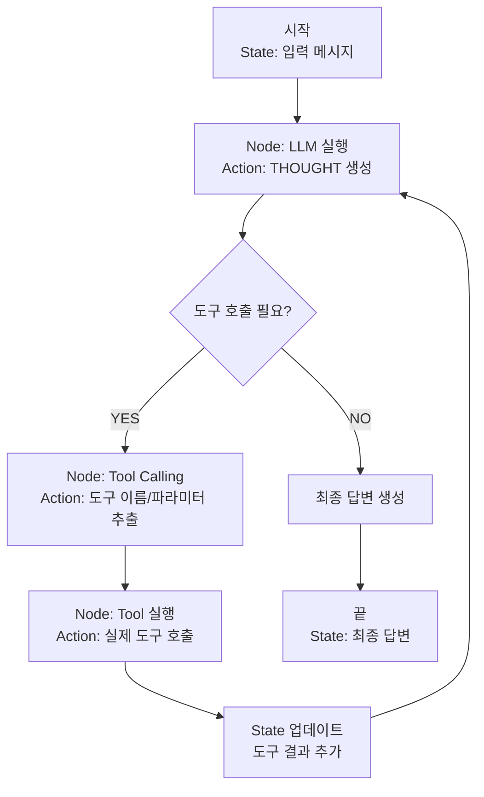

## 12주차 A회차: AI Agent 개발 — 개념과 실전

> **미션**: 수업이 끝나면 자율적으로 태스크를 수행하는 AI Agent를 이해하고, ReAct 루프로 동작하는 Agent를 구현할 수 있다

### 학습목표

이 회차를 마치면 다음을 수행할 수 있다:

1. AI Agent의 정의와 Chatbot의 차이를 설명할 수 있다
2. Reactive Agent와 Planning Agent의 개념을 이해한다
3. ReAct (Reasoning + Acting) 루프의 흐름을 따라갈 수 있다
4. Tool(함수)을 정의하고 LLM이 이를 호출하도록 요청할 수 있다
5. LangGraph를 이용해 간단한 Agent 상태 그래프를 구성할 수 있다

### 수업 타임라인

| 시간        | 내용                                               |
| ----------- | -------------------------------------------------- |
| 00:00~00:05 | 오늘의 질문 + 빠른 진단(퀴즈 1문항)                |
| 00:05~00:55 | 이론 강의 (개념과 원리)                            |
| 00:55~01:25 | 라이브 코딩 시연 (웹 검색+계산+DB 조회 도구 Agent) |
| 01:25~01:28 | 핵심 정리 + B회차 과제 스펙 공개                   |
| 01:28~01:30 | Exit ticket (1문항)                                |

---

### 오늘의 질문 + 빠른 진단

**오늘의 질문**: "사용자가 '2024년 한국 평균 기온은 몇 도였고, 작년보다 몇 도 올랐나?'라고 물었을 때, ChatGPT는 이 질문에 어떻게 대답할까? 또 AI Agent는?"

**빠른 진단 (1문항)**:

다음 중 AI Agent의 특징으로 가장 적절한 것은?

① 사용자의 질문에 바로 답변을 만든다
② 문제를 분해하여 필요한 도구(검색, 계산 등)를 순차적으로 호출하고 최종 답변을 구성한다
③ 항상 정확한 답변을 보장한다
④ 외부 정보를 사용하지 않고 학습된 지식만으로 답변한다

정답: **②** — Agent는 목표 지향적이며, 각 단계에서 "어떤 도구를 언제 쓸까"를 스스로 판단한다.

---

### 이론 강의

#### 12.1 AI Agent 개념

##### Agent란 무엇인가?

**Chatbot**과 **AI Agent**는 모두 언어모델 기반이지만, 근본적으로 다르다.

**Chatbot**:

- **목표**: 사용자와 자연스럽게 대화한다
- **동작**: 사용자의 질문에 대해 학습된 지식을 바탕으로 바로 답변한다
- **예시**: "한국의 수도는?" → "서울입니다" (즉시 답변)

**AI Agent**:

- **목표**: 복잡한 태스크를 자율적으로 해결한다
- **동작**: 문제를 분해하고, 필요한 도구(함수, API)를 호출하며, 결과를 통합한다
- **예시**: "2024년 한국 평균 기온을 찾아서 2023년과 비교해줘" → (웹 검색 도구 호출) → (비교 계산) → 최종 답변

**직관적 이해**: Chatbot은 자동판매기처럼 "버튼을 누르면 미리 정해진 음료를 준다". Agent는 바리스타처럼 "손님의 요청을 듣고, 어떤 재료를 얼마나 섞을지 판단하며, 최적의 커피를 만든다".

**그래서 무엇이 달라지는가?** Chatbot은 2023년 데이터로 학습한 모델이면, 2024년 기온을 모른다. 하지만 Agent는 (1) 웹 검색 도구를 호출해 2024년 데이터를 가져오고, (2) 2023년 데이터도 검색한 뒤, (3) 둘을 비교하는 계산 도구를 호출한다. 이렇게 여러 도구를 조합하여 Chatbot이 할 수 없는 일을 수행한다.

##### Agent의 핵심 특징

**1. 자율성 (Autonomy)**

Agent는 인간의 개입 없이 목표에 도달할 때까지 스스로 행동을 결정한다. 사용자가 "구글 주식 가격과 애플 주식 가격을 비교해줘"라고 하면, Agent는:

- (자동) 웹 검색 도구를 호출해 두 주식 가격을 조회하고
- (자동) 비교 계산을 하고
- (자동) 최종 답변을 구성한다

사용자가 각 단계마다 "이제 계산해", "이제 비교해" 같이 명령할 필요가 없다.

**2. 목표 지향성 (Goal-Orientedness)**

Agent는 최종 목표(사용자의 질문)를 정하고, 그에 도달하기 위한 중간 목표들을 스스로 설정한다. "회의 준비"라는 최종 목표가 주어지면:

- 중간 목표 1: 회의 참가자 명단 조회
- 중간 목표 2: 회의실 예약
- 중간 목표 3: 관련 자료 정리
- ...

각 중간 목표에 필요한 도구를 호출한다.

**3. 도구 활용 능력 (Tool Use)**

Agent는 자신의 "뇌"(언어모델)로는 할 수 없는 일을 **도구(Tool)**를 통해 수행한다. 도구의 예:

- **웹 검색 도구**: 인터넷에서 실시간 정보 조회
- **계산 도구**: 복잡한 수학 계산 수행
- **데이터베이스 조회 도구**: 비즈니스 데이터 검색
- **파이썬 실행 도구**: 데이터 분석, 그래프 생성
- **이메일 발송 도구**: 자동 커뮤니케이션

언어모델 혼자로는 "지금 날씨가 몇 도인가?"에 답할 수 없지만, 웹 검색 도구를 호출하면 가능하다.

**4. 반응성 (Reactivity)**

Agent는 환경의 변화에 반응한다. 도구 호출 결과가 예상과 다르면, Agent는 전략을 바꾼다.

예: "가장 가까운 커피숍을 찾아줘"

- 처음 시도: GPS 도구로 현재 위치 파악 → 지도 API로 근처 커피숍 검색
- 결과: "찾을 수 없음"
- Agent의 반응: "범위를 넓혀서 재검색하거나, 다른 검색 API를 시도하자"

##### Reactive Agent vs Planning Agent

**Reactive Agent**:

- **동작**: 매 시점마다 현재 상황에 반응하여 다음 행동을 결정한다
- **특징**: 빠르고 간단하지만, 장기 계획이 약하다
- **흐름**: Observation → Decision → Action → (다시 Observation)
- **사용**: 간단한 태스크, 실시간 반응이 중요한 경우

**Planning Agent**:

- **동작**: 먼저 전체 계획을 세운 뒤, 계획을 순서대로 실행한다
- **특징**: 더 체계적이지만 초반 계획이 틀리면 비효율적이다
- **흐름**: Goal → Planning → Execution → Verification
- **사용**: 복잡한 장기 프로젝트

이 강의에서는 **Reactive Agent** 중에서도 특히 **ReAct (Reasoning + Acting)** 패턴을 다룬다.

> **쉽게 말해서**: Reactive Agent는 체스 게임을 하는 초보자처럼 "현재 판 상황을 보고 최선의 수를 찾는다". Planning Agent는 체스 고수처럼 "3수 앞을 내다보고 전략을 세운다".

---

#### 12.2 ReAct (Reasoning + Acting)

##### ReAct 루프란?

**ReAct** (Wei et al., 2022)는 다음의 4단계를 반복하는 Agent 패턴이다:

```
1. THOUGHT (생각): 현재 상황을 분석하고 다음 행동을 계획한다
2. ACTION (행동): 도구를 호출한다
3. OBSERVATION (관찰): 도구의 결과를 받는다
4. (다시 1로 돌아가) 또는 ANSWER (최종 답변)로 종료
```

**직관적 이해**: 당신이 경찰관이라고 생각해 보자. 사건을 해결하려면:

- "THOUGHT": "먼저 범행 현장의 cctv 영상을 봐야겠다"
- "ACTION": 보안팀에 요청
- "OBSERVATION": 영상을 본다
- "THOUGHT": "다음엔 목격자 증언이 필요하다"
- "ACTION": 목격자 조사
- (반복)
- "ANSWER": 종합 보고서 작성

##### 구체적 예: "2024년 한국의 평균 기온은?"

Agent가 다음 질문에 답한다고 가정하자: "2024년 한국의 평균 기온은 몇 도였고, 2023년보다 몇 도 올랐나?"

**ReAct 루프의 실행:**

```
THOUGHT: 이 질문에 답하려면 두 개의 정보가 필요하다:
  1. 2024년 한국 평균 기온
  2. 2023년 한국 평균 기온
먼저 2024년 데이터를 검색해 보자.

ACTION: web_search("2024년 한국 평균 기온 통계")

OBSERVATION: 검색 결과: "2024년 한국 평균 기온은 14.8°C였다 (기상청)"

THOUGHT: 좋다, 첫 번째 정보를 얻었다. 이제 2023년 데이터를 검색하자.

ACTION: web_search("2023년 한국 평균 기온 통계")

OBSERVATION: 검색 결과: "2023년 한국 평균 기온은 13.5°C였다"

THOUGHT: 두 데이터가 모두 있다. 이제 계산하자.
  2024년 - 2023년 = 14.8 - 13.5 = 1.3°C

ACTION: calculator(14.8 - 13.5)

OBSERVATION: 1.3

ANSWER: 2024년 한국의 평균 기온은 14.8°C였으며, 2023년(13.5°C)보다 1.3°C 올랐습니다.
```

> **그래서 무엇이 달라지는가?** 일반 Chatbot은 학습 데이터의 knowledge cutoff 때문에 2024년 정보를 모를 가능성이 높다. "죄송하지만 2024년 데이터는 없습니다" 정도가 답변이다. ReAct Agent는 웹 검색 도구를 호출함으로써 실시간 데이터를 가져올 수 있고, 계산 도구로 수치 계산을 정확히 수행하며, 여러 도구의 결과를 통합하여 정확한 최종 답변을 만든다.

##### ReAct의 핵심 원리

**1. Thought에서 문제 분해**

복잡한 질문을 받으면 Agent는 즉시 도구를 호출하지 않는다. 먼저 "이 질문을 해결하려면 무엇이 필요할까?"를 생각한다.

예: "한국 GDP와 일본 GDP를 비교하고, 그 이유를 설명해줘"

- Thought: "세 가지 정보가 필요하다: (1) 한국 GDP, (2) 일본 GDP, (3) 경제 뉴스/분석"

**2. Action에서 도구 호출**

Thought에서 결정한 행동을 실행한다. 도구 호출은 **JSON 형식**으로 표현된다.

```json
{
  "type": "tool_call",
  "tool_name": "web_search",
  "tool_input": {
    "query": "한국 GDP 2024"
  }
}
```

**3. Observation에서 결과 수집**

도구가 반환한 결과를 받는다. 도구 호출이 실패할 수도 있다.

```
도구 결과 (성공):
"한국의 2024년 GDP는 $1.45 trillion"

또는

도구 결과 (실패):
"Error: 웹 검색에 실패했습니다. 다시 시도하세요."
```

**4. 반복 또는 종료**

Observation 결과를 보고, Agent는 판단한다:

- "아직 부족한 정보가 있다" → 다시 THOUGHT로 돌아가 새로운 행동을 계획
- "충분한 정보를 모았다" → ANSWER로 최종 답변 생성

##### ReAct의 장점

**1. 투명성 (Transparency)**

Agent가 "어떤 도구를 언제 호출했는가"를 명확히 보여준다. 사용자는 Agent의 사고 과정을 추적할 수 있다.

예:

```
생각: "먼저 실시간 주가를 조회하자"
실행: web_search("NVIDIA 현재 주가") → $125
생각: "경쟁사와 비교하려면 AMD 주가도 필요하다"
실행: web_search("AMD 현재 주가") → $145
결론: AMD가 더 비싸다
```

사용자는 각 단계를 이해할 수 있고, 어디서 오류가 발생했는지 알 수 있다.

**2. 정확성 개선**

도구를 활용하면 언어모델의 고유한 오류(hallucination)를 줄일 수 있다.

- **Hallucination 예**: "한국의 수도는 대전입니다" (거짓)
- **ReAct로 해결**: web_search("한국의 수도") → 도구가 "서울"을 반환

**3. 복잡한 문제 해결**

다단계 문제도 해결 가능하다.

예: "중국 매출을 30% 줄이려면 어떤 제품을 우선 단종해야 할까?"

1. 지역별 판매 데이터 도구: 중국 제품별 매출 조회
2. 분석 도구: 단종 시나리오 별 이익 계산
3. 결론: 가장 낮은 마진율 제품들을 추천

---

#### 12.3 Tool Design과 Integration

##### Tool이란?

**Tool(도구)**은 Agent가 호출할 수 있는 함수 또는 API이다. Agent의 "팔과 눈" 역할을 한다.

좋은 Tool의 조건:

1. **명확한 이름**: Tool의 목적이 이름에서 드러난다
2. **상세한 설명**: LLM이 언제 이 Tool을 써야 하는지 안다
3. **명확한 파라미터**: 입력값의 의미와 형식이 정확하다
4. **신뢰할 수 있는 출력**: 결과가 항상 일관되고 정확하다

##### Tool 정의 예시

**웹 검색 도구**:

```python
def web_search(query: str) -> str:
    """
    인터넷에서 주어진 쿼리를 검색한다.

    Args:
        query (str): 검색 키워드. 예: "한국 GDP 2024"

    Returns:
        str: 검색 결과 상위 3개의 제목과 요약

    예시:
        >>> web_search("한국 평균 기온")
        "1. 기상청 기후변화 지표 - 2024년 한국 기온은 14.8°C..."
    """
    # 실제 구현: 검색 API(Google Search, Bing 등) 호출
    pass
```

**계산 도구**:

```python
def calculator(expression: str) -> float:
    """
    수식을 계산한다.

    Args:
        expression (str): 계산할 수식. 예: "1.3 + 2.5"

    Returns:
        float: 계산 결과

    예시:
        >>> calculator("14.8 - 13.5")
        1.3
    """
    # 안전한 eval 구현 또는 sympy 사용
    pass
```

**데이터베이스 조회 도구**:

```python
def query_sales_db(year: int, region: str) -> dict:
    """
    회사 판매 데이터베이스를 조회한다.

    Args:
        year (int): 조회 연도. 예: 2024
        region (str): 지역. 예: "한국", "일본", "미국"

    Returns:
        dict: {상품명: 매출액, ...} 형식의 딕셔너리

    예시:
        >>> query_sales_db(2024, "한국")
        {"스마트폰": 1200000000, "태블릿": 350000000, ...}
    """
    # 실제 구현: 데이터베이스 쿼리
    pass
```

**직관적 이해**: Tool 정의는 마치 "매뉴얼 쓰기"와 같다. LLM(Agent)이 도구를 처음 본다고 가정하고, "이 도구는 무엇을 하고, 어떤 입력을 원하고, 어떤 출력을 주는가"를 명확히 설명한다. LLM은 이 설명을 읽고 "언제 이 Tool을 쓰면 좋을까?"를 판단한다.

##### Tool Calling: LLM이 도구를 호출하도록 하기

LLM에게 Tool 정의를 주고, Agent는 LLM이 호출해야 하는 도구를 **JSON 형식**으로 응답하도록 설정한다.

**예시 상호작용**:

```
사용자: "2024년 한국 평균 기온은?"

LLM의 응답 (JSON 형식):
{
  "thinking": "평균 기온 정보는 최신이어야 하므로 웹 검색이 필요하다",
  "tool_calls": [
    {
      "tool": "web_search",
      "input": {"query": "2024년 한국 평균 기온"}
    }
  ]
}

Tool 실행 결과:
"기상청 발표: 2024년 한국 평균 기온은 14.8°C"

LLM의 최종 응답:
"2024년 한국의 평균 기온은 14.8°C였습니다."
```

**그래서 무엇이 달라지는가?** 도구 없이는 LLM이 단순히 "제 지식으로는 2023년까지만 알고 있습니다"라고 답할 것이다. 도구와 함께 사용하면, LLM이 "웹 검색으로 최신 정보를 가져와야겠다"고 판단하고 자동으로 도구를 호출한다.

##### Error Handling: 도구 실행 오류 처리

도구 호출이 항상 성공하지는 않는다. Agent는 오류에 대응해야 한다.

**오류의 종류**:

1. **Tool이 존재하지 않음**: Agent가 정의되지 않은 Tool을 호출
2. **입력 오류**: 파라미터 타입이나 범위가 맞지 않음
3. **실행 오류**: Tool 실행 중 예외 발생 (네트워크 끊김, DB 오류 등)
4. **부정확한 결과**: Tool이 실행되지만 예상 범위를 벗어난 결과

**Agent의 대응 전략**:

```
초기 시도:
ACTION: web_search("한국 GDP")
OBSERVATION: Error - "검색 결과 없음"

재시도 1:
THOUGHT: "검색어가 너무 구체적일 수 있다. 더 일반적으로 해보자"
ACTION: web_search("한국 경제 통계")
OBSERVATION: "성공: 한국 GDP는 1.45 trillion 달러"

또는

재시도 2 (대체 Tool 사용):
THOUGHT: "웹 검색이 안 되면 데이터베이스에서 조회해보자"
ACTION: query_economic_db("Korea", "GDP", 2024)
OBSERVATION: "1.45 trillion"
```

##### Tool Composition: 여러 도구의 조합

복잡한 문제는 하나의 도구로 풀 수 없다. Agent는 여러 도구를 순차적 또는 병렬적으로 조합한다.

**예: "애플과 구글의 주가를 비교하고, 최근 3개월 추세를 분석해줘"**

```
순차적 조합:
1. ACTION: web_search("AAPL 현재 주가")
   OBSERVATION: $150
2. ACTION: web_search("GOOGL 현재 주가")
   OBSERVATION: $140
3. ACTION: web_search("AAPL 3개월 주가 추세")
   OBSERVATION: "3개월 전 $140에서 현재 $150으로 +7.1% 상승"
4. ACTION: web_search("GOOGL 3개월 주가 추세")
   OBSERVATION: "3개월 전 $130에서 현재 $140으로 +7.7% 상승"
5. ANSWER: 정리 및 비교

병렬적 조합 (동시 실행 가능):
- web_search("AAPL") 및 web_search("GOOGL") 동시 호출
- 결과를 모두 받은 뒤 비교
```

**직관적 이해**: Tool Composition은 요리하기와 같다. 요리에 "양파는 미리 자르고 (Tool 1), 고기는 미리 양념하고 (Tool 2), 그 다음 팬에서 함께 볶는다 (Tool 3)"는 순서가 있다. Agent도 비슷하게 도구들의 실행 순서와 의존성을 이해하고 최적으로 조합한다.

---

#### 12.4 LangGraph를 이용한 Agent 개발

##### LangGraph란?

LangGraph (LangChain의 그래프 기반 확장)는 Agent의 상태와 흐름을 **그래프 구조**로 정의할 수 있게 해준다.

**핵심 개념**:

- **State**: Agent의 상태 (메시지, 도구 결과 등)
- **Node**: 각 상태에서 실행되는 함수 (예: "LLM으로 생각하기", "도구 호출하기")
- **Edge**: Node 간의 전환 조건 (예: "도구 결과가 없으면 다시 LLM 실행")
- **StateGraph**: 이들을 조합한 그래프

##### StateGraph의 구조



**그림 12.1** LangGraph 기반 ReAct Agent의 상태 그래프

**직관적 이해**: StateGraph는 마치 "사람이 할 일 목록을 정리하는 것"처럼 보인다.

- "현재 상태"는 "지금 어디까지 진행했는가"를 나타낸다
- "Node"는 "다음에 할 일"이다
- "Edge"는 "이 일이 끝나면 다음 무엇을 할 것인가"를 결정한다

##### State 정의

State는 Agent가 유지해야 할 정보를 모두 담는다.

```python
from typing import TypedDict, Annotated
from langgraph.graph import StateGraph

class AgentState(TypedDict):
    """Agent의 상태를 정의한다"""

    # 입력/출력
    input: str  # 사용자의 질문
    output: str  # 최종 답변

    # 중간 상태
    messages: Annotated[list, "대화 기록"]  # LLM과의 주고받음
    tool_results: Annotated[dict, "도구 실행 결과"]  # 각 도구의 결과

    # 반복 제어
    iterations: int  # 지금까지 몇 번 루프를 돌았는가
    max_iterations: int  # 최대 허용 반복 횟수
```

> **쉽게 말해서**: State는 Agent의 "메모장"이다. Agent가 진행 과정에서 생각, 도구 결과, 최종 답변 등을 모두 메모에 적어 두고, 필요할 때 참조한다.

##### Node 정의: LLM 실행

```python
def run_llm_node(state: AgentState) -> AgentState:
    """
    LLM을 실행하여 다음 행동을 결정한다.
    """
    # LLM에 현재까지의 메시지 전달
    messages = state["messages"]

    # LLM 호출 (Tool 정의와 함께)
    llm_with_tools = model.bind_tools([
        web_search,      # Tool 정의
        calculator,
        query_sales_db,
    ])

    response = llm_with_tools.invoke({
        "messages": messages,
        "system": "당신은 능력 있는 AI Agent입니다. 주어진 도구들을 활용하여 문제를 해결하세요."
    })

    # State 업데이트
    state["messages"].append({"role": "assistant", "content": response})
    state["iterations"] += 1

    return state
```

##### Node 정의: Tool 실행

```python
def execute_tools_node(state: AgentState) -> AgentState:
    """
    LLM이 요청한 도구들을 실행한다.
    """
    # 최근 LLM 응답에서 Tool 호출 요청 추출
    latest_response = state["messages"][-1]["content"]

    # Tool 호출 JSON 파싱 (실제로는 LLM 응답이 구조화됨)
    tool_calls = parse_tool_calls(latest_response)

    # 각 Tool 실행
    for tool_call in tool_calls:
        tool_name = tool_call["tool"]
        tool_input = tool_call["input"]

        if tool_name == "web_search":
            result = web_search(tool_input["query"])
        elif tool_name == "calculator":
            result = calculator(tool_input["expression"])
        elif tool_name == "query_sales_db":
            result = query_sales_db(
                tool_input["year"],
                tool_input["region"]
            )

        # 결과 저장
        state["tool_results"][tool_name] = result

    # Tool 결과를 메시지에 추가
    state["messages"].append({
        "role": "tool_results",
        "content": state["tool_results"]
    })

    return state
```

##### Edge 정의: 조건부 라우팅

```python
def should_continue(state: AgentState) -> str:
    """
    현재 상태를 보고 다음 Node를 결정한다.
    """
    # 최대 반복 횟수 확인
    if state["iterations"] >= state["max_iterations"]:
        return "end"

    # 최근 LLM 응답이 최종 답변인지 확인
    latest_message = state["messages"][-1]["content"]

    if "ANSWER:" in latest_message:
        # 최종 답변 도출
        state["output"] = latest_message.replace("ANSWER:", "").strip()
        return "end"
    elif "ACTION:" in latest_message:
        # Tool 호출이 필요함
        return "tools"
    else:
        # 다시 LLM을 실행
        return "llm"
```

##### StateGraph 구성

```python
# 그래프 생성
graph = StateGraph(AgentState)

# Node 추가
graph.add_node("llm", run_llm_node)
graph.add_node("tools", execute_tools_node)

# Edge 추가
graph.add_edge("start", "llm")  # 시작 → LLM
graph.add_conditional_edges(
    "llm",
    should_continue,
    {
        "tools": "tools",    # Tool 필요 → tools node
        "llm": "llm",        # 다시 생각 → llm node
        "end": "__end__"     # 종료
    }
)
graph.add_edge("tools", "llm")  # Tool 실행 후 → LLM

# 컴파일
agent = graph.compile()
```

**그림 12.2** LangGraph의 상태 그래프 (코드로 구현)

##### Agent 실행

```python
# Agent 실행
initial_state = {
    "input": "2024년 한국 평균 기온은 몇 도였고, 2023년보다 몇 도 올랐나?",
    "output": "",
    "messages": [{"role": "user", "content": "2024년 한국 평균 기온은 몇 도였고, 2023년보다 몇 도 올랐나?"}],
    "tool_results": {},
    "iterations": 0,
    "max_iterations": 10
}

result = agent.invoke(initial_state)

print(result["output"])
# 출력: "2024년 한국의 평균 기온은 14.8°C였으며, 2023년(13.5°C)보다 1.3°C 올랐습니다."
```

> **그래서 무엇이 달라지는가?** LangGraph 없이는 Agent 루프를 수동으로 구현해야 한다 (조건 검사, 도구 호출, 상태 업데이트 등을 모두 코드로 작성). LangGraph는 이러한 흐름을 시각적 그래프로 정의하고, 자동으로 실행해 준다. 코드가 더 깔끔하고, 복잡한 Agent도 쉽게 구축할 수 있다.

---

### 라이브 코딩 시연

> **학습 가이드**: 웹 검색, 계산, 데이터베이스 조회 도구를 정의하고, LangGraph로 간단한 Agent를 만든 뒤, 실제로 복잡한 질문에 답하는 과정을 직접 실습하거나 시연 영상을 참고하여 따라가 보자.

#### [단계 1] Tool 정의

```python
import requests
from typing import Any

# Tool 1: 웹 검색
def web_search(query: str) -> str:
    """
    Google Custom Search API를 사용하여 웹을 검색한다.

    Args:
        query: 검색 키워드

    Returns:
        상위 3개 검색 결과의 제목과 요약
    """
    # 실제로는 Google Search API 사용
    # 여기서는 시뮬레이션
    search_results = {
        "2024년 한국 평균 기온": "기상청 발표: 2024년 한국 평균 기온은 14.8°C (최근 30년 평균 12.8°C 대비 +2.0°C)",
        "2023년 한국 평균 기온": "기상청 발표: 2023년 한국 평균 기온은 13.5°C (최근 30년 평균 대비 +0.7°C)",
    }

    for key, value in search_results.items():
        if key in query or query in key:
            return value

    return "검색 결과 없음"

# Tool 2: 계산기
def calculator(expression: str) -> float:
    """
    산술 식을 계산한다.

    Args:
        expression: 계산할 식 (예: "14.8 - 13.5")

    Returns:
        계산 결과
    """
    try:
        return float(eval(expression))
    except Exception as e:
        return f"계산 오류: {e}"

# Tool 3: 데이터베이스 조회
def query_sales_db(year: int, region: str) -> dict:
    """
    회사 판매 데이터베이스를 조회한다.

    Args:
        year: 조회 연도
        region: 지역 (한국, 일본, 미국 등)

    Returns:
        {제품: 매출} 형식의 딕셔너리
    """
    sample_data = {
        (2024, "한국"): {"스마트폰": 1200000000, "태블릿": 350000000, "노트북": 450000000},
        (2023, "한국"): {"스마트폰": 1000000000, "태블릿": 300000000, "노트북": 400000000},
    }

    key = (year, region)
    return sample_data.get(key, {})
```

#### [단계 2] Agent State 정의

```python
from typing import TypedDict, Annotated, Optional

class AgentState(TypedDict):
    input: str
    messages: list
    tool_results: dict
    iterations: int
    max_iterations: int
    output: Optional[str]
```

#### [단계 3] LangGraph Node 정의

```python
from langchain_openai import ChatOpenAI
import json

def should_call_tool(state: AgentState) -> str:
    """LLM 응답을 분석하여 다음 step 결정"""
    latest = state["messages"][-1]["content"]

    if "최종 답변:" in latest:
        return "end"
    elif "검색" in latest or "계산" in latest:
        return "tool"
    else:
        return "llm"

def run_llm(state: AgentState) -> AgentState:
    """LLM으로 다음 step 생각"""
    llm = ChatOpenAI(model="gpt-4")

    # Tool 정의를 LLM에 전달
    tools_description = """
    사용 가능한 도구:
    1. web_search(query) - 웹에서 검색
    2. calculator(expression) - 산술 계산
    3. query_sales_db(year, region) - 판매 데이터 조회

    Tool 호출 형식: <tool_call>{"tool": "도구_이름", "input": {"param": "값"}}</tool_call>
    """

    prompt = f"""당신은 AI Agent입니다. 다음 질문에 답하세요.
{tools_description}

현재까지의 대화:
{chr(10).join([f"{m['role']}: {m['content']}" for m in state['messages']])}

다음 action을 생각하고, 필요하면 <tool_call>...</tool_call> 형식으로 도구를 호출하세요.
또는 "최종 답변:"으로 시작하는 최종 답변을 생성하세요.
"""

    response = llm.invoke(prompt)
    state["messages"].append({"role": "assistant", "content": response.content})
    state["iterations"] += 1

    return state

def run_tools(state: AgentState) -> AgentState:
    """LLM이 요청한 도구 실행"""
    latest = state["messages"][-1]["content"]

    # <tool_call>...</tool_call> 파싱
    import re
    matches = re.findall(r'<tool_call>(.*?)</tool_call>', latest, re.DOTALL)

    for match in matches:
        tool_json = json.loads(match)
        tool_name = tool_json["tool"]
        tool_input = tool_json["input"]

        # 도구 실행
        if tool_name == "web_search":
            result = web_search(tool_input["query"])
        elif tool_name == "calculator":
            result = calculator(tool_input["expression"])
        elif tool_name == "query_sales_db":
            result = query_sales_db(tool_input["year"], tool_input["region"])
        else:
            result = "알 수 없는 도구"

        state["tool_results"][tool_name] = result
        state["messages"].append({
            "role": "tool",
            "content": f"{tool_name}: {result}"
        })

    return state
```

#### [단계 4] StateGraph 구성 및 실행

```python
from langgraph.graph import StateGraph, END

# 그래프 구성
graph = StateGraph(AgentState)

graph.add_node("llm", run_llm)
graph.add_node("tools", run_tools)

graph.add_edge("tools", "llm")
graph.add_conditional_edges(
    "llm",
    should_call_tool,
    {
        "tool": "tools",
        "llm": "llm",
        "end": END
    }
)

graph.set_entry_point("llm")
agent = graph.compile()

# Agent 실행
initial_state = {
    "input": "2024년 한국 평균 기온은 몇 도였고, 2023년보다 몇 도 올랐나?",
    "messages": [{"role": "user", "content": "2024년 한국 평균 기온은 몇 도였고, 2023년보다 몇 도 올랐나?"}],
    "tool_results": {},
    "iterations": 0,
    "max_iterations": 10,
    "output": None
}

result = agent.invoke(initial_state)

print("=== Agent 실행 결과 ===")
print(f"최종 답변: {result['output']}")
print(f"\n사용된 도구 결과:")
for tool, result_val in result["tool_results"].items():
    print(f"  {tool}: {result_val}")
```

#### [단계 5] Agent의 실제 동작

```
=== Agent 실행 결과 ===

[반복 1]
LLM의 생각: "2024년과 2023년의 한국 평균 기온을 알아야 하고, 두 값의 차이를 계산해야 한다"
LLM의 행동:
  <tool_call>{"tool": "web_search", "input": {"query": "2024년 한국 평균 기온"}}</tool_call>
  <tool_call>{"tool": "web_search", "input": {"query": "2023년 한국 평균 기온"}}</tool_call>

Tool 실행 결과:
  web_search: 기상청 발표: 2024년 한국 평균 기온은 14.8°C
  web_search: 기상청 발표: 2023년 한국 평균 기온은 13.5°C

[반복 2]
LLM의 생각: "이제 두 값을 뺄셈하자"
LLM의 행동:
  <tool_call>{"tool": "calculator", "input": {"expression": "14.8 - 13.5"}}</tool_call>

Tool 실행 결과:
  calculator: 1.3

[반복 3]
LLM의 생각: "모든 필요한 정보를 모았다. 최종 답변을 생성하자"
최종 답변: "2024년 한국의 평균 기온은 14.8°C였으며, 2023년(13.5°C)보다 1.3°C 올랐습니다."
```

이 시연을 통해 Agent가:

1. **자동으로 문제를 분해**하고 (2024년, 2023년 온도 필요)
2. **필요한 도구를 선택**하고 (웹 검색 → 계산)
3. **도구 결과를 해석**하며 (검색 결과를 이해, 계산 실행)
4. **최종 답변을 생성**한다 (종합)

---

### 핵심 정리 + B회차 과제 스펙

#### 이 회차의 핵심 내용

- **AI Agent**는 자율적으로 복잡한 태스크를 해결하는 시스템이다. Chatbot과의 차이는 목표 지향성, 도구 활용 능력, 자율성이다.

- **ReAct (Reasoning + Acting)**는 Agent의 대표적 패턴으로, Thought → Action → Observation을 반복하며 문제를 단계적으로 해결한다. 이를 통해 투명성이 높고 오류 대응이 용이한 Agent를 만들 수 있다.

- **Tool(도구)**는 Agent의 "팔과 눈"이다. Tool이 없으면 Agent는 언어모델의 지식에만 의존하지만, Tool이 있으면 웹 검색, 계산, 데이터베이스 조회 등 실시간/정확한 정보를 활용할 수 있다.

- **Tool Calling**은 LLM이 JSON 형식으로 도구 호출을 요청하는 방식이다. 이 방식으로 인해 LLM과 도구 간의 상호작용이 구조화되고 확장 가능하다.

- **Error Handling**은 Agent의 견고성을 높인다. 도구 실행 오류가 발생하면 Agent는 재시도, 대체 도구 사용, 입력 수정 등 여러 전략을 시도한다.

- **Tool Composition**은 여러 도구를 순차적/병렬적으로 조합하여 복잡한 문제를 해결한다. 예를 들어, 웹 검색으로 데이터를 모으고, 계산 도구로 분석하고, DB 저장 도구로 기록한다.

- **LangGraph**는 Agent의 상태와 흐름을 그래프로 정의한다. StateGraph, Node, Edge를 이용하여 Agent의 논리를 명확하고 재사용 가능한 형태로 구성할 수 있다.

#### B회차 과제 스펙

**B회차 (90분) — Agent 프로토타입 개발**

**과제 목표**:

- 2~3개의 Tool을 정의한다
- LangGraph로 Agent를 구성한다
- 실제 복잡한 질문에 답하는 Agent를 테스트한다

**과제 구성** (3단계, 30~40분 완결):

**① Tool 정의 (10분)**

- 3개 Tool 정의: 웹 검색, 계산, 데이터 조회 (또는 도메인 특화 Tool)
- 각 Tool에 명확한 설명 작성
- Mock 데이터 또는 실제 API 연동

**② LangGraph Agent 구성 (15분)**

- AgentState 정의
- run_llm, run_tools Node 구현
- should_continue 조건 함수 구현
- StateGraph 컴파일

**③ Agent 테스트 및 분석 (10분)**

- 3개 이상 복잡한 질문 실행
- 각 질문의 Thought→Action→Observation 과정 기록
- Tool 호출 순서와 결과 분석

**제출 형식**:

- 완성된 코드 파일 (`practice/chapter12/code/12-1-react-agent.py`)
- Agent 실행 로그 (각 질문별 THOUGHT/ACTION/OBSERVATION 기록, 3~4 질문)
- 분석 리포트: "Agent가 각 도구를 선택한 이유", "Error handling 사례" (1~2 문단)

**Copilot 활용 가이드**:

- 기본: "LangGraph로 web_search, calculator 도구를 가진 Agent를 만들어줘"
- 심화: "Agent가 도구 실행 오류 시 자동으로 재시도하도록 추가해줄래?"
- 검증: "이 Agent의 반복 횟수를 로그로 기록해서, 효율성을 분석할 수 있게 해줄래?"

**Copilot 활용 예시 요청**:

```
"다음과 같은 도구들을 가진 ReAct Agent를 LangGraph로 구현해줘:
1. web_search(query): 웹에서 검색
2. calculator(expression): 산술 계산
3. database_query(table, condition): 회사 데이터베이스 조회

Agent는 '2024년 Q1 한국 매출이 2023년 Q1 대비 몇 % 증가했는가?'라는 질문에 답할 수 있어야 해.
각 단계에서 Thought를 출력하고, 도구 호출 결과를 보여줘."
```

---

### Exit ticket

**문제 (1문항)**:

다음 질문에 대해 Chatbot과 ReAct Agent의 차이를 설명하시오.

"2025년 2월 현재, 삼성전자의 주가는 몇 원인가?"

(A) Chatbot의 답변 예상: ********\_********

(B) ReAct Agent의 답변 예상: ********\_********

(C) 두 답변이 다른 이유: ********\_********

**예상 답변**:

(A) "제 지식 기준으로는 2025년 2월 정보가 없습니다. 직접 주가 정보 사이트를 확인해주세요."

(B) "현재 삼성전자 주가를 조회하겠습니다. [web_search 도구 호출] → 삼성전자 주가: 62,500원입니다."

(C) "Chatbot은 학습 당시의 고정된 지식만 사용하고, ReAct Agent는 웹 검색 도구를 호출하여 실시간 정보를 가져올 수 있다. Agent는 '지금 필요한 정보를 어떤 도구로 얻을 것인가'를 판단할 수 있다."

---

### 추가 학습 자료

이 장의 내용을 더 깊이 학습하려면 다음 자료를 참고하라:

- Wei, J. et al. (2022). Chain-of-Thought Prompting Elicits Reasoning in Large Language Models. _NeurIPS_. https://arxiv.org/abs/2201.11903
- ReAct: Synergizing Reasoning and Acting in Language Models. https://arxiv.org/abs/2210.03629
- LangChain LangGraph Documentation. https://python.langchain.com/docs/langgraph/
- Jason Wei, Xuezhi Wang (2023). Emergent Abilities of Large Language Models. OpenAI Blog. https://openai.com/research/emergent-abilities

---

### 다음 회차 예고

다음 회차(12주차 B회차)에서는 이 이론을 바탕으로 **직접 Agent를 구현**한다. 웹 검색, 데이터 분석, 데이터베이스 조회 등 실제 Tool을 조합하여 복잡한 비즈니스 질문에 답하는 Agent를 만들어 본다. 또한 **Error Handling과 Tool Composition**을 심화하여, 실패 시 자동 재시도, 여러 Tool의 병렬 실행, Agent의 반복 횟수 최적화 등을 다룬다.

---

### 참고문헌

1. Wei, J., Wang, X., Schuurmans, D., et al. (2022). Chain-of-Thought Prompting Elicits Reasoning in Large Language Models. _arXiv_. https://arxiv.org/abs/2201.11903
2. Yao, S., Zhao, J., Yu, D., et al. (2022). ReAct: Synergizing Reasoning and Acting in Language Models. _arXiv_. https://arxiv.org/abs/2210.03629
3. Langchain. Tool Calling. https://python.langchain.com/docs/concepts/tool_calling/
4. LangChain. LangGraph: Build Stateful, Multi-Actor Applications. https://python.langchain.com/docs/langgraph/
5. OpenAI. Function Calling. https://platform.openai.com/docs/guides/function-calling
6. Mialon, G., Dessì, R., Lomeli, M., et al. (2023). Augmented Language Models: a Survey. _arXiv_. https://arxiv.org/abs/2302.07842
7. Park, J. S., O'Neill, J., & Jiang, L. (2023). Social Simulacra: Creating Populated Worlds with Large Language Models. _arXiv_. https://arxiv.org/abs/2208.04024
