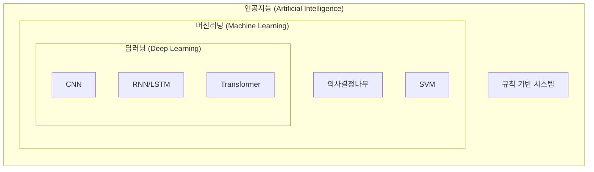
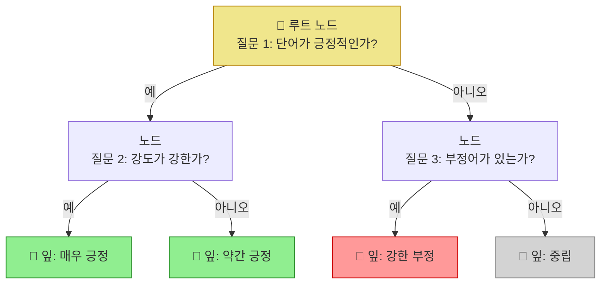
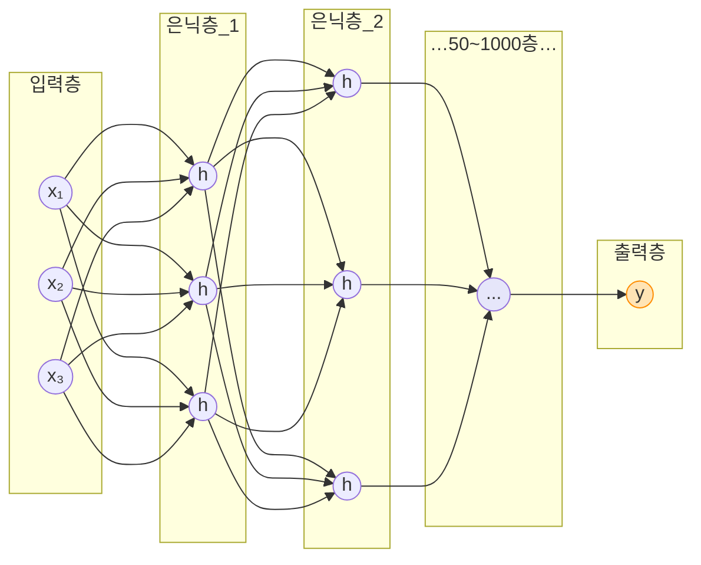
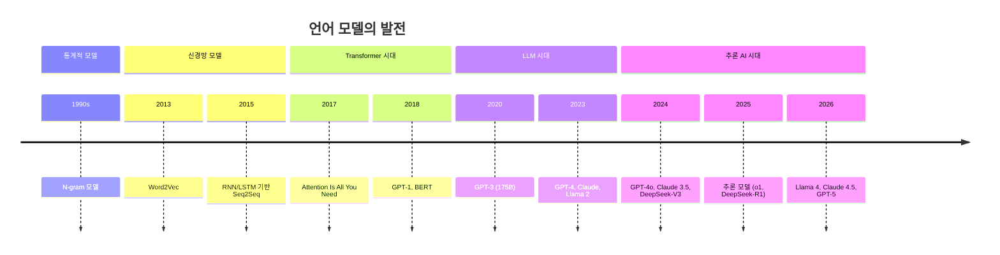

## 1주차 A회차: AI 시대의 개막과 개발 환경 구축

> **미션**: 수업이 끝나면 PyTorch로 첫 번째 딥러닝 모델을 돌려본다

### 학습목표

이 회차를 마치면 다음을 수행할 수 있다:

1. AI, 머신러닝, 딥러닝의 관계를 설명할 수 있다
2. 2024-2026 NLP 산업 동향을 이해하고, 앞으로 배워야 할 핵심 역량을 파악한다
3. PyTorch 개발 환경을 구축하고 GPU/CPU 선택을 이해한다
4. Tensor를 생성·조작하고, Autograd로 자동 미분을 수행할 수 있다

### 수업 타임라인

| 시간        | 내용                                       | Copilot 사용                  |
| ----------- | ------------------------------------------ | ----------------------------- |
| 00:00~00:05 | 오늘의 질문 + 빠른 진단(퀴즈 1문항)        | 사용 안 함                    |
| 00:05~00:55 | 이론 강의 (직관적 비유 → 개념 → 원리)      | 사용 안 함                    |
| 00:55~01:25 | 라이브 코딩 시연 (Tensor 생성 및 GPU 이동) | 직접 실습 또는 시연 영상 참고 |
| 01:25~01:28 | 핵심 정리 + B회차 과제 스펙 공개           |                               |
| 01:28~01:30 | Exit ticket (1문항)                        |                               |

---

### 오늘의 질문 + 빠른 진단

**오늘의 질문**: "딥러닝이 정말 필요한가? 지금 이 순간에도 나의 일상과 어떻게 연결되어 있을까?"

**빠른 진단 (1문항)**:

다음 중 딥러닝(Deep Learning)을 사용하지 않는 것은?

① ChatGPT로 텍스트 생성하기
② 은행 송금 시 계좌 유효성 검증하기
③ 스트리밍 서비스 영화 추천받기
④ 스마트폰 인물 사진 배경 흐림 처리

정답: ② — 계좌 검증은 정해진 규칙(정규식)을 적용하는 일반 소프트웨어이다. 반면 ①③④는 모두 딥러닝 모델이 학습한 패턴을 활용한다. 오늘 배울 AI, ML, DL의 관계를 이해하는 좋은 예시이다.

---

### 이론 강의

#### 1.1 인공지능, 머신러닝, 딥러닝: 개념과 발전

##### AI(인공지능)란 무엇인가?

인공지능(Artificial Intelligence, AI)은 **인간의 지능을 기계로 구현하려는 기술**이다. 학문적으로는 1956년 다트머스 대학의 학술 회의에서 처음 정의되었지만, 최근 생활 속에서는 음성 비서(Siri, Alexa), 번역 서비스(Google 번역), 이미지 인식(얼굴 인증) 등으로 매일 만난다.

역사적으로 보면, AI는 흥망성쇠를 반복했다. 1970~1980년대의 "AI 겨울"을 거쳐, 2012년 딥러닝 기반 AlexNet이 이미지 인식 대회에서 압도적 성능을 보여주면서 새 시대를 열었다. 하드웨어 성능 향상(GPU의 등장)과 대규모 데이터 축적이 이를 가능하게 했다.

> **쉽게 말해서**: AI는 "기계가 똑똑하게 행동하게 하는 기술" 전체를 가리키는 용어이다.

##### AI, 머신러닝, 딥러닝의 포함 관계

세 개념의 관계는 **범위**로 이해하면 쉽다.

**직관적 이해**: 러시아 인형 마트료시카를 떠올려 보자. 가장 큰 인형이 AI, 그 안에 ML, 그 안에 DL이 들어 있다. AI라는 큰 우산 아래에 머신러닝이 있고, 머신러닝 중에서도 신경망을 깊게 쌓은 것이 딥러닝이다.



**그림 1.1** AI, 머신러닝, 딥러닝의 포함 관계

**인공지능(AI)**은 가장 넓은 개념이다. 규칙을 명시적으로 프로그래밍하는 **규칙 기반 시스템**(전문가 시스템)부터, 현대의 대규모 언어 모델까지 모두 AI에 포함된다.

**머신러닝(Machine Learning)**은 AI의 한 분야로, **명시적 프로그래밍 없이 데이터로부터 스스로 패턴을 학습하는 기술**이다. 전통 프로그래밍과의 차이를 보자:

- **전통 프로그래밍**: 사람이 규칙을 정하면 컴퓨터가 규칙을 실행한다. 예) `if 계좌번호_길이 == 10 then 유효하다`
- **머신러닝**: 데이터 예시를 주면 컴퓨터가 스스로 규칙을 발견한다. 예) 우량 고객 1000명과 부실 고객 1000명의 거래 기록을 보고, 패턴을 스스로 학습한다

**그래서 무엇이 달라지는가?** 전통 프로그래밍은 규칙이 명확한 문제(계산, 검증)에 강하다. 하지만 사람의 음성을 인식하거나 의료 이미지에서 암을 판단하는 것처럼 규칙을 명확히 정의하기 어려운 문제에서는 머신러닝이 훨씬 효과적이다. 컴퓨터가 직접 패턴을 발견하므로, 사람이 놓친 미묘한 특징도 포착할 수 있다.

**표 1.1** 프로그래밍 패러다임 비교

| 구분         | 전통 프로그래밍        | 머신러닝                  |
| ------------ | ---------------------- | ------------------------- |
| 접근법       | 규칙 → 데이터 → 결과   | 데이터 → 규칙 학습 → 예측 |
| 규칙 정의    | 사람이 명시적으로 설정 | 데이터로부터 자동 발견    |
| 새 문제 적응 | 코드 수정 필요         | 데이터 추가로 자동 적응   |
| 적용 분야    | 명확한 규칙의 문제     | 복잡하고 모호한 문제      |
| 성능 향상    | 규칙 개선              | 데이터 및 모델 개선       |

**딥러닝(Deep Learning)**은 머신러닝의 한 분야로, **여러 층의 인공 신경망을 사용하여 복잡한 패턴을 학습하는 기술**이다. "깊다(Deep)"는 것은 신경망의 층이 많다는 뜻이다. 같은 머신러닝이라도 의사결정나무(Decision Tree)는 보통 1~10층, 딥러닝은 50~1000층 이상이다. 

**그림 1.2a** 의사결정나무 (1~10층) — 분기마다 하나의 질문으로 결과를 좁혀 나감



**그림 1.2b** 딥러닝 신경망 (50~1000층+) — 모든 노드가 조밀하게 연결된 층이 수백 개 쌓임



> **쉽게 말해서**: 딥러닝은 "매우 복잡한 패턴을 여러 겹의 신경망으로 학습하는 머신러닝의 한 분야"라고 생각하면 된다. 층을 많이 쌓을수록 더 복잡한 관계를 포착할 수 있다.

##### 왜 지금 딥러닝인가? — 2012년부터 2026년

**2012년 이전**: 신경망은 이론상 좋지만 실제로는 잘 안 됐다. 층이 깊으면 깊을수록 학습이 어려워져서 3~5층 정도만 가능했다. 반면 SVM(Support Vector Machine)이나 Random Forest 같은 얕은 모델이 대부분의 실무 문제를 해결했다.

**2012 — AlexNet의 혁명**: Geoff Hinton의 제자들이 AlexNet이라는 CNN(합성곱 신경망)으로 이미지 인식 대회에서 압도적으로 우승했다. 깊은 신경망이 동작할 수 있음을 증명했다. 가능했던 이유는 두 가지였다:

1. **GPU의 등장**: NVIDIA의 고성능 병렬 처리로 깊은 신경망 학습이 현실화
2. **빅데이터**: 인터넷 보급으로 수백만 개 이미지를 학습할 수 있게 됨

**2017 — Transformer 혁명**: "Attention Is All You Need" 논문이 발표되어 순환 신경망(RNN)을 대체하는 새 아키텍처를 제시했다. Transformer는 더 빠르고 더 강력해서, 이후 모든 대규모 언어 모델의 기반이 됐다.

**2018~ — 사전학습 시대**: BERT와 GPT가 등장하며 **사전학습(Pretraining)** 개념을 도입했다. 거대한 인터넷 데이터로 미리 학습한 모델을 가져온 후, 내 데이터로 약간만 조정(파인튜닝)하면 된다는 발상. 이는 혁명이었다. 모든 조직이 AI를 활용할 수 있게 됐다.

**2023~ — LLM(대규모 언어 모델) 시대**: ChatGPT(170억 파라미터), GPT-4, Claude 같은 초대형 모델이 등장했다. 수천억 개의 단어를 읽고 학습한 이 모델들은 주어진 질문에 대해 자유로운 텍스트를 생성한다. "인공지능"이라는 개념이 대중적으로 현실화된 시점이다.

**표 1.2** AI 패러다임의 시대적 변화

| 시대      | 주요 모델           | 특징                  | 데이터 규모 | 파라미터 수 |
| --------- | ------------------- | --------------------- | ----------- | ----------- |
| 2012 이전 | 얕은 모델 (SVM, RF) | 규칙 기반 + 수동 특성 | 수천~수만   | ~백만       |
| 2012-2016 | AlexNet → ResNet    | 합성곱 신경망         | 수백만      | ~수천만     |
| 2017-2019 | Transformer         | Attention 기반        | ~십억       | ~수억       |
| 2020-2022 | GPT-3, BERT         | 사전학습 + 파인튜닝   | ~조         | ~1700억     |
| 2023-2026 | GPT-4, Claude 3.5   | 추론형 LLM            | ~조         | ~수천억+    |

> **쉽게 말해서**: 딥러닝은 처음엔 불가능했지만(계산 능력 부족), 그 다음엔 경쟁 분야였다(여러 모델 중 선택), 지금은 **표준 도구**가 됐다. "AI 엔지니어"라고 하면 딥러닝과 대규모 모델을 다룰 줄 아는 사람을 의미한다.

#### 1.2 자연어처리(NLP)의 정의와 응용

##### 자연어처리란?

자연어처리(Natural Language Processing, NLP)는 **컴퓨터가 인간의 언어를 이해하고 생성하도록 하는 AI 기술**이다. "자연어"는 한국어, 영어처럼 인간이 일상에서 사용하는 언어를 의미하며, Python이나 Java 같은 프로그래밍 언어와 구분된다.

**직관적 이해**: NLP는 컴퓨터가 인간의 마음을 읽는 능력을 갖는 것과 같다. 우리가 친구의 말을 들으면 표면적 의미뿐 아니라 감정, 의도, 맥락을 이해한다. 마찬가지로 NLP도 "안녕하세요"라는 간단한 문장의 경어 사용, 문화적 맥락, 인사의 의도를 파악해야 한다.

인간 언어는 왜 어려운가? 여러 이유가 있다:

1. **다의성(Ambiguity)**: 같은 문장도 맥락에 따라 다른 의미 — "배가 고프다" (배 = 위장) vs "배가 항구에 있다" (배 = 배)
2. **문법 복잡성**: 주어-술어 일치, 시제, 관형사절 등 규칙이 언어마다 다르다
3. **비유와 은유**: "그는 정글의 법칙을 따른다"는 "약육강식"을 의미하지만, 규칙으로는 판단 불가
4. **문맥 의존성**: "나는 은행에 갔다"에서 "은행"이 금융기관인지 강둑인지는 전체 문맥에 따라 결정

NLP의 주요 응용 분야:

| 분야            | 예시                                    | 기술                                   | 난이도 |
| --------------- | --------------------------------------- | -------------------------------------- | ------ |
| **기계번역**    | Google 번역, DeepL, Papago              | Sequence-to-Sequence, Transformer      | 고     |
| **챗봇**        | ChatGPT, Claude, Gemini                 | 대규모 언어 모델(LLM)                  | 고     |
| **감성 분석**   | 상품 리뷰 긍정/부정 판단                | 분류(Classification)                   | 중     |
| **개체명 인식** | "서울시", "삼성전자" 같은 고유명사 추출 | 시퀀스 레이블링                        | 중     |
| **텍스트 요약** | 긴 기사를 한두 문장으로 축약            | 추상적 요약(Abstractive Summarization) | 고     |
| **질의응답**    | 문서에서 질문의 답 찾기                 | 범위 예측(Span Extraction)             | 중     |

**그래서 무엇이 달라지는가?** 2023년 이전에는 NLP 태스크별로 다양한 모델이 필요했다(번역용, 요약용, 분류용). 하지만 ChatGPT 이후로는 하나의 대규모 언어 모델이 모든 태스크를 수행할 수 있다. "번역해줘", "요약해줘", "분류해줘" 같은 자연스러운 지시만으로 작동한다.

##### 언어 모델의 발전 과정

언어 모델(Language Model)은 **텍스트 확률 분포를 학습한 모델**이다. 쉽게 말해, "오늘 날씨가 정말 \_\_\_"이라는 문장에서 빈칸에 올 단어의 확률을 예측하는 모델이다.

**직관적 이해**: 당신이 스마트폰에서 "오늘"이라 입력했을 때, 자동완성이 "날씨가 정말 좋다"를 제안한다. 이는 휴대폰이 수백만 메시지에서 "오늘" 다음에 어떤 단어가 자주 오는지 학습했기 때문이다. 이것이 언어 모델의 핵심이고, 이 간단한 아이디어가 GPT, Claude 같은 초대형 모델의 원리이다.



**그림 1.2** 언어 모델 발전의 역사

각 단계를 간단히 설명하면:

- **N-gram (1990년대)**: 가장 오래된 통계적 모델. 이전 2~3개 단어만 보고 다음 단어를 예측한다. 짧은 문맥만 활용 가능.
- **Word2Vec (2013)**: 단어를 벡터로 표현하는 방법 등장. "왕 - 남자 + 여자 = 여왕"처럼 의미 연산이 가능해졌다.
- **RNN/LSTM (2010년대 중반)**: 순차 데이터를 처리하며 이전 정보를 기억. 문장이 길면 앞부분을 잊는 문제 있음.
- **Transformer (2017)**: 문장 전체를 한 번에 처리하는 아키텍처. 현재 모든 LLM의 기반.
- **GPT/BERT (2018)**: Transformer 기반 사전학습 모델. 조정(파인튜닝)으로 다양한 작업 수행 가능.
- **GPT-3/4 (2020~2023)**: 수천억 파라미터의 초대형 모델. Few-shot learning(몇 가지 예시만으로) 작업 수행.
- **추론 AI (2024~2026)**: 단순 생성에서 "생각하는 AI"로 진화. 문제를 단계적으로 추론.

> **쉽게 말해서**: 언어 모델의 역사는 "몇 개 단어만 봐선 안 되니까 더 많이 보자" → "더 똑똑하게 봐야겠다" → "거대하게 학습하고 응용하자" → "추론해서 복잡한 문제를 풀자"는 흐름이다.

#### 1.3 2024-2026 NLP 산업 동향과 엔지니어 역량

당신이 지금 학습하는 것의 가치를 이해하기 위해, 현재 AI 산업 현장에서 실제로 무엇을 원하는지 알아야 한다.

##### 추론 능력의 비약적 발전

2024년 OpenAI의 o1 모델은 "생각하는 AI"의 시대를 열었다. 이전 모델들은 질문을 받으면 바로 답을 생성했지만, o1은 **문제를 단계적으로 추론하고** 답에 도달한다. Chain-of-Thought를 모델 내부에 내재화하여, 수학·코딩·과학 문제에서 전문가 수준의 성능을 보여줬다.

2025년 중국 DeepSeek-R1이 오픈소스로 비슷한 성능을 달성하면서, 추론 AI가 보편화되는 계기가 됐다.

**그래서 무엇이 달라지는가?** "빠른 답"에서 "정확한 답"으로의 전환이다. 복잡한 엔지니어링, 의료 진단, 법률 문서 분석 같은 고급 작업에서 추론 AI의 가치는 무한하다.

##### 오픈소스 LLM의 부상

Meta의 Llama 시리즈(Llama 2 → 3 → 4), Mistral, 알리바바의 Qwen, DeepSeek 등 오픈소스 모델이 상용 모델에 근접하거나 일부 영역에서 능가하는 성능을 달성했다.

**기업 입장에서의 의미**: 더 이상 OpenAI나 Google 같은 대기업에만 의존할 필요가 없다. 자체 인프라에서 모델을 운영할 수 있는 선택지를 얻었다. 이는 비용 절감뿐 아니라 **데이터 프라이버시**도 보장한다.

**당신의 역할**: 오픈소스 모델을 이해하고 활용할 수 있어야 한다. 특정 업체의 API에만 의존하는 엔지니어는 미래가 없다.

##### AI Agent의 등장

AI가 이제 단순 대화를 넘어 **도구를 사용하고 계획을 세우며 자율적으로 작업을 수행**하기 시작했다. 예를 들어:

- 검색(Search) → 코드 실행 → 데이터베이스 조회 → 종합 → 보고서 생성

을 LLM이 직접 오케스트레이션한다. 이를 AI Agent라 한다.

**직관적 이해**: 예전 AI는 "넌 대화만 해"였다면, 지금 AI Agent는 "넌 계획을 세워서 도구를 써가면서 스스로 문제를 풀어"라는 단계로 진화했다.

##### 멀티모달 AI

GPT-4o, Gemini 2 등은 텍스트뿐 아니라 **이미지, 음성, 영상을 통합적으로 처리**한다. NLP는 이제 "언어만의 처리"를 넘어 멀티모달 AI의 한 축이 되었다.

##### 2026년 NLP/AI 엔지니어 핵심 역량

**표 1.3** 2026년 NLP/AI 엔지니어가 갖춰야 할 역량

| 역량                     | 설명                                      | 필요성    | 본 교재 해당 주차 |
| ------------------------ | ----------------------------------------- | --------- | :---------------: |
| **Transformer 이해**     | Self-Attention, Multi-Head, 위치 인코딩   | 매우 높음 |       3-4주       |
| **대규모 모델 파인튜닝** | LoRA, QLoRA로 제한된 자원 내 커스터마이징 | 높음      |      9-10주       |
| **RAG 시스템**           | 외부 지식 기반으로 답변 정확도 향상       | 높음      |       11주        |
| **AI Agent**             | LLM이 도구를 사용하여 자율적 작업 수행    | 중간      |       12주        |
| **프롬프트 엔지니어링**  | LLM API 효과적 활용                       | 높음      |        6주        |
| **모델 배포**            | API 서버, Docker, 모니터링                | 높음      |       13주        |
| **데이터 평가**          | 모델 성능 측정, 오류 분석                 | 높음      |        5주        |

이 교재는 위 역량을 15주에 걸쳐 **체계적으로** 학습하도록 설계되어 있다. 단순히 코드를 베끼는 것이 아니라, 각 기술이 **왜 필요하고**, **어떻게 작동하며**, **언제 사용할지**를 이해하는 것이 목표이다.

---

#### 1.4 개발 환경 구축과 PyTorch 기초

##### PyTorch를 선택한 이유

딥러닝을 구현하려면 적절한 프레임워크가 필요하다. 현재 주요 선택지는:

**표 1.4** 딥러닝 프레임워크 비교

| 프레임워크     | 개발사 | 계산 그래프 | 주 사용처       | 학습곡선     | 커뮤니티  |
| -------------- | ------ | ----------- | --------------- | ------------ | --------- |
| **PyTorch**    | Meta   | 동적        | 연구 + 프로덕션 | 낮음(쉬움)   | 매우 활발 |
| **TensorFlow** | Google | 동적/정적   | 프로덕션        | 중간         | 활발      |
| **JAX**        | Google | 동적        | 연구(이론)      | 높음(어려움) | 중간      |

본 교재에서는 **PyTorch**를 사용한다. 이유는:

1. **학계 표준**: 논문의 90% 이상이 PyTorch로 구현되어 최신 기술 습득이 쉽다
2. **직관적 코드**: 명령형(Imperative) 방식으로 일반 Python처럼 짜여서 배우기 쉽다
3. **생태계**: Hugging Face Transformers, Lightning 등 최신 라이브러리가 PyTorch와 완벽히 호환된다
4. **디버깅**: 동적 그래프로 일반 Python처럼 print()로 디버깅 가능

##### Tensor: 딥러닝의 기본 자료구조

Tensor는 PyTorch의 가장 기본적인 객체이다.

**직관적 이해**: Tensor는 "숫자를 담는 다차원 상자"이다. 스칼라(한 개 숫자)는 0차원, 벡터(여러 개 숫자 일렬)는 1차원, 행렬(직사각형)은 2차원, 더 복잡한 것은 3차원 이상. 딥러닝에서 모든 데이터—이미지, 텍스트, 음성—최종적으로 Tensor로 표현된다.

| 차원 | 이름   | 예시                                | 형태          | PyTorch                          |
| ---- | ------ | ----------------------------------- | ------------- | -------------------------------- |
| 0    | 스칼라 | 숫자 하나: 3.14                     | ()            | `torch.tensor(3.14)`             |
| 1    | 벡터   | 단어 임베딩: [0.2, -0.5, 0.1]       | (3,)          | `torch.tensor([0.2, -0.5, 0.1])` |
| 2    | 행렬   | 문장 임베딩: 5개 단어 × 128차원     | (5, 128)      | `torch.randn(5, 128)`            |
| 3+   | 텐서   | 배치: 32개 문장 × 10 단어 × 768차원 | (32, 10, 768) | `torch.randn(32, 10, 768)`       |

**구체적인 예시로 이해하자**:

```
스칼라 (0D):      3.14
                 shape: ()

벡터 (1D):       [0.2, -0.5, 0.1]
                 shape: (3,)

행렬 (2D):       [[1.0, 2.0, 3.0],
                  [4.0, 5.0, 6.0]]
                 shape: (2, 3)

3D 텐서:         [[[1, 2],
                   [3, 4]],
                  [[5, 6],
                   [7, 8]]]
                 shape: (2, 2, 2)
```

**그래서 무엇이 달라지는가?** NumPy 배열도 다차원 배열을 만들 수 있지만, Tensor는 GPU로 이동할 수 있고, 자동 미분을 지원한다. 이 두 기능이 딥러닝 학습을 가능하게 한다.

> **쉽게 말해서**: Tensor는 "NumPy 배열의 정교한 버전"이라 보면 된다. GPU에서 빠르게 처리하고, 자동으로 미분까지 해준다.

##### Tensor의 핵심 속성

Tensor를 다룰 때 자주 확인하는 세 가지 속성이 있다:

1. **shape**: 각 차원의 크기. (배치 크기, 시퀀스 길이, 임베딩 차원) 같은 형태
2. **dtype**: 데이터 타입. float32 (기본), float64, int64 등
3. **device**: 위치. "cpu" 또는 "cuda" (GPU)

**구체적인 예**:

```python
x = torch.randn(4, 8, 256)
print(x.shape)      # torch.Size([4, 8, 256])
print(x.dtype)      # torch.float32
print(x.device)     # cpu
```

이는 "배치 4개, 각각 8개 단어, 각 단어 256차원의 임베딩"을 의미한다.

##### 자동 환경 설정과 GPU 활용

프로젝트의 모든 실습을 위해 한 번에 환경을 구축하는 스크립트를 제공한다:

```bash
python scripts/setup_env.py
```

이 스크립트는:

1. **Python 버전 확인** (3.10 이상 필수)
2. **GPU 자동 감지** (NVIDIA/Apple Silicon 판별)
3. **가상환경 생성** (의존성 격리)
4. **GPU 맞춤형 PyTorch 설치** (CUDA 버전 자동)
5. **전체 패키지 설치** (Numpy, Pandas, Transformers 등)
6. **동작 검증** (import 테스트 + GPU 연결 확인)
7. **성능 벤치마크** (CPU vs GPU 속도 비교)

> **학습 가이드**: GPU가 없어도 모든 코드는 CPU에서 정상 작동한다. 다만 9-10주차 실습(모델 파인튜닝)은 GPU가 사실상 필수이므로, 그때는 Google Colab 또는 실습실 GPU를 활용하자.

**표준 디바이스 설정 패턴** (모든 실습 코드에 반복되는 패턴):

```python
import torch

device = torch.device(
    "cuda" if torch.cuda.is_available()
    else "mps" if hasattr(torch.backends, "mps") and torch.backends.mps.is_available()
    else "cpu"
)
print(f"Using device: {device}")

model = model.to(device)  # 모델을 GPU로 이동
x = x.to(device)          # 데이터를 GPU로 이동
```

이 패턴을 반드시 숙지하자. 2장부터 모든 장에서 반복 사용된다. **device 불일치 오류**는 딥러닝 초학자가 가장 자주 겪는 오류이다. 모델과 데이터가 같은 위치(CPU 또는 GPU)에 있어야만 연산이 가능하다.

##### Autograd: 자동 미분

딥러닝 학습의 핵심은 **손실(loss)을 최소화하는 파라미터를 찾는 것**이다. 이를 위해서는 "현재 파라미터에서 손실을 조금 줄이려면 어느 방향으로 얼마나 이동해야 하는가"를 알아야 한다. 이 정보가 **기울기(gradient, 미분값)**이다.

**직관적 이해**: 등산을 생각해 보자. 산 어디쯤에 있는지 알 때, 산꼭대기로 올라가려면 가장 가파른 방향(경사도)을 따라 가야 한다. Autograd는 컴퓨터가 이 "가장 가파른 방향"을 **자동으로 계산**해준다. 등산객이 매번 손으로 경사도를 계산할 필요 없이, GPS 기기가 자동으로 가파른 방향을 가리켜주는 것처럼.

수학 시험에서 f(x) = x³ - 2x² + x의 x=2에서의 미분값을 구하려면, 손으로 "df/dx = 3x² - 4x + 1이므로, x=2일 때 df/dx = 3(4) - 4(2) + 1 = 5"를 계산한다. Autograd는 이를 자동으로 해준다:

```python
x = torch.tensor(2.0, requires_grad=True)
y = x ** 3 - 2 * x ** 2 + x
y.backward()  # 자동 미분 수행
print(f"dy/dx = {x.grad}")  # 5.0
```

실행 결과는 5.0이다. 우리가 손으로 계산한 값과 정확히 일치한다.

**그래서 무엇이 달라지는가?** 손으로 미분을 계산하는 것은 간단한 함수에서는 가능하지만, 신경망처럼 수천만 개의 파라미터를 가진 함수의 미분은 불가능하다. 예를 들어 GPT-3는 1750억 개의 파라미터를 가졌는데, 모두에 대한 미분을 손으로 계산할 수는 없다. Autograd는 아무리 복잡한 함수라도 연쇄 법칙(Chain Rule)을 자동으로 적용하여 모든 파라미터의 기울기를 계산한다.

**구체적인 또 다른 예**:

```python
# 더 복잡한 함수 예시
x = torch.tensor(3.0, requires_grad=True)
y = torch.tensor(2.0, requires_grad=True)
z = x ** 2 + y * x + y ** 3

z.backward()  # 자동 미분
print(f"dz/dx = {x.grad}")  # 2x + y = 2(3) + 2 = 8.0
print(f"dz/dy = {y.grad}")  # x + 3y² = 3 + 3(4) = 15.0
```

신경망의 학습은 정확히 이 원리이다. 모든 파라미터 W에 대해 손실(loss) = L에 대한 dL/dW를 계산한 후, W ← W - learning_rate × (dL/dW)로 업데이트한다. 이것이 경사 하강(Gradient Descent)이고, PyTorch의 Autograd가 이를 자동으로 해준다.

**requires_grad=True의 의미**: 기본적으로 Tensor는 기울기를 추적하지 않는다(메모리 절약). 파라미터나 학습 데이터처럼 기울기가 필요한 Tensor에만 `requires_grad=True`를 설정해야 한다.

_전체 코드는 practice/chapter1/code/1-3-텐서기초.py 참고_

---

### 라이브 코딩

> **라이브 코딩**:

**[단계 1] Tensor 생성과 형태 확인**

```python
import torch
import numpy as np

# 0차원 스칼라 생성
scalar = torch.tensor(3.14)
print(f"스칼라: {scalar}, shape: {scalar.shape}")

# 1차원 벡터 생성
vector = torch.tensor([1.0, 2.0, 3.0])
print(f"벡터: {vector}, shape: {vector.shape}")

# 2차원 행렬 생성 (2×3)
matrix = torch.randn(2, 3)  # 표준정규분포로 랜덤 생성
print(f"행렬:\n{matrix}\nshape: {matrix.shape}")

# 3차원 텐서 생성 (배치, 시퀀스, 임베딩)
batch_tensor = torch.randn(2, 4, 8)  # 배치 2, 시퀀스 4, 차원 8
print(f"3D 텐서 shape: {batch_tensor.shape}")
```

**예상 출력**:

```
스칼라: 3.1400, shape: torch.Size([])
벡터: tensor([1., 2., 3.]), shape: torch.Size([3])
행렬:
tensor([[-0.5123,  0.8234,  1.2345],
        [ 0.6543, -0.9876,  0.3210]])
shape: torch.Size([2, 3])
3D 텐서 shape: torch.Size([2, 4, 8])
```

**[단계 2] Tensor 연산**

```python
# 행렬 곱 (두 개의 2×3 행렬과 3×2 행렬)
A = torch.randn(2, 3)
B = torch.randn(3, 2)
C = torch.matmul(A, B)  # @ 연산자와 동일

print(f"A shape: {A.shape}, B shape: {B.shape}")
print(f"A @ B shape: {C.shape}")  # (2, 2)

# 요소별 곱 (Hadamard product)
x = torch.tensor([[1.0, 2.0], [3.0, 4.0]])
y = torch.tensor([[2.0, 3.0], [4.0, 5.0]])
z = x * y  # 요소별 곱

print(f"x * y = \n{z}")
```

**예상 출력**:

```
A shape: torch.Size([2, 3]), B shape: torch.Size([3, 2])
A @ B shape: torch.Size([2, 2])
x * y =
tensor([[ 2.,  6.],
        [12., 20.]])
```

**[단계 3] GPU/CPU 간 이동**

```python
# device 설정
device = torch.device("cuda" if torch.cuda.is_available() else "cpu")
print(f"사용 중인 디바이스: {device}")

# CPU에서 생성한 텐서
x = torch.randn(3, 3)
print(f"원래 위치: {x.device}")

# GPU로 이동
x_gpu = x.to(device)
print(f"이동 후: {x_gpu.device}")

# GPU에서 CPU로 다시 이동 (필요한 경우)
x_cpu = x_gpu.cpu()
print(f"CPU로 복귀: {x_cpu.device}")
```

**예상 출력** (GPU가 있을 때):

```
사용 중인 디바이스: cuda
원래 위치: cpu
이동 후: cuda:0
CPU로 복귀: cpu
```

**[단계 4] requires_grad와 기울기 추적**

```python
# 기울기 추적 활성화
x = torch.tensor(2.0, requires_grad=True)
y = torch.tensor(3.0, requires_grad=True)

# 함수 계산: z = x² + y·x + y³
z = x ** 2 + y * x + y ** 3

print(f"z = {z.item():.1f}")  # z = 4 + 6 + 27 = 37

# 역전파
z.backward()

print(f"dz/dx = {x.grad}")  # dz/dx = 2x + y = 4 + 3 = 7
print(f"dz/dy = {y.grad}")  # dz/dy = x + 3y² = 2 + 27 = 29
```

**예상 출력**:

```
z = 37.0
dz/dx = 7.0
dz/dy = 29.0
```

**[단계 5] 신경망 파라미터의 기울기**

```python
import torch.nn as nn

# 간단한 신경망
linear = nn.Linear(3, 2)  # 3D 입력 → 2D 출력
print(f"가중치 W shape: {linear.weight.shape}")
print(f"편향 b shape: {linear.bias.shape}")

# 입력 데이터
x = torch.randn(1, 3)  # 배치 1, 차원 3

# 순전파
output = linear(x)
loss = output.sum()  # 간단한 손실 함수

# 역전파
loss.backward()

print(f"가중치 기울기:\n{linear.weight.grad}")
print(f"편향 기울기: {linear.bias.grad}")
```

**[단계 6] 성능 비교 (CPU vs GPU, 간단한 벤치마크)**

```python
import time

# 매우 큰 행렬 곱
size = 1000
A = torch.randn(size, size)
B = torch.randn(size, size)

# CPU에서 측정
torch.cuda.synchronize() if torch.cuda.is_available() else None
start = time.time()
C_cpu = torch.matmul(A, B)
cpu_time = time.time() - start
print(f"CPU 시간: {cpu_time:.4f}초")

# GPU에서 측정 (GPU 사용 가능한 경우)
if torch.cuda.is_available():
    A_gpu = A.cuda()
    B_gpu = B.cuda()
    torch.cuda.synchronize()
    start = time.time()
    C_gpu = torch.matmul(A_gpu, B_gpu)
    torch.cuda.synchronize()
    gpu_time = time.time() - start
    print(f"GPU 시간: {gpu_time:.4f}초")
    print(f"속도 향상: {cpu_time / gpu_time:.1f}배")
```

**예상 출력**:

```
CPU 시간: 0.2145초
GPU 시간: 0.0043초
속도 향상: 49.9배
```

> **학습 가이드**: 각 단계에서 "왜 이 코드가 필요한가?"를 스스로 질문해 보자. 예를 들어, "왜 `.to(device)`를 해야 하나?"라는 의문이 들면, "GPU 메모리와 CPU 메모리는 분리되어 있어서, 데이터와 모델이 같은 장소에 있어야 연산이 가능하다"는 점을 이해해 보자.

---

### 핵심 정리 + B회차 과제 스펙

#### 1주차에 배운 핵심 내용:

- **AI, ML, DL의 관계**: AI(큰 개념) ⊃ ML(패턴 학습) ⊃ DL(신경망)
- **2024-2026 트렌드**: 추론 AI, 오픈소스 LLM, AI Agent, 멀티모달이 주요 화두
- **기업이 원하는 역량**: Transformer 이해, 파인튜닝, RAG, Agent, 배포(이 교재의 목표)
- **PyTorch는 표준**: 학계와 산업계 모두에서 대세
- **Tensor = 데이터**: 모든 데이터는 Tensor로 표현되고, GPU에서 처리된다
- **Autograd = 학습 엔진**: 기울기를 자동 계산하여 파라미터를 최적화한다

#### B회차 (실습) 과제 스펙

**미션**: PyTorch 환경을 구축하고 Tensor와 Autograd의 기본을 실습한다

**과제 구성** (90분, 30-40분 내 완결 수업 내 과제):

##### **체크포인트 1 (10분): 환경 설정 및 기본 Tensor 조작**

**실행 코드**:

```python
import torch
import sys

# [1] 설치 확인
print(f"Python: {sys.version.split()[0]}")
print(f"PyTorch: {torch.__version__}")

# [2] GPU 확인
device = torch.device("cuda" if torch.cuda.is_available() else "cpu")
print(f"디바이스: {device}")

# [3] 기본 Tensor 생성 및 조작
x = torch.randn(3, 3)
y = torch.randn(3, 3)

# 행렬 곱
z = torch.matmul(x, y)
print(f"행렬 곱 결과 shape: {z.shape}")

# 요소별 곱
w = x * y
print(f"요소별 곱 결과 shape: {w.shape}")
```

**검증 항목**:

- [ ] PyTorch 정상 설치
- [ ] GPU 자동 감지 성공
- [ ] 행렬 곱 형태 확인: (3,3) @ (3,3) = (3,3) ✓

##### **체크포인트 2 (15분): Autograd 실습**

**실행 코드**:

```python
# 자동 미분 기본
x = torch.tensor(3.0, requires_grad=True)
y = torch.tensor(2.0, requires_grad=True)

# f(x,y) = 2x² + xy + 3y²
f = 2 * x ** 2 + x * y + 3 * y ** 2

# 역전파
f.backward()

print(f"f = {f.item():.1f}")  # 18 + 6 + 12 = 36
print(f"df/dx = {x.grad}")    # 4x + y = 12 + 2 = 14
print(f"df/dy = {y.grad}")    # x + 6y = 3 + 12 = 15

# 손으로 계산한 값과 비교
print("\n손으로 계산한 값:")
print(f"df/dx = 4(3) + 2 = 14 ✓")
print(f"df/dy = 3 + 6(2) = 15 ✓")
```

**검증 항목**:

- [ ] `requires_grad=True` 설정 확인
- [ ] `.backward()` 실행 후 `.grad` 계산됨
- [ ] 손으로 계산한 값과 일치 확인

##### **체크포인트 3 (10분): 신경망 파라미터와 기울기**

**실행 코드**:

```python
import torch.nn as nn

# 간단한 선형층 (3 입력 → 2 출력)
model = nn.Linear(3, 2, bias=True)

# 입력 데이터 (배치 2, 차원 3)
x = torch.randn(2, 3)

# 순전파
output = model(x)
loss = output.sum()  # 임시 손실 함수

# 역전파
loss.backward()

# 파라미터와 기울기 확인
print(f"가중치 W shape: {model.weight.shape}")
print(f"가중치 기울기 shape: {model.weight.grad.shape}")
print(f"편향 b shape: {model.bias.shape}")
print(f"편향 기울기 shape: {model.bias.grad.shape}")

# 기울기가 0이 아닌지 확인
print(f"\n가중치 기울기 norm: {model.weight.grad.norm():.4f}")
print(f"편향 기울기 norm: {model.bias.grad.norm():.4f}")
```

**검증 항목**:

- [ ] 선형층 생성 및 순전파 성공
- [ ] 역전파 후 `.grad` 계산됨
- [ ] 기울기가 0이 아님 (학습 가능)

#### 과제 제출 형식

**제출물**:

1. **코드 파일**: `practice/chapter1/code/1-1-기본환경.py` (3개 체크포인트 모두 포함)
2. **실행 결과**: 터미널 출력을 복사 또는 스크린샷 (`.txt` 또는 `.png`)
3. **회고** (2-3문단):
   - 이번 실습을 통해 배운 것
   - Tensor와 GPU를 왜 사용하는지 본인 말로 설명
   - (선택) 어렵던 부분과 해결 방법

#### Copilot 활용 가이드

**기본 프롬프트**:

- "PyTorch로 2×3 행렬 두 개 만들어서 행렬 곱 해줘"
- "requires_grad=True인 텐서로 자동 미분하는 예제 보여줘"

**심화 프롬프트**:

- "GPU가 있으면 GPU를 사용하고, 없으면 CPU를 사용하는 device 설정 코드 만들어줘"
- "신경망의 파라미터가 몇 개인지 세는 코드 짜줄 수 있어?"

**검증 프롬프트**:

- "이 코드에서 기울기가 정말 계산되고 있는지 어떻게 확인하지?"
- "행렬 곱 결과가 맞는지 검증하려면?"

---

### Exit ticket

**이 수업을 마치며 한 가지만 답하세요** (1-2분):

"Transformer가 나오기 전(2017년 이전)의 NLP는 주로 RNN/LSTM을 썼다고 했는데, 왜 바꿨을까? Transformer의 가장 큰 장점은 무엇일까요?"

**기대하는 답의 방향**:

- 병렬 처리 가능 (RNN은 순차 처리만 가능)
- 긴 문맥 처리 (RNN은 먼 거리 의존성 어려움)
- 속도 향상 (GPU 활용)
- Attention으로 "중요한 부분 집중" 가능
- 사전학습이 용이 (Transformer 기반 BERT, GPT 등장)

정확한 기술 용어보다는, **"왜 필요했는가"를 직관적으로 이해했는가**를 평가한다.

---

### 다음 주 예고

다음 주(2주차)에서는 **딥러닝의 핵심 원리**를 배운다. 신경망의 구조(퍼셉트론 → 다층 신경망), 활성화 함수, 손실 함수, 역전파를 이해하고, PyTorch `nn.Module`을 활용하여 텍스트 분류 모델을 직접 구현·학습시킨다. 특히 한국어 영화 리뷰 감정 분석 실습을 통해 "학습"이 무엇인지 구체적으로 체험할 것이다.

---

## 참고문헌

1. McCarthy, J., Minsky, M.L., Rochester, N. & Shannon, C.E. (1956). "A Proposal for the Dartmouth Summer Research Project on Artificial Intelligence." _Dartmouth Summer Research Project on Artificial Intelligence_. https://www-formal.stanford.edu/jmc/history/dartmouth/dartmouth.html

2. Krizhevsky, A., Sutskever, I., & Hinton, G.E. (2012). "ImageNet Classification with Deep Convolutional Neural Networks." _NeurIPS_. https://papers.nips.cc/paper/2012/hash/c399862d3b9d6b76c8436e924a68c45b-Abstract.html

3. Vaswani, A. et al. (2017). "Attention Is All You Need." _Advances in Neural Information Processing Systems_. https://arxiv.org/abs/1706.03762

4. Devlin, J. et al. (2018). "BERT: Pre-training of Deep Bidirectional Transformers for Language Understanding." _arXiv_. https://arxiv.org/abs/1810.04805

5. Brown, T. et al. (2020). "Language Models are Few-Shot Learners." _NeurIPS_. https://arxiv.org/abs/2005.14165

6. Wei, J. et al. (2022). "Emergent Abilities of Large Language Models." _arXiv_. https://arxiv.org/abs/2206.07682

7. OpenAI. (2024). "o1: System Card." _OpenAI Research_. https://openai.com/o1/

8. PyTorch Documentation. "Autograd: Automatic Differentiation." _PyTorch Official Docs_. https://pytorch.org/docs/stable/autograd.html

9. Hugging Face. "Course: Natural Language Processing with Transformers." https://huggingface.co/learn/nlp-course/

10. Alammar, J. "The Illustrated Transformer." https://jalammar.github.io/illustrated-transformer/

---

## 더 알아보기

이 장의 내용을 더 깊이 학습하려면 다음 자료를 활용하라:

- 3Blue1Brown. "But what is a neural network?" https://www.youtube.com/watch?v=aircArM63o8
- Karpathy, A. "A Hacker's Guide to Neural Networks." https://karpathy.github.io/neuralnets/
- Goodfellow, I., Bengio, Y., & Courville, A. (2016). _Deep Learning_. MIT Press. (교과서)
- LeCun, Y., Bengio, Y., & Hinton, G. (2015). "Deep Learning." _Nature_, 521(7553), 436-444.
