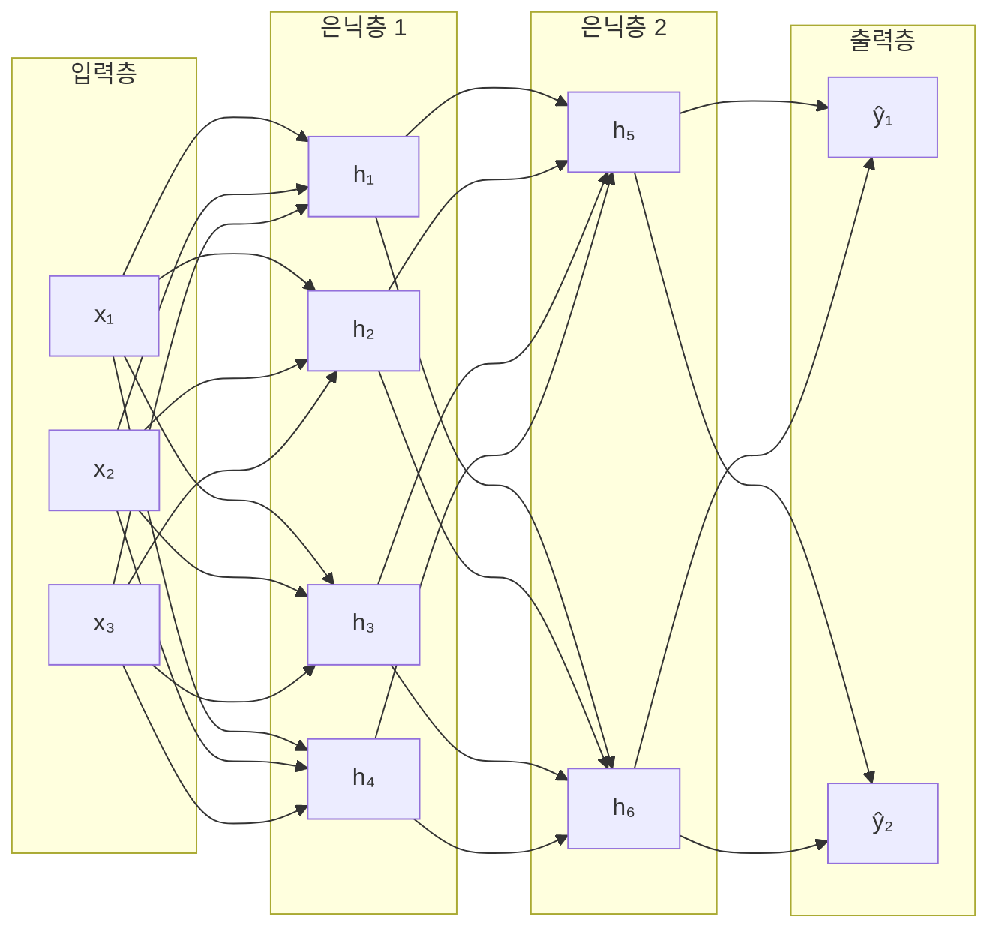
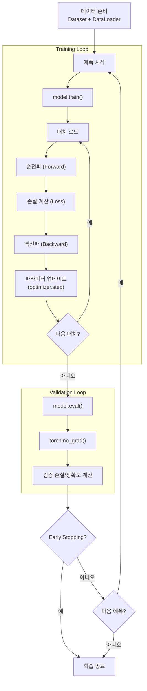

# 제2장: 딥러닝 핵심 원리와 PyTorch 실전

> **미션**: 수업이 끝나면 텍스트 분류 모델을 직접 학습시킨다

## 학습 목표

이 장을 마치면 다음을 수행할 수 있다:

1. 퍼셉트론에서 다층 퍼셉트론(MLP)으로의 발전 과정을 설명할 수 있다
2. 활성화 함수, 손실 함수, 역전파 알고리즘의 역할을 이해한다
3. PyTorch `nn.Module`로 모델을 정의하고 `DataLoader`로 데이터 파이프라인을 구성할 수 있다
4. Training/Validation Loop를 구현하고 과적합을 방지할 수 있다
5. Bag-of-Words 기반 MLP 텍스트 분류 모델을 학습시키고 평가 지표를 해석할 수 있다

### 수업 타임라인

| 시간 | 구분 | 내용 |
|------|------|------|
| 00:00~00:50 | **1교시** | 신경망 기본 구조 + 역전파 |
| 00:50~01:00 | 쉬는시간 | |
| 01:00~01:50 | **2교시** | PyTorch 모델 개발 패턴 + 학습/평가 |
| 01:50~02:00 | 쉬는시간 | |
| 02:00~02:50 | **3교시** | MLP 텍스트 분류 실습 + 과제 |

---

#### 1교시: 신경망 기본 구조

## 2.1 신경망 기본 구조

**직관적 이해**: 신경망은 "레고 블록 조립"과 같다. 뉴런 하나는 단순한 판단기(입력 × 가중치 → 활성화)이지만, 이를 수백만 개 쌓으면 복잡한 패턴을 인식한다. 학습은 "시험을 보고 틀린 문제를 복습하는 과정"이다 — 오답(손실)을 줄이는 방향으로 가중치를 조금씩 고친다.

### 퍼셉트론: 가장 단순한 신경망

퍼셉트론(Perceptron)은 1957년 프랭크 로젠블랫(Frank Rosenblatt)이 제안한 가장 단순한 인공 신경망이다. 입력에 가중치를 곱하고 편향을 더한 뒤, 활성화 함수를 통과시켜 출력을 생성한다. 수식으로 표현하면 다음과 같다:

y = f(w₁x₁ + w₂x₂ + ... + wₙxₙ + b)

여기서 w는 가중치(weight), b는 편향(bias), f는 활성화 함수이다.

퍼셉트론은 AND, OR 같은 간단한 논리 연산을 학습할 수 있다. 다음은 PyTorch로 AND 게이트를 학습한 결과이다:

```python
perceptron = nn.Sequential(nn.Linear(2, 1), nn.Sigmoid())
# ... 100 에폭 학습
```

```
[AND 게이트 학습 결과]
  0 AND 0 = 0.007 (기대값: 0)
  0 AND 1 = 0.145 (기대값: 0)
  1 AND 0 = 0.145 (기대값: 0)
  1 AND 1 = 0.794 (기대값: 1)
```

그러나 퍼셉트론에는 근본적인 한계가 있다. XOR(배타적 논리합)처럼 **선형 분리가 불가능한 문제**를 풀 수 없다. 1000 에폭을 학습해도 모든 출력이 0.500으로 수렴하여 실질적으로 무작위 추측에 그친다:

```
[XOR — 단층 퍼셉트론의 한계]
  0 XOR 0 = 0.500 (기대값: 0) ✗
  0 XOR 1 = 0.500 (기대값: 1) ✗
  1 XOR 0 = 0.500 (기대값: 1) ✗
  1 XOR 1 = 0.500 (기대값: 0) ✗
```

이 문제는 1969년 민스키(Minsky)와 페퍼트(Papert)가 수학적으로 증명하면서 AI 분야에 첫 번째 겨울을 가져왔다.

### 다층 퍼셉트론(MLP): 은닉층이 답이다

해결책은 **은닉층(Hidden Layer)**을 추가하는 것이다. 다층 퍼셉트론(Multi-Layer Perceptron, MLP)은 입력층과 출력층 사이에 하나 이상의 은닉층을 둔다.

**직관적 이해**: 시험에서 한 명의 채점자가 모든 문제를 판단하면 편향이 생길 수 있다. 여러 채점자(은닉 뉴런)가 각자 다른 관점에서 평가한 뒤, 최종 심사위원이 종합 판단하면 더 정확한 결과를 얻는다.



**그림 2.1** 다층 퍼셉트론(MLP) 구조 — 입력층, 은닉층 2개, 출력층

은닉층 4개짜리 MLP로 XOR 문제를 학습하면 완벽하게 해결된다:

```python
mlp = nn.Sequential(
    nn.Linear(2, 4),   # 은닉층 (뉴런 4개)
    nn.ReLU(),
    nn.Linear(4, 1),   # 출력층
    nn.Sigmoid()
)
# 총 파라미터 수: 17
```

```
[XOR 학습 결과 — MLP]
  0 XOR 0 = 0.000 (기대값: 0) ✓
  0 XOR 1 = 1.000 (기대값: 1) ✓
  1 XOR 0 = 0.994 (기대값: 1) ✓
  1 XOR 1 = 0.001 (기대값: 0) ✓
```

_전체 코드는 practice/chapter2/code/2-1-신경망기초.py 참고_

### 활성화 함수: 비선형성의 힘

**직관적 이해**: 활성화 함수가 없는 신경망은, 아무리 층을 깊게 쌓아도 결국 **직선 하나**밖에 그릴 수 없다. 두 개의 선형 변환(Linear)을 곱하면 하나의 선형 변환과 동일하기 때문이다. 활성화 함수가 비선형 "꺾임"을 추가해야 곡선, 원, 복잡한 경계를 학습할 수 있다.

주요 활성화 함수를 비교한다:

**ReLU (Rectified Linear Unit)**: f(x) = max(0, x). 음수는 0, 양수는 그대로 통과시킨다. 계산이 간단하고 수렴이 빠르며, 가장 널리 사용된다.

```
[ReLU] 입력:  [-3.0, -2.0, -1.0, 0.0, 1.0, 2.0, 3.0]
       출력:  [ 0.0,  0.0,  0.0, 0.0, 1.0, 2.0, 3.0]
```

**GELU (Gaussian Error Linear Unit)**: ReLU의 "부드러운" 버전이다. 음수 근처에서 완만하게 0으로 수렴하여 그래디언트 흐름이 더 안정적이다. GPT, BERT 등 Transformer 계열 모델에서 표준으로 사용된다.

```
[GELU] 입력:  [-3.0, -2.0, -1.0, 0.0, 1.0, 2.0, 3.0]
       출력:  [-0.00, -0.05, -0.16, 0.00, 0.84, 1.95, 3.00]
```

**Softmax**: 입력 벡터를 **확률 분포**로 변환한다. 모든 출력의 합이 1이 되므로, 다중 분류의 출력층에 사용한다.

```
[Softmax] 입력 (로짓):  [2.0, 1.0, 0.5]
          출력 (확률):  [0.629, 0.231, 0.140]  (합계: 1.000)
```

**표 2.1** 주요 활성화 함수 비교

| 함수 | 수식 | 출력 범위 | 주요 사용처 |
|------|------|----------|------------|
| ReLU | max(0, x) | [0, ∞) | 은닉층 (일반적) |
| GELU | x · Φ(x) | (-∞, ∞) | Transformer 은닉층 |
| Sigmoid | 1/(1+e⁻ˣ) | (0, 1) | 이진 분류 출력층 |
| Softmax | eˣⁱ/Σeˣʲ | (0, 1) | 다중 분류 출력층 |

### 손실 함수: 정답과의 거리

손실 함수(Loss Function)는 모델의 예측이 정답과 얼마나 다른지를 **하나의 숫자**로 표현한다. 이 숫자를 줄이는 것이 학습의 목표이다.

**Cross-Entropy Loss**: 분류 문제의 표준 손실 함수이다. 정답 클래스에 높은 확률을 부여하면 손실이 낮고, 틀린 클래스에 높은 확률을 부여하면 손실이 급격히 커진다.

```
정답: 클래스 0
좋은 예측 [2.5, -1.0, -0.5] → 손실: 0.0769
나쁜 예측 [-1.0, 2.5, -0.5] → 손실: 3.5769
```

**MSE (Mean Squared Error)**: 회귀 문제의 표준 손실 함수이다. 예측값과 정답의 차이를 제곱하여 평균한다.

```
정답: 3.0
예측 2.8 → MSE: 0.0400  (가까우면 손실 작음)
예측 5.0 → MSE: 4.0000  (멀면 손실 큼)
```

### 경사 하강법과 역전파

경사 하강법(Gradient Descent)은 손실 함수를 최소화하는 파라미터를 찾는 알고리즘이다.

**직관적 이해**: 안개 낀 산에서 가장 빨리 내려가려면, 발밑의 경사를 더듬어 가장 가파르게 내려가는 방향으로 한 걸음씩 옮기면 된다. 여기서 "경사"가 그래디언트이고, "한 걸음 크기"가 학습률(Learning Rate)이다.

역전파(Backpropagation)는 출력에서 입력 방향으로 그래디언트를 전파하여, 각 파라미터가 손실에 얼마나 기여했는지 계산하는 알고리즘이다. 미적분의 연쇄 법칙(Chain Rule)을 활용한다.


**그림 2.2** 순전파와 역전파의 흐름

다음은 y = 2x + 1 관계를 학습하는 역전파 과정을 추적한 것이다:

```python
model = nn.Linear(1, 1)  # y = wx + b
criterion = nn.MSELoss()
optimizer = torch.optim.SGD(model.parameters(), lr=0.01)

# 1 스텝 역전파 추적
output = model(X)          # 1) 순전파
loss = criterion(output, y) # 2) 손실 계산 (MSE = 12.5267)
loss.backward()             # 3) 역전파 (∂L/∂w = -19.3819, ∂L/∂b = -6.5173)
optimizer.step()            # 4) 파라미터 업데이트
```

100 에폭 학습 후 결과:

```
Epoch  25: Loss=0.0092, w=1.9172, b=1.2040
Epoch  50: Loss=0.0063, w=1.9342, b=1.1930
Epoch  75: Loss=0.0054, w=1.9391, b=1.1791
Epoch 100: Loss=0.0046, w=1.9435, b=1.1662

목표: y = 2x + 1
학습 결과: y = 1.94x + 1.17
```

100번의 반복만으로 w가 2에, b가 1에 근접함을 확인할 수 있다. 학습률을 높이거나 에폭을 늘리면 더 정확한 값으로 수렴한다.

_전체 코드는 practice/chapter2/code/2-1-신경망기초.py 참고_

---

#### 2교시: PyTorch 모델 개발과 평가

> **라이브 코딩 시연**: nn.Module 정의 → DataLoader 구성 → Training Loop 실행까지 라이브로 시연한다

## 2.2 PyTorch 모델 개발 패턴

### nn.Module로 모델 정의하기

PyTorch에서 모든 신경망 모델은 `nn.Module` 클래스를 상속받아 정의한다. 두 가지 메서드를 필수로 구현해야 한다:

1. `__init__`: 모델이 사용할 층(layer)을 정의한다
2. `forward`: 입력이 모델을 통과하는 순전파 과정을 정의한다

**직관적 이해**: `nn.Module`은 레고 블록 설계도이다. `__init__`에서 어떤 블록(Linear, ReLU, Dropout 등)을 사용할지 선언하고, `forward`에서 블록을 어떤 순서로 조립할지 정의한다.

```python
class SimpleMLP(nn.Module):
    def __init__(self, input_size, hidden_size, output_size):
        super().__init__()
        self.fc1 = nn.Linear(input_size, hidden_size)
        self.relu = nn.ReLU()
        self.fc2 = nn.Linear(hidden_size, output_size)

    def forward(self, x):
        x = self.fc1(x)
        x = self.relu(x)
        x = self.fc2(x)
        return x
```

```
SimpleMLP(
  (fc1): Linear(in_features=10, out_features=32, bias=True)
  (relu): ReLU()
  (fc2): Linear(in_features=32, out_features=2, bias=True)
)
총 파라미터 수: 418
```

**nn.Sequential**을 사용하면 여러 층을 더 간결하게 구성할 수 있다. 실무에서는 `nn.Sequential`과 개별 층 정의를 혼합하여 사용하는 것이 일반적이다.

```python
class MLPClassifier(nn.Module):
    def __init__(self, input_size, hidden_size, num_classes, dropout=0.2):
        super().__init__()
        self.network = nn.Sequential(
            nn.Linear(input_size, hidden_size),
            nn.BatchNorm1d(hidden_size),
            nn.ReLU(),
            nn.Dropout(dropout),
            nn.Linear(hidden_size, hidden_size // 2),
            nn.BatchNorm1d(hidden_size // 2),
            nn.ReLU(),
            nn.Dropout(dropout),
            nn.Linear(hidden_size // 2, num_classes),
        )

    def forward(self, x):
        return self.network(x)
```

**표 2.2** PyTorch 주요 레이어

| 레이어 | 역할 | 사용 시점 |
|--------|------|----------|
| `nn.Linear` | 완전 연결층 (y = Wx + b) | 모든 MLP |
| `nn.ReLU` / `nn.GELU` | 활성화 함수 | 은닉층 |
| `nn.Dropout` | 무작위 뉴런 비활성화 (과적합 방지) | 학습 시 |
| `nn.BatchNorm1d` | 배치 정규화 (학습 안정화) | 은닉층 |
| `nn.Sequential` | 층 순차 연결 | 간단한 구조 |

**파라미터 초기화**: 가중치 초기화는 학습의 출발점을 결정한다. Xavier 초기화는 시그모이드/tanh에, He 초기화는 ReLU에 적합하다.

```python
def init_weights(m):
    if isinstance(m, nn.Linear):
        nn.init.xavier_uniform_(m.weight)
        if m.bias is not None:
            nn.init.zeros_(m.bias)

model.apply(init_weights)
```

### Dataset과 DataLoader

대규모 데이터를 효율적으로 처리하려면 **배치 단위 로딩**, **셔플링**, **병렬 처리**가 필요하다. PyTorch는 이를 위해 `Dataset`과 `DataLoader`를 제공한다.

`Dataset`은 세 가지 메서드를 구현하여 데이터 접근 인터페이스를 정의한다:

```python
class SyntheticDataset(Dataset):
    def __init__(self, n_samples=1000, n_features=20, n_classes=3):
        # 데이터 초기화
        ...

    def __len__(self):
        return len(self.y)    # 데이터셋 크기

    def __getitem__(self, idx):
        return self.X[idx], self.y[idx]  # 인덱스로 샘플 접근
```

`DataLoader`는 Dataset을 감싸서 배치 처리 기능을 제공한다:

```python
train_loader = DataLoader(train_dataset, batch_size=32, shuffle=True)
val_loader = DataLoader(val_dataset, batch_size=32, shuffle=False)
```

```
데이터셋 크기: 1000
학습: 800, 검증: 200
배치 shape: X=torch.Size([32, 20]), y=torch.Size([32])
```

**주요 파라미터**: `batch_size`는 한 번에 처리할 샘플 수(32, 64, 128 등), `shuffle`은 학습 데이터에 True/검증에 False, `num_workers`는 병렬 로딩 워커 수이다.

### 옵티마이저: 산을 내려가는 전략

옵티마이저(Optimizer)는 그래디언트를 기반으로 파라미터를 업데이트하는 전략이다. 같은 산을 내려가더라도 방법에 따라 속도와 경로가 달라진다.

**직관적 이해**: SGD는 "한 발짝씩 조심히 내려가기", Momentum은 "스키 타듯 관성을 이용", Adam은 "지형을 파악하며 지능적으로 내려가기", AdamW는 "Adam + 불필요한 짐(큰 가중치) 줄이기"이다.

50 에폭 학습 후 옵티마이저별 최종 손실을 비교한다:

```
SGD            : 최종 손실 = 0.0157
SGD+Momentum   : 최종 손실 = 0.0014
Adam           : 최종 손실 = 0.0021
AdamW          : 최종 손실 = 0.0022
```

SGD만 사용할 경우 수렴이 느리며, Momentum을 추가하면 크게 개선된다. Adam과 AdamW는 빠르게 수렴하며, 특히 **AdamW는 BERT, GPT 등 대규모 모델 학습에서 표준 옵티마이저**이다.

**학습률 스케줄러**: 학습 과정에서 학습률을 동적으로 조절하면 더 나은 수렴을 달성할 수 있다.

| 스케줄러 | 동작 | 사용 시점 |
|---------|------|----------|
| `StepLR` | 일정 에폭마다 감소 | 간단한 실험 |
| `CosineAnnealingLR` | 코사인 곡선으로 감소 | Transformer 학습 |
| `ReduceLROnPlateau` | 성능 정체 시 감소 | 불확실한 최적 에폭 |

_전체 코드는 practice/chapter2/code/2-2-모델개발.py 참고_

## 2.3 모델 학습과 평가

### Training Loop와 Validation Loop

딥러닝 모델 학습은 두 루프의 반복으로 이루어진다.

**Training Loop**: 학습 데이터로 모델을 학습시킨다. 각 배치에 대해 순전파 → 손실 계산 → 역전파 → 업데이트를 수행한다.

```python
def train_epoch(model, dataloader, criterion, optimizer, device):
    model.train()  # 학습 모드 (Dropout, BatchNorm 활성화)
    for batch_X, batch_y in dataloader:
        batch_X, batch_y = batch_X.to(device), batch_y.to(device)
        optimizer.zero_grad()           # 1. 그래디언트 초기화
        outputs = model(batch_X)        # 2. 순전파
        loss = criterion(outputs, batch_y)  # 3. 손실 계산
        loss.backward()                 # 4. 역전파
        optimizer.step()                # 5. 파라미터 업데이트
```

**Validation Loop**: 검증 데이터로 모델 성능을 평가한다. 그래디언트 계산이 필요 없으므로 `torch.no_grad()`로 비활성화한다.

```python
def validate(model, dataloader, criterion, device):
    model.eval()   # 평가 모드 (Dropout 비활성화)
    with torch.no_grad():
        for batch_X, batch_y in dataloader:
            outputs = model(batch_X)
            loss = criterion(outputs, batch_y)
```



**그림 2.3** Training Loop 전체 흐름

실행 결과:

```
Epoch [10/50] Train Loss: 0.0273, Acc: 100.0% | Val Loss: 0.0131, Acc: 100.0%
Epoch [20/50] Train Loss: 0.0107, Acc: 100.0% | Val Loss: 0.0032, Acc: 100.0%
Epoch [30/50] Train Loss: 0.0077, Acc: 100.0% | Val Loss: 0.0018, Acc: 100.0%
Epoch [40/50] Train Loss: 0.0046, Acc: 100.0% | Val Loss: 0.0013, Acc: 100.0%
Epoch [50/50] Train Loss: 0.0049, Acc: 100.0% | Val Loss: 0.0013, Acc: 100.0%

최고 검증 정확도: 100.00%
```

### 과적합과 방지 기법

과적합(Overfitting)은 모델이 학습 데이터에 과도하게 맞춰져 새로운 데이터에 대한 일반화 성능이 떨어지는 현상이다.

**직관적 이해**: 과적합은 "시험 기출문제만 외운 학생"과 같다. 기출은 100점이지만 새 문제를 못 푼다. 학습 손실은 감소하는데 검증 손실이 증가하기 시작하면 과적합이 발생한 것이다.

**표 2.3** 과적합 방지 기법

| 기법 | 원리 | PyTorch 코드 |
|------|------|-------------|
| **Dropout** | 무작위 뉴런 비활성화 → 앙상블 효과 | `nn.Dropout(0.2)` |
| **Weight Decay** | 큰 가중치에 패널티 → 단순한 모델 유도 | `AdamW(weight_decay=0.01)` |
| **BatchNorm** | 배치 정규화 → 학습 안정화 | `nn.BatchNorm1d(64)` |
| **Early Stopping** | 검증 손실 정체 시 학습 중단 | `EarlyStopping(patience=10)` |

Early Stopping은 가장 간단하면서 효과적인 과적합 방지 기법이다:

```python
class EarlyStopping:
    def __init__(self, patience=5, min_delta=0):
        self.patience = patience      # 기다릴 에폭 수
        self.counter = 0
        self.best_loss = None
        self.early_stop = False

    def __call__(self, val_loss):
        if self.best_loss is None:
            self.best_loss = val_loss
        elif val_loss > self.best_loss - self.min_delta:
            self.counter += 1
            if self.counter >= self.patience:
                self.early_stop = True
        else:
            self.best_loss = val_loss
            self.counter = 0
        return self.early_stop
```

### 분류 평가 지표

분류 모델을 평가할 때 정확도(Accuracy)만으로는 불충분하다. 특히 데이터가 불균형할 때 오해의 소지가 크다.

**직관적 이해**: 암 검진에서 환자 100명 중 암 환자가 2명이라면, "모두 정상"이라고 예측해도 정확도 98%이다. 하지만 실제로 암 환자를 한 명도 찾아내지 못한 것이므로 쓸모없는 모델이다. 이때 Precision과 Recall이 유용하다.

| 지표 | 의미 | 비유 |
|------|------|------|
| **Accuracy** | 전체 중 맞춘 비율 | 전체 시험 점수 |
| **Precision** | 양성 예측 중 실제 양성 | "양성이라 했는데 진짜 양성?" |
| **Recall** | 실제 양성 중 탐지 비율 | "진짜 양성을 얼마나 찾았나?" |
| **F1-Score** | Precision × Recall 조화 평균 | 두 지표의 균형 |

F1 = 2 × (Precision × Recall) / (Precision + Recall)

**Confusion Matrix**는 분류 결과를 2차원 표로 나타낸 것이다:

|  | 예측: 음성 | 예측: 양성 |
|---|:---:|:---:|
| 실제: 음성 | TN (True Negative) | FP (False Positive) |
| 실제: 양성 | FN (False Negative) | TP (True Positive) |

**표 2.4** Confusion Matrix 구조

_전체 코드는 practice/chapter2/code/2-2-모델개발.py 참고_

---

#### 3교시: 텍스트 분류 실습

> **Copilot 활용**: "PyTorch nn.Module로 3층 MLP 텍스트 분류 모델을 작성해줘"로 시작하고, Copilot이 생성한 `forward()` 메서드의 각 층이 하는 역할을 분석한다.

## 2.4 실습: 텍스트 분류 파이프라인

이 절에서는 2.1~2.3에서 학습한 내용을 종합하여, 영화 리뷰 감성 분석(긍정/부정) 모델을 처음부터 끝까지 구현한다.

### 텍스트 전처리와 어휘 사전

텍스트를 신경망에 입력하려면 숫자 벡터로 변환해야 한다. 첫 단계는 **토큰화(Tokenization)**와 **어휘 사전(Vocabulary)** 구축이다.

```python
def _build_vocab(self, texts, max_vocab_size):
    word_counts = Counter()
    for text in texts:
        word_counts.update(text.split())

    vocab = {"<PAD>": 0, "<UNK>": 1}  # 특수 토큰
    for word, _ in word_counts.most_common(max_vocab_size - 2):
        vocab[word] = len(vocab)
    return vocab
```

`<PAD>`는 패딩 토큰, `<UNK>`는 미등록 단어를 나타내는 특수 토큰이다. 한국어 영화 리뷰 40개(긍정 20, 부정 20)에서 구축한 어휘 사전의 크기는 82이다.

```
어휘 샘플: [('<PAD>', 0), ('<UNK>', 1), ('영화', 2), ('정말', 3),
           ('별로다', 4), ('좋은', 5), ('감동', 6), ('재미없다', 7)]
```

### Bag-of-Words 벡터화

Bag-of-Words(BoW)는 텍스트를 **단어 빈도 벡터**로 표현하는 가장 간단한 방법이다. 각 문서는 어휘 사전 크기의 벡터로 변환되며, 각 차원은 해당 단어의 출현 빈도를 나타낸다.

```python
def _text_to_bow(self, text):
    bow = np.zeros(self.vocab_size, dtype=np.float32)
    for word in text.split():
        idx = self.vocab.get(word, self.vocab["<UNK>"])
        bow[idx] += 1
    # L2 정규화
    norm = np.linalg.norm(bow)
    if norm > 0:
        bow = bow / norm
    return bow
```

L2 정규화를 적용하여 문서 길이에 따른 편향을 제거한다. BoW의 장점은 구현이 간단하고 기본적인 분류에 효과적이라는 것이다. 단점은 단어의 순서 정보가 손실된다는 것인데, 이는 3장 이후에서 다루는 시퀀스 모델과 임베딩으로 해결한다.

### MLP 감성 분석 모델

BoW 벡터를 입력으로 받아 긍정(1)/부정(0)을 분류하는 3층 MLP 모델이다:

```python
class TextClassifier(nn.Module):
    def __init__(self, vocab_size, hidden_size, num_classes, dropout=0.3):
        super().__init__()
        self.classifier = nn.Sequential(
            nn.Linear(vocab_size, hidden_size),     # 82 → 64
            nn.ReLU(),
            nn.Dropout(dropout),
            nn.Linear(hidden_size, hidden_size // 2), # 64 → 32
            nn.ReLU(),
            nn.Dropout(dropout),
            nn.Linear(hidden_size // 2, num_classes),  # 32 → 2
        )

    def forward(self, x):
        return self.classifier(x)
```

```
총 파라미터 수: 7,458
학습: 32 샘플, 검증: 8 샘플
```

### 학습 및 평가 결과

30 에폭 학습 결과:

```
Epoch [10/30] Train Loss: 0.6655, Acc: 84.4% | Val Loss: 0.6940, Acc: 37.5%
Epoch [20/30] Train Loss: 0.5294, Acc: 100.0% | Val Loss: 0.6667, Acc: 50.0%
Epoch [30/30] Train Loss: 0.2439, Acc: 100.0% | Val Loss: 0.5154, Acc: 87.5%
```

학습이 진행되면서 학습 정확도가 빠르게 100%에 도달하고, 검증 정확도도 점진적으로 상승하는 것을 확인할 수 있다. 최종 검증 정확도는 87.5%이다.

평가 지표:

```
Accuracy:  0.8750
Precision: 1.0000
Recall:    0.8000
F1-Score:  0.8889
```

Precision이 1.0으로, 모델이 긍정으로 예측한 것은 모두 실제 긍정이다. Recall이 0.8로, 실제 긍정 5건 중 4건을 올바르게 탐지했다.

Confusion Matrix:

```
           Predicted
           Neg   Pos
Actual Neg    3     0
       Pos    1     4
```

FP(거짓 양성)가 0이고 FN(거짓 음성)이 1인데, 이는 모델이 보수적으로 예측하여 긍정을 부정으로 잘못 분류한 사례가 1건 있음을 보여준다.

### 새로운 텍스트 예측

학습된 모델로 본 적 없는 리뷰를 예측한다:

```
'정말 재미있는 영화다'  → 긍정 (신뢰도: 57.2%)
'지루하고 별로다'       → 부정 (신뢰도: 87.7%)
'최고의 명작 강력 추천' → 긍정 (신뢰도: 66.2%)
'시간 낭비 최악의 영화' → 부정 (신뢰도: 63.3%)
```

4건 모두 올바르게 분류했다. 부정 리뷰의 신뢰도가 높고, 긍정 리뷰의 신뢰도가 상대적으로 낮은 것은 학습 데이터가 40건으로 매우 적기 때문이다. 데이터를 늘리면 신뢰도도 함께 향상된다.

> **강의 팁**: 학생들이 직접 리뷰를 입력하여 예측 결과를 확인하게 하면 흥미를 유발할 수 있다.

_전체 코드는 practice/chapter2/code/2-4-텍스트분류.py 참고_

**과제**: IMDb 영화 리뷰 감성 분류

1. HuggingFace `datasets` 라이브러리에서 IMDb 데이터셋을 로드한다
2. Bag-of-Words 벡터화를 적용하여 MLP 감성 분류 모델을 학습시킨다
3. 하이퍼파라미터(hidden_size, dropout, learning_rate)를 변경하며 실험한다
4. Accuracy, Precision, Recall, F1-Score를 계산하고 Confusion Matrix를 해석한다
5. 성능 분석 보고서를 작성한다 (A4 1페이지)

---

## 핵심 정리

이 장에서 다룬 핵심 내용을 정리하면 다음과 같다:

- **퍼셉트론**은 가장 단순한 신경망이지만 XOR 같은 비선형 문제를 풀 수 없다. **다층 퍼셉트론(MLP)**은 은닉층을 추가하여 이 한계를 극복한다
- **활성화 함수**는 비선형성을 추가하는 핵심 요소이다. ReLU가 가장 널리 사용되고, GELU는 Transformer에서 표준이다
- **손실 함수**는 예측과 정답의 거리를 측정한다. 분류는 Cross-Entropy, 회귀는 MSE를 사용한다
- **역전파**는 출력에서 입력 방향으로 그래디언트를 전파하여 각 파라미터가 손실에 기여한 정도를 계산한다
- **nn.Module**은 `__init__`에서 층을 정의하고 `forward`에서 순전파를 정의하는 PyTorch 모델의 기본 클래스이다
- **Dataset/DataLoader**는 배치 처리, 셔플링, 병렬 로딩을 제공하는 데이터 파이프라인이다
- **AdamW**는 Weight Decay를 분리 적용하는 옵티마이저로, 대규모 모델 학습에 권장된다
- **과적합 방지**에는 Dropout, BatchNorm, Weight Decay, Early Stopping을 사용한다
- **평가 지표**로 Accuracy, Precision, Recall, F1-Score를 사용하며, Confusion Matrix로 오류 패턴을 분석한다
- **Bag-of-Words**는 텍스트를 단어 빈도 벡터로 변환하는 가장 간단한 방법이며, MLP와 결합하여 텍스트 분류를 수행할 수 있다

---

## 더 알아보기

이 장의 내용을 더 깊이 학습하려면 다음 자료를 참고하라:

- PyTorch 공식 튜토리얼 — Building Models: https://pytorch.org/tutorials/beginner/basics/buildmodel_tutorial.html
- 3Blue1Brown "Neural Networks" 시리즈: https://www.youtube.com/playlist?list=PLZHQObOWTQDNU6R1_67000Dx_ZCJB-3pi
- PyTorch Datasets & DataLoaders 튜토리얼: https://pytorch.org/tutorials/beginner/basics/data_tutorial.html
- Andrej Karpathy — "Yes, you should understand backprop": https://karpathy.medium.com/yes-you-should-understand-backprop-e2f06eab496b

---

## 다음 장 예고

다음 장에서는 **시퀀스 모델에서 Transformer로**의 발전을 학습한다. 단어 임베딩(Word2Vec)으로 단어에 의미를 부여하고, RNN/LSTM의 순차 처리 방식과 한계를 이해한 뒤, Attention 메커니즘의 Query-Key-Value 개념을 익힌다. 최종적으로 Self-Attention과 Multi-Head Attention을 구현하고, Attention Weight를 시각화하여 모델이 문장의 어디에 집중하는지 분석한다.

---

## 참고문헌

1. Rosenblatt, F. (1958). The Perceptron: A Probabilistic Model for Information Storage and Organization in the Brain. *Psychological Review*, 65(6), 386-408.
2. Minsky, M. & Papert, S. (1969). *Perceptrons: An Introduction to Computational Geometry*. MIT Press.
3. Rumelhart, D.E., Hinton, G.E. & Williams, R.J. (1986). Learning representations by back-propagating errors. *Nature*, 323, 533-536. https://doi.org/10.1038/323533a0
4. Kingma, D.P. & Ba, J. (2014). Adam: A Method for Stochastic Optimization. *arXiv*. https://arxiv.org/abs/1412.6980
5. Loshchilov, I. & Hutter, F. (2019). Decoupled Weight Decay Regularization. *ICLR 2019*. https://arxiv.org/abs/1711.05101
6. Srivastava, N. et al. (2014). Dropout: A Simple Way to Prevent Neural Networks from Overfitting. *JMLR*, 15(56), 1929-1958.
7. PyTorch Documentation. https://pytorch.org/docs/
