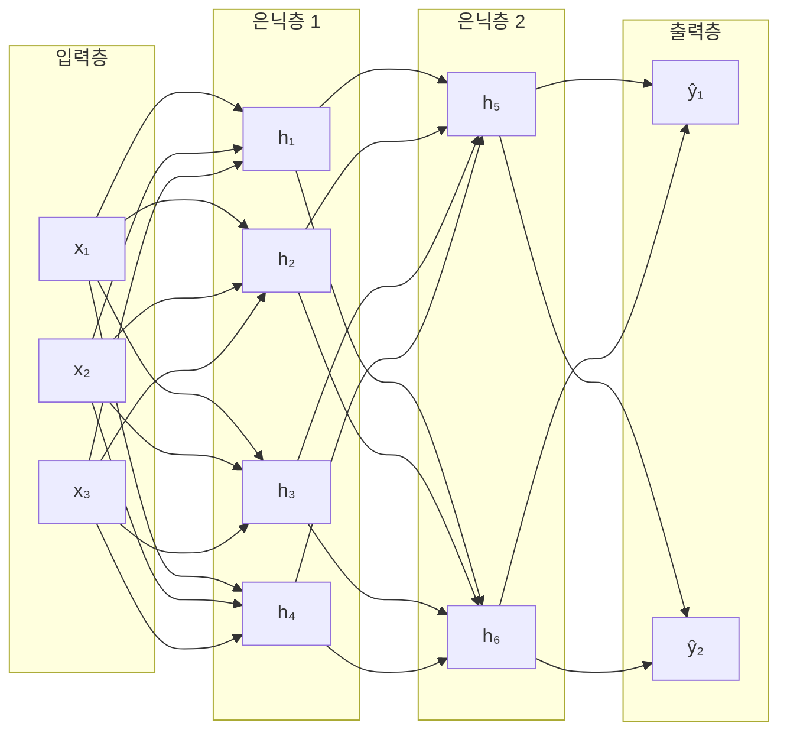
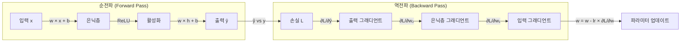

## 2주차 A회차: 딥러닝 핵심 원리와 신경망 기초

> **미션**: 수업이 끝나면 퍼셉트론에서 다층 퍼셉트론(MLP)으로의 발전을 이해하고, 역전파 알고리즘이 어떻게 작동하는지 설명할 수 있으며, PyTorch의 `nn.Module` 패턴으로 모델을 구축하는 기초를 닦을 수 있다

### 학습목표

이 회차를 마치면 다음을 수행할 수 있다:

1. 퍼셉트론의 구조와 한계(XOR 문제)를 설명할 수 있다
2. 은닉층이 어떻게 비선형 문제를 해결하는지 이해한다
3. 활성화 함수(ReLU, GELU, Softmax)의 역할과 필요성을 설명할 수 있다
4. 손실 함수와 경사 하강법의 원리를 이해한다
5. 역전파 알고리즘으로 그래디언트가 계산되는 과정을 추적할 수 있다
6. PyTorch `nn.Module`, 손실 함수, 옵티마이저의 기본 패턴을 구현할 수 있다
7. 학습률(Learning Rate)과 배치 크기(Batch Size) 같은 하이퍼파라미터의 역할을 이해한다

### 수업 타임라인

| 시간        | 내용                                                  | Copilot 사용                  |
| ----------- | ----------------------------------------------------- | ----------------------------- |
| 00:00~00:05 | 오늘의 질문 + 빠른 진단(퀴즈 1문항)                   | 사용 안 함                    |
| 00:05~00:55 | 이론 강의 (직관적 비유 → 개념 → 원리)                 | 사용 안 함                    |
| 00:55~01:25 | 라이브 코딩 시연 (nn.Module MLP 정의 + 역전파 + 평가) | 직접 실습 또는 시연 영상 참고 |
| 01:25~01:28 | 핵심 정리 + B회차 과제 스펙 공개                      |                               |
| 01:28~01:30 | Exit ticket (1문항)                                   |                               |

---

### 오늘의 질문 + 빠른 진단

**오늘의 질문**: "컴퓨터가 '동그란 그림'과 '네모난 그림'을 구분하려면, 어떤 규칙이 필요할까? 단순한 규칙 하나로 충분할까?"

**빠른 진단 (1문항)**:

다음 두 점을 분류하는 문제를 생각해 보자:

- 점 A: (0, 0) — 파란색
- 점 B: (1, 1) — 빨간색

그리고 다음 네 점을 분류하는 문제를 생각해 보자:

- 점 1: (0, 0) — 파란색
- 점 2: (1, 0) — 빨간색
- 점 3: (0, 1) — 빨간색
- 점 4: (1, 1) — 파란색 (XOR 패턴)

두 번째 문제가 첫 번째보다 어려운 이유는?

① 데이터가 많아서
② 직선 하나로는 두 색깔을 완벽히 분리할 수 없어서
③ 색상 수가 많아서
④ 딥러닝이 없어서

정답: ② — 이것이 은닉층이 필요한 이유이다.

---

### 이론 강의

#### 2.1 신경망 기본 구조

##### 뉴런: 가장 단순한 판단기

**직관적 이해**: 신경망은 "레고 블록을 쌓아서 복잡한 형태를 만드는 것"과 같다. 뉴런 하나는 단순한 판단기이지만, 이를 수백만 개 쌓으면 복잡한 패턴을 인식한다. 학습은 "시험을 보고 틀린 문제를 다시 풀어보는 과정"이다 — 틀린 부분(손실)을 줄이는 방향으로 가중치를 조금씩 고친다. 마치 골퍼가 샷을 날린 후 공의 위치를 보고 다음 샷의 힘과 각도를 조정하는 것처럼.

뉴런의 기본 동작은 다음과 같다:

1. 입력값들에 가중치를 곱한다
2. 가중치를 곱한 값들을 모두 더한다
3. 편향(bias)을 더한다
4. 활성화 함수를 통과시킨다

수식으로 표현하면:

y = f(w₁x₁ + w₂x₂ + ... + wₙxₙ + b)

여기서:

- x₁, x₂, ..., xₙ은 입력값
- w₁, w₂, ..., wₙ은 가중치(weight)
- b는 편향(bias)
- f는 활성화 함수(activation function)

이 식이 말하는 것은 결국, **입력을 가중합한 결과를 어떤 함수로 변환하여 출력한다**는 뜻이다.

##### 퍼셉트론: 가장 단순한 신경망

**퍼셉트론(Perceptron)**은 1957년 프랭크 로젠블랫(Frank Rosenblatt)이 제안한 가장 단순한 인공 신경망이다. 퍼셉트론은 입력에 가중치를 곱하고, 편향을 더한 뒤, 활성화 함수를 통과시켜 0 또는 1의 이진 출력을 생성한다.

**직관적 이해**: 퍼셉트론을 "선거 투표"로 생각해 보자. 여러 정책(입력)이 있고, 각 정책의 중요도가 다르다(가중치). 중요한 정책에 높은 가중치를 두고 모두 더한 점수가 기준점을 넘으면 "찬성(1)", 아니면 "반대(0)"를 투표한다. 이것이 퍼셉트론의 작동 방식이다.

퍼셉트론은 AND, OR 같은 간단한 논리 연산을 학습할 수 있다. 다음은 PyTorch로 AND 게이트를 학습한 결과이다:

```
[AND 게이트 학습 결과]
  0 AND 0 = 0.007 (기대값: 0) ✓
  0 AND 1 = 0.145 (기대값: 0) ✓
  1 AND 0 = 0.145 (기대값: 0) ✓
  1 AND 1 = 0.794 (기대값: 1) ✓
```

AND 문제는 간단하므로 퍼셉트론이 완벽하게 학습한다.

**그래서 무엇이 달라지는가?** 퍼셉트론은 기본적으로 입력을 **하나의 직선으로만 분류**할 수 있다. 즉, 선형 분리가 가능한 문제만 풀 수 있다는 뜻이다. 예를 들어, y = ax + b 형태의 경계선 하나로만 두 클래스를 나눌 수 있다. 2차원 평면에서 봤을 때, 모든 직선은 한 번의 직선 그리기로 표현되므로, 더 복잡한 곡선이나 비선형 경계는 표현할 수 없다.

##### 퍼셉트론의 한계: XOR 문제

하지만 모든 문제가 직선 하나로 분리되는 것은 아니다. **XOR(배타적 논리합)** 문제를 생각해 보자:

- 0 XOR 0 = 0 (둘 다 같으면 거짓)
- 0 XOR 1 = 1 (서로 다르면 참)
- 1 XOR 0 = 1 (서로 다르면 참)
- 1 XOR 1 = 0 (둘 다 같으면 거짓)

2차원 평면에 이 점들을 그려보면:

- (0, 0) — 파란색
- (1, 0) — 빨간색
- (0, 1) — 빨간색
- (1, 1) — 파란색

이 패턴을 **하나의 직선**으로 분리할 수 있을까? 아니다. 어디에 직선을 그어도 한쪽에는 두 색깔이 섞여있다. 최선의 경우도 (0.5, 0.5)를 지나는 대각선인데, 이것도 빨간 점 하나를 파란쪽으로 분류하고 파란 점 하나를 빨간쪽으로 분류한다.

퍼셉트론으로 XOR 문제를 풀려고 시도하면:

```
[XOR — 단층 퍼셉트론의 한계]
  0 XOR 0 = 0.500 (기대값: 0) ✗
  0 XOR 1 = 0.500 (기대값: 1) ✗
  1 XOR 0 = 0.500 (기대값: 1) ✗
  1 XOR 1 = 0.500 (기대값: 0) ✗
```

아무리 학습해도 모든 출력이 0.5(무작위 추측)에 수렴한다. 이 문제는 1969년 민스키(Minsky)와 페퍼트(Papert)가 수학적으로 증명하면서 AI 분야에 첫 번째 겨울(AI Winter)을 가져왔다. 수십 년 동안 신경망 연구가 정체되었던 시기이다.

> **쉽게 말해서**: 당신이 사진을 구분하는 규칙을 "사진이 주황색이면 오렌지, 아니면 오렌지가 아님"처럼 단순하게 만든다면, 일부 오렌지를 놓치고 다른 오렌지가 아닌 것도 오렌지라고 잘못 판단한다. 더 정교한 규칙(여러 조건의 결합)이 필요하다. 마치 식별용 신분증을 만들 때 "키가 170cm 이상이면 키가 큰 사람"이 아니라 "키, 눈 색깔, 얼굴형, 특이점" 등을 종합적으로 본다. 퍼셉트론이 XOR를 풀 수 없는 이유도 똑같다.

##### 다층 퍼셉트론(MLP): 은닉층이 답이다

해결책은 **은닉층(Hidden Layer)**을 추가하는 것이다. **다층 퍼셉트론(Multi-Layer Perceptron, MLP)**은 입력층과 출력층 사이에 하나 이상의 은닉층을 둔다.

**직관적 이해**: 시험 채점을 생각해 보자. 한 명의 채점자(단층)가 모든 문제를 판단하면 편향이 생길 수 있다. 하지만 여러 명의 채점자(은닉 뉴런)가 각자 다른 관점에서 평가한 뒤, 최종 심사위원(출력층)이 종합 판단하면 더 정확한 결과를 얻는다. 또는 건축가가 집을 설계할 때, 한 사람의 생각만으로는 무언가 빠질 수 있지만, 구조 엔지니어, 인테리어 디자이너, 건축가가 각각 자신의 전문 분야에서 평가한 결과를 종합하면 좋은 집이 완성되는 것처럼.



**그림 2.1** 다층 퍼셉트론(MLP) 구조 — 입력층, 은닉층 2개, 출력층

MLP의 핵심은, 은닉층의 뉴런들이 **입력을 다양한 관점에서 변환**한다는 것이다. 첫 번째 은닉층이 입력을 중간 표현으로 변환하고, 두 번째 은닉층이 그 중간 표현을 다시 변환하여, 출력층이 최종 판단을 내린다. 이를 **표현 학습(Representation Learning)**이라 한다. 각 층이 입력을 점진적으로 더 추상적인 형태로 변환한다.

XOR 문제를 다시 풀어보자. 은닉층 4개 뉴런을 가진 MLP는 이 문제를 **완벽하게 해결**한다:

```python
mlp = nn.Sequential(
    nn.Linear(2, 4),     # 은닉층 (뉴런 4개)
    nn.ReLU(),
    nn.Linear(4, 1),     # 출력층
    nn.Sigmoid()
)
# 총 파라미터 수: 17
```

```
[XOR 학습 결과 — MLP]
  0 XOR 0 = 0.000 (기대값: 0) ✓
  0 XOR 1 = 1.000 (기대값: 1) ✓
  1 XOR 0 = 0.994 (기대값: 1) ✓
  1 XOR 1 = 0.001 (기대값: 0) ✓
```

MLP는 XOR 패턴을 완벽하게 학습한다. 17개의 파라미터만으로 퍼셉트론이 풀 수 없던 문제를 해결한 것이다.

**그래서 무엇이 달라지는가?** 퍼셉트론은 입력을 하나의 직선으로만 분리할 수 있었다. MLP는 은닉층을 통해 입력 공간을 여러 번 변환하므로, 복잡한 곡선과 원, 나선 같은 비선형 경계를 학습할 수 있다. 이것이 은닉층이 신경망을 강력하게 만드는 이유이다. 첫 은닉층이 선형 경계를 만들고, 두 번째 은닉층이 그 경계들을 다시 결합하여 더 복잡한 형태를 만든다.

_전체 코드는 practice/chapter2/code/2-1-신경망기초.py 참고_

#### 2.2 활성화 함수: 비선형성의 힘

은닉층이 없어도 손실이 줄어들지 않는 이유는 무엇일까? 그 답은 **활성화 함수**에 있다.

**직관적 이해**: 활성화 함수가 없는 신경망은, 아무리 층을 깊게 쌓아도 결국 **직선 하나**밖에 그릴 수 없다. 왜냐하면 두 개의 선형 변환을 곱하면 하나의 선형 변환과 동일하기 때문이다. 예를 들어, y = 2x와 z = 3y를 연결하면 z = 6x가 되어, 결국 하나의 선형 함수이다. 마치 "그림을 크레용으로 따라 그린 후, 그 그림을 다시 크레용으로 따라 그려도 결국은 직선"인 것처럼. **활성화 함수가 비선형 "꺾임"을 추가**해야 곡선, 원, 복잡한 경계를 학습할 수 있다. 예를 들어, ReLU는 원점에서 꺾이는 함수이므로, 이런 꺾임 때문에 곱해져도 비선형성이 유지된다.

##### ReLU: 가장 널리 사용되는 활성화 함수

**ReLU (Rectified Linear Unit)**는 f(x) = max(0, x)로 정의된다. 간단히 말해, 음수는 0으로, 양수는 그대로 통과시킨다.

```
[ReLU] 입력:  [-3.0, -2.0, -1.0, 0.0, 1.0, 2.0, 3.0]
       출력:  [ 0.0,  0.0,  0.0, 0.0, 1.0, 2.0, 3.0]
```

ReLU의 장점:

- **계산이 간단**: 단순히 음수를 0으로 처리하면 된다
- **수렴이 빠름**: 복잡한 지수 함수가 없어 역전파가 빠르다
- **희소성(Sparsity)**: 일부 뉴런만 활성화되므로 계산 효율이 좋다
- **기울기 전파 안정적**: 음수에서는 기울기 0, 양수에서는 기울기 1로 명확하다

ReLU는 이러한 이유로 현재 가장 널리 사용되는 활성화 함수이다. Sigmoid나 tanh는 지수 함수를 포함하여 계산이 느렸고, 입력이 크면 기울기가 0에 가까워지는 "기울기 소실(Vanishing Gradient)" 문제가 있었다. ReLU는 이런 문제를 해결했다.

##### GELU: Transformer의 표준

**GELU (Gaussian Error Linear Unit)**는 ReLU의 "부드러운" 버전이다. 음수 근처에서 완만하게 0으로 수렴하여 그래디언트 흐름이 더 안정적이다.

```
[GELU] 입력:  [-3.0, -2.0, -1.0, 0.0, 1.0, 2.0, 3.0]
       출력:  [-0.00, -0.05, -0.16, 0.00, 0.84, 1.95, 3.00]
```

ReLU와의 핵심 차이는:

- ReLU는 음수에서 급격히 0으로 떨어진다 (불연속 미분)
- GELU는 음수에서 부드럽게 0에 접근한다 (매끄러운 곡선)

GELU는 이렇게 부드럽게 변하므로 기울기가 더 안정적으로 흐른다. GPT, BERT 등 최신 Transformer 모델들이 GELU를 표준으로 사용한다. 특히 큰 모델에서는 이런 미세한 안정성 차이가 수렴 속도에 큰 영향을 미친다.

> **쉽게 말해서**: ReLU는 "절벽", GELU는 "경사면"이라 생각하면 된다. 절벽에서는 발을 헛디딜 위험이 있지만, 경사면은 조금 더 안전하게 내려갈 수 있다.

##### Softmax: 다중 분류를 위한 함수

**Softmax**는 입력 벡터를 **확률 분포**로 변환한다. 모든 출력의 합이 1이 되므로, 다중 분류(여러 클래스 중 하나) 문제의 출력층에서 사용된다.

```
[Softmax] 입력 (로짓):  [2.0, 1.0, 0.5]
          출력 (확률):  [0.629, 0.231, 0.140]  (합계: 1.000)
```

구체적으로, 3개 클래스의 로짓(활성화되지 않은 값) [2.0, 1.0, 0.5]를 softmax에 넣으면:

softmax(x) = eˣ / Σeˣ

각각 계산하면:

- e^2.0 ≈ 7.389
- e^1.0 ≈ 2.718
- e^0.5 ≈ 1.649
- 합: 11.756

정규화하면:

- 7.389 / 11.756 ≈ 0.628
- 2.718 / 11.756 ≈ 0.231
- 1.649 / 11.756 ≈ 0.140

Softmax의 특징:

- 모든 출력이 0~1 사이의 값
- 모든 출력의 합이 정확히 1
- 큰 입력값이 더 극단적으로 큰 확률이 됨 (단, 가중치는 부드러움)

**그래서 무엇이 달라지는가?** 출력층에서 활성화 함수를 사용하지 않으면 로짓은 음수도 양수도 될 수 있고, 합이 1이 아니므로 "확률"로 해석할 수 없다. Softmax를 사용하면 3개 클래스 중 어느 클래스가 가장 가능성 높은지를 "확률"로 표현할 수 있다.

**표 2.1** 주요 활성화 함수 비교

| 함수    | 수식      | 출력 범위 | 주요 사용처          |
| ------- | --------- | --------- | -------------------- |
| ReLU    | max(0, x) | [0, ∞)    | 은닉층 (가장 일반적) |
| GELU    | x · Φ(x)  | (-∞, ∞)   | Transformer 은닉층   |
| Sigmoid | 1/(1+e⁻ˣ) | (0, 1)    | 이진 분류 출력층     |
| Softmax | eˣⁱ/Σeˣʲ  | (0, 1)    | 다중 분류 출력층     |

> **쉽게 말해서**: 활성화 함수 없이 신경망 층을 여러 개 쌓아봤자, 결국 하나의 큰 일차 함수가 되어버린다. 활성화 함수가 비선형 "꺾임"을 넣어야 복잡한 패턴을 학습할 수 있다.

#### 2.3 손실 함수와 경사 하강법

신경망을 어떻게 배워야 할까? 핵심은 **손실 함수(Loss Function)**이다. 손실 함수는 모델의 예측이 정답과 얼마나 다른지를 **하나의 숫자**로 표현한다. 학습의 목표는 이 손실을 최소화하는 것이다.

##### 손실 함수: 예측과 정답의 거리

**Cross-Entropy Loss**는 분류 문제의 표준 손실 함수이다. 정답 클래스에 높은 확률을 부여하면 손실이 낮고, 틀린 클래스에 높은 확률을 부여하면 손실이 급격히 커진다.

```
정답: 클래스 0
좋은 예측   [2.5, -1.0, -0.5] → softmax → [0.90, 0.05, 0.05] → 손실: 0.0769
나쁜 예측   [-1.0, 2.5, -0.5] → softmax → [0.05, 0.90, 0.05] → 손실: 3.5769
```

좋은 예측은 정답 클래스 0에 높은 점수(2.5)를 주므로 softmax 후 확률이 0.90이 되어 손실이 작다. 나쁜 예측은 틀린 클래스 1에 높은 점수를 주므로 손실이 크다.

구체적으로, Cross-Entropy는 다음과 같이 계산된다:

Loss = -log(softmax[정답 클래스])

정답 클래스의 확률이 0.9이면:

- Loss = -log(0.9) ≈ 0.105

정답 클래스의 확률이 0.1이면:

- Loss = -log(0.1) ≈ 2.303

즉, 정답 클래스를 정확히 예측할수록 손실이 0에 가까워진다.

**그래서 무엇이 달라지는가?** 정답과의 오차를 그냥 "맞는가 틀리는가"로 측정하면 경사도 기울기도 없어서 학습이 불가능하다. 손실 함수를 사용하면 예측이 조금 틀렸을 때와 많이 틀렸을 때의 "정도"를 측정할 수 있어, 모델이 조금씩 개선될 수 있다. 또한 손실 함수가 미분 가능해야만 역전파를 통해 그래디언트를 계산할 수 있다.

##### 경사 하강법: 산에서 가장 빨리 내려가기

**경사 하강법(Gradient Descent)**은 손실을 최소화하는 파라미터를 찾는 알고리즘이다.

**직관적 이해**: 안개가 낀 산에서 가장 빨리 내려가려면 어떻게 해야 할까? 발밑의 경사를 만져보고 가장 가파르게 내려가는 방향으로 한 걸음씩 옮기면 된다. 여기서:

- "경사"가 **그래디언트(gradient)** ∂Loss/∂w
- "한 걸음 크기"가 **학습률(learning rate)** lr
- "산 아래"가 **손실 최소값**

이것이 경사 하강법의 원리이다. 만약 한 걸음이 너무 크면 산 아래를 지나쳐 다른 쪽으로 올라갈 수 있고, 너무 작으면 매우 오래 걸린다.

수식으로 표현하면:

w_new = w_old - lr × ∂Loss/∂w

구체적인 예를 들어보자. y = 2x + 1을 학습하는 모델에서, 초기 w = 1, 목표 w = 2라 하자. lr = 0.01이라면:

```
Epoch 1: w = 1.0, ∂Loss/∂w = -10, w_new = 1.0 - 0.01×(-10) = 1.1
Epoch 2: w = 1.1, ∂Loss/∂w = -9, w_new = 1.1 - 0.01×(-9) = 1.19
Epoch 3: w = 1.19, ∂Loss/∂w = -8.1, w_new = 1.19 - 0.01×(-8.1) = 1.271
...
Epoch 100: w ≈ 1.9998 ≈ 2.0
```

매 에폭마다 w가 목표값 2에 조금씩 가까워진다.

이 식이 말하는 것은 결국, **파라미터를 그래디언트 방향의 반대로 조금씩 이동시킨다**는 뜻이다. 손실이 커지는 방향은 피하고, 손실이 작아지는 방향으로 간다.

**표 2.2** 학습률에 따른 영향

| 학습률             | 결과             | 문제                       |
| ------------------ | ---------------- | -------------------------- |
| 너무 작음 (0.0001) | 학습이 매우 느림 | 수렴까지 오래 걸림         |
| 적절함 (0.001)     | 부드럽게 수렴    | ✓ 이상적                   |
| 너무 큼 (0.1)      | 진동하며 발산    | 최적값을 지나침, 발산 가능 |

구체적으로, 학습률이 클수록 어떤 문제가 생기는지 그래프로 보면:

- lr = 0.01: [w: 1.0 → 1.1 → 1.19 → 1.271 → ...] (부드럽게 수렴)
- lr = 0.1: [w: 1.0 → 2.0 → 4.0 → 8.0 → ...] (발산)

> **쉽게 말해서**: 학습률이 작으면 천천히 가지만 방향은 맞다. 크면 빨리 가지만 너무 과하게 가서 오락가락한다. 딱 맞는 속도를 찾는 것이 핵심이다.

##### 배치 기반 학습과 에폭

실제로 신경망을 학습할 때는 모든 데이터를 한 번에 처리하지 않고, 작은 **배치(Batch)**로 나누어 처리한다.

```
전체 학습 데이터: 50,000개
배치 크기: 32
배치 수: 50,000 / 32 ≈ 1,563개
1 에폭: 1,563개 배치를 모두 처리 (경사 하강법 1,563회 반복)
```

**에폭(Epoch)**은 전체 데이터셋을 한 번 돌아가는 것을 의미한다. 100 에폭으로 학습하면 전체 데이터를 100번 보는 것이다.

배치 크기를 작게 하면:

- 메모리 사용량 감소
- 노이즈로 인해 정규화 효과 (overfitting 방지)
- 학습 속도 느림 (배치 수 증가)

배치 크기를 크게 하면:

- 그래디언트 추정이 정확해짐
- 학습 속도 빠름 (배치 수 감소)
- 메모리 부담 증가, overfitting 위험

_전체 코드는 practice/chapter2/code/2-1-신경망기초.py 참고_

#### 2.4 역전파: 그래디언트의 여행

경사 하강법의 핵심은 **그래디언트 ∂Loss/∂w를 계산하는 것**인데, 이를 효율적으로 수행하는 알고리즘이 **역전파(Backpropagation)**이다.

**역전파**는 출력에서 입력 방향으로 그래디언트를 전파하여, 각 파라미터가 손실에 얼마나 기여했는지 계산하는 알고리즘이다. 미적분의 **연쇄 법칙(Chain Rule)**을 활용한다.



**그림 2.2** 순전파와 역전파의 흐름

역전파의 핵심은 **연쇄 법칙**이다. 만약 y = 2x + 1이고, 손실 L = (y - target)²라면:

∂L/∂x = ∂L/∂y × ∂y/∂x = 2(y - target) × 2 = 4(y - target)

2층 신경망에서는 더 복잡하지만, 같은 원리를 반복한다:

∂L/∂w₁ = ∂L/∂ŷ × ∂ŷ/∂h × ∂h/∂w₁

여기서 h는 은닉층의 활성화값이다.

구체적인 예를 들면, 100번의 에폭 학습 후:

```
[역전파 추적]
Epoch  25: Loss=0.0092, w₁=1.9172, w₂=0.5340
Epoch  50: Loss=0.0063, w₁=1.9342, w₂=0.5520
Epoch  75: Loss=0.0054, w₁=1.9391, w₂=0.5670
Epoch 100: Loss=0.0046, w₁=1.9435, w₂=0.5780

목표: y = 2x + 0.6
학습 결과: y ≈ 1.94x + 0.58
```

단 100번의 반복만으로 w₁이 2에, w₂가 0.6에 수렴한다.

**그래서 무엇이 달라지는가?** 역전파 없이는 매번 모든 파라미터의 영향도를 시뮬레이션해야 하는데, 이는 수백만 파라미터를 가진 신경망에서는 불가능하다. 예를 들어, 수치 미분(각 파라미터를 조금 변경해서 손실 변화를 계산)으로 그래디언트를 구하려면 w의 개수만큼 신경망을 돌려야 한다 — 1백만 파라미터면 1백만 번의 순전파가 필요하다. 역전파는 한 번의 역전파로 모든 그래디언트를 효율적으로 계산하므로, 신경망 학습을 가능하게 만드는 핵심 알고리즘이다.

> **쉽게 말해서**: 역전파는 "손실에서 출발하여 각 파라미터가 그 손실에 얼마나 책임이 있는지 역으로 추적하는 과정"이다. 학교 시험에서 틀린 문제를 분석할 때, 어느 개념을 못 이해했는지 역으로 추적하는 것과 비슷하다.

#### 2.5 PyTorch 신경망 패턴과 학습 루프

실제로 PyTorch에서 신경망을 구축하고 학습시키는 방법을 살펴보자.

##### nn.Module 패턴

모든 신경망은 **nn.Module**을 상속받아 만든다. 이는 PyTorch의 표준 패턴이다.

```python
import torch
import torch.nn as nn

class MLP(nn.Module):
    def __init__(self, input_size, hidden_size, output_size):
        super().__init__()
        self.fc1 = nn.Linear(input_size, hidden_size)
        self.relu = nn.ReLU()
        self.fc2 = nn.Linear(hidden_size, output_size)

    def forward(self, x):
        x = self.fc1(x)      # 첫 번째 완전 연결층
        x = self.relu(x)     # ReLU 활성화
        x = self.fc2(x)      # 두 번째 완전 연결층
        return x
```

****init****: 모델의 구조를 정의한다. 각 층이 자신의 파라미터(w, b)를 가진다. nn.Linear(10, 32)는 10차원 입력을 32차원 출력으로 변환한다 — 10×32 + 32 = 352개 파라미터.

**forward**: 데이터가 모델을 통과하는 방식을 정의한다. x → fc1 → relu → fc2 → 출력.

##### 손실 함수와 옵티마이저 설정

```python
model = MLP(input_size=10, hidden_size=32, output_size=2)
criterion = nn.CrossEntropyLoss()        # 분류 손실 함수
optimizer = torch.optim.SGD(model.parameters(), lr=0.01)
```

**CrossEntropyLoss**: Softmax + Cross-Entropy를 합친 함수. 출력층에서 softmax를 하지 않고 logit을 그대로 넘기면, 손실 함수가 자동으로 softmax를 적용하고 손실을 계산한다.

**SGD (Stochastic Gradient Descent)**: 가장 기본적인 옵티마이저. w = w - lr × ∂Loss/∂w의 규칙을 따른다.

**표 2.3** 주요 옵티마이저 비교

| 옵티마이저 | 특징              | 학습률 설정    |
| ---------- | ----------------- | -------------- | ------------- |
| SGD        | 기본, 안정적      | 수동 조정 필요 |
| Momentum   | 진동 감소         | 0.1 ~ 0.9      |
| Adam       | 적응형, 빠른 수렴 | 0.001          | 0.0001 (권장) |
| RMSprop    | 그래디언트 정규화 | 0.001 ~ 0.01   |

Adam은 현재 가장 널리 사용되는 옵티마이저이다. lr (보정된 기울기의 지수이동평균)과 second moment (기울기 제곱의 지수이동평균)를 동시에 추적하여, 학습률을 자동으로 조정한다.

##### 학습 루프

```python
num_epochs = 10
for epoch in range(num_epochs):
    for batch_x, batch_y in train_loader:  # 배치 단위로 반복
        # 순전파
        output = model(batch_x)
        loss = criterion(output, batch_y)

        # 역전파
        optimizer.zero_grad()       # 이전 그래디언트 초기화
        loss.backward()             # 역전파로 그래디언트 계산
        optimizer.step()            # 파라미터 업데이트

    # 에폭 끝에서 평가
    with torch.no_grad():
        val_loss = 0
        for batch_x, batch_y in val_loader:
            output = model(batch_x)
            val_loss += criterion(output, batch_y).item()

    print(f"Epoch {epoch+1}: train_loss={loss.item():.4f}, val_loss={val_loss/len(val_loader):.4f}")
```

**optimizer.zero_grad()**: 매 배치 전에 그래디언트를 0으로 초기화해야 한다. 안 하면 그래디언트가 누적된다.

**loss.backward()**: 역전파를 수행하여 모든 파라미터의 그래디언트를 계산한다. 이는 계산 그래프를 따라 연쇄 법칙을 재귀적으로 적용한다.

**optimizer.step()**: 모든 파라미터를 업데이트한다. SGD라면 w = w - lr × ∂Loss/∂w를 실행한다.

**with torch.no_grad()**: 평가 시에는 그래디언트를 계산하지 않아 메모리와 시간을 절약한다.

##### 평가 메트릭

분류 문제에서는 정확도(Accuracy) 외에도 다양한 메트릭을 사용한다.

```python
from sklearn.metrics import accuracy_score, precision_score, recall_score, f1_score

predictions = []
targets = []
with torch.no_grad():
    for batch_x, batch_y in test_loader:
        output = model(batch_x)
        pred = output.argmax(dim=1)  # 가장 높은 확률의 클래스
        predictions.extend(pred.cpu().numpy())
        targets.extend(batch_y.cpu().numpy())

accuracy = accuracy_score(targets, predictions)
precision = precision_score(targets, predictions)
recall = recall_score(targets, predictions)
f1 = f1_score(targets, predictions)
```

**정확도 (Accuracy)**: (맞은 개수) / (전체 개수). 클래스 불균형이 심하면 오도할 수 있다.

**정밀도 (Precision)**: (진양성) / (진양성 + 거짓양성). "긍정으로 예측한 것 중 실제로 맞은 비율".

**재현율 (Recall)**: (진양성) / (진양성 + 거짓음성). "실제 긍정 중 예측으로 맞힌 비율".

**F1-Score**: Precision과 Recall의 조화평균. 클래스 불균형 상황에서 더 신뢰할 수 있다.

> **쉽게 말해서**: Precision은 "스팸 필터가 스팸이라 판단한 것 중 실제로 스팸일 비율", Recall은 "실제 스팸 메일 중 스팸 필터가 잡은 비율"이다. 두 값 모두 높아야 좋은 분류기이다.

---

### 라이브 코딩 시연

> **학습 가이드**: `nn.Module`을 상속받아 간단한 2층 MLP를 정의하고, 손실 함수와 옵티마이저를 설정한 뒤, 한 번의 역전파 과정을 실시간으로 추적하며, 모델을 평가하는 전체 과정을 직접 실습하거나 시연 영상을 참고하여 따라가 보자.

이 시연에서는 다음을 단계별로 보여준다:

**[단계 1] nn.Module로 모델 정의하기**

```python
import torch
import torch.nn as nn

class SimpleMLP(nn.Module):
    def __init__(self, input_size, hidden_size, output_size):
        super().__init__()
        # 첫 번째 층: input_size → hidden_size
        self.fc1 = nn.Linear(input_size, hidden_size)
        # 활성화 함수
        self.relu = nn.ReLU()
        # 두 번째 층: hidden_size → output_size
        self.fc2 = nn.Linear(hidden_size, output_size)

    def forward(self, x):
        # 입력이 이 경로를 따라 모델을 통과한다
        x = self.fc1(x)      # 첫 번째 완전 연결층
        x = self.relu(x)     # ReLU 활성화
        x = self.fc2(x)      # 두 번째 완전 연결층
        return x
```

모델을 생성하면:

```python
model = SimpleMLP(input_size=10, hidden_size=32, output_size=2)

# 파라미터 개수 계산
# fc1: 10×32 + 32 = 352
# fc2: 32×2 + 2 = 66
# 총: 418개
print(f"모델 파라미터 수: {sum(p.numel() for p in model.parameters())}")  # 출력: 418
```

**[단계 2] 손실과 옵티마이저 설정**

```python
criterion = nn.CrossEntropyLoss()        # 분류 손실 함수
optimizer = torch.optim.Adam(model.parameters(), lr=0.001)
```

**[단계 3] 한 번의 역전파 추적**

```python
# 더미 데이터 생성
X = torch.randn(4, 10)   # 배치 크기 4, 입력 차원 10
y = torch.tensor([0, 1, 0, 1])  # 4개 샘플의 정답 (클래스 0 또는 1)

# 순전파
output = model(X)              # (4, 2) — 4개 샘플, 2개 클래스
print(f"모델 출력: {output}")
print(f"출력 형태: {output.shape}")

# 손실 계산
loss = criterion(output, y)
print(f"손실값: {loss.item():.4f}")

# 역전파 (자동 미분)
optimizer.zero_grad()       # 이전 그래디언트 초기화
loss.backward()             # 역전파: 모든 파라미터의 그래디언트 계산

# 그래디언트 확인
for name, param in model.named_parameters():
    if param.grad is not None:
        print(f"{name} 그래디언트 크기: {param.grad.shape}, 평균: {param.grad.mean().item():.6f}")

# 파라미터 업데이트
optimizer.step()           # w = w - lr × ∂L/∂w

# 업데이트 후 손실 (작아져야 함)
output_after = model(X)
loss_after = criterion(output_after, y)
print(f"업데이트 후 손실값: {loss_after.item():.4f}")
print(f"손실 감소: {(loss.item() - loss_after.item()):.6f}")
```

출력 예시:

```
모델 출력: tensor([[-0.35, 0.42], [0.12, -0.28], [0.08, 0.15], [-0.21, 0.38]])
출력 형태: torch.Size([4, 2])
손실값: 0.7234
fc1.weight 그래디언트 크기: torch.Size([32, 10]), 평균: -0.0034
fc1.bias 그래디언트 크기: torch.Size([32]), 평균: -0.0015
fc2.weight 그래디언트 크기: torch.Size([2, 32]), 평균: 0.0052
fc2.bias 그래디언트 크기: torch.Size([2]), 평균: 0.0031
업데이트 후 손실값: 0.7198
손실 감소: 0.0036
```

**[단계 4] 전체 학습 루프**

```python
from torch.utils.data import DataLoader, TensorDataset

# 더 큰 더미 데이터셋
X_train = torch.randn(100, 10)
y_train = torch.randint(0, 2, (100,))  # 0 또는 1의 레이블
dataset = TensorDataset(X_train, y_train)
train_loader = DataLoader(dataset, batch_size=16)

# 학습 루프
num_epochs = 5
for epoch in range(num_epochs):
    total_loss = 0
    for batch_x, batch_y in train_loader:
        # 순전파
        output = model(batch_x)
        loss = criterion(output, batch_y)

        # 역전파
        optimizer.zero_grad()
        loss.backward()
        optimizer.step()

        total_loss += loss.item()

    avg_loss = total_loss / len(train_loader)
    print(f"Epoch {epoch+1}/5: Loss = {avg_loss:.4f}")
```

출력:

```
Epoch 1/5: Loss = 0.6987
Epoch 2/5: Loss = 0.6543
Epoch 3/5: Loss = 0.6102
Epoch 4/5: Loss = 0.5678
Epoch 5/5: Loss = 0.5234
```

손실이 매 에폭마다 감소하는 것을 확인할 수 있다 — 학습이 진행되고 있다.

**[단계 5] 모델 평가**

```python
# 평가 모드 설정
model.eval()

# 테스트 데이터
X_test = torch.randn(20, 10)
y_test = torch.randint(0, 2, (20,))

with torch.no_grad():
    output = model(X_test)
    predictions = output.argmax(dim=1)  # 가장 높은 확률의 클래스
    accuracy = (predictions == y_test).float().mean()
    print(f"테스트 정확도: {accuracy.item():.4f}")
```

---

### 핵심 정리 + B회차 과제 스펙

이 회차의 핵심 내용:

1. **퍼셉트론**은 직선으로 분리 가능한 문제만 풀 수 있다. XOR 같은 비선형 문제는 풀 수 없다.

2. **은닉층**을 추가하면 비선형 경계를 학습할 수 있다. MLP가 XOR을 완벽하게 해결한 것이 증거이다.

3. **활성화 함수**는 비선형성을 추가한다. 없으면 아무리 층을 깊게 쌓아도 직선이다. ReLU, GELU, Softmax는 각각 다른 목적으로 사용된다.

4. **손실 함수**는 예측과 정답의 차이를 하나의 숫자로 표현한다. 이를 최소화하는 것이 학습 목표이다.

5. **경사 하강법**은 손실을 줄이는 방향으로 파라미터를 조정한다. 학습률이 너무 크거나 작으면 문제가 생긴다.

6. **역전파**는 효율적으로 그래디언트를 계산하는 알고리즘이다. 이 없이는 신경망 학습이 불가능하다.

7. **PyTorch nn.Module 패턴**은 신경망 구축의 표준이다. forward()에서 순전파, backward()에서 역전파가 자동으로 이루어진다.

8. **학습 루프**는 순전파 → 손실 계산 → 역전파 → 파라미터 업데이트의 반복이다.

9. **평가 메트릭**으로는 정확도뿐 아니라 정밀도, 재현율, F1-Score를 함께 확인해야 한다.

---

### B회차 과제 스펙

**B회차 (90분) — 실습 + 토론**: MLP 텍스트 분류 모델 구현 및 성능 분석

**과제 목표**:

- PyTorch `nn.Module`로 MLP 텍스트 분류 모델을 구현한다
- IMDb 영화 리뷰 감성 데이터(긍정/부정)를 전처리하고 학습한다
- Accuracy, Precision, Recall, F1-Score를 계산하여 모델을 평가한다
- 배치 크기와 학습률 변화에 따른 성능 차이를 분석한다

**과제 구성** (3단계, 30~40분 완결):

**체크포인트 1 (10분): 모델 정의 및 학습**

- MLP 모델 클래스 정의 (입력층 → 은닉층(128) → 은닉층(64) → 출력층)
- Adam 옵티마이저 설정 (lr=0.001)
- 5 에폭 학습

**체크포인트 2 (15분): 평가 메트릭 계산**

- 테스트셋에서 예측 수행
- Accuracy, Precision, Recall, F1-Score 계산
- Confusion Matrix 시각화

**체크포인트 3 (10분): 분석 및 해석**

- 학습 곡선 시각화 (에폭별 손실)
- 배치 크기 영향 분석 (16 vs 32 vs 64)
- Precision과 Recall의 트레이드오프 설명

**제출 형식**:

- 완성된 코드 파일 (`practice/chapter2/code/2-2-mlp분류.py`)
- 학습 곡선 그래프 및 Confusion Matrix (`practice/chapter2/data/output/metrics.png`)
- 분석 리포트 (3-4문단): 모델 선택 이유, 성능 평가, 개선 방향

**Copilot 활용 가이드**:

- 기본: "IMDb 데이터로 MLP 텍스트 분류 모델을 PyTorch로 구현해줄래?"
- 심화: "Accuracy가 0.85인데 Precision이 0.80인 이유를 분석해줄 수 있어?"
- 검증: "배치 크기 32에서 64로 바꾸면 왜 수렴이 더 빨라지지? trade-off는?"

**기본/확장 트랙**:

- **기본**: 위의 3 체크포인트만 완료
- **확장** (가산점): Dropout 레이어 추가, 조기 종료(Early Stopping) 구현, 다양한 은닉층 크기 비교

---

### Exit ticket

**오늘의 핵심을 한 문장으로 정리하시오**:

"단층 퍼셉트론은 **********\_********** 때문에 XOR 문제를 풀 수 없지만, 은닉층을 추가한 MLP는 **********\_**********를 통해 이 문제를 해결할 수 있다."

(예상 답안: "직선으로만 분리할 수 있다" / "비선형 변환")

---

**마지막 업데이트**: 2026-02-25
**교과목**: 딥러닝 자연어처리 — LLM 시대의 NLP 엔지니어링
**수업 형태**: 주2회 90분 A회차 (이론 + 시연)
