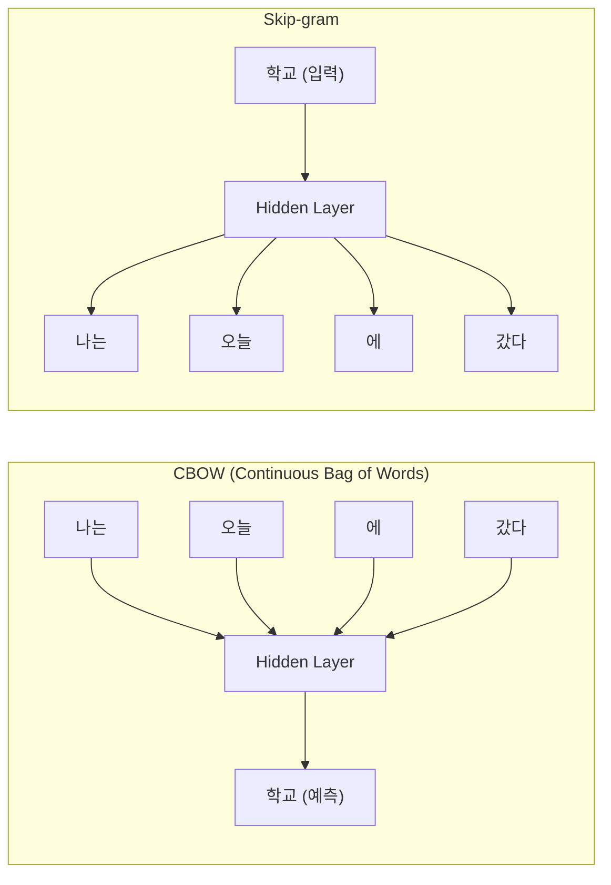
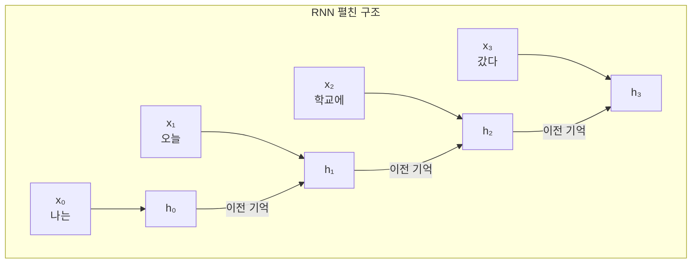
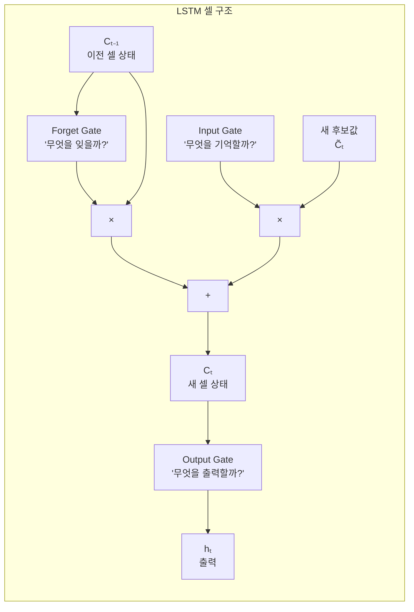
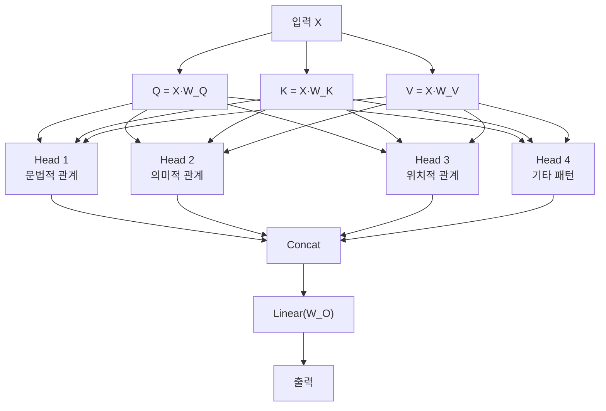

# 제3장: 시퀀스 모델에서 Transformer로

> **미션**: 수업이 끝나면 Attention이 문장의 어디에 집중하는지 시각화한다

## 학습 목표

이 장을 마치면 다음을 수행할 수 있다:

1. 단어 임베딩의 원리와 Word2Vec의 학습 방식을 설명할 수 있다
2. RNN/LSTM/GRU의 구조와 장기 의존성 문제를 이해한다
3. Attention 메커니즘의 Query, Key, Value 개념을 설명할 수 있다
4. Self-Attention과 Multi-Head Attention을 구현할 수 있다
5. Attention Weight를 시각화하고 해석할 수 있다

### 수업 타임라인

| 시간 | 구분 | 내용 |
|------|------|------|
| 00:00~00:50 | **1교시** | 임베딩 + RNN/LSTM 개념 |
| 00:50~01:00 | 쉬는시간 | |
| 01:00~01:50 | **2교시** | Attention + Self-Attention + Multi-Head |
| 01:50~02:00 | 쉬는시간 | |
| 02:00~02:50 | **3교시** | Attention 구현 + 시각화 실습 + 과제 |

---

#### 1교시: 순차 데이터와 시퀀스 모델

## 3.1 순차 데이터와 단어 임베딩

### 순차 데이터란?

자연어는 대표적인 **순차 데이터(Sequential Data)**이다. "나는 학교에 갔다"에서 "나는"과 "갔다"의 순서를 바꾸면 의미가 달라진다. 이처럼 순서가 의미를 결정하는 데이터를 순차 데이터라 한다. 시계열 데이터(주가, 날씨), 음성 신호, DNA 서열 등도 순차 데이터에 속한다.

그렇다면 컴퓨터는 단어를 어떻게 이해할까? 가장 단순한 방법은 **원-핫 인코딩(One-hot Encoding)**이다. 어휘 사전에 1,000개의 단어가 있다면, 각 단어를 길이 1,000인 벡터로 표현하되 해당 위치만 1이고 나머지는 0으로 채운다.

그러나 원-핫 인코딩에는 두 가지 근본적인 문제가 있다:

1. **고차원 문제**: 어휘가 30,000개면 벡터 차원도 30,000이 된다. 메모리 낭비가 심하다.
2. **의미 관계 부재**: "개"와 "강아지"는 의미가 비슷하지만, 원-핫 벡터 사이의 코사인 유사도는 항상 0이다. 모든 단어 쌍의 거리가 동일하므로 의미적 유사성을 전혀 표현하지 못한다.

이 문제를 해결하기 위해 등장한 것이 **단어 임베딩(Word Embedding)**이다.

### 단어 임베딩: 의미를 담은 벡터

단어 임베딩은 각 단어를 저차원(보통 100~300차원)의 **밀집 벡터(Dense Vector)**로 표현한다. 원-핫 벡터가 대부분 0인 "희소 벡터"인 반면, 임베딩 벡터는 모든 차원에 의미 있는 값이 들어 있다.

핵심 아이디어는 **분포 가설(Distributional Hypothesis)**이다:

> "비슷한 문맥에 등장하는 단어는 비슷한 의미를 갖는다" (Harris, 1954)

예를 들어, "나는 **커피**를 마셨다"와 "나는 **차**를 마셨다"에서 "커피"와 "차"는 같은 문맥(___ 를 마셨다)에 등장하므로 비슷한 벡터로 표현된다.

### Word2Vec: 임베딩의 혁명

Word2Vec(Mikolov et al., 2013)은 단어 임베딩을 효율적으로 학습하는 방법으로, NLP 분야에 혁신을 가져왔다. 두 가지 학습 방식이 있다:



**그림 3.1** Word2Vec의 두 가지 학습 방식

- **CBOW (Continuous Bag of Words)**: 주변 단어(Context)로 중심 단어(Center)를 예측한다. "나는 오늘 ___ 에 갔다"에서 빈칸을 맞추는 문제이다. 학습이 빠르고 빈도가 높은 단어에 유리하다.
- **Skip-gram**: 중심 단어로 주변 단어를 예측한다. "학교"가 주어지면 "나는", "오늘", "에", "갔다"를 맞추는 문제이다. 빈도가 낮은 단어에도 좋은 임베딩을 생성한다.

실제로 Skip-gram 모델을 학습시키면, 의미적으로 유사한 단어들이 임베딩 공간에서 가까이 위치하게 된다. 간단한 한국어 문장으로 학습한 결과이다:

```
어휘 크기: 20
학습 쌍 수: 84

'나는'과 가장 유사한 단어 (상위 5개):
  학교에서: 0.5015
  공부를:   0.4827
  마셨다:   0.4654
  차를:     0.3613
  회사에:   0.3451
```

"나는"과 "학교에서"가 유사한 것은, 학습 데이터에서 두 단어가 비슷한 문맥에 자주 함께 등장했기 때문이다.

_전체 코드는 practice/chapter3/code/3-1-임베딩.py 참고_

### 임베딩의 마법: 벡터 산술

Word2Vec이 유명해진 결정적 이유는 **벡터 산술(Vector Arithmetic)**이 가능하다는 발견이다:

벡터("왕") - 벡터("남자") + 벡터("여자") ≈ 벡터("여왕")

이는 임베딩 공간이 단순히 단어를 나열한 것이 아니라, 성별, 시제, 단복수 같은 **의미적 관계를 기하학적으로 인코딩**하고 있음을 보여준다. "왕"에서 "남자" 성분을 빼고 "여자" 성분을 더하면 "여왕"에 도달하는 것이다. 이러한 관계는 학습 과정에서 자동으로 발견된다.

### 사전학습 임베딩

Word2Vec을 직접 학습하려면 대규모 말뭉치가 필요하다. 실무에서는 미리 학습된 임베딩을 가져다 쓰는 경우가 많다.

**표 3.1** 주요 사전학습 임베딩 비교

| 모델 | 학습 방식 | 특징 | 차원 |
|------|----------|------|------|
| Word2Vec | 예측 기반 (Skip-gram/CBOW) | 로컬 문맥만 사용 | 100~300 |
| GloVe | 통계 기반 (동시출현 행렬) | 전역 통계 활용, 학습 안정적 | 50~300 |
| FastText | Word2Vec + 서브워드 | 미등록 단어(OOV) 처리 가능 | 100~300 |

**GloVe** (Pennington et al., 2014)는 전체 말뭉치에서 단어 쌍의 동시 출현 빈도를 행렬로 구축한 뒤, 이 행렬을 분해하여 임베딩을 얻는다. Word2Vec이 "창문" 안의 로컬 문맥만 보는 데 반해, GloVe는 전역 통계를 활용한다.

**FastText** (Bojanowski et al., 2017)는 단어를 글자 단위 n-gram으로 분해하여 학습한다. "unbelievable"을 "un", "bel", "iev", "abl", "ble" 같은 부분으로 쪼개므로, 학습 데이터에 없는 새로운 단어도 서브워드 조합으로 벡터를 생성할 수 있다.

> **참고**: 현재 BERT, GPT 같은 Transformer 모델들은 문맥에 따라 임베딩이 동적으로 변하는 **문맥 임베딩(Contextual Embedding)**을 사용한다. Word2Vec/GloVe는 단어마다 하나의 고정된 벡터를 가지므로 다의어를 구분하지 못한다는 한계가 있다. 이 문제는 5장에서 BERT를 다루며 다시 살펴본다.

---

## 3.2 RNN/LSTM/GRU (개념 중심)

### RNN: 기억력 있는 신경망

2장에서 배운 MLP는 입력을 **독립적으로** 처리한다. "나는 오늘 학교에 갔다"라는 문장을 MLP에 넣으면, 각 단어를 개별적으로 보지 "나는" 다음에 "오늘"이 왔다는 순서 정보를 활용하지 못한다.

**순환 신경망(Recurrent Neural Network, RNN)**은 이 문제를 해결한다. RNN은 이전 시점의 **은닉 상태(Hidden State)**를 현재 시점의 입력과 함께 처리하여, 과거 정보를 "기억"할 수 있다.



**그림 3.2** RNN의 펼친(Unrolled) 구조

각 시점의 계산은 다음과 같다:

hₜ = tanh(Wₓₕ · xₜ + Wₕₕ · hₜ₋₁ + b)

여기서 hₜ는 현재 은닉 상태, xₜ는 현재 입력, hₜ₋₁은 이전 은닉 상태이다. 핵심은 **Wₕₕ가 모든 시점에서 공유**된다는 것이다. 이 공유 가중치가 "기억"을 전달하는 역할을 한다. 같은 가중치를 사용하므로 어떤 길이의 시퀀스든 처리할 수 있다는 장점이 있다.

### 장기 의존성 문제

그러나 RNN에는 근본적인 한계가 있다. 문장이 길어지면 앞부분의 정보가 점점 사라진다. 이를 **장기 의존성 문제(Long-term Dependency Problem)**라 한다.

원인은 역전파 과정에서 **기울기가 반복적으로 곱해지기** 때문이다. 예를 들어 100 시점에 걸친 역전파에서 Wₕₕ가 반복적으로 곱해진다. Wₕₕ의 최대 고유값이 1보다 작으면 기울기가 지수적으로 줄어들고(**기울기 소실**), 1보다 크면 폭발적으로 커진다(**기울기 폭주**).

구체적인 예를 들면: "나는 **프랑스에서** 10년간 살면서 다양한 문화를 경험했고, 많은 사람들과 교류하며 ... 그래서 나는 ___를 잘한다."에서 빈칸에 "프랑스어"를 넣으려면 멀리 떨어진 "프랑스에서"를 기억해야 한다. RNN은 이런 긴 거리의 의존성을 처리하기 어렵다.

### LSTM: 선택적 기억 장치

**LSTM(Long Short-Term Memory)** (Hochreiter & Schmidhuber, 1997)은 장기 의존성 문제를 해결하기 위해 **셀 상태(Cell State)**와 **3개의 게이트(Gate)**를 도입했다.



**그림 3.3** LSTM 셀 구조

각 게이트의 역할을 도서관 사서에 비유하면:

- **Forget Gate**: "이 책은 더 이상 필요 없으니 반납하세요" — 이전 정보 중 불필요한 것을 잊는다. σ(Wf · [hₜ₋₁, xₜ] + bf)로 계산하며, 출력이 0이면 완전히 잊고 1이면 완전히 유지한다.
- **Input Gate**: "이 새 책은 중요하니 서가에 꽂으세요" — 새 정보 중 어떤 것을 기억할지 결정한다. σ(Wi · [hₜ₋₁, xₜ] + bi)로 얼마나 반영할지 결정하고, tanh(Wc · [hₜ₋₁, xₜ] + bc)로 새 후보값을 생성한다.
- **Output Gate**: "이 책을 빌려가세요" — 셀 상태에서 현재 필요한 정보만 출력한다. σ(Wo · [hₜ₋₁, xₜ] + bo)로 결정한다.

셀 상태(Cell State)는 **컨베이어 벨트**와 같다. 정보가 게이트를 거치며 선택적으로 추가·삭제되지만, 기본적으로 직선 경로를 따라 흘러가므로 기울기가 잘 전달된다. 이것이 LSTM이 장기 의존성 문제를 완화하는 핵심 원리이다.

### GRU: LSTM의 간소화

**GRU(Gated Recurrent Unit)** (Cho et al., 2014)는 LSTM의 3개 게이트를 2개로 줄인 간소화 버전이다:

- **Reset Gate**: 이전 은닉 상태 중 얼마나 무시할지 결정
- **Update Gate**: 새 정보와 이전 정보의 비율을 조절 (Forget Gate + Input Gate의 역할을 통합)

**표 3.2** LSTM vs GRU 비교

| 항목 | LSTM | GRU |
|------|------|-----|
| 게이트 수 | 3 (Forget, Input, Output) | 2 (Reset, Update) |
| 셀 상태 | 별도의 Cell State 존재 | Hidden State만 사용 |
| 파라미터 수 | 4 × (d² + d·h + d) | 3 × (d² + d·h + d) |
| 성능 | 대규모 데이터에서 유리 | 소규모 데이터에서 유사한 성능 |
| 학습 속도 | 상대적으로 느림 | 상대적으로 빠름 |

> **실무 팁**: 데이터가 충분하면 LSTM, 작은 데이터셋이면 GRU가 효율적이다. 다만 현재는 Transformer가 대부분의 NLP 태스크에서 RNN 계열을 대체했다.

### Seq2Seq와 Encoder-Decoder 구조

RNN의 중요한 응용 중 하나가 **Seq2Seq(Sequence-to-Sequence)** 모델이다. 입력 시퀀스를 고정 길이 벡터로 인코딩한 뒤, 이를 디코딩하여 출력 시퀀스를 생성한다. 기계 번역에서 "나는 학생이다" → "I am a student"처럼 가변 길이 시퀀스 간 변환에 사용된다.

그러나 Seq2Seq의 **Encoder가 입력 전체를 하나의 벡터로 압축**해야 한다는 점이 한계이다. 이를 정보 병목(Information Bottleneck)이라 하며, 이 문제를 해결하기 위해 다음 절에서 다루는 Attention이 등장했다.

### RNN 계열의 근본적 한계

RNN, LSTM, GRU는 모두 공통적인 한계를 가진다:

1. **순차 처리**: 시점 t의 계산은 시점 t-1이 끝나야 시작할 수 있어 **병렬화가 불가능**하다. GPU의 수천 개 코어를 활용하지 못한다.
2. **긴 문맥 처리의 한계**: LSTM도 수백 토큰 이상의 긴 문맥에서는 성능이 저하된다.
3. **느린 학습 속도**: 순차 처리로 인해 학습에 시간이 오래 걸린다.

이러한 한계를 극복하기 위해 등장한 것이 바로 다음 절에서 다루는 **Attention 메커니즘**이며, 나아가 4장에서 다루는 Transformer는 RNN을 완전히 제거하고 Attention만으로 시퀀스를 처리한다.

---

#### 2교시: Attention 메커니즘

> **라이브 코딩 시연**: 교수가 Scaled Dot-Product Attention을 NumPy로 한 단계씩 구현하며, √dₖ 스케일링 전후의 분산 변화를 실시간으로 보여준다.

## 3.3 Attention 메커니즘

### 왜 Attention이 필요한가?

번역 문제를 생각해 보자. "나는 학교에 갔다"를 "I went to school"로 번역할 때, RNN 기반 Seq2Seq 모델은 전체 입력 문장을 하나의 고정 길이 벡터로 압축한 후 번역을 시작한다. 이를 **정보 병목(Information Bottleneck)**이라 한다.

문장이 짧으면 괜찮지만, 100단어짜리 문장의 모든 정보를 하나의 벡터에 담는 것은 무리이다. 실제로 Seq2Seq 모델은 문장 길이가 20단어를 넘으면 성능이 급격히 떨어졌다.

**Attention**(Bahdanau et al., 2014)은 이 문제를 "번역할 때 원문의 **관련 부분에 집중**하자"는 아이디어로 해결했다. 시험 공부할 때 교과서 전체를 같은 비중으로 읽지 않고, 중요한 부분에 밑줄을 긋고 더 집중하는 것과 같은 원리이다.

### Query, Key, Value

Attention의 핵심은 세 가지 요소이다:

- **Query (Q)**: "내가 찾고 싶은 것" — 현재 처리 중인 단어의 관점
- **Key (K)**: "후보 답의 라벨" — 참조할 단어들의 식별자
- **Value (V)**: "실제 답의 내용" — 참조할 단어들의 실제 정보

도서관에 비유하면 다음과 같다. "딥러닝 입문서를 찾고 싶다"가 **Query**이다. 서가에 꽂힌 각 책의 분류 태그가 **Key**이다. 태그를 보고 관련도를 계산한 뒤, 가장 관련 있는 책의 실제 내용(**Value**)을 가져온다. 이때 한 권만 가져오는 것이 아니라, 관련도에 비례하여 여러 책의 내용을 **가중 합산**한다.

### Scaled Dot-Product Attention

구체적인 계산 과정을 단계별로 살펴보자:

**Attention(Q, K, V) = softmax(QKᵀ / √dₖ) · V**

**[단계 1] QKᵀ — 유사도 계산**

Query와 모든 Key의 **내적(Dot Product)**을 계산한다. 내적 값이 클수록 두 벡터의 방향이 비슷하다는 뜻이다. Q와 K의 행렬 곱으로 한번에 모든 쌍의 유사도를 계산할 수 있어 효율적이다.

**[단계 2] √dₖ로 나누기 — 스케일링**

왜 나눌까? Key의 차원 dₖ가 클수록, 내적 값의 분산도 dₖ에 비례하여 커진다. 값이 매우 크면 softmax 출력이 0 또는 1에 극단적으로 가까워져 기울기가 거의 사라진다. √dₖ로 나누면 분산이 약 1로 안정화된다:

```
스케일링 전 scores 분산: 6.838
스케일링 후 scores 분산: 0.855
기대 분산 (이론값):      ~1.0
```

**[단계 3] Softmax — 확률 변환**

스케일링된 점수에 softmax를 적용하여 합이 1인 **확률 분포**(가중치)로 변환한다. 각 값은 "이 Key에 얼마나 주목할 것인가"를 나타낸다.

**[단계 4] 가중합 — 최종 출력**

각 Value에 대응하는 가중치를 곱하고 합산한다. 가중치가 높은 단어의 정보가 더 많이 반영된다.

실제 구현 결과를 보자. "나는 은행에서 돈을 찾았다"에 대한 Attention Weight이다:

```
Attention Weights:
  나는     → [0.985  0.010  0.001  0.005]
  은행에서 → [0.140  0.768  0.035  0.057]
  돈을     → [0.014  0.026  0.807  0.152]
  찾았다   → [0.080  0.067  0.238  0.615]
```

각 행은 해당 단어가 다른 단어에 얼마나 "주목"하는지를 나타낸다. "은행에서"는 자기 자신(0.768)에 가장 많이 주목하고, "나는"(0.140)에도 일부 주목한다. "찾았다"는 "돈을"(0.238)에도 상당한 주목을 하여, "돈을 찾다"라는 의미적 연결을 포착하고 있다.

_전체 코드는 practice/chapter3/code/3-3-어텐션.py 참고_

---

## 3.4 Self-Attention과 Multi-Head Attention

### Self-Attention: 문장 안에서 서로를 바라보기

앞서 본 Attention은 원래 Encoder-Decoder 사이에서 사용되었다(Cross-Attention). **Self-Attention**은 같은 문장 안에서 단어들이 서로를 참조하는 것이다. Q, K, V가 모두 **같은 입력**에서 생성된다는 것이 핵심 차이이다.

"나는 은행에서 돈을 찾았다"에서 Self-Attention이 하는 일:

- "은행"이라는 단어를 이해하려면, "돈"과 "찾았다"를 함께 봐야 금융기관이라는 의미가 확정된다
- 만약 문장이 "나는 강가의 은행에 앉았다"였다면, "강가"와 "앉았다"에 높은 Attention을 주어 강둑(river bank)이라는 의미가 된다

이처럼 Self-Attention은 **문맥에 따라 단어의 의미를 동적으로 결정**한다. 이것이 앞서 3.1절에서 언급한 Word2Vec의 한계(단어당 고정 벡터)를 극복하는 핵심 메커니즘이다.

구현 측면에서, Self-Attention 모듈은 세 개의 학습 가능한 가중치 행렬 W_Q, W_K, W_V를 사용하여 입력 X에서 Q, K, V를 생성한다:

Q = X · W_Q,  K = X · W_K,  V = X · W_V

```python
class SelfAttention(nn.Module):
    def __init__(self, d_model):
        super().__init__()
        self.W_q = nn.Linear(d_model, d_model, bias=False)
        self.W_k = nn.Linear(d_model, d_model, bias=False)
        self.W_v = nn.Linear(d_model, d_model, bias=False)

    def forward(self, x):
        Q = self.W_q(x)
        K = self.W_k(x)
        V = self.W_v(x)
        return scaled_dot_product_attention(Q, K, V)
```

Self-Attention의 **계산 복잡도는 O(n²d)**이다. 여기서 n은 시퀀스 길이, d는 임베딩 차원이다. 모든 단어 쌍(n²)에 대해 d차원의 내적을 계산해야 하기 때문이다. RNN의 O(nd²)와 비교하면, 시퀀스가 짧을 때(n < d)는 Self-Attention이 유리하고, 매우 긴 시퀀스에서는 불리할 수 있다.

_전체 코드는 practice/chapter3/code/3-3-어텐션.py 참고_

### Multi-Head Attention: 여러 관점에서 동시에 보기

Self-Attention 하나로는 한 가지 관점만 포착한다. 그러나 언어에는 다양한 관계가 존재한다. "그녀가 말한 것을 그는 이해했다"에서:

- **문법적 관계**: "그녀가" → "말한" (주어-서술어)
- **의미적 관계**: "말한 것" → "이해했다" (원인-결과)
- **대명사 해소**: "그녀가" ↔ "그는" (서로 다른 인물)

**Multi-Head Attention**은 여러 개의 Attention을 **병렬로 수행**하여 이런 다양한 관계를 동시에 포착한다.



**그림 3.4** Multi-Head Attention 구조

구체적인 동작 방식:

1. **분할**: d_model 차원을 num_heads개로 분할한다. d_model=32, num_heads=4이면 각 Head는 d_k=8 차원에서 독립적으로 Attention을 수행한다.
2. **병렬 Attention**: 각 Head가 자신만의 W_Q, W_K, W_V를 사용하여 서로 다른 관계를 학습한다.
3. **합치기(Concatenation)**: 각 Head의 출력(d_k 차원)을 이어붙여 원래 d_model 차원으로 복원한다.
4. **최종 변환**: Linear 층(W_O)을 통해 최종 출력을 생성한다.

Transformer-Base 모델은 8개, Transformer-Large는 16개의 Head를 사용한다.

```
d_model = 32, num_heads = 4, d_k = 8
입력 크기:   (1, 6, 32)
출력 크기:   (1, 6, 32)
가중치 크기: (1, 4, 6, 6)  → (batch, heads, seq, seq)
학습 파라미터 수: 4,096
```

각 Head가 실제로 다른 패턴을 포착하는지 확인한 결과:

```
각 Head의 Attention 패턴 (첫 번째 단어 기준):
  Head 0: [0.189  0.268  0.073  0.085  0.171  0.214]  → 단어 1에 집중
  Head 1: [0.114  0.152  0.127  0.185  0.224  0.198]  → 단어 4에 집중
  Head 2: [0.149  0.175  0.150  0.188  0.169  0.169]  → 단어 3에 집중
  Head 3: [0.168  0.171  0.173  0.158  0.165  0.165]  → 단어 2에 집중
```

각 Head가 서로 다른 단어에 주목하고 있음을 확인할 수 있다. 이것이 Multi-Head의 핵심 가치이다.

### Causal Mask: 미래를 보지 못하게 하기

Decoder에서는 현재 시점 이후의 토큰을 참조할 수 없어야 한다. 번역할 때 아직 생성하지 않은 단어를 미리 볼 수 없기 때문이다. 이를 위해 **Causal Mask**(하삼각 마스크)를 사용한다:

```
Causal Mask (1=참조 가능, 0=마스킹):
[[1  0  0  0  0]
 [1  1  0  0  0]
 [1  1  1  0  0]
 [1  1  1  1  0]
 [1  1  1  1  1]]
```

마스킹된 위치의 Attention Score에 -∞를 넣으면, softmax 후 해당 가중치가 0이 된다. 이렇게 하면 각 단어는 자신과 이전 단어만 참조할 수 있다. 이 메커니즘은 4장에서 Transformer Decoder를 구현할 때 다시 다룬다.

### Attention 유형 비교

**표 3.3** Attention 유형 비교

| 유형 | Q 출처 | K, V 출처 | 사용처 |
|------|--------|----------|--------|
| Attention (Bahdanau) | Decoder 상태 | Encoder 출력 | Seq2Seq 번역 |
| Self-Attention | 같은 입력 | 같은 입력 | Transformer Encoder |
| Cross-Attention | Decoder 입력 | Encoder 출력 | Transformer Decoder |
| Causal Self-Attention | 같은 입력 (마스킹) | 같은 입력 | GPT (Decoder-only) |

---

#### 3교시: Attention 구현 실습

> **Copilot 활용**: Attention Score 계산 코드를 직접 작성해본 뒤, Copilot에게 "이 Attention 구현을 Multi-Head로 확장해줘"와 같이 점진적으로 요청한다.

## 3.5 실습: Attention 구현과 시각화

### 실습 목표

이 실습에서는 다음을 수행한다:

- Scaled Dot-Product Attention을 NumPy와 PyTorch로 구현한다
- Self-Attention과 Multi-Head Attention 모듈을 작성한다
- Attention Weight를 히트맵으로 시각화하고 해석한다
- 간단한 Attention 기반 텍스트 분류 모델을 구현한다

### 실습 환경 준비

1장에서 `scripts/setup_env.py`로 구축한 통합 가상환경을 사용한다. 별도 설치는 불필요하다.

```bash
# 가상환경 활성화 (1장에서 이미 생성)
source venv/bin/activate  # Windows: venv\Scripts\activate

# 디바이스 확인
python -c "import torch; print(f'Device: {torch.device(\"cuda\" if torch.cuda.is_available() else \"cpu\")}')"
```

> **참고**: Attention 연산은 소규모이므로 CPU에서도 충분히 빠르다. GPU가 있으면 더 큰 시퀀스로 실험할 수 있다.

### Attention 직접 구현

Scaled Dot-Product Attention의 핵심 구현은 다음과 같다:

```python
def scaled_dot_product_attention(Q, K, V, mask=None):
    d_k = Q.size(-1)
    scores = torch.matmul(Q, K.transpose(-2, -1)) / math.sqrt(d_k)
    if mask is not None:
        scores = scores.masked_fill(mask == 0, float("-inf"))
    weights = F.softmax(scores, dim=-1)
    output = torch.matmul(weights, V)
    return output, weights
```

이 함수는 단 5줄이지만, Transformer의 핵심 연산을 담고 있다. mask 파라미터를 통해 Causal Mask(Decoder)나 Padding Mask를 적용할 수 있다.

_전체 코드는 practice/chapter3/code/3-3-어텐션.py 참고_

### Multi-Head Attention 구현

Multi-Head의 핵심은 d_model 차원을 num_heads로 분할하여 각 Head가 독립적으로 Attention을 수행하는 것이다. PyTorch에서는 view와 transpose로 텐서를 재배열한다:

```python
# (batch, seq, d_model) → (batch, heads, seq, d_k)
Q = Q.view(batch_size, seq_len, num_heads, d_k).transpose(1, 2)
```

_전체 코드는 practice/chapter3/code/3-3-어텐션.py 참고_

### Attention Weight 시각화

학습된 Attention Weight를 히트맵으로 시각화하면 모델이 어떤 단어 쌍에 주목하는지 직관적으로 파악할 수 있다. seaborn의 heatmap을 사용하여 각 Head별 패턴을 비교한다.

_시각화 결과는 practice/chapter3/data/output/attention_heatmap_ko.png 참고_

### Attention 기반 감성 분류 모델

Self-Attention을 활용한 간단한 감성 분류 모델을 구현한다. 구조는 **임베딩 → Multi-Head Attention → 평균 풀링 → 분류기**이다:

```
모델 구조:
  Embedding: 14 → 16
  Multi-Head Attention: 2 heads, d_k = 8
  Classifier: 16 → 2
  총 파라미터: 1,282
```

학습 결과:

```
Epoch  50: Loss = 0.0000, Accuracy = 100.0%
Epoch 200: Loss = 0.0000, Accuracy = 100.0%

예측 결과:
  '이 영화 정말 좋다' → 긍정 (정답: 긍정) [O]
  '이 영화 매우 싫다' → 부정 (정답: 부정) [O]
  '그 책은 정말 좋다' → 긍정 (정답: 긍정) [O]
  '그 책은 매우 싫다' → 부정 (정답: 부정) [O]
  '오늘 기분 정말 최고' → 긍정 (정답: 긍정) [O]
  '오늘 기분 매우 최악' → 부정 (정답: 부정) [O]
  '이 음식 정말 좋다' → 긍정 (정답: 긍정) [O]
  '이 음식 매우 싫다' → 부정 (정답: 부정) [O]
```

간단한 데이터셋이지만, Attention 기반 모델이 감성 분류를 수행하는 전체 파이프라인을 이해할 수 있다. Attention Weight 히트맵을 통해 모델이 "좋다/싫다" 같은 감성 단어에 높은 가중치를 부여하는지 확인할 수 있다.

_전체 코드는 practice/chapter3/code/3-5-실습.py 참고_

**과제**: Self-Attention 모듈 구현 + Attention Weight 히트맵 시각화 리포트

---

## 핵심 정리

이 장에서 다룬 핵심 내용을 정리하면 다음과 같다:

- **단어 임베딩**은 단어를 저차원 밀집 벡터로 표현하며, Word2Vec은 문맥을 이용해 의미적으로 유사한 단어를 가까운 벡터로 학습한다
- **RNN**은 순차 데이터를 처리하는 신경망이지만, 장기 의존성 문제가 있다
- **LSTM**은 Cell State와 3개의 Gate로 장기 기억을 유지하며, GRU는 이를 2개의 Gate로 간소화했다
- **Attention**은 "어디에 집중할 것인가"를 모델이 스스로 결정하는 메커니즘으로, Query, Key, Value의 내적으로 계산한다
- **√dₖ 스케일링**은 내적 값의 분산을 안정화하여 softmax의 기울기 소실을 방지한다
- **Self-Attention**은 같은 문장 안의 단어들이 서로를 참조하여 문맥에 따른 의미를 동적으로 결정한다
- **Multi-Head Attention**은 여러 관점에서 동시에 Attention을 수행하여 문법적, 의미적, 위치적 관계를 다양하게 포착한다
- RNN 계열의 한계(순차 처리, 긴 문맥)를 Self-Attention이 극복하며, 이것이 다음 장에서 다룰 Transformer의 핵심 구성 요소이다

---

## 더 알아보기

이 장의 내용을 더 깊이 학습하려면 다음 자료를 참고하라:

- Jay Alammar. The Illustrated Transformer. https://jalammar.github.io/illustrated-transformer/
- Lilian Weng. (2018). Attention? Attention!. https://lilianweng.github.io/posts/2018-06-24-attention/
- 3Blue1Brown. Attention in Transformers, visually explained. https://www.youtube.com/watch?v=eMlx5fFNoYc

---

## 다음 장 예고

다음 장에서는 Self-Attention을 기반으로 한 **Transformer 아키텍처**를 심층 분석한다. Encoder와 Decoder 구조, Positional Encoding, Residual Connection, Layer Normalization을 다루고, PyTorch로 Transformer Encoder를 밑바닥부터 구현한다.

---

## 참고문헌

1. Harris, Z. (1954). Distributional Structure. *Word*, 10(2-3), 146-162.
2. Mikolov, T. et al. (2013). Efficient Estimation of Word Representations in Vector Space. *arXiv*. https://arxiv.org/abs/1301.3781
3. Pennington, J. et al. (2014). GloVe: Global Vectors for Word Representation. *EMNLP*. https://nlp.stanford.edu/pubs/glove.pdf
4. Bojanowski, P. et al. (2017). Enriching Word Vectors with Subword Information. *TACL*. https://arxiv.org/abs/1607.04606
5. Hochreiter, S. & Schmidhuber, J. (1997). Long Short-Term Memory. *Neural Computation*, 9(8), 1735-1780.
6. Cho, K. et al. (2014). Learning Phrase Representations using RNN Encoder-Decoder. *EMNLP*. https://arxiv.org/abs/1406.1078
7. Bahdanau, D. et al. (2014). Neural Machine Translation by Jointly Learning to Align and Translate. *ICLR*. https://arxiv.org/abs/1409.0473
8. Vaswani, A. et al. (2017). Attention Is All You Need. *NeurIPS*. https://arxiv.org/abs/1706.03762
