# 3주차: 단어에서 Attention까지 — 비유로 이해하는 NLP

> **이 강의를 마치면**: "Attention이 뭐야?"라는 질문에 도서관 비유로 자신 있게 설명할 수 있다.

---

## 오늘의 질문

**"똑같은 '배'라는 글자를 컴퓨터는 어떻게 구분할까?"**

잠깐 생각해 보자. 아래 세 문장을 읽어 보라.

- "나는 **배**가 고파서 밥을 먹었다." (신체)
- "나는 **배**를 타고 제주도에 갔다." (탈것)
- "나는 **배**를 깎아서 먹었다." (과일)

사람은 "고파서", "타고", "깎아서"라는 주변 단어를 보고 즉시 구분한다. 컴퓨터도 이렇게 할 수 있을까? 오늘 수업이 끝나면 그 답을 알게 된다.

---

## 1부. 컴퓨터는 단어를 어떻게 이해할까?

### 출석번호로는 친한 친구를 알 수 없다 — 원-핫 인코딩의 한계

컴퓨터는 숫자만 이해한다. 그래서 단어를 숫자로 바꿔야 하는데, 가장 단순한 방법이 **원-핫 인코딩**이다.

학교의 출석부를 떠올려 보자. 30명의 학생에게 1번부터 30번까지 번호를 매긴다. 1번 김민수, 2번 이지은, 3번 박서준... 이런 식이다.

```
김민수 = [1, 0, 0, 0, ...]   ← 30칸 중 1번만 1
이지은 = [0, 1, 0, 0, ...]   ← 30칸 중 2번만 1
박서준 = [0, 0, 1, 0, ...]   ← 30칸 중 3번만 1
```

이 방식에는 두 가지 큰 문제가 있다.

**문제 1: 낭비가 심하다.**
한국어 사전에 단어가 5만 개 있으면, 모든 단어를 길이 5만짜리 벡터로 표현해야 한다. 그중 딱 1칸만 쓰고 나머지 49,999칸은 전부 0이다. 엄청난 낭비다.

**문제 2: 관계를 모른다.**
출석번호만으로는 누가 누구와 친한지 알 수 없다. 1번(김민수)과 2번(이지은)이 절친이어도, 번호만 보면 그냥 "다른 사람"일 뿐이다. 마찬가지로, "강아지"와 "개"는 거의 같은 뜻인데, 원-핫 인코딩에서는 완전히 다른 벡터가 된다.

> 원-핫 인코딩은 학생들에게 출석번호만 붙여 놓고, "이 학생들 사이 관계를 알려줘"라고 하는 것과 같다. 번호로는 아무것도 알 수 없다.

---

### 단어 지도 — 임베딩이라는 아이디어

그래서 등장한 것이 **단어 임베딩(Word Embedding)**이다.

지도를 생각해 보자. 서울과 부산은 지도 위에서 멀리 떨어져 있고, 서울과 인천은 가까이 있다. 이 거리가 실제 지리적 관계를 나타낸다.

단어 임베딩도 똑같은 원리다. **의미가 비슷한 단어는 가까이, 다른 단어는 멀리** 배치하는 "단어 지도"를 만드는 것이다.

```
              차원 2
               ↑
          3.0  │            ☕커피  ☕차
               │              ☕주스
          2.0  │
               │
          1.0  │  🐕개
               │   🐕강아지
          0.0  │─────────────────────────────→ 차원 1
               │        🐱고양이
         -1.0  │
               │                  🚗자동차
         -2.0  │                🚌버스
               │                  🚂기차
         -3.0  │
```

이 지도 위에서 거리를 눈으로 확인해 보자:
- "개"와 "강아지"는 거의 붙어 있다 → 의미가 매우 비슷
- "커피"와 "차"는 가까이 있다 → 둘 다 음료
- "커피"와 "자동차"는 멀리 떨어져 있다 → 의미가 완전히 다름
- 같은 종류의 단어끼리 **군집(cluster)**을 이루고 있다

출석번호(원-핫)에서는 모든 단어 사이 거리가 똑같았지만, 임베딩에서는 **의미적 거리**를 표현할 수 있다.

---

### 유유상종 — 분포 가설

그렇다면 컴퓨터는 어떻게 "개"와 "강아지"가 비슷하다는 것을 알까? 사전을 외우는 것이 아니다. **주변에 어떤 단어가 오는지**를 보고 판단한다.

이것을 **분포 가설**이라고 한다.

> "비슷한 자리에 나타나는 단어는 비슷한 의미를 갖는다."

예를 들어:

- "나는 **커피**를 마셨다"
- "나는 **차**를 마셨다"
- "나는 **주스**를 마셨다"

"커피", "차", "주스"는 모두 "___를 마셨다"라는 같은 자리에 나타난다. 컴퓨터는 이 패턴을 수십억 문장에서 관찰하고, "아, 이 세 단어는 비슷한 놈이구나"라고 학습한다.

> 사람도 마찬가지다. 모르는 외국어 단어가 나와도, 주변 문맥을 보면 대충 의미를 짐작할 수 있다. "I ate ___ for breakfast" 빈칸에 올 단어는 음식이겠구나, 하는 것처럼.

이 아이디어를 실제로 구현한 것이 **Word2Vec**이다. 2013년 구글에서 발표한 이 모델은 대량의 텍스트를 읽으면서 "어떤 단어가 어떤 단어 근처에 자주 나오는지"를 학습하여 단어 지도를 자동으로 만든다.

---

### 왕 - 남자 + 여자 = 여왕 — 벡터 산술의 마법

Word2Vec이 유명해진 결정적 이유가 있다. 단어 사이에 **산술 연산**이 가능하다는 놀라운 발견이다.

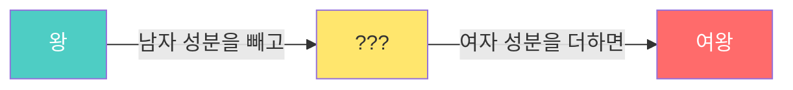

> **왕** - 남자 + 여자 = **여왕**

이것은 임베딩 공간이 단순히 단어를 나열한 것이 아니라, **의미적 관계를 방향으로 인코딩**하고 있다는 증거다.

몇 가지 더 예를 들면:

| 연산 | 결과 |
|---|---|
| 한국 - 서울 + 도쿄 | ≈ 일본 |
| 걷다 - 현재 + 과거 | ≈ 걸었다 |
| 형 - 남자 + 여자 | ≈ 언니 |

마치 지도 위에서 "서울→부산" 방향과 "도쿄→오사카" 방향이 비슷한 것처럼, 임베딩 공간에서 "남자→여자" 방향과 "왕→여왕" 방향이 같다.

---

### 임베딩의 한계: 다의어 문제

그런데 임베딩에는 한 가지 근본적인 한계가 있다. **단어 하나당 벡터가 하나**라는 점이다.

"배"라는 단어는 과일일 수도, 신체 부위일 수도, 탈것일 수도 있다. 하지만 Word2Vec에서 "배"의 벡터는 딱 하나뿐이다. 문맥에 따라 의미가 달라져야 하는데 그렇게 하지 못한다.

> 마치 같은 반에 "김민수"가 두 명인데, 출석부에 "김민수" 한 줄만 적혀 있는 것과 같다. 어떤 김민수인지 구분할 수가 없다.

이 문제를 해결하는 것이 바로 오늘 수업의 후반부에서 다루는 **Attention**이다. 하지만 그 전에 먼저, 순서가 있는 데이터를 처리하는 방법을 살펴보자.

---

## 2부. 기억력 있는 신경망

### 왜 순서가 중요한가?

다음 두 문장을 비교해 보자:

- "개가 사람을 물었다" 🐕→🧑
- "사람이 개를 물었다" 🧑→🐕

같은 단어인데 순서만 바뀌어도 의미가 완전히 달라진다. 자연어는 **순서가 곧 의미**인 데이터다.

그런데 2주차에서 배운 기본 신경망(MLP)은 순서를 모른다. 각 단어를 독립적으로 처리할 뿐, "누가 먼저 왔는지"를 고려하지 않는다.

> MLP는 눈을 감고 단어 카드를 하나씩 건네받는 것과 같다. "개", "사람", "물었다" 카드를 받지만, 어떤 순서로 받았는지 기억하지 못한다.

---

### 전화 돌리기 게임 — RNN의 원리

**순환 신경망(RNN)**은 이 문제를 해결하기 위해 만들어졌다. 원리는 매우 간단하다.

어릴 때 해본 **전화 돌리기 게임(Chinese Whispers)**을 떠올려 보자.

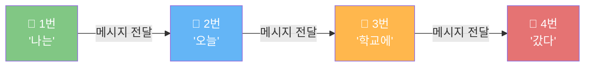

1번 학생이 "나는"이라는 정보를 듣고, 자기가 이해한 내용을 2번에게 전달한다.
2번은 1번에게 받은 메시지 + "오늘"이라는 새 정보를 합쳐서 3번에게 전달한다.
3번은 앞의 모든 내용 + "학교에"를 합쳐서 4번에게 전달한다.

이렇게 하면 마지막 4번 학생은 **문장 전체의 정보**를 가지게 된다. 이것이 RNN의 핵심 아이디어다. 각 단계에서 "이전까지의 기억"과 "새 입력"을 합쳐 다음으로 전달한다.

---

### 100명이 전화 돌리기를 하면? — 장기 의존성 문제

전화 돌리기 게임의 치명적 약점을 떠올려 보자. **사람이 많아질수록 처음 메시지가 왜곡된다.**

5명 정도면 원래 메시지가 잘 전달된다. 하지만 100명이 돌리면? 처음 "딸기 케이크가 맛있다"가 마지막에는 "달걀 게이크가 멋있다"처럼 완전히 변해 버린다.

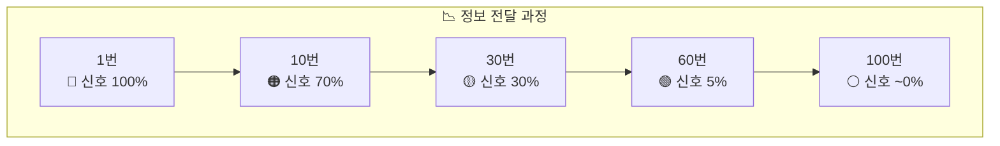

RNN도 마찬가지다. 긴 문장에서 앞부분 정보가 뒤로 갈수록 사라진다. 이것을 **장기 의존성 문제**라고 부른다.

실제 예를 보자:

> "나는 **프랑스에서** 10년간 살면서 다양한 문화를 경험했고, 많은 사람들과 교류하며 ... (중략) ... 그래서 나는 ___를 잘한다."

빈칸에 "프랑스어"를 넣으려면, 아주 멀리 떨어진 "프랑스에서"를 기억해야 한다. 하지만 RNN은 중간에 너무 많은 단어를 거치면서 "프랑스"라는 정보를 까먹어 버린다.

---

### 공책과 형광펜 — LSTM의 아이디어

이 문제를 해결하기 위해 1997년에 **LSTM**이 등장했다.

시험 공부할 때를 생각해 보자. 교과서를 처음부터 끝까지 그냥 읽기만 하면 앞부분을 까먹는다(= RNN). 하지만 **공책**에 중요한 내용을 메모하면서 읽으면 어떨까?

LSTM은 바로 이 "공책"을 추가한 것이다. 이 공책을 **셀 상태(Cell State)**라고 부른다.

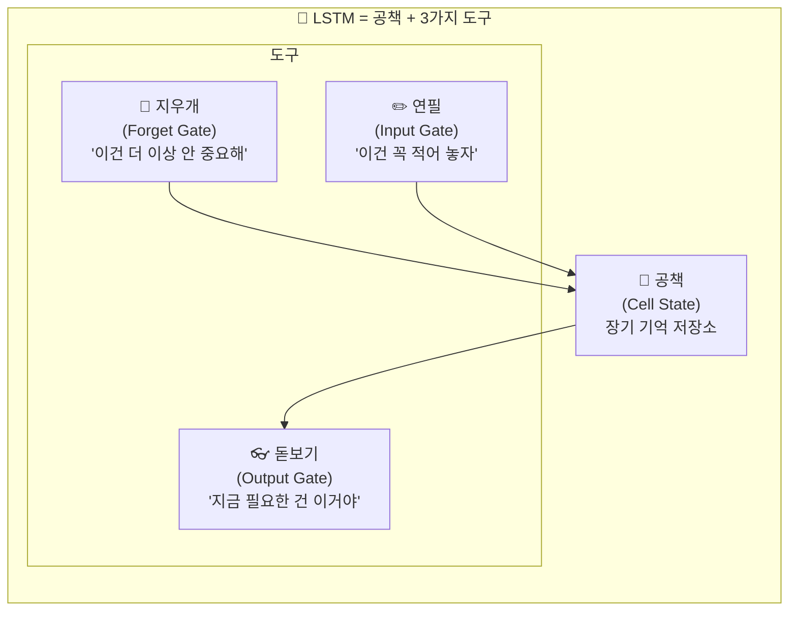

LSTM에는 세 가지 **게이트(문)**가 있다:

**지우개 (Forget Gate)** — "이건 더 이상 안 중요해"
- 공책에서 오래된 메모나 불필요한 내용을 지운다
- 예: 새로운 주어가 나왔으니, 이전 주어 정보는 약하게 만들자

**연필 (Input Gate)** — "이건 꼭 적어 놓자"
- 새로 들어온 정보 중 중요한 것만 골라서 공책에 적는다
- 예: "프랑스에서"라는 정보가 중요하니 공책에 밑줄 치며 적자

**돋보기 (Output Gate)** — "지금 필요한 건 이거야"
- 공책의 내용 중 지금 당장 쓸 것만 꺼내 본다
- 예: 빈칸을 채울 때 공책에서 "프랑스" 메모를 찾아서 활용하자

> 핵심은 **선택적 기억**이다. RNN은 모든 정보를 똑같이 전달하다가 다 잊어버리지만, LSTM은 중요한 것만 골라서 공책에 적고, 불필요한 것은 지우고, 필요할 때만 꺼내 쓴다. 그래서 100번째 단어에서도 1번째 단어의 중요한 정보를 기억할 수 있다.

---

### GRU — LSTM의 간소화 버전

**GRU**는 LSTM을 좀 더 가볍게 만든 모델이다.

LSTM이 도구 3개(지우개, 연필, 돋보기)를 쓴다면, GRU는 도구 2개만 쓴다:

| | LSTM | GRU |
|---|---|---|
| 도구 수 | 3개 (Forget + Input + Output) | 2개 (Reset + Update) |
| 공책 | 별도의 공책(Cell State) 있음 | 공책 없이 메모장 하나로 통합 |
| 속도 | 느림 (도구가 많으니까) | 빠름 (도구가 적으니까) |
| 성능 | 복잡한 문제에서 약간 유리 | 단순한 문제에서 비슷한 성능 |

> 비유하자면, LSTM은 "형광펜 3색 세트"이고, GRU는 "형광펜 2색 세트"다. 대부분의 경우 2색으로도 충분하지만, 정말 복잡한 교과서에는 3색이 도움될 때가 있다.

---

### 책 한 권을 한 문장으로 요약하기 — Seq2Seq의 한계

RNN/LSTM을 이용해 번역 같은 작업을 할 때, **Seq2Seq**라는 구조를 사용한다.

원리는 이렇다:

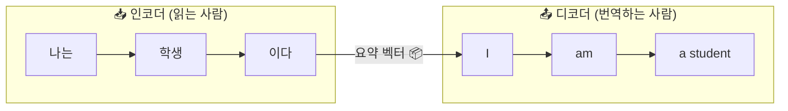

1. **인코더**가 입력 문장("나는 학생이다")을 처음부터 끝까지 읽는다
2. 읽은 내용을 **하나의 요약 벡터**(택배 상자 하나)에 담는다
3. **디코더**가 이 요약 벡터만 보고 번역을 시작한다

문제가 보이는가? **모든 정보를 택배 상자 하나에 우겨넣어야 한다.**

짧은 문장이면 괜찮다. 하지만 논문 한 편 분량의 긴 문장을 상자 하나에 넣으면? 중요한 정보가 빠질 수밖에 없다. 이것을 **정보 병목**이라고 부른다.

> 마치 3시간짜리 영화를 트윗 한 줄(280자)로 요약하라는 것과 같다. 핵심만 남기려 해도 빠지는 내용이 너무 많다.

---

### RNN 계열의 근본적 한계 — 왜 새로운 것이 필요했나

RNN, LSTM, GRU 모두 공통적인 한계를 가진다:

**한계 1: 줄 서서 기다려야 한다 (병렬화 불가)**

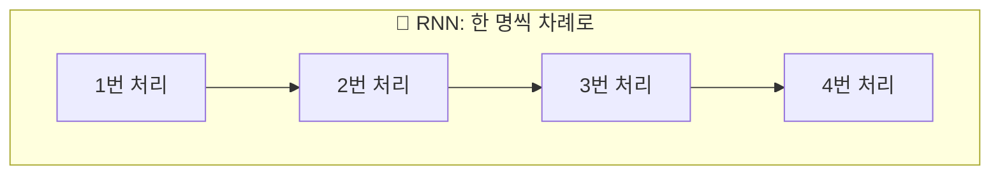

RNN은 1번 단어를 처리해야 2번을 시작할 수 있고, 2번이 끝나야 3번을 시작할 수 있다. 마치 놀이공원에서 한 명씩만 탈 수 있는 놀이기구처럼, 아무리 대기줄이 길어도 한 번에 한 명만 처리한다. GPU에 수천 개의 코어가 있어도 제대로 활용하지 못한다.

**한계 2: 먼 거리의 관계를 잘 못 잡는다**

아무리 LSTM이 공책을 사용해도, 수백 단어 이상 떨어진 정보를 완벽하게 기억하기는 어렵다.

**한계 3: 느리다**

줄 서서 처리하니 당연히 느리다. 학습에 며칠, 몇 주가 걸린다.

> 이 세 가지 한계를 한 번에 해결한 것이 바로 다음에 나오는 **Attention**이다.

---

## 3부. Attention — "중요한 곳에 집중하기"

### 시험 공부의 비밀

시험 범위가 교과서 300페이지라고 하자. 어떻게 공부할까?

**방법 A (RNN 방식)**: 1페이지부터 300페이지까지 순서대로 한 번 쭉 읽는다. 마지막 페이지를 읽을 때쯤이면 첫 페이지 내용은 까먹었다.

**방법 B (Seq2Seq 방식)**: 300페이지를 다 읽고, 요약 노트 한 장을 만든다. 시험 볼 때 이 노트 한 장만 본다. 하지만 한 장에 300페이지를 다 담을 수 없다.

**방법 C (Attention 방식)**: 300페이지를 다 읽되, 각 문제를 풀 때마다 **관련 페이지를 다시 펼쳐서 확인**한다. "이 문제는 7장 내용이네" → 7장을 다시 보고 답을 쓴다. "이 문제는 12장" → 12장을 다시 본다.

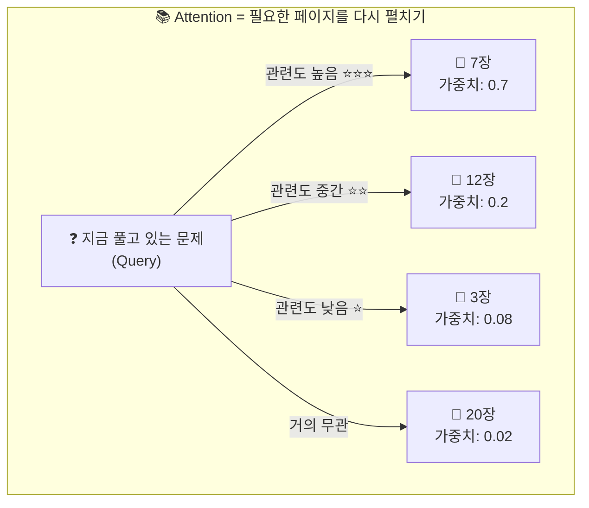

Attention은 방법 C다. **매번 전체 입력을 다시 참조하되, 관련 있는 부분에 더 집중한다.** 요약 노트 한 장에 의존하지 않으므로 정보 손실이 없다.

---

### 도서관에서 책 찾기 — Query, Key, Value

Attention의 핵심은 세 가지 역할로 나뉜다: **Query, Key, Value**

도서관에 가서 책을 찾는 상황을 상상해 보자.

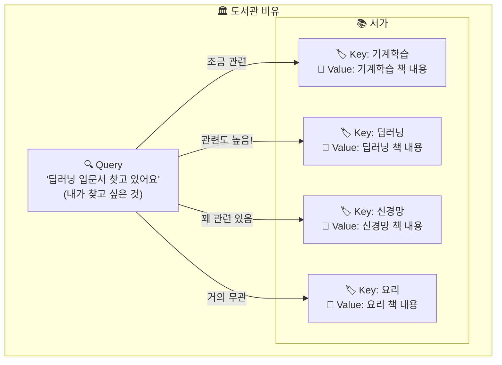

**Query (검색어)**: "딥러닝 입문서를 찾고 있어요" — 내가 지금 알고 싶은 것

**Key (책 태그)**: 각 책에 붙은 분류 태그 — "기계학습", "딥러닝", "요리", "신경망"

**Value (책 내용)**: 실제 책 안에 들어 있는 정보

작동 과정:

1. **비교**: 내 검색어(Query)와 각 책의 태그(Key)를 비교한다
2. **관련도 계산**: "딥러닝" 태그가 가장 관련 높고, "요리" 태그는 거의 무관
3. **정보 가져오기**: 관련도에 비례해서 각 책의 내용(Value)을 가져온다

핵심은 **한 권만 가져오는 것이 아니라**, 관련 있는 여러 책의 내용을 **관련도 비율대로 섞어서** 가져온다는 점이다. "딥러닝" 책 내용 70% + "신경망" 책 내용 20% + "기계학습" 책 내용 8% + "요리" 책 내용 2% 이런 식으로.

---

### 번역에서의 Attention — 실제로 어떻게 쓰이는가

"나는 학교에 갔다"를 "I went to school"로 번역하는 상황을 보자.

Attention이 없으면 (Seq2Seq):
- "I"를 번역할 때도, "went"를 번역할 때도, "school"을 번역할 때도 → **같은 요약 벡터** 하나만 참고

Attention이 있으면:
- "I"를 번역할 때 → **"나는"**에 집중 👀
- "went"를 번역할 때 → **"갔다"**에 집중 👀
- "school"을 번역할 때 → **"학교에"**에 집중 👀

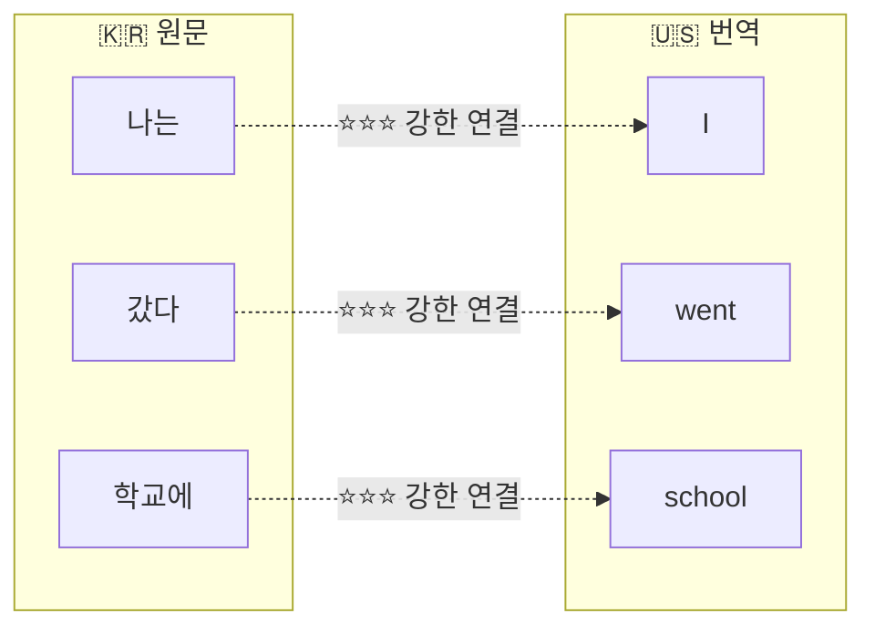

각 번역 단어가 원문의 **적절한 부분에 스스로 집중**한다. 이것이 Attention의 힘이다.

---

### 마이크 볼륨 조절 — √dₖ 스케일링

Attention에서 "관련도"를 계산할 때, 숫자가 너무 커지는 문제가 생길 수 있다.

**비유**: 노래방에서 마이크 볼륨을 생각해 보자.

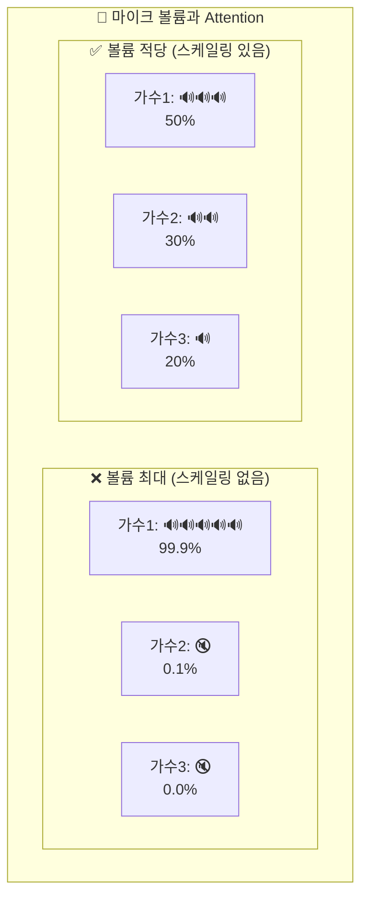

**볼륨이 너무 크면** (스케일링 안 하면):
- 가장 큰 소리만 들리고 나머지는 묻힌다
- Attention이 한 단어에만 99.9% 집중하고 나머지를 무시한다
- 다양한 정보를 활용하지 못한다

**볼륨을 적당히 낮추면** (스케일링 하면):
- 여러 소리가 골고루 들린다
- Attention이 여러 단어를 균형 있게 고려한다
- 더 풍부한 정보를 활용할 수 있다

√dₖ 스케일링은 바로 이 "볼륨을 적당히 낮추는" 역할을 한다. 기술적으로는 벡터 차원이 커질수록 내적 값이 커지는 문제를 보정하는 것이다.

---

### 자아성찰 — Self-Attention

지금까지 본 Attention은 **번역**처럼 두 문장 사이에서 작동했다(원문 → 번역문). 그런데 **같은 문장 안에서** 단어들이 서로를 바라보게 하면 어떨까? 이것이 **Self-Attention**이다.

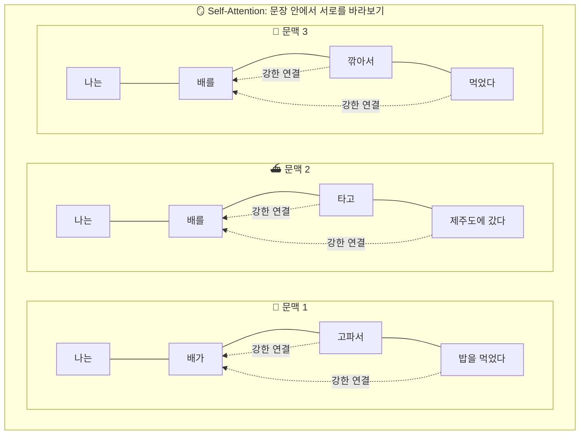

**문맥 1**: "나는 **배**가 **고파서** 밥을 먹었다"
- "배"가 "고파서"와 "밥"을 바라본다 → **아, 신체(배)구나!**

**문맥 2**: "나는 **배**를 **타고** 제주도에 갔다"
- "배"가 "타고"와 "제주도"를 바라본다 → **아, 탈것(배)이구나!**

**문맥 3**: "나는 **배**를 **깎아서** 먹었다"
- "배"가 "깎아서"와 "먹었다"를 바라본다 → **아, 과일(배)이구나!**

이것이 바로 수업 시작할 때 던진 질문의 답이다. **Self-Attention 덕분에 컴퓨터도 문맥을 보고 "배"의 의미를 구분할 수 있다.**

Word2Vec은 "배"에 대해 벡터가 하나뿐이었다. 하지만 Self-Attention은 주변 단어에 따라 "배"의 표현이 **동적으로 변한다**. 같은 단어라도 문맥에 따라 다른 의미를 가질 수 있게 된 것이다.

---

### 영화 감상법 — Multi-Head Attention

Self-Attention 하나로는 한 가지 관점만 볼 수 있다. 그런데 언어에는 다양한 관계가 동시에 존재한다.

"그녀가 말한 것을 그는 이해했다"에서:

- **누가 무엇을 했나?** (문법): "그녀가" → "말한", "그는" → "이해했다"
- **왜?** (의미): "말한 것" → "이해했다" (원인과 결과)
- **누구?** (대명사): "그녀가" ≠ "그는" (서로 다른 사람)

하나의 Attention으로 이 모든 관계를 동시에 잡기는 어렵다.

**Multi-Head Attention**은 여러 명이 같은 영화를 동시에 보는 것과 같다.

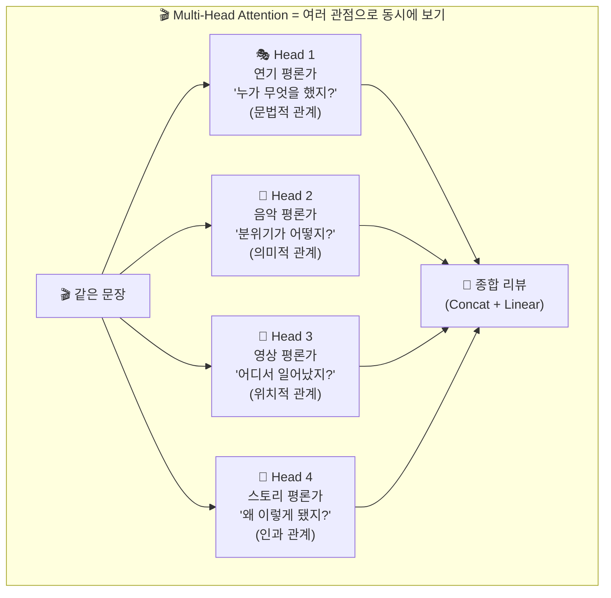

각 Head(평론가)는 자기만의 관점에서 문장을 분석한다:

- **Head 1** (문법 전문가): "그녀가"와 "말한"이 주어-서술어 관계라는 것에 주목
- **Head 2** (의미 전문가): "말한 것"과 "이해했다"의 인과 관계에 주목
- **Head 3** (위치 전문가): 가까운 단어들 사이의 관계에 주목
- **Head 4** (대명사 전문가): "그녀"와 "그"가 다른 사람이라는 것에 주목

마지막에 모든 평론가의 의견을 종합하면, 어느 한 사람이 보는 것보다 훨씬 풍부한 이해가 가능하다. 한 Head가 놓친 관계도 다른 Head가 잡아낸다.

> 실제 Transformer 모델은 8~16개의 Head를 사용한다. 마치 영화를 8~16명의 전문가가 동시에 분석하는 것과 같다.

---

### Causal Mask — 스포일러 금지!

하나 더. 문장을 **생성**할 때는 특별한 규칙이 필요하다.

GPT같은 모델이 문장을 만들 때, 아직 만들지 않은 뒷부분을 미리 보면 안 된다. 이것은 마치 **소설을 쓰면서 마지막 페이지를 먼저 보는 것**과 같다. 스포일러는 금지다!

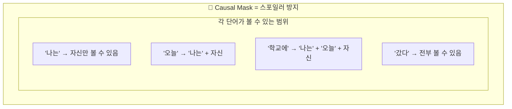

이것을 **Causal Mask(인과 마스크)**라고 한다. 각 단어는 자신과 자기 이전 단어만 볼 수 있고, 미래의 단어는 볼 수 없다. 영화를 볼 때 현재 장면까지만 알 수 있고, 앞으로 일어날 일은 모르는 것과 같다.

---

## 4부. 전체 정리

### 오늘 배운 것을 한눈에

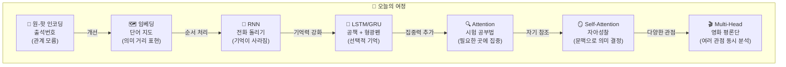

### 핵심 비유 요약

| 개념 | 비유 | 핵심 아이디어 |
|---|---|---|
| 원-핫 인코딩 | 출석번호 | 구분만 가능, 관계는 모름 |
| 단어 임베딩 | 단어 지도 | 비슷한 의미는 가까이 위치 |
| 분포 가설 | 유유상종 | 같은 자리에 나오면 비슷한 뜻 |
| RNN | 전화 돌리기 | 기억을 전달하지만 길면 왜곡 |
| LSTM | 공책 + 형광펜 | 중요한 것만 골라 기억 |
| GRU | LSTM 라이트 | 도구 2개로 간소화 |
| 정보 병목 | 영화를 트윗 한 줄로 요약 | 정보 손실 불가피 |
| Attention | 시험 공부 | 문제마다 관련 페이지를 다시 펼침 |
| Q, K, V | 도서관 검색 | 검색어, 태그, 실제 내용 |
| √dₖ 스케일링 | 마이크 볼륨 조절 | 한 소리만 들리지 않게 |
| Self-Attention | 자아성찰 | 문맥에 따라 의미가 변함 |
| Multi-Head | 영화 평론단 | 여러 전문가가 동시에 분석 |
| Causal Mask | 스포일러 금지 | 미래는 볼 수 없음 |

---

### 확인 퀴즈

**문제 1**: "배"라는 단어가 과일인지, 신체인지, 탈것인지 구분하려면, 어떤 메커니즘이 필요한가?

① 원-핫 인코딩
② Word2Vec
③ Self-Attention
④ RNN

> **정답: ③** — Self-Attention은 주변 문맥("고파서" vs "타고" vs "깎아서")을 보고 같은 단어의 의미를 다르게 표현할 수 있다.

**문제 2**: LSTM이 RNN의 장기 의존성 문제를 해결하는 핵심 아이디어는?

① 더 큰 신경망을 사용한다
② 중요한 정보만 골라서 기억하는 게이트를 추가한다
③ 문장을 거꾸로 읽는다
④ 더 많은 학습 데이터를 사용한다

> **정답: ②** — LSTM은 Forget/Input/Output 게이트를 통해 정보를 선택적으로 기억하고 잊는다.

**문제 3**: Attention에서 √dₖ로 스케일링하지 않으면 어떤 문제가 생기는가?

① 계산이 불가능하다
② 한 단어에만 극단적으로 집중하고 나머지를 무시한다
③ 모든 단어에 동일한 가중치를 준다
④ 메모리가 부족해진다

> **정답: ②** — 마이크 볼륨이 너무 크면 가장 큰 소리만 들리는 것처럼, 스케일링 없이는 가장 관련 높은 한 단어에만 집중하고 나머지 정보를 잃는다.

---

### 다음 시간 예고

오늘은 비유와 그림으로 핵심 개념을 이해했다. 다음 시간(3주차 B회차)에서는 이 개념들을 **직접 코드로 구현**하면서 체화한다. Self-Attention이 실제로 어떤 단어에 주목하는지 **히트맵으로 시각화**하여 눈으로 확인해 볼 것이다.

---

### 더 알아보기

- Jay Alammar, "The Illustrated Transformer" — 그림으로 이해하는 Transformer (영문)
- 3Blue1Brown, "Attention in Transformers, visually explained" — 시각적 설명 영상 (영문, 자막 가능)
- Lilian Weng, "Attention? Attention!" — Attention 메커니즘 총정리 (영문)
