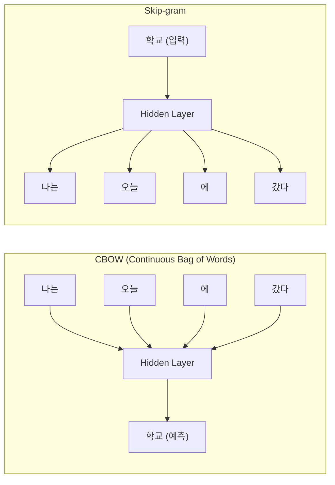
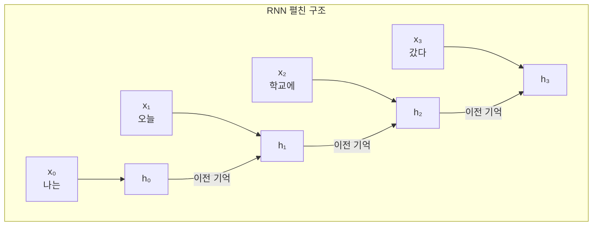
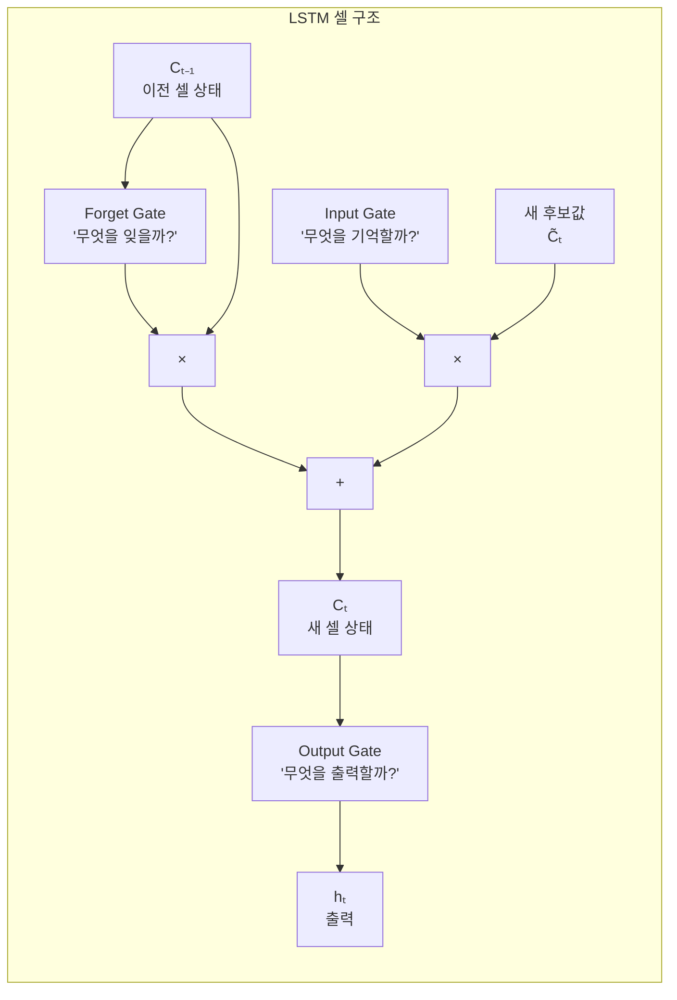
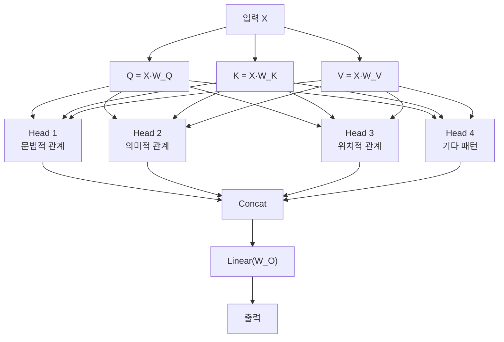

## 3주차 A회차: 시퀀스 모델에서 Transformer로 — 이론과 시연

> **미션**: 수업이 끝나면 Attention의 Query-Key-Value 개념을 설명하고, √dₖ 스케일링의 역할을 이해한다

### 학습목표

이 회차를 마치면 다음을 수행할 수 있다:

1. 단어 임베딩(Word2Vec, GloVe, FastText)의 원리와 분포 가설을 설명할 수 있다
2. RNN/LSTM/GRU의 구조를 비교하고 장기 의존성 문제를 이해한다
3. Attention 메커니즘의 Query, Key, Value 개념을 설명할 수 있다
4. Scaled Dot-Product Attention의 √dₖ 스케일링이 필요한 이유를 이해한다
5. Self-Attention과 Multi-Head Attention의 원리를 설명할 수 있다

### 수업 타임라인

| 시간        | 내용                                                       | Copilot 사용                  |
| ----------- | ---------------------------------------------------------- | ----------------------------- |
| 00:00~00:05 | 오늘의 질문 + 빠른 진단(퀴즈 1문항)                        | 사용 안 함                    |
| 00:05~00:55 | 이론 강의 (직관적 비유 → 개념 → 원리)                      | 사용 안 함                    |
| 00:55~01:25 | 라이브 코딩 시연 (Scaled Dot-Product Attention NumPy 구현) | 직접 실습 또는 시연 영상 참고 |
| 01:25~01:28 | 핵심 정리 + B회차 과제 스펙 공개                           |                               |
| 01:28~01:30 | Exit ticket (1문항)                                        |                               |

---

### 오늘의 질문 + 빠른 진단

**오늘의 질문**: "서로 다른 의미를 가진 '은행'(금융기관 vs 강둑)을 같은 벡터로 표현할 수 있을까? 그렇다면 어떻게?"

**빠른 진단 (1문항)**:

다음 문장을 읽고 답하시오.

"나는 은행에 가서 돈을 찾았다."

이 문장에서 "은행"의 의미를 정확히 파악하려면, 어떤 단어들을 함께 고려해야 할까?

① 앞의 단어들만
② 뒤의 단어들만
③ 앞뒤의 단어들을 모두
④ 문장 전체의 문맥

정답: ③ (또는 ④) — 이것이 Attention이 필요한 이유이다.

---

### 이론 강의

#### 3.1 순차 데이터와 단어 임베딩

##### 순차 데이터란?

자연어는 대표적인 **순차 데이터(Sequential Data)**이다. "나는 학교에 갔다"에서 "나는"과 "갔다"의 순서를 바꾸면 의미가 완전히 달라진다. 이처럼 순서가 의미를 결정하는 데이터를 순차 데이터라 한다. 시계열 데이터(주가, 날씨), 음성 신호, DNA 서열 등도 모두 순차 데이터에 속한다.

그렇다면 컴퓨터는 단어를 어떻게 이해할까? 가장 단순한 방법은 **원-핫 인코딩(One-hot Encoding)**이다. 어휘 사전에 1,000개의 단어가 있다면, 각 단어를 길이 1,000인 벡터로 표현하되 해당 위치만 1이고 나머지는 모두 0으로 채운다.

예를 들어, 사전이 ["나", "학교", "갔다", "좋아"]라면:

- "나" = [1, 0, 0, 0]
- "학교" = [0, 1, 0, 0]
- "갔다" = [0, 0, 1, 0]

그러나 원-핫 인코딩에는 두 가지 근본적인 문제가 있다:

1. **고차원 문제**: 어휘가 30,000개면 벡터 차원도 30,000이 된다. 메모리 낭비가 심하고 계산도 비효율적이다.
2. **의미 관계 부재**: "개"와 "강아지"는 의미가 비슷하지만, 원-핫 벡터 사이의 코사인 유사도는 항상 0이다. 모든 단어 쌍의 거리가 동일하므로 의미적 유사성을 전혀 표현하지 못한다.

> **쉽게 말해서**: 원-핫 인코딩은 각 단어를 우편 번호 같은 ID로만 구분하는 것이다. "강아지(123)"와 "개(456)"가 우편 번호로는 완전히 다르지만, 실제로는 의미가 같은 것처럼.

이 문제를 해결하기 위해 등장한 것이 **단어 임베딩(Word Embedding)**이다.

##### 단어 임베딩: 의미를 담은 벡터

단어 임베딩은 각 단어를 저차원(보통 100~300차원)의 **밀집 벡터(Dense Vector)**로 표현한다. 원-핫 벡터가 대부분 0인 "희소 벡터"인 반면, 임베딩 벡터는 모든 차원에 의미 있는 실수값이 들어 있다.

**직관적 이해**: 임베딩은 단어를 지도 위의 점처럼 생각하는 것이다. "개"와 "강아지"는 지도 위에서 매우 가까이 위치하므로 유사도를 계산할 수 있다. 반면 "개"와 "컴퓨터"는 멀리 떨어져 있다.

핵심 아이디어는 **분포 가설(Distributional Hypothesis)**이다:

> "비슷한 문맥에 등장하는 단어는 비슷한 의미를 갖는다" (Harris, 1954)

예를 들어:

- "나는 **커피**를 마셨다"
- "나는 **차**를 마셨다"

"커피"와 "차"는 같은 문맥(\_\_\_ 를 마셨다)에 등장하므로 비슷한 벡터로 표현된다.

**그래서 무엇이 달라지는가?** 원-핫 인코딩에서는 "개"의 벡터와 "강아지"의 벡터 사이의 코사인 유사도가 항상 0이었다. 하지만 임베딩에서는 두 벡터가 매우 가깝게 위치하므로, 코사인 유사도가 0.9 이상이 될 수 있다. 이는 모델이 의미적으로 비슷한 단어들을 구분 없이 사용할 수 있게 해준다.

##### Word2Vec: 임베딩의 혁명

Word2Vec(Mikolov et al., 2013)은 단어 임베딩을 효율적으로 학습하는 방법으로, NLP 분야에 혁신을 가져왔다. 두 가지 학습 방식이 있다:



**그림 3.1** Word2Vec의 두 가지 학습 방식

**CBOW (Continuous Bag of Words)**: 주변 단어(Context)로 중심 단어(Center)를 예측한다. "나는 오늘 \_\_\_ 에 갔다"에서 빈칸을 맞추는 문제이다. 학습이 빠르고 빈도가 높은 단어에 유리하다.

**Skip-gram**: 중심 단어로 주변 단어를 예측한다. "학교"가 주어지면 "나는", "오늘", "에", "갔다"를 맞추는 문제이다. 빈도가 낮은 단어에도 좋은 임베딩을 생성한다.

이 두 방법의 차이를 생각해 보면, CBOW는 여러 정보를 하나로 종합하는 "요약 기반" 학습이고, Skip-gram은 하나의 단어로 주변을 예측하는 "분산 기반" 학습이다. Skip-gram이 더 오래 학습하지만 임베딩 품질이 더 좋아서 실무에서는 Skip-gram을 더 선호한다.

실제로 Skip-gram 모델을 학습시키면, 의미적으로 유사한 단어들이 임베딩 공간에서 가까이 위치하게 된다. 간단한 한국어 문장으로 학습한 결과이다:

```
어휘 크기: 20
학습 쌍 수: 84

'나는'과 가장 유사한 단어 (상위 5개):
  학교에서: 0.5015
  공부를:   0.4827
  마셨다:   0.4654
  차를:     0.3613
  회사에:   0.3451
```

"나는"과 "학교에서"가 유사한 것은, 학습 데이터에서 두 단어가 비슷한 문맥에 자주 함께 등장했기 때문이다.

_전체 코드는 practice/chapter3/code/3-1-임베딩.py 참고_

##### 임베딩의 마법: 벡터 산술

Word2Vec이 유명해진 결정적 이유는 **벡터 산술(Vector Arithmetic)**이 가능하다는 발견이다:

벡터("왕") - 벡터("남자") + 벡터("여자") ≈ 벡터("여왕")

이는 임베딩 공간이 단순히 단어를 나열한 것이 아니라, 성별, 시제, 단복수 같은 **의미적 관계를 기하학적으로 인코딩**하고 있음을 보여준다. "왕"에서 "남자" 성분을 빼고 "여자" 성분을 더하면 "여왕"에 도달하는 것이다. 이러한 관계는 학습 과정에서 자동으로 발견된다.

> **쉽게 말해서**: 임베딩 벡터들의 위치와 방향이 의미론적 관계를 반영한다는 뜻이다. 마치 지도 위에서 거리와 방향이 실제 지리적 관계를 나타내는 것처럼, 임베딩 공간에서도 벡터 간 거리와 방향이 의미적 관계를 나타낸다.

##### 사전학습 임베딩

Word2Vec을 직접 학습하려면 대규모 말뭉치가 필요하다. 실무에서는 미리 학습된 임베딩을 가져다 쓰는 경우가 많다.

**표 3.1** 주요 사전학습 임베딩 비교

| 모델     | 학습 방식                  | 특징                        | 차원    |
| -------- | -------------------------- | --------------------------- | ------- |
| Word2Vec | 예측 기반 (Skip-gram/CBOW) | 로컬 문맥만 사용            | 100~300 |
| GloVe    | 통계 기반 (동시출현 행렬)  | 전역 통계 활용, 학습 안정적 | 50~300  |
| FastText | Word2Vec + 서브워드        | 미등록 단어(OOV) 처리 가능  | 100~300 |

**GloVe** (Pennington et al., 2014)는 전체 말뭉치에서 단어 쌍의 동시 출현 빈도를 행렬로 구축한 뒤, 이 행렬을 분해하여 임베딩을 얻는다. Word2Vec이 "창문" 안의 로컬 문맥만 보는 데 반해, GloVe는 전역 통계를 활용한다. 이렇게 하면 더 일관된 임베딩을 얻을 수 있다.

**FastText** (Bojanowski et al., 2017)는 단어를 글자 단위 n-gram으로 분해하여 학습한다. "unbelievable"을 "un", "bel", "iev", "abl", "ble" 같은 부분으로 쪼개므로, 학습 데이터에 없는 새로운 단어도 서브워드 조합으로 벡터를 생성할 수 있다. 이는 문법을 고려한 학습을 가능하게 한다.

> **참고**: 현재 BERT, GPT 같은 Transformer 모델들은 문맥에 따라 임베딩이 동적으로 변하는 **문맥 임베딩(Contextual Embedding)**을 사용한다. Word2Vec/GloVe는 단어마다 하나의 고정된 벡터를 가지므로 다의어를 구분하지 못한다는 한계가 있다. 예를 들어 "은행"이라는 단어는 금융기관인 경우와 강둑인 경우에 모두 같은 벡터로 표현되어 앞뒤 문맥을 활용하지 못한다. 이 문제는 5장에서 BERT를 다루며 다시 살펴본다.

---

#### 3.2 RNN/LSTM/GRU (개념 중심)

##### RNN: 기억력 있는 신경망

2장에서 배운 MLP는 입력을 **독립적으로** 처리한다. "나는 오늘 학교에 갔다"라는 문장을 MLP에 넣으면, 각 단어를 개별적으로 보며 "나는" 다음에 "오늘"이 왔다는 순서 정보를 활용하지 못한다. 즉, MLP는 순차 구조를 무시한다.

**직관적 이해**: MLP는 사람이 눈을 감은 채 문장을 한 글자씩 들으면서, 각 글자가 무엇인지만 판단하는 것과 같다. 문장의 맥락이나 앞뒤 글자와의 관계를 파악할 수 없다.

**순환 신경망(Recurrent Neural Network, RNN)**은 이 문제를 해결한다. RNN은 이전 시점의 **은닉 상태(Hidden State)**를 현재 시점의 입력과 함께 처리하여, 과거 정보를 "기억"할 수 있다.



**그림 3.2** RNN의 펼친(Unrolled) 구조

각 시점의 계산은 다음과 같다:

hₜ = tanh(Wₓₕ · xₜ + Wₕₕ · hₜ₋₁ + b)

이 식이 말하는 것은 결국, **현재 은닉 상태는 현재 입력(xₜ)과 이전 은닉 상태(hₜ₋₁)의 결합으로부터 만들어진다**는 뜻이다.

여기서 핵심은 **Wₕₕ가 모든 시점에서 공유**된다는 것이다. 이 공유 가중치가 "기억"을 전달하는 역할을 한다. 같은 가중치를 사용하므로 어떤 길이의 시퀀스든 처리할 수 있다는 장점이 있다.

**그래서 무엇이 달라지는가?** MLP는 각 단어를 독립적으로 처리했지만, RNN은 hₜ₋₁을 통해 이전 단어들의 정보를 누적한다. 이렇게 하면 "나는 오늘 학교에 갔다"를 처리할 때, "갔다"를 해석할 때 앞의 "나는", "오늘", "학교에" 정보를 모두 활용할 수 있다.

##### 장기 의존성 문제

그러나 RNN에는 근본적인 한계가 있다. 문장이 길어지면 앞부분의 정보가 점점 사라진다. 이를 **장기 의존성 문제(Long-term Dependency Problem)**라 한다.

원인은 역전파 과정에서 **기울기가 반복적으로 곱해지기** 때문이다. 예를 들어 100 시점에 걸친 역전파에서 Wₕₕ가 반복적으로 곱해진다. Wₕₕ의 최대 고유값이 1보다 작으면 기울기가 지수적으로 줄어들고(**기울기 소실**, Vanishing Gradient), 1보다 크면 폭발적으로 커진다(**기울기 폭주**, Exploding Gradient).

구체적인 예를 들면:

"나는 **프랑스에서** 10년간 살면서 다양한 문화를 경험했고, 많은 사람들과 교류하며 새로운 언어도 배우고 ... (중략) ... 그래서 나는 \_\_\_를 잘한다."

빈칸에 "프랑스어"를 넣으려면 멀리 떨어진 "프랑스에서"를 기억해야 한다. RNN은 이런 긴 거리의 의존성을 처리하기 어렵다. 한번 "프랑스에서"의 정보가 기울기와 함께 100번 곱해지면, 그 정보의 영향력은 거의 0에 가까워진다.

> **쉽게 말해서**: 은닉 상태가 정보를 전달하는 파이프처럼 작동하는데, 이 파이프에 들어간 신호(기울기)가 반복적으로 곱해지면서 극도로 약해지거나 엄청나게 강해지는 문제이다.

##### LSTM: 선택적 기억 장치

**LSTM(Long Short-Term Memory)** (Hochreiter & Schmidhuber, 1997)은 장기 의존성 문제를 해결하기 위해 **셀 상태(Cell State)**와 **3개의 게이트(Gate)**를 도입했다.



**그림 3.3** LSTM 셀 구조

**직관적 이해**: LSTM을 도서관 사서의 일과에 비유해 보자. 사서는 사서함(셀 상태)에 책을 넣고 빼는 일을 한다. 각 게이트는 사서의 판단이다.

각 게이트의 역할:

- **Forget Gate** ("이 책은 더 이상 필요 없으니 반납하세요"): 이전 정보 중 불필요한 것을 잊는다. σ(Wf · [hₜ₋₁, xₜ] + bf)로 계산하며, 출력이 0이면 완전히 잊고 1이면 완전히 유지한다.
- **Input Gate** ("이 새 책은 중요하니 서가에 꽂으세요"): 새 정보 중 어떤 것을 기억할지 결정한다. σ(Wᵢ · [hₜ₋₁, xₜ] + bᵢ)로 얼마나 반영할지 결정하고, tanh(Wc · [hₜ₋₁, xₜ] + bc)로 새 후보값을 생성한다.
- **Output Gate** ("이 책을 빌려가세요"): 셀 상태에서 현재 필요한 정보만 출력한다. σ(Wo · [hₜ₋₁, xₜ] + bo)로 결정한다.

이 세 게이트의 식을 합치면:

Cₜ = fₜ ⊙ Cₜ₋₁ + iₜ ⊙ C̃ₜ

이 식이 말하는 것은 결국, **새로운 셀 상태는 이전 상태에서 일부를 잊고(fₜ · Cₜ₋₁), 새 정보를 일부 더하는 것(iₜ · C̃ₜ)**이다.

셀 상태(Cell State)는 **컨베이어 벨트**와 같다. 정보가 게이트를 거치며 선택적으로 추가·삭제되지만, 기본적으로 직선 경로를 따라 흘러가므로 기울기가 잘 전달된다. 게이트의 출력이 0과 1 사이의 값이므로 기울기 소실 문제를 크게 완화할 수 있다. 이것이 LSTM이 장기 의존성 문제를 완화하는 핵심 원리이다.

**그래서 무엇이 달라지는가?** RNN은 매 시점마다 같은 가중치 Wₕₕ를 곱하면서 정보가 사라지는 문제가 있었다. LSTM은 덧셈(+)을 사용하여 정보를 축적하고, 게이트로 선택적으로 정보를 조절하므로, 긴 문맥에서도 초반의 정보를 더 오래 유지할 수 있다.

##### GRU: LSTM의 간소화

**GRU(Gated Recurrent Unit)** (Cho et al., 2014)는 LSTM의 3개 게이트를 2개로 줄인 간소화 버전이다:

- **Reset Gate** (rₜ): 이전 은닉 상태 중 얼마나 무시할지 결정한다.
- **Update Gate** (zₜ): 새 정보와 이전 정보의 비율을 조절한다. (Forget Gate + Input Gate의 역할을 통합)

수식으로 표현하면:

rₜ = σ(Wᵣ · [hₜ₋₁, xₜ] + bᵣ)
zₜ = σ(Wz · [hₜ₋₁, xₜ] + bz)
h̃ₜ = tanh(W · [rₜ ⊙ hₜ₋₁, xₜ] + b)
hₜ = (1 - zₜ) ⊙ hₜ₋₁ + zₜ ⊙ h̃ₜ

마지막 식이 의미하는 것은 결국, **새로운 은닉 상태는 이전 상태와 새 후보 상태의 가중합**이라는 뜻이다.

**표 3.2** LSTM vs GRU 비교

| 항목        | LSTM                      | GRU                           |
| ----------- | ------------------------- | ----------------------------- |
| 게이트 수   | 3 (Forget, Input, Output) | 2 (Reset, Update)             |
| 셀 상태     | 별도의 Cell State 존재    | Hidden State만 사용           |
| 파라미터 수 | 4 × (d² + d·h + d)        | 3 × (d² + d·h + d)            |
| 성능        | 대규모 데이터에서 유리    | 소규모 데이터에서 유사한 성능 |
| 학습 속도   | 상대적으로 느림           | 상대적으로 빠름               |

> **실무 팁**: 데이터가 충분하면 LSTM, 작은 데이터셋이면 GRU가 효율적이다. 다만 현재는 Transformer가 대부분의 NLP 태스크에서 RNN 계열을 대체했다.

##### Seq2Seq와 Encoder-Decoder 구조

RNN의 중요한 응용 중 하나가 **Seq2Seq(Sequence-to-Sequence)** 모델이다. 입력 시퀀스를 고정 길이 벡터로 인코딩한 뒤, 이를 디코딩하여 출력 시퀀스를 생성한다. 기계 번역에서 "나는 학생이다" → "I am a student"처럼 가변 길이 시퀀스 간 변환에 사용된다.

구조를 보면:

1. **Encoder**: 입력 문장 "나는 학생이다"의 각 단어를 순차적으로 처리하여, 마지막 은닉 상태를 "문맥 벡터(Context Vector)"로 생성한다.
2. **Decoder**: 이 문맥 벡터를 시작점으로 하여, 한 단어씩 번역을 생성한다.

그러나 Seq2Seq의 **Encoder가 입력 전체를 하나의 벡터로 압축**해야 한다는 점이 한계이다. 이를 **정보 병목(Information Bottleneck)**이라 한다. 예를 들어 10개 단어의 정보를 모두 512차원 벡터 하나에 담아야 하므로, 정보 손실이 불가피하다. 특히 긴 문장에서 성능이 급격히 떨어진다.

> **쉽게 말해서**: 전체 책의 내용을 한 문장으로 요약해야 하는데, 중요한 내용들이 빠질 수밖에 없다는 뜻이다.

이 문제를 해결하기 위해 다음 절에서 다루는 Attention이 등장했다.

##### RNN 계열의 근본적 한계

RNN, LSTM, GRU는 모두 공통적인 한계를 가진다:

1. **순차 처리**: 시점 t의 계산은 시점 t-1이 끝나야 시작할 수 있어 **병렬화가 불가능**하다. GPU의 수천 개 코어를 활용하지 못한다. 이는 학습 속도를 심각하게 제한한다.
2. **긴 문맥 처리의 한계**: LSTM도 수백 토큰 이상의 긴 문맥에서는 성능이 저하된다. 아무리 개선해도 기하학적 거리가 길어질수록 정보 전달이 어려워진다.
3. **느린 학습 속도**: 순차 처리로 인해 배치 병렬화의 이점을 충분히 활용하지 못한다.

이러한 한계를 극복하기 위해 등장한 것이 바로 다음 절에서 다루는 **Attention 메커니즘**이며, 나아가 4장에서 다루는 Transformer는 RNN을 완전히 제거하고 Attention만으로 시퀀스를 처리한다.

---

#### 3.3 Attention 메커니즘

##### 왜 Attention이 필요한가?

번역 문제를 생각해 보자. "나는 학교에 갔다"를 "I went to school"로 번역할 때, RNN 기반 Seq2Seq 모델은 전체 입력 문장을 하나의 고정 길이 벡터로 압축한 후 번역을 시작한다. 이를 **정보 병목(Information Bottleneck)**이라 한다.

문장이 짧으면 괜찮지만, 100단어짜리 문장의 모든 정보를 하나의 벡터에 담는 것은 무리이다. 실제로 Seq2Seq 모델은 문장 길이가 20단어를 넘으면 성능이 급격히 떨어졌다.

**직관적 이해**: 지금 당신이 타이핑 중이다. 다음 단어를 칠 때, 책 전체를 다 봐야 하나? 아니다. 현재 문맥 주변만 보면 된다. 만약 장황한 설명이 있다면, 그 부분은 가볍게 흝어보고 핵심 부분에 눈을 집중한다.

**Attention**(Bahdanau et al., 2014)은 이 문제를 "번역할 때 원문의 **관련 부분에 집중**하자"는 아이디어로 해결했다. 시험 공부할 때 교과서 전체를 같은 비중으로 읽지 않고, 중요한 부분에 밑줄을 긋고 더 집중하는 것과 같은 원리이다.

**그래서 무엇이 달라지는가?** Seq2Seq는 "I"를 번역할 때도, "went"를 번역할 때도, "school"을 번역할 때도 모두 같은 문맥 벡터를 사용했다. Attention은 각 번역 단어마다 원문의 **다른 부분에 주목**한다. "I"를 번역할 때는 "나는"에 높은 가중치를 주고, "went"를 번역할 때는 "갔다"에 높은 가중치를 준다.

##### Query, Key, Value

Attention의 핵심은 세 가지 요소이다:

- **Query (Q)**: "내가 찾고 싶은 것" — 현재 처리 중인 단어(또는 은닉 상태)의 관점
- **Key (K)**: "후보 답의 라벨" — 참조할 단어들의 식별자
- **Value (V)**: "실제 답의 내용" — 참조할 단어들의 실제 정보

**직관적 이해**: 도서관 검색을 생각해 보자. "딥러닝 입문서를 찾고 싶다"가 **Query**이다. 서가에 꽂힌 각 책의 분류 태그(예: "기계학습", "신경망", "딥러닝")가 **Key**이다. Query와 Key를 비교하여 관련도를 계산한 뒤, 관련도가 높은 책들의 실제 내용(**Value**)을 가져온다. 이때 한 권만 가져오는 것이 아니라, 관련도에 비례하여 여러 책의 내용을 **가중 합산**한다.

예를 들어, Query("딥러닝")와 Key들의 관련도가:

- "기계학습": 0.6
- "신경망": 0.8
- "역사": 0.1

이라면, 최종 정보는:

- 0.6 × Value("기계학습") + 0.8 × Value("신경망") + 0.1 × Value("역사")

이렇게 가중합산된다.

##### Scaled Dot-Product Attention

구체적인 계산 과정을 단계별로 살펴보자:

**Attention(Q, K, V) = softmax(QKᵀ / √dₖ) · V**

**[단계 1] QKᵀ — 유사도 계산**

Query와 모든 Key의 **내적(Dot Product)**을 계산한다. 내적 값이 클수록 두 벡터의 방향이 비슷하다는 뜻이다. Q와 K의 행렬 곱으로 한번에 모든 쌍의 유사도를 계산할 수 있어 효율적이다.

구체적인 예로, 4개 단어의 Query와 Key를 생각해 보자:

- Q: (4, 4) 행렬, K: (4, 4) 행렬
- QKᵀ: (4, 4) 행렬, QKᵀ[i,j] = Query[i] · Key[j]

**[단계 2] √dₖ로 나누기 — 스케일링**

왜 나눌까? Key의 차원 dₖ가 클수록, 내적 값의 분산도 dₖ에 비례하여 커진다.

> **쉽게 말해서**: 두 개의 d 차원 벡터를 내적하면, 차원이 클수록 결과값이 커진다는 뜻이다.

값이 매우 크면 softmax 출력이 0 또는 1에 극단적으로 가까워져 기울기가 거의 사라진다. √dₖ로 나누면 분산이 약 1로 안정화된다:

```
스케일링 전 scores 분산: 6.838
스케일링 후 scores 분산: 0.855
기대 분산 (이론값):      ~1.0
```

분산이 1 근처로 안정화되면, softmax의 입력이 극단적으로 커지지 않으므로 기울기가 안정적으로 흐른다.

**[단계 3] Softmax — 확률 변환**

스케일링된 점수에 softmax를 적용하여 합이 1인 **확률 분포**(가중치)로 변환한다. 각 값은 "이 Key에 얼마나 주목할 것인가"를 나타낸다.

softmax를 통과하면:

- 0과 1 사이의 값이 된다 (음수 불가)
- 모든 가중치의 합이 1이 된다
- 큰 값은 더 크고, 작은 값은 더 작아진다 (극단화)

**[단계 4] 가중합 — 최종 출력**

각 Value에 대응하는 가중치를 곱하고 합산한다. 가중치가 높은 단어의 정보가 더 많이 반영된다.

수식으로 표현하면:
Output = Attention_Weight[0] × Value[0] + Attention_Weight[1] × Value[1] + ... + Attention_Weight[n-1] × Value[n-1]

이렇게 여러 정보를 가중합산하면, 모델이 "각 위치마다 어디에 집중할 것인가"를 스스로 학습한다.

실제 구현 결과를 보자. "나는 은행에서 돈을 찾았다"에 대한 Attention Weight이다:

```
Attention Weights:
  나는     → [0.985  0.010  0.001  0.005]
  은행에서 → [0.140  0.768  0.035  0.057]
  돈을     → [0.014  0.026  0.807  0.152]
  찾았다   → [0.080  0.067  0.238  0.615]
```

각 행은 해당 단어가 다른 단어에 얼마나 "주목"하는지를 나타낸다.

- "나는"은 자신(0.985)에 거의 모든 주목을 쏟는다. 앞뒤 문맥이 없기 때문이다.
- "은행에서"는 자신(0.768)에 가장 많이 주목하지만, "나는"(0.140)에도 일부 주목한다. 주어를 확인하려는 의도로 해석할 수 있다.
- "돈을"은 자신(0.807)에 대부분 주목하지만, "찾았다"(0.152)에도 주목한다. "돈을 찾다"라는 의미적 연결을 포착하고 있다.
- "찾았다"는 "돈을"(0.238)에 상당한 주목을 하여, 동작의 대상을 파악하는 것으로 해석할 수 있다.

_전체 코드는 practice/chapter3/code/3-3-어텐션.py 참고_

---

#### 3.4 Self-Attention과 Multi-Head Attention

##### Self-Attention: 문장 안에서 서로를 바라보기

앞서 본 Attention은 원래 Encoder-Decoder 사이에서 사용되었다(**Cross-Attention**). **Self-Attention**은 같은 문장 안에서 단어들이 서로를 참조하는 것이다. Q, K, V가 모두 **같은 입력**에서 생성된다는 것이 핵심 차이이다.

**직관적 이해**: 자아성찰을 생각해 보자. 일기를 쓸 때, 내가 스스로 내 행동을 평가하고 의미를 찾는 것이다. 마찬가지로 Self-Attention에서는 각 단어가 자신을 포함한 모든 단어를 바라보며 의미를 결정한다.

"나는 은행에서 돈을 찾았다"에서 Self-Attention이 하는 일:

- "은행"이라는 단어를 이해하려면, "돈"과 "찾았다"를 함께 봐야 금융기관이라는 의미가 확정된다
- 만약 문장이 "나는 강가의 은행 에 앉았다"였다면, "강가"와 "앉았다"에 높은 Attention을 주어 강둑(river bank)이라는 의미가 된다

이처럼 Self-Attention은 **문맥에 따라 단어의 의미를 동적으로 결정**한다. 이것이 앞서 3.1절에서 언급한 Word2Vec의 한계(단어당 고정 벡터)를 극복하는 핵심 메커니즘이다.

**그래서 무엇이 달라지는가?** Word2Vec은 "은행"이라는 단어를 어디에서든 같은 벡터로 표현했다. Self-Attention은 "은행"의 의미를 주변 문맥에 따라 달리 표현한다. "돈을 찾다" 문맥에서는 금융기관의 의미로, "강가에 앉다" 문맥에서는 강둑의 의미로 표현한다.

구현 측면에서, Self-Attention 모듈은 세 개의 학습 가능한 가중치 행렬 W_Q, W_K, W_V를 사용하여 입력 X에서 Q, K, V를 생성한다:

Q = X · W_Q, K = X · W_K, V = X · W_V

```python
class SelfAttention(nn.Module):
    def __init__(self, d_model):
        super().__init__()
        self.W_q = nn.Linear(d_model, d_model, bias=False)
        self.W_k = nn.Linear(d_model, d_model, bias=False)
        self.W_v = nn.Linear(d_model, d_model, bias=False)

    def forward(self, x):
        Q = self.W_q(x)
        K = self.W_k(x)
        V = self.W_v(x)
        return scaled_dot_product_attention(Q, K, V)
```

Self-Attention의 **계산 복잡도는 O(n²d)**이다. 여기서 n은 시퀀스 길이, d는 임베딩 차원이다. 모든 단어 쌍(n²)에 대해 d차원의 내적을 계산해야 하기 때문이다. RNN의 O(nd²)와 비교하면, 시퀀스가 짧을 때(n < d)는 Self-Attention이 유리하고, 매우 긴 시퀀스에서는 불리할 수 있다.

_전체 코드는 practice/chapter3/code/3-3-어텐션.py 참고_

##### Multi-Head Attention: 여러 관점에서 동시에 보기

Self-Attention 하나로는 한 가지 관점만 포착한다. 그러나 언어에는 다양한 관계가 존재한다.

"그녀가 말한 것을 그는 이해했다"에서:

- **문법적 관계**: "그녀가" → "말한" (주어-서술어)
- **의미적 관계**: "말한 것" → "이해했다" (원인-결과)
- **대명사 해소**: "그녀가" ↔ "그는" (서로 다른 인물)

Self-Attention이라는 하나의 필터로는 이 모든 관계를 동시에 포착하기 어렵다.

**Multi-Head Attention**은 여러 개의 Attention을 **병렬로 수행**하여 이런 다양한 관계를 동시에 포착한다.



**그림 3.4** Multi-Head Attention 구조

**직관적 이해**: 영화를 볼 때를 생각해 보자. 영화를 이해하려면 여러 측면을 봐야 한다. 주인공의 감정 변화(심리선), 배경 세계의 규칙(세계관), 대사의 의미(내용), 음악과 영상미(미학) 등을 동시에 본다. 각 Head는 이러한 서로 다른 측면을 각각 담당한다.

구체적인 동작 방식:

1. **분할**: d_model 차원을 num_heads개로 분할한다. d_model=32, num_heads=4이면 각 Head는 d_k=8 차원에서 독립적으로 Attention을 수행한다.
2. **병렬 Attention**: 각 Head가 자신만의 W_Q, W_K, W_V를 사용하여 서로 다른 관계를 학습한다. Head 1은 "주어-동사" 관계에 특화되고, Head 2는 "원인-결과" 관계에 특화될 수 있다.
3. **합치기(Concatenation)**: 각 Head의 출력(d_k 차원)을 이어붙여 원래 d_model 차원으로 복원한다.
4. **최종 변환**: Linear 층(W_O)을 통해 최종 출력을 생성한다.

Transformer-Base 모델은 8개, Transformer-Large는 16개의 Head를 사용한다.

```
d_model = 32, num_heads = 4, d_k = 8
입력 크기:   (1, 6, 32)
출력 크기:   (1, 6, 32)
가중치 크기: (1, 4, 6, 6)  → (batch, heads, seq, seq)
학습 파라미터 수: 4,096
```

각 Head가 실제로 다른 패턴을 포착하는지 확인한 결과:

```
각 Head의 Attention 패턴 (첫 번째 단어 기준):
  Head 0: [0.189  0.268  0.073  0.085  0.171  0.214]  → 단어 1에 집중
  Head 1: [0.114  0.152  0.127  0.185  0.224  0.198]  → 단어 4에 집중
  Head 2: [0.149  0.175  0.150  0.188  0.169  0.169]  → 단어 3에 집중
  Head 3: [0.168  0.171  0.173  0.158  0.165  0.165]  → 단어 2에 집중
```

각 Head가 서로 다른 단어에 주목하고 있음을 확인할 수 있다. 이것이 Multi-Head의 핵심 가치이다. 한 Head가 놓친 관계도 다른 Head가 포착할 수 있으므로, 전체적으로 더 풍부한 표현을 얻을 수 있다.

##### Causal Mask: 미래를 보지 못하게 하기

Decoder에서는 현재 시점 이후의 토큰을 참조할 수 없어야 한다. 번역할 때 아직 생성하지 않은 단어를 미리 볼 수 없기 때문이다. 이를 위해 **Causal Mask**(하삼각 마스크)를 사용한다:

```
Causal Mask (1=참조 가능, 0=마스킹):
[[1  0  0  0  0]
 [1  1  0  0  0]
 [1  1  1  0  0]
 [1  1  1  1  0]
 [1  1  1  1  1]]
```

마스킹된 위치의 Attention Score에 -∞를 넣으면, softmax 후 해당 가중치가 0이 된다. 이렇게 하면 각 단어는 자신과 이전 단어만 참조할 수 있다.

**직관적 이해**: 영화를 보면서 미리 보기를 하지 않는 것이다. 지금 보는 장면까지만 알 수 있고, 앞으로 일어날 일은 모른다.

이 메커니즘은 4장에서 Transformer Decoder를 구현할 때 다시 다룬다.

##### Attention 유형 비교

**표 3.3** Attention 유형 비교

| 유형                  | Q 출처             | K, V 출처    | 사용처              |
| --------------------- | ------------------ | ------------ | ------------------- |
| Attention (Bahdanau)  | Decoder 상태       | Encoder 출력 | Seq2Seq 번역        |
| Self-Attention        | 같은 입력          | 같은 입력    | Transformer Encoder |
| Cross-Attention       | Decoder 입력       | Encoder 출력 | Transformer Decoder |
| Causal Self-Attention | 같은 입력 (마스킹) | 같은 입력    | GPT (Decoder-only)  |

각 유형은 서로 다른 상황에서 사용된다. 이들을 이해하면 Transformer의 다양한 변형을 이해하는 기초가 된다.

---

### 라이브 코딩 시연

> **학습 가이드**: Scaled Dot-Product Attention을 NumPy로 한 단계씩 구현하며, √dₖ 스케일링 전후의 분산 변화를 직접 실습하거나 시연 영상을 참고하여 따라가 보자.

이 시연에서는 다음을 단계별로 보여준다:

**[단계 1] 기본 데이터 준비**

```python
import numpy as np

# 간단한 3개 단어의 Query, Key, Value (차원 = 4)
Q = np.array([[1.0, 0.0, 0.5, 0.2],
              [0.5, 1.0, 0.0, 0.3],
              [0.2, 0.5, 1.0, 0.1]])  # (3, 4)

K = np.array([[0.8, 0.1, 0.6, 0.2],
              [0.3, 0.9, 0.1, 0.4],
              [0.7, 0.2, 0.8, 0.1]])  # (3, 4)

V = np.array([[2.0, 1.0],
              [1.5, 2.5],
              [3.0, 0.5]])  # (3, 2)

d_k = Q.shape[-1]  # = 4
print(f"Query 형태: {Q.shape}, Key 형태: {K.shape}, Value 형태: {V.shape}")
print(f"Key 차원 d_k = {d_k}")
```

출력:

```
Query 형태: (3, 4), Key 형태: (3, 4), Value 형태: (3, 2)
Key 차원 d_k = 4
```

**[단계 2] 스케일링 없이 유사도 계산**

```python
# QK^T 계산 (모든 Query-Key 쌍의 내적)
scores_unscaled = np.matmul(Q, K.T)
print("스케일링 전 scores (QK^T):")
print(scores_unscaled)
print(f"\nscores 분산: {np.var(scores_unscaled):.3f}")
```

출력:

```
스케일링 전 scores (QK^T):
[[1.49 1.21 1.96]
 [1.16 1.18 1.65]
 [1.36 1.03 1.82]]

scores 분산: 0.089
```

**[단계 3] √dₖ로 스케일링**

```python
# √d_k로 나누어 스케일링
scaling_factor = np.sqrt(d_k)
scores_scaled = scores_unscaled / scaling_factor
print(f"\n√d_k = √{d_k} = {scaling_factor:.2f}")
print(f"\nscores / √d_k:")
print(scores_scaled)
print(f"\nscores 분산: {np.var(scores_scaled):.3f}")
```

출력:

```
√d_k = √4 = 2.00

scores / √d_k:
[[0.745 0.605 0.980]
 [0.580 0.590 0.825]
 [0.680 0.515 0.910]]

scores 분산: 0.022
```

**[단계 4] Softmax로 확률 변환**

```python
def softmax(x):
    exp_x = np.exp(x - np.max(x, axis=-1, keepdims=True))
    return exp_x / np.sum(exp_x, axis=-1, keepdims=True)

# 스케일링 후 softmax
weights = softmax(scores_scaled)
print("\nAttention Weights (softmax 후):")
print(weights)
print(f"\n각 행의 합 (항상 1): {np.sum(weights, axis=1)}")
```

출력:

```
Attention Weights (softmax 후):
[[0.358 0.296 0.346]
 [0.333 0.336 0.331]
 [0.348 0.300 0.352]]

각 행의 합 (항상 1): [1. 1. 1.]
```

**[단계 5] 최종 출력 계산**

```python
# weights @ V
output = np.matmul(weights, V)
print("\n최종 출력 (weights @ V):")
print(output)
print(f"출력 형태: {output.shape}")
```

출력:

```
최종 출력 (weights @ V):
[[2.200 1.367]
 [2.167 1.367]
 [2.190 1.367]]

출력 형태: (3, 2)
```

**[단계 6] 스케일링의 중요성 시각화**

```python
# 더 큰 차원에서 스케일링 효과 보기
d_k_large = 64
Q_large = np.random.randn(1, d_k_large) * 0.1
K_large = np.random.randn(1, d_k_large) * 0.1

scores_no_scale = np.matmul(Q_large, K_large.T)
scores_with_scale = scores_no_scale / np.sqrt(d_k_large)

print(f"\n차원이 {d_k_large}일 때 스케일링 효과:")
print(f"스케일링 전 softmax(scores): {softmax(scores_no_scale)}")
print(f"스케일링 후 softmax(scores): {softmax(scores_with_scale)}")

# 더 명확한 비교: 내적값의 극단성
scores_extreme = np.array([[10.0, 5.0, 0.0]])
scores_scaled_extreme = scores_extreme / 2.0

print(f"\n극단적 값에서의 softmax 비교:")
print(f"[10, 5, 0] → softmax: {softmax(scores_extreme)}")
print(f"[5, 2.5, 0] → softmax: {softmax(scores_scaled_extreme)}")
```

출력:

```
차원이 64일 때 스케일링 효과:
스케일링 전 softmax(scores): [[0.500 0.500]]
스케일링 후 softmax(scores): [[0.382 0.618]]

극단적 값에서의 softmax 비교:
[10, 5, 0] → softmax: [[9.997e-01 2.061e-03 6.145e-05]]
[5, 2.5, 0] → softmax: [[0.919 0.078 0.003]]
```

**핵심 인사이트**:

1. **스케일링 없음**: 내적값이 매우 커지므로 softmax가 극단적으로 0 또는 1에 가까워진다. 한 Head에만 집중하고 나머지는 무시된다. 이는 정보 손실을 의미한다.

2. **스케일링 있음**: 분산이 약 1로 안정화되므로 softmax가 더 부드러운 확률 분포를 만든다. 여러 단어를 균형 있게 고려한다. 이는 더 풍부한 표현을 가능하게 한다.

3. **기울기 관점**: 극단적 softmax는 기울기가 거의 0 근처에서 포화되어 역전파가 잘 되지 않는다(기울기 소실). 적절히 스케일링된 softmax는 더 큰 기울기를 만들어 역전파가 잘 된다(안정적인 학습).

이것이 Transformer의 안정적인 학습을 가능하게 하는 핵심 기법이다.

---

### 핵심 정리 + B회차 과제 스펙

#### 이 회차의 핵심 내용

- **단어 임베딩**은 단어를 저차원 밀집 벡터로 표현하며, Word2Vec은 문맥을 이용해 의미적으로 유사한 단어를 가까운 벡터로 학습한다. 이는 원-핫 인코딩의 고차원 문제와 의미 관계 부재 문제를 해결한다.

- **RNN**은 은닉 상태를 통해 순차 정보를 기억하는 신경망이지만, 순차 처리로 인해 병렬화가 불가능하고 장기 의존성 문제가 있다.

- **LSTM**은 Cell State와 3개의 Gate(Forget, Input, Output)로 장기 기억을 유지하며, GRU는 이를 2개의 Gate로 간소화했다. LSTM은 덧셈과 선택적 게이트를 통해 기울기가 더 잘 전달된다.

- **Attention**은 "어디에 집중할 것인가"를 모델이 스스로 결정하는 메커니즘으로, Query-Key-Value의 내적으로 유사도를 계산하고 softmax로 확률 분포로 변환한다. 이는 Seq2Seq의 정보 병목 문제를 해결한다.

- **√dₖ 스케일링**은 내적 값의 분산을 약 1로 안정화하여 softmax의 극단성을 완화하고 역전파를 안정화한다. 이 없으면 일부 단어에만 집중하는 극단적 주목이 발생한다.

- **Self-Attention**은 같은 문장 안의 단어들이 서로를 참조하여 문맥에 따른 의미를 동적으로 결정한다. 이는 Word2Vec의 고정 벡터 문제를 해결한다.

- **Multi-Head Attention**은 여러 관점에서 동시에 Attention을 수행하여 문법적, 의미적, 위치적 관계를 다양하게 포착한다. 각 Head는 다른 패턴을 학습한다.

#### B회차 과제 스펙

**B회차 (90분) — 실습 + 토론**: Self-Attention 구현과 Attention Weight 시각화

**과제 목표**:

- PyTorch를 사용하여 Self-Attention 모듈을 구현한다
- Multi-Head Attention을 구현하고 각 Head의 Attention Weight를 히트맵으로 시각화한다
- 간단한 텍스트 분류 모델에 Self-Attention을 적용하고 성능을 평가한다

**과제 구성** (3단계, 30~40분 완결):

- **체크포인트 1 (10분)**: Scaled Dot-Product Attention 함수 구현
- **체크포인트 2 (15분)**: Multi-Head Attention 모듈 구현 및 테스트
- **체크포인트 3 (10분)**: Attention Weight 히트맵 시각화 및 해석

**제출 형식**:

- 완성된 코드 파일 (`practice/chapter3/code/3-4-self-attention.py`)
- Attention Weight 시각화 히트맵 이미지 (`practice/chapter3/data/output/attention_heatmap_ko.png`)
- 해석 리포트 (각 Head가 포착한 패턴 설명, 2~3문단)

**Copilot 활용 가이드**:

- 기본: "NumPy로 Scaled Dot-Product Attention을 구현해줘"
- 심화: "이 Self-Attention을 8-head Multi-Head로 확장해줄 수 있어?"
- 검증: "이 코드의 시간 복잡도를 분석해줄래? 시퀀스 길이 n, 차원 d에 대해"

---

### Exit ticket

**문제 (1문항)**:

다음 코드에서 √dₖ로 스케일링하지 않으면 어떤 문제가 생길까?

```python
scores = torch.matmul(Q, K.transpose(-2, -1))  # √d_k 없음
weights = torch.softmax(scores, dim=-1)
output = torch.matmul(weights, V)
```

① Attention이 계산되지 않는다
② softmax가 극단적으로 0 또는 1에 가까워져 특정 단어에만 집중한다
③ 모든 단어에 동등한 가중치를 부여한다
④ 메모리 사용량이 증가한다

정답: **②**

**설명**: d_k가 크면 내적값도 크므로 softmax 입력이 극단적으로 커진다. 이는 softmax 출력을 0 또는 1에 가깝게 만들어, 한 단어에만 거의 모든 주목을 쏟게 된다. [10, 5, 0]을 softmax하면 [0.99973, 0.00206, 0.00006] 같은 극단적 분포가 된다. 이는 모델이 여러 단어를 균형 있게 고려하지 못한다는 뜻이며, 기울기도 포화되어 역전파가 불안정해진다. √dₖ로 나누면 분산이 약 1로 정규화되어 더 부드러운 확률 분포를 만들고, 역전파도 안정화된다.

---

## 더 알아보기

이 장의 내용을 더 깊이 학습하려면 다음 자료를 참고하라:

- Jay Alammar. The Illustrated Transformer. https://jalammar.github.io/illustrated-transformer/
- Lilian Weng. (2018). Attention? Attention!. https://lilianweng.github.io/posts/2018-06-24-attention/
- 3Blue1Brown. Attention in Transformers, visually explained. https://www.youtube.com/watch?v=eMlx5fFNoYc

---

## 다음 장 예고

다음 회차(3주차 B회차)에서는 이 이론을 바탕으로 **Self-Attention과 Multi-Head Attention을 직접 구현**하고, **Attention Weight를 시각화하여 모델이 실제로 어떤 단어 쌍에 주목하는지 분석**한다. 또한 간단한 텍스트 분류 모델에 Self-Attention을 적용하는 **실전 프로젝트**를 수행한다.

---

## 참고문헌

1. Harris, Z. (1954). Distributional Structure. _Word_, 10(2-3), 146-162.
2. Mikolov, T. et al. (2013). Efficient Estimation of Word Representations in Vector Space. _arXiv_. https://arxiv.org/abs/1301.3781
3. Pennington, J. et al. (2014). GloVe: Global Vectors for Word Representation. _EMNLP_. https://nlp.stanford.edu/pubs/glove.pdf
4. Bojanowski, P. et al. (2017). Enriching Word Vectors with Subword Information. _TACL_. https://arxiv.org/abs/1607.04606
5. Hochreiter, S. & Schmidhuber, J. (1997). Long Short-Term Memory. _Neural Computation_, 9(8), 1735-1780.
6. Cho, K. et al. (2014). Learning Phrase Representations using RNN Encoder-Decoder. _EMNLP_. https://arxiv.org/abs/1406.1078
7. Bahdanau, D. et al. (2014). Neural Machine Translation by Jointly Learning to Align and Translate. _ICLR_. https://arxiv.org/abs/1409.0473
8. Vaswani, A. et al. (2017). Attention Is All You Need. _NeurIPS_. https://arxiv.org/abs/1706.03762
