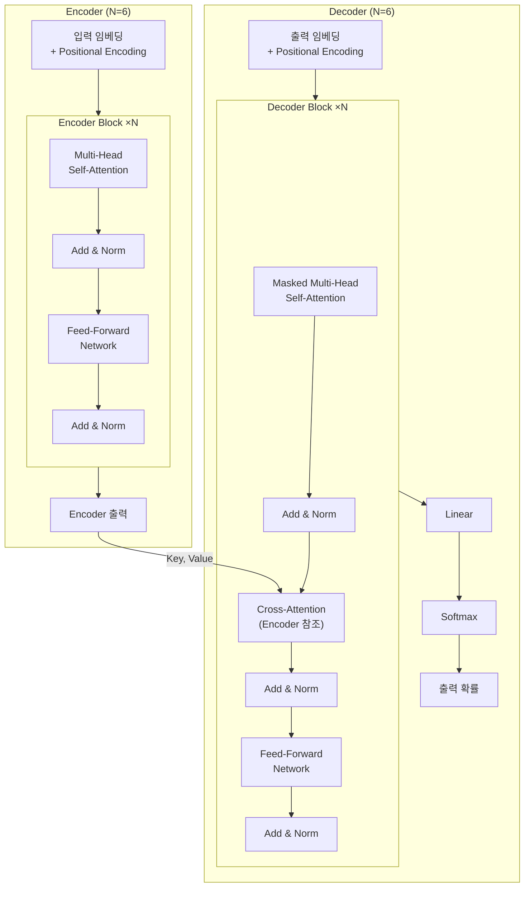
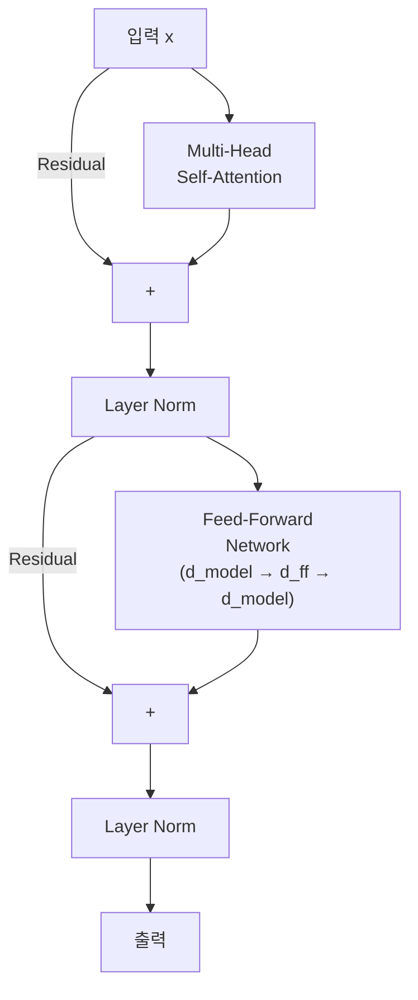
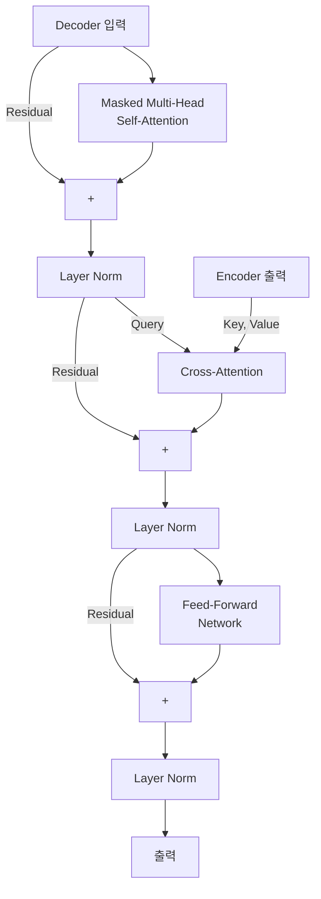
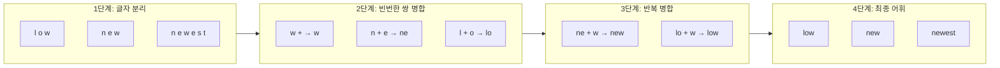

# 제4장: Transformer 아키텍처 심층 분석

> **미션**: 수업이 끝나면 Transformer Encoder를 밑바닥부터 구현한다

## 학습 목표

이 장을 마치면 다음을 수행할 수 있다:

1. Transformer의 전체 구조(Encoder-Decoder)를 설명하고 각 구성 요소의 역할을 이해한다
2. Positional Encoding(Sinusoidal vs Learned)의 필요성과 원리를 설명할 수 있다
3. PyTorch로 Transformer Encoder Block을 밑바닥부터 구현할 수 있다
4. Causal Masking과 Cross-Attention을 이해하고 Decoder 구조를 설명할 수 있다
5. BPE, WordPiece 등 서브워드 토크나이제이션 알고리즘의 원리를 이해한다

### 수업 타임라인

| 시간 | 구분 | 내용 |
|------|------|------|
| 00:00~00:50 | **1교시** | Transformer 전체 구조 + Positional Encoding |
| 00:50~01:00 | 쉬는시간 | |
| 01:00~01:50 | **2교시** | Encoder/Decoder 구현 + Tokenization |
| 01:50~02:00 | 쉬는시간 | |
| 02:00~02:50 | **3교시** | Transformer 구현 실습 + 과제 |

---

#### 1교시: Transformer 전체 구조

## 4.1 Transformer 전체 구조

**직관적 이해**: Transformer는 **동시통역 시스템**과 같다. Encoder는 원문을 깊이 이해하는 통역사이고, Decoder는 이해한 내용을 바탕으로 한 단어씩 번역을 생성한다. 기존 RNN이 "한 글자씩 순서대로 읽는 사람"이라면, Transformer는 "문장 전체를 한눈에 보고 관계를 파악하는 사람"이다. 이 덕분에 병렬 처리가 가능해져 훈련 속도가 비약적으로 빨라졌다.

### "Attention is All You Need"

2017년 Google 연구팀은 "Attention is All You Need"(Vaswani et al., 2017)라는 논문을 발표했다. 이 논문은 순환 구조를 완전히 제거하고, 3장에서 학습한 Attention 메커니즘만으로 시퀀스를 처리하는 Transformer 아키텍처를 제안했다. 2026년 현재 이 논문은 AI 분야에서 가장 많이 인용된 논문 중 하나이며, BERT, GPT, Llama 등 모든 현대 언어 모델의 기반이 되었다.

Transformer의 핵심 혁신은 세 가지이다:

1. **순환 구조의 완전한 제거**: 모든 위치의 입력을 동시에 처리하므로 GPU 병렬화가 가능하다. RNN은 시점 t의 계산이 시점 t-1에 의존하여 순차적으로만 처리할 수 있었다.

2. **O(1) 경로 길이**: Self-Attention을 통해 시퀀스 내 모든 위치가 직접 연결된다. RNN에서 위치 1과 위치 100 사이의 정보 전달에 99단계가 필요했던 것이, Transformer에서는 단 1단계로 줄어든다.

3. **확장성(Scalability)**: 병렬 처리가 가능하므로 더 큰 모델과 더 많은 데이터로 학습할 수 있다. 이 확장성이 GPT-3(175B), GPT-4, Llama 3(405B) 같은 거대 언어 모델의 등장을 가능하게 했다.

### Transformer 전체 아키텍처

Transformer는 **Encoder**와 **Decoder**의 두 부분으로 구성된다.



**그림 4.1** Transformer 전체 아키텍처 — Encoder(좌)와 Decoder(우)

**Encoder**는 입력 시퀀스 전체를 이해하는 역할을 한다. 동일한 구조의 블록을 N번(원 논문에서는 6번) 쌓는다. 각 블록은 **Multi-Head Self-Attention**과 **Feed-Forward Network**로 구성되며, 각 서브레이어에 Residual Connection과 Layer Normalization이 적용된다.

**Decoder**는 Encoder의 이해를 바탕으로 출력을 한 토큰씩 생성한다. Encoder와 유사하지만, 세 가지 차이가 있다:
- **Masked Self-Attention**: 미래 토큰을 보지 못하도록 마스킹한다
- **Cross-Attention**: Encoder의 출력을 Key, Value로 참조한다
- 최종 출력에 Linear + Softmax를 적용하여 다음 토큰의 확률 분포를 생성한다

> **참고**: BERT는 Encoder만 사용하고(Encoder-only), GPT는 Decoder만 사용한다(Decoder-only). 원본 Transformer처럼 둘 다 사용하는 모델(Encoder-Decoder)로는 T5, BART 등이 있다. 이 분류는 5장에서 자세히 다룬다.

### 구성 요소별 파라미터 분석

Transformer Block의 크기는 d_model에 의해 결정된다. 실제 계산 결과를 살펴보자:

```
  d_model= 256, d_ff=1024: MHA=   262,144 + FFN=   524,288 + LN= 1,024 =    787,456 params/block
  d_model= 512, d_ff=2048: MHA= 1,048,576 + FFN= 2,097,152 + LN= 2,048 =  3,147,776 params/block
  d_model= 768, d_ff=3072: MHA= 2,359,296 + FFN= 4,718,592 + LN= 3,072 =  7,080,960 params/block
  d_model=1024, d_ff=4096: MHA= 4,194,304 + FFN= 8,388,608 + LN= 4,096 = 12,587,008 params/block
```

FFN이 MHA의 약 2배 파라미터를 차지한다. d_ff를 4×d_model로 설정하는 것이 관례이며, 이 비율이 모델의 "사고 공간"을 결정한다. LayerNorm은 전체 파라미터의 0.1% 미만으로 극히 적다.

_전체 코드는 practice/chapter4/code/4-1-트랜스포머구조.py 참고_

---

## 4.2 Positional Encoding

### 위치 정보가 필요한 이유

3장에서 학습한 Self-Attention에는 치명적인 약점이 하나 있다. **순서 정보를 전혀 갖지 않는다는 것**이다. Self-Attention은 모든 위치 쌍의 관계를 행렬 연산으로 계산하므로, 입력의 순서를 바꿔도 결과가 순서만 바뀔 뿐 내용은 동일하다.

그러나 언어에서 순서는 의미를 결정한다:
- "개가 사람을 물었다" vs "사람이 개를 물었다"
- "I love you" vs "You love I"

따라서 Transformer는 입력에 **위치 정보를 별도로 추가**해야 한다. 이것이 Positional Encoding(위치 인코딩)이다.

**직관적 이해**: Transformer는 단어 순서를 모르는 "근시안적인 독자"이다. 그래서 각 단어에 "나는 1번, 오늘은 2번, 밥을은 3번..." 같은 **번호표**를 붙여준다. 이 번호표가 Positional Encoding이다.

### Sinusoidal Positional Encoding

원본 Transformer 논문에서는 사인과 코사인 함수를 사용한 Positional Encoding을 제안했다:

PE(pos, 2i) = sin(pos / 10000^(2i/d_model))
PE(pos, 2i+1) = cos(pos / 10000^(2i/d_model))

pos는 토큰의 위치, i는 차원 인덱스이다. 짝수 차원은 사인, 홀수 차원은 코사인 함수를 사용한다. 다양한 주파수의 삼각함수를 조합하므로, 각 위치가 고유한 "지문"을 갖게 된다.

이 설계에는 세 가지 장점이 있다:

1. **파라미터가 없다**: 수학적 함수로 정의되므로 학습이 필요 없다
2. **일반화 가능**: 학습 시 보지 못한 더 긴 시퀀스에도 적용할 수 있다
3. **상대적 위치 표현**: PE(pos+k)를 PE(pos)의 선형 함수로 표현할 수 있어, 모델이 상대적 위치 관계를 학습하기 쉽다

실행 결과를 확인하자:

```
[Sinusoidal Positional Encoding]
  학습 가능한 파라미터 수: 0 (파라미터 없음)

  [첫 3개 위치의 PE 값 (처음 8차원)]
    위치 0: ['0.000', '1.000', '0.000', '1.000', '0.000', '1.000', '0.000', '1.000']
    위치 1: ['0.841', '0.540', '0.762', '0.648', '0.682', '0.732', '0.605', '0.796']
    위치 2: ['0.909', '-0.416', '0.987', '-0.160', '0.997', '0.071', '0.963', '0.269']

  [위치 간 코사인 유사도]
    위치 0 ↔ 위치  1: 0.9702
    위치 0 ↔ 위치  5: 0.7373
    위치 0 ↔ 위치 10: 0.6691
    위치 0 ↔ 위치 50: 0.5462
```

가까운 위치일수록 코사인 유사도가 높고, 멀어질수록 낮아진다. 이는 상대적 위치 정보가 PE에 자연스럽게 인코딩되었음을 보여준다.

### Learned Positional Encoding

BERT, GPT-2 등 후속 모델에서는 **학습 가능한(Learned) Positional Encoding**을 사용한다. 각 위치에 대해 d_model 차원의 임베딩 벡터를 학습한다. 구현은 단순히 `nn.Embedding(max_len, d_model)`이다.

```
[Learned Positional Encoding]
  학습 가능한 파라미터 수: 12,800
  = max_len × d_model = 100 × 128
```

**표 4.1** Positional Encoding 방식 비교

| 특성 | Sinusoidal | Learned |
|------|------------|---------|
| 파라미터 수 | 0 | max_len × d_model |
| 긴 시퀀스 일반화 | 가능 | 불가능 (최대 길이 고정) |
| 표현력 | 고정 (수학적 함수) | 유연 (태스크에 최적화) |
| 사용 모델 | 원본 Transformer | GPT-2, BERT |

실무에서는 Learned 방식이 더 널리 사용된다. 학습 데이터 내 시퀀스 길이에 대해서는 Sinusoidal보다 약간 더 나은 성능을 보이기 때문이다. 다만 학습 시 설정한 max_len을 초과하는 시퀀스는 처리할 수 없다는 단점이 있다. 최근의 RoPE(Rotary Positional Encoding)나 ALiBi 같은 기법은 두 방식의 장점을 결합하려는 시도이다.

_전체 코드는 practice/chapter4/code/4-1-트랜스포머구조.py 참고_

---

#### 2교시: Transformer 구현과 Tokenization

> **라이브 코딩 시연**: 교수가 Encoder Block을 한 줄씩 구현하며 각 구성 요소의 역할을 설명한다. Residual Connection을 추가하기 전과 후의 기울기 흐름 차이를 시연한다.

## 4.3 Transformer Encoder 구현 (PyTorch)

### Residual Connection: 원본을 보존하면서 변화량만 학습

Encoder Block을 구현하기 전에, 두 가지 핵심 구성 요소를 이해해야 한다. 첫째는 **Residual Connection(잔차 연결)**이다.

**직관적 이해**: 새로운 언어를 배울 때, 기존에 알고 있는 모국어 지식을 완전히 잊고 처음부터 배우지 않는다. 기존 지식(원본)을 유지하면서 새로운 것(변화량)만 추가한다. Residual Connection도 같은 원리이다. 입력 x에 서브레이어의 출력을 **더하는 것**이 핵심이다:

output = x + Sublayer(x)

이렇게 하면 네트워크가 깊어져도 기울기가 직접 전달되는 "고속도로"가 생겨, 학습이 안정적으로 이루어진다. He et al. (2016)이 ResNet에서 처음 제안한 이 기법은, Transformer가 수십~수백 층을 쌓을 수 있게 해주는 핵심 요소이다.

실행 결과에서 그 효과를 확인할 수 있다:

```
[Residual Connection 효과]
  입력 신호 크기 (L2 norm): 35.6551
  20층 후 (Residual 없음):  1.4576
  20층 후 (Residual 있음):  2057.6296
  → Residual Connection은 깊은 네트워크에서 신호가 사라지는 것을 방지한다
```

Residual 없이 20층을 통과하면 신호가 거의 사라지지만(35.7 → 1.5), Residual을 추가하면 신호가 오히려 강해진다. 실제 Transformer에서는 Layer Normalization이 이 신호 크기를 적절히 조절한다.

### Layer Normalization: 출력을 안정화

둘째는 **Layer Normalization(층 정규화)**이다. 각 위치의 은닉 벡터를 정규화하여 평균 0, 표준편차 1로 만든다. 이는 학습을 안정화하고 수렴 속도를 높인다.

```
[Layer Normalization 동작 확인]
  정규화 전 — 평균: 0.0314, 표준편차: 1.1133
  정규화 후 — 평균: -0.0000, 표준편차: 1.0039
  → LayerNorm은 각 위치에서 평균=0, 표준편차=1로 정규화한다
```

Batch Normalization은 배치 차원을 기준으로 정규화하지만, Layer Normalization은 **각 샘플의 특성(feature) 차원**을 기준으로 정규화한다. 시퀀스 길이가 다를 수 있는 NLP에서는 Layer Normalization이 더 적합하다.

> **강의 팁**: Pre-LN과 Post-LN의 차이를 질문할 수 있다. 원본 Transformer는 Post-LN(서브레이어 뒤에 정규화)을 사용했지만, 최근 대부분의 모델은 **Pre-LN**(서브레이어 앞에 정규화)을 사용한다. Pre-LN이 학습 초기에 더 안정적이기 때문이다.

### Encoder Block 구현

이제 모든 구성 요소를 합쳐 Encoder Block을 구현한다:



**그림 4.2** Transformer Encoder Block 내부 구조

핵심 코드:

```python
class TransformerEncoderBlock(nn.Module):
    def __init__(self, d_model, num_heads, d_ff, dropout=0.1):
        super().__init__()
        self.self_attention = MultiHeadAttention(d_model, num_heads, dropout)
        self.feed_forward = PositionwiseFeedForward(d_model, d_ff, dropout)
        self.norm1 = nn.LayerNorm(d_model)
        self.norm2 = nn.LayerNorm(d_model)

    def forward(self, x, mask=None):
        # Self-Attention + Residual + Norm
        attn_output, _ = self.self_attention(x, x, x, mask)
        x = self.norm1(x + attn_output)

        # Feed-Forward + Residual + Norm
        ff_output = self.feed_forward(x)
        x = self.norm2(x + ff_output)
        return x
```

실행 결과:

```
[Transformer Encoder Block]
  입력 shape: torch.Size([2, 10, 256])
  출력 shape: torch.Size([2, 10, 256])
  파라미터 수: 789,760

[Transformer Encoder (4 layers)]
  총 파라미터 수: 3,159,040
```

입력과 출력의 shape이 동일한 것이 중요하다. 이 덕분에 동일한 블록을 원하는 만큼 쌓을 수 있다. 4층짜리 Encoder의 파라미터는 약 316만 개로, BERT-base(1.1억)보다 훨씬 작은 교육용 모델이다.

**Feed-Forward Network**은 각 위치에 독립적으로 적용되는 2층 MLP이다. 차원을 d_model → d_ff(4×d_model)로 확장했다가 다시 d_model로 축소한다. 이 확장-축소 과정이 각 위치에서 더 풍부한 표현을 학습하게 해준다. 활성화 함수로는 원본 논문의 ReLU 대신, 최신 모델에서는 GELU를 사용한다.

_전체 코드는 practice/chapter4/code/4-3-인코더구현.py 참고_

---

## 4.4 Transformer Decoder 구현

### Decoder Block의 구조

Decoder Block은 Encoder Block에 두 가지 서브레이어가 추가된다:



**그림 4.3** Transformer Decoder Block 내부 구조

### Causal Masking: 미래를 보지 못하게 하기

**직관적 이해**: 번역할 때 "I went to school"을 생성하는 과정을 생각해 보자. "I"를 생성할 때는 뒤에 올 "went to school"을 아직 모른다. "went"를 생성할 때는 "I"만 볼 수 있다. 이것이 **Causal Masking**이다 — 각 위치는 자신과 이전 위치만 참조할 수 있고, 미래 위치는 "커닝"할 수 없다.

구현은 하삼각 행렬(lower triangular matrix)로 이루어진다:

```
[Causal Mask (5×5)]
  [1, 0, 0, 0, 0]
  [1, 1, 0, 0, 0]
  [1, 1, 1, 0, 0]
  [1, 1, 1, 1, 0]
  [1, 1, 1, 1, 1]
```

1은 "참조 가능", 0은 "마스킹"을 의미한다. 마스킹된 위치의 Attention Score에 -∞를 넣으면, softmax 후 가중치가 0이 된다.

실행 결과에서 이를 확인할 수 있다:

```
[Causal Mask 적용 확인 — Self-Attention Weights]
  첫 번째 토큰이 참조하는 가중치: [1.111, 0.000, ..., 0.000]
  → 첫 토큰은 자기 자신만 참조 (나머지 ≈ 0)
  두 번째 토큰이 참조하는 가중치: [0.636, 0.475, 0.000, ...]
  → 두 번째 토큰은 위치 0, 1만 참조 (위치 2부터 ≈ 0)
```

첫 번째 토큰은 자기 자신만 볼 수 있고, 두 번째 토큰은 첫 번째와 자신만 볼 수 있다. 미래 위치의 가중치는 모두 0이다.

### Cross-Attention: Encoder의 출력을 참조

Cross-Attention은 Self-Attention과 구조가 동일하지만, **Query의 출처가 다르다**:

- **Self-Attention**: Q, K, V가 모두 같은 입력에서 생성
- **Cross-Attention**: **Q는 Decoder에서**, **K와 V는 Encoder 출력에서** 생성

번역 비유로 돌아가면, Decoder가 "went"를 생성할 때 "원문의 어떤 부분을 참고해야 하는가?"를 Cross-Attention이 결정한다. "갔다"에 높은 가중치를 부여하여 적절한 번역을 생성한다.

```
[Decoder Block 파라미터]
  Decoder Block 파라미터 수: 1,053,440
```

Decoder Block은 Encoder Block(789,760)보다 약 33% 더 많은 파라미터를 가진다. Cross-Attention 층이 추가되었기 때문이다.

_전체 코드는 practice/chapter4/code/4-3-인코더구현.py 참고_

---

## 4.5 Tokenization 심화

### 왜 서브워드가 필요한가?

**직관적 이해**: "unbelievable"이라는 단어를 통째로 하나의 토큰으로 처리하면, 어휘 사전이 폭발적으로 커진다. 영어만 해도 수십만 단어가 있고, 신조어와 고유명사까지 합치면 끝이 없다. 반대로 글자 단위로 쪼개면 어휘 사전은 작지만, 하나의 단어를 표현하는 데 토큰이 너무 많이 필요하다.

**서브워드 토크나이제이션(Subword Tokenization)**은 이 두 극단의 절충안이다. "unbelievable"을 "un" + "believe" + "able"로 쪼개면, 적은 수의 조각(서브워드)으로 모든 단어를 표현할 수 있다. 새로운 단어가 등장해도 서브워드 조합으로 처리 가능하다.

### BPE (Byte Pair Encoding) 알고리즘

BPE(Sennrich et al., 2016)는 GPT-2, GPT-3/4에서 사용하는 토크나이제이션 알고리즘이다. 핵심 원리는 **"가장 자주 함께 등장하는 글자 쌍을 반복적으로 병합"**하는 것이다.



**그림 4.4** BPE 병합 과정

직접 구현한 BPE의 실행 결과이다:

```
BPE 병합 과정 (10회):
  병합  1: 'w' + '</w>' → 'w</w>' (빈도: 11)
  병합  2: 'n' + 'e' → 'ne' (빈도: 10)
  병합  3: 'l' + 'o' → 'lo' (빈도: 8)
  병합  4: 'w' + 'e' → 'we' (빈도: 7)
  병합  5: 's' + 't' → 'st' (빈도: 6)
  병합  6: 'st' + '</w>' → 'st</w>' (빈도: 6)
  병합  7: 'ne' + 'w</w>' → 'new</w>' (빈도: 6)
  병합  8: 'lo' + 'w</w>' → 'low</w>' (빈도: 5)
  병합  9: 'ne' + 'we' → 'newe' (빈도: 4)
  병합 10: 'newe' + 'st</w>' → 'newest</w>' (빈도: 4)
```

빈도가 높은 쌍부터 순서대로 병합된다. "low"와 "new"는 빈도가 높아 하나의 토큰으로 병합되었고, "lower"는 "lo" + "we" + "r"로 분해된다:

```
토큰화 테스트:
  'low' → ['low</w>']           ← 통째로 하나의 토큰
  'lower' → ['lo', 'we', 'r', '</w>']  ← 서브워드로 분해
  'newest' → ['newest</w>']     ← 빈도 높아 통째로 병합
  'new' → ['new</w>']           ← 통째로 하나의 토큰
  'lowest' → ['lo', 'we', 'st</w>']    ← 학습에 없던 단어도 처리 가능
```

"lowest"는 학습 말뭉치에 존재하지 않았지만, 학습된 서브워드 "lo", "we", "st"의 조합으로 표현할 수 있다. 이것이 서브워드 토크나이제이션의 핵심 장점이다.

_전체 코드는 practice/chapter4/code/4-5-토크나이저.py 참고_

### WordPiece vs BPE

WordPiece(Schuster & Nakajima, 2012)는 BERT에서 사용하는 토크나이제이션 알고리즘이다. BPE와 유사하지만 병합 기준이 다르다:

- **BPE**: 가장 빈번한 쌍을 병합 (빈도 기반)
- **WordPiece**: 병합했을 때 전체 우도(likelihood)가 가장 많이 증가하는 쌍을 병합 (확률 기반)

결과적으로 비슷한 어휘를 생성하지만, WordPiece가 더 "의미 있는" 서브워드를 만드는 경향이 있다.

### Hugging Face Tokenizer 비교

실제 BERT(WordPiece)와 GPT-2(BPE)의 토크나이저를 비교한 결과이다:

```
원문: 'The transformer architecture revolutionized natural language processing.'
  BERT (WordPiece): ['the', 'transform', '##er', 'architecture', 'revolution', '##ized', ...]
    → 토큰 수: 10
  GPT-2 (BPE):     ['The', 'Ġtransformer', 'Ġarchitecture', 'Ġrevolution', 'ized', ...]
    → 토큰 수: 9
```

주목할 차이점:
- BERT는 `##` 접두사로 서브워드를 표시한다 ("transform" + "##er")
- GPT-2는 `Ġ` (공백)로 단어 시작을 표시한다 ("Ġtransformer")
- BERT는 소문자로 변환하고, GPT-2는 대소문자를 유지한다

```
[어휘 크기 비교]
  BERT vocab size:  30,522
  GPT-2 vocab size: 50,257
```

GPT-2가 더 큰 어휘를 사용한다. 어휘가 클수록 한 토큰으로 더 긴 텍스트를 표현할 수 있지만, 임베딩 테이블의 파라미터도 그만큼 증가한다.

한국어에서는 글자 단위 분해가 더 심하게 일어난다:

```
원문: '트랜스포머 아키텍처는 자연어처리를 혁신했다.'
  mBERT: ['트', '##랜', '##스', '##포', '##머', '아', '##키', '##텍', '##처', '##는', ...]
  토큰 수: 19
```

한국어는 다양한 조합의 음절을 가지므로, 영어 중심으로 학습된 mBERT 토크나이저가 글자 단위로 과도하게 분해한다. 한국어 전용 모델(KoBERT, KoGPT 등)은 한국어에 최적화된 토크나이저를 사용하여 이 문제를 완화한다.

**표 4.2** 토크나이저 알고리즘 비교

| 알고리즘 | 핵심 원리 | 사용 모델 | 어휘 크기 |
|----------|----------|----------|----------|
| BPE | 빈번한 바이트 쌍 병합 | GPT-2, GPT-3/4 | ~50,000 |
| WordPiece | 우도 기반 병합 | BERT, DistilBERT | ~30,000 |
| Unigram | 확률 기반 서브워드 선택 | T5, ALBERT | 다양 |
| SentencePiece | 언어 무관 서브워드 분할 | Llama, XLNet | 다양 |

---

#### 3교시: Transformer 구현 실습

> **Copilot 활용**: Encoder Block의 기본 골격을 직접 작성한 뒤, Copilot에게 "LayerNorm과 Residual Connection을 추가해줘"와 같이 부분적으로 확장을 요청한다. Copilot이 생성한 코드에서 Post-LN인지 Pre-LN인지 확인하고, 필요하면 수정한다.

## 4.6 실습: Transformer 구현과 Tokenizer 비교

### 실습 목표

이 실습에서는 다음을 수행한다:

- Transformer Encoder Block을 밑바닥부터 구현한다
- Positional Encoding을 구현하고 위치별 유사도를 확인한다
- Transformer 기반 텍스트 분류 모델을 구성한다
- Tokenizer별 차이를 실험으로 확인한다

### 실습 환경 준비

1장에서 `scripts/setup_env.py`로 구축한 통합 가상환경을 사용한다.

```bash
# 가상환경 활성화
source venv/bin/activate  # Windows: venv\Scripts\activate

# 디바이스 확인
python -c "import torch; print(f'Device: {torch.device(\"cuda\" if torch.cuda.is_available() else \"cpu\")}')"
```

> **GPU 활용**: Transformer 텍스트 분류 모델 학습 시 GPU를 사용하면 학습 속도가 눈에 띄게 빨라진다. 모든 실습 코드는 `device = torch.device("cuda" if torch.cuda.is_available() else "cpu")` 패턴으로 GPU를 자동 활용한다.

### Transformer Encoder 밑바닥 구현

3장에서 구현한 Multi-Head Attention을 기반으로, Encoder Block을 조립한다. 핵심 패턴은 다음과 같다:

```python
# Self-Attention + Residual + Norm
attn_output, _ = self.self_attention(x, x, x, mask)
x = self.norm1(x + self.dropout(attn_output))

# Feed-Forward + Residual + Norm
ff_output = self.feed_forward(x)
x = self.norm2(x + self.dropout(ff_output))
```

이 두 줄씩의 패턴이 Transformer의 핵심이다. 모든 서브레이어 뒤에 (1) Residual Connection으로 입력을 더하고, (2) Layer Normalization으로 안정화한다.

### Transformer 분류 모델

Token Embedding + Positional Encoding → Encoder Stack → Mean Pooling → Classifier 구조로 텍스트 분류 모델을 구성한다:

```
[Transformer Classifier]
  Vocab size: 10,000
  Num classes: 2
  입력 shape: torch.Size([2, 10])
  출력 logits shape: torch.Size([2, 2])
  총 파라미터 수: 5,719,554
```

**표 4.3** 모델 크기 비교

| 모델 | d_model | heads | layers | d_ff | 파라미터 |
|------|---------|-------|--------|------|---------|
| 현재 모델 | 256 | 8 | 4 | 1024 | ~5.7M |
| BERT-base | 768 | 12 | 12 | 3072 | ~110M |
| BERT-large | 1024 | 16 | 24 | 4096 | ~340M |
| GPT-2 small | 768 | 12 | 12 | 3072 | ~117M |
| GPT-3 175B | 12288 | 96 | 96 | 49152 | ~175B |

우리가 구현한 모델(5.7M)과 BERT-base(110M) 사이에는 약 20배의 차이가 있다. BERT-base에서 GPT-3까지는 약 1,500배 차이이다. 이 "스케일링"이 LLM의 능력을 결정하는 핵심 요인이며, 5장에서 자세히 다룬다.

### PyTorch 내장 모듈과의 비교

직접 구현한 Encoder와 PyTorch의 `nn.TransformerEncoder`를 비교한다:

```
[비교 결과]
  PyTorch 내장 파라미터: 3,159,040
  직접 구현 파라미터:    3,159,040
```

파라미터 수가 정확히 동일하다. 이는 우리의 구현이 PyTorch의 공식 구현과 동일한 구조임을 확인해 준다. 실무에서는 `nn.TransformerEncoder`를 사용하는 것이 편리하지만, 내부 동작을 이해하기 위해 밑바닥 구현을 경험하는 것이 중요하다.

_전체 코드는 practice/chapter4/code/4-3-인코더구현.py 참고_

### Tokenizer 비교 실험

BPE를 밑바닥부터 구현하고, Hugging Face의 BERT/GPT-2 토크나이저와 비교한다. 같은 문장도 토크나이저에 따라 서로 다른 토큰 시퀀스가 생성됨을 확인한다.

```
서브워드 분해 — 'unbelievable':
  BERT (WordPiece): ['unbelievable']        ← 통째로 인식
  GPT-2 (BPE):     ['un', 'bel', 'iev', 'able']  ← 4개로 분해
```

BERT의 어휘에는 "unbelievable"이 통째로 포함되어 있지만, GPT-2의 어휘에는 없어 서브워드로 분해된다. 어휘 크기와 토크나이제이션 전략이 모델의 입력 표현에 직접적으로 영향을 미친다.

_전체 코드는 practice/chapter4/code/4-5-토크나이저.py 참고_

**과제**: Transformer Encoder로 텍스트 분류 모델 구현 + 성능 분석

---

## 핵심 정리

이 장에서 다룬 핵심 내용을 정리하면 다음과 같다:

- **Transformer**는 "Attention is All You Need" 논문에서 제안된 아키텍처로, RNN 없이 Attention만으로 시퀀스를 처리한다. 병렬 처리와 O(1) 경로 길이가 핵심 혁신이다
- **Positional Encoding**은 순서 정보가 없는 Self-Attention에 위치 정보를 추가한다. Sinusoidal(파라미터 없음, 일반화 가능)과 Learned(유연, 학습 가능) 두 방식이 있다
- **Encoder Block**은 Multi-Head Self-Attention + FFN에 각각 Residual Connection과 Layer Normalization을 적용한 구조이다
- **Residual Connection**은 입력을 출력에 더하여 기울기의 "고속도로"를 만들며, 깊은 네트워크 학습을 가능하게 한다
- **Layer Normalization**은 각 위치의 은닉 벡터를 정규화하여 학습을 안정화한다
- **Decoder Block**은 Masked Self-Attention(미래 마스킹)과 Cross-Attention(Encoder 참조)이 추가된 구조이다
- **서브워드 토크나이제이션**(BPE, WordPiece)은 글자와 단어 사이의 절충안으로, 적은 어휘로 모든 텍스트를 표현한다

---

## 더 알아보기

이 장의 내용을 더 깊이 학습하려면 다음 자료를 참고하라:

- Jay Alammar. The Illustrated Transformer. https://jalammar.github.io/illustrated-transformer/
- Andrej Karpathy. Let's build GPT: from scratch, in code, spelled out. https://www.youtube.com/watch?v=kCc8FmEb1nY
- Lilian Weng. (2023). The Transformer Family Version 2.0. https://lilianweng.github.io/posts/2023-01-27-the-transformer-family-v2/

---

## 다음 장 예고

다음 장에서는 Transformer를 기반으로 한 **사전학습 언어 모델(Pre-trained Language Model)**을 다룬다. Encoder만 사용하는 **BERT**(빈칸 채우기 달인)와 Decoder만 사용하는 **GPT**(다음 단어 예측 달인)의 아키텍처, 학습 방법, 활용 방법을 학습하고, Hugging Face Transformers로 실제 모델을 돌려본다.

---

## 참고문헌

1. Vaswani, A., Shazeer, N., Parmar, N., Uszkoreit, J., Jones, L., Gomez, A. N., Kaiser, Ł., & Polosukhin, I. (2017). Attention Is All You Need. *NeurIPS*. https://arxiv.org/abs/1706.03762
2. He, K., Zhang, X., Ren, S., & Sun, J. (2016). Deep Residual Learning for Image Recognition. *CVPR*. https://arxiv.org/abs/1512.03385
3. Ba, J. L., Kiros, J. R., & Hinton, G. E. (2016). Layer Normalization. *arXiv*. https://arxiv.org/abs/1607.06450
4. Sennrich, R., Haddow, B., & Birch, A. (2016). Neural Machine Translation of Rare Words with Subword Units. *ACL*. https://arxiv.org/abs/1508.07909
5. Schuster, M. & Nakajima, K. (2012). Japanese and Korean Voice Search. *ICASSP*.
6. Kudo, T. & Richardson, J. (2018). SentencePiece: A simple and language independent subword tokenizer and detokenizer for Neural Text Processing. *EMNLP*. https://arxiv.org/abs/1808.06226
