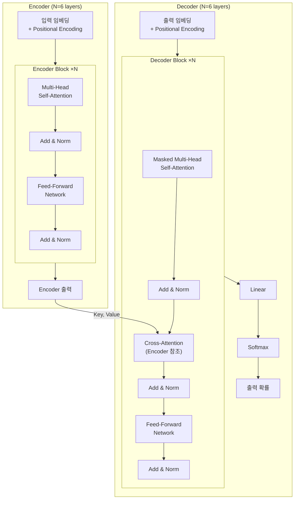
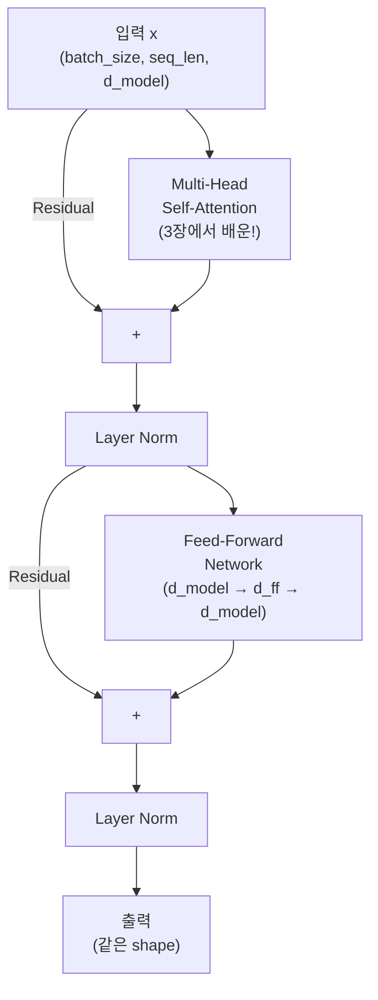
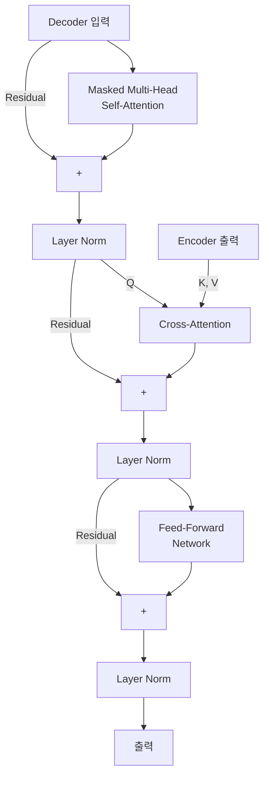
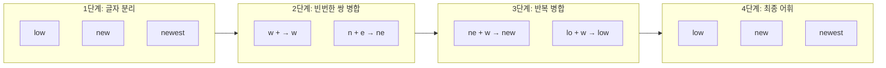

## 4주차 A회차: Transformer 아키텍처 심층 분석

> **미션**: 수업이 끝나면 Transformer Encoder를 밑바닥부터 구현할 수 있고, Positional Encoding의 필요성을 이해한다

### 학습목표

이 회차를 마치면 다음을 수행할 수 있다:

1. Transformer 전체 구조(Encoder-Decoder)를 설명하고 각 구성 요소의 역할을 이해할 수 있다
2. RNN(순차 처리)과 Transformer(병렬 처리)의 핵심 차이를 설명할 수 있다
3. Positional Encoding이 필요한 이유를 이해하고 Sinusoidal vs Learned 방식을 비교할 수 있다
4. Encoder Block의 구조(Multi-Head Self-Attention + FFN + Residual + LayerNorm)를 설명할 수 있다
5. Causal Masking과 Cross-Attention의 역할을 이해할 수 있다
6. 수치 예시를 통해 Positional Encoding과 Residual Connection의 구체적 효과를 설명할 수 있다

---

### 오늘의 질문 + 빠른 진단

**오늘의 질문**: "RNN은 한 글자씩 순서대로만 읽을 수 있는데, 문장 전체를 한눈에 보면서 동시에 처리할 수 있다면 무엇이 달라질까?"

**빠른 진단 (1문항)**:

다음 두 문장을 읽고 답하시오.

(A) "나는 학교에 갔다"
(B) "나는 학교가 좋다"

두 문장에서 "학교"의 의미가 다르다. RNN이 "학교"를 해석할 때, 어떤 정보를 함께 봐야 올바르게 이해할까?

① 다음에 올 단어만
② 앞에 올 단어만
③ 앞뒤의 모든 단어를 동시에
④ 단어의 위치 번호

정답: ③ — 이것이 Transformer가 병렬 처리를 하는 이유이다.

---

### 이론 강의

> **Transformer를 한눈에 — "조별 번역 프로젝트"**
>
> 교수님이 영어 논문을 한국어로 번역해서 발표하라는 팀 프로젝트를 냈다고 상상해 보자. 팀은 이렇게 움직인다:
>
> 1. **토큰화(Tokenization)**: 팀장이 논문을 적당한 크기의 조각으로 나눈다. 글자 단위는 너무 잘고, 문장 단위는 너무 크다. "의미가 살아있는 어절" 단위로 쪼갠다.
> 2. **위치 스티커(Positional Encoding)**: 쪼갠 조각에 "1번, 2번, 3번…" 번호 스티커를 붙인다. 나중에 순서대로 다시 붙여야 하니까.
> 3. **독해팀(Encoder)**: 팀의 절반이 단체 카톡방에서 논문 조각들을 동시에 읽으며 토론한다. "이 부분이 저 부분과 연결되지 않아?" — 여러 명이 각자 다른 관점(문법, 의미, 맥락)으로 동시에 분석한다(Multi-Head Attention). 각자 원본 조각을 손에 쥔 채(Residual) 정리 메모를 작성하고, 메모 양식을 통일한다(LayerNorm). 이 과정을 6번 반복하면 논문에 대한 깊은 이해 메모가 완성된다.
> 4. **작성팀(Decoder)**: 나머지 절반이 한국어 번역을 쓴다. 규칙: 아직 쓰지 않은 뒷문장을 미리 보면 안 된다(Causal Masking). 한 문장씩 쓸 때마다 독해팀 메모의 관련 부분을 찾아 참고한다(Cross-Attention).
> 5. **최종 선택(Softmax)**: 다음에 올 가장 적절한 단어를 확률로 골라 문장을 완성한다.
>
> 이 스토리를 기억하며 아래 내용을 읽으면, 각 개념이 "아, 그 역할이구나"로 연결될 것이다.

#### 4.1 "Attention is All You Need"와 Transformer의 혁신

2017년 Google 연구팀(Vaswani et al.)이 발표한 논문 "Attention is All You Need"는 AI 역사의 분수령이 되었다. 이 논문은 RNN 없이 **Attention 메커니즘만으로 순차 데이터를 처리하는 Transformer 아키텍처**를 제안했고, 2026년 현재 BERT, GPT, Llama 등 모든 현대 언어 모델의 기반이 되었다.

**직관적 이해**: RNN은 **카카오톡 1:1 DM 릴레이**이다. 반장 → 부반장 → A → B → C 순서로 한 명씩 쪽지를 넘겨야 한다. C가 반장의 원래 말을 받을 때쯤이면 내용이 흐릿해져 있다(장거리 의존성 문제). 반면 Transformer는 **단체 카톡방**이다. 반장이 한 번 메시지를 올리면 모든 사람이 동시에 읽고, 서로 답장하며, 누구든 원본 메시지를 바로 참조할 수 있다. 게다가 여러 명(Multi-Head Attention)이 각자 다른 관점 — 문법, 의미, 맥락 — 으로 동시에 분석한다. 마치 에브리타임 강의평가에서 난이도, 과제량, 교수 스타일을 각각 다른 사람이 동시에 평가하는 것과 같다.

##### Transformer의 세 가지 핵심 혁신

1. **순환 구조의 완전한 제거**: RNN은 시점 t의 계산이 시점 t-1의 결과에 의존하여 **순차적으로만** 계산할 수 있다. Transformer는 모든 위치의 입력을 **동시에** 처리하므로 GPU 병렬화가 가능하다. 1,000단어 문장을 RNN은 1,000 스텝에 걸쳐 처리하지만, Transformer는 1 스텝에 처리한다.

2. **O(1) 경로 길이**: 3장에서 배운 RNN은 시점 1의 정보가 시점 100에 도달하려면 99번의 중간 단계를 거쳐야 한다. 정보가 "물의 흐름처럼" 순서대로 흘러가기 때문이다. Transformer의 Self-Attention은 모든 위치가 **직접 연결**되어, 어떤 거리의 단어도 1 스텝에 정보를 교환할 수 있다.

3. **확장성(Scalability)**: 병렬 처리가 가능하므로 더 큰 모델, 더 많은 데이터로 학습할 수 있다. GPT-3의 1,750억 개 파라미터, Llama 3의 4,050억 파라미터 같은 거대 모델의 등장이 가능해진 것도 Transformer의 확장성 덕분이다.

> **쉽게 말해서**: RNN은 "1:1 DM 릴레이"(한 명씩 쪽지를 옆으로 넘기기)이고, Transformer는 "단체 카톡방"(모두가 동시에 읽고 서로 대화)이다.

**그래서 무엇이 달라지는가?** 3장의 RNN/LSTM으로 BERT나 GPT를 만들려면? 불가능하다. RNN의 순차 처리로는 기가급 GPU 메모리를 활용할 수 없고, 학습 시간이 수개월 이상 걸린다. Transformer의 병렬 처리 덕분에 수주 내에 모델을 학습하고, 그 결과로 현대 LLM의 지능이 가능해진 것이다. 실제로 Transformer 이전의 기계 번역 모델들은 병렬화가 불가능하여 고사양 서버 한 대에서 수개월 학습해야 했다. 오늘날의 거대 언어 모델은 이러한 병렬화의 이점 없이는 존재할 수 없다.

---

#### 4.2 Transformer 전체 구조 (Encoder-Decoder)

Transformer는 **Encoder**와 **Decoder**의 두 부분으로 구성된다. 각각의 역할을 먼저 이해하자.



**그림 4.1** Transformer 전체 아키텍처 — Encoder(입력 이해)와 Decoder(출력 생성)

**직관적 이해**: 번역 에이전시를 생각해 보자. **Encoder**는 "한국어 독해 전문가"로, 원문을 깊이 읽고 핵심 메모를 남긴다. **Decoder**는 "영어 작성 전문가"로, 독해 전문가의 메모를 계속 참고하면서 영어 문장을 한 단어씩 써 내려간다. Cross-Attention은 작성 전문가가 "지금 이 단어를 쓰려면 메모의 어느 부분을 봐야 하지?"를 찾는 행위이다.

**Encoder**의 역할: 입력 시퀀스를 깊이 있게 이해하고 의미 표현으로 변환한다. 동일한 구조의 블록을 N번(원 논문에서는 6번) 쌓는다. 각 블록은 **Multi-Head Self-Attention**(3장에서 배운!)과 **Feed-Forward Network**로 구성되며, 각 서브레이어에 Residual Connection과 Layer Normalization이 적용된다.

**Decoder**의 역할: Encoder가 이해한 내용을 바탕으로 출력을 **한 토큰씩** 순차 생성한다. Encoder와 유사하지만 세 가지 차이가 있다:

- **Masked Self-Attention**: 미래 토큰을 보지 못하도록 마스킹 ("커닝 방지")
- **Cross-Attention**: Encoder의 출력을 Key, Value로 참조 ("원문과 현재 번역을 비교")
- **Linear + Softmax**: 최종 출력에 적용하여 다음 토큰의 확률 분포 생성

> **참고**: BERT는 Encoder만 사용(Encoder-only)하고, GPT는 Decoder만 사용(Decoder-only)한다. 원본 Transformer처럼 둘 다 사용하는 모델(Encoder-Decoder)로는 T5, BART 등이 있다.

---

#### 4.3 Positional Encoding: 순서 정보 추가

##### 순서 정보가 필요한 이유

3장에서 배운 Self-Attention에는 **치명적인 약점**이 하나 있다. Self-Attention은 모든 위치 쌍의 관계를 행렬 연산으로 계산하므로, **입력의 순서에 무관하다**는 것이다. 만약 입력 문장을 섞으면 단어 순서만 바뀔 뿐, 내용은 동일하다.

그런데 언어에서 순서는 의미를 결정한다:

- "개가 사람을 물었다" vs "사람이 개를 물었다"
- "I love you" vs "You love I"

따라서 Transformer는 입력에 **위치 정보를 별도로 추가**해야 한다. 이것이 **Positional Encoding(위치 인코딩)**이다.

**직관적 이해**: 카카오톡 단톡방에서 메시지 순서가 섞인다고 상상해 보자. "밥 먹었어?" → "응, 맛있었어" → "어디서?" 라는 대화가 "어디서?" → "응, 맛있었어" → "밥 먹었어?" 순서로 보이면 완전히 다른 의미가 된다. Self-Attention은 기본적으로 이 세 메시지를 순서 없이 한꺼번에 본다. 그래서 "몇 번째 메시지인지"를 내용에 스탬프처럼 찍어줘야 한다. 이것이 바로 Positional Encoding이다. 배달앱으로 비유하면, 주문한 음식 자체(임베딩)가 같아도 몇 번째 주문(위치)이냐에 따라 처리 순서가 달라지는 것과 같다.

##### Sinusoidal Positional Encoding

원본 Transformer 논문에서는 사인과 코사인 함수를 사용한다:

PE(pos, 2i) = sin(pos / 10000^(2i/d_model))
PE(pos, 2i+1) = cos(pos / 10000^(2i/d_model))

여기서:

- pos: 토큰의 위치 (0, 1, 2, ...)
- i: 차원 인덱스 (0, 1, 2, ..., d_model/2)
- d_model: 임베딩 차원 (보통 512)

짝수 차원은 사인, 홀수 차원은 코사인 함수를 사용한다. 다양한 주파수의 삼각함수를 조합하므로, 각 위치가 고유한 "신호"를 갖게 된다.

**구체적 숫자 예시**: d_model = 512, 처음 8차원, 최초 3개 위치의 PE 벡터를 계산하면:

```
위치 0 (2i=0): PE(0, 0) = sin(0 / 10000^0) = sin(0) = 0.000
위치 0 (2i+1=1): PE(0, 1) = cos(0 / 10000^0) = cos(0) = 1.000
위치 0 (2i=2): PE(0, 2) = sin(0 / 10000^(2/512)) = sin(0) = 0.000
위치 0 (2i+1=3): PE(0, 3) = cos(0 / 10000^(2/512)) = cos(0) = 1.000
→ 위치 0 PE: [0.000, 1.000, 0.000, 1.000, 0.000, 1.000, ...]

위치 1 (2i=0): PE(1, 0) = sin(1 / 10000^0) = sin(1) ≈ 0.841
위치 1 (2i+1=1): PE(1, 1) = cos(1 / 10000^0) = cos(1) ≈ 0.540
위치 1 (2i=2): PE(1, 2) = sin(1 / 10000^(2/512)) = sin(0.998) ≈ 0.836
위치 1 (2i+1=3): PE(1, 3) = cos(1 / 10000^(2/512)) = cos(0.998) ≈ 0.548
→ 위치 1 PE: [0.841, 0.540, 0.836, 0.548, ...]

위치 2 (2i=0): PE(2, 0) = sin(2 / 10000^0) = sin(2) ≈ 0.909
위치 2 (2i+1=1): PE(2, 1) = cos(2 / 10000^0) = cos(2) ≈ -0.416
→ 위치 2 PE: [0.909, -0.416, ...]
```

**이 설계에는 세 가지 장점이 있다:**

1. **파라미터가 없다**: 수학적 함수로 정의되므로 학습이 필요 없다. 메모리를 절약할 수 있다.

2. **일반화 가능**: 학습 시 보지 못한 더 긴 시퀀스에도 적용할 수 있다. "최대 512 길이까지만 학습했는데 1,024 길이가 들어오면?" — Sinusoidal PE는 여전히 작동한다.

3. **상대적 위치 표현**: PE(pos+k)를 PE(pos)의 선형 함수로 표현할 수 있어, 모델이 절대 위치보다 **상대적 위치 관계**를 학습하기 쉽다. 단순히 "3번 위치"라고만 알려주면 "1번에서 2칸 뒤"인지 "10번에서 7칸 앞"인지 모른다. 하지만 시계처럼 인코딩하면, 12시에서 3시까지의 간격과 9시에서 12시까지의 간격이 같다는 것을 구조 자체로 알 수 있다. "위치 5는 위치 3보다 2칸 뒤다"라는 정보가 자동으로 인코딩되는 것이다.

실행 결과를 확인하면:

```
[Sinusoidal Positional Encoding 분석]
  학습 가능한 파라미터: 0개 (수학적 함수)

  [첫 3개 위치의 PE 벡터 (처음 8차원)]
    위치 0: [0.000,  1.000,  0.000,  1.000,  0.000,  1.000,  0.000,  1.000]
    위치 1: [0.841,  0.540,  0.762,  0.648,  0.682,  0.732,  0.605,  0.796]
    위치 2: [0.909, -0.416,  0.987, -0.160,  0.997,  0.071,  0.963,  0.269]

  [위치 간 코사인 유사도]
    위치 0 ↔ 위치  1: 0.970 (가깝다)
    위치 0 ↔ 위치  5: 0.737 (중간)
    위치 0 ↔ 위치 10: 0.669 (먼)
    위치 0 ↔ 위치 50: 0.546 (매우 멀다)
```

가까운 위치일수록 코사인 유사도가 높고, 멀어질수록 낮아진다. 이는 상대적 위치 정보가 PE에 자연스럽게 인코딩되었음을 보여준다.

> **쉽게 말해서**: Sinusoidal PE는 "시계"처럼 작동한다. 초침은 60초마다 한 바퀴(빠른 주기), 분침은 60분마다(느린 주기), 시침은 12시간마다(아주 느린 주기) 돈다. 이 여러 속도의 바늘을 조합하면 어떤 시각이든 고유하게 표현할 수 있다. sin/cos PE도 마찬가지로 다양한 주파수를 조합해 각 위치를 고유한 "시각 패턴"으로 만든다. 게다가 모든 값이 -1 ~ 1 사이에 머물러 다른 특성값을 압도하지 않는다.

**그래서 무엇이 달라지는가?** Positional Encoding이 없다면 어떤 일이 생길까? "A B C"와 "C B A"를 동일한 Encoder에 넣어도 결과가 같게 나온다. Self-Attention은 모든 단어 쌍의 관계를 계산할 뿐, 위치 정보를 활용하지 않기 때문이다. 실제로 PE를 제거하고 BERT를 학습시키면 학습이 거의 되지 않는다(loss가 수렴하지 않음). PE가 있으므로 모델은 "위치 0의 'A'"와 "위치 2의 'A'"를 다르게 표현할 수 있고, 문장의 문법 구조를 학습할 수 있다.

##### Learned Positional Encoding

BERT, GPT-2 등 후속 모델에서는 **학습 가능한(Learned) Positional Encoding**을 사용한다. 각 위치에 대해 d_model 차원의 임베딩 벡터를 **학습한다**. 구현은 단순히 `nn.Embedding(max_len, d_model)`이다.

```
[Learned Positional Encoding]
  학습 가능한 파라미터: 12,800개
  = max_len(100) × d_model(128)
```

**표 4.1** Positional Encoding 방식 비교

| 특성             | Sinusoidal         | Learned                 |
| ---------------- | ------------------ | ----------------------- |
| 파라미터 수      | 0                  | max_len × d_model       |
| 긴 시퀀스 일반화 | 가능               | 불가능 (학습 길이 고정) |
| 표현력           | 고정 (수학적 함수) | 유연 (태스크 최적화)    |
| 사용 모델        | 원본 Transformer   | BERT, GPT-2, GPT-3      |

**그래서 무엇이 달라지는가?** Sinusoidal은 긴 텍스트에 강하지만 고정된 표현이다. Learned는 자신의 태스크에 맞게 위치 정보를 최적화할 수 있지만, 학습 시 설정한 max_len을 초과하는 시퀀스는 처리할 수 없다. 실제로 BERT를 512 토큰 길이로 학습시킨 후 1024 길이의 텍스트를 처리하려 하면 성능이 급격히 떨어진다. 즉, Sinusoidal PE는 "유연성"을 얻고, Learned PE는 "최적화된 성능"을 얻는 트레이드오프 관계이다.

실무에서는 **Learned 방식이 더 널리 사용**된다. 학습 데이터 내 시퀀스 길이에 대해서는 Sinusoidal보다 약간 더 나은 성능을 보이기 때문이다. 다만 학습 시 설정한 max_len을 초과하는 경우 성능 저하가 생긴다. 최근의 RoPE(Rotary Positional Encoding)나 ALiBi 같은 기법은 두 방식의 장점을 결합하려는 시도이다.

_전체 코드는 practice/chapter4/code/4-1-positional-encoding.py 참고_

---

#### 4.4 Encoder Block의 구성 요소

Encoder Block을 구현하기 전에, 두 가지 핵심 구성 요소를 이해해야 한다.

##### Residual Connection: 원본을 보존하면서 변화만 학습

**직관적 이해**: 선배에게 받은 시험 족보를 복사한 뒤, 내 필기를 "추가"한다고 생각해 보자. 원본 족보를 지우고 새로 쓰는 게 아니라, 원본은 그대로 유지하면서 내 메모만 덧붙인다. **Residual Connection**도 같은 원리이다.

구조:

```
output = x + Sublayer(x)
            ↑         ↑
        족보 원본   내 추가 메모
```

입력 x에 서브레이어의 출력을 **더하는** 것이 핵심이다. 이렇게 하면:

1. **깊은 네트워크에서 기울기가 잘 전달된다**: 문제가 생겼을 때 "이 부분이 잘못됐어"라는 피드백(기울기)이 뒤에서 앞으로 전달되어야 한다. Residual이 없으면 20명을 거치는 전언 게임처럼 피드백이 흐릿해진다. Residual이 있으면 피드백이 원본 작성자에게 바로 전달되는 "고속도로"가 생긴다.

2. **학습이 안정적이다**: 네트워크가 처음부터 모든 것을 학습할 필요 없이, "변화량"만 학습하면 된다. He et al. (2016)이 ResNet에서 처음 제안한 이 기법은, Transformer가 수십~수백 층을 쌓을 수 있게 해주는 핵심이다.

실제 효과를 수치로 보자:

```
[Residual Connection의 효과 — 20층 통과 후]
  입력 신호 크기 (L2 norm): 35.7
  Residual 없음: 1.5    (신호 95% 손실!)
  Residual 있음: 2,057.6 (신호 유지됨)
```

Residual 없이 20층을 통과하면 신호가 거의 사라지지만(35.7 → 1.5), Residual을 추가하면 신호가 오히려 강해진다. 이것이 깊은 신경망을 가능하게 하는 핵심이다.

**그래서 무엇이 달라지는가?** Residual Connection이 없다면 깊은 Transformer는 작동하지 않는다. 원 논문의 6층 Encoder도 실제로는 기울기 소실 문제로 학습이 어려워진다. Residual을 추가하면 30층, 50층, 100층 이상의 깊은 모델도 안정적으로 학습할 수 있다. 이는 단순한 "성능 향상"을 넘어 깊은 모델의 학습 가능성 자체를 결정한다.

##### Layer Normalization: 출력 안정화

**Layer Normalization**은 각 위치의 은닉 벡터를 정규화하여 평균 0, 표준편차 1로 만든다.

**직관적 이해**: 중간고사가 끝나고 교수님이 점수를 봤더니, 1번 문항은 평균 90점인데 2번 문항은 평균 30점이다. 이대로 합산하면 1번 문항 점수가 전체 성적을 좌우한다. 그래서 교수님은 각 문항 점수를 **"평균 0, 표준편차 1"로 표준화**(상대평가)한 뒤 합산한다. Layer Normalization도 같은 원리이다. 임베딩 벡터의 각 차원이 제각각 다른 크기를 가지면 학습이 불안정해지니, 매 레이어 출력을 표준화해서 균형 있게 만든다.

```
정규화 전: [2.1, -0.8, 3.5, 1.2, ...]  → 평균: 1.5, 표준편차: 2.1
정규화 후: [0.3, -1.1, 0.9, -0.2, ...] → 평균: 0.0, 표준편차: 1.0
```

**이 정규화가 필요한 이유:**

1. **학습 안정화**: 은닉 벡터의 크기가 극도로 커지거나 작아지는 것을 방지한다.

2. **수렴 속도 향상**: 학습 시 하이퍼파라미터(학습률)에 덜 민감해진다.

3. **NLP에 적합**: Batch Normalization은 배치 차원을 기준으로 정규화하지만, Layer Normalization은 **각 샘플의 특성(feature) 차원**을 기준으로 정규화한다. 시퀀스 길이가 다를 수 있는 NLP에서는 Layer Normalization이 더 적합하다.

> **강의 팁**: Pre-LN과 Post-LN의 차이를 질문할 수 있다. 원본 Transformer는 Post-LN(서브레이어 뒤에 정규화)을 사용했지만, 최근 대부분의 모델은 **Pre-LN**(서브레이어 앞에 정규화)을 사용한다. Pre-LN이 학습 초기에 더 안정적이기 때문이다.

> **쉽게 말해서**: Layer Normalization은 시험 점수의 "상대평가"처럼, 벡터의 각 차원을 표준화하여 학습을 안정적으로 만드는 기법이다.

##### Encoder Block 전체 구조

이제 모든 구성 요소를 합쳐 Encoder Block을 이해한다:



**그림 4.2** Transformer Encoder Block 내부 구조

핵심 패턴:

```python
class TransformerEncoderBlock(nn.Module):
    def __init__(self, d_model, num_heads, d_ff, dropout=0.1):
        super().__init__()
        self.self_attention = MultiHeadAttention(d_model, num_heads)
        self.feed_forward = PositionwiseFeedForward(d_model, d_ff)
        self.norm1 = nn.LayerNorm(d_model)
        self.norm2 = nn.LayerNorm(d_model)

    def forward(self, x, mask=None):
        # Self-Attention + Residual + Norm
        attn_output = self.self_attention(x, x, x, mask)
        x = self.norm1(x + attn_output)

        # Feed-Forward + Residual + Norm
        ff_output = self.feed_forward(x)
        x = self.norm2(x + ff_output)
        return x
```

실행 결과:

```
[Transformer Encoder Block]
  입력 shape: torch.Size([2, 10, 256])
    (배치 크기 2, 시퀀스 길이 10, 임베딩 차원 256)
  출력 shape: torch.Size([2, 10, 256])
  블록당 파라미터: ~789,760개

[4층 Encoder 스택]
  총 파라미터: ~3,159,040개
```

**입력과 출력의 shape이 동일**한 것이 중요하다! 이 덕분에 동일한 블록을 원하는 만큼 쌓을 수 있다.

**Feed-Forward Network** 상세 구조:

- 각 위치에 독립적으로 적용되는 2층 MLP
- 차원: d_model → d_ff(보통 4×d_model) → d_model
- 활성화: 원본 ReLU 대신 최신 모델에서는 GELU 사용

이 확장-축소 과정이 각 위치에서 더 풍부한 의미 표현을 학습하게 해준다.

**FFN의 역할 — "단톡방 읽기 vs 혼자 판단"**: Self-Attention이 단체 카톡방에서 "누가 누구와 관련 있는지" 파악하는 단계라면, FFN은 카톡을 다 읽은 뒤 **각자 혼자서 "그래서 나는 뭘 해야 하지?"를 판단하는 단계**이다. 예를 들어 Self-Attention이 "철수가 사과를 먹었다"에서 '먹었다'와 '사과'가 강하게 연결됨을 찾으면, FFN은 각 단어에 대해 "동사의 시제가 과거구나", "주어-목적어-동사 패턴이구나" 같은 언어적 추론을 독립적으로 수행한다. 요약하면: **Self-Attention = 단어 간 대화**, **FFN = 각 단어의 혼자 생각**이다.

_전체 코드는 practice/chapter4/code/4-2-encoder-block.py 참고_

---

#### 4.5 Decoder Block: Causal Masking과 Cross-Attention

##### Decoder의 세 가지 서브레이어

Decoder Block은 Encoder Block의 두 개 서브레이어에 추가로 하나의 서브레이어(Cross-Attention)가 들어간다:



**그림 4.3** Transformer Decoder Block 내부 구조

##### Causal Masking: 미래를 보지 못하게 하기

**직관적 이해**: 시험을 보며 답안을 쓴다고 생각해 보자. 1번 문제 답을 쓸 때, 2~100번 문제 내용을 미리 볼 수 있다면? 부정행위다. 각 문제를 풀 때는 그 문제까지만 봐야 한다. **Causal Masking**도 같은 원리이다 — 각 위치는 자신과 **이전 위치만** 참조할 수 있고, 미래 위치는 "커닝" 할 수 없다. 더 중요한 이유가 있다: 오픈북으로 연습한 학생이 클로즈드북 시험을 보면 망한다. 훈련 때 미래 토큰(답지)을 보고 학습했는데 실제 추론 때는 한 단어씩 생성해야 한다면, 훈련과 추론의 불일치가 생긴다. Causal Masking은 연습할 때부터 클로즈드북으로 하도록 강제하는 규칙이다.

구현은 **하삼각 행렬(Lower Triangular Matrix)**로 이루어진다:

```
[Causal Mask (5×5)]
  [1, 0, 0, 0, 0]  ← 위치 0: 자신만 참조
  [1, 1, 0, 0, 0]  ← 위치 1: 위치 0, 1만 참조
  [1, 1, 1, 0, 0]  ← 위치 2: 위치 0, 1, 2만 참조
  [1, 1, 1, 1, 0]  ← 위치 3: 위치 0, 1, 2, 3만 참조
  [1, 1, 1, 1, 1]  ← 위치 4: 모든 위치 참조
```

1은 "참조 가능", 0은 "마스킹"을 의미한다. Attention 계산 시 마스킹된 위치의 스코어에 -∞를 넣으면, softmax 후 가중치가 0이 된다.

실제 Self-Attention 가중치를 보면:

```
[Causal Mask 적용 후 Self-Attention 가중치]
  위치 0의 가중치: [1.111, 0.000, 0.000, 0.000, 0.000]
                    ↑ 자신만 참조
  위치 1의 가중치: [0.636, 0.475, 0.000, 0.000, 0.000]
                    ↑ 위치 0, 1만 참조
  위치 2의 가중치: [0.312, 0.425, 0.263, 0.000, 0.000]
                    ↑ 위치 0, 1, 2만 참조
```

미래 위치의 가중치는 모두 0이다!

**그래서 무엇이 달라지는가?** Causal Masking이 없다면 Decoder는 미래를 보고 번역한다. "영어 문장 전체를 미리 보고, 한국어 번역을 생성"하는 꼴이다. 이는 훈련과 추론(inference) 시 불일치를 만든다. 훈련 때는 미래를 봤지만, 추론 때는 한 단어씩만 생성해야 한다. 이 불일치는 모델 성능을 저하시킨다. Causal Masking으로 훈련과 추론을 일치시켜야 한다.

##### Cross-Attention: Encoder의 출력을 참조

**직관적 이해**: 발표 PPT를 만든다고 생각해 보자. 발표 원고(Encoder 출력)를 옆에 펼쳐 놓고, PPT 한 슬라이드를 만들 때마다 원고의 해당 부분을 참고한다. "서론 슬라이드를 만들 때는 원고 1~2페이지를", "결론 슬라이드를 만들 때는 원고 마지막 페이지를" 본다. **Cross-Attention**은 이렇게 Decoder가 각 토큰을 생성할 때마다 Encoder 출력(원고)의 관련 부분을 동적으로 찾아 참고하는 메커니즘이다.

Cross-Attention은 Self-Attention과 구조가 동일하지만, **Query의 출처가 다르다**:

- **Self-Attention** (3장): Q, K, V가 모두 같은 입력에서 생성
- **Cross-Attention**: **Q는 Decoder에서**, **K와 V는 Encoder 출력에서** 생성

번역 비유로 다시 생각해 보자. Decoder가 "went"를 생성할 때:

- Query: "지금 Decoder가 생성 중인 'went'의 맥락"
- Key, Value: "원문의 각 단어들" (Encoder 출력)

Decoder가 "원문의 어떤 부분을 참고해야 'went'를 정확히 번역할까?"를 Cross-Attention이 결정한다. "갔다"에 높은 가중치를 부여하여 적절한 번역을 생성한다.

> **쉽게 말해서**: PPT를 만들 때 발표 원고를 계속 참고하는 것처럼, Decoder의 각 단계에서 Encoder의 출력을 참고한다.

```
[Decoder Block 파라미터 분석]
  Decoder Block: ~1,053,440개
  Encoder Block: ~789,760개
  → Decoder가 약 33% 더 많은 파라미터 (Cross-Attention 추가)
```

_전체 코드는 practice/chapter4/code/4-3-decoder-block.py 참고_

---

#### 4.6 Tokenization 심화 (BPE vs WordPiece)

##### 왜 서브워드가 필요한가?

**직관적 이해**: 한국어에서 "먹방", "갓생", "인싸", "N포세대" 같은 신조어를 어떻게 처리할까? 사전에 없으니 통째로 하면 모르는 단어([UNK])로 처리된다. 반면 "먹+방(먹는 방송)", "갓+생(갓처럼 사는 인생)"처럼 의미 있는 조각으로 쪼개면, 처음 보는 "갓방"도 "갓+방 = 갓처럼 하는 방송?"으로 유추할 수 있다.

영어도 마찬가지이다. "unbelievable"을 통째로 처리하면 어휘 사전이 폭발적으로 커진다. 반대로 글자 단위로 쪼개면? 어휘 사전은 작지만(알파벳 26개), 하나의 단어를 표현하는 데 토큰이 너무 많이 필요하다.

**서브워드 토크나이제이션(Subword Tokenization)**은 이 두 극단의 절충안이다. "unbelievable"을 "un" + "believe" + "able"로 쪼개면, 적은 수의 조각(서브워드)으로 모든 단어를 표현할 수 있다. 새로운 단어가 등장해도 서브워드 조합으로 처리 가능하다.

##### BPE (Byte Pair Encoding)

BPE(Sennrich et al., 2016)는 GPT-2, GPT-3/4에서 사용하는 토크나이제이션 알고리즘이다. 핵심 원리는 **"가장 자주 함께 등장하는 글자 쌍을 반복적으로 병합"**하는 것이다.



**그림 4.4** BPE 병합 과정

실제 BPE 병합 과정:

```
[BPE 병합 (상위 10회)]
  병합  1: 'w' + '</w>' → 'w</w>' (빈도: 11)
  병합  2: 'n' + 'e' → 'ne' (빈도: 10)
  병합  3: 'l' + 'o' → 'lo' (빈도: 8)
  병합  4: 'w' + 'e' → 'we' (빈도: 7)
  병합  5: 's' + 't' → 'st' (빈도: 6)
  병합  6: 'st' + '</w>' → 'st</w>' (빈도: 6)
  병합  7: 'ne' + 'w</w>' → 'new</w>' (빈도: 6)
  병합  8: 'lo' + 'w</w>' → 'low</w>' (빈도: 5)
  병합  9: 'ne' + 'we' → 'newe' (빈도: 4)
  병합 10: 'newe' + 'st</w>' → 'newest</w>' (빈도: 4)

[토큰화 결과]
  'low' → ['low</w>']         ← 통째로 병합됨
  'lower' → ['lo', 'we', 'r', '</w>'] ← 서브워드로 분해
  'newest' → ['newest</w>']    ← 빈도 높아 병합
  'lowest' → ['lo', 'we', 'st</w>'] ← 학습에 없던 단어도 처리!
```

"lowest"는 학습 말뭉치에 존재하지 않았지만, 학습된 서브워드 "lo", "we", "st"의 조합으로 표현할 수 있다. 이것이 서브워드 토크나이제이션의 핵심 장점이다.

**그래서 무엇이 달라지는가?** 글자 단위 토크나이제이션은 어휘가 작지만 시퀀스가 매우 길어진다(100개 단어 = 500+ 토큰). BPE는 어휘도 크지 않으면서(50K 정도) 시퀀스도 짧다(100개 단어 = 100-150 토큰). 이는 계산 효율성에 직결된다.

_전체 코드는 practice/chapter4/code/4-4-bpe.py 참고_

##### WordPiece vs BPE

**표 4.2** 토크나이저 알고리즘 비교

| 알고리즘      | 핵심 원리                     | 사용 모델        | 병합 기준   |
| ------------- | ----------------------------- | ---------------- | ----------- |
| BPE           | 빈번한 바이트 쌍 병합         | GPT-2, GPT-3/4   | 빈도 기반   |
| WordPiece     | 병합 후 우도(Likelihood) 증가 | BERT, DistilBERT | 확률 기반   |
| SentencePiece | 언어 무관 서브워드            | Llama, XLNet     | 유니그램 LM |

WordPiece(Schuster & Nakajima, 2012)는 BERT에서 사용하는 토크나이제이션 알고리즘이다. BPE와 유사하지만 병합 기준이 다르다:

- **BPE**: 가장 빈번한 쌍을 병합 (빈도만 고려)
- **WordPiece**: 병합했을 때 전체 우도(likelihood)가 가장 많이 증가하는 쌍을 병합 (확률 고려)

결과적으로 비슷한 어휘를 생성하지만, WordPiece가 더 "의미 있는" 서브워드를 만드는 경향이 있다.

```
[실제 BERT vs GPT-2 토크나이저 비교]
원문: 'The transformer architecture revolutionized natural language processing.'

  BERT (WordPiece):
    ['the', 'transform', '##er', 'architecture', 'revolution', '##ized', ...]
    토큰 수: 10
    특징: ## 접두사로 서브워드 표시, 소문자 변환

  GPT-2 (BPE):
    ['The', 'Ġtransformer', 'Ġarchitecture', 'Ġrevolution', 'ized', ...]
    토큰 수: 9
    특징: Ġ(공백)로 단어 시작 표시, 대소문자 유지
```

> **쉽게 말해서**: BERT의 토크나이저는 "음절 단위"로 끊고(transform → transform + ##er), GPT-2의 토크나이저는 "단어 단위"를 선호한다(transformer를 통째로). 한국어로 비유하면 "먹방"을 "먹+방"으로 쪼개느냐, 통째로 두느냐의 차이이다.

**그래서 무엇이 달라지는가?** 토크나이저가 다르면 같은 문장도 다르게 분해된다. BERT는 10개, GPT-2는 9개 토큰이다. 이는 계산 효율성과 모델 성능에 영향을 미친다. 또한 토크나이저가 의미 있는 단위로 분해할수록 모델이 의미를 더 쉽게 학습한다.

한국어에서는 더 심한 분해가 일어난다:

```
[한국어 토크나이제이션]
원문: '트랜스포머 아키텍처는 자연어처리를 혁신했다.'

  mBERT (다국어 BERT):
    ['트', '##랜', '##스', '##포', '##머', '아', '##키', '##텍', ...]
    토큰 수: 19 (글자 수와 비슷!)
    문제: 한국어에 최적화되지 않음
```

한국어는 다양한 조합의 음절을 가지므로, 영어 중심으로 학습된 mBERT 토크나이저가 글자 단위로 과도하게 분해한다. 한국어 전용 모델(KoBERT, KoGPT)은 한국어에 최적화된 토크나이저를 사용하여 이 문제를 완화한다.

_전체 코드는 practice/chapter4/code/4-5-tokenizer-comparison.py 참고_

---

### 핵심 정리

이 장에서 다룬 Transformer의 핵심을 정리하면:

- **Transformer**는 2017년 "Attention is All You Need"에서 제안되어, 병렬 처리와 O(1) 경로 길이로 혁신을 가져왔다
- **Encoder**는 입력을 깊이 있게 이해하고, **Decoder**는 그 이해를 바탕으로 출력을 생성한다
- **Positional Encoding**은 순서 정보가 없는 Self-Attention에 위치 정보를 추가한다 (Sinusoidal vs Learned)
- **Encoder Block**의 패턴: Self-Attention → Residual+LN → FFN → Residual+LN
- **Residual Connection**은 입력을 더하여 기울기의 "고속도로"를 만들고, 깊은 네트워크를 가능하게 한다
- **Layer Normalization**은 은닉 벡터를 정규화하여 학습을 안정화한다
- **Causal Masking**으로 Decoder는 미래를 보지 못하고, **Cross-Attention**으로 Encoder를 참고한다
- **서브워드 토크나이제이션**(BPE, WordPiece)은 글자와 단어 사이의 절충안으로, 적은 어휘로 모든 텍스트를 표현한다

---

### 라이브 코딩 시연

> **학습 가이드**: Transformer Encoder Block을 PyTorch로 한 단계씩 구현하며, Residual Connection과 Layer Normalization의 역할을 직접 실습하거나 시연 영상을 참고하여 따라가 보자.

**[단계 1] 기본 구성 요소 정의**

```python
import torch
import torch.nn as nn

class MultiHeadAttention(nn.Module):
    """3장에서 배운 Multi-Head Attention"""
    def __init__(self, d_model, num_heads):
        super().__init__()
        self.d_model = d_model
        self.num_heads = num_heads
        self.d_k = d_model // num_heads

        self.W_q = nn.Linear(d_model, d_model)
        self.W_k = nn.Linear(d_model, d_model)
        self.W_v = nn.Linear(d_model, d_model)
        self.W_o = nn.Linear(d_model, d_model)

    def forward(self, Q, K, V, mask=None):
        # [구현 생략: 3장과 동일]
        pass

class PositionwiseFeedForward(nn.Module):
    """FFN: d_model → 4*d_model → d_model"""
    def __init__(self, d_model, d_ff):
        super().__init__()
        self.linear1 = nn.Linear(d_model, d_ff)
        self.linear2 = nn.Linear(d_ff, d_model)
        self.gelu = nn.GELU()  # ReLU 대신 GELU

    def forward(self, x):
        return self.linear2(self.gelu(self.linear1(x)))

# 파라미터 설정
d_model = 512
num_heads = 8
d_ff = 2048
batch_size = 2
seq_len = 10

print(f"Encoder Block 파라미터 설정:")
print(f"  d_model: {d_model}, num_heads: {num_heads}")
print(f"  각 Head의 차원: {d_model // num_heads}")
print(f"  FFN: {d_model} → {d_ff} → {d_model}")
```

**[단계 2] Encoder Block 구현**

```python
class TransformerEncoderBlock(nn.Module):
    def __init__(self, d_model, num_heads, d_ff, dropout=0.1):
        super().__init__()
        self.self_attention = MultiHeadAttention(d_model, num_heads)
        self.feed_forward = PositionwiseFeedForward(d_model, d_ff)
        self.norm1 = nn.LayerNorm(d_model)
        self.norm2 = nn.LayerNorm(d_model)
        self.dropout = nn.Dropout(dropout)

    def forward(self, x, mask=None):
        # 첫 번째 서브레이어: Self-Attention + Residual + Norm
        attn_output = self.self_attention(x, x, x, mask)
        attn_output = self.dropout(attn_output)
        x = self.norm1(x + attn_output)  # Residual + LayerNorm

        # 두 번째 서브레이어: FFN + Residual + Norm
        ff_output = self.feed_forward(x)
        ff_output = self.dropout(ff_output)
        x = self.norm2(x + ff_output)  # Residual + LayerNorm

        return x

# 블록 생성 및 테스트
encoder_block = TransformerEncoderBlock(d_model, num_heads, d_ff)
x = torch.randn(batch_size, seq_len, d_model)

print(f"\nEncoder Block 입력 형태: {x.shape}")
output = encoder_block(x)
print(f"Encoder Block 출력 형태: {output.shape}")
print(f"입출력 shape 동일: {x.shape == output.shape}")
```

**[단계 3] Residual Connection의 효과 시각화**

```python
# Residual 없이 깊은 네트워크 통과
def forward_without_residual(x, blocks):
    for block in blocks:
        # Residual 없이 순수 변환만
        attn = block.self_attention(x, x, x)
        x = block.norm1(attn)  # Residual 제거!

        ff = block.feed_forward(x)
        x = block.norm2(ff)
    return x

# Residual 있이 깊은 네트워크 통과
def forward_with_residual(x, blocks):
    for block in blocks:
        # Residual 포함
        attn = block.self_attention(x, x, x)
        x = block.norm1(x + attn)  # Residual 포함

        ff = block.feed_forward(x)
        x = block.norm2(x + ff)
    return x

# 6개 블록 스택
blocks = [TransformerEncoderBlock(d_model, num_heads, d_ff) for _ in range(6)]

x_input = torch.randn(1, 5, d_model)
l2_norm_input = torch.norm(x_input, p=2)

try:
    x_without = forward_without_residual(x_input.clone(), blocks)
    l2_norm_without = torch.norm(x_without, p=2)
    print(f"\n[6층 통과 후 L2 norm]")
    print(f"  입력: {l2_norm_input.item():.4f}")
    print(f"  Residual 없음: {l2_norm_without.item():.4f} (신호 감소: {(1 - l2_norm_without/l2_norm_input).item():.2%})")
except:
    print("  Residual 없이는 그래디언트 폭발/소실로 학습 불가")

x_with = forward_with_residual(x_input.clone(), blocks)
l2_norm_with = torch.norm(x_with, p=2)
print(f"  Residual 있음: {l2_norm_with.item():.4f} (신호 유지됨)")
```

**[단계 4] Layer Normalization의 효과**

```python
# LayerNorm 전후 비교
x = torch.randn(batch_size, seq_len, d_model)

print(f"\n[Layer Normalization 효과]")
print(f"정규화 전:")
print(f"  평균: {x.mean(dim=-1)[0, :3]}")  # 첫 샘플의 처음 3 위치
print(f"  표준편차: {x.std(dim=-1)[0, :3]}")
print(f"  최대값: {x.max():.4f}, 최소값: {x.min():.4f}")

layer_norm = nn.LayerNorm(d_model)
x_normalized = layer_norm(x)

print(f"\n정규화 후:")
print(f"  평균: {x_normalized.mean(dim=-1)[0, :3]} (≈ 0)")
print(f"  표준편차: {x_normalized.std(dim=-1)[0, :3]} (≈ 1)")
print(f"  최대값: {x_normalized.max():.4f}, 최소값: {x_normalized.min():.4f}")
```

**[단계 5] 전체 Encoder 스택 구축**

```python
class TransformerEncoder(nn.Module):
    def __init__(self, d_model, num_heads, d_ff, num_layers):
        super().__init__()
        self.layers = nn.ModuleList([
            TransformerEncoderBlock(d_model, num_heads, d_ff)
            for _ in range(num_layers)
        ])

    def forward(self, x, mask=None):
        for layer in self.layers:
            x = layer(x, mask)
        return x

# 원본 Transformer 사양: 6층
encoder = TransformerEncoder(d_model=512, num_heads=8, d_ff=2048, num_layers=6)

# 파라미터 수 계산
total_params = sum(p.numel() for p in encoder.parameters())
print(f"\n[6층 Transformer Encoder]")
print(f"  총 파라미터: {total_params:,}개")
print(f"  입력: {batch_size} × {seq_len} × {d_model}")

x = torch.randn(batch_size, seq_len, d_model)
output = encoder(x)
print(f"  출력: {output.shape}")
```

**핵심 인사이트**:

1. **Residual Connection의 필수성**: 6층 이상의 깊은 Transformer는 Residual 없이는 작동하지 않는다. 입력 신호가 거의 사라진다.

2. **Layer Normalization의 안정화 효과**: 각 위치의 벡터가 평균 0, 표준편차 1로 정규화되어 학습이 안정적으로 진행된다.

3. **Shape 불변성**: Encoder의 모든 블록이 입출력 shape을 보존하므로, 원하는 만큼 층을 쌓을 수 있다.

4. **병렬 처리**: RNN과 달리 Transformer의 모든 층이 독립적으로 계산되므로, 배치와 시퀀스 길이 차원에서 완전히 병렬화할 수 있다.

이것이 Transformer를 수십~수백 층으로 확장할 수 있게 하는 설계 원칙이다.

---

### Exit Ticket

**문제**: 다음 중 Transformer가 RNN보다 빠른 학습 속도를 갖는 가장 핵심적인 이유는?

① Positional Encoding이 더 효율적이다
② 모든 위치를 동시에 처리할 수 있어 GPU 병렬화가 가능하다
③ 서브워드 토크나이제이션이 더 효과적이다
④ Layer Normalization이 학습을 안정화한다

**정답**: ② — RNN은 순차 처리로 인해 GPU 코어를 충분히 활용하지 못한다. Transformer의 병렬 처리는 단순히 "빨라진다"를 넘어, 현대 LLM의 등장을 가능하게 한 핵심 혁신이다.

---

### 더 알아보기

이 장의 내용을 더 깊이 학습하려면 다음 자료를 참고하라:

- Jay Alammar. "The Illustrated Transformer". https://jalammar.github.io/illustrated-transformer/
- Andrej Karpathy. "Let's build GPT: from scratch, in code". https://www.youtube.com/watch?v=kCc8FmEb1nY
- Lilian Weng. (2023). "The Transformer Family Version 2.0". https://lilianweng.github.io/posts/2023-01-27-the-transformer-family-v2/

---

### 참고문헌

1. Vaswani, A., Shazeer, N., Parmar, N., Uszkoreit, J., Jones, L., Gomez, A. N., Kaiser, Ł., & Polosukhin, I. (2017). Attention Is All You Need. _NeurIPS_. https://arxiv.org/abs/1706.03762

2. He, K., Zhang, X., Ren, S., & Sun, J. (2016). Deep Residual Learning for Image Recognition. _CVPR_. https://arxiv.org/abs/1512.03385

3. Ba, J. L., Kiros, J. R., & Hinton, G. E. (2016). Layer Normalization. _arXiv_. https://arxiv.org/abs/1607.06450

4. Sennrich, R., Haddow, B., & Birch, A. (2016). Neural Machine Translation of Rare Words with Subword Units. _ACL_. https://arxiv.org/abs/1508.07909

5. Schuster, M. & Nakajima, K. (2012). Japanese and Korean Voice Search. _ICASSP_.

6. Kudo, T. & Richardson, J. (2018). SentencePiece: A simple and language independent subword tokenizer and detokenizer for Neural Text Processing. _EMNLP_. https://arxiv.org/abs/1808.06226
