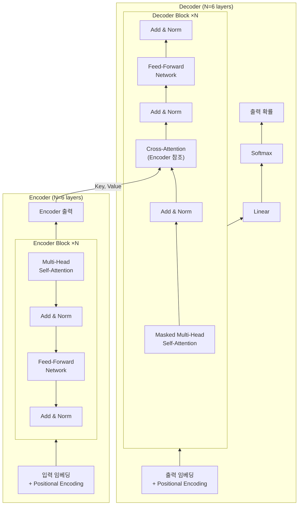
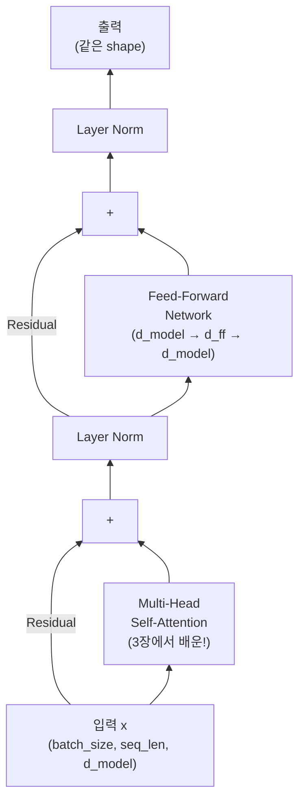
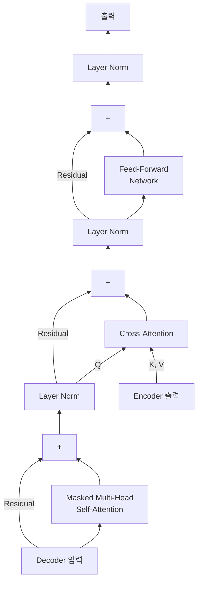

## 4주차 A회차: Transformer 아키텍처 심층 분석

> **미션**: 수업이 끝나면 Transformer Encoder를 밑바닥부터 구현할 수 있고, Positional Encoding의 필요성을 이해한다

### 학습목표

이 회차를 마치면 다음을 수행할 수 있다:

1. Transformer 전체 구조(Encoder-Decoder)를 설명하고 각 구성 요소의 역할을 이해할 수 있다
2. RNN(순차 처리)과 Transformer(병렬 처리)의 핵심 차이를 설명할 수 있다
3. Positional Encoding이 필요한 이유를 이해하고 Sinusoidal, Learned, RoPE 방식의 차이를 설명할 수 있다
4. Encoder Block의 구조(Multi-Head Self-Attention + FFN + Residual + LayerNorm)를 설명할 수 있다
5. Causal Masking과 Cross-Attention의 역할을 이해할 수 있다
6. 수치 예시를 통해 Positional Encoding과 Residual Connection의 구체적 효과를 설명할 수 있다

---

### 오늘의 질문 + 빠른 진단

**오늘의 질문**: "RNN은 한 글자씩 순서대로만 읽을 수 있는데, 문장 전체를 한눈에 보면서 동시에 처리할 수 있다면 무엇이 달라질까?"

**빠른 진단 (1문항)**:

다음 두 문장을 읽고 답하시오.

(A) "나는 학교에 갔다"
(B) "나는 학교가 좋다"

두 문장에서 "학교"의 의미가 다르다. RNN이 "학교"를 해석할 때, 어떤 정보를 함께 봐야 올바르게 이해할까?

① 다음에 올 단어만
② 앞에 올 단어만
③ 앞뒤의 모든 단어를 동시에
④ 단어의 위치 번호

정답: ③ — 이것이 Transformer가 병렬 처리를 하는 이유이다.

---

### 이론 강의

> **Transformer를 한눈에 — "조별 번역 프로젝트"**
>
> 교수님이 영어 논문을 한국어로 번역해서 발표하라는 팀 프로젝트를 냈다고 상상해 보자. 팀은 이렇게 움직인다:
>
> 1. **토큰화(Tokenization)**: 팀장이 논문을 적당한 크기의 조각으로 나눈다. 글자 단위는 너무 잘고, 문장 단위는 너무 크다. "의미가 살아있는 어절" 단위로 쪼갠다.
> 2. **위치 스티커(Positional Encoding)**: 쪼갠 조각에 "1번, 2번, 3번…" 번호 스티커를 붙인다. 나중에 순서대로 다시 붙여야 하니까.
> 3. **독해팀(Encoder)**: 팀의 절반이 단체 카톡방에서 논문 조각들을 동시에 읽으며 토론한다. "이 부분이 저 부분과 연결되지 않아?" — 여러 명이 각자 다른 관점(문법, 의미, 맥락)으로 동시에 분석한다(Multi-Head Attention). 각자 원본 조각을 손에 쥔 채(Residual) 정리 메모를 작성하고, 메모 양식을 통일한다(LayerNorm). 이 과정을 6번 반복하면 논문에 대한 깊은 이해 메모가 완성된다.
> 4. **작성팀(Decoder)**: 나머지 절반이 한국어 번역을 쓴다. 규칙: 아직 쓰지 않은 뒷문장을 미리 보면 안 된다(Causal Masking). 한 문장씩 쓸 때마다 독해팀 메모의 관련 부분을 찾아 참고한다(Cross-Attention).
> 5. **최종 선택(Softmax)**: 다음에 올 가장 적절한 단어를 확률로 골라 문장을 완성한다.
>
> 이 스토리를 기억하며 아래 내용을 읽으면, 각 개념이 "아, 그 역할이구나"로 연결될 것이다.

#### 4.1 "Attention is All You Need"와 Transformer의 혁신

2017년 Google 연구팀(Vaswani et al.)이 발표한 논문 "Attention is All You Need"는 AI 역사의 분수령이 되었다. 이 논문은 RNN 없이 **Attention 메커니즘만으로 순차 데이터를 처리하는 Transformer 아키텍처**를 제안했고, 2026년 현재 BERT, GPT, Llama 등 모든 현대 언어 모델의 기반이 되었다.

**직관적 이해**: RNN은 **전언 게임(귓속말 게임)**이다. 반장 → 부반장 → A → B → C 순서로, 각 사람이 들은 내용을 기억에 의존해 다음 사람에게 말로 전한다. 문제는 각 사람의 기억 용량이 한정되어 있어서(고정 크기 hidden state), 앞사람의 말을 자기 나름대로 요약·압축할 수밖에 없다는 것이다. C에게 도달할 때쯤이면 반장의 원래 의도가 왜곡되어 있다(장거리 의존성 문제). 반면 Transformer는 **단체 카톡방**이다. 반장이 한 번 메시지를 올리면 모든 사람이 동시에 원본을 읽고, 서로 답장하며, 누구든 원본 메시지를 바로 참조할 수 있다. 게다가 여러 명(Multi-Head Attention)이 각자 다른 관점 — 문법, 의미, 맥락 — 으로 분석한다. 마치 에브리타임 강의평가에서 난이도, 과제량, 교수 스타일을 각각 다른 사람이 평가하는 것과 같다. (참고: Multi-Head는 GPU에서 물리적으로도 동시에 계산되지만, 여러 헤드를 두는 **목적**은 속도가 아니라 **다양한 관점 확보**이다. Transformer의 속도 혁신은 "모든 단어를 동시에 처리"하는 구조 자체에서 온다.)

##### Transformer의 세 가지 핵심 혁신 

1. **순환 구조의 완전한 제거**: RNN은 시점 t의 계산이 시점 t-1의 결과에 의존하여 **순차적으로만** 계산할 수 있다. Transformer는 모든 위치의 입력을 **동시에** 처리하므로 GPU 병렬화가 가능하다. 1,000단어 문장을 RNN은 1,000 스텝에 걸쳐 처리하지만, Transformer는 1 스텝에 처리한다.

2. **O(1) 경로 길이**: 3장에서 배운 RNN은 시점 1의 정보가 시점 100에 도달하려면 99번의 중간 단계를 거쳐야 한다. 정보가 "물의 흐름처럼" 순서대로 흘러가기 때문이다. Transformer의 Self-Attention은 모든 위치가 **직접 연결**되어, 어떤 거리의 단어도 1 스텝에 정보를 교환할 수 있다.

3. **확장성(Scalability)**: 병렬 처리가 가능하므로 더 큰 모델, 더 많은 데이터로 학습할 수 있다. GPT-3의 1,750억 개 파라미터, Llama 3의 4,050억 파라미터 같은 거대 모델의 등장이 가능해진 것도 Transformer의 확장성 덕분이다.

> **쉽게 말해서**: RNN은 "전언 게임"(한 명씩 기억에 의존해 말을 넘기기)이고, Transformer는 "단체 카톡방"(모두가 동시에 원본을 읽고 서로 대화)이다.

**그래서 무엇이 달라지는가?** 3장의 RNN/LSTM으로 BERT나 GPT를 만들려면? 불가능하다. RNN의 순차 처리로는 기가급 GPU 메모리를 활용할 수 없고, 학습 시간이 수개월 이상 걸린다. Transformer의 병렬 처리 덕분에 수주 내에 모델을 학습하고, 그 결과로 현대 LLM의 지능이 가능해진 것이다. 실제로 Transformer 이전의 기계 번역 모델들은 병렬화가 불가능하여 고사양 서버 한 대에서 수개월 학습해야 했다. 오늘날의 거대 언어 모델은 이러한 병렬화의 이점 없이는 존재할 수 없다.

---

#### 4.2 Transformer 전체 구조 (Encoder-Decoder)

Transformer는 **Encoder**와 **Decoder**의 두 부분으로 구성된다. 각각의 역할을 먼저 이해하자.



**그림 4.1** Transformer 전체 아키텍처 — Encoder(입력 이해)와 Decoder(출력 생성)

**직관적 이해**: 번역 에이전시를 생각해 보자. **Encoder**는 "한국어 독해 전문가"로, 원문을 깊이 읽고 핵심 메모를 남긴다. **Decoder**는 "영어 작성 전문가"로, 독해 전문가의 메모를 계속 참고하면서 영어 문장을 한 단어씩 써 내려간다. Cross-Attention은 작성 전문가가 "지금 이 단어를 쓰려면 메모의 어느 부분을 봐야 하지?"를 찾는 행위이다.

**Encoder**의 역할: 입력 시퀀스를 깊이 있게 이해하고 의미 표현으로 변환한다. 동일한 구조의 블록을 N번(원 논문에서는 6번) 쌓는다. 각 블록은 **Multi-Head Self-Attention**(3장에서 배운!)과 **Feed-Forward Network**로 구성되며, 각 서브레이어에 Residual Connection과 Layer Normalization이 적용된다.

**Decoder**의 역할: Encoder가 이해한 내용을 바탕으로 출력을 **한 토큰씩** 순차 생성한다. Encoder와 유사하지만 세 가지 차이가 있다:

- **Masked Self-Attention**: 미래 토큰을 보지 못하도록 마스킹 ("커닝 방지")
- **Cross-Attention**: Encoder의 출력을 Key, Value로 참조 ("원문과 현재 번역을 비교")
- **Linear + Softmax**: 최종 출력에 적용하여 다음 토큰의 확률 분포 생성

> **참고**: BERT는 Encoder만 사용(Encoder-only)하고, GPT는 Decoder만 사용(Decoder-only)한다. 원본 Transformer처럼 둘 다 사용하는 모델(Encoder-Decoder)로는 T5, BART 등이 있다.

---

#### 4.3 Positional Encoding: 순서 정보 추가

##### 순서 정보가 필요한 이유

3장에서 배운 Self-Attention에는 **치명적인 약점**이 하나 있다. Self-Attention은 모든 위치 쌍의 관계를 행렬 연산으로 계산하므로, **입력의 순서에 무관하다**는 것이다. 만약 입력 문장을 섞으면 단어 순서만 바뀔 뿐, 내용은 동일하다.

그런데 언어에서 순서는 의미를 결정한다:

- "개가 사람을 물었다" vs "사람이 개를 물었다"
- "I love you" vs "You love I"

따라서 Transformer는 입력에 **위치 정보를 별도로 추가**해야 한다. 이것이 **Positional Encoding(위치 인코딩)**이다.

**직관적 이해**: 카카오톡 단톡방에서 메시지 순서가 섞인다고 상상해 보자. "밥 먹었어?" → "응, 맛있었어" → "어디서?" 라는 대화가 "어디서?" → "응, 맛있었어" → "밥 먹었어?" 순서로 보이면 완전히 다른 의미가 된다. Self-Attention은 기본적으로 이 세 메시지를 순서 없이 한꺼번에 본다. 그래서 "몇 번째 메시지인지"를 내용에 스탬프처럼 찍어줘야 한다. 이것이 바로 Positional Encoding이다. 배달앱으로 비유하면, 주문한 음식 자체(임베딩)가 같아도 몇 번째 주문(위치)이냐에 따라 처리 순서가 달라지는 것과 같다.

##### 현대 표준: RoPE (Rotary Positional Encoding)

초기에는 수학 함수로 고정 생성하는 방식(Sinusoidal, 2017)과 위치별 벡터를 학습하는 방식(Learned PE, BERT/GPT-2)이 있었지만, 현재 Llama, Mistral 등 최신 LLM은 거의 모두 **RoPE**(Su et al., 2021)를 사용한다.

**직관적 이해 — 놀이공원 회전목마**: 회전목마에 앉아 있다고 생각해 보자. 1번 자리 사람은 출발점에서 살짝 돌아간 위치, 5번 자리 사람은 많이 돌아간 위치에 있다. RoPE는 이처럼 **각 단어를 위치만큼 "돌려놓는"** 방식이다. 핵심은 이것이다: 1번과 3번 사이의 각도 차이나, 101번과 103번 사이의 각도 차이나 **같다**. 즉 "몇 번째인지"(절대 위치)보다 "둘 사이가 얼마나 떨어져 있는지"(상대 거리)가 자동으로 인코딩된다. 언어에서는 이 상대적 거리가 더 중요하다 — "주어가 동사보다 2칸 앞에 있다"는 정보가 "주어가 5번째에 있다"보다 문법 이해에 유용하기 때문이다.

**왜 RoPE가 대세가 되었나?**
- 단어 간 **상대적 거리**를 자연스럽게 표현한다
- 학습 때 4K 토큰이었어도 추론 때 128K까지 **확장 가능**하다
- 추가 파라미터가 거의 없어 **구현이 간결**하다

**그래서 무엇이 달라지는가?** PE가 없다면? "개가 사람을 물었다"와 "사람이 개를 물었다"를 Encoder에 넣어도 같은 결과가 나온다. Self-Attention은 단어 쌍의 관계만 계산할 뿐 순서를 모르기 때문이다. PE가 있어야 모델이 "위치 0의 '개'"와 "위치 2의 '개'"를 구별하고, 문장의 문법 구조를 학습할 수 있다.

_전체 코드는 practice/chapter4/4장-실습.ipynb §1 참고_

---

#### 4.4 Encoder Block의 구성 요소

Encoder Block을 구현하기 전에, 두 가지 핵심 구성 요소를 이해해야 한다.

##### Residual Connection: 원본을 보존하면서 변화만 학습

**직관적 이해**: 선배에게 받은 시험 족보를 복사한 뒤, 내 필기를 "추가"한다고 생각해 보자. 원본 족보를 지우고 새로 쓰는 게 아니라, 원본은 그대로 유지하면서 내 메모만 덧붙인다. **Residual Connection**도 같은 원리이다.

구조:

```
output = x + Sublayer(x)
            ↑         ↑
        족보 원본   내 추가 메모
```

입력 x에 서브레이어의 출력을 **더하는** 것이 핵심이다. 이렇게 하면:

1. **깊은 네트워크에서 기울기가 잘 전달된다**: 문제가 생겼을 때 "이 부분이 잘못됐어"라는 피드백(기울기)이 뒤에서 앞으로 전달되어야 한다. Residual이 없으면 20명을 거치는 전언 게임처럼 피드백이 흐릿해진다. Residual이 있으면 피드백이 원본 작성자에게 바로 전달되는 "고속도로"가 생긴다.

2. **학습이 안정적이다**: 네트워크가 처음부터 모든 것을 학습할 필요 없이, "변화량"만 학습하면 된다. He et al. (2016)이 ResNet에서 처음 제안한 이 기법은, Transformer가 수십~수백 층을 쌓을 수 있게 해주는 핵심이다.

실제 효과를 수치로 보자:

```
[Residual Connection의 효과 — 20층 통과 후]
  입력 신호 크기 (L2 norm): 35.7
  Residual 없음: 1.5    (신호 95% 손실!)
  Residual 있음: 2,057.6 (신호 유지됨)
```

Residual 없이 20층을 통과하면 신호가 거의 사라지지만(35.7 → 1.5), Residual을 추가하면 신호가 오히려 강해진다. 이것이 깊은 신경망을 가능하게 하는 핵심이다.

**그래서 무엇이 달라지는가?** Residual Connection이 없다면 깊은 Transformer는 작동하지 않는다. 원 논문의 6층 Encoder도 실제로는 기울기 소실 문제로 학습이 어려워진다. Residual을 추가하면 30층, 50층, 100층 이상의 깊은 모델도 안정적으로 학습할 수 있다. 이는 단순한 "성능 향상"을 넘어 깊은 모델의 학습 가능성 자체를 결정한다.

##### Layer Normalization: 출력 안정화

**Layer Normalization**은 각 위치의 은닉 벡터를 정규화하여 평균 0, 표준편차 1로 만든다.

**직관적 이해**: 수강신청한 과목들의 기말 성적이 나왔다. 국어는 평균 90점, 수학은 평균 30점, 영어는 평균 70점이다. 이대로 합산하면 국어 점수가 전체 학점을 좌우한다. 그래서 학교는 **각 과목 점수를 "평균 0, 표준편차 1"로 표준화**(상대평가)한 뒤 합산한다. Layer Normalization도 같은 원리이다. 벡터의 각 차원(=각 과목)이 제각각 다른 크기를 가지면 학습이 불안정해지니, 매 레이어 출력을 표준화해서 균형 있게 만든다.

```
정규화 전: [2.1, -0.8, 3.5, 1.2, ...]  → 평균: 1.5, 표준편차: 2.1
정규화 후: [0.3, -1.1, 0.9, -0.2, ...] → 평균: 0.0, 표준편차: 1.0
```

**이 정규화가 필요한 이유:**

1. **학습 안정화**: 은닉 벡터의 크기가 극도로 커지거나 작아지는 것을 방지한다.

2. **수렴 속도 향상**: 학습 시 하이퍼파라미터(학습률)에 덜 민감해진다.

3. **NLP에 적합**: Batch Normalization은 배치 차원을 기준으로 정규화하지만, Layer Normalization은 **각 샘플의 특성(feature) 차원**을 기준으로 정규화한다. 시퀀스 길이가 다를 수 있는 NLP에서는 Layer Normalization이 더 적합하다.

> **강의 팁**: Pre-LN과 Post-LN의 차이를 질문할 수 있다. 원본 Transformer는 Post-LN(서브레이어 뒤에 정규화)을 사용했지만, 최근 대부분의 모델은 **Pre-LN**(서브레이어 앞에 정규화)을 사용한다. Pre-LN이 학습 초기에 더 안정적이기 때문이다.

> **쉽게 말해서**: Layer Normalization은 시험 점수의 "상대평가"처럼, 벡터의 각 차원을 표준화하여 학습을 안정적으로 만드는 기법이다.

##### Encoder Block 전체 구조

이제 모든 구성 요소를 합쳐 하나의 Encoder Block이 어떻게 작동하는지 단계별로 따라가 보자.

**한 블록 안에서 일어나는 8단계:**

1. **입력**: 단어 하나가 d_model 차원 벡터로 들어온다 (예: 512차원)
2. **8개 헤드로 분할**: d_model을 8등분한다 (512 → 64 × 8). 각 헤드가 64차원씩 담당
3. **각 헤드가 Attention 계산**: 8개의 서로 다른 관점(문법, 의미, 지시어 등)으로 분석
4. **8개 결과를 Concat**: 64 × 8 = 512, 다시 d_model 크기로 이어붙임
5. **Residual (1차)**: Concat 결과 + 원본 입력(1단계)을 **더함**
6. **LayerNorm (1차)**: 더한 결과를 정규화
7. **FFN**: 정규화된 결과를 Feed-Forward Network에 통과 (정보 수집 → 취사선택)
8. **Residual + LayerNorm (2차)**: FFN 결과 + 6단계 결과를 더하고, 다시 정규화

전체 흐름을 그림으로 보면:

```
입력 ──┬── 8 Head Attention ── Concat ──(+)── LayerNorm ──┬── FFN ──(+)── LayerNorm ── 출력
       │                                  ↑               │                ↑
       └──────────── Residual ────────────┘               └── Residual ───┘
```

> **주의**: 8개 헤드 결과를 합치는 것은 **Concat(이어붙이기)**이고, 그 **이후에** Residual(원본 더하기)이 일어난다. Concat ≠ Residual이다. Residual의 목적은 "합치기"가 아니라 **원본 신호를 보존**하는 것이다. Residual은 Attention 뒤에 한 번, FFN 뒤에 한 번, 총 **두 번** 일어난다.



**그림 4.2** Transformer Encoder Block 내부 구조

핵심 패턴:

```python
class TransformerEncoderBlock(nn.Module):
    def __init__(self, d_model, num_heads, d_ff, dropout=0.1):
        super().__init__()
        self.self_attention = MultiHeadAttention(d_model, num_heads)
        self.feed_forward = PositionwiseFeedForward(d_model, d_ff)
        self.norm1 = nn.LayerNorm(d_model)
        self.norm2 = nn.LayerNorm(d_model)

    def forward(self, x, mask=None):
        # Self-Attention + Residual + Norm
        attn_output = self.self_attention(x, x, x, mask)
        x = self.norm1(x + attn_output)

        # Feed-Forward + Residual + Norm
        ff_output = self.feed_forward(x)
        x = self.norm2(x + ff_output)
        return x
```

실행 결과:

```
[Transformer Encoder Block]
  입력 shape: torch.Size([2, 10, 256])
  출력 shape: torch.Size([2, 10, 256])
  블록당 파라미터: ~789,760개

[4층 Encoder 스택]
  총 파라미터: ~3,159,040개
```

이 shape의 의미를 풀어보면:

```
torch.Size([2, 10, 256])
              ↑   ↑    ↑
          batch  seq  d_model
          문장 수  단어 수  차원
```

- **2 (batch)**: 한 번에 처리하는 문장 수. 문장 1개씩 처리하면 GPU가 놀기 때문에 여러 문장을 묶어서 동시에 처리한다. 실제 학습에서는 32, 64, 128 등을 쓴다.
- **10 (seq_len)**: 각 문장의 단어(토큰) 수
- **256 (d_model)**: 각 단어를 표현하는 벡터 크기. 이 차원이 클수록 단어를 더 풍부하게 표현한다.

**입력과 출력의 shape이 동일**한 것이 핵심이다! 이 덕분에 동일한 블록을 원하는 만큼 쌓을 수 있다(6층이든 126층이든).

##### Feed-Forward Network: Attention이 모은 정보를 판단한다

**Attention = 정보 수집**, **FFN = 취사선택**이다.

Self-Attention은 단체 카톡방에서 "누가 누구와 관련 있는지" 파악하는 단계이다. 수업 시간에 **듣는** 것과 같다. 하지만 듣기만 해서는 이해가 얕다. 집에 가서 **혼자 복습하며 정리**해야 깊은 이해가 생긴다. FFN이 바로 이 복습 단계이다.

**FFN의 내부 구조:**

```
512차원 → Linear → ReLU/GELU → Linear → 512차원
(압축된 정보)    (2048으로 펼침)  (취사선택)  (다시 512로 압축)
```

- **확장 (512 → 2048)**: 시험공부할 때 노트 필기를 한번 쫙 펼쳐놓는 것
- **활성화함수 (ReLU/GELU)**: 펼쳐놓은 2048개 뉴런 중 "쓸 것은 살리고, 버릴 것은 0으로 차단"하는 **취사선택**
- **축소 (2048 → 512)**: 핵심만 추려서 요약본을 만드는 것

예를 들어 Self-Attention이 "철수가 사과를 먹었다"에서 '먹었다'와 '사과'의 강한 연결을 찾았다면, FFN은 이 정보를 받아 활성화함수로 "동사-목적어 관계가 중요하다 → 살리자", "어순 정보는 이미 충분하다 → 버리자"를 결정한다.

> **한 줄 요약**: Self-Attention = **"누구를 볼까?"** (정보 수집), FFN = **"봤으니까 뭘 살리고 뭘 버릴까?"** (활성화함수를 통한 취사선택). 둘이 합쳐져야 하나의 완전한 사고 단계가 된다.

_전체 코드는 practice/chapter4/4장-실습.ipynb §3 참고_

---

#### 4.5 Decoder Block: 모델을 만들고, 사용하기

Encoder는 입력 문장 전체를 한꺼번에 처리했다. Decoder는 본질적으로 **"이전 단어를 보고 다음 단어를 예측"**하는 구조이다. "나는 학교에 갔다"를 영어로 번역하는 예시로, Decoder의 **훈련**(모델 만들기)과 **추론**(모델 사용하기)을 순서대로 따라가 보자.

---

##### [훈련] Teacher Forcing: 모델을 만드는 과정

> **[훈련]** 이 섹션은 모델의 가중치를 **만들어가는** 과정이다.

Decoder를 훈련시키려면, 정답 번역 "I went to school"을 알고 있는 상태에서 "각 위치에서 다음 단어를 맞춰봐"라고 학습시켜야 한다. 가장 단순한 방법은 한 단어씩 생성하고 채점하는 것이지만, 5단어 문장에 Decoder를 5번 돌려야 한다. 100단어면 100번이다. **너무 느리다.**

**Teacher Forcing**은 이 문제를 해결한다. 핵심 아이디어: **정답 문장 전체를 한꺼번에 Decoder에 넣되, Causal Masking으로 미래를 가린다.**

비유하면 이렇다. 수학 시험 풀이를 채점한다고 하자:
- **느린 방법**: 학생이 1번 풀이 → 채점 → 2번 풀이 → 채점 → ... 한 문제씩
- **Teacher Forcing**: 정답 풀이 전체를 나란히 펼쳐놓되, 각 줄에 **가리개**를 덮어서 "이 줄까지만 보고 다음 줄을 맞춰봐"라고 한다. **모든 줄의 채점을 동시에** 할 수 있다!

```
[훈련] Teacher Forcing — Decoder 입력과 정답
  Decoder 입력 (정답을 한 칸씩 밀어 넣음):
    위치 0: <SOS>                  → 정답: "I"
    위치 1: <SOS> I                → 정답: "went"
    위치 2: <SOS> I went           → 정답: "to"
    위치 3: <SOS> I went to        → 정답: "school"
    위치 4: <SOS> I went to school → 정답: <EOS>

  핵심: 5개 위치의 예측을 GPU에서 **한 번에 병렬로** 계산한다!
```

`<SOS>`는 **"문장 시작"** 특수 토큰이고, `<EOS>`는 **"문장 끝"** 특수 토큰이다. Teacher Forcing 덕분에 훈련에서도 Encoder처럼 **병렬 처리**가 가능해진다.

##### [훈련] Causal Masking: 미래를 보지 못하게 하는 가리개

> **[훈련]** Teacher Forcing과 함께 작동하는 훈련 장치이다.

위에서 정답 문장 전체를 넣었는데, 그러면 위치 0에서 "I"를 예측할 때 정답인 "I went to school"을 다 볼 수 있는 게 아닌가? 그래서 **Causal Masking**이 필요하다. 각 위치에서 **자기 자신과 이전 위치만** 볼 수 있게 가린다.

```
[훈련] 각 위치에서 볼 수 있는 범위
  "I"를 예측할 때:      <SOS>만 봄              ← 나머지 가림
  "went"를 예측할 때:   <SOS> I만 봄            ← "went to school" 가림
  "to"를 예측할 때:     <SOS> I went만 봄       ← "to school" 가림
  "school"을 예측할 때: <SOS> I went to만 봄    ← "school" 가림
  <EOS>를 예측할 때:    <SOS> I went to school  ← 전체 볼 수 있음
```

**왜 가려야 하나?** 훈련 때 미래를 다 보고 학습하면, 실전(추론)에서는 미래가 없으니 성능이 떨어진다. 오픈북으로만 연습한 학생이 클로즈드북 시험에서 망하는 것과 같다. Causal Masking은 훈련 때부터 **실전과 동일한 조건**으로 학습시키는 장치이다.


##### [훈련·추론 공통] Cross-Attention: 원문을 참조하며 번역

> **[훈련·추론 공통]** Cross-Attention은 훈련이든 추론이든 **동일하게** 작동한다.

Decoder는 번역할 때 매번 원문(Encoder 출력)을 참조해야 한다. "went"를 만들 때 원문의 어디를 봐야 할까? 이것을 결정하는 것이 **Cross-Attention**이다.

```
[Cross-Attention — 각 단어에서 원문 참조]
  "I" 예측:      원문에서 "나는"에 집중        ← 주어 참조
  "went" 예측:   원문에서 "갔다"에 집중        ← 동사 참조
  "to" 예측:     원문에서 "학교에"의 조사에 집중 ← 전치사 결정
  "school" 예측: 원문에서 "학교에"에 집중       ← 목적지 참조
```

Cross-Attention은 Self-Attention과 구조가 동일하지만, **입력의 출처가 다르다**:

- **Masked Self-Attention**: Q, K, V가 모두 Decoder 자신에서 생성 ("지금까지 쓴 번역 내에서 관계 파악")
- **Cross-Attention**: **Q는 Decoder에서** (지금 예측 중인 단어), **K와 V는 Encoder 출력에서** (원문)

"위치 0에서 `<SOS>`만 보고 어떻게 'I'를 맞추지?"라고 의문이 들 수 있다. `<SOS>` 자체에는 의미가 없다. 핵심이 바로 이 Cross-Attention이다 — 원문 "나는 학교에 갔다"의 Encoder 출력을 참조하여, "나는"에 높은 가중치를 두고 "I"를 예측한다. 즉 **첫 단어는 거의 전적으로 Cross-Attention(원문 참조)에 의존**한다.

> **쉽게 말해서**: 발표 PPT를 만들 때 발표 원고를 옆에 펼쳐놓고 계속 참고하는 것과 같다. 서론 슬라이드를 만들 때는 원고 앞부분을, 결론 슬라이드를 만들 때는 원고 마지막을 본다.

##### [훈련·추론 공통] Decoder Block 내부 구조

위의 모든 구성 요소를 합치면, Decoder Block은 Encoder Block보다 서브레이어가 하나 더 많다:



**그림 4.3** Transformer Decoder Block 내부 구조

```
[Decoder Block 파라미터 분석]
  Decoder Block: ~1,053,440개
  Encoder Block: ~789,760개
  → Decoder가 약 33% 더 많은 파라미터 (Cross-Attention 추가)
```

---

##### [추론] 완성된 모델 사용하기: 한 단어씩 순차 생성

> **[추론]** 여기서부터는 훈련이 끝난 **완성된 모델을 실제로 사용**하는 과정이다.

훈련이 끝나면 모델의 가중치가 완성된다. 이제 새로운 문장 "나는 학교에 갔다"를 번역해 보자. 추론에서는 정답이 없으므로, **한 단어씩 순차적으로** 생성할 수밖에 없다. 이처럼 이전 출력을 다음 입력으로 사용하는 방식을 **Autoregressive(자기회귀) Generation**이라 한다.

```
[추론] Decoder가 한 단어씩 생성하는 과정
Step 1: 입력 <SOS>                    → Decoder 예측: "I"
Step 2: 입력 <SOS> I                  → Decoder 예측: "went"
Step 3: 입력 <SOS> I went             → Decoder 예측: "to"
Step 4: 입력 <SOS> I went to          → Decoder 예측: "school"
Step 5: 입력 <SOS> I went to school   → Decoder 예측: <EOS> (끝)
```

**[추론] "went"가 생성되는 순간(Step 2)**을 Decoder Block 내부까지 따라가 보자:

1. **입력**: 지금까지 생성한 `<SOS> I`이 Decoder에 들어간다
2. **Masked Self-Attention**: `<SOS>`와 `I`의 관계를 파악한다 ("주어 다음이니 동사가 올 차례")
3. **Cross-Attention**: 원문 "나는 학교에 **갔다**"에서 "갔다"에 높은 가중치 → "과거형 이동 동사구나"
4. **FFN**: "과거 동사 + 이동" 정보는 살리고, 나머지는 버린다
5. **Linear + Softmax**: 어휘 전체에 대한 확률 분포 생성 → "went" 87%, "go" 5%, "walked" 3%... → **"went"** 선택
6. "went"를 입력에 추가 → `<SOS> I went`로 **1로 돌아간다**

다음 루프에서는 `<SOS> I went`를 입력으로, "to"를 예측한다. 이 과정이 `<EOS>`가 나올 때까지 반복된다.

---

> **훈련 vs 추론 한눈에 비교**
>
> | | **훈련** (모델 만들기) | **추론** (모델 사용하기) |
> |---|---|---|
> | 정답 | 있음 ("I went to school") | 없음 |
> | 입력 방식 | 정답 전체를 한꺼번에 넣음 (Teacher Forcing) | 한 단어씩 순차 생성 (Autoregressive) |
> | 병렬 처리 | 가능 (모든 위치 동시 계산) | 불가능 (이전 단어가 있어야 다음 예측) |
> | Causal Masking | 미래를 가려서 실전 조건과 맞춤 | 미래 단어가 아직 없으니 자연스럽게 적용 |
> | 속도 | 빠름 | 느림 |

_전체 코드는 practice/chapter4/4장-실습.ipynb §4 참고_

---

### 핵심 정리

이 장에서 다룬 Transformer의 핵심을 정리하면:

- **Transformer**는 2017년 "Attention is All You Need"에서 제안되어, 병렬 처리와 O(1) 경로 길이로 혁신을 가져왔다
- **Encoder**는 입력을 깊이 있게 이해하고, **Decoder**는 그 이해를 바탕으로 출력을 생성한다
- **Positional Encoding**은 순서 정보가 없는 Self-Attention에 위치 정보를 추가한다 (현대 LLM은 RoPE 사용)
- **Encoder Block**의 패턴: Self-Attention → Residual+LN → FFN → Residual+LN
- **Residual Connection**은 입력을 더하여 기울기의 "고속도로"를 만들고, 깊은 네트워크를 가능하게 한다
- **Layer Normalization**은 은닉 벡터를 정규화하여 학습을 안정화한다
- **Causal Masking**으로 Decoder는 미래를 보지 못하고, **Cross-Attention**으로 Encoder를 참고한다
- **Teacher Forcing**으로 훈련 시 병렬 처리가 가능하고, **Autoregressive Generation**으로 추론 시 한 단어씩 생성한다

---

### 라이브 코딩 시연

> **학습 가이드**: `practice/chapter4/4장-실습.ipynb`를 Jupyter에서 열고, 셀을 순서대로 실행하며 따라가 보자. 첫 셀이 환경 설정을 자동으로 처리한다.

노트북의 실습 구성:

| 섹션 | 내용 |
|------|------|
| §1 | Positional Encoding — Sinusoidal vs Learned 비교 |
| §2 | Residual Connection & LayerNorm 효과 실험 |
| §3 | Encoder Block — MHA + FFN 밑바닥 구현 |
| §4 | Decoder Block — Causal Mask + Cross-Attention |
| §5 | 전체 Encoder 스택 + 분류 모델 + 실제 LLM 크기 비교 |

---

### 참고문헌

1. Vaswani, A., Shazeer, N., Parmar, N., Uszkoreit, J., Jones, L., Gomez, A. N., Kaiser, Ł., & Polosukhin, I. (2017). Attention Is All You Need. _NeurIPS_. https://arxiv.org/abs/1706.03762

2. He, K., Zhang, X., Ren, S., & Sun, J. (2016). Deep Residual Learning for Image Recognition. _CVPR_. https://arxiv.org/abs/1512.03385

3. Ba, J. L., Kiros, J. R., & Hinton, G. E. (2016). Layer Normalization. _arXiv_. https://arxiv.org/abs/1607.06450

4. Su, J., Lu, Y., Pan, S., Murtadha, A., Wen, B., & Liu, Y. (2021). RoFormer: Enhanced Transformer with Rotary Position Embedding. _arXiv_. https://arxiv.org/abs/2104.09864
