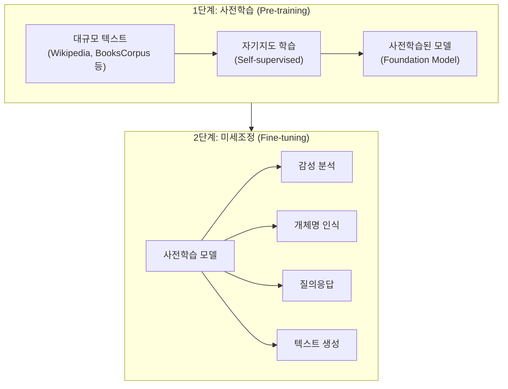
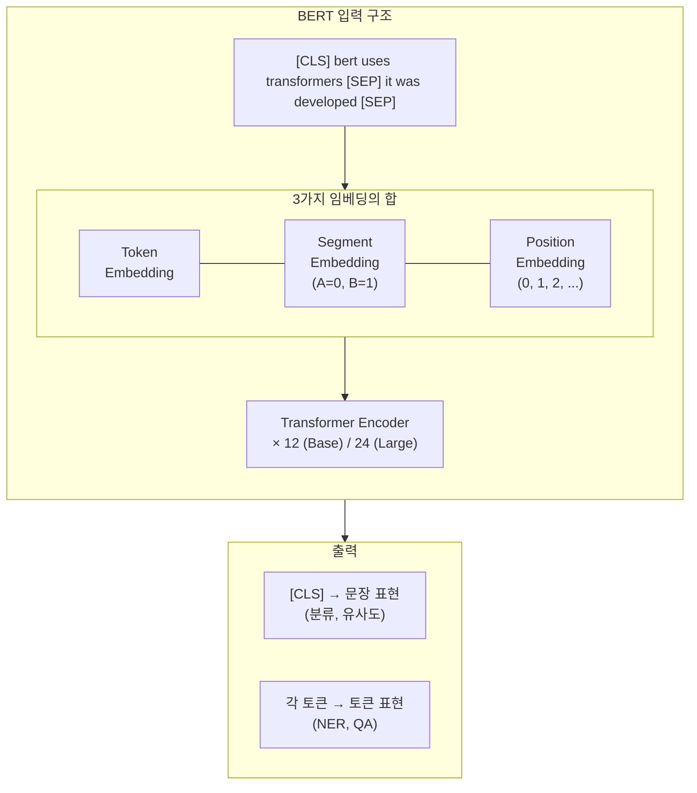
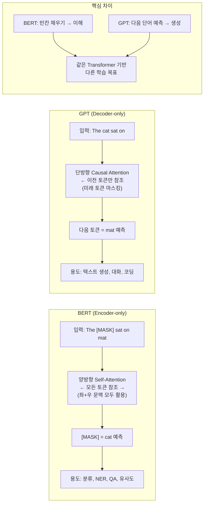
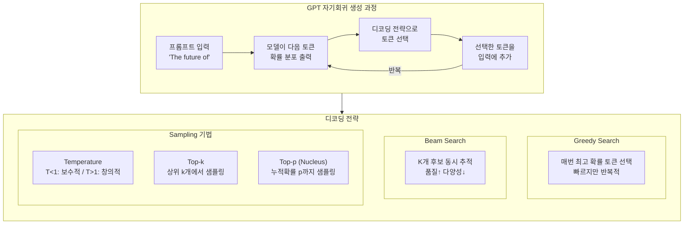

# 제5장: LLM 아키텍처 — BERT와 GPT

> **미션**: 수업이 끝나면 BERT와 GPT를 직접 돌려보고 차이를 체감한다

## 학습 목표

이 장을 마치면 다음을 수행할 수 있다:

1. 사전학습(Pre-training)과 미세조정(Fine-tuning) 패러다임을 설명하고, Transfer Learning의 원리를 이해한다
2. BERT의 양방향 구조와 MLM/NSP 학습 목표를 설명할 수 있다
3. GPT의 자기회귀 구조와 Causal Self-Attention의 원리를 이해한다
4. 다양한 텍스트 생성 전략(Greedy, Beam, Top-k, Top-p)의 차이를 비교할 수 있다
5. Hugging Face Transformers를 사용하여 BERT/GPT 모델을 로드하고 활용할 수 있다

### 수업 타임라인

| 시간 | 구분 | 내용 |
|------|------|------|
| 00:00~00:50 | **1교시** | 사전학습 패러다임 + BERT 아키텍처 |
| 00:50~01:00 | 쉬는시간 | |
| 01:00~01:50 | **2교시** | GPT 아키텍처 + Hugging Face 실전 |
| 01:50~02:00 | 쉬는시간 | |
| 02:00~02:50 | **3교시** | BERT/GPT 활용 실습 + 과제 |

---

#### 1교시: 사전학습과 BERT

## 5.1 사전학습 패러다임

**직관적 이해**: 사전학습은 **의대 본과 + 전문의 수련**과 같다. 의대 본과(Pre-training)에서는 해부학, 생리학, 약리학 등 의학의 기초를 폭넓게 배운다. 졸업 후 전문의 수련(Fine-tuning)에서는 내과, 외과, 안과 등 특정 분야에 집중한다. 본과에서 쌓은 기초 지식이 탄탄하면 어떤 전공 수련도 빠르게 적응할 수 있다. 언어 모델도 마찬가지이다. 대규모 텍스트로 "언어의 기초"를 먼저 배운 뒤, 소규모 데이터로 특정 과제에 맞춰 조정한다.

### Pre-training → Fine-tuning 전략

4장까지 학습한 Transformer 아키텍처는 강력하지만, 처음부터 특정 과제를 위해 훈련하려면 대규모 레이블 데이터가 필요하다. 그런데 레이블 없는 텍스트 데이터는 인터넷에 거의 무한히 존재한다. 이 관찰에서 **사전학습(Pre-training)**이라는 아이디어가 탄생했다.

사전학습 패러다임은 두 단계로 구성된다:

1. **사전학습(Pre-training)**: 레이블 없는 대규모 텍스트 데이터로 언어의 일반적 패턴을 학습한다. 이 단계에서 모델은 문법, 의미, 세계 지식 등을 스스로 터득한다.

2. **미세조정(Fine-tuning)**: 사전학습된 모델을 특정 과제(감성 분석, 번역, 요약 등)의 소규모 레이블 데이터로 추가 학습한다. 이미 "언어의 기초"를 알고 있으므로 적은 데이터로도 높은 성능을 달성한다.

이 접근법을 **전이 학습(Transfer Learning)**이라 한다. 하나의 도메인에서 학습한 지식을 다른 도메인에 전이하는 것이다. 컴퓨터 비전에서 ImageNet 사전학습이 표준이 된 것처럼, NLP에서도 사전학습이 사실상 표준(de facto standard)으로 자리잡았다.



**그림 5.1** Pre-training → Fine-tuning 패러다임

### 세 가지 아키텍처 유형

4장에서 학습한 Transformer는 Encoder-Decoder 구조였다. 사전학습 시대에는 이 구조가 세 가지로 분화했다:

**표 5.1** Transformer 아키텍처 유형 비교

| 유형 | 구조 | 대표 모델 | 학습 목표 | 강점 |
|------|------|-----------|-----------|------|
| Encoder-only | Encoder만 사용 | BERT, RoBERTa | MLM (빈칸 채우기) | 이해(분류, NER, QA) |
| Decoder-only | Decoder만 사용 | GPT, Llama | 다음 토큰 예측 | 생성(텍스트, 코드, 대화) |
| Encoder-Decoder | 양쪽 모두 사용 | T5, BART | 입력→출력 변환 | 변환(번역, 요약) |

이 장에서는 Encoder-only의 대표인 **BERT**와 Decoder-only의 대표인 **GPT**를 깊이 학습한다.

---

## 5.2 BERT 아키텍처

**직관적 이해**: BERT는 **빈칸 채우기 달인**이다. "나는 ___에서 공부한다"라는 문장을 보면, 사람은 앞뒤 문맥("나는", "에서 공부한다")을 모두 보고 "도서관"이라고 추론한다. BERT도 마찬가지로 문장의 **양방향(왼쪽 + 오른쪽)** 문맥을 동시에 보고 빈칸을 채운다. 이것이 BERT의 핵심 아이디어이다.

### BERT란?

BERT(Bidirectional Encoder Representations from Transformers)는 2018년 Google AI Language 팀이 발표한 사전학습 언어 모델이다(Devlin et al., 2019). 발표 당시 11개 NLP 벤치마크에서 동시에 최고 성능을 달성하며, NLP 분야에 "사전학습 혁명"을 일으켰다.

BERT의 핵심은 **양방향(Bidirectional) 문맥 이해**이다. 기존 언어 모델은 왼쪽에서 오른쪽으로만(GPT) 또는 양방향을 각각 따로(ELMo) 처리했지만, BERT는 4장에서 학습한 Transformer Encoder의 Self-Attention을 통해 모든 위치의 토큰이 다른 모든 위치를 동시에 참조한다.

### BERT의 학습 목표

BERT는 두 가지 자기지도 학습(Self-supervised Learning) 목표로 사전학습된다:

**1. MLM (Masked Language Model) — 빈칸 채우기**

입력 토큰의 15%를 무작위로 선택하여 다음과 같이 변환한다:
- 80%는 `[MASK]` 토큰으로 대체
- 10%는 랜덤 토큰으로 대체
- 10%는 원래 토큰을 유지

모델은 변환된 위치의 원래 토큰을 예측한다. 이 전략은 모델이 `[MASK]`에만 의존하지 않고 모든 위치의 정보를 활용하도록 유도한다.

```
원본: The cat sat on the mat
마스크: The [MASK] sat on the [MASK]
예측: cat, mat
```

BERT로 실제 MLM을 수행하면 다음과 같은 결과를 얻는다:

```
입력: The capital of France is [MASK].
예측: 1. paris (0.4168)  2. lille (0.0714)  3. lyon (0.0634)

입력: I love to [MASK] books in my free time.
예측: 1. read (0.9515)  2. write (0.0215)  3. study (0.0038)
```

_전체 코드는 practice/chapter5/code/5-1-bert-basics.py 참고_

"France"의 수도를 paris라고 예측하고, "books"와 함께 쓰이는 동사로 read를 높은 확률로 예측한다. 이는 BERT가 양방향 문맥을 이해하고 있음을 보여준다.

**2. NSP (Next Sentence Prediction) — 다음 문장 예측**

두 문장 A, B를 입력받아 B가 A의 실제 다음 문장인지(IsNext) 아닌지(NotNext)를 이진 분류한다. 이를 통해 문장 간 관계를 학습한다.

```
[CLS] 나는 점심을 먹었다 [SEP] 식후에 커피를 마셨다 [SEP] → IsNext
[CLS] 나는 점심을 먹었다 [SEP] 금성은 태양에서 두 번째 행성이다 [SEP] → NotNext
```

후속 연구에서 NSP의 효과에 대한 논란이 있었고, RoBERTa 등 일부 후속 모델은 NSP를 제거했다.

### BERT의 입력 표현

BERT의 입력은 세 가지 임베딩의 합으로 구성된다:

1. **Token Embedding**: WordPiece 토큰의 의미를 표현한다
2. **Segment Embedding**: 문장 A(0)와 문장 B(1)를 구분한다
3. **Position Embedding**: 4장에서 학습한 Positional Encoding과 동일한 역할로, 각 위치에 고유한 벡터를 할당한다. BERT는 Sinusoidal이 아닌 **학습 가능(Learned) 방식**을 사용한다



**그림 5.2** BERT 내부 구조

### WordPiece 토크나이저

BERT는 4장에서 학습한 **WordPiece** 토크나이저를 사용한다. 어휘 크기는 30,522개이며, 자주 등장하는 단어는 통째로, 드문 단어는 서브워드로 분해한다:

```
playing                             → ['playing']
tokenization                        → ['token', '##ization']
transformer                         → ['transform', '##er']
antidisestablishmentarianism        → ['anti', '##dis', '##est', '##ab', '##lish',
                                       '##ment', '##arian', '##ism']
```

`##` 접두사는 해당 서브워드가 단어의 시작이 아님을 나타낸다. "tokenization"은 "token"과 "##ization" 두 조각으로 분해되는데, 이는 "-ization"이라는 접미사가 많은 단어에서 공유되기 때문이다.

문장 쌍을 입력하면 Special Token이 자동으로 추가된다:

```
문장 1: "BERT uses transformers."
문장 2: "It was developed by Google."
토큰: ['[CLS]', 'bert', 'uses', 'transformers', '.', '[SEP]',
        'it', 'was', 'developed', 'by', 'google', '.', '[SEP]']
token_type_ids: [0, 0, 0, 0, 0, 0, 1, 1, 1, 1, 1, 1, 1]
```

**표 5.2** BERT Special Token

| 토큰 | ID | 역할 |
|------|----|------|
| `[CLS]` | 101 | 문장의 시작, 분류 과제에서 문장 전체를 대표 |
| `[SEP]` | 102 | 문장 경계 구분 |
| `[MASK]` | 103 | MLM에서 마스킹된 위치 표시 |
| `[PAD]` | 0 | 배치 내 길이 맞춤용 패딩 |
| `[UNK]` | 100 | 어휘에 없는 미지 토큰 |

### BERT 임베딩 추출

BERT의 출력에서 다양한 방법으로 문장 임베딩을 추출할 수 있다. 실제 실행 결과는 다음과 같다:

```
입력 텍스트: "BERT produces contextualized word embeddings."
last_hidden_state: (1, 13, 768) — 각 토큰의 768차원 문맥화 벡터
pooler_output:     (1, 768)     — [CLS] 토큰의 변환된 표현

[임베딩 추출 방법]
  1. [CLS] 토큰: shape=(768,), mean=-0.0102
  2. Pooler Output: shape=(768,), mean=-0.0139
  3. Mean Pooling: shape=(768,), mean=-0.0130
```

세 가지 방법 중 **Mean Pooling**(모든 토큰 벡터의 평균)이 문장 유사도 등에서 가장 안정적인 성능을 보인다.

### BERT 모델 규격

**표 5.3** BERT 모델 구성 비교

| 구성 | BERT-Base | BERT-Large |
|------|-----------|------------|
| Transformer 층 수 | 12 | 24 |
| 은닉 차원 | 768 | 1024 |
| Attention 헤드 수 | 12 | 16 |
| 파라미터 수 | 110M | 340M |
| 사전학습 데이터 | BooksCorpus + English Wikipedia (약 33억 단어) |

### BERT 변형 모델

BERT 이후 다양한 개선 모델이 등장했다. 실제 파라미터 수를 비교하면 다음과 같다:

```
BERT-Base           :  109,482,240 parameters (109.5M)
DistilBERT          :   66,362,880 parameters (66.4M)
ALBERT-Base         :   11,683,584 parameters (11.7M)
```

**표 5.4** BERT 변형 모델 비교

| 모델 | 핵심 개선 | 파라미터 | 성능 |
|------|-----------|----------|------|
| **RoBERTa** (2019) | NSP 제거, 더 많은 데이터/배치/학습 | 125M | BERT 대비 향상 |
| **DistilBERT** (2019) | 지식 증류(Knowledge Distillation)로 6층 압축 | 66M | BERT의 97% 성능, 40% 작음 |
| **ALBERT** (2020) | 파라미터 공유 + Factorized Embedding | 12M | 극적인 파라미터 절약 |
| **DeBERTa** (2021) | Disentangled Attention (내용과 위치 분리) | 134M | SuperGLUE 1위 |

---

#### 2교시: GPT와 Hugging Face

## 5.3 GPT 아키텍처

**직관적 이해**: GPT는 **소설 이어쓰기 달인**이다. "어느 날 왕자가 성을 떠나"까지 읽으면, 다음에 올 단어를 예측한다. "서..." "쪽으로" "향했다"처럼 한 단어씩 이어 쓴다. BERT가 빈칸을 채우는 독해 시험의 달인이라면, GPT는 이야기를 만들어내는 창작의 달인이다.

### 자기회귀 언어 모델링

GPT(Generative Pre-trained Transformer)는 **자기회귀(Autoregressive)** 방식으로 텍스트를 생성한다. 이전에 생성한 토큰들을 입력으로 받아 다음 토큰의 확률 분포를 출력하고, 여기서 하나의 토큰을 선택한 뒤 다시 입력에 추가하는 과정을 반복한다.

수학적으로, 시퀀스 x = (x₁, x₂, ..., xₙ)에 대해 GPT는 다음 확률을 최대화하도록 학습된다:

P(x) = ∏ᵢ P(xᵢ | x₁, ..., xᵢ₋₁)

즉, 각 토큰의 확률은 **이전 토큰들에만** 조건부로 결정된다. 이것이 BERT와의 근본적 차이이다. BERT는 양방향(좌+우)을 모두 보지만, GPT는 왼쪽만 본다.

### Causal Self-Attention

GPT는 4장에서 학습한 Transformer **Decoder**만 사용한다. 핵심은 **Causal Self-Attention**(인과적 자기 어텐션)으로, 미래 토큰에 대한 Attention을 마스킹하여 각 위치가 자신과 이전 위치만 참조할 수 있게 한다. 이는 4장에서 학습한 Decoder의 Masked Self-Attention과 동일한 메커니즘이다.



**그림 5.3** BERT(양방향) vs GPT(단방향) 비교

### GPT-2 모델 구조

GPT-2 Small의 구조를 실제 로드하여 확인하면 다음과 같다:

```
[모델 정보]
  모델명: gpt2 (GPT-2 Small)
  어휘 크기: 50,257
  총 파라미터 수: 124,439,808 (124.4M)

[모델 구성]
  층 수: 12
  은닉 차원: 768
  어텐션 헤드: 12
  컨텍스트 길이: 1024

[아키텍처 구조]
  Token Embedding:    (50257, 768)
  Position Embedding: (1024, 768)
  Decoder Blocks:     12개
  Block 0 — Attention c_attn: (768, 2304)   ← Q, K, V를 한 번에 생성 (768 × 3)
  Block 0 — FFN c_fc:         (768, 3072)   ← 4배 확장
  LM Head:            (50257, 768)
```

_전체 코드는 practice/chapter5/code/5-3-gpt-generation.py 참고_

BERT-Base와 구성이 유사하지만(12층, 768차원, 12헤드), 어휘 크기가 50,257로 BERT의 30,522보다 크다. 이는 GPT-2가 BPE 토크나이저를 사용하기 때문이다.

### BPE vs WordPiece

GPT는 **BPE(Byte Pair Encoding)** 토크나이저를 사용한다. 4장에서 학습한 BPE 알고리즘과 동일하되, BERT의 WordPiece와 몇 가지 차이가 있다:

```
[GPT-2 BPE 토큰화]
  'Hello, world!'         → ['Hello', ',', 'Ġworld', '!']
  'artificial intelligence' → ['art', 'ificial', 'Ġintelligence']
  'tokenization'          → ['token', 'ization']
```

`Ġ`는 공백을 나타내는 특수 문자이다. WordPiece가 `##` 접두사로 단어 내부 서브워드를 표시하는 반면, BPE는 `Ġ`로 단어의 시작을 표시한다.

**표 5.5** WordPiece vs BPE 비교

| 특성 | WordPiece (BERT) | BPE (GPT) |
|------|------------------|-----------|
| 서브워드 표시 | `##` (단어 내부) | `Ġ` (단어 시작) |
| Special Token | [CLS], [SEP], [MASK] | 없음 (EOS만) |
| 어휘 크기 | 30,522 | 50,257 |
| 대표 모델 | BERT, DistilBERT | GPT-2, GPT-3 |

### GPT 시리즈 발전사

GPT는 4세대에 걸쳐 발전했으며, 각 세대마다 NLP의 패러다임을 바꾸었다:

**표 5.6** GPT 시리즈 발전사

| 모델 | 연도 | 파라미터 | 핵심 특징 |
|------|------|----------|-----------|
| GPT-1 | 2018 | 117M | Pre-train + Fine-tune 패러다임 제시 |
| GPT-2 | 2019 | 1.5B | Zero-shot 가능, 공개 거부 논란 |
| GPT-3 | 2020 | 175B | Few-shot, In-Context Learning |
| GPT-4 | 2023 | ~1.7T(추정) | 멀티모달, 향상된 추론 |

GPT-1에서 GPT-3까지의 가장 큰 변화는 **학습 패러다임의 전환**이다:
- **GPT-1**: 사전학습 후 **미세조정(Fine-tuning)** 필요
- **GPT-2**: 미세조정 없이 **Zero-shot** 수행 가능
- **GPT-3**: 몇 개의 예시만으로 **Few-shot / In-Context Learning** 가능

### 텍스트 생성 전략

GPT로 텍스트를 생성할 때, "다음 토큰의 확률 분포에서 어떻게 토큰을 선택할 것인가"가 **디코딩 전략(Decoding Strategy)**이다. 전략에 따라 생성 결과가 크게 달라진다.



**그림 5.4** GPT 자기회귀 생성 과정과 디코딩 전략

> **라이브 코딩 시연**: GPT-2로 동일한 프롬프트에 대해 Greedy, Temperature, Top-k, Top-p 전략을 적용하고 결과를 비교한다.

실제 GPT-2로 "The future of artificial intelligence is"라는 프롬프트에 대해 각 전략을 적용하면 다음과 같은 차이를 관찰할 수 있다:

```
프롬프트: "The future of artificial intelligence is"

[Greedy Search]
  ...is uncertain. "We're not sure what the future will look like,"
  said Dr. Michael S. Schoenfeld

[Temperature = 0.3] (매우 보수적)
  ...is uncertain. But the future of artificial intelligence is not
  clear, and the future of artificial intelligence is not clear.

[Temperature = 0.7] (적절한 균형)
  ...is uncertain, but a new report in the journal Proceedings of the
  National Academy of Sciences shows that we can learn from our mistakes.

[Temperature = 1.2] (다양하지만 불안정)
  ...is solid and intelligent work is at least operating more rapidly
  than science-based policy leadership and policy we can understand.

[Top-k = 50]
  ...is uncertain and could be even more uncertain than the future
  of science. For example, we can't predict if a person

[Top-p = 0.9]
  ...is uncertain and could be even more uncertain than the future
  of science.
```

결과에서 핵심적인 패턴을 관찰할 수 있다:

- **Greedy**: 가장 확률 높은 토큰만 선택하므로 결정적(deterministic)이지만, 반복이 발생하기 쉽다
- **Temperature < 1**: 확률 분포를 뾰족하게 만들어 보수적인 결과를 낳는다. T=0.3에서는 "not clear"가 반복된다
- **Temperature > 1**: 확률 분포를 평평하게 만들어 다양하지만 의미가 불안정할 수 있다
- **Top-k / Top-p**: 상위 후보에서만 샘플링하므로 다양성과 품질의 균형을 맞춘다

**표 5.7** 생성 전략 비교 요약

| 전략 | 다양성 | 품질 | 속도 | 추천 용도 |
|------|--------|------|------|-----------|
| Greedy Search | 낮음 | 중간 | 빠름 | 결정적 태스크 |
| Beam Search | 낮음 | 높음 | 중간 | 번역, 요약 |
| Temperature | 조절 가능 | 조절 가능 | 빠름 | 창의성 조절 |
| Top-k Sampling | 중간 | 중간 | 빠름 | 일반 생성 |
| Top-p (Nucleus) | 높음 | 높음 | 빠름 | 창의적 생성 |

**표 5.8** 용도별 권장 설정

| 용도 | 권장 설정 |
|------|-----------|
| 챗봇 / 대화 | Top-p=0.9, Temperature=0.7 |
| 창작 글쓰기 | Top-p=0.95, Temperature=0.9 |
| 코드 생성 | Top-p=0.95, Temperature=0.2 |
| 번역 / 요약 | Beam Search (k=4~5) |

### Zero-shot, Few-shot, In-Context Learning

GPT-3에서 발견된 중요한 능력은 **In-Context Learning**이다. 미세조정 없이 프롬프트에 예시를 포함시키는 것만으로 새로운 과제를 수행할 수 있다:

- **Zero-shot**: "Translate English to French: cheese →" (예시 없이 지시만)
- **One-shot**: 1개 예시 제공 후 과제 수행
- **Few-shot**: 2~5개 예시 제공 후 과제 수행

이 능력은 모델 규모가 커질수록 강해지는 **창발적 능력(Emergent Ability)**으로, GPT-3(175B)에서 본격적으로 나타났다.

---

## 5.4 Hugging Face Transformers 실전

**직관적 이해**: Hugging Face는 **앱스토어**와 같다. 우리가 앱스토어에서 원하는 앱을 검색하고 설치하듯, Hugging Face Model Hub에서 원하는 AI 모델을 검색하고 3줄의 코드로 바로 사용할 수 있다.

### Pipeline API — 3줄로 AI 활용

Hugging Face의 `pipeline` API는 모델 로드, 토크나이즈, 추론, 후처리를 한 줄로 처리한다:

```python
from transformers import pipeline
classifier = pipeline("sentiment-analysis")
result = classifier("I love this movie!")
```

실제 실행 결과:

```
[감성 분석]
  POSITIVE (0.9999): I love this movie! It's absolutely fantastic.
  NEGATIVE (0.9998): This is the worst product I've ever bought.

[개체명 인식 (NER)]
  텍스트: "Apple Inc. was founded by Steve Jobs in Cupertino, California."
  발견된 개체:
    [ORG] Apple Inc (신뢰도: 0.9996)
    [PER] Steve Jobs (신뢰도: 0.9892)
    [LOC] Cupertino (신뢰도: 0.9711)
    [LOC] California (신뢰도: 0.9989)

[질의응답 (QA)]
  Q: Who developed BERT?
  A: Google AI Language team (신뢰도: 0.9270)
  Q: When was BERT created?
  A: 2018 (신뢰도: 0.9704)
```

Pipeline이 지원하는 주요 과제는 다음과 같다:

**표 5.9** Hugging Face Pipeline 지원 과제

| 과제 | Pipeline 이름 | 대표 모델 |
|------|--------------|-----------|
| 감성 분석 | `sentiment-analysis` | distilbert-base-uncased-finetuned-sst-2-english |
| 개체명 인식 | `ner` | dbmdz/bert-large-cased-finetuned-conll03-english |
| 질의응답 | `question-answering` | distilbert-base-cased-distilled-squad |
| 빈칸 채우기 | `fill-mask` | bert-base-uncased |
| 텍스트 생성 | `text-generation` | gpt2 |
| 요약 | `summarization` | sshleifer/distilbart-cnn-12-6 |
| 번역 | `translation` | Helsinki-NLP/opus-mt-en-fr |
| 제로샷 분류 | `zero-shot-classification` | facebook/bart-large-mnli |

### AutoModel과 AutoTokenizer

Pipeline보다 세밀한 제어가 필요할 때는 `AutoModel`과 `AutoTokenizer`를 직접 사용한다:

```python
from transformers import AutoTokenizer, AutoModel

tokenizer = AutoTokenizer.from_pretrained("bert-base-uncased")
model = AutoModel.from_pretrained("bert-base-uncased")

inputs = tokenizer("Hello, world!", return_tensors="pt")
outputs = model(**inputs)
# outputs.last_hidden_state: (batch, seq_len, hidden_dim)
```

`Auto` 클래스는 모델 이름에서 적절한 아키텍처를 자동으로 판별한다. `AutoModel`은 기본 인코더 출력을, `AutoModelForSequenceClassification`은 분류 헤드가 포함된 출력을, `AutoModelForCausalLM`은 언어 모델 헤드가 포함된 출력을 반환한다.

### Model Hub 탐색

Hugging Face Model Hub(https://huggingface.co/models)에는 수십만 개의 모델이 공개되어 있다. 모델 선택 시 고려할 기준:

1. **과제 유형**: 감성 분석, NER, 텍스트 생성 등 목표 과제에 맞는 모델 선택
2. **언어**: 영어 전용(bert-base-uncased) vs 다국어(bert-base-multilingual)
3. **모델 크기**: 추론 속도와 메모리 제약을 고려
4. **다운로드 수/좋아요**: 커뮤니티 검증 지표

---

#### 3교시: BERT/GPT 활용 실습

> **Copilot 활용**: 이번 실습에서 Copilot을 적극 활용한다. "BERT로 감성 분석 코드를 작성해줘"라고 요청하면 기본 틀이 생성되므로, 학생은 디코딩 전략 파라미터를 바꿔가며 결과 차이를 직접 관찰하는 데 집중한다.

## 5.5 실습: BERT/GPT 종합 활용

_전체 코드는 practice/chapter5/code/5-5-bert-gpt-practice.py 참고_

### BERT 감성 분석

다국어 감성 분석 모델(`nlptown/bert-base-multilingual-uncased-sentiment`)로 1~5 별점을 예측한다:

```
[감성 분석 결과] (1-5 별점)
  "This product is absolutely amazing! Best purchase ..."
  예측: ***** (5/5, 신뢰도: 0.9816)

  "Terrible experience. Would not recommend to anyone..."
  예측: * (1/5, 신뢰도: 0.8933)

  "It's okay, nothing special but does the job...."
  예측: *** (3/5, 신뢰도: 0.8589)

  "The service was excellent and the staff were very ..."
  예측: ***** (5/5, 신뢰도: 0.7522)
```

모델이 극단적 감성(매우 좋음/나쁨)은 높은 신뢰도로, 중립적 문장은 상대적으로 낮은 신뢰도로 분류한다는 점이 흥미롭다.

### BERT 개체명 인식 (NER)

NER 모델로 텍스트에서 인물(PER), 조직(ORG), 장소(LOC)를 자동으로 추출한다:

```
  "Microsoft CEO Satya Nadella announced new AI features in Seattle."
    [ORG] Microsoft (0.9987)
    [PER] Satya Nadella (0.9975)
    [LOC] Seattle (0.9993)

  "The Eiffel Tower in Paris attracts millions of visitors each year."
    [LOC] Paris (0.9995)
```

### BERT 문장 유사도

BERT 임베딩의 코사인 유사도로 문장 쌍의 의미적 유사성을 측정한다:

```
  "The cat sits on the mat."    vs  "A cat is sitting on a mat."
  유사도: [#################...] 0.8882  ← 거의 같은 의미

  "I love programming in Python." vs "Python is my favorite language."
  유사도: [################....] 0.8307  ← 관련된 의미

  "The weather is sunny today."  vs  "I need to buy groceries."
  유사도: [###########.........] 0.5918  ← 관련 없는 문장

  "Machine learning is fascinating." vs "AI is an interesting field."
  유사도: [###############.....] 0.7985  ← 관련된 의미
```

의미적으로 유사한 문장 쌍은 높은 유사도(0.83~0.89)를, 무관한 문장 쌍은 낮은 유사도(0.59)를 보인다.

### GPT-2 텍스트 생성 실험

동일한 프롬프트에 대해 세 가지 전략을 비교한다:

```
프롬프트: "Artificial intelligence will change"

  [Greedy]
    ...will change the way we think about the world.
  [Top-p=0.9, T=0.7]
    ...will change the way we work, and in turn will make our lives
    more productive and less stressful.
  [Top-k=50, T=0.9]
    ...will change how we think about science. We'll see how smart,
    intelligent machines like ours adapt to the changing

프롬프트: "In the year 2030, technology will"

  [Greedy]
    ...will be the dominant driver of the future of the world.
  [Top-p=0.9, T=0.7]
    ...will be used to create artificial intelligence in the areas
    of smart cities.
  [Top-k=50, T=0.9]
    ...will continue to expand to create new uses for more resources:
    from medical services like hormone replacement therapy to power
```

Greedy는 안전하지만 단조로운 결과를, Sampling 기반 전략은 더 다양하고 흥미로운 결과를 생성한다.

**과제**: BERT 기반 NER 모델과 GPT-2 텍스트 생성기를 결합한 시스템을 구현하라. 입력 텍스트에서 BERT NER로 개체명을 추출하고, 추출된 개체명을 GPT-2 프롬프트에 포함시켜 관련 텍스트를 생성한다.

---

## 요약

- **사전학습 패러다임**은 대규모 텍스트로 언어의 일반적 패턴을 먼저 학습(Pre-training)한 뒤, 소규모 레이블 데이터로 특정 과제에 맞춰 조정(Fine-tuning)하는 Transfer Learning 접근법이다
- **BERT**는 Encoder-only 아키텍처로, MLM(15% 마스킹)과 NSP로 사전학습된다. 양방향 문맥을 이해하므로 분류, NER, QA, 유사도 과제에 강하다
- **GPT**는 Decoder-only 아키텍처로, 자기회귀 방식의 다음 토큰 예측으로 사전학습된다. Causal Self-Attention으로 이전 토큰만 참조하며, 텍스트 생성에 강하다
- **디코딩 전략**에 따라 생성 결과가 크게 달라진다. Greedy는 결정적이지만 반복적이고, Temperature/Top-k/Top-p로 다양성을 조절할 수 있다
- **Hugging Face Transformers**의 Pipeline API로 3줄 만에 감성분석, NER, QA 등을 수행할 수 있으며, AutoModel로 더 세밀한 제어가 가능하다

---

## 더 알아보기

이 장의 내용을 더 깊이 학습하려면 다음 자료를 참고하라:

- Jay Alammar. The Illustrated BERT, ELMo, and co. https://jalammar.github.io/illustrated-bert/
- Jay Alammar. The Illustrated GPT-2. https://jalammar.github.io/illustrated-gpt2/
- Hugging Face. Transformers Documentation. https://huggingface.co/docs/transformers/
- Lilian Weng. (2023). The Transformer Family Version 2.0. https://lilianweng.github.io/posts/2023-01-27-the-transformer-family-v2/

---

## 다음 장 예고

다음 장에서는 사전학습된 거대 모델을 효율적으로 활용하는 **프롬프트 엔지니어링**과 **파인튜닝** 기법을 다룬다. LoRA, QLoRA 등 파라미터 효율적 미세조정(PEFT) 기법으로 제한된 자원에서도 LLM을 내 과제에 맞출 수 있는 방법을 학습한다.

---

## 참고문헌

1. Devlin, J., Chang, M.-W., Lee, K., & Toutanova, K. (2019). BERT: Pre-training of Deep Bidirectional Transformers for Language Understanding. *NAACL*. https://arxiv.org/abs/1810.04805
2. Radford, A., Wu, J., Child, R., Luan, D., Amodei, D., & Sutskever, I. (2019). Language Models are Unsupervised Multitask Learners. *OpenAI Blog*. https://openai.com/research/better-language-models
3. Brown, T., Mann, B., Ryder, N., Subbiah, M., et al. (2020). Language Models are Few-Shot Learners. *NeurIPS*. https://arxiv.org/abs/2005.14165
4. Liu, Y., Ott, M., Goyal, N., et al. (2019). RoBERTa: A Robustly Optimized BERT Pretraining Approach. *arXiv*. https://arxiv.org/abs/1907.11692
5. Sanh, V., Debut, L., Chaumond, J., & Wolf, T. (2019). DistilBERT, a distilled version of BERT: smaller, faster, cheaper and lighter. *arXiv*. https://arxiv.org/abs/1910.01108
6. Lan, Z., Chen, M., Goodman, S., Gimpel, K., Sharma, P., & Soricut, R. (2020). ALBERT: A Lite BERT for Self-supervised Learning of Language Representations. *ICLR*. https://arxiv.org/abs/1909.11942
7. He, P., Liu, X., Gao, J., & Chen, W. (2021). DeBERTa: Decoding-enhanced BERT with Disentangled Attention. *ICLR*. https://arxiv.org/abs/2006.03654
8. Holtzman, A., Buys, J., Du, L., Forbes, M., & Choi, Y. (2020). The Curious Case of Neural Text Degeneration. *ICLR*. https://arxiv.org/abs/1904.09751
