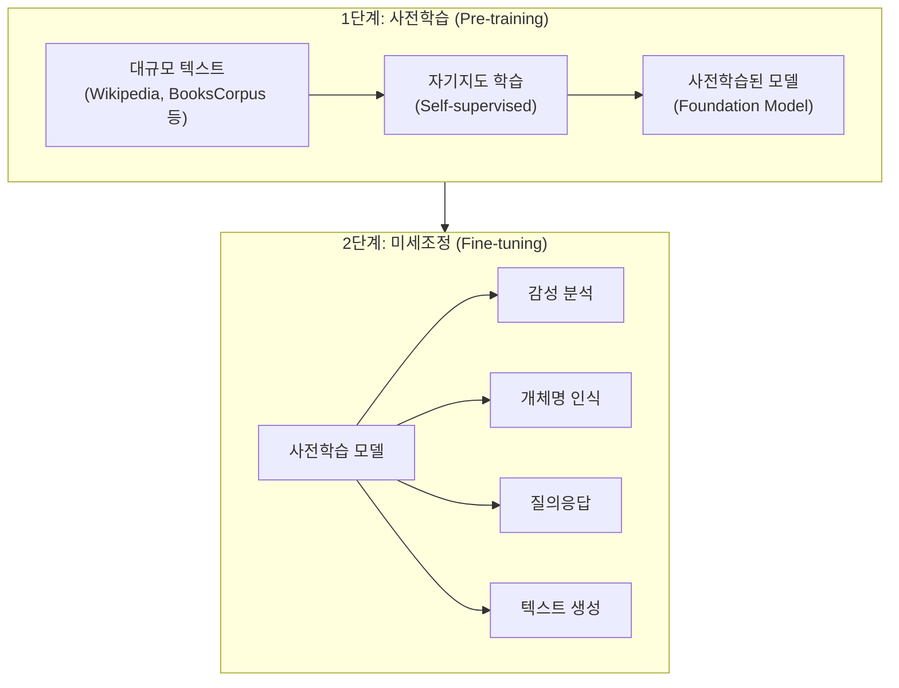
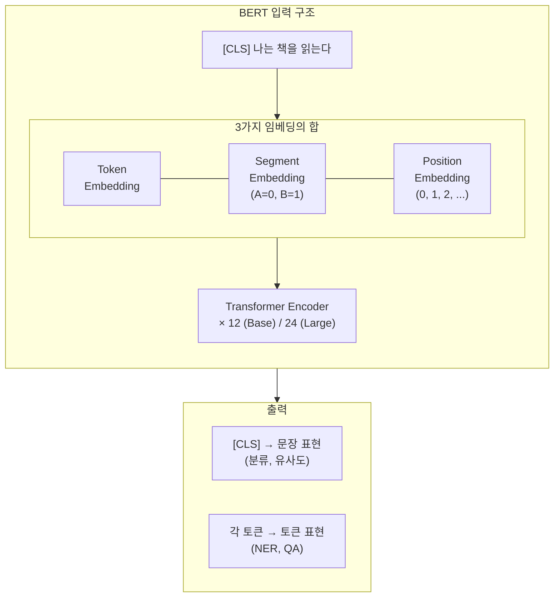
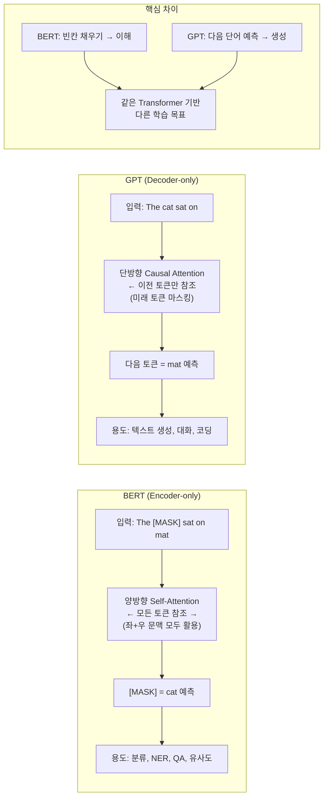
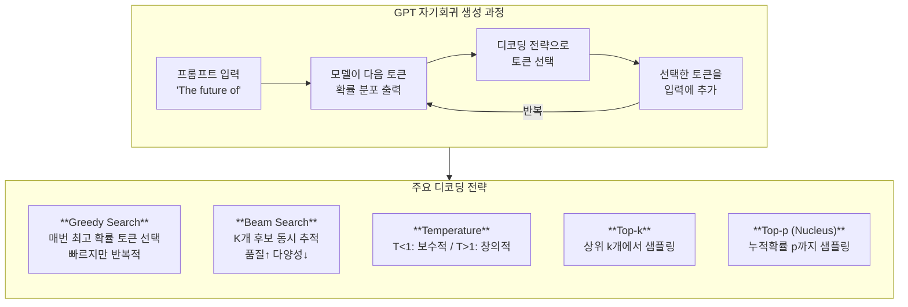
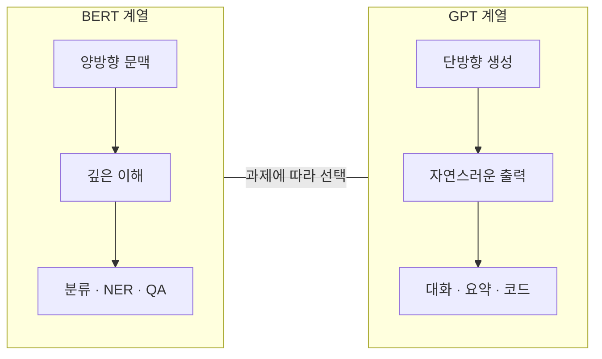

## 5주차 A회차: LLM 아키텍처 — BERT와 GPT

> **미션**: 수업이 끝나면 BERT와 GPT를 직접 돌려보고 차이를 체감한다

### 학습목표

이 회차를 마치면 다음을 수행할 수 있다:

1. 사전학습(Pre-training)과 미세조정(Fine-tuning) 패러다임을 설명하고 Transfer Learning의 원리를 이해한다
2. BERT의 양방향 구조와 MLM/NSP 학습 목표를 설명할 수 있다
3. GPT의 자기회귀 구조와 Causal Self-Attention의 원리를 이해한다
4. 다양한 텍스트 생성 전략(Greedy, Beam, Top-k, Top-p, Temperature)의 차이를 비교할 수 있다
5. Hugging Face Transformers의 Pipeline API를 사용하여 BERT/GPT를 활용할 수 있다

### 수업 타임라인

| 시간 | 내용 | Copilot 사용 |
|------|------|-------------|
| 00:00~00:05 | 오늘의 질문 + 빠른 진단(퀴즈 1문항) | 사용 안 함 |
| 00:05~00:55 | 이론 강의 (직관적 비유 → 개념 → 원리) | 사용 안 함 |
| 00:55~01:25 | 라이브 코딩 시연 (Pipeline → AutoModel 확장) | 교수 시연 시 선택 사용 |
| 01:25~01:28 | 핵심 정리 + B회차 과제 스펙 공개 | |
| 01:28~01:30 | Exit ticket (1문항) | |

---

### 오늘의 질문 + 빠른 진단

**오늘의 질문**: "이 문장의 [MASK]를 맞추려면 앞뒤 문맥을 모두 봐야 할까, 아니면 왼쪽만 봐도 될까? 어떤 경우 양쪽을 봐야 할까?"

**빠른 진단 (1문항)**:

다음 두 문장을 보시오:

1. "나는 은행에 가서 돈을 ___했다."
2. "도서관 앞의 ___에 사람들이 앉아 있다."

각 문장의 빈칸을 채우려면 어떤 방향의 문맥이 더 도움이 될까?

① 첫 번째는 왼쪽만, 두 번째도 왼쪽만
② 첫 번째는 양쪽, 두 번째는 오른쪽만
③ 둘 다 양쪽 문맥이 필수
④ 둘 다 왼쪽만으로 충분

**정답**: ③ 또는 상황에 따라 다름 — 이것이 BERT(양방향)와 GPT(왼쪽만)의 핵심 차이를 보여준다.

---

### 이론 강의

#### 5.1 사전학습 패러다임

**직관적 이해**: 사전학습은 **의대 본과(Pre-training) + 전문의 수련(Fine-tuning)**과 같다. 의대 본과에서는 해부학, 생리학, 약리학 등 의학의 기초를 폭넓게 배운다. 졸업 후 전문의 수련에서는 내과, 외과, 안과 등 특정 분야에 집중한다. 본과에서 쌓은 기초 지식이 탄탄하면 어떤 전공 수련도 빠르게 적응할 수 있다. 언어 모델도 마찬가지이다. 대규모 텍스트로 "언어의 기초"를 먼저 배운 뒤, 소규모 데이터로 특정 과제에 맞춰 조정한다.

##### Pre-training → Fine-tuning 전략

4장까지 학습한 Transformer 아키텍처는 강력하지만, 처음부터 특정 과제를 위해 훈련하려면 대규모 레이블 데이터가 필요하다. 그런데 레이블 없는 텍스트 데이터는 인터넷에 거의 무한히 존재한다. 이 관찰에서 **사전학습(Pre-training)**이라는 아이디어가 탄생했다.

사전학습 패러다임은 두 단계로 구성된다:

1. **사전학습(Pre-training)**: 레이블 없는 대규모 텍스트 데이터로 언어의 일반적 패턴을 학습한다. 이 단계에서 모델은 문법, 의미, 세계 지식 등을 스스로 터득한다. 이렇게 학습된 모델을 **파운데이션 모델(Foundation Model)**이라 한다.

2. **미세조정(Fine-tuning)**: 사전학습된 모델을 특정 과제(감성 분석, 번역, 요약 등)의 소규모 레이블 데이터로 추가 학습한다. 이미 "언어의 기초"를 알고 있으므로 적은 데이터로도 높은 성능을 달성한다.

이 접근법을 **전이 학습(Transfer Learning)**이라 한다. 하나의 도메인에서 학습한 지식을 다른 도메인에 전이하는 것이다. 컴퓨터 비전에서 ImageNet 사전학습이 표준이 된 것처럼, NLP에서도 사전학습이 사실상 표준(de facto standard)으로 자리잡았다.

**직관적 이해**: Transfer Learning은 **일반적인 운전면허 → 특정 직업 운전 기술**과 같다. 일반 운전면허로 차 조작을 배우고, 택시 운전사가 되려면 특정 도로를 배운다. 기초가 있으므로 특화 과정은 짧다.

> **그래서 무엇이 달라지는가?** 처음부터 특정 과제를 학습하려면 (1) 레이블 데이터를 많이 수집해야 하고 (2) 학습 시간이 오래 걸리며 (3) 소량의 데이터에 과적합되기 쉽다. 반면 사전학습을 사용하면 (1) 소량의 레이블만으로 (2) 빠르게 (3) 안정적으로 높은 성능을 달성할 수 있다. 예를 들어 감성분석 과제에서, 처음부터 학습하려면 수만 개의 레이블된 리뷰가 필요할 수 있지만, 사전학습 모델을 미세조정하면 수백 개의 레이블로도 충분하다.



**그림 5.1** Pre-training → Fine-tuning 패러다임

##### 세 가지 아키텍처 유형

4장에서 학습한 Transformer는 Encoder-Decoder 구조였다. 사전학습 시대에는 학습 목표에 따라 이 구조가 세 가지로 분화했다:

**표 5.1** Transformer 아키텍처 유형 비교

| 유형 | 구조 | 대표 모델 | 학습 목표 | 강점 |
|------|------|-----------|-----------|------|
| Encoder-only | Encoder만 사용 | BERT, RoBERTa | MLM (빈칸 채우기) | 이해(분류, NER, QA) |
| Decoder-only | Decoder만 사용 | GPT, Llama | 다음 토큰 예측 | 생성(텍스트, 코드, 대화) |
| Encoder-Decoder | 양쪽 모두 사용 | T5, BART | 입력→출력 변환 | 변환(번역, 요약) |

이 장에서는 Encoder-only의 대표인 **BERT**와 Decoder-only의 대표인 **GPT**를 깊이 있게 학습한다.

---

#### 5.2 BERT 아키텍처

**직관적 이해**: BERT는 **빈칸 채우기 달인**이다. "나는 ___에서 공부한다"라는 문장을 보면, 사람은 앞뒤 문맥("나는", "에서 공부한다")을 모두 보고 "도서관"이라고 추론한다. BERT도 마찬가지로 문장의 **양방향(왼쪽 + 오른쪽)** 문맥을 동시에 보고 빈칸을 채운다. 이것이 BERT의 핵심 아이디어이다. BERT를 음악 이어듣기로 비유하면, 한 곡 중간의 악기 소리를 맞추려면 앞뒤 악보를 모두 들어야 한다는 뜻이다.

##### BERT란?

BERT(Bidirectional Encoder Representations from Transformers)는 2018년 Google AI Language 팀이 발표한 사전학습 언어 모델이다(Devlin et al., 2019). 발표 당시 11개 NLP 벤치마크에서 동시에 최고 성능을 달성하며, NLP 분야에 "사전학습 혁명"을 일으켰다.

BERT의 핵심은 **양방향(Bidirectional) 문맥 이해**이다. 기존 언어 모델은 왼쪽에서 오른쪽으로만(GPT) 또는 양방향을 각각 따로(ELMo) 처리했지만, BERT는 4장에서 학습한 Transformer Encoder의 Self-Attention을 통해 모든 위치의 토큰이 다른 모든 위치를 동시에 참조한다.

##### BERT의 학습 목표

BERT는 두 가지 자기지도 학습(Self-supervised Learning) 목표로 사전학습된다:

**1. MLM (Masked Language Model) — 빈칸 채우기**

입력 토큰의 15%를 무작위로 선택하여 다음과 같이 변환한다:
- 80%는 `[MASK]` 토큰으로 대체
- 10%는 랜덤 토큰으로 대체
- 10%는 원래 토큰을 유지

모델은 변환된 위치의 원래 토큰을 예측한다. 이 전략은 모델이 `[MASK]`에만 의존하지 않고 모든 위치의 정보를 활용하도록 유도한다.

**직관적 이해**: MLM은 **책 읽다가 랜덤하게 단어를 가린 다음, 문맥으로 무엇인지 맞추기**와 같다. 앞뒤를 모두 봐야 맞힐 수 있으므로 양방향 문맥을 자연스럽게 학습한다.

**예시**:
```
원본: The cat sat on the mat
마스크: The [MASK] sat on the [MASK]
예측: cat, mat
```

이 MLM 학습 목표의 핵심은, 다음 토큰 예측(GPT 방식)과 다르게 **문맥의 모든 방향을 동시에 활용**한다는 것이다. 이렇게 하면 양방향 문맥을 모두 이해하는 모델을 만들 수 있다.

> **쉽게 말해서**: MLM은 "리딩 앱에서 문장의 단어를 하나 숨겼을 때 빈칸이 무엇일지 맞추는 문제"와 같다. 앞뒤 문맥을 모두 봐야 답을 맞힐 수 있다.

> **그래서 무엇이 달라지는가?** GPT의 다음 토큰 예측은 왼쪽 문맥에만 의존하므로, "나는 은행에서"까지 봤을 때 "돈" 또는 "대출" 중 뭐가 올지 정확히 맞추기 어렵다. BERT의 MLM은 "나는 ___ 에서 돈을"처럼 오른쪽 문맥까지 보므로 "은행"을 더 정확히 맞힐 수 있다. 특히 다의어(bank = 은행 vs 강둑)를 해소하는 데 양방향이 필수적이다.

**2. NSP (Next Sentence Prediction) — 다음 문장 예측**

두 문장 A, B를 입력받아 B가 A의 실제 다음 문장인지(IsNext) 아닌지(NotNext)를 이진 분류한다. 이를 통해 문장 간 관계를 학습한다.

**예시**:
```
[CLS] 나는 점심을 먹었다 [SEP] 식후에 커피를 마셨다 [SEP] → IsNext
[CLS] 나는 점심을 먹었다 [SEP] 금성은 태양에서 두 번째 행성이다 [SEP] → NotNext
```

후속 연구에서 NSP의 효과에 대한 논란이 있었으며, RoBERTa 등 일부 후속 모델은 NSP를 제거했다.

##### BERT의 입력 표현

BERT의 입력은 세 가지 임베딩의 합으로 구성된다:

1. **Token Embedding**: WordPiece 토큰의 의미를 표현한다. 단어를 더 작은 서브워드로 분해한다(예: "playing" → "play" + "##ing").
2. **Segment Embedding**: 문장 A(0)와 문장 B(1)를 구분한다. 두 문장 쌍을 입력할 때, 어느 문장에 속하는 토큰인지를 나타낸다.
3. **Position Embedding**: 4장에서 학습한 Positional Encoding과 동일한 역할로, 각 위치에 고유한 벡터를 할당한다. BERT는 Sinusoidal이 아닌 **학습 가능(Learned) 방식**을 사용한다.

**구체적 예시**: "나는 책을 읽는다"를 BERT에 입력할 경우:

```
입력 텍스트: [CLS] 나는 책을 읽는다
토큰화: [CLS] [나는] [책을] [읽는다]
Token Embedding: 각 토큰의 의미 벡터 (768차원)
Segment Embedding: [0, 0, 0, 0] (한 문장)
Position Embedding: [0, 1, 2, 3] (위치별 벡터)
합산: Token + Segment + Position
```



**그림 5.2** BERT 내부 구조

> **쉽게 말해서**: 각 토큰의 최종 표현은 "이 토큰이 무엇이고(Token) 어느 문장에 속하고(Segment) 문장의 어느 위치에 있는가(Position)"의 세 정보를 담는다.

##### WordPiece 토크나이저

BERT는 **WordPiece** 토크나이저를 사용한다. 어휘 크기는 30,522개이며, 자주 등장하는 단어는 통째로, 드문 단어는 서브워드로 분해한다:

```
playing        → ['playing']
tokenization   → ['token', '##ization']
transformer    → ['transform', '##er']
```

`##` 접두사는 해당 서브워드가 단어의 시작이 아님을 나타낸다. "tokenization"은 "token"과 "##ization" 두 조각으로 분해되는데, 이는 "-ization"이라는 접미사가 많은 단어에서 공유되기 때문이다.

##### BERT 모델 규격

**표 5.2** BERT 모델 구성 비교

| 구성 | BERT-Base | BERT-Large |
|------|-----------|------------|
| Transformer 층 수 | 12 | 24 |
| 은닉 차원(d) | 768 | 1024 |
| Attention 헤드 수 | 12 | 16 |
| 파라미터 수 | 110M | 340M |
| 사전학습 데이터 | BooksCorpus + English Wikipedia (약 33억 단어) |

**표 5.3** BERT 변형 모델 비교

| 모델 | 핵심 개선 | 파라미터 | 성능 | 특징 |
|------|-----------|----------|------|------|
| **RoBERTa** (2019) | NSP 제거, 더 많은 데이터/배치/학습 | 125M | BERT 대비 향상 | 더 강력한 사전학습 |
| **DistilBERT** (2019) | 지식 증류로 6층 압축 | 66M | BERT의 97% 성능 | 경량, 빠른 추론 |
| **ALBERT** (2020) | 파라미터 공유, Factorized Embedding | 12M | 경량이지만 성능 유지 | 극적인 파라미터 절약 |
| **DeBERTa** (2021) | Disentangled Attention | 134M | SuperGLUE 1위 | 주의 메커니즘 개선 |

---

#### 5.3 GPT 아키텍처

**직관적 이해**: GPT는 **소설 이어쓰기 달인**이다. "어느 날 왕자가 성을 떠나"까지 읽으면, 다음에 올 단어를 예측한다. "서쪽으로", "산 위로", "향했다"처럼 한 단어씩 이어 쓴다. BERT가 빈칸을 채우는 독해 시험의 달인이라면, GPT는 이야기를 만들어내는 창작의 달인이다. GPT를 보드게임으로 비유하면, 이전까지의 상황을 보고 다음 플레이어가 취할 행동을 예측하는 게임과 같다.

##### 자기회귀 언어 모델링

GPT(Generative Pre-trained Transformer)는 **자기회귀(Autoregressive)** 방식으로 텍스트를 생성한다. 이전에 생성한 토큰들을 입력으로 받아 다음 토큰의 확률 분포를 출력하고, 여기서 하나의 토큰을 선택한 뒤 다시 입력에 추가하는 과정을 반복한다.

**직관적 이해**: 자기회귀는 **도미노를 한 조각씩 놓는 것**과 같다. 이전 도미노(토큰)가 넘어져야 다음 도미노를 놓을 수 있다. 모든 이전 상태에 의존하므로 "자기 자신의 이전 상태에 회귀"한다는 의미이다.

수학적으로, 시퀀스 x = (x₁, x₂, ..., xₙ)에 대해 GPT는 다음 확률을 최대화하도록 학습된다:

P(x) = ∏ᵢ P(xᵢ | x₁, ..., xᵢ₋₁)

즉, 각 토큰의 확률은 **이전 토큰들에만** 조건부로 결정된다. 이것이 BERT와의 근본적 차이이다. BERT는 양방향(좌+우)을 모두 보지만, GPT는 왼쪽만 본다.

> **쉽게 말해서**: BERT는 문제를 풀기 전에 지문 전체를 읽고 푼다면, GPT는 지문을 앞에서부터 한 문장씩만 읽으며 "다음에 뭐 올까"를 계속 맞춘다.

> **그래서 무엇이 달라지는가?** BERT는 문맥을 충분히 보므로 다의어를 정확히 해소할 수 있지만, 미래 정보를 미리 본다는 문제가 있다. 실제 생성 상황에서는 미래 정보가 없으므로 미세조정 시 동작 방식이 달라진다. GPT는 왼쪽만 보므로 "나는 은행에서"까지만 보고 다음 단어를 맞춰야 한다. 하지만 실제 생성 상황과 일치하므로 더 자연스러운 텍스트를 만들어낼 수 있다.

##### Causal Self-Attention

GPT는 4장에서 학습한 Transformer **Decoder**만 사용한다. 핵심은 **Causal Self-Attention**(인과적 자기 어텐션)으로, 미래 토큰에 대한 Attention을 마스킹하여 각 위치가 자신과 이전 위치만 참조할 수 있게 한다.



**그림 5.3** BERT(양방향) vs GPT(단방향) 비교

##### GPT-2 모델 구조

GPT-2 Small의 구조를 정리하면 다음과 같다:

```
[모델 정보]
  모델명: gpt2 (GPT-2 Small)
  어휘 크기: 50,257
  총 파라미터 수: 124,439,808 (124.4M)

[모델 구성]
  층 수: 12
  은닉 차원: 768
  어텐션 헤드: 12
  컨텍스트 길이: 1024

[아키텍처 구조]
  Token Embedding:    (50257, 768)
  Position Embedding: (1024, 768)
  Decoder Blocks:     12개
  LM Head:            (50257, 768)
```

BERT-Base와 구성이 유사하지만(12층, 768차원, 12헤드), 어휘 크기가 50,257로 BERT의 30,522보다 크다. 이는 GPT-2가 **BPE(Byte Pair Encoding)** 토크나이저를 사용하기 때문이다.

**표 5.4** 주요 LLM 모델 크기 비교

| 모델 | 파라미터 | 학습 데이터 | 주요 특징 |
|------|---------|-----------|---------|
| BERT-Base | 110M | 13GB | 양방향, 분류/NER |
| GPT-2 Small | 124M | 40GB | 단방향, 생성 |
| GPT-2 Large | 774M | 40GB | 더 많은 파라미터 |
| GPT-3 Small | 125M | 300B 토큰 | Few-shot 가능 |
| GPT-3 Large | 13B | 300B 토큰 | 더 강력한 생성 |

> **그래서 무엇이 달라지는가?** BERT-Base와 GPT-2 Small의 파라미터 크기는 비슷(110M vs 124M)하지만, 학습 목표가 다르므로 강점이 다르다. BERT는 문장을 여러 번 읽고 양방향으로 특징을 추출하므로, 분류나 질의응답 같은 "이해" 과제에서 강하다. GPT는 다음 단어를 자동회귀로 생성하므로, 텍스트 생성이나 스토리텔링 같은 "창작" 과제에서 강하다. 같은 크기여도 목표가 다르면 능력이 완전히 다르다는 뜻이다.

##### GPT 시리즈 발전사

GPT는 4세대에 걸쳐 발전했으며, 각 세대마다 NLP의 패러다임을 바꾸었다:

**표 5.5** GPT 시리즈 발전사

| 모델 | 연도 | 파라미터 | 핵심 특징 |
|------|------|----------|-----------|
| GPT-1 | 2018 | 117M | Pre-train + Fine-tune 패러다임 제시 |
| GPT-2 | 2019 | 1.5B | Zero-shot 가능, 공개 거부 논란 |
| GPT-3 | 2020 | 175B | Few-shot, In-Context Learning |
| GPT-4 | 2023 | ~1.7T(추정) | 멀티모달, 향상된 추론 |

가장 큰 변화는 **학습 패러다임의 전환**이다:
- **GPT-1**: 사전학습 후 **미세조정(Fine-tuning)** 필수
- **GPT-2**: 미세조정 없이 **Zero-shot** 수행 가능
- **GPT-3**: 몇 개의 예시만으로 **Few-shot / In-Context Learning** 가능

##### 텍스트 생성 전략

GPT로 텍스트를 생성할 때, "다음 토큰의 확률 분포에서 어떻게 토큰을 선택할 것인가"가 **디코딩 전략(Decoding Strategy)**이다. 전략에 따라 생성 결과가 크게 달라진다.

**직관적 이해**: 디코딩은 **말할 다음 단어를 고르는 방식**과 같다. 신중한 사람(Greedy)은 가장 확실한 단어만 고른다. 창의적인 사람(Temperature)은 조금 위험한 단어도 고려한다. 상황에 맞게 전략을 선택해야 한다.



**그림 5.4** GPT 자기회귀 생성 과정과 디코딩 전략

**주요 전략 비교**:

- **Greedy Search**: 매번 확률이 가장 높은 토큰을 선택한다. 가장 빠르고 결정적(Deterministic)이지만, 같은 문장이 반복되는 경향이 있다.
  - 예: P(very) = 0.6, P(good) = 0.3, P(interesting) = 0.1 → "very" 선택

- **Beam Search**: K개의 가장 가능성 높은 토큰 경로를 동시에 추적한다. Greedy보다 품질은 높지만 다양성이 낮다.
  - K=3이면 상위 3개 경로를 모두 추적하여 가장 확률이 높은 전체 문장을 생성

- **Temperature**: 확률 분포의 "날카로움"을 조절한다. T < 1이면 분포가 뾰족해져 보수적이 되고, T > 1이면 평평해져 창의적이다.
  - T = 0.1 (매우 보수적): [0.95, 0.04, 0.01] → 거의 첫 번째만 선택
  - T = 1.0 (표준): [0.60, 0.30, 0.10] → 원래 분포 유지
  - T = 2.0 (매우 창의적): [0.25, 0.23, 0.22] → 거의 균등하게 선택

- **Top-k Sampling**: 확률이 높은 상위 k개 토큰 중에서만 랜덤 선택한다. 극단적 선택을 피하면서 다양성을 확보한다.
  - k=5이면 확률 상위 5개만 고려하여 그 중 하나를 랜덤 선택

- **Top-p (Nucleus) Sampling**: 누적 확률이 p가 될 때까지의 토큰 중에서만 선택한다. p=0.9면 "전체 확률의 90%를 차지하는 토큰들"에서만 선택한다.
  - 더 동적으로 후보 개수를 조절하므로 Top-k보다 유연함

> **쉽게 말해서**: 디코딩 전략은 "주사위를 던질 때, 가장 높은 눈이 나올 면만 고르는가(Greedy), 아니면 확률에 따라 랜덤하게 고르는가(Sampling)"의 차이와 같다.

**표 5.6** 생성 전략 비교 요약

| 전략 | 다양성 | 품질 | 속도 | 추천 용도 |
|------|--------|------|------|-----------|
| Greedy Search | 낮음 | 중간 | 빠름 | 결정적 태스크 (번역) |
| Beam Search | 낮음 | 높음 | 중간 | 번역, 요약 |
| Temperature | 조절 가능 | 조절 가능 | 빠름 | 창의성 조절 (에세이, 대화) |
| Top-k Sampling | 중간 | 중간 | 빠름 | 일반 생성 |
| Top-p (Nucleus) | 높음 | 높음 | 빠름 | 창의적 생성 (스토리) |

##### In-Context Learning (문맥 내 학습)

GPT-3에서 발견된 중요한 능력은 **In-Context Learning**이다. 미세조정 없이 프롬프트에 예시를 포함시키는 것만으로 새로운 과제를 수행할 수 있다:

**직관적 이해**: In-Context Learning은 **시험장에서 문제를 풀기 직전에 유사 문제의 풀이를 읽는 것**과 같다. 몇 개의 예시를 본 후, 새로운 문제를 비슷한 방식으로 풀 수 있다.

- **Zero-shot**: "Translate English to French: cheese →" (예시 없이 지시만)
- **One-shot**: 1개 예시 제공 후 과제 수행
- **Few-shot**: 2~5개 예시 제공 후 과제 수행

이 능력은 모델 규모가 커질수록 강해지는 **창발적 능력(Emergent Ability)**으로, GPT-3(175B)에서 본격적으로 나타났다.

> **그래서 무엇이 달라지는가?** GPT-1/2의 경우, 새로운 과제를 수행하려면 대량의 레이블 데이터로 미세조정(Fine-tuning)을 해야 했다. GPT-3는 미세조정 없이 프롬프트만으로도 과제를 수행할 수 있다. 예를 들어, 감정 분류를 원한다면 "긍정: 이 영화는 훌륭하다, 부정: 이 영화는 형편없다, 분류: 이 영화는 ___"처럼 2개 예시만 넣으면 자동으로 감정을 분류한다. 이는 "밑바닥부터 배우기"에서 "패턴 인식과 따라하기"로 패러다임이 완전히 바뀌었다는 뜻이다.

##### BERT vs GPT: 두 패러다임의 비교

5.2절과 5.3절에서 BERT와 GPT를 각각 학습했다. 이 두 모델은 같은 Transformer를 기반으로 하지만, 설계 철학이 정반대이다. 이를 한눈에 비교해 보자.

**직관적 이해**: BERT와 GPT의 관계는 **독해 시험의 달인 vs 작문 시험의 달인**과 같다. 독해의 달인(BERT)은 지문 전체를 읽고 질문에 정확히 답하지만, 새 글을 쓰지는 못한다. 작문의 달인(GPT)은 한 문장씩 이어 써서 긴 글을 만들지만, 특정 질문에 정확히 답하는 데는 덜 능숙하다. 최근 LLM 발전은 GPT 방식(Decoder-only)이 주도하고 있는데, 충분히 큰 모델은 생성뿐 아니라 이해 과제까지 잘 수행하기 때문이다.

**표 5.8** BERT vs GPT 핵심 비교

| 비교 항목 | BERT (Encoder-only) | GPT (Decoder-only) |
|-----------|--------------------|--------------------|
| **구조** | Transformer Encoder | Transformer Decoder |
| **문맥 방향** | 양방향 (Bidirectional) | 단방향 (Left-to-Right) |
| **학습 목표** | MLM (빈칸 채우기) + NSP | Next Token Prediction |
| **입출력 형태** | 입력 → 고정 표현(벡터) | 입력 → 이어지는 텍스트 |
| **강점** | 이해 과제 (분류, NER, QA) | 생성 과제 (텍스트, 코드, 대화) |
| **대표 활용** | 감성분석, 검색엔진, 유사도 | 챗봇, 코드 생성, 번역, 요약 |
| **스케일링 방향** | 340M (BERT-Large)에서 정체 | 175B (GPT-3) → 수조 규모까지 확대 |
| **현재 위상** | 특정 과제에서 여전히 강력 | LLM 시대의 주류 아키텍처 |

> **쉽게 말해서**: BERT는 "문장을 깊이 이해하는" 데 특화되어 있고, GPT는 "문장을 만들어내는" 데 특화되어 있다. 둘 중 하나가 무조건 우월한 것이 아니라, 과제에 따라 적절한 모델을 선택해야 한다. 감성분석이나 유사도 측정에는 BERT 계열이, 텍스트 생성이나 대화에는 GPT 계열이 더 적합하다.

실무에서의 선택 기준은 다음과 같다:

1. **분류/추출 과제** (감성분석, NER, QA): BERT 계열 모델이 효율적이다. 모델이 작아 추론 속도가 빠르고, 양방향 문맥이 정확한 이해를 돕는다.

2. **생성 과제** (챗봇, 요약, 번역): GPT 계열 모델이 자연스럽다. 한 토큰씩 순차 생성하는 구조가 자연어 생성에 적합하다.

3. **범용 과제** (다양한 작업을 하나의 모델로): 대형 GPT 계열이 유리하다. 충분히 큰 모델은 프롬프트만으로 분류, 추출, 생성을 모두 수행할 수 있다 (In-Context Learning).

> **그래서 무엇이 달라지는가?** 2018-2019년에는 BERT가 NLP 벤치마크를 석권하며 "이해" 중심의 패러다임이 주류였다. 하지만 GPT-3(2020) 이후 "생성" 중심으로 패러다임이 전환되었다. 이는 단순히 "이해 vs 생성"의 문제가 아니라, 충분히 큰 생성 모델이 이해 과제까지 프롬프트로 해결할 수 있다는 발견 때문이다. 이 전환이 오늘날 ChatGPT, Claude 같은 대화형 AI의 기반이 되었다.



**그림 5.5** BERT와 GPT의 강점 영역 비교

---

#### 5.4 Hugging Face Transformers 실전

**직관적 이해**: Hugging Face는 **앱스토어**와 같다. 우리가 앱스토어에서 원하는 앱을 검색하고 설치하듯, Hugging Face Model Hub에서 원하는 AI 모델을 검색하고 3줄의 코드로 바로 사용할 수 있다.

##### Pipeline API — 3줄로 AI 활용

Hugging Face의 `pipeline` API는 모델 로드, 토크나이즈, 추론, 후처리를 한 줄로 처리한다:

```python
from transformers import pipeline
classifier = pipeline("sentiment-analysis", device=0)
result = classifier("I love this movie!")
```

이 3줄의 코드가 하는 일:
1. 감성분석 모델을 자동으로 다운로드하고 로드
2. 입력 텍스트를 토크나이즈
3. GPU에서 추론 수행
4. 결과를 파싱하여 정리된 형태로 반환

Pipeline이 지원하는 주요 과제:

**표 5.7** Hugging Face Pipeline 지원 과제

| 과제 | Pipeline 이름 | 대표 모델 | 출력 예시 |
|------|--------------|-----------|---------|
| 감성 분석 | `sentiment-analysis` | distilbert-base-uncased-finetuned-sst-2-english | {'label': 'POSITIVE', 'score': 0.9998} |
| 개체명 인식 | `ner` | dbmdz/bert-large-cased-finetuned-conll03-english | [{'entity': 'B-PER', 'word': 'Obama'}, ...] |
| 질의응답 | `question-answering` | distilbert-base-cased-distilled-squad | {'answer': 'school', 'score': 0.95} |
| 빈칸 채우기 | `fill-mask` | bert-base-uncased | [{'sequence': 'the cat sat on the mat', 'score': 0.98}] |
| 텍스트 생성 | `text-generation` | gpt2 | [{'generated_text': '...생성된 텍스트...'}] |
| 요약 | `summarization` | sshleifer/distilbart-cnn-12-6 | [{'summary_text': '...요약...'}] |
| 번역 | `translation` | Helsinki-NLP/opus-mt-en-fr | [{'translation_text': 'fromage'}] |

> **그래서 무엇이 달라지는가?** 3줄의 Pipeline API만으로도 감성분석 모델을 실행할 수 있다. 만약 처음부터 직접 구현한다면 (1) 모델 아키텍처 설계 (2) 가중치 학습 (3) 전처리/후처리 등 수백 줄의 코드와 GPU 리소스가 필요하다. Pipeline API는 이 모든 복잡성을 감춘다.

##### AutoModel과 AutoTokenizer

Pipeline보다 세밀한 제어가 필요할 때는 `AutoModel`과 `AutoTokenizer`를 직접 사용한다:

```python
from transformers import AutoTokenizer, AutoModel
tokenizer = AutoTokenizer.from_pretrained("bert-base-uncased")
model = AutoModel.from_pretrained("bert-base-uncased")
```

`Auto` 클래스는 모델 이름에서 적절한 아키텍처를 자동으로 판별한다. 세 가지 주요 타입이 있다:

- **AutoModel**: 기본 인코더 출력 (마지막 은닉 상태)
- **AutoModelForSequenceClassification**: 분류 헤드가 포함된 모델
- **AutoModelForCausalLM**: 언어 모델 헤드가 포함된 모델 (GPT 계열)

> **그래서 무엇이 달라지는가?** Pipeline은 간단하지만 확장성이 낮다. 입력을 수정하거나 중간 표현을 추출할 수 없다. AutoModel을 사용하면 (1) 입력에 마스크 추가 (2) 중간 은닉 상태 추출 (3) 여러 배치 처리 (4) 메모리 효율 최적화 등이 가능하다. 즉, 3줄로 빠르게 프로토타입하고, 필요하면 AutoModel로 정교하게 제어할 수 있다.

##### Model Hub 탐색

Hugging Face Model Hub(https://huggingface.co/models)에는 수십만 개의 모델이 공개되어 있다. 모델 선택 시 고려할 기준:

1. **과제 유형**: 감성 분석, NER, 텍스트 생성 등 목표 과제에 맞는 모델 선택
2. **언어**: 영어 전용(bert-base-uncased) vs 다국어(bert-base-multilingual)
3. **모델 크기**: 추론 속도와 메모리 제약을 고려. 메모리가 부족하면 DistilBERT, ALBERT 등 경량 모델 선택
4. **다운로드 수/좋아요**: 커뮤니티 검증 지표로 신뢰도 판단
5. **라이선스**: 상업적 사용이 가능한지 확인. Apache 2.0, MIT는 자유롭고, 일부 모델은 연구용으로만 제한된다

> **쉽게 말해서**: Model Hub는 AI 모델의 "앱스토어"이다. 앱을 고를 때 별점, 다운로드 수, 호환성을 보듯, 모델도 과제 유형, 크기, 커뮤니티 검증 수준을 기준으로 선택한다.

---

### 라이브 코딩 시연

> **라이브 코딩 시연**: Pipeline API로 감성분석을 수행한 후, 단계적으로 AutoModel로 확장하는 과정을 보여준다. 두 방식의 차이와 각각의 장점을 비교 설명한다.

**시연 단계**:

#### [단계 1] Pipeline 방식 (3줄): 빠른 프로토타이핑

```python
from transformers import pipeline

classifier = pipeline("sentiment-analysis")
result = classifier("I love this movie!")
print(result)
```

**출력**:
```
[{'label': 'POSITIVE', 'score': 0.9998}]
```

**해석**: "I love this movie!"에 대해 POSITIVE(긍정)이라는 결과를 얻었으며, 신뢰도는 99.98%이다. 3줄의 코드로 사전학습된 감성분석 모델을 완전히 작동시켰다.

#### [단계 2] 여러 문장 처리

```python
texts = [
    "I love this movie!",
    "This movie is terrible.",
    "It's okay, not great."
]

results = classifier(texts)
for text, result in zip(texts, results):
    print(f"문장: {text}")
    print(f"결과: {result}")
```

**출력**:
```
문장: I love this movie!
결과: {'label': 'POSITIVE', 'score': 0.9998}

문장: This movie is terrible.
결과: {'label': 'NEGATIVE', 'score': 0.9991}

문장: It's okay, not great.
결과: {'label': 'NEGATIVE', 'score': 0.7451}
```

**해석**: 부정적인 단어("terrible")가 명확하면 높은 신뢰도로 분류하고, 중립적인 표현("okay, not great")는 상대적으로 낮은 신뢰도를 보인다.

#### [단계 3] AutoTokenizer + AutoModel 확장 (더 세밀한 제어)

```python
from transformers import AutoTokenizer, AutoModel

tokenizer = AutoTokenizer.from_pretrained("bert-base-uncased")
model = AutoModel.from_pretrained("bert-base-uncased")

text = "I love this movie!"
inputs = tokenizer(text, return_tensors="pt")

# 모델에 입력
outputs = model(**inputs)
last_hidden_state = outputs.last_hidden_state

print(f"입력 형태: {inputs['input_ids'].shape}")
print(f"출력 형태: {last_hidden_state.shape}")
```

**출력**:
```
입력 형태: torch.Size([1, 8])
출력 형태: torch.Size([1, 8, 768])
```

**해석**: 입력 문장이 8개 토큰으로 변환되었고, 각 토큰이 768차원의 벡터로 표현되었다. 이 표현들은 문맥을 반영한 BERT의 최종 임베딩이다.

#### [단계 4] 감성분석 전용 모델 (AutoModelForSequenceClassification)

```python
from transformers import AutoTokenizer, AutoModelForSequenceClassification
import torch

tokenizer = AutoTokenizer.from_pretrained("distilbert-base-uncased-finetuned-sst-2-english")
model = AutoModelForSequenceClassification.from_pretrained("distilbert-base-uncased-finetuned-sst-2-english")

text = "I love this movie!"
inputs = tokenizer(text, return_tensors="pt")

# 모델 추론
outputs = model(**inputs)
logits = outputs.logits
predicted_class = torch.argmax(logits, dim=-1)

print(f"로짓 (원점수): {logits}")
print(f"예측된 클래스: {predicted_class.item()} (0=NEGATIVE, 1=POSITIVE)")

# 신뢰도 계산
probabilities = torch.softmax(logits, dim=-1)
print(f"신뢰도: NEGATIVE={probabilities[0, 0]:.4f}, POSITIVE={probabilities[0, 1]:.4f}")
```

**출력**:
```
로짓 (원점수): tensor([[-4.1234,  4.5678]])
예측된 클래스: 1 (0=NEGATIVE, 1=POSITIVE)
신뢰도: NEGATIVE=0.0002, POSITIVE=0.9998
```

**핵심 인사이트**:
1. **Pipeline**: 사용자 친화적이지만 내부 동작을 숨김
2. **AutoModel**: 중간 표현(임베딩)을 활용할 수 있어 자유도 높음
3. **AutoModelForSequenceClassification**: 특정 과제에 최적화된 헤드가 포함됨
4. 같은 BERT 기반이지만 과제에 따라 다른 헤드를 사용하면 성능이 크게 달라짐

_전체 코드는 practice/chapter5/code/5-1-pipeline-to-automodel.py 참고_

이 과정은 "앱스토어에서 한 줄로 설치하기 → 앱 설정 커스터마이징 → 필요시 코드 수정"의 진행도와 같다.

> **쉽게 말해서**: 라이브 코딩 시연의 핵심 메시지는 "추상화 수준의 선택"이다. Pipeline은 최고 수준의 추상화로 3줄이면 충분하지만, 내부를 제어할 수 없다. AutoModel은 중간 수준의 추상화로, 토크나이저와 모델을 분리하여 임베딩 추출, 배치 처리, 커스텀 후처리가 가능하다. AutoModelForSequenceClassification은 과제 특화 헤드를 포함하여 로짓(logit)에 직접 접근할 수 있다. 실무에서는 프로토타입 단계에서 Pipeline으로 빠르게 검증하고, 프로덕션에서 AutoModel로 전환하는 패턴이 일반적이다.

**시연 중 강조할 포인트**:

1. **모델 다운로드 시간**: 첫 실행 시 모델을 다운로드하므로 시간이 소요된다. 두 번째 실행부터는 캐시된 모델을 사용하여 즉시 로드된다. 학생들에게 처음 실행이 느린 것은 정상임을 안내한다.

2. **GPU vs CPU 추론 속도**: `pipeline(device=0)`으로 GPU를 사용하면 배치 추론 시 CPU 대비 5~10배 이상 빠르다. 단일 문장이면 차이가 적지만, 대량 데이터 처리 시 GPU의 효과가 드러난다.

3. **로짓(logit)의 의미**: `AutoModelForSequenceClassification`의 출력인 로짓은 softmax 이전의 원점수(raw score)이다. 로짓이 양수면 해당 클래스 방향, 음수면 반대 방향을 가리킨다. softmax를 거치면 확률로 변환되어 직관적으로 해석 가능하다.

> **강의 팁**: 시연 중 학생들에게 "Pipeline만으로 충분한 상황은 언제이고, AutoModel이 필요한 상황은 언제일까?"를 질문하면 좋다. 프로젝트 규모와 요구사항에 따라 적절한 추상화 수준을 선택하는 것이 엔지니어링 판단의 핵심이다.

---

### 핵심 정리 + B회차 과제 스펙

**이 회차의 핵심 개념**:

1. **사전학습 패러다임**: 대규모 텍스트로 일반 언어 능력을 먼저 학습(Pre-training), 소규모 데이터로 특정 과제 능력 추가(Fine-tuning)
2. **BERT의 양방향 이해**: MLM으로 학습된 Encoder만으로도 왼쪽과 오른쪽 문맥을 동시에 활용 → 분류, NER, QA, 유사도에 강함
3. **GPT의 생성 능력**: Decoder만으로 왼쪽에서 오른쪽으로 한 단어씩 예측 → 텍스트 생성에 강함
4. **디코딩 전략의 중요성**: 같은 모델도 Greedy, Temperature, Top-k, Top-p로 결과가 크게 달라짐
5. **Hugging Face 활용**: Pipeline(간단함)부터 AutoModel(세밀한 제어)까지 단계적으로 사용 가능
6. **In-Context Learning**: GPT-3부터 미세조정 없이 프롬프트 예시만으로 새로운 과제 수행 가능

**B회차 과제 스펙**:

**과제명**: BERT 기반 개체명 인식(NER) + GPT-2 텍스트 생성기 통합 시스템

**요구사항**:
1. BERT NER 모델로 입력 텍스트에서 Person, Organization, Location 개체 추출
2. 추출된 개체명을 GPT-2 프롬프트에 포함시켜 관련 텍스트 생성
3. 디코딩 전략 3가지(Greedy, Top-p=0.9, Temperature=0.7) 비교
4. 결과 해석: 어느 전략이 가장 자연스러운가?

**체크포인트**:
- ① BERT NER로 개체 추출 및 시각화
- ② GPT-2 생성기 기본 작동 확인
- ③ 세 가지 전략으로 생성 결과 비교

---

### Exit ticket

**Exit ticket** (1문항, 2분):

다음 문장을 읽고 답하시오:

"The bank offers different loan ___."

이 빈칸을 맞추기 위해 BERT와 GPT가 각각 어떤 전략을 사용할까? 각각의 강점과 약점을 한 문장씩 설명하시오.

**예상 답변**:
- BERT: 왼쪽("The bank offers different loan")과 오른쪽(정보 없음) 문맥을 모두 봐서 "products"를 예측. 강점: 양방향 문맥 활용하여 정확함. 약점: 생성 능력은 약하고 실제 생성 상황과 불일치.
- GPT: 왼쪽("The bank offers different loan") 문맥만 보고 "products" 또는 "rates" 예측. 강점: 자연스러운 생성, 실제 상황과 일치. 약점: 오른쪽 문맥을 못 봐서 덜 정확할 수 있음.

---

## 참고문헌

1. Devlin, J., Chang, M.-W., Lee, K., & Toutanova, K. (2019). BERT: Pre-training of Deep Bidirectional Transformers for Language Understanding. *NAACL*. https://arxiv.org/abs/1810.04805

2. Radford, A., Wu, J., Child, R., Luan, D., Amodei, D., & Sutskever, I. (2019). Language Models are Unsupervised Multitask Learners. *OpenAI Blog*. https://openai.com/research/better-language-models

3. Brown, T., Mann, B., Ryder, N., Subbiah, M., et al. (2020). Language Models are Few-Shot Learners. *NeurIPS*. https://arxiv.org/abs/2005.14165

4. Liu, Y., Ott, M., Goyal, N., et al. (2019). RoBERTa: A Robustly Optimized BERT Pretraining Approach. *arXiv*. https://arxiv.org/abs/1907.11692

5. Sanh, V., Debut, L., Chaumond, J., & Wolf, T. (2019). DistilBERT, a distilled version of BERT: smaller, faster, cheaper and lighter. *arXiv*. https://arxiv.org/abs/1910.01108

6. Lan, Z., Chen, M., Goodman, S., Gimpel, K., Sharma, P., & Soricut, R. (2020). ALBERT: A Lite BERT for Self-supervised Learning of Language Representations. *ICLR*. https://arxiv.org/abs/1909.11942

7. He, P., Liu, X., Gao, J., & Chen, W. (2021). DeBERTa: Decoding-enhanced BERT with Disentangled Attention. *ICLR*. https://arxiv.org/abs/2006.03654

8. Holtzman, A., Buys, J., Du, L., Forbes, M., & Choi, Y. (2020). The Curious Case of Neural Text Degeneration. *ICLR*. https://arxiv.org/abs/1904.09751

9. Wolf, T., Debut, L., Sanh, V., et al. (2020). Transformers: State-of-the-art Natural Language Processing. *EMNLP*. https://arxiv.org/abs/1910.03771
