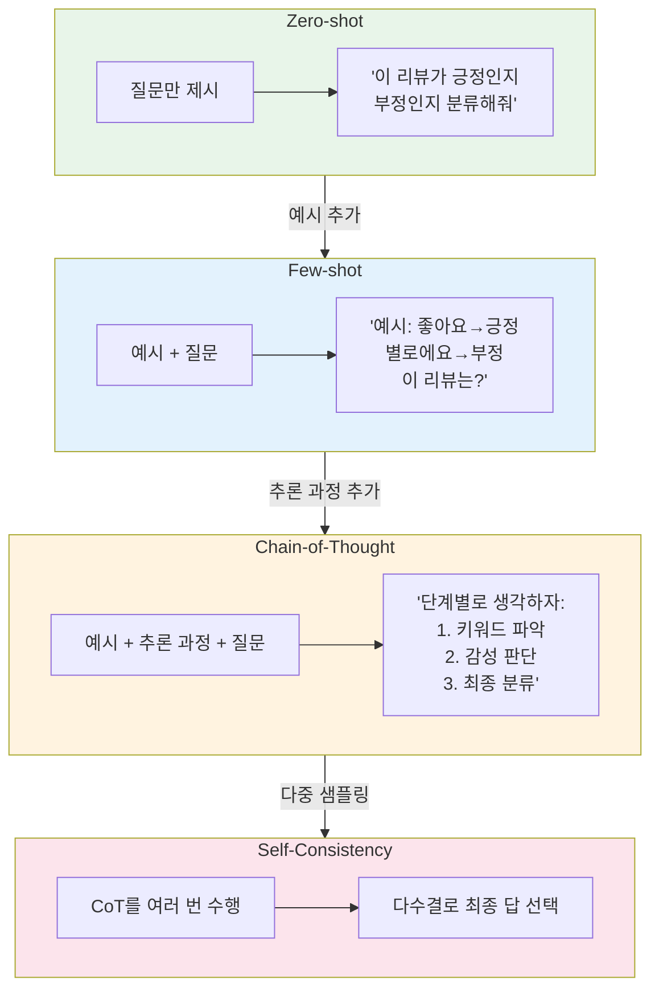
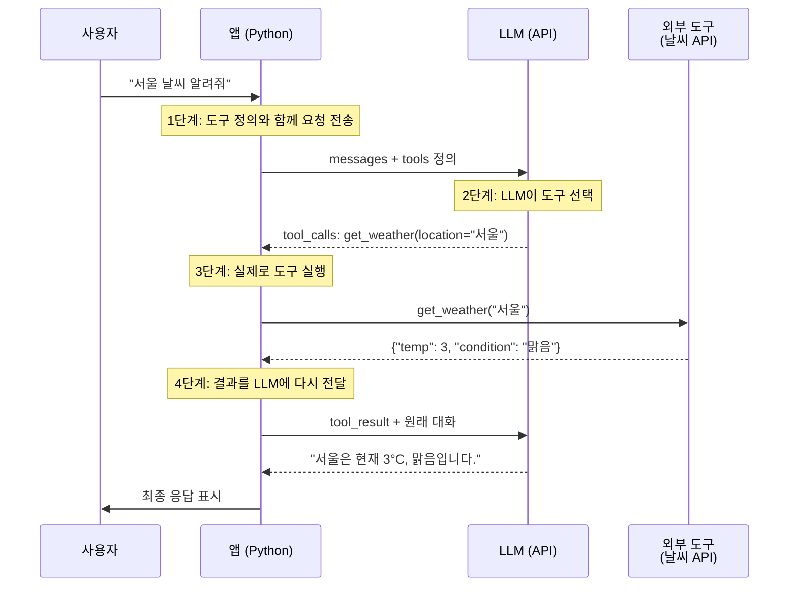

## 6주차 A회차: LLM API 활용과 프롬프트 엔지니어링

> **미션**: 수업이 끝나면 LLM API를 호출하고, 프롬프팅 기법의 효과를 실무에 적용할 수 있다

### 학습목표

이 회차를 마치면 다음을 수행할 수 있다:

1. OpenAI, Anthropic 등 주요 LLM API의 호출 구조와 토큰 과금 체계를 이해한다
2. Zero-shot, Few-shot, Chain-of-Thought 프롬프팅 기법의 성능 차이를 비교·적용할 수 있다
3. Pydantic을 사용하여 LLM 출력을 구조화하고 안정적으로 파싱할 수 있다
4. Function Calling으로 LLM에 외부 도구를 연동하는 아키텍처를 설계할 수 있다
5. LLM-as-a-Judge 패턴으로 모델 출력을 자동 평가할 수 있다

---

### 오늘의 질문 + 빠른 진단

**오늘의 질문**: "내 컴퓨터에 GPT-4나 Claude를 설치할 수 없는데, 이 모델들을 실제로 쓸 수 있을까? 어떻게?"

**빠른 진단 (1문항)**:

다음 중 맞는 설명은?

① 상용 LLM(GPT-4, Claude)을 쓰려면 반드시 내 컴퓨터에 설치해야 한다
② API를 호출하면 원격 서버에서 계산이 일어나고, 그 결과만 받으면 된다
③ API는 무료이지만 매우 느리다
④ 프롬프팅 기법은 모델 성능에 영향을 주지 않는다

정답: **②** — 이것이 오늘 배울 LLM API의 핵심이다.

---

### 이론 강의

#### 6.1 상용 LLM API 생태계

##### API의 필요성

5장까지 여러분은 BERT, GPT의 **구조와 원리**를 배웠다. 하지만 실제로 GPT-4를 학습하려면?

- **GPU**: A100 고급형 수백 대
- **시간**: 수개월의 학습
- **비용**: 수천만 달러

일반 개발자나 중소기업이 감당할 수 없는 규모다.

**직관적 이해**: 자동차 엔진을 직접 만들 필요는 없다. 택시를 타면 된다. LLM API는 "수천억 파라미터의 거대한 모델을 인터넷으로 빌려 쓰는 것"이다. 내 컴퓨터에 설치할 수 없지만, **API 한 줄로 이 모델들의 능력을 활용**할 수 있다. 택시 요금을 내듯 사용한 토큰만큼만 비용을 지불한다.

**API(Application Programming Interface)**는 제공자가 대규모 인프라에서 모델을 운영하고, 개발자는 HTTP 요청으로 **추론 결과만 받는 구조**이다. 학습, GPU 구매, 배포 모두 API 제공자의 책임이다.

> **쉽게 말해서**: 당신은 은행 창구에 가서 "10만 원 출금해주세요"라고 요청만 한다. 은행의 전자 시스템이 돈을 세고 출금을 처리하는 복잡한 일은 모르고, 결과만 받는 것과 같다.

##### 주요 API 제공자

현재 LLM API 생태계는 크게 네 축으로 구성된다.

**표 6.1** 주요 LLM API 제공자 (2026년 초)

| 제공자        | 대표 모델                        | 특징                                      | 컨텍스트 길이 |
| ------------- | -------------------------------- | ----------------------------------------- | :-----------: |
| **OpenAI**    | GPT-4o, o1, o3                   | 가장 넓은 생태계, Function Calling 선구자 |     128K      |
| **Anthropic** | Claude 4.5 Sonnet, Claude Opus 4 | 긴 컨텍스트, 안전성 강조                  |     200K      |
| **Google**    | Gemini 2.0 Flash/Pro             | 멀티모달 통합, 매우 긴 컨텍스트           |      1M       |
| **오픈소스**  | Llama 4, Mistral, DeepSeek       | 로컬 실행 가능, 커스터마이징 자유         |     다양      |

상용 API는 "**편의성 + 최고 성능**"을 제공하고, 오픈소스는 "**자유도 + 비용 통제**"를 제공한다. 프로젝트 특성에 따라 선택한다.

> **그래서 무엇이 달라지는가?** 1장에서 배운 BERT는 로컬에서 학습/추론하므로 속도와 개인정보 보호는 유리하지만, 크기가 크고 GPU가 필요하다. 반면 API는 최신 강력한 모델을 즉시 쓸 수 있고, 별도 설치가 없으며, 자동 업데이트 혜택을 받는다. 다만 인터넷 연결이 필수이고, 요청마다 비용이 발생하며, 개인정보가 API 제공자의 서버를 거친다.

##### API 호출의 기본 구조

모든 LLM API는 동일한 패턴을 따른다: **메시지 배열을 보내면 생성된 텍스트를 받는다.**

**표 6.2** OpenAI vs Anthropic SDK 구조 비교

| 항목             | OpenAI                                | Anthropic                   |
| ---------------- | ------------------------------------- | --------------------------- |
| 초기화           | `OpenAI()` (자동 env 참조)            | `anthropic.Anthropic()`     |
| System 메시지    | `messages` 배열 내 `role: "system"`   | 별도 `system=` 파라미터     |
| max_tokens       | 선택 (기본값 있음)                    | **필수**                    |
| 응답 텍스트 접근 | `response.choices[0].message.content` | `message.content[0].text`   |
| 토큰 사전 계산   | 클라이언트 (`tiktoken` 라이브러리)    | 서버 (`count_tokens()` API) |

OpenAI 호출 (Chat Completions API):

```python
from openai import OpenAI

client = OpenAI()
response = client.chat.completions.create(
    model="gpt-4o",
    messages=[
        {"role": "system", "content": "당신은 NLP 전문가입니다."},
        {"role": "user", "content": "자연어처리가 뭔가요?"},
    ],
)
print(response.choices[0].message.content)
```

Anthropic 호출 (Messages API):

```python
import anthropic

client = anthropic.Anthropic()
message = client.messages.create(
    model="claude-sonnet-4-5-20250514",
    max_tokens=1024,
    system="당신은 NLP 전문가입니다.",
    messages=[
        {"role": "user", "content": "자연어처리가 뭔가요?"},
    ],
)
print(message.content[0].text)
```

두 SDK는 구조가 유사하지만 세부 사항이 다르다. 초기화, 파라미터 전달 방식, 응답 접근법이 서로 다르므로 문서를 항상 참조해야 한다.

> **쉽게 말해서**: 두 API는 모두 "메시지를 보내고 답을 받는" 일을 한다. 하지만 메시지를 보내는 방식(system 메시지의 위치), 최대 출력 길이 지정 방식(필수 vs 선택), 답을 받는 방식(response 객체 접근법)이 다르다. 같은 일을 하는 두 택시 회사가 탑승 방식(입구 위치)을 다르게 한 것과 같다.

_전체 코드는 practice/chapter6/code/6-1-api기초.py 참고_

##### API Key 관리와 보안

API 호출에는 **API Key**가 필수이다. 이것은 비밀번호와 같으므로 절대 코드에 직접 쓰면 안 된다. 관례는 `.env` 파일에서 환경변수로 로드하는 것이다.

```python
# .env 파일 (절대 Git에 커밋하지 않음)
OPENAI_API_KEY=sk-xxxxxxxxxxxx
ANTHROPIC_API_KEY=sk-ant-xxxxxxxxxxxx
```

```python
# 코드에서 사용
from dotenv import load_dotenv
load_dotenv()  # .env 파일을 환경변수로 로드
# 이후 OpenAI(), Anthropic()은 자동으로 환경변수를 참조한다
```

`.gitignore`에 `.env`를 **반드시** 추가하자. API Key가 GitHub에 공개되면 누군가 대신 비용을 청구받을 수 있고, 수십만 원대의 요금이 발생할 수 있다.

**직관적 이해**: API Key는 집의 열쇠와 같다. 열쇠를 들고 거리에 나가면 누구나 집에 들어갈 수 있다. GitHub은 공개 창고이므로, 열쇠를 GitHub에 올리면 누구나 들어갈 수 있다는 뜻이다.

##### 토큰과 과금

LLM API는 **토큰(Token)** 단위로 과금한다. 토큰은 단어보다 작은 단위이다.

- **영어**: 단어 1개 ≈ 1~2 토큰 (예: "hello" = 1토큰, "world" = 1토큰)
- **한국어**: 음절 1개 ≈ 1~3 토큰 (예: "자연어처리" = 4~5 토큰)

같은 의미의 문장이라도 **한국어는 영어보다 약 1.5~2배 많은 토큰을 소비**한다. 한국어 서비스 비용 추정에 중요한 요소이다.

**표 6.3** 주요 모델 토큰 가격 (2026년 초)

| 모델              | 입력 가격/100만 토큰 | 출력 가격/100만 토큰 | 비고           |
| ----------------- | :------------------: | :------------------: | -------------- |
| GPT-4o            |        $2.50         |        $10.00        | 범용 최고 성능 |
| GPT-4o-mini       |        $0.15         |        $0.60         | 가성비 최강    |
| Claude Sonnet 4.5 |        $3.00         |        $15.00        | 200K 컨텍스트  |
| Claude Haiku 4.5  |        $1.00         |        $5.00         | 빠른 응답      |

**구체적 비용 계산 예시**:

```
입력 1,000 토큰 × $2.50/100만 = $0.0025
출력   500 토큰 × $10.00/100만 = $0.0050
합계: $0.0075 (약 10원)
```

**실제 서비스 비용 추정**:

```
일일 API 호출 수:    1,000회
평균 입력 토큰/회:   200토큰
평균 출력 토큰/회:   100토큰

일일 비용:
  입력: 1,000 × 200 × $2.50 / 1,000,000 = $0.50
  출력: 1,000 × 100 × $10.00 / 1,000,000 = $1.00
  소계: $1.50/일

월간 비용:
  $1.50 × 30 = $45 (약 60,000원)
```

하루에 API를 1,000회 호출하는 서비스라면 월 약 22만 원 수준이다. 실무에서는 **계층형 전략**을 쓴다: 간단한 작업에는 GPT-4o-mini, 복잡한 작업에만 GPT-4o를 투입한다. 이렇게 하면 비용을 크게 절감할 수 있다.

> **그래서 무엇이 달라지는가?** 토큰 과금은 사용량에 정확히 비례한다는 뜻이다. 로컬 모델 같은 경우 GPU를 구매하면 그 이후로는 돈이 안 들지만(초기 비용 높음), API는 사용할 때마다 돈이 든다(초기 비용 낮지만 누적 비용 가능). 따라서 "대량의 배치 처리"는 로컬이 유리하고, "소량의 실시간 처리"는 API가 유리하다.

---

#### 6.2 프롬프트 엔지니어링

##### 프롬프팅의 중요성

**직관적 이해**: 같은 직원에게 "이거 해줘"와 "당신은 10년 경력의 데이터 분석가입니다. 아래 데이터를 분석해서 3가지 핵심 인사이트를 표 형태로 정리해주세요"라고 요청하면 결과가 완전히 다르다. LLM도 마찬가지다. **프롬프트(지시문)를 어떻게 작성하느냐에 따라 출력의 질이 극적으로 달라진다.**

프롬프트 엔지니어링은 기술이라기보다 **LLM과 소통하는 예술**이다. 명확한 지시, 구체적인 예시, 역할 설정, 단계적 추론 유도 등의 기법들이 있고, 각 기법을 상황에 맞게 조합하면 놀라운 성능 향상을 볼 수 있다.

**표 6.4** 프롬프팅 기법의 효과 측정

| 기법      | 질문                                                 | 응답                        | 정확도 |
| --------- | ---------------------------------------------------- | --------------------------- | :----: |
| Zero-shot | "감성을 분류해줄 수 있어?"                           | "네, 할 수 있습니다."       |  낮음  |
| Few-shot  | "예: '좋아요'→긍정, '싫어요'→부정. 이것은?"          | "명확한 예시로 추론"        |  중간  |
| CoT       | "단계별로 생각해봅시다: 1. 키워드 파악 2. 감성 판단" | "단계적 추론으로 정확한 답" |  높음  |

##### System Prompt와 Role Prompting

**System Prompt**는 모델의 **인격과 행동 규칙**을 정의하는 메시지이다. 사용자 메시지(User Prompt)와 분리되어 **전체 대화에 일관되게 적용**된다.

```python
messages = [
    {"role": "system",
     "content": "당신은 10년 경력의 NLP 연구원입니다. "
                "학부생도 이해할 수 있게 설명합니다."},
    {"role": "user", "content": "Attention이 뭔가요?"},
]
```

**Role Prompting**은 System Prompt에 구체적인 역할을 부여하는 기법이다. "초등학교 선생님" vs "대학교 교수" vs "유튜버"에게 같은 질문을 하면 어휘 수준, 설명 방식, 톤이 완전히 달라진다.

> **그래서 무엇이 달라지는가?** System Prompt 없으면 모델이 일반적인 톤으로 답한다. Role을 지정하면 그 역할의 관점과 스타일을 따른다. 예를 들어 의료 상담이 필요하면 "당신은 인증받은 의료 상담사입니다"라고 하면, 의료 전문 용어와 책임 있는 표현을 사용한다.

**실제 비교 예시**:

```
질문: "당뇨병이 뭔가요?"

[Role 없음]
응답: "당뇨병은 혈당 수치가 높아지는 질환입니다..."

[Role: 초등학교 선생님]
응답: "우리 몸에는 에너지가 필요한데, 혈당이 높으면 이 에너지를 잘
사용하지 못하는 병이에요. 마치 자동차에 기름이 있지만 엔진이
그 기름을 쓰지 못하는 것처럼요."

[Role: 의학 박사]
응답: "당뇨병은 췌장의 베타 세포가 인슐린을 충분히 생산하지 못하거나,
신체 세포가 인슐린 신호에 저항하여 발생하는 대사 질환으로,
혈중 포도당 농도가 지속적으로 상승합니다..."
```

세 답변 모두 "맞는" 설명이지만, 대상 청중에 따라 복잡도와 사용 언어가 완전히 다르다.

##### 프롬프팅 기법의 진화

LLM 성능을 끌어올리는 기법들은 단순한 것에서 복잡한 것으로 발전해 왔다.



**그림 6.1** 프롬프팅 기법의 발전 계층

##### Zero-shot Prompting

가장 단순한 방식이다. 예시 없이 과제만 설명하고 답을 요청한다.

```
프롬프트: "다음 리뷰의 감성을 '긍정' 또는 '부정'으로 분류하세요.
          리뷰: 이 영화는 정말 감동적이었고, 배우들의 연기가 훌륭했습니다."
응답: "긍정"
```

명확한 과제(분류, 번역 등)에서는 Zero-shot만으로도 충분한 성능을 낸다. 하지만 모호한 기준이나 복잡한 포맷이 필요하면 한계가 있다.

> **쉽게 말해서**: 운전면허 시험에서 "신호등이 빨간색이면 뭐 해야 해?"라고 물으면 대부분 맞혔다. 규칙이 명확하기 때문이다. 하지만 "좋은 에세이를 써줄 수 있어?"라고 물으면 뭔가 애매해 보인다.

##### Few-shot Prompting

**예시(Demonstration)**를 제공하여 모델이 패턴을 학습하게 하는 기법이다. Brown et al.(2020)이 GPT-3 논문에서 소개한 이후 표준 기법이 되었다.

```
프롬프트: "다음 예시를 참고하여 리뷰의 감성을 분류하세요.

  예시 1: '음식이 맛있고 서비스가 좋았어요' → 긍정
  예시 2: '배달이 너무 늦고 음식이 식었어요' → 부정
  예시 3: '가격 대비 양이 적어서 실망했습니다' → 부정

  리뷰: '직원들이 친절하고 분위기가 아늑해서 다시 오고 싶어요'"
응답: "긍정"
```

**Few-shot의 핵심**: 예시가 분류 기준을 **암묵적으로 전달**한다. 예시 3개~5개를 제공하면 대부분의 분류 과제에서 Zero-shot 대비 일관된 성능 향상을 본다.

> **쉽게 말해서**: 학생에게 "좋은 에세이를 작성해줘"라고 하면 막힐 수 있지만, "다음은 좋은 에세이입니다: [예시]"라고 보여주면 그 스타일을 따라한다.

**실제 성능 비교**:

```
감성 분류 정확도 (테스트 100개 리뷰)
- Zero-shot:  75% (정답 75개)
- Few-shot (3예시): 87% (정답 87개)
- Few-shot (5예시): 91% (정답 91개)

예시를 추가할수록 정확도가 상승하지만,
예시 5개 이상은 큰 변화가 없다 (수확체감 법칙)
```

##### Chain-of-Thought (CoT) Prompting

Wei et al.(2022)이 발견한 획기적인 기법이다. **"단계별로 생각하세요"라는 한 줄을 추가하는 것만으로도 추론 능력이 극적으로 향상**된다.

**직관적 이해**: 수학 시험에서 "답만 쓰세요"보다 "풀이 과정을 보여주세요"라고 하면 정답률이 올라간다. CoT는 LLM에게 "풀이 과정을 보여줘"라고 요청하는 것과 같다.

**실제 실행 결과**:

```
문제: "영희는 사과 5개를 가지고 있었습니다. 철수에게 2개를 주고,
      마트에서 3개를 더 샀습니다. 그 중 절반을 이웃에게 나눠주었습니다.
      영희에게 남은 사과는 몇 개인가요?"

──── CoT 없이 (직접 답) ────
  답: 4개  ✗ (오답)

──── CoT 적용 ("단계별로 풀어봅시다." 한 줄 추가) ────
  1단계: 처음 사과 = 5개
  2단계: 철수에게 2개 줌 → 5 - 2 = 3개
  3단계: 마트에서 3개 샀음 → 3 + 3 = 6개
  4단계: 절반을 이웃에게 줌 → 6 ÷ 2 = 3개
  답: 3개  ✓ (정답)
```

**CoT가 효과적인 이유**:

1. **중간 추론 단계를 명시**: "한 번에 답을 내릴 때"의 점프 오류를 방지한다
2. **복잡한 문제를 분해**: 여러 개의 간단한 하위 문제로 나눈다
3. **논리적 연쇄 형성**: 각 단계의 결과가 다음 단계의 입력이 된다

> **그래서 무엇이 달라지는가?** Few-shot만으로는 모델이 결과에만 집중한다. CoT를 추가하면 모델이 "왜 이 답인가"를 생각하도록 유도하여, 더 정확한 추론을 한다.

**성능 지표 비교**:

```
산술 문제 정확도 (GSM8K 벤치마크)
- Zero-shot:  11%
- Few-shot:   35%
- Few-shot + CoT: 80%

추론 깊이가 깊은 문제일수록 CoT의 효과가 더 크다
```

##### Self-Consistency와 Tree of Thoughts

**Self-Consistency**(Wang et al., 2023)는 CoT를 여러 번 수행한 뒤 **다수결로 최종 답**을 선택하는 기법이다. 하나의 추론 경로가 틀릴 수 있지만, 여러 경로의 합의는 더 신뢰할 수 있다.

> **직관적 이해**: 중요한 결정을 할 때 한 명의 조언만 듣지 말고, 여러 전문가의 의견을 들은 후 다수결로 결정하는 것이 더 안전하다.

**Tree of Thoughts**(Yao et al., 2023)는 한 단계 더 나아가, 추론 과정을 **나무 구조로 확장**한다. 각 추론 단계에서 여러 가지 대안을 탐색하고, 가장 유망한 경로를 선택한다. 탐색, 퍼즐, 계획 수립 같은 복잡한 과제에서 효과적이다.

**표 6.5** 프롬프팅 기법 비교

| 기법             | 원리             | 적합한 과제            | 토큰 비용 |   성능    |
| ---------------- | ---------------- | ---------------------- | :-------: | :-------: |
| Zero-shot        | 과제만 설명      | 단순 분류, 번역        |   낮음    |   낮음    |
| Few-shot         | 예시 제공        | 포맷 제어, 일관성 필요 |   중간    |   중간    |
| CoT              | 단계적 추론 유도 | 수학, 논리, 복잡 추론  |   높음    |   높음    |
| Self-Consistency | CoT 다수결       | 정확도가 최우선인 과제 | 매우 높음 | 매우 높음 |
| Tree of Thoughts | 나무형 탐색      | 탐색, 퍼즐, 계획       | 매우 높음 | 매우 높음 |

_전체 코드는 practice/chapter6/code/6-2-프롬프팅.py 참고_

---

#### 6.3 Structured Output과 Function Calling

##### Structured Output: 자유로운 글쓰기를 양식으로

**직관적 이해**: LLM의 기본 출력은 **에세이**와 같다. 자유롭게 쓰되 형식이 일정하지 않다. 하지만 프로그램에서 LLM 결과를 처리하려면 **양식(Form)**처럼 정해진 형식이 필수다. 신청 양식을 제출할 때 자유 형식이 아닌 각 항목을 정확히 채우는 이유와 같다.

왜 필요한가? LLM을 **프로그램의 부품**으로 쓸 때 자유 텍스트는 파싱 오류를 만든다. "가끔 형식이 깨지는" 현상이 발생한다. Structured Output은 이 문제를 **근본적으로 해결**한다.

OpenAI와 Anthropic 모두 **Pydantic** 모델을 직접 전달하여 출력 스키마를 강제하는 기능을 지원한다.

```python
from pydantic import BaseModel, Field

class NewsExtraction(BaseModel):
    """뉴스 기사에서 추출할 정보"""
    company: str = Field(description="기업명")
    period: str = Field(description="실적 기간 (예: 2024년 3분기)")
    revenue: str = Field(description="매출액")
    growth_rate: str = Field(description="성장률 (% 포함)")
```

이 Pydantic 모델을 API에 전달하면, LLM이 **반드시 이 구조에 맞는 JSON을 생성**한다:

```python
completion = client.beta.chat.completions.parse(
    model="gpt-4o",
    messages=[{"role": "user", "content": news_text}],
    response_format=NewsExtraction,
)
result = completion.choices[0].message.parsed  # NewsExtraction 객체
print(result.company)  # 자동 완성 가능
print(result.revenue)  # 타입 안전성 보장
```

> **그래서 무엇이 달라지는가?** Structured Output 없으면 LLM이 자유로운 문장을 생성하고, 이를 손으로 파싱해야 한다. 가끔 형식이 깨져 프로그램이 크래시한다. Structured Output 있으면 항상 유효한 JSON이 반환되고, 즉시 프로그램에서 쓸 수 있다. Pydantic의 **자동 검증** 기능은 타입 오류를 조기에 감지한다.

**실제 동작 예시**:

```
입력 텍스트:
"삼성전자는 2024년 3분기에 매출 70조 원을 기록했으며,
전년 동기 대비 15% 성장했다."

Structured Output (자동 생성):
{
  "company": "삼성전자",
  "period": "2024년 3분기",
  "revenue": "70조 원",
  "growth_rate": "15%"
}

Python에서 접근:
result.company  # "삼성전자" (str, 자동완성 가능)
result.growth_rate  # "15%" (str)

데이터베이스에 저장:
db.insert(result.dict())  # 자동 직렬화
```

##### Function Calling: LLM에 팔다리를 달아주다

**직관적 이해**: LLM은 "두뇌"는 뛰어나지만 "팔다리"가 없다. "오늘 서울 날씨는?"이라고 물으면:

- ❌ "모르겠습니다"
- ❌ 학습 데이터의 날씨를 지어낸다 (할루시네이션)

**Function Calling**은 LLM에게 **팔다리(외부 도구)를 달아주는 기술**이다. 날씨 API, 검색 엔진, 데이터베이스 등을 "도구"로 정의하면, LLM이 필요할 때 이 도구를 호출하여 **실시간 정보**를 가져온다.

**Function Calling 4단계 흐름**:



**그림 6.2** Function Calling 4단계 흐름

각 단계를 살펴보자:

**1단계**: 사용자 메시지와 함께 사용 가능한 **도구 목록을 JSON으로 정의**하여 전송한다.

```python
tools = [{
    "type": "function",
    "function": {
        "name": "get_weather",
        "description": "지정된 도시의 현재 날씨를 조회합니다",
        "parameters": {
            "type": "object",
            "properties": {
                "location": {
                    "type": "string",
                    "description": "도시명 (예: 서울, 부산)"
                },
                "unit": {
                    "type": "string",
                    "enum": ["celsius", "fahrenheit"],
                    "description": "온도 단위"
                },
            },
            "required": ["location"],
        },
    },
}]

# API 호출
response = client.chat.completions.create(
    model="gpt-4o",
    messages=[{"role": "user", "content": "서울 날씨는?"}],
    tools=tools,
    tool_choice="auto",  # LLM이 자동으로 도구 선택
)
```

**2단계**: LLM이 사용자 요청을 분석하고, **"이 함수를 이 인자로 호출해달라"는 요청**을 반환한다. LLM은 함수를 직접 실행하지 않는다.

```python
# LLM의 응답
tool_calls = response.choices[0].message.tool_calls
for tool_call in tool_calls:
    print(f"함수명: {tool_call.function.name}")
    print(f"인자: {tool_call.function.arguments}")
    # 출력:
    # 함수명: get_weather
    # 인자: {"location": "서울", "unit": "celsius"}
```

**3단계**: 애플리케이션이 로컬에서 해당 함수를 **실제로 실행**한다.

```python
import json

def get_weather(location: str, unit: str = "celsius") -> dict:
    """실제 도구 구현 (날씨 API 호출)"""
    # 실제로는 OpenWeatherMap 등의 API를 호출
    weather_data = {
        "서울": {"celsius": 3, "fahrenheit": 37},
        "부산": {"celsius": 8, "fahrenheit": 46},
    }
    if location in weather_data:
        return {
            "location": location,
            "temperature": weather_data[location][unit],
            "condition": "맑음"
        }
    return {"error": f"{location}의 날씨를 찾을 수 없습니다"}

# 3단계 실행: tool_call에서 인자 추출하고 함수 호출
tool_call = response.choices[0].message.tool_calls[0]
tool_input = json.loads(tool_call.function.arguments)
result = get_weather(**tool_input)
print(result)
# 출력: {'location': '서울', 'temperature': 3, 'condition': '맑음'}
```

**4단계**: 실행 결과를 LLM에게 다시 전달하면, LLM이 자연어로 **최종 응답을 생성**한다.

```python
# 4단계: 결과를 메시지에 추가
messages = [
    {"role": "user", "content": "서울 날씨는?"},
    response.choices[0].message,  # LLM의 tool_calls 메시지
    {
        "role": "tool",
        "tool_call_id": tool_call.id,
        "content": json.dumps(result),  # 함수 실행 결과
    }
]

# 최종 응답 생성
final_response = client.chat.completions.create(
    model="gpt-4o",
    messages=messages,
)
print(final_response.choices[0].message.content)
# 출력: "서울은 현재 3°C이며 맑습니다."
```

> **쉽게 말해서**: 당신(LLM)이 요리를 지시하면, 요리사(함수)가 그대로 만든다. 당신은 "달걀을 깨줘"라고 말하면, 요리사가 실제로 깬다. 당신이 직접 깨는 게 아니다.

> **그래서 무엇이 달라지는가?** Function Calling 없으면 사용자가 "서울 날씨"라고 물어도 LLM이 학습 데이터 기반의 (오래되고 부정확한) 답변을 한다. Function Calling 있으면 LLM이 실시간 날씨 API를 호출하여 최신 정보를 제공한다. 이것이 AI Agent의 기초가 되는 기술이다.

> **라이브 코딩 시연**: Function Calling 날씨 조회 예제를 라이브로 시연한다. 도구를 정의하고, LLM이 도구를 선택하며, 결과를 받아 자연어로 응답하는 전 과정을 보여준다. 학생들이 "LLM은 함수를 직접 실행하지 않고, 호출 요청만 한다"는 핵심을 이해하도록 강조한다.

Function Calling이 중요한 이유는 이것이 **AI Agent의 기초**이기 때문이다. 12주차에서 배울 AI Agent는 Function Calling을 확장하여 여러 도구를 자율적으로 조합하는 시스템이다.

_전체 코드는 practice/chapter6/code/6-3-function-calling.py 참고_

---

#### 6.4 LLM 평가 기초

##### 자동 평가 지표

LLM 출력은 어떻게 평가할까? 전통적인 분류 문제라면 정확도로 충분하지만, 자유 형식 텍스트 생성에는 **다양한 평가 지표**가 필요하다.

**Perplexity(혼란도)**는 언어 모델이 다음 토큰을 얼마나 잘 예측하는지 측정한다. Perplexity가 낮을수록 모델이 텍스트를 잘 예측한다는 의미이다. PPL=1이면 완벽한 예측, PPL=50이면 매 토큰마다 50개 중 고르는 수준의 불확실성이다. 다만, API 기반 모델에서는 확률값이 제공되지 않아 직접 계산이 어렵다.

**BLEU(Bilingual Evaluation Understudy)**는 기계 번역의 표준 지표로, 생성된 텍스트와 정답 텍스트의 **n-gram 일치도**를 측정한다. 0~1 범위이며 높을수록 좋다. **정밀도(Precision)** 기반이므로 "정답에 있는 단어를 얼마나 생성했는가"를 본다.

**ROUGE(Recall-Oriented Understudy for Gisting Evaluation)**는 텍스트 요약의 표준 지표이다. BLEU와 달리 **재현율(Recall)** 기반으로, "정답의 내용이 생성 결과에 얼마나 포함되었는가"를 측정한다.

**표 6.6** 자동 평가 지표 비교

| 지표       | 측정 방식     | 범위 |  최적값  | 적용 분야   |
| ---------- | ------------- | ---- | :------: | ----------- |
| Perplexity | 예측 불확실성 | 1~∞  | 낮을수록 | 언어 모델링 |
| BLEU       | n-gram 정밀도 | 0~1  | 높을수록 | 기계 번역   |
| ROUGE      | n-gram 재현율 | 0~1  | 높을수록 | 텍스트 요약 |

##### LLM-as-a-Judge 패턴

자동 지표만으로는 **유창성, 유용성, 안전성** 같은 질적 측면을 평가하기 어렵다. 사람이 평가하면 정확하지만, 비용이 크고 느리다. 이 간극을 메우는 것이 **LLM-as-a-Judge** 패턴이다.

**직관적 이해**: 학생의 에세이를 다른 교수에게 채점을 맡기는 것과 같다. GPT-4o에게 "이 텍스트를 정확도, 완전성, 명료성 기준으로 10점 만점에 채점하고 근거를 설명해달라"고 요청한다.

```python
# LLM-as-a-Judge 구현
evaluation_prompt = """
당신은 NLP 전문가입니다. 다음 텍스트를 평가하세요.

평가 대상:
{text}

평가 기준:
1. 정확도 (사실과 일치하는가?)
2. 완전성 (필요한 모든 정보가 포함되었는가?)
3. 명료성 (이해하기 쉬운가?)

각 항목을 10점 만점에 채점하고, 각각 1~2문장의 근거를 제시하세요.

응답 형식:
정확도: N/10
이유: [근거]

완전성: N/10
이유: [근거]

명료성: N/10
이유: [근거]

종합점수: N/10
"""

response = client.chat.completions.create(
    model="gpt-4o",
    messages=[{"role": "user", "content": evaluation_prompt}],
)
print(response.choices[0].message.content)
```

**실제 평가 결과**:

```
평가 대상: "Python은 1991년에 귀도 반 로섬이 만든 프로그래밍 언어입니다.
           인터프리터 방식으로 동작하며, 간결한 문법 덕분에 초보자에게 적합합니다."

LLM-as-a-Judge 결과:
  정확도:   9/10
  이유: 사실 관계가 정확합니다. 다만 "1991년" 대신 "1989년 공개, 1991년 첫 배포"로
        더 정확할 수 있습니다.

  완전성:   7/10
  이유: 기본 정보는 있지만, Python의 주요 특징(동적 타이핑, 풍부한 라이브러리,
        높은 생산성)을 추가하면 더 완성도 높은 설명이 될 것입니다.

  명료성:   9/10
  이유: 문장이 명확하고 이해하기 쉽습니다. 전문 용어도 최소화되어 초보자도 이해할 수 있습니다.

  종합점수: 8.3/10
```

**LLM-as-a-Judge의 장점**: **평가 기준을 자연어로 정의**할 수 있다. "초등학생 눈높이에 맞는가?", "기술적으로 정확한가?" 같은 맞춤형 기준을 프롬프트에 포함하면 된다.

다만 주의할 점도 있다:

1. **자기 편향(Self-bias)**: 같은 모델의 출력에 높은 점수를 주는 경향
2. **위치 편향(Position bias)**: 여러 답변 중 첫 번째에 높은 점수를 주는 경향
3. **장문 편향(Verbosity bias)**: 더 긴 답변에 높은 점수를 주는 경향

이러한 편향을 완화하기 위해 **평가 대상의 순서를 섞거나**, **서로 다른 모델(GPT-4o, Claude)을 교차 평가자로 사용**한다.

##### 할루시네이션(Hallucination) 탐지

LLM의 가장 위험한 문제 중 하나가 **할루시네이션**이다. 모델이 **사실이 아닌 정보를 그럴듯하게 생성**하는 현상이다.

- 존재하지 않는 논문을 인용
- 실제와 다른 통계를 제시
- 없는 사람의 명언 만들기

**할루시네이션 탐지 방법**:

1. **교차 검증**: 같은 질문을 다른 모델에게 물어 답변을 비교한다
2. **근거 요청**: CoT 패턴으로 답변의 근거를 명시하게 하면, 근거가 부실하면 할루시네이션을 의심할 수 있다
3. **RAG 연동**: 11주차에서 배울 RAG 시스템으로 외부 지식을 참조하게 하면 할루시네이션을 크게 줄일 수 있다

> **그래서 무엇이 달라지는가?** 할루시네이션 탐지 없이 LLM을 신뢰하면 거짓 정보가 전파될 수 있다. 하지만 위의 세 기법을 조합하면 할루시네이션을 상당히 줄일 수 있다.

---

### 라이브 코딩 시연

> **라이브 코딩 시연**: OpenAI API로 감성 분석을 구현하고, Function Calling으로 외부 도구를 연동한다. Zero-shot vs Few-shot vs CoT의 성능 차이를 실시간으로 비교한다.

**시연 목표**:

- API 호출의 기본 구조 이해
- 프롬프팅 기법별 성능 비교
- Function Calling의 4단계 흐름 실제 경험
- Structured Output으로 안정적인 데이터 추출

**[단계 1] 기본 API 호출 설정**

```python
from openai import OpenAI
from dotenv import load_dotenv

load_dotenv()
client = OpenAI()

# 테스트 데이터
reviews = [
    "이 식당은 정말 최고예요! 음식도 맛있고 분위기도 좋습니다.",
    "서빙이 너무 늦어서 별로 좋지 않았습니다.",
    "가격이 좀 비싼 편이지만, 맛은 나쁘지 않네요.",
]

print("=== 프롬프팅 기법별 감성 분석 비교 ===\n")
```

**[단계 2] Zero-shot 프롬프팅**

```python
print("1️⃣ Zero-shot 프롬프팅\n")

for i, review in enumerate(reviews, 1):
    response = client.chat.completions.create(
        model="gpt-4o",
        messages=[
            {
                "role": "user",
                "content": f"다음 리뷰의 감성을 '긍정', '중립', '부정' 중 하나로 분류하세요.\n\n리뷰: {review}"
            }
        ],
        temperature=0,  # 결정론적 출력
    )
    print(f"리뷰 {i}: {response.choices[0].message.content}")
    print(f"입력 토큰: {response.usage.prompt_tokens}")
    print(f"출력 토큰: {response.usage.completion_tokens}\n")
```

출력 예시:

```
리뷰 1: 긍정
입력 토큰: 35
출력 토큰: 2

리뷰 2: 부정
입력 토큰: 35
출력 토큰: 2

리뷰 3: 중립
입력 토큰: 36
출력 토큰: 2
```

**[단계 3] Few-shot + CoT 프롬프팅**

```python
print("\n2️⃣ Few-shot + CoT 프롬프팅\n")

few_shot_cot_prompt = """다음 예시를 참고하여 리뷰의 감성을 단계별로 분석하세요.

예시 1:
리뷰: "음식이 맛있고 서비스가 친절했어요"
분석:
  1. 긍정적 단어: "맛있고", "친절했어요"
  2. 부정적 단어: 없음
  3. 결론: 긍정

예시 2:
리뷰: "음식은 맛있지만 가격이 너무 비쌌어요"
분석:
  1. 긍정적 단어: "맛있지만"
  2. 부정적 단어: "너무 비쌌어요"
  3. 결론: 중립 (긍정과 부정이 섞여있음)

이제 다음 리뷰를 같은 방식으로 분석하세요:
리뷰: {review}
분석:"""

for i, review in enumerate(reviews, 1):
    response = client.chat.completions.create(
        model="gpt-4o",
        messages=[
            {
                "role": "user",
                "content": few_shot_cot_prompt.format(review=review)
            }
        ],
        temperature=0,
    )
    print(f"리뷰 {i}:\n{response.choices[0].message.content}")
    print(f"입력 토큰: {response.usage.prompt_tokens}")
    print(f"출력 토큰: {response.usage.completion_tokens}\n")
```

**[단계 4] 토큰 사용량과 비용 비교**

```python
print("\n💰 토큰 사용량 및 비용 분석\n")

# Zero-shot 통계
zero_shot_input_total = 35 * 3 + 1  # 대략
zero_shot_output_total = 2 * 3

# Few-shot + CoT 통계
cot_input_total = 200 * 3  # 대략 (프롬프트가 훨씬 길다)
cot_output_total = 50 * 3  # CoT는 더 긴 출력

print(f"Zero-shot 대비 Few-shot + CoT의 토큰 증가율:")
print(f"  입력: {cot_input_total / zero_shot_input_total:.1f}배")
print(f"  총 토큰: {(cot_input_total + cot_output_total) / (zero_shot_input_total + zero_shot_output_total):.1f}배")

gpt4o_input_price = 2.50 / 1_000_000  # $ per token
gpt4o_output_price = 10.00 / 1_000_000

zero_shot_cost = (zero_shot_input_total * gpt4o_input_price +
                  zero_shot_output_total * gpt4o_output_price) * 1200  # 원화
cot_cost = (cot_input_total * gpt4o_input_price +
            cot_output_total * gpt4o_output_price) * 1200

print(f"\n비용 추정 (GPT-4o 기준):")
print(f"  Zero-shot: {zero_shot_cost:.2f}원")
print(f"  Few-shot + CoT: {cot_cost:.2f}원")
print(f"  비율: {cot_cost / zero_shot_cost:.2f}배")
```

---

### 핵심 정리 + B회차 과제 스펙

#### 이 회차의 핵심 내용

- **LLM API**는 거대 모델을 인터넷으로 빌려 쓰는 서비스이다. GPU 없이 API 한 줄로 GPT-4o, Claude 등을 활용할 수 있으며, 토큰 단위로 과금된다.

- **프롬프트 엔지니어링**은 LLM에게 "일 잘 시키는 기술"이다. Zero-shot → Few-shot → CoT → Self-Consistency로 발전하며, 각 기법은 더 많은 토큰을 소비하지만 더 높은 성능을 낸다.

- **System Prompt와 Role Prompting**으로 모델의 인격과 전문성을 설정하면 출력 품질이 크게 향상된다. 역할을 명확히 하면 대상 청중에 맞는 수준과 스타일의 답변이 나온다.

- **Structured Output(Pydantic)**은 LLM 출력을 강제로 특정 형식(JSON)으로 변환하여, 프로그래밍에서 안정적으로 활용할 수 있게 한다. 파싱 오류 없이 즉시 데이터베이스에 저장할 수 있다.

- **Function Calling**은 LLM에 외부 도구(API, DB, 검색)를 연동하는 기술이다. LLM은 도구를 직접 실행하지 않고 **호출 요청만 반환**한다. 이것이 AI Agent의 기초이다.

- **LLM 평가**는 자동 지표(BLEU, ROUGE), LLM-as-a-Judge, 사람 평가를 종합한다. 할루시네이션은 교차 검증, CoT, RAG로 완화할 수 있다.

#### B회차 과제 스펙

**B회차 (90분) — 실습 + 토론**: 도메인 특화 텍스트 분석 시스템 구축

**과제 목표**:

- OpenAI/Anthropic API를 호출하여 실제 텍스트를 분석한다
- Few-shot + CoT로 도메인 특화 분류를 구현한다
- Pydantic으로 구조화된 정보 추출을 한다
- LLM-as-a-Judge로 결과를 자동 평가한다

**과제 구성** (3단계, 30~40분 완결):

- **체크포인트 1 (10분)**: 여러 프롬프팅 기법(Zero-shot, Few-shot, CoT) 성능 비교
- **체크포인트 2 (15분)**: Pydantic으로 구조화된 정보 추출
- **체크포인트 3 (10분)**: LLM-as-a-Judge로 자동 평가 및 결과 분석

**제출 형식**:

- 완성된 코드 파일 (`practice/chapter6/code/6-4-실습.py`)
- 성능 비교 리포트 (프롬프팅 기법별 정확도, 토큰 사용량)
- 평가 결과 분석 (각 기법의 장단점, 실무 적용 방안)

**Copilot 활용 가이드**:

- 기본: "OpenAI API로 감성 분석을 해줄 수 있어?"
- 심화: "이 감성 분석에 Few-shot 예시를 추가하고, CoT를 써서 정확도를 올려볼까?"
- 검증: "이 결과를 LLM-as-a-Judge로 평가하는 코드를 만들어줄 수 있어?"

---

### Exit ticket

**문제 (1문항)**:

다음 상황에서 가장 적합한 프롬프팅 기법은?

"당신의 회사는 의료 보험 청구 데이터를 분석해야 합니다. 매우 정확한 분류가 필요하고, 모델이 '왜 이렇게 분류했는가'를 설명할 수 있어야 합니다."

① Zero-shot Prompting
② Few-shot Prompting
③ Chain-of-Thought (CoT) + 의료 도메인 예시
④ Self-Consistency (CoT 다중 샘플링)

정답: **④** (또는 **③**)

**설명**: 의료 데이터는 정확성이 최우선이므로 CoT로 추론 과정을 명시할 필요가 있다. 추가로 Self-Consistency로 여러 추론 경로를 비교하면 신뢰성이 더욱 높아진다. Few-shot에는 의료 전문 용어와 판단 기준을 담은 도메인 예시를 포함해야 한다. 비용이 높지만, 의료 분야에서는 "빠름"보다 "정확함"이 중요하다.

---

## 더 알아보기

이 장의 내용을 더 깊이 학습하려면 다음 자료를 참고하라:

- Lilian Weng. (2023). Prompt Engineering. _Lil'Log_. https://lilianweng.github.io/posts/2023-03-15-prompt-engineering/
- OpenAI. API Documentation. https://platform.openai.com/docs
- Anthropic. API Documentation. https://docs.anthropic.com/
- Sahoo, P., et al. (2024). A Systematic Survey of Prompt Engineering in Large Language Models. _arXiv_. https://arxiv.org/abs/2402.07927

---

## 다음 장 예고

6주차는 LLM API와 프롬프팅의 기초를 다룬다. 7주차는 **중간고사**이며, 8주차부터 본격적인 실무 기술을 다룬다. 8주차에서는 대량의 텍스트에서 **숨겨진 주제(토픽)**를 자동으로 발견하는 **토픽 모델링**을 학습한다. LDA부터 BERTopic까지, 비지도 학습으로 텍스트를 분석하는 기법을 익힌다.

---

## 참고문헌

Brown, T. B., et al. (2020). Language Models are Few-Shot Learners. _Advances in Neural Information Processing Systems 33_. https://arxiv.org/abs/2005.14165

Kojima, T., et al. (2022). Large Language Models are Zero-Shot Reasoners. _Advances in Neural Information Processing Systems 35_. https://arxiv.org/abs/2205.11916

Wei, J., et al. (2022). Chain-of-Thought Prompting Elicits Reasoning in Large Language Models. _Advances in Neural Information Processing Systems 35_. https://arxiv.org/abs/2201.11903

Wang, X., et al. (2023). Self-Consistency Improves Chain of Thought Reasoning in Language Models. _International Conference on Learning Representations_. https://arxiv.org/abs/2203.11171

Yao, S., et al. (2023). Tree of Thoughts: Deliberate Problem Solving with Large Language Models. _Advances in Neural Information Processing Systems 36_. https://arxiv.org/abs/2305.10601

Sahoo, P., et al. (2024). A Systematic Survey of Prompt Engineering in Large Language Models: Techniques and Applications. https://arxiv.org/abs/2402.07927
