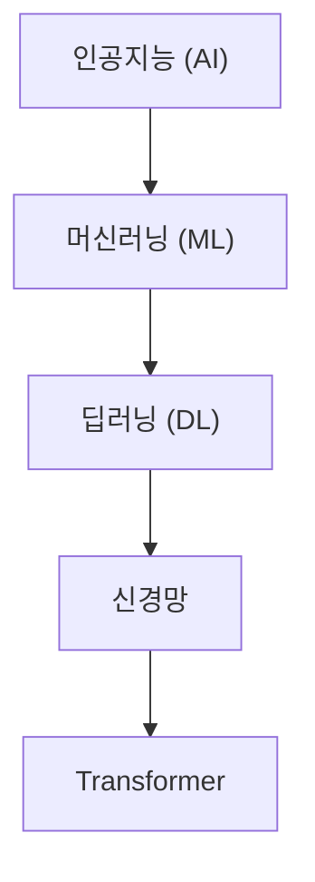

## 7주차 A회차: 중간고사 대비 — 1~6주차 핵심 총정리

> **미션**: 수업이 끝나면 1~6주차의 핵심 개념을 복습하고, 예상 문제를 풀어보며 시험 준비를 완료한다

### 학습목표

이 회차를 마치면 다음을 수행할 수 있다:

1. 신경망, PyTorch, RNN의 기본 원리를 한 문장으로 설명할 수 있다
2. Attention 메커니즘과 Transformer의 혁신을 비교 설명할 수 있다
3. BERT와 GPT의 핵심 차이(양방향 vs 자기회귀)를 실제 예시로 구분할 수 있다
4. 예상 객관식 문제 10개를 풀고 해설을 이해할 수 있다
5. PyTorch 핵심 패턴과 수식을 실전 문제로 적용할 수 있다

### 수업 타임라인

| 시간 | 내용 | Copilot 사용 |
|------|------|-------------|
| 00:00~00:05 | 시험 범위 안내 + 진단 1문항 | 사용 안 함 |
| 00:05~00:40 | 1~3주차 핵심 복습 (신경망, PyTorch, RNN→Attention) | 사용 안 함 |
| 00:40~01:10 | 4~6주차 핵심 복습 (Transformer, BERT/GPT, API) | 사용 안 함 |
| 01:10~01:25 | 예상 문제 풀이 + Q&A | |
| 01:25~01:30 | 시험 안내 + 다음 주 예고 | |

---

## 시험 범위 안내

**범위**: 1주차 ~ 6주차 (중간고사 이전 전체 내용)
**형식**: 객관식 60개 (2점 × 60)
**시간**: 90분
**출제 경향**: 
- 개념 이해 (60%)
- 수식/계산 (20%)
- 코드 패턴 (20%)

**중점 영역**:
1. Attention의 수학적 원리 (Query-Key-Value, Scaled Dot-Product)
2. Transformer와 RNN의 구조적 차이
3. BERT vs GPT의 학습 목표 및 구조 차이
4. PyTorch의 nn.Module, forward, backward 패턴
5. 실무 개념 (Transfer Learning, API 호출, 프롬프팅)

---

## 오늘의 진단 문항

**1문항. 다음 중 Attention의 핵심을 가장 잘 설명한 것은?**

A) RNN과 달리 모든 위치가 병렬로 동시에 계산된다
B) 각 위치가 입력의 다른 부분에 "집중"하는 가중치를 학습한다
C) LSTM의 셀 상태와 같은 역할을 하는 메커니즘이다
D) 입력 순서를 무시하고 순수 의미 정보만 추출한다

**정답**: B (또는 A도 부분적으로 맞음 — Attention은 병렬 처리와 선택적 집중이 결합된 개념)

---

# 1주차 핵심 복습: 기초 개념과 PyTorch 환경

## 1.1 AI, 머신러닝, 딥러닝의 관계

**한 문장 정리**:
- **AI** = 인간처럼 지능적으로 행동하는 시스템 (가장 큰 개념)
- **머신러닝** = 데이터로부터 규칙을 자동 학습하는 방식 (AI의 부분집합)
- **딥러닝** = 신경망(여러 층의 뉴런)으로 복잡한 패턴을 학습 (머신러닝의 부분집합)



**그림 7.1** AI 분야의 포함 관계

## 1.2 신경망의 기본 구조

### 뉴런과 다층 퍼셉트론 (MLP)

**직관적 이해**: 뉴런은 "판단 기계"다. 여러 입력(x₁, x₂, ...)에 가중치(w₁, w₂, ...)를 곱한 후 더하고, 활성화 함수를 통과시켜 0 또는 1의 신호를 출력한다.

**수식**:
y = σ(w₁·x₁ + w₂·x₂ + ... + wₙ·xₙ + b)

여기서 σ는 활성화 함수 (ReLU, Sigmoid, Tanh 등).

**다층 퍼셉트론 (MLP)**:
- 입력층 → 은닉층(1개 이상) → 출력층
- 각 층의 뉴런들이 다음 층의 모든 뉴런과 연결 (완전 연결)
- 층이 많을수록 더 복잡한 패턴 학습 가능

### 활성화 함수의 역할

| 함수 | 수식 | 용도 | 특징 |
|------|------|------|------|
| **ReLU** | max(0, x) | 은닉층 | 계산 빠름, 기울기 소실 완화 |
| **Sigmoid** | 1/(1+e^-x) | 이진 분류 | 0~1로 정규화, 확률 해석 |
| **Tanh** | (e^x - e^-x)/(e^x + e^-x) | 은닉층 | -1~1로 정규화 |
| **Softmax** | e^xᵢ / Σe^xⱼ | 다중 분류 | 확률 분포 생성 |

## 1.3 학습의 원리: 손실함수와 역전파

### 손실함수 (Loss Function)

모델의 예측이 얼마나 틀렸는지를 측정하는 함수:

**이진 분류**: Cross-Entropy Loss (CE Loss)
CE = -[y·log(ŷ) + (1-y)·log(1-ŷ)]

- y: 실제값 (0 또는 1)
- ŷ: 모델 예측 확률

**다중 분류**: Categorical Cross-Entropy
CE = -Σ yᵢ·log(ŷᵢ)

**회귀**: Mean Squared Error (MSE)
MSE = (1/n) Σ(y - ŷ)²

### 역전파 (Backpropagation)

**직관적 이해**: 시험을 봤는데 틀린 문제가 있다. 틀린 이유를 찾아 다음에 이런 실수를 하지 않으려면 어떤 부분을 공부해야 할까? 역전파는 이 과정을 자동화한 것이다. 손실(틀림)에서 시작하여 거꾸로 역행하면서, 각 가중치가 손실에 얼마나 영향을 미쳤는지 계산한다.

**수식**: 연쇄 법칙 (Chain Rule) 적용
∂L/∂w = (∂L/∂ŷ) · (∂ŷ/∂z) · (∂z/∂w)

## 1.4 PyTorch 핵심 패턴

### 신경망 정의: nn.Module 상속

```python
import torch
import torch.nn as nn

class SimpleNN(nn.Module):
    def __init__(self, input_size, hidden_size, output_size):
        super(SimpleNN, self).__init__()
        # 가중치와 편향을 포함한 계층 정의
        self.fc1 = nn.Linear(input_size, hidden_size)
        self.relu = nn.ReLU()
        self.fc2 = nn.Linear(hidden_size, output_size)
        
    def forward(self, x):
        # 순전파: 입력 → 은닉층 → 활성화 → 출력층
        x = self.fc1(x)
        x = self.relu(x)
        x = self.fc2(x)
        return x
```

**핵심 원리**:
1. `__init__`: 모든 계층과 파라미터 정의
2. `forward`: 입력이 어떻게 흘러가는지 정의
3. PyTorch가 자동으로 역전파(`backward`) 계산

### 훈련 루프

```python
model = SimpleNN(input_size=10, hidden_size=50, output_size=2)
device = torch.device("cuda" if torch.cuda.is_available() else "cpu")
model = model.to(device)

# 손실함수와 옵티마이저 정의
loss_fn = nn.CrossEntropyLoss()
optimizer = torch.optim.Adam(model.parameters(), lr=0.001)

# 훈련 루프
for epoch in range(num_epochs):
    for X, y in train_loader:
        X, y = X.to(device), y.to(device)
        
        # 순전파
        logits = model(X)
        loss = loss_fn(logits, y)
        
        # 역전파 및 최적화
        optimizer.zero_grad()  # 이전 기울기 초기화
        loss.backward()        # 역전파: 기울기 계산
        optimizer.step()       # 가중치 업데이트
```

**각 단계의 의미**:
- `optimizer.zero_grad()`: 기울기 누적 제거 (매 루프마다 필수)
- `loss.backward()`: 역전파로 모든 가중치의 기울기(∂L/∂w) 계산
- `optimizer.step()`: 기울기 방향으로 가중치 업데이트 (w ← w - lr·∂L/∂w)

---

# 2~3주차 핵심 복습: 임베딩과 순차 모델

## 2.1 단어 임베딩 (Word Embedding)

### 원-핫 인코딩 vs 임베딩

| 방식 | 차원 | 의미 반영 | 문제점 |
|------|------|----------|--------|
| **원-핫** | 어휘 크기 (30K) | X | 고차원, 의미 관계 부재 |
| **임베딩** | 작음 (300) | O | 밀집 벡터, 의미 포함 |

**분포 가설**: "비슷한 문맥에 나타나는 단어는 비슷한 의미를 갖는다"

### Word2Vec의 두 가지 학습 방식

| 방식 | 목표 | 특징 |
|------|------|------|
| **CBOW** | 주변 단어 → 중심 단어 | 빈도 높은 단어에 유리, 빠름 |
| **Skip-gram** | 중심 단어 → 주변 단어 | 희귀 단어에 유리, 품질 높음 |

## 2.2 순환신경망 (RNN)

### RNN의 기본 구조

**순환 연결이 없는 MLP**:
h = MLP(x) — 입력과 무관하게 독립적 처리

**순환 연결 있는 RNN**:
hₜ = tanh(Wₓₕ·xₜ + Wₕₕ·hₜ₋₁ + b) — 이전 은닉 상태 hₜ₋₁을 활용

**핵심**: 같은 가중치 Wₓₕ, Wₕₕ를 모든 시점에서 공유 → 임의 길이의 시퀀스 처리 가능

### RNN의 문제: 장기 의존성

**기울기 소실 (Vanishing Gradient)**: 기울기가 반복 곱셈으로 인해 지수적으로 감소
⟹ 먼 과거 정보가 현재에 영향을 주지 못함

**예**: "나는 프랑스에서 10년간 살면서 ... (많은 단어) ... 그래서 나는 ___를 잘한다"
⟹ 처음의 "프랑스에서"를 100+ 스텝 뒤에도 기억해야 하는데, 기울기가 0에 수렴

## 2.3 LSTM과 GRU

### LSTM의 핵심 개선: 셀 상태 (Cell State)

```
이전 셀 상태 Cₜ₋₁ → [게이트들] → 새 셀 상태 Cₜ
```

**세 가지 게이트**:
1. **Forget Gate**: fₜ = σ(Wf·[hₜ₋₁, xₜ] + bf) — 어떤 정보를 잊을지
2. **Input Gate**: iₜ = σ(Wᵢ·[hₜ₋₁, xₜ] + bᵢ) — 어떤 신정보를 기억할지
3. **Output Gate**: oₜ = σ(Wo·[hₜ₋₁, xₜ] + bo) — 어떤 정보를 출력할지

**셀 상태 업데이트**:
Cₜ = fₜ ⊙ Cₜ₋₁ + iₜ ⊙ C̃ₜ

**직관적 이해**: 셀 상태는 컨베이어 벨트, 게이트는 검문소. 정보가 덧셈(+)을 통해 누적되므로 기울기 소실 문제 완화.

### GRU vs LSTM

| 비교 | LSTM | GRU |
|------|------|-----|
| 게이트 수 | 3 | 2 |
| 파라미터 | 많음 | 적음 |
| 학습 속도 | 느림 | 빠름 |
| 대규모 데이터 | 유리 | 유사 |

**선택 기준**: 데이터 큰 경우 LSTM, 작은 경우 GRU

---

# 3주차 핵심 복습: Attention과 Transformer의 출현

## 3.1 Attention 메커니즘 (Self-Attention)

### 핵심 아이디어

"문장의 각 단어가 다른 모든 단어와의 관계 정도를 학습한다"

**직관적 이해**: "나는 은행에서 돈을 찾았다"를 읽을 때, "은행"의 의미를 정확히 파악하려면 "돈을", "찾았다" 같은 문맥을 본다. Attention은 "은행"이 문장의 다른 단어들에 얼마나 주목할지를 자동으로 가중치로 계산한다.

### Scaled Dot-Product Attention

**수식**:
Attention(Q, K, V) = softmax(Q·Kᵀ / √dₖ) · V

**각 성분의 역할**:
- **Q (Query)**: "무엇에 주목할까?" — 각 단어가 던지는 질문
- **K (Key)**: "이 정보와 관련 있을까?" — 각 단어가 제공하는 정보의 특징
- **V (Value)**: 실제 정보 — 선택된 정보의 내용
- **√dₖ 스케일링**: 차원이 크면 Q·Kᵀ의 값이 커져 softmax가 매우 한쪽으로 치우침을 방지

### 구체적 계산 예시

입력: "나 는 학교 에" (5개 단어, d=4 차원)

```
시간 t=0 ("나")의 Attention:
Q₀ = [0.1, -0.2, 0.3, 0.0]
K = [[0.1, -0.2, 0.3, 0.0],      # "나"
     [0.2, 0.1, -0.1, 0.0],      # "는"
     [0.0, 0.5, 0.1, 0.2],       # "학교"
     [-0.1, 0.0, 0.2, 0.1]]      # "에"

Q₀·K^T = [0.14, 0.04, 0.24, -0.07]

스케일링 (√4 = 2로 나눔):
[0.07, 0.02, 0.12, -0.035]

Softmax:
[0.27, 0.24, 0.31, 0.18]

따라서 "나"는 "학교"에 가장 높은 가중치(0.31)를 두고, V에 곱함
```

## 3.2 Multi-Head Attention

**아이디어**: 하나의 Attention은 하나의 관점에서만 본다. 여러 관점이 필요하면?

**구조**:
1. 입력을 H개(보통 8개)의 작은 부분으로 분할 (d_model=512 → 각 head는 512/8=64)
2. 각 head에서 독립적으로 Attention 계산
3. 모든 head의 결과를 연결 (concatenate)
4. 선형변환으로 원래 차원 복구

**직관적 이해**: "나는 은행에서 돈을 찾았다"를 여러 명의 다른 관점을 가진 분석가가 동시에 본다.
- 분석가 1: 문법적 역할에 주목 (주어, 목적어 등)
- 분석가 2: 의미 관계에 주목 (동사와 그 대상)
- 분석가 3: 시간 순서에 주목
- 분석가 4: 주제와의 연관도에 주목

각 분석가가 다른 각도로 봐야 더 정교한 이해가 가능.

---

# 4주차 핵심 복습: Transformer 구조

## 4.1 Transformer의 혁신

### RNN vs Transformer

| 항목 | RNN | Transformer |
|------|-----|-------------|
| **처리 방식** | 순차 (한 단어씩) | 병렬 (전체 동시) |
| **계산 경로** | O(n) — n번의 중간 단계 | O(1) — 모든 위치 직접 연결 |
| **장기 의존성** | 약함 (기울기 소실) | 강함 (직접 연결) |
| **학습 속도** | 느림 | 매우 빠름 (병렬화) |

**그래서 무엇이 달라지는가?**
- RNN: 1,000단어 문장을 1,000 스텝에 처리 → 하루 이상
- Transformer: 1,000단어 문장을 1 스텝에 처리 → 분 단위

## 4.2 Positional Encoding

**문제**: Transformer의 Self-Attention은 입력 순서에 무관하다 (모든 위치가 동시 처리)
⟹ "개가 사람을 물었다"와 "사람이 개를 물었다"를 구분 불가

**해결책**: 각 토큰에 위치 정보를 더한다

**Sinusoidal PE**:
PE(pos, 2i) = sin(pos / 10000^(2i/d))
PE(pos, 2i+1) = cos(pos / 10000^(2i/d))

**직관적 이해**: 각 위치마다 고유한 "신호 패턴"을 할당한다.
- 위치 0: (sin 신호 1, cos 신호 1, sin 신호 2, cos 신호 2, ...)
- 위치 1: (sin 신호 1', cos 신호 1', sin 신호 2', cos 신호 2', ...)

서로 다른 위치는 다른 신호를 가지므로 구분 가능.

## 4.3 Transformer의 전체 흐름

```
입력 임베딩 + Positional Encoding
    ↓
[Encoder Block] ×N (일반적으로 6번)
  - Multi-Head Self-Attention
  - Add & Normalization
  - Feed-Forward Network
  - Add & Normalization
    ↓
Encoder 출력
    ↓
[Decoder Block] ×N
  - Masked Multi-Head Self-Attention (미래 마스킹)
  - Cross-Attention (Encoder 참조)
  - Feed-Forward Network
    ↓
Linear + Softmax
    ↓
출력 확률 분포
```

**핵심 개념**:
- **Residual Connection**: input + layer(input) — 기울기 흐름 개선
- **Layer Normalization**: (x - mean) / std — 학습 안정성 개선
- **Causal Masking**: 미래 토큰을 보지 못하도록 (Decoder만)

---

# 5주차 핵심 복습: BERT와 GPT

## 5.1 사전학습 (Pre-training) 패러다임

### Pre-training → Fine-tuning

**1단계: Pre-training (Unlabeled Data 대규모 학습)**
- Wikipedia, 책, 웹 데이터 등 수십억 개 단어
- 자기지도 학습(Self-supervised): 레이블 불필요
- 목표: "언어의 일반적 패턴" 학습

**2단계: Fine-tuning (Task-specific Label 미량 학습)**
- 감성 분석, NER, QA, 기계번역 등 구체 과제
- 소수의 레이블 데이터만 필요
- 목표: 특정 과제에 특화

**직관적 이해**: 의대 본과(기초) → 전공의 수련(특화)

### Transfer Learning의 효과

| 상황 | 학습 데이터 | 학습 시간 | 성능 |
|------|-----------|----------|------|
| 처음부터 학습 | 많음 (100K) | 길음 | 중간 |
| Transfer Learning | 적음 (1K) | 짧음 | 높음 |

## 5.2 BERT (양방향 이해)

### BERT의 핵심: 양방향 (Bidirectional)

**MLM (Masked Language Model) 학습**:
1. 입력 토큰의 15%를 무작위 선택
2. 80%는 [MASK], 10%는 랜덤, 10%는 유지
3. 모델이 [MASK] 위치의 원래 토큰을 예측

**예시**:
```
원본:  The cat sat on the mat
변환:  The [MASK] sat on the [MASK]
예측:  cat, mat
```

**직관적 이해**: "책 읽다가 단어를 가린 후 문맥으로 맞추기"
⟹ 앞뒤 문맥을 모두 봐야 맞힐 수 있음 (양방향)

### 다의어 구분 (Context-dependent Embedding)

"은행" (금융기관 vs 강둑):
- BERT: 앞뒤 문맥 보고 다른 벡터 생성 ✓
- Word2Vec: 항상 같은 벡터 ✗

**그래서 무엇이 달라지는가?**
- Word2Vec은 고정 임베딩 → "은행"은 하나의 벡터
- BERT는 동적 임베딩 → "은행"은 문맥에 따라 다른 벡터

## 5.3 GPT (자기회귀 생성)

### GPT의 핵심: 왼쪽→오른쪽 (Autoregressive)

**목표**: 이전 토큰들이 주어졌을 때, 다음 토큰을 예측
P(xₜ | x₁, x₂, ..., xₜ₋₁)

**학습 방식**:
```
입력: "나는 학교에"
예측: "간다"를 맞추기 위해
      "나는", "학교에" (완성된 문맥)만 봄
```

**생성 방식**:
```
시점 1: "나"
시점 2: "나" → [모델] → "는"
시점 3: "나는" → [모델] → "학교에"
...
```

### 텍스트 생성 전략

| 전략 | 수식 | 특징 | 용도 |
|------|------|------|------|
| **Greedy** | argmax(P) | 가장 확률 높은 토큰 선택 | 빠름, 반복 문제 |
| **Beam Search** | top-k 경로 추적 | k개 경로 병렬 추적 | 높은 품질 |
| **Top-k** | P(xᵢ) > threshold | 상위 k개만 고려 | 다양성 + 품질 |
| **Top-p** | 누적 확률 ≤ p | 누적 확률 threshold | 효율적 다양성 |
| **Temperature** | softmax(logits/τ) | τ ↑ 다양, τ ↓ 결정적 | 창의성 제어 |

### BERT vs GPT 비교

| 특성 | BERT | GPT |
|------|------|-----|
| **구조** | Encoder만 | Decoder만 |
| **학습 목표** | MLM (빈칸 채우기) | 다음 토큰 예측 |
| **문맥** | 양방향 (양쪽 모두) | 한방향 (왼쪽만) |
| **용도** | 이해 (분류, NER) | 생성 (텍스트, 대화) |
| **강점** | 맥락 이해 정교 | 자연스러운 생성 |
| **약점** | 생성 능력 낮음 | 양방향 정보 활용 불가 |

---

# 6주차 핵심 복습: API와 프롬프팅

## 6.1 LLM API의 기본

### 왜 API인가?

**GPT-4를 학습하려면?**
- GPU: A100 수백 대
- 시간: 수개월
- 비용: 수천만 달러

**대안**: API 호출 (마이크로초 단위 비용 지불)

**직관적 이해**: 자동차 엔진을 직접 만들 필요 없이 택시를 탄다

### API 호출 패턴

**OpenAI (GPT-4o)**:
```python
from openai import OpenAI
client = OpenAI()
response = client.chat.completions.create(
    model="gpt-4o",
    messages=[
        {"role": "system", "content": "당신은 NLP 전문가입니다."},
        {"role": "user", "content": "자연어처리가 뭔가요?"},
    ],
)
print(response.choices[0].message.content)
```

**Anthropic (Claude)**:
```python
import anthropic
client = anthropic.Anthropic()
message = client.messages.create(
    model="claude-sonnet-4-5-20250514",
    max_tokens=1024,  # 필수
    system="당신은 NLP 전문가입니다.",
    messages=[
        {"role": "user", "content": "자연어처리가 뭔가요?"},
    ],
)
print(message.content[0].text)
```

**핵심 차이**:
- OpenAI: system을 messages 안에 포함
- Anthropic: system을 별도 파라미터로 전달, max_tokens 필수

## 6.2 프롬프팅 기법

### 프롬프팅이 성능에 미치는 영향

**같은 모델, 다른 프롬프트 → 완전히 다른 결과**

| 프롬프팅 | 예시 | 성능 |
|----------|------|------|
| **Zero-shot** | "감정을 판단해라: ___" | 기본 |
| **Few-shot** | "예: ___ → 긍정. 다시: ___" | 중상 |
| **Chain-of-Thought** | "단계별로 생각해라: 1단계는 ... 2단계는 ..." | 높음 |

### Zero-shot vs Few-shot

**Zero-shot** (예시 없음):
```
Q: "이 리뷰는 긍정적인가 부정적인가?"
Input: "이 영화는 정말 형편없다"
```
→ 모델이 "부정"이라고 답할 가능성: 70%

**Few-shot** (예시 2~3개):
```
Q: "예를 들어보겠습니다.
예1: '최고의 영화!' → 긍정
예2: '시간 낭비' → 부정
이제 다음을 판단해라: '이 영화는 정말 형편없다'"
```
→ 모델이 "부정"이라고 답할 가능성: 95%

### Chain-of-Thought (CoT)

**문제**: "만약 당신이 5개의 사과를 가지고 있고, 2개를 잃었다면, 그리고 1개를 더 샀다면, 당신은 몇 개를 가지고 있습니까?"

**프롬프트 1 (직접)**:
```
Q: 5 - 2 + 1 = ?
```
→ 답: 4 (정답)

**프롬프트 2 (단계별)**:
```
Q: 만약 당신이 5개의 사과를 가지고 있고, 2개를 잃었다면, 
몇 개를 가지고 있습니까?

단계 1: 처음 가진 사과 = 5개
단계 2: 잃은 사과 = 2개
단계 3: 남은 사과 = 5 - 2 = 3개
단계 4: 새로 산 사과 = 1개
단계 5: 최종 개수 = 3 + 1 = 4개
```
→ 답: 4 (정답) + 논리적 과정 명확

**직관적 이해**: 복잡한 문제는 "생각을 정리하면서 풀어야" 정확도가 높다.

---

# 예상 시험 문제 및 풀이

## 섹션 1: 개념 이해 (기본)

### 문제 1: Attention의 역할
**문제**: 다음 중 Attention 메커니즘의 가장 중요한 역할은?

A) 신경망의 계층 수를 줄인다
B) 입력의 각 위치가 다른 위치들과의 관계 정도를 학습한다
C) 손실함수의 계산을 가속화한다
D) 활성화 함수를 대체한다

**정답**: B
**해설**: Attention은 Query-Key-Value를 통해 각 토큰이 다른 모든 토큰에 대한 가중치를 학습한다. 이는 "어디에 집중할지"를 모델이 학습하는 메커니즘이다.

### 문제 2: Transformer의 혁신
**문제**: RNN과 비교했을 때 Transformer의 가장 큰 장점은?

A) 파라미터 수가 적다
B) 모든 위치를 병렬로 동시 처리할 수 있다
C) 더 정확한 예측을 보장한다
D) 손실함수가 더 간단하다

**정답**: B
**해설**: RNN은 순차 처리(h_t는 h_t-1에 의존)로 병렬화 불가. Transformer는 Self-Attention으로 모든 위치가 동시에 계산되어 GPU 병렬화가 가능하고, 학습 속도가 수배 향상된다.

### 문제 3: BERT의 학습 목표
**문제**: BERT의 MLM (Masked Language Model) 학습 방식을 올바르게 설명한 것은?

A) 다음 토큰을 예측하도록 학습한다
B) 입력의 일부를 가린 후, 가려진 부분을 예측하도록 학습한다
C) 두 문장이 연속인지 판단하도록 학습한다
D) 텍스트를 요약하도록 학습한다

**정답**: B
**해설**: MLM은 15%의 토큰을 [MASK]로 가린 후, 모델이 원래 토큰을 예측하는 방식이다. 이때 앞뒤 문맥을 모두 사용하므로 양방향 이해를 유도한다.

### 문제 4: GPT의 특징
**문제**: GPT가 BERT와 다른 가장 근본적인 차이는?

A) 파라미터가 더 많다
B) 자기회귀(Autoregressive) 방식으로, 왼쪽에서 오른쪽으로만 예측한다
C) 더 빠른 속도로 생성한다
D) 영어만 지원한다

**정답**: B
**해설**: GPT는 이전 토큰들만 보고 다음 토큰을 예측한다 (한방향). BERT는 양방향이다. 이것이 GPT는 생성에, BERT는 분류에 유리한 구조적 이유이다.

## 섹션 2: 수식과 계산

### 문제 5: Cross-Entropy Loss
**문제**: 이진 분류에서 실제 레이블이 y=1, 모델 예측이 ŷ=0.8일 때, Cross-Entropy Loss는?

A) 0.223
B) 0.5
C) 0.8
D) 1.609

**계산**:
CE = -[y·log(ŷ) + (1-y)·log(1-ŷ)]
   = -[1·log(0.8) + 0·log(0.2)]
   = -log(0.8)
   = -(-0.223)
   = 0.223

**정답**: A

### 문제 6: Softmax와 확률
**문제**: 어떤 모델의 출력 로짓이 [1.0, 2.0, 0.5]일 때, softmax를 거친 후 첫 번째 클래스의 확률은?

A) 0.091
B) 0.244
C) 0.55
D) 0.665

**계산**:
e^1.0 = 2.718, e^2.0 = 7.389, e^0.5 = 1.649
합 = 11.756

P(class 1) = 2.718 / 11.756 = 0.231 ≈ 0.244

**정답**: B

## 섹션 3: 코드 패턴

### 문제 7: PyTorch nn.Module
**문제**: 다음 코드에서 빈칸에 올바른 것은?

```python
class MyModel(nn.Module):
    def __init__(self):
        super().__init__()
        self.fc = nn.Linear(10, 5)
    
    def forward(self, x):
        ___
        return self.fc(x)
```

A) pass
B) return self.fc(x)
C) (아무것도 쓰지 않음 — 그냥 다음 줄로)
D) self.fc(x)

**정답**: C
**해설**: forward 메서드의 마지막 줄이 `return self.fc(x)`이므로, 그 위의 빈칸은 비워두거나 중간 계산을 수행한다. 실제로는 입력을 처리하는 코드(활성화, 정규화 등)가 들어가거나, 바로 반환된다.

### 문제 8: 역전파 루프
**문제**: 올바른 훈련 루프 순서는?

```
(1) loss.backward()
(2) optimizer.step()
(3) optimizer.zero_grad()
(4) logits = model(X)
(5) loss = loss_fn(logits, y)
```

A) 4 → 5 → 3 → 1 → 2
B) 4 → 5 → 1 → 2 → 3
C) 3 → 4 → 5 → 1 → 2
D) 4 → 3 → 5 → 1 → 2

**정답**: A
**해설**:
1. 순전파: model(X) → logits
2. 손실 계산: loss_fn → loss
3. 이전 기울기 초기화: zero_grad()
4. 역전파: backward()
5. 가중치 업데이트: step()

## 섹션 4: 실무 응용

### 문제 9: Fine-tuning 패러다임
**문제**: Pre-training과 Fine-tuning의 관계를 올바르게 설명한 것은?

A) Pre-training과 Fine-tuning은 완전히 다른 두 가지 학습 방식이다
B) Pre-training은 대규모 레이블 없는 데이터로 일반적 언어 패턴을 학습하고, Fine-tuning은 특정 과제의 소량 레이블 데이터로 추가 학습한다
C) Fine-tuning만으로도 충분하고 Pre-training은 불필요하다
D) Pre-training된 모델은 그대로 사용하고 Fine-tuning은 하지 않는다

**정답**: B
**해설**: Transfer Learning의 핵심이다. Pre-training(기초)을 통해 "언어의 기초"를 학습하고, Fine-tuning(특화)으로 특정 과제에 맞춰 빠르고 안정적으로 적응한다.

### 문제 10: 프롬프팅의 효과
**문제**: 같은 LLM 모델에 다음 두 프롬프트를 주었을 때, 어느 것이 더 높은 성능을 기대할 수 있을까?

**프롬프트 A**: "이 영화 리뷰는 긍정적인가? '이 영화는 형편없다'"

**프롬프트 B**: "다음은 감정 판단 예시입니다.
예1: '최고의 영화!' → 긍정
예2: '시간 낭비' → 부정
예3: '보통 수준' → 중립
이제 판단하세요: '이 영화는 형편없다'"

A) 프롬프트 A (더 짧아서)
B) 프롬프트 B (예시가 있어서)
C) 둘 다 동일
D) 프롬프트 선택은 성능에 영향을 주지 않음

**정답**: B
**해설**: Few-shot 프롬프팅(예시 포함)이 Zero-shot(예시 없음)보다 성능이 높다. 예시가 주어지면 모델이 과제를 더 명확히 이해하고 맞춘다.

---

## 흔한 오류와 확인법

### 오류 1: "Attention 없이도 RNN으로 충분하다"
**왜 틀렸나**: RNN은 장기 의존성 문제(기울기 소실)로 먼 과거를 잊는다. Attention은 모든 거리를 O(1)로 처리하므로 구조적으로 우수하다.
**확인법**: "100단어 문장에서 처음 단어와 마지막 단어의 관계를 학습할 때, RNN의 기울기는 얼마나 감소하는가?" → 기울기 소실 문제 확인

### 오류 2: "BERT와 GPT는 구조가 같고 학습만 다르다"
**왜 틀렸나**: BERT는 양방향 Attention (모든 위치가 서로 참조), GPT는 Causal Attention (왼쪽만). 구조 자체가 다르다.
**확인법**: "마스크 행렬을 그려보자" → BERT는 모두 1, GPT는 하삼각 행렬

### 오류 3: "API를 쓰는 것이 모델을 이해하지 않아도 괜찮다는 뜻"
**왜 틀렸나**: API는 도구일 뿐, 어떻게 쓰는지(프롬프팅), 언제 쓸지(모델 선택) 알아야 한다.
**확인법**: "GPT-4o와 Claude 중 어느 것이 긴 문맥에 유리한가?" → 모델의 특성을 알아야 선택 가능

---

## 핵심 체크리스트

중간고사 준비를 위해 다음을 확인해보세요:

### ✓ 개념 이해
- [ ] Attention의 Query-Key-Value를 설명할 수 있나?
- [ ] √dₖ 스케일링이 왜 필요한지 설명할 수 있나?
- [ ] RNN과 Transformer의 구조적 차이를 비교할 수 있나?
- [ ] BERT의 MLM과 GPT의 다음 토큰 예측의 차이를 설명할 수 있나?
- [ ] Pre-training과 Fine-tuning의 역할을 설명할 수 있나?

### ✓ 수식 계산
- [ ] softmax 함수를 직접 계산할 수 있나?
- [ ] Cross-Entropy Loss를 계산할 수 있나?
- [ ] Attention 점수를 손으로 계산할 수 있나?

### ✓ 코드 패턴
- [ ] nn.Module을 상속한 모델을 정의할 수 있나?
- [ ] 훈련 루프의 순서를 정확히 알고 있나?
- [ ] optimizer.zero_grad()의 역할을 설명할 수 있나?

### ✓ 실무 개념
- [ ] Transfer Learning이 왜 효과적인지 설명할 수 있나?
- [ ] API 호출의 기본 구조를 코드로 쓸 수 있나?
- [ ] Zero-shot vs Few-shot의 효과 차이를 이해했나?

---

## Exit Ticket

**이번 복습을 마친 후, 다음 중 가장 자신 없는 부분은?**

① Attention의 수학적 원리
② Transformer와 RNN의 구조 차이
③ BERT와 GPT의 차이
④ PyTorch 코드 패턴
⑤ API와 프롬프팅

**피드백**: 선택한 항목에 대해 B회차(시험)에서 마지막으로 한번 더 확인하세요.

---

## 중간고사 안내

**시험 일정**: 다음 주 B회차 (7주차 B회차)
**형식**: 객관식 60문항 (2점 × 60점 = 120점 → 100점 만점으로 환산)
**시간**: 90분
**자료 반입**: 계산기 불가, 참고자료 불가, 휴대폰 제출 필수
**주의사항**:
- 마킹을 명확하게
- 계산 과정을 보일 수 없으므로 답만 맞으면 됨
- 시간 배분: 객관식 1문항당 평균 1.5분

**성공의 팁**:
1. **개념 우선**: 공식 암기보다 "왜"를 이해하는 것이 중요
2. **예시 활용**: 추상적 개념은 구체 예시로 이해
3. **비교학습**: BERT vs GPT, RNN vs Transformer 처럼 대비 학습
4. **실전 연습**: 주어진 문제 10개를 3번 반복 풀이

---

**마지막 업데이트**: 2026-02-25
**다음 회차**: 7주차 B회차 (중간고사)
**제공 범위**: 1~6주차 전체 내용
