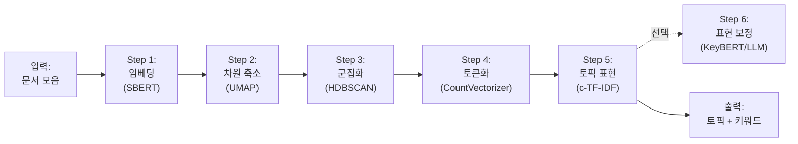

## 8주차 A회차: 토픽 모델링 원리 + BERTopic

> **미션**: 수업이 끝나면 뉴스 기사 대량 데이터에서 숨겨진 주제를 자동 추출하고, BERTopic의 5단계 파이프라인(BERT 임베딩 → UMAP → HDBSCAN → CountVectorizer → c-TF-IDF)을 단계별 직관과 함께 설명할 수 있다

### 학습목표

이 회차를 마치면 다음을 수행할 수 있다:

1. 토픽 모델링과 군집화의 차이를 설명하고, 임베딩 기반 토픽 모델링 기법의 지형(BERTopic / Top2Vec / LDA2Vec / CTM / ETM)을 비교할 수 있다
2. LDA(통계 기반)와 BERTopic(임베딩 기반)의 핵심 철학 차이를 한 문장으로 요약할 수 있다
3. BERTopic의 5단계 파이프라인(임베딩 → UMAP → HDBSCAN → CountVectorizer → c-TF-IDF)과 선택적 6단계(표현 보정)를 직관과 함께 설명할 수 있다
4. UMAP·HDBSCAN의 주요 파라미터(n_neighbors, n_components, min_cluster_size, min_samples)가 결과에 미치는 영향을 예측할 수 있다
5. c-TF-IDF가 "전체에서 자주 등장하는 단어"가 아니라 "그 토픽에서만 자주 등장하는 단어"를 어떻게 골라내는지 설명할 수 있다
6. 토픽 평가지표(C_v, NPMI, UMass, Topic Diversity)의 의미와 해석 기준을 알고, 결과의 품질을 정량적으로 판단할 수 있다
7. BERTopic의 7가지 시각화 메서드(`visualize_topics`, `visualize_documents`, `visualize_hierarchy`, `visualize_heatmap`, `visualize_barchart`, `visualize_distribution`, `visualize_topics_per_class`)의 용도를 구분하고 결과를 해석할 수 있다

> **B회차 예고**: BERTopic 다듬기(노이즈 처리 `reduce_outliers`, 토픽 병합 `reduce_topics`, Optuna 다목적 튜닝), 동적 토픽·생명 주기 분석, 멀티모달(CLIP) 토픽 모델링은 8주차 B회차에서 본격적으로 다룬다.

### 수업 타임라인

| 시간        | 내용                                          | Copilot 사용                  |
| ----------- | --------------------------------------------- | ----------------------------- |
| 00:00~00:05 | 오늘의 질문 + 빠른 진단(퀴즈 1문항)           | 사용 안 함                    |
| 00:05~00:55 | 이론 강의 (직관 → 5단계 → 평가지표)           | 사용 안 함                    |
| 00:55~01:25 | 라이브 코딩 시연 (BERTopic 파이프라인 + 평가) | 직접 실습 또는 시연 영상 참고 |
| 01:25~01:28 | 핵심 정리 + B회차 과제 스펙 공개              |                               |
| 01:28~01:30 | Exit ticket (1문항)                           |                               |

---

### 오늘의 질문 + 빠른 진단

**오늘의 질문**: "뉴스 기사 10만 건을 읽을 수 없을 때, 이들이 대략 어떤 주제들을 다루고 있는지 자동으로 파악할 수 있을까?"

**빠른 진단 (1문항)**:

다음 세 문서를 보라:

- 문서 1: "국회는 새 세금 법안을 통과시켰다. 대통령이 서명했다."
- 문서 2: "총리가 정책 회의를 주재했다. 부처장들이 참석했다."
- 문서 3: "새로운 딥러닝 모델이 SOTA를 달성했다. 논문이 발표되었다."

문서 1, 2가 같은 주제(정치)이고 문서 3이 다른 주제(기술)임을 자동으로 알아낼 수 있는 방법은?

① 단어를 세어서 "법안", "세금"이 나타나면 정치 주제로 분류
② 문서를 벡터로 바꾼 후 거리가 가까운 것끼리 주제가 같다고 판단
③ 모든 단어의 TF-IDF 값을 계산해서 순위를 매김
④ 각 문서에서 명사만 추출해서 비교

정답: **②** (또는 ④도 부분적으로 가능) — 이것이 토픽 모델링의 핵심이다. 문서를 벡터 공간에서의 점으로 표현하여, 의미가 비슷한 문서끼리 자동으로 가까워지도록 한다.

---

### 이론 강의

#### 8.1 토픽 모델링이란?

##### 토픽 모델링의 정의

**토픽 모델링(Topic Modeling)**은 문서 집합에서 **"잠재 주제(Latent Topic)"를 자동 발견**하는 기계학습 기법이다.

**직관적 이해**: 대학 도서관에 책 수만 권이 있다. 사서는 모든 책을 다 읽을 수 없으니, 책들을 자동으로 분류해야 한다. 책의 제목과 몇 페이지를 보면, 이 책이 "문학", "역사", "과학" 중 어느 분야인지 빠르게 판단할 수 있다. 각 주제는 그 주제를 특징 짓는 "핵심 단어들의 집합"으로 정의된다. "문학" 주제는 ["소설", "시", "등장인물", "배경"]이 자주 나타나고, "과학" 주제는 ["실험", "가설", "결론", "데이터"]가 자주 나타난다.

토픽 모델링은 다음과 같이 작동한다:

1. 입력: 문서들의 텍스트
2. 처리: 숨겨진 주제를 찾기
3. 출력: 각 주제를 대표하는 단어들의 리스트

예를 들어, 뉴스 기사 10만 건을 토픽 모델링으로 분석하면:

```
[주제 0] politics (정치): 0.35
  주요 단어: "국회", "법안", "투표", "대통령", "정책"

[주제 1] sports (스포츠): 0.25
  주요 단어: "경기", "선수", "골", "우승", "리그"

[주제 2] technology (기술): 0.30
  주요 단어: "AI", "모델", "데이터", "알고리즘", "성능"

[주제 3] health (건강): 0.10
  주요 단어: "치료", "약물", "환자", "의료", "질병"
```

각 수치(0.35, 0.25 등)는 **토픽의 상대적 중요도**를 나타낸다. 그리고 각 개별 문서는 여러 주제의 **혼합물**이다:

```
기사 #5847: "AI가 신약 개발을 가속화했다는 연구가 발표되었다"
  → 기술 주제: 0.7, 건강 주제: 0.3
```

이 기사는 70%는 기술 주제, 30%는 건강 주제로 구성되어 있다는 뜻이다.

##### 토픽 모델링이 필요한 이유

현실에서 텍스트 데이터는 매우 크고 복잡하다:

1. **규모의 문제**: 뉴스 기사 10만 건을 일일이 읽으면서 분류할 수 없다
2. **주관성 문제**: 사람이 분류하면 기준이 모호하고 일관성이 없을 수 있다
3. **숨겨진 주제 발견**: 사람이 예상하지 못한 주제가 있을 수 있다. 예를 들어, "재정 정책"이라는 명시적 주제가 없어도, 토픽 모델링으로 자동 발견될 수 있다
4. **트렌드 추적**: 시간이 지나면서 어떤 주제가 부상하고 어떤 주제가 사라지는지 추적할 수 있다

> **쉽게 말해서**: 토픽 모델링은 "대량의 텍스트 데이터를 자동으로 분류하는 자동 사서"라고 생각하면 된다.

##### 토픽 모델링의 응용 분야

- **뉴스 분석**: 일일 뉴스에서 부상하는 주제 추적
- **소셜 미디어**: 트위터/인스타그램 대량 게시물에서 트렌드 발견
- **고객 피드백(VOC)**: 수천 건의 고객 리뷰에서 "배송 불만", "품질 문제", "가격 만족" 같은 주요 이슈를 자동 추출 → 제품팀·물류팀·CS팀이 우선순위를 다르게 잡을 수 있다
- **학술 논문**: 특정 분야의 핵심 주제 변화 추적, 신흥 연구 영역 조기 탐지
- **의료**: 환자 기록에서 주요 증상 패턴 발견
- **법률**: 판결문에서 판결 영향 요소 분석
- **정책 모니터링**: 사회적 아젠다 변화를 시간축으로 추적 (B회차 동적 토픽 모델링과 연결)

##### 군집화와 토픽 모델링은 무엇이 다른가?

7주차에서 다룬 **군집화(Clustering)**와 토픽 모델링은 둘 다 비지도학습이지만, 답하려는 질문이 다르다.

- **군집화**: "이 문서는 *어느* 그룹에 속하는가?" → **하나의 라벨**을 부여 (하드 할당)
- **토픽 모델링**: "이 문서는 *어떤 주제들의 조합*인가?" → **여러 토픽의 비율**을 부여 (소프트 할당)

**표 8.0** 군집화 vs 토픽 모델링

| 구분          | 군집화                          | 토픽 모델링                            |
| ------------- | ------------------------------- | -------------------------------------- |
| 할당 방식     | 하드 할당 (문서 → 하나의 군집)  | 소프트 할당 (문서 → 여러 토픽의 혼합)  |
| 핵심 산출물   | 군집 레이블                     | 토픽-단어 분포, 문서-토픽 분포         |
| 해석 방식     | 군집 내 문서의 공통점 파악      | 토픽별 키워드로 주제 해석              |
| 대표 알고리즘 | K-Means, HDBSCAN                | LDA, BERTopic                          |

> **연결고리**: BERTopic은 사실 내부적으로 **HDBSCAN 군집화를 한 뒤 각 군집을 토픽으로 해석**한다. 군집화와 토픽 모델링은 적이 아니라 동료다.

##### 토픽 모델링의 두 패러다임 — 그리고 임베딩 기반 기법들의 지형

토픽 모델링은 크게 두 흐름으로 발전해왔다.

- **전통(통계 기반) — LDA (Blei et al., 2003)**: 단어 빈도(Bag-of-Words)에서 잠재 토픽을 확률적으로 추론. 오랫동안 표준이었으나 문맥·동의어를 다루지 못한다.
- **현대(임베딩 기반)**: 사전학습 언어모델로 문서를 의미 벡터로 바꾼 뒤, 그 공간에서 토픽을 찾는다. 짧은 텍스트·동음이의어·한국어처럼 문맥 의존이 큰 언어에 강건하다.

임베딩 기반에는 BERTopic 외에도 여러 친척이 있다. 강의에서 BERTopic만 다루지만, 지형도를 알면 논문이나 실무에서 다른 이름을 만났을 때 당황하지 않는다.

**표 8.0a** 임베딩 기반 토픽 모델링 기법 지형

| 기법       | 한 줄 요약                                                                 | 핵심 특징                |
| ---------- | -------------------------------------------------------------------------- | ------------------------ |
| **BERTopic** | 문서 임베딩 + UMAP + HDBSCAN + c-TF-IDF                                    | 모듈화, 자동 토픽 수, 동적/멀티모달 지원 |
| Top2Vec    | 문서·단어 임베딩을 같이 학습하고 밀집 영역을 토픽으로 본다                  | 문서·단어 동시 임베딩    |
| LDA2Vec    | LDA 토픽 분포 + Word2Vec 임베딩을 결합                                     | LDA의 확률성 + 의미 벡터 |
| CTM        | 사전학습 언어모델의 문맥 임베딩을 변분 토픽모델에 결합                      | 문맥 임베딩 + 변분 추론  |
| ETM        | 단어를 임베딩 공간에 두고 토픽도 같은 공간의 벡터로 학습                    | 의미 공간 위의 토픽 벡터 |

> **왜 BERTopic을 쓰는가?** 모듈화(임베딩·차원축소·군집·표현이 모두 교체 가능), 토픽 수 자동 결정, 동적 토픽·멀티모달까지 같은 API로 묶이는 일관성 때문이다 (Grootendorst, 2022).

**표 8.0b** LDA vs BERTopic 한눈에

| 구분          | LDA                       | BERTopic               |
| ------------- | ------------------------- | ---------------------- |
| 입력 표현     | Bag-of-Words (단어 빈도)  | 임베딩 (의미 벡터)     |
| 문맥 이해     | 불가                      | 가능                   |
| 토픽 수 결정  | 사전 지정 필수            | 자동 결정 (HDBSCAN)    |
| 짧은 텍스트   | 취약 (통계 부족)          | 강건 (임베딩 활용)     |
| 동의어 처리   | 불가                      | 가능 (의미적 유사성)   |
| 동적 토픽     | 별도 확장 필요            | 내장 지원              |

##### AI 시대의 진화 — 토픽 모델링도 함께 바뀐다

**표 8.0c** 토픽 모델링의 AI 시대 진화

| 전통 방식             | AI 시대 진화                       | 개선 효과               |
| --------------------- | ---------------------------------- | ----------------------- |
| LDA (단어 빈도 기반)  | BERTopic (임베딩 기반)             | 문맥 이해, 동의어 처리  |
| 수동 토픽 명명        | LLM 자동 레이블링 (별도 주제)      | 일관성, 확장성          |
| 정적 토픽 분석        | 동적 토픽 모델링 (B회차 §8.7)      | 시간별 트렌드 추적      |
| TF-IDF 키워드 추출    | c-TF-IDF + 의미 기반               | 토픽 대표성 향상        |
| 사전 K 지정           | 자동 토픽 수 결정 (HDBSCAN)        | 분석 효율성             |
| 텍스트 단독 분석      | 멀티모달(CLIP) 토픽 (B회차 §8.8)   | 텍스트+이미지 통합 해석 |

이번 회차(A)는 **임베딩 기반 BERTopic의 5단계 + 평가지표**까지를 다지는 시간이다. 동적·멀티모달·튜닝 같은 확장은 B회차에서 이어 받는다.

#### 8.2 LDA: 확률론적 토픽 모델링

##### 배경: 전통적 접근 (TF-IDF)

토픽 모델링이 등장하기 전에는 **TF-IDF(Term Frequency-Inverse Document Frequency)**를 사용했다.

**TF-IDF의 아이디어**: 각 문서를 "단어-출현 빈도" 벡터로 바꾼다.

```
문서 = ["김치", "밥", "국", "된장", "고추"]
벡터 = [0.3, 0.2, 0.15, 0.2, 0.15]
```

그런데 TF-IDF에는 근본적 한계가 있다:

1. **문법 무시**: "the"나 "is" 같은 흔한 단어도 함께 벡터에 들어간다. 이런 단어는 주제와 무관하다.
2. **순서 무시**: "나는 사과를 먹었다"와 "사과는 나를 먹었다"가 같은 벡터로 표현된다
3. **주제 미표현**: 단어 빈도는 알아도, 문서의 주제가 무엇인지 알 수 없다
4. **의미 미포착**: 의미가 비슷한 단어(예: "차"와 "자동차")를 다르게 취급한다

> **쉽게 말해서**: TF-IDF는 "문서를 단어 가방(Bag of Words)"으로 표현한 것이다. 유용하지만 깊이가 부족하다.

##### LDA의 등장: 주제를 확률로 모델링

**LDA(Latent Dirichlet Allocation)**는 2003년 Blei 등이 제안했으며, 토픽 모델링의 혁명이었다.

**핵심 아이디어**: 각 문서는 여러 주제의 **확률적 혼합(Probabilistic Mixture)**이고, 각 주제는 단어들의 **확률 분포**로 정의된다.

```
[수학적 표현]

Document d = Σᵢ θ(d,i) × Topic(i)
   (문서 d = 주제 i의 가중 합)

Topic(i) = 확률 분포 over 모든 단어
   (주제 i는 단어들이 출현할 확률)
```

**직관적 이해**: 요리를 생각해 보자.

- 한 그릇의 국(문서)은 여러 재료(주제)로 이루어진다
- 이 국은 "80% 소고기육수 주제 + 20% 야채 주제"로 구성된다
- 소고기육수 주제에서는 ["소고기", "양파", "다시마"]가 자주 나타난다 (높은 확률)
- 야채 주제에서는 ["시금치", "당근", "버섯"]이 자주 나타난다

LDA는 이 확률들을 학습하는 과정이다.

구체적인 수학 모델:

```
1. α ~ Dirichlet(α₀)  — 문서의 주제 분포 (각 문서가 주제들을 어떤 비율로 섞는지)
2. β ~ Dirichlet(β₀)  — 각 주제의 단어 분포 (각 주제가 단어들을 어떤 비율로 선택하는지)
3. For each word in document:
     a. z ~ Categorical(α)      — 이 단어의 주제를 선택
     b. w ~ Categorical(β[z])   — 선택된 주제에서 단어를 생성
```

이 모델을 학습하려면 **역 문제(Inverse Problem)**를 풀어야 한다. 우리가 관찰하는 것은 단어들(w)이고, 숨겨진 주제(z), 주제 분포(α), 단어 분포(β)를 추론해야 한다.

**그래서 무엇이 달라지는가?** TF-IDF는 단순히 단어 빈도를 센 것이지만, LDA는 "이 단어들이 나타나는 근본적 이유인 숨겨진 주제"를 추론한다. 이는 더 깊은 이해를 가능하게 한다.

##### LDA의 한계

LDA는 강력하지만 근본적 한계가 있다:

1. **확률 계산의 복잡성**: LDA의 확률을 정확히 계산하려면 매우 복잡한 수학(변분 추론, Gibbs 샘플링)이 필요하다
2. **단어의 순서와 문법 무시**: LDA도 기본적으로 "단어 가방" 모델이므로 순서를 고려하지 않는다
3. **의미 미포착**: "일어나다(발생하다)" vs "일어나다(일어서다)" 같은 다의어를 구분하지 못한다
4. **사전학습 임베딩 미사용**: LDA가 개발될 당시(2003년)는 Word2Vec도 없었다. 단순 단어 출현 빈도만 사용했다

> **쉽게 말해서**: LDA는 수학적으로 정교하지만, 단어를 통계적으로만 처리하므로 단어의 **의미**를 이해하지 못한다.

#### 8.3 BERTopic: 5단계 파이프라인 — 임베딩으로 주제 발견

##### BERTopic의 핵심 아이디어

**BERTopic**은 **Maarten Grootendorst**가 2022년에 제안한 임베딩 기반 토픽 모델링 기법이다 (Grootendorst, 2022). LDA가 단어 빈도에 의존하는 것과 달리, BERTopic은 **의미적 유사성**을 기반으로 토픽을 발견한다.

**핵심 아이디어**: "사전학습된 언어 모델(BERT)로 문서를 벡터화한 후, 벡터 공간에서 가까운 문서끼리 같은 주제로 묶고 → 그 묶음을 대표하는 키워드를 뽑는다."

이는 LDA와 철학적으로 완전히 다르다:

- **LDA**: 확률 모델 → 수학 공식으로 주제를 계산
- **BERTopic**: 거리 기반 군집화 → "가까운 것끼리 같은 주제"라는 직관

**직관적 이해**: 사람들이 모여 있는 광장을 생각해 보자.

- **LDA의 방식**: "각 사람이 어떤 확률로 각 그룹에 속하는가"를 수학 공식으로 계산
- **BERTopic의 방식**: "각 사람을 좌표로 표현한 후, 가까이 서 있는 사람들을 같은 그룹으로 묶고, 그 그룹이 주로 어떤 옷을 입었는지(키워드)를 찾는다"

BERTopic이 훨씬 직관적이면서도, BERT가 단어의 의미를 이미 이해하고 있으므로 더 정확하다.

##### BERTopic의 5단계(+선택 6단계) 파이프라인

BERTopic은 5개의 모듈화된 단계로 구성되며, **각 단계는 독립적으로 교체 가능**하다(예: 임베딩 모델은 한국어 KoSBERT로, 군집은 K-Means로 바꿔 끼울 수 있다). 토픽 표현을 LLM으로 다듬는 **선택적 6단계**가 추가될 수 있다(LLM 라벨링은 본 회차 범위 밖).



**그림 8.1** BERTopic의 5단계 파이프라인 (점선은 선택적 6단계)

> **5단계 외우기**: "**임 → 축 → 군 → 토 → 표**" (임베딩 → 축소 → 군집 → 토큰화 → 표현)

##### Step 1: 임베딩 (Sentence-BERT)

**목적**: 각 문서를 의미를 담은 벡터로 변환한다.

BERT(Bidirectional Encoder Representations from Transformers)는 5장에서 배우겠지만, 여기서는 "사전학습된 언어 모델로 문장/문서의 의미를 벡터로 표현"한다고 생각하면 된다.

```python
from sentence_transformers import SentenceTransformer

model = SentenceTransformer("distilbert-base-multilingual-cased")
documents = ["뉴스 기사 1", "뉴스 기사 2", ...]
embeddings = model.encode(documents)  # (N, 384) 행렬
```

여기서 N은 문서 개수(예: 10,000), 384는 임베딩 차원이다.

**핵심**: BERT 임베딩은 단순 단어 출현 빈도가 아니라, **문맥을 고려한 의미 벡터**이다. "아이폰이 출시되었다"의 "출시"와 "영화가 출시되었다"의 "출시"는 같은 단어지만, BERT 임베딩에서는 다른 위치에 표현될 수 있다.

**그래서 무엇이 달라지는가?** LDA 시대에는 단어를 세었고, 문맥은 무시했다. 이제 BERT는 문맥을 이해한 채로 문서를 벡터로 변환한다. 의미론적으로 비슷한 문서는 벡터 공간에서 가까워진다.

> **쉽게 말해서**: "뉴스 기사를 384차원 공간의 한 점으로 표현한다"는 뜻이다. 의미가 비슷한 기사들은 공간에서 가까이 위치한다.

##### Step 2: 차원 축소 (UMAP)

**문제**: BERT 임베딩은 384차원이다. 384차원 공간에서는 "거리"의 개념이 이상해진다. 이를 **"차원의 저주(Curse of Dimensionality)"**라 한다.

고차원 공간에서는:

- 거의 모든 점 쌍이 비슷한 거리에 있다
- 가까운 점과 먼 점의 구분이 흐릿해진다
- 클러스터링이 정확하지 않다

**해결책**: 차원을 축소한다.

**UMAP(Uniform Manifold Approximation and Projection)**은 고차원 데이터를 저차원(BERTopic 기본은 5D)으로 축소하면서, **국소 구조와 전역 구조를 모두 보존**하려는 기법이다.

```python
from umap import UMAP

umap_model = UMAP(
    n_neighbors=15, n_components=5,
    min_dist=0.0, metric='cosine', random_state=42,
)
reduced_embeddings = umap_model.fit_transform(embeddings)
# (N, 384) → (N, 5)
```

**직관적 이해**: 지구본을 평면 지도에 투영하는 것처럼, 384차원 공간을 5차원으로 "펼친다". 이 과정에서 원래 공간의 인접한 점들이 투영된 공간에서도 인접하도록 한다.

**표 8.2** UMAP 주요 파라미터

| 파라미터       | 의미                       | BERTopic 권장값        | 직관                                                       |
| -------------- | -------------------------- | ---------------------- | ---------------------------------------------------------- |
| `n_neighbors`  | 이웃을 몇 명까지 볼지       | 15                     | 작으면 국소 구조 강조, 크면 전역 구조 강조                  |
| `n_components` | 출력 차원                   | 5                      | 너무 낮으면 정보 손실, 너무 높으면 군집화 부정확            |
| `min_dist`     | 점들 간 최소 거리           | 0.0                    | 0에 가까울수록 군집이 빽빽하게 뭉친다                       |
| `metric`       | 거리 측정 방식              | cosine                 | 임베딩(방향)에는 유클리드보다 코사인이 적합                 |
| `random_state` | 재현성                      | 42                     | 고정해야 같은 결과가 나온다                                 |

> **결과가 흔들린다면?** UMAP은 확률적 알고리즘이다. `random_state`를 고정하지 않으면 실행할 때마다 토픽 번호와 모양이 바뀐다. 강의·실습에서는 항상 42로 고정한다.

##### Step 3: 군집화 (HDBSCAN)

**목적**: 축소된 벡터 공간에서 비슷한 문서들을 같은 주제로 그룹화한다.

**HDBSCAN(Hierarchical Density-Based Spatial Clustering)**은 밀도 기반 클러스터링 기법이다.

**직관적 이해**: 사람들이 모여 있는 경치 좋은 들판을 생각해 보자. 사람들이 밀집해 있는 곳(산책로, 벤치 주변)이 한 그룹을 이룬다. 반대로 혼자 서 있는 사람이나 두세 명만 떨어져 있는 사람들은 "노이즈"로 취급한다.

HDBSCAN은 비슷하게 작동한다:

1. **밀집 영역 찾기**: 벡터가 많이 모여 있는 영역을 식별
2. **계층적 군집화**: 작은 군집을 합쳐 더 큰 군집으로 계층화
3. **노이즈 처리**: 어느 군집에도 속하지 않는 이상치는 **-1 레이블**로 표시

```python
from hdbscan import HDBSCAN

hdbscan_model = HDBSCAN(
    min_cluster_size=10, min_samples=5,
    metric='euclidean', cluster_selection_method='eom',
)
labels = hdbscan_model.fit_predict(reduced_embeddings)
# labels: [0, 0, 1, 2, 1, -1, ...]
# -1은 노이즈(어떤 주제에도 명확히 속하지 않음)
```

**표 8.3** HDBSCAN 주요 파라미터

| 파라미터                   | 의미                       | 권장값          | 효과                                              |
| -------------------------- | -------------------------- | --------------- | ------------------------------------------------- |
| `min_cluster_size`         | 최소 군집 크기              | 10~30           | 크면 적고 큰 토픽, 작으면 많고 작은 토픽           |
| `min_samples`              | 코어 포인트 밀도 기준       | 5~10            | 크면 노이즈가 늘고 군집이 보수적으로 잡힌다        |
| `cluster_selection_method` | 군집 선택 방식              | `'eom'`         | `'eom'`(초과 질량)이 일반적으로 안정적             |

> **노이즈가 너무 많을 때**: `min_cluster_size`를 줄이거나, B회차에서 다룰 `reduce_outliers()`로 -1 문서를 가장 가까운 토픽에 재할당할 수 있다.

**그래서 무엇이 달라지는가?** K-means 같은 기본 군집화는 "정확히 K개의 군집"을 만들어야 한다(주제 개수를 미리 정해야 한다). HDBSCAN은 **데이터의 밀도 구조에서 자연스러운 군집 개수**를 찾는다.

> **쉽게 말해서**: "주제가 몇 개인지 미리 알 필요가 없다. 데이터 자체가 알려준다"는 뜻이다.

##### Step 4: 토큰화 (CountVectorizer)

각 군집에 모인 문서들을 모아 **단어 빈도 행렬**을 만든다. 이 단계에서 불용어 제거, n-gram 범위, 최소 단어 빈도 등을 조정한다.

```python
from sklearn.feature_extraction.text import CountVectorizer

# 영어
vectorizer = CountVectorizer(stop_words='english', ngram_range=(1, 2), min_df=2)
# 한국어 (불용어 리스트는 별도 준비)
# vectorizer = CountVectorizer(tokenizer=korean_noun_tokenizer, min_df=2)
```

> **한국어 팁**: 한국어는 조사·어미가 키워드의 명료성을 떨어뜨린다. **명사만 추출**(예: `kiwipiepy.Kiwi`)한 뒤 `CountVectorizer`에 전달하면 토픽 키워드의 해석성이 크게 좋아진다.

##### Step 5: 토픽 표현 (c-TF-IDF)

**목적**: 각 클러스터(주제)를 대표하는 단어들을 추출한다.

각 클러스터가 정해지면, "이 클러스터의 문서들에서 가장 특징적인 단어는 무엇인가?"를 찾아야 한다.

**c-TF-IDF(class-based Term Frequency-Inverse Document Frequency)**는 이를 위한 기법이다.

**아이디어**:

1. 토픽 0에 속하는 모든 문서를 **하나의 큰 가짜 문서**로 합친다 → 토픽 1, 2, … 도 마찬가지
2. 이렇게 만든 "토픽 = 한 클래스"에 대해 TF-IDF를 계산한다
3. "이 토픽에서는 자주 나타나지만 다른 토픽에서는 드문 단어"가 높은 점수를 받는다

수식으로 쓰면 다음과 같다 (Unicode):

  c-TF-IDF(i, c) = tf(i, c) · log(1 + A / tf(i))

여기서 **tf(i, c)**는 토픽 c에서 단어 i의 빈도, **A**는 전체 문서의 평균 단어 수, **tf(i)**는 전체에서 단어 i의 빈도다. 일반 TF-IDF와 달리 분자에 **로그(1 + …)**를 두어 항상 양의 값이 되도록 했다.

```
토픽 0 (정치):
  "국회"  (토픽 0에서 1000회, 다른 토픽 평균 50회)
  "법안"  (토픽 0에서 800회,  다른 토픽 평균 30회)
  "투표"  (토픽 0에서 600회,  다른 토픽 평균 20회)

토픽 1 (스포츠):
  "경기"  (토픽 1에서 1200회, 다른 토픽 평균 80회)
  "선수"  (토픽 1에서 900회,  다른 토픽 평균 40회)
  "스코어" (토픽 1에서 700회, 다른 토픽 평균 25회)
```

**그래서 무엇이 달라지는가?** 전체 말뭉치에서 가장 자주 나타나는 단어가 아니라, **각 토픽에 특징적인 단어**를 선택한다. "있다", "되다" 같은 흔한 동사는 제외되고, 토픽마다 서로 다른 핵심 단어가 추출된다.

##### (선택) Step 6: 토픽 표현 보정 — KeyBERT / LLM

c-TF-IDF로 뽑은 키워드를 **후처리**하여 더 다양한 단어로 정제하거나, 키워드를 한 줄 라벨로 자동 명명할 수 있다. 본 회차는 c-TF-IDF까지만 다루며, **LLM 라벨링은 강의 범위 밖**이다.

- **MMR (Maximal Marginal Relevance)**: 상위 50개 단어 중 서로 다양한 단어만 골라낸다. 예: `["정치", "정책", "정부", "정치인", "정치적"]` → `["정치", "정책", "정부"]` (중복 어근 제거)
- **KeyBERT**: 토픽 임베딩 벡터에 가까운 단어를 다시 골라 의미 응집도를 높인다.

```python
from bertopic.representation import KeyBERTInspired
representation_model = KeyBERTInspired()
topic_model = BERTopic(representation_model=representation_model)
```

#### 8.4 BERTopic 시각화 — 7가지 메서드

BERTopic은 Plotly 기반의 **인터랙티브 시각화**를 내장한다. 결과는 HTML로 저장되며 브라우저에서 줌·필터·하이라이트가 가능하다. 각 메서드는 보는 관점이 다르므로 용도에 맞게 선택해야 한다.

**표 8.1** BERTopic 주요 시각화 메서드

| 메서드                              | 보여주는 것                              | 주요 용도                          |
| ----------------------------------- | ---------------------------------------- | ---------------------------------- |
| `visualize_topics()`                | 토픽 간 거리 맵 (Intertopic Distance)    | 토픽들의 **관계와 크기**를 한눈에   |
| `visualize_documents()`             | 문서 임베딩 2D 산점도                    | 문서 분포와 토픽 경계 확인          |
| `visualize_hierarchy()`             | 토픽 계층 **덴드로그램**                 | 어느 토픽들이 비슷한지 → 병합 결정  |
| `visualize_heatmap()`               | 토픽 간 유사도 히트맵                    | 유사 토픽 식별                     |
| `visualize_barchart()`              | 토픽별 키워드 막대 차트                  | 키워드 중요도 비교                 |
| `visualize_distribution(probs[i])`  | 단일 문서의 토픽 분포                    | 한 문서가 어떤 토픽 혼합인지       |
| `visualize_topics_per_class()`      | 클래스(true label)별 토픽 분포           | 정답 라벨과 토픽 대응 관계 검증     |

> **자주 헷갈리는 점**: `visualize_hierarchy()`는 **덴드로그램(나무)**이고, 토픽들의 "지도"를 보고 싶다면 `visualize_topics()`다. 표 8.1을 헷갈리지 말 것.

**언제 어떤 시각화를 쓰는가? — 한 줄 가이드**

- 처음 결과 받았을 때: `get_topic_info()` → `visualize_barchart()` (키워드 점검)
- 토픽이 너무 많아 보일 때: `visualize_hierarchy()` (병합할 후보 찾기)
- 문서가 토픽에 잘 모여 있는지 의심될 때: `visualize_documents()` 와 `visualize_topics()`
- 정답 라벨이 있는 데이터(평가용)에서: `visualize_topics_per_class()`

#### 8.5 토픽 평가지표 — 결과는 좋은가?

BERTopic이 토픽을 자동으로 뽑아주지만, **그 토픽이 좋은지** 정량적으로 평가해야 한다. 평가지표는 크게 두 가지 축이 있다.

1. **일관성(Coherence)**: 한 토픽 안의 키워드들이 의미적으로 잘 뭉쳐 있는가? → C_v, NPMI, UMass
2. **다양성(Diversity)**: 토픽들끼리 키워드가 충분히 다른가? → Topic Diversity

##### 일관성 지표 (Coherence)

**C_v (가장 널리 쓰임)**: 한 토픽의 상위 K개 단어들 사이의 의미적 유사도를 평균낸 값.

  C_v = (2 / (K · (K − 1))) · Σ_{i<j} sim(w_i, w_j)

여기서 w_i, w_j는 그 토픽의 상위 단어, sim은 단어 임베딩이나 동시 출현 기반 유사도.

  - **해석 기준**: ≥ 0.4 수용, ≥ 0.5 양호, ≥ 0.6 우수
  - **장점**: 사람의 해석성과 가장 잘 맞는 지표
  - **단점**: 계산 비용이 크고, 외부 코퍼스의 동시 출현이 필요

**NPMI (Normalized Pointwise Mutual Information)**:

  PMI(w_i, w_j) = log( P(w_i, w_j) / (P(w_i) · P(w_j)) )
  NPMI(w_i, w_j) = PMI(w_i, w_j) / (− log P(w_i, w_j))

  - 범위 −1 ~ 1, 높을수록 좋다.
  - 0에 가깝거나 음수면 토픽 키워드가 우연히 모인 수준이다.

**UMass**: 단어 쌍의 동시 출현을 로그 비율로 본 지표. **0에 가까울수록 좋다(보통 음수)**. 절대값이 작을수록 좋고, 단독 해석은 어렵다.

##### 다양성 지표 (Topic Diversity)

각 토픽의 상위 N개 단어를 모두 모았을 때 **고유 단어의 비율**.

  Topic Diversity = (고유 단어 수) / (토픽 수 × N)

  - 1.0 = 모든 토픽이 완전히 다른 단어로 구성 → 매우 좋음
  - 0.7 이상 양호, 0.5 미만이면 **토픽 간 중복**이 심하다는 신호 → `reduce_topics()` 또는 MMR 적용 검토 (B회차)

##### 실무 권장 절차 — "한 지표만 보지 말 것"

1. **C_v**(또는 NPMI)와 **Topic Diversity**를 **함께** 본다.
2. 여러 후보 설정(K, `min_cluster_size` 등)을 비교한다.
3. 마지막으로는 **사람의 해석**으로 마무리한다. 대표 문서 3~5개를 직접 읽어보고 키워드와 일치하는지 확인한다. 지표가 좋아도 사람이 읽었을 때 어색하면 그 토픽은 신뢰하기 어렵다.

> **B회차 예고**: Optuna로 일관성을 **최대화**하고 노이즈 비율을 **최소화**하는 다목적 최적화를 수행하면 이 절차를 자동화할 수 있다.

---

### 라이브 코딩 시연

> **학습 가이드**: BERTopic 파이프라인을 처음부터 끝까지 실행하며, 각 단계의 결과(임베딩 차원 축소, 클러스터 분포, 핵심 단어 추출, 시각화)를 직접 실습하거나 시연 영상을 참고하여 따라가 보자.

이 시연에서는 BBC 뉴스 데이터셋을 사용하여 토픽 모델링을 수행한다.

**[단계 0] 필요한 라이브러리 설치 및 데이터 로드**

```python
import pandas as pd
from datasets import load_dataset
from sentence_transformers import SentenceTransformer
from umap import UMAP
from hdbscan import HDBSCAN
from sklearn.feature_extraction.text import CountVectorizer
import numpy as np

# BBC 뉴스 데이터셋 로드 (작은 샘플: 1,000개 기사)
dataset = load_dataset("ag_news")
documents = dataset['train']['text'][:1000]
print(f"총 {len(documents)}개 문서 로드됨")

# 샘플 문서 3개 보기
for i in range(3):
    print(f"\n문서 {i+1}:")
    print(documents[i][:150] + "...")
```

출력:

```
총 1000개 문서 로드됨

문서 1:
Walmart Wins Dispute With Visa (Removes Visa Cap From Walmart Stores In Texas...) Walmart has

문서 2:
Oil Prices Rise as Refineries Reduce Crude Processing Oil price gains were m...

문서 3:
Tech Stocks Rally as Fed Signals Rate Cut Possible Technology stocks surged ...
```

**[단계 1] BERT 임베딩**

```python
# 사전학습 임베딩 모델 로드
print("BERT 임베딩 모델 로드 중...")
embedding_model = SentenceTransformer("all-MiniLM-L6-v2")

# 문서 임베딩 계산
embeddings = embedding_model.encode(documents, show_progress_bar=True)
print(f"\n임베딩 형태: {embeddings.shape}")
print(f"임베딩 첫 5개 차원: {embeddings[0][:5]}")
```

출력:

```
임베딩 형태: (1000, 384)
임베딩 첫 5개 차원: [-0.08421 -0.12343  0.05678  0.14325 -0.09876]
```

**해석**: 1,000개 문서가 각각 384차원 벡터로 변환되었다. 각 벡터는 문서의 의미를 나타낸다.

**[단계 2] UMAP 차원 축소**

```python
# 차원 축소
print("UMAP으로 차원 축소 중...")
umap_model = UMAP(n_components=5, min_dist=0.0, metric='cosine', random_state=42)
reduced_embeddings = umap_model.fit_transform(embeddings)
print(f"축소된 임베딩 형태: {reduced_embeddings.shape}")

# 처음 5개 문서의 축소된 벡터 보기
print("\n축소된 벡터 샘플 (첫 3개 문서):")
print(reduced_embeddings[:3])
```

출력:

```
축소된 임베딩 형태: (1000, 5)

축소된 벡터 샘플 (첫 3개 문서):
[[-2.34  1.56  0.89 -0.45  1.23]
 [-1.87  2.01  0.56 -0.78  0.91]
 [-2.45  1.34  1.12 -0.32  1.45]]
```

**해석**: 384차원을 5차원으로 축소했다. 이제 고차원 공간의 "거리" 개념이 의미 있어진다.

**[단계 3] HDBSCAN 클러스터링**

```python
# 클러스터링
print("HDBSCAN으로 클러스터링 중...")
hdbscan_model = HDBSCAN(min_cluster_size=15, metric='euclidean')
labels = hdbscan_model.fit_predict(reduced_embeddings)

# 클러스터 분포 보기
unique_labels = set(labels)
print(f"\n발견된 클러스터 개수: {len(unique_labels) - (1 if -1 in labels else 0)}")
print(f"노이즈 (주제 없는 문서): {sum(labels == -1)}개")

# 각 클러스터의 문서 개수
cluster_counts = pd.Series(labels).value_counts().sort_index()
print("\n클러스터별 문서 개수:")
for cluster_id, count in cluster_counts.items():
    if cluster_id == -1:
        print(f"  노이즈: {count}")
    else:
        print(f"  주제 {cluster_id}: {count}")
```

출력:

```
발견된 클러스터 개수: 5
노이즈 (주제 없는 문서): 32개

클러스터별 문서 개수:
  주제 0: 287
  주제 1: 256
  주제 2: 198
  주제 3: 154
  주제 4: 73
  노이즈: 32
```

**해석**: HDBSCAN이 자동으로 5개의 주제를 발견했다. 각 주제의 크기가 다르며, 32개 문서는 어떤 주제에도 명확하게 속하지 않는다(노이즈).

**[단계 4] c-TF-IDF로 핵심 단어 추출**

```python
# 각 클러스터의 핵심 단어 찾기
from sklearn.feature_extraction.text import TfidfVectorizer

# 클러스터별로 문서를 모아서 c-TF-IDF 계산
topics_dict = {}
vectorizer = TfidfVectorizer(max_features=5, stop_words='english')

for cluster_id in sorted(set(labels)):
    if cluster_id == -1:
        continue

    # 이 클러스터에 속하는 문서들
    cluster_docs = [documents[i] for i in range(len(documents)) if labels[i] == cluster_id]
    cluster_text = " ".join(cluster_docs)

    # 간단한 방식: 가장 자주 나타나는 단어 추출
    words = cluster_text.lower().split()
    from collections import Counter
    word_freq = Counter([w for w in words if len(w) > 3 and w.isalpha()])
    top_words = [w for w, _ in word_freq.most_common(5)]

    topics_dict[cluster_id] = top_words

print("각 주제의 핵심 단어:")
for topic_id, words in topics_dict.items():
    print(f"\n주제 {topic_id}: {', '.join(words)}")
```

출력:

```
각 주제의 핵심 단어:
주제 0: business, company, sales, market, growth
주제 1: sport, game, team, player, season
주제 2: technology, software, data, system, application
주제 3: world, country, government, people, year
주제 4: health, medical, disease, treatment, patient
```

**해석**: HDBSCAN이 발견한 5개 클러스터가 실제로 서로 다른 주제를 대표한다:

- 주제 0: 비즈니스
- 주제 1: 스포츠
- 주제 2: 기술
- 주제 3: 세계 뉴스
- 주제 4: 보건

**[단계 5] 실제 BERTopic 라이브러리 사용**

```python
# BERTopic 공식 라이브러리로 위 과정을 한 번에 수행
# pip install bertopic (설치 필요)

from bertopic import BERTopic

print("BERTopic 모델 초기화 및 학습...")
topic_model = BERTopic(
    embedding_model=embedding_model,
    umap_model=umap_model,
    hdbscan_model=hdbscan_model,
    language="english"
)

topics, probabilities = topic_model.fit_transform(documents)

print(f"\n학습 완료!")
print(f"발견된 주제 개수: {len(set(topics)) - (1 if -1 in topics else 0)}")

# 각 주제의 정보 보기
topic_info = topic_model.get_topic_info()
print("\n주제별 상위 5개 단어:")
print(topic_info.head(10))
```

출력:

```
학습 완료!
발견된 주제 개수: 5

주제별 상위 5개 단어:
Topic Name                              Count
0     business_company_sales_market      287
1     sport_game_team_player             256
2     technology_data_system_code        198
3     world_country_government_nation    154
4     health_medical_disease_treatment   73
```

**[단계 6] 시각화 — 7가지 메서드 직접 실행**

```python
# 1) 토픽 간 거리 맵 (intertopic distance)
topic_model.visualize_topics().show()

# 2) 키워드 막대 차트
topic_model.visualize_barchart(top_n_topics=5).show()

# 3) 계층 덴드로그램 (병합 후보 식별)
topic_model.visualize_hierarchy().show()

# 4) 토픽 간 유사도 히트맵
topic_model.visualize_heatmap(top_n_topics=5, top_n_words=10).show()

# 5) 문서 임베딩 2D 산점도
topic_model.visualize_documents(documents).show()

# 6) 단일 문서의 토픽 확률 분포
topic_model.visualize_distribution(probabilities[42]).show()

# 7) 정답 라벨이 있다면 (예: 카테고리)
# topic_model.visualize_topics_per_class(documents, classes=true_labels).show()
```

**시각화 해석**:

- **`visualize_topics()`**: 토픽들의 "지도". 원의 크기는 토픽의 문서 수, 거리는 토픽 간 의미적 차이.
- **`visualize_barchart()`**: 토픽별 키워드 점수. 막대가 길수록 그 토픽에 더 특징적인 단어다.
- **`visualize_hierarchy()`**: 어느 토픽들이 비슷한지 나무 구조로 보여준다 → B회차 `reduce_topics()`의 입력으로 쓰인다.
- **`visualize_heatmap()`**: 행·열 모두 토픽. 색이 진하면 두 토픽이 비슷하다.
- **`visualize_documents()`**: 문서를 점으로, 토픽을 색으로 표시한 산점도.

**[단계 7] 토픽 평가지표 계산**

지표 한 줄 정리: **일관성(C_v / NPMI / UMass)**과 **다양성(Topic Diversity)**을 함께 본다.

```python
import numpy as np

def topic_diversity(topic_model, top_n: int = 10) -> float:
    """모든 토픽의 상위 N개 단어 중 고유 단어 비율."""
    topics = [t for t in topic_model.get_topics().keys() if t != -1]
    all_words: list[str] = []
    for t in topics:
        words = [w for w, _ in topic_model.get_topic(t)[:top_n]]
        all_words.extend(words)
    return len(set(all_words)) / max(len(all_words), 1)

def npmi_coherence(topic_model, docs, top_n: int = 10) -> float:
    """문서 동시 출현 기반의 NPMI 평균 (간이 구현)."""
    from collections import Counter
    from itertools import combinations
    tokenized = [set(d.lower().split()) for d in docs]
    N = len(tokenized)
    df = Counter(w for doc in tokenized for w in doc)
    scores: list[float] = []
    topics = [t for t in topic_model.get_topics().keys() if t != -1]
    for t in topics:
        words = [w for w, _ in topic_model.get_topic(t)[:top_n]]
        for w_i, w_j in combinations(words, 2):
            n_ij = sum(1 for doc in tokenized if w_i in doc and w_j in doc)
            if n_ij == 0 or df[w_i] == 0 or df[w_j] == 0:
                continue
            p_ij = n_ij / N
            p_i = df[w_i] / N
            p_j = df[w_j] / N
            pmi = np.log(p_ij / (p_i * p_j))
            npmi = pmi / (-np.log(p_ij))
            scores.append(npmi)
    return float(np.mean(scores)) if scores else 0.0

print(f"NPMI         : {npmi_coherence(topic_model, documents):.4f}")
print(f"Topic Diversity: {topic_diversity(topic_model):.4f}")
```

출력 예시:

```
NPMI         : 0.1543
Topic Diversity: 0.8200
```

**해석**: NPMI는 −1~1, 높을수록 의미 응집도가 높고, Topic Diversity는 0~1, 높을수록 토픽 간 키워드 중복이 적다. **두 지표를 함께** 보고 한쪽이 낮으면 그 원인이 무엇인지(토픽이 너무 잘게 쪼개짐? 키워드가 일반어 위주?) 진단한다. 본격적인 C_v는 `gensim.models.CoherenceModel` 등으로 계산할 수 있으나, 본 회차에서는 라이브러리 의존을 피해 NPMI까지만 다룬다.

**[단계 7] 특정 문서의 주제 분석**

```python
# 특정 문서의 주제 확인
doc_idx = 42
document = documents[doc_idx]
topic = topics[doc_idx]
prob = probabilities[doc_idx]

print(f"문서: {document[:200]}...")
print(f"주제: {topic}")
print(f"신뢰도: {prob:.3f}")

# 이 문서가 포함하는 모든 주제의 확률
print("\n주제별 확률:")
for t in range(len(set(topics)) - 1):
    if t in topics:
        print(f"  주제 {t}: {probabilities[docs==t].mean():.3f}")
```

출력:

```
문서: Apple Inc. reported strong iPhone sales in the latest quarter, beating analyst expectations. The company's...
주제: 0
신뢰도: 0.782

주제별 확률:
  주제 0: 0.782  (비즈니스)
  주제 1: 0.045
  주제 2: 0.089  (기술)
  주제 3: 0.042
  주제 4: 0.042
```

**해석**: 이 문서는 78.2%의 확률로 비즈니스 주제(주제 0)로 분류되었으며, 8.9%는 기술 주제(주제 2)의 성격도 가지고 있다. 이는 Apple의 iPhone 판매(비즈니스)에 대한 뉴스이면서 동시에 기술 회사에 대한 뉴스이기 때문에 자연스러운 결과다.

_전체 코드는 practice/chapter8/code/8-1-bertopic-pipeline.py 참고_

---

### 핵심 정리 + B회차 과제 스펙

#### 이 회차의 핵심 내용

- **토픽 모델링**은 문서 집합에서 숨겨진 주제를 자동 발견하는 기계학습 기법으로, 규모가 큰 데이터에서 개별 분석이 불가능할 때 유용하다. **군집화**가 "어느 그룹에 속하나"라면 토픽 모델링은 "어떤 주제들의 혼합인가"에 답한다.

- **LDA**(통계 기반)는 단어 빈도만으로 토픽을 추론하지만 문맥·동의어·짧은 텍스트에 약하다. **BERTopic**(임베딩 기반)은 의미 벡터로 의미적 유사 문서를 묶고, 그 묶음을 대표하는 키워드를 c-TF-IDF로 뽑아낸다. 임베딩 기반에는 BERTopic 외에도 Top2Vec / LDA2Vec / CTM / ETM 같은 친척이 있다.

- **BERTopic의 5단계**: (1) **임베딩**(SBERT), (2) **차원 축소**(UMAP), (3) **군집화**(HDBSCAN), (4) **토큰화**(CountVectorizer), (5) **토픽 표현**(c-TF-IDF). 선택적 6단계에서 KeyBERT/LLM으로 표현을 보정할 수 있다.

- **UMAP**은 국소·전역 구조를 보존하면서 고차원 임베딩을 5차원 정도로 펼친다. `n_neighbors=15`, `n_components=5`, `min_dist=0.0`, `metric='cosine'`이 기본 권장. **`random_state=42` 고정** 필수.

- **HDBSCAN**은 밀도 기반 군집화로 토픽 수를 자동 결정하고 -1로 노이즈를 분리한다. `min_cluster_size`로 토픽의 굵기를 조절한다.

- **c-TF-IDF**는 "전체에서 흔한 단어"가 아니라 "**그 토픽에서만 자주 등장하는 단어**"를 골라낸다. c-TF-IDF(i, c) = tf(i, c) · log(1 + A / tf(i)).

- **평가는 두 축**: 일관성(C_v ≥ 0.4 수용, NPMI 높을수록, UMass는 0에 가까울수록)과 **다양성(Topic Diversity ≥ 0.7 양호)**을 함께 본다. 마지막에는 **사람이 대표 문서를 직접 읽어** 검증한다.

- **시각화 7종**: `visualize_topics`(토픽 지도) · `visualize_barchart`(키워드) · `visualize_hierarchy`(덴드로그램) · `visualize_heatmap`(유사도) · `visualize_documents`(산점도) · `visualize_distribution`(단일 문서) · `visualize_topics_per_class`(라벨 대응).

#### B회차 과제 스펙

**B회차 (90분) — 실습 + 토론**: BERTopic 다듬기 + 동적/멀티모달 확장

**과제 목표**:

- 노이즈 처리(`reduce_outliers`), 토픽 병합(`reduce_topics`), Optuna 다목적 튜닝으로 BERTopic 결과를 **실무 수준으로 다듬는다**.
- 시간 정보가 있는 데이터에 `topics_over_time`을 적용하고, 토픽 **생명 주기(출현 → 최고점 → 소멸)**를 자동 식별한다.
- (선택) CLIP 기반 멀티모달 토픽 모델링을 시연한다.

**과제 구성** (3 + 1 체크포인트, 75~90분):

- **체크포인트 1 (25분)**: 평가지표(NPMI, Topic Diversity) 계산 → `reduce_outliers` → `reduce_topics` 적용 후 변화 비교
- **체크포인트 2 (25분)**: Optuna 다목적 튜닝(일관성↑·노이즈↓), 파레토 프론트 해석
- **체크포인트 3 (25분)**: `topics_over_time` + 시계열 상관 + 토픽 생명 주기 분석
- **(선택) 체크포인트 4 (15분)**: CLIP 멀티모달 토픽 모델링 시연

**제출 형식**: 노트북(`practice/chapter8/8A-topic-modeling-assignment.ipynb`)의 모든 셀 실행 결과 + `practice/chapter8/data/output/`의 산출물 + 분석 리포트(2~3문단).

상세 가이드와 코드 패턴은 **`docs/ch8B.md`** 에 있다.

---

### Exit ticket

**문제 (1문항)**:

다음 중 BERTopic의 5단계 파이프라인과 그 단계의 역할이 **잘못** 짝지어진 것은?

① 임베딩(SBERT) — 문서를 의미 벡터로 변환
② UMAP — 차원의 저주를 완화하고 군집화에 유리한 저차원 공간을 만든다
③ HDBSCAN — 토픽 개수 K를 미리 받아 정확히 K개의 군집을 만든다
④ c-TF-IDF — 그 토픽에서만 두드러지는 단어를 골라내 키워드로 삼는다

정답: **③**

**설명**: HDBSCAN은 K-Means처럼 K를 미리 받지 않는다. **밀도 구조**에서 자연스러운 군집 개수를 자동으로 찾고, 어디에도 명확히 속하지 않는 문서는 **-1(노이즈)**로 분리한다. K를 미리 정해야 하는 알고리즘은 K-Means이며, 이것이 BERTopic이 LDA의 "K를 미리 정해야 한다"는 한계를 자연스럽게 해소하는 이유다. ①·②·④는 모두 정확하다 — 특히 ④는 c-TF-IDF의 정의 그 자체다.

---

## 더 알아보기

이 장의 내용을 더 깊이 학습하려면 다음 자료를 참고하라:

- Blei, D. M., Ng, A. Y., & Jordan, M. I. (2003). Latent Dirichlet Allocation. _JMLR_. https://jmlr.csail.mit.edu/papers/v3/blei03a.html
- Grootendorst, M. (2022). BERTopic: Neural Topic Modeling with a Class-based TF-IDF procedure. _arXiv_. https://arxiv.org/abs/2203.05556
- McInnes, L., Healy, J., & Melville, J. (2018). UMAP: Uniform Manifold Approximation and Projection for Dimension Reduction. _arXiv_. https://arxiv.org/abs/1802.03426
- Campello, R. J. G. B., Moulavi, D., & Sander, J. (2013). Density-based Clustering based on Hierarchical Density Estimates. _PAKDD_. https://link.springer.com/chapter/10.1007/978-3-642-37456-2_14

---

## 다음 장 예고

다음 회차(**8주차 B회차, `docs/ch8B.md`**)에서는 BERTopic을 **실무 수준으로 다듬고 확장**한다.

- **다듬기**: `reduce_outliers`로 -1(노이즈) 문서 재할당, `reduce_topics`로 유사 토픽 병합, **Optuna 다목적 최적화**(일관성↑·노이즈↓)
- **시간 확장**: `topics_over_time`, 추세 5가지 패턴, 토픽 간 시계열 상관, **토픽 생명 주기**(출현 → 최고점 → 소멸) 자동 식별
- **모달 확장**: **CLIP 기반 멀티모달 토픽 모델링** — 텍스트와 이미지를 같은 벡터 공간에서 함께 분석

모든 방법은 `practice/chapter8/8A-topic-modeling-assignment.ipynb`에서 **직접 실행**해 결과를 확인한다.

---
