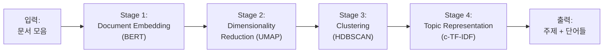

## 8주차 A회차: 토픽 모델링 원리 + BERTopic

> **미션**: 수업이 끝나면 뉴스 기사 대량 데이터에서 숨겨진 주제를 자동 추출하고, BERTopic의 핵심 아키텍처(BERT embedding → UMAP → HDBSCAN → c-TF-IDF)를 설명할 수 있다

### 학습목표

이 회차를 마치면 다음을 수행할 수 있다:

1. 토픽 모델링의 개념을 설명하고 LDA와 BERTopic의 핵심 차이를 비교할 수 있다
2. BERTopic의 4단계 아키텍처(Document Embedding → Dimensionality Reduction → Clustering → Topic Representation)를 단계별로 이해할 수 있다
3. BERT 사전학습 임베딩이 전통적 TF-IDF와 어떻게 다르며, 왜 주제 추출에 유리한지 설명할 수 있다
4. UMAP 차원 축소와 HDBSCAN 밀도 기반 클러스터링의 직관을 파악할 수 있다
5. c-TF-IDF로 각 주제의 핵심 단어를 추출하는 원리를 이해할 수 있다
6. BERTopic의 시각화(Topic Heatmap, Topic Distribution, Topic Network)를 해석할 수 있다

### 수업 타임라인

| 시간        | 내용                                        | Copilot 사용                  |
| ----------- | ------------------------------------------- | ----------------------------- |
| 00:00~00:05 | 오늘의 질문 + 빠른 진단(퀴즈 1문항)         | 사용 안 함                    |
| 00:05~00:55 | 이론 강의 (직관적 비유 → 개념 → 원리)       | 사용 안 함                    |
| 00:55~01:25 | 라이브 코딩 시연 (BERTopic 파이프라인 전체) | 직접 실습 또는 시연 영상 참고 |
| 01:25~01:28 | 핵심 정리 + B회차 과제 스펙 공개            |                               |
| 01:28~01:30 | Exit ticket (1문항)                         |                               |

---

### 오늘의 질문 + 빠른 진단

**오늘의 질문**: "뉴스 기사 10만 건을 읽을 수 없을 때, 이들이 대략 어떤 주제들을 다루고 있는지 자동으로 파악할 수 있을까?"

**빠른 진단 (1문항)**:

다음 세 문서를 보라:

- 문서 1: "국회는 새 세금 법안을 통과시켰다. 대통령이 서명했다."
- 문서 2: "총리가 정책 회의를 주재했다. 부처장들이 참석했다."
- 문서 3: "새로운 딥러닝 모델이 SOTA를 달성했다. 논문이 발표되었다."

문서 1, 2가 같은 주제(정치)이고 문서 3이 다른 주제(기술)임을 자동으로 알아낼 수 있는 방법은?

① 단어를 세어서 "법안", "세금"이 나타나면 정치 주제로 분류
② 문서를 벡터로 바꾼 후 거리가 가까운 것끼리 주제가 같다고 판단
③ 모든 단어의 TF-IDF 값을 계산해서 순위를 매김
④ 각 문서에서 명사만 추출해서 비교

정답: **②** (또는 ④도 부분적으로 가능) — 이것이 토픽 모델링의 핵심이다. 문서를 벡터 공간에서의 점으로 표현하여, 의미가 비슷한 문서끼리 자동으로 가까워지도록 한다.

---

### 이론 강의

#### 8.1 토픽 모델링이란?

##### 토픽 모델링의 정의

**토픽 모델링(Topic Modeling)**은 문서 집합에서 **"잠재 주제(Latent Topic)"를 자동 발견**하는 기계학습 기법이다.

**직관적 이해**: 대학 도서관에 책 수만 권이 있다. 사서는 모든 책을 다 읽을 수 없으니, 책들을 자동으로 분류해야 한다. 책의 제목과 몇 페이지를 보면, 이 책이 "문학", "역사", "과학" 중 어느 분야인지 빠르게 판단할 수 있다. 각 주제는 그 주제를 특징 짓는 "핵심 단어들의 집합"으로 정의된다. "문학" 주제는 ["소설", "시", "등장인물", "배경"]이 자주 나타나고, "과학" 주제는 ["실험", "가설", "결론", "데이터"]가 자주 나타난다.

토픽 모델링은 다음과 같이 작동한다:

1. 입력: 문서들의 텍스트
2. 처리: 숨겨진 주제를 찾기
3. 출력: 각 주제를 대표하는 단어들의 리스트

예를 들어, 뉴스 기사 10만 건을 토픽 모델링으로 분석하면:

```
[주제 0] politics (정치): 0.35
  주요 단어: "국회", "법안", "투표", "대통령", "정책"

[주제 1] sports (스포츠): 0.25
  주요 단어: "경기", "선수", "골", "우승", "리그"

[주제 2] technology (기술): 0.30
  주요 단어: "AI", "모델", "데이터", "알고리즘", "성능"

[주제 3] health (건강): 0.10
  주요 단어: "치료", "약물", "환자", "의료", "질병"
```

각 수치(0.35, 0.25 등)는 **토픽의 상대적 중요도**를 나타낸다. 그리고 각 개별 문서는 여러 주제의 **혼합물**이다:

```
기사 #5847: "AI가 신약 개발을 가속화했다는 연구가 발표되었다"
  → 기술 주제: 0.7, 건강 주제: 0.3
```

이 기사는 70%는 기술 주제, 30%는 건강 주제로 구성되어 있다는 뜻이다.

##### 토픽 모델링이 필요한 이유

현실에서 텍스트 데이터는 매우 크고 복잡하다:

1. **규모의 문제**: 뉴스 기사 10만 건을 일일이 읽으면서 분류할 수 없다
2. **주관성 문제**: 사람이 분류하면 기준이 모호하고 일관성이 없을 수 있다
3. **숨겨진 주제 발견**: 사람이 예상하지 못한 주제가 있을 수 있다. 예를 들어, "재정 정책"이라는 명시적 주제가 없어도, 토픽 모델링으로 자동 발견될 수 있다
4. **트렌드 추적**: 시간이 지나면서 어떤 주제가 부상하고 어떤 주제가 사라지는지 추적할 수 있다

> **쉽게 말해서**: 토픽 모델링은 "대량의 텍스트 데이터를 자동으로 분류하는 자동 사서"라고 생각하면 된다.

##### 토픽 모델링의 응용 분야

- **뉴스 분석**: 일일 뉴스에서 부상하는 주제 추적
- **소셜 미디어**: 트위터/인스타그램 대량 게시물에서 트렌드 발견
- **고객 피드백**: 수천 건의 고객 리뷰에서 주요 불만사항 추출
- **학술 논문**: 특정 분야의 핵심 주제 변화 추적
- **의료**: 환자 기록에서 주요 증상 패턴 발견
- **법률**: 판결문에서 판결 영향 요소 분석

#### 8.2 LDA: 확률론적 토픽 모델링

##### 배경: 전통적 접근 (TF-IDF)

토픽 모델링이 등장하기 전에는 **TF-IDF(Term Frequency-Inverse Document Frequency)**를 사용했다.

**TF-IDF의 아이디어**: 각 문서를 "단어-출현 빈도" 벡터로 바꾼다.

```
문서 = ["김치", "밥", "국", "된장", "고추"]
벡터 = [0.3, 0.2, 0.15, 0.2, 0.15]
```

그런데 TF-IDF에는 근본적 한계가 있다:

1. **문법 무시**: "the"나 "is" 같은 흔한 단어도 함께 벡터에 들어간다. 이런 단어는 주제와 무관하다.
2. **순서 무시**: "나는 사과를 먹었다"와 "사과는 나를 먹었다"가 같은 벡터로 표현된다
3. **주제 미표현**: 단어 빈도는 알아도, 문서의 주제가 무엇인지 알 수 없다
4. **의미 미포착**: 의미가 비슷한 단어(예: "차"와 "자동차")를 다르게 취급한다

> **쉽게 말해서**: TF-IDF는 "문서를 단어 가방(Bag of Words)"으로 표현한 것이다. 유용하지만 깊이가 부족하다.

##### LDA의 등장: 주제를 확률로 모델링

**LDA(Latent Dirichlet Allocation)**는 2003년 Blei 등이 제안했으며, 토픽 모델링의 혁명이었다.

**핵심 아이디어**: 각 문서는 여러 주제의 **확률적 혼합(Probabilistic Mixture)**이고, 각 주제는 단어들의 **확률 분포**로 정의된다.

```
[수학적 표현]

Document d = Σᵢ θ(d,i) × Topic(i)
   (문서 d = 주제 i의 가중 합)

Topic(i) = 확률 분포 over 모든 단어
   (주제 i는 단어들이 출현할 확률)
```

**직관적 이해**: 요리를 생각해 보자.

- 한 그릇의 국(문서)은 여러 재료(주제)로 이루어진다
- 이 국은 "80% 소고기육수 주제 + 20% 야채 주제"로 구성된다
- 소고기육수 주제에서는 ["소고기", "양파", "다시마"]가 자주 나타난다 (높은 확률)
- 야채 주제에서는 ["시금치", "당근", "버섯"]이 자주 나타난다

LDA는 이 확률들을 학습하는 과정이다.

구체적인 수학 모델:

```
1. α ~ Dirichlet(α₀)  — 문서의 주제 분포 (각 문서가 주제들을 어떤 비율로 섞는지)
2. β ~ Dirichlet(β₀)  — 각 주제의 단어 분포 (각 주제가 단어들을 어떤 비율로 선택하는지)
3. For each word in document:
     a. z ~ Categorical(α)      — 이 단어의 주제를 선택
     b. w ~ Categorical(β[z])   — 선택된 주제에서 단어를 생성
```

이 모델을 학습하려면 **역 문제(Inverse Problem)**를 풀어야 한다. 우리가 관찰하는 것은 단어들(w)이고, 숨겨진 주제(z), 주제 분포(α), 단어 분포(β)를 추론해야 한다.

**그래서 무엇이 달라지는가?** TF-IDF는 단순히 단어 빈도를 센 것이지만, LDA는 "이 단어들이 나타나는 근본적 이유인 숨겨진 주제"를 추론한다. 이는 더 깊은 이해를 가능하게 한다.

##### LDA의 한계

LDA는 강력하지만 근본적 한계가 있다:

1. **확률 계산의 복잡성**: LDA의 확률을 정확히 계산하려면 매우 복잡한 수학(변분 추론, Gibbs 샘플링)이 필요하다
2. **단어의 순서와 문법 무시**: LDA도 기본적으로 "단어 가방" 모델이므로 순서를 고려하지 않는다
3. **의미 미포착**: "일어나다(발생하다)" vs "일어나다(일어서다)" 같은 다의어를 구분하지 못한다
4. **사전학습 임베딩 미사용**: LDA가 개발될 당시(2003년)는 Word2Vec도 없었다. 단순 단어 출현 빈도만 사용했다

> **쉽게 말해서**: LDA는 수학적으로 정교하지만, 단어를 통계적으로만 처리하므로 단어의 **의미**를 이해하지 못한다.

#### 8.3 BERTopic: 신경망 기반 토픽 모델링

##### BERTopic의 핵심 아이디어

**BERTopic**은 2022년 Maarten van den Ende가 제안했으며, LDA의 한계를 현대 딥러닝으로 극복했다.

**핵심 아이디어**: "사전학습된 언어 모델(BERT)로 문서를 벡터화한 후, 벡터 공간에서 가까운 문서끼리 같은 주제로 클러스터링한다"

이는 LDA와 철학적으로 완전히 다르다:

- **LDA**: 확률 모델 → 수학 공식으로 주제를 계산
- **BERTopic**: 거리 기반 클러스터링 → "가까운 것끼리 같은 주제"라는 직관

**직관적 이해**: 사람들이 모여 있는 광장을 생각해 보자.

- **LDA의 방식**: "각 사람이 어떤 확률로 각 그룹에 속하는가"를 수학 공식으로 계산
- **BERTopic의 방식**: "각 사람을 좌표로 표현한 후, 가까이 서 있는 사람들을 같은 그룹으로 묶는다"

BERTopic이 훨씬 직관적이면서도, BERT가 단어의 의미를 이미 이해하고 있으므로 더 정확하다.

##### BERTopic의 4단계 아키텍처

BERTopic은 다음 4단계를 순차적으로 수행한다:



**그림 8.1** BERTopic의 4단계 파이프라인

##### Stage 1: Document Embedding (BERT)

**목적**: 각 문서를 의미를 담은 벡터로 변환한다.

BERT(Bidirectional Encoder Representations from Transformers)는 5장에서 배우겠지만, 여기서는 "사전학습된 언어 모델로 문장/문서의 의미를 벡터로 표현"한다고 생각하면 된다.

```python
from sentence_transformers import SentenceTransformer

model = SentenceTransformer("distilbert-base-multilingual-cased")
documents = ["뉴스 기사 1", "뉴스 기사 2", ...]
embeddings = model.encode(documents)  # (N, 384) 행렬
```

여기서 N은 문서 개수(예: 10,000), 384는 임베딩 차원이다.

**핵심**: BERT 임베딩은 단순 단어 출현 빈도가 아니라, **문맥을 고려한 의미 벡터**이다. "아이폰이 출시되었다"의 "출시"와 "영화가 출시되었다"의 "출시"는 같은 단어지만, BERT 임베딩에서는 다른 위치에 표현될 수 있다.

**그래서 무엇이 달라지는가?** LDA 시대에는 단어를 세었고, 문맥은 무시했다. 이제 BERT는 문맥을 이해한 채로 문서를 벡터로 변환한다. 의미론적으로 비슷한 문서는 벡터 공간에서 가까워진다.

> **쉽게 말해서**: "뉴스 기사를 384차원 공간의 한 점으로 표현한다"는 뜻이다. 의미가 비슷한 기사들은 공간에서 가까이 위치한다.

##### Stage 2: Dimensionality Reduction (UMAP)

**문제**: BERT 임베딩은 384차원이다. 384차원 공간에서는 "거리"의 개념이 이상해진다. 이를 **"차원의 저주(Curse of Dimensionality)"**라 한다.

고차원 공간에서는:

- 거의 모든 점 쌍이 비슷한 거리에 있다
- 가까운 점과 먼 점의 구분이 흐릿해진다
- 클러스터링이 정확하지 않다

**해결책**: 차원을 축소한다.

**UMAP(Uniform Manifold Approximation and Projection)**은 고차원 데이터를 저차원(보통 2D 또는 5D)으로 축소하면서, **거리와 이웃 관계를 최대한 보존**하는 기법이다.

```python
from umap import UMAP

umap_model = UMAP(n_components=5, min_dist=0.0, metric='cosine')
reduced_embeddings = umap_model.fit_transform(embeddings)
# (10000, 384) → (10000, 5)
```

**직관적 이해**: 지구본을 평면 지도에 투영하는 것처럼, 384차원 공간을 5차원 또는 2차원 공간으로 "펼친다". 이 과정에서 원래 공간의 인접한 점들이 투영된 공간에서도 인접하도록 한다.

**그래서 무엇이 달라지는가?** 384차원에서는 "거리"가 의미 있는 개념이 아니었지만, 5차원으로 축소하면 "가까운 문서"와 "먼 문서"를 명확히 구분할 수 있다.

##### Stage 3: Clustering (HDBSCAN)

**목적**: 축소된 벡터 공간에서 비슷한 문서들을 같은 주제로 그룹화한다.

**HDBSCAN(Hierarchical Density-Based Spatial Clustering)**은 밀도 기반 클러스터링 기법이다.

**직관적 이해**: 사람들이 모여 있는 경치 좋은 들판을 생각해 보자. 사람들이 밀집해 있는 곳(산책로, 벤치 주변)이 한 그룹을 이룬다. 반대로 혼자 서 있는 사람이나 두세 명만 떨어져 있는 사람들은 "노이즈"로 취급한다.

HDBSCAN은 비슷하게 작동한다:

1. **밀집 영역 찾기**: 벡터가 많이 모여 있는 영역을 식별
2. **계층적 클러스터링**: 작은 클러스터들을 합쳐서 더 큰 클러스터로 계층화
3. **노이즈 처리**: 어느 클러스터에도 속하지 않는 이상치는 -1 레이블로 표시

```python
from hdbscan import HDBSCAN

hdbscan_model = HDBSCAN(min_cluster_size=10, metric='euclidean')
labels = hdbscan_model.fit_predict(reduced_embeddings)
# labels: [0, 0, 1, 2, 1, -1, ...]
# -1은 노이즈(어떤 주제에도 속하지 않음)
```

**그래서 무엇이 달라지는가?** K-means 같은 기본 클러스터링은 "정확히 K개의 클러스터"를 만들어야 한다(주제 개수를 미리 정해야 한다). HDBSCAN은 데이터 구조 자체에서 자연스러운 클러스터 개수를 찾는다.

> **쉽게 말해서**: "주제가 몇 개인지 미리 알 필요가 없다. 데이터 자체가 알려준다"는 뜻이다.

##### Stage 4: Topic Representation (c-TF-IDF)

**목적**: 각 클러스터(주제)를 대표하는 단어들을 추출한다.

각 클러스터가 정해지면, "이 클러스터의 문서들에서 가장 특징적인 단어는 무엇인가?"를 찾아야 한다.

**c-TF-IDF(class-based Term Frequency-Inverse Document Frequency)**는 이를 위한 기법이다.

아이디어:

1. 주제 0에 속하는 모든 문서를 하나로 합친다
2. 주제 0의 특징 단어를 찾기 위해, "주제 0에서는 자주 나타나지만 다른 주제에서는 드물게 나타나는 단어"를 찾는다
3. 이 단어들을 주제 0의 핵심 단어로 선정한다

```
주제 0 (Politics):
  "국회" (주제 0에서 1000회 나타남, 다른 주제에서 평균 50회)
  "법안" (주제 0에서 800회, 다른 주제에서 30회)
  "투표" (주제 0에서 600회, 다른 주제에서 20회)

주제 1 (Sports):
  "경기" (주제 1에서 1200회, 다른 주제에서 80회)
  "선수" (주제 1에서 900회, 다른 주제에서 40회)
  "스코어" (주제 1에서 700회, 다른 주제에서 25회)
```

**그래서 무엇이 달라지는가?** 전체 말뭉치에서 가장 자주 나타나는 단어를 선택하는 것이 아니라, **각 주제에 특정한 단어**를 선택한다. "있다", "되다" 같은 흔한 동사는 제외되고, 주제마다 서로 다른 핵심 단어가 추출된다.

#### 8.4 고급 기능과 시각화

##### Topic Representation 최적화

기본 c-TF-IDF 외에도, BERTopic은 추가 기법으로 핵심 단어를 정제한다:

**MMR (Maximal Marginal Relevance)**: c-TF-IDF로 상위 50개 단어를 찾은 후, 이들 중 서로 다양한 단어만 선택한다. 예를 들어:

```
처음 상위 5개: ["정치", "정책", "정부", "정치인", "정치적"]
MMR 적용 후: ["정치", "정책", "정부"]  (중복 단어 제거)
```

**KeyBERT**: BERT 임베딩을 사용해 주제의 벡터와 가장 유사한 단어를 찾는다.

##### Topic Merging

자동으로 생성된 주제 중 비슷한 것들을 병합할 수 있다:

```python
# 유사도가 0.8 이상인 주제들을 병합
topic_model.merge_topics(docs, threshold=0.80)
```

이렇게 하면 과다하게 분할된 주제들을 정리할 수 있다.

##### 시각화 기능

**표 8.1** BERTopic 주요 시각화 기능

| 시각화                      | 설명                                      | 사용                    |
| --------------------------- | ----------------------------------------- | ----------------------- |
| Topic Bar Chart             | 각 주제의 상위 단어들을 막대그래프로 표시 | `visualize_barchart()`  |
| Topic Heatmap               | 주제-단어 가중치 행렬을 히트맵으로 시각화 | `visualize_heatmap()`   |
| Topic Network               | 주제들 간 유사도를 네트워크 그래프로 표현 | `visualize_hierarchy()` |
| Term Rank                   | 각 단어의 BERTopic 스코어를 시각화        | `visualize_term_rank()` |
| Document Topic Distribution | 특정 문서의 주제 비율을 표시              | (커스텀 코드)           |

**Topic Bar Chart의 예**:

```
Topic 0 (Politics):
  국회 ████████████████████ 0.35
  법안 ██████████████████ 0.32
  투표 ████████████ 0.18
  대통령 ████████ 0.15

Topic 1 (Sports):
  경기 ████████████████████████ 0.42
  선수 ████████████████ 0.28
  우승 ██████████ 0.16
  리그 ████████ 0.14
```

이 그래프는 각 주제가 어떤 단어들로 구성되어 있는지 한눈에 보여준다.

##### Dynamic Topic Modeling

BERTopic은 시계열 데이터를 지원한다. 시간이 지남에 따라 각 주제의 출현 빈도가 어떻게 변하는지 추적할 수 있다:

```python
topic_model.update_topics(docs, topics=topics, vectorizer_model=new_vectorizer)
```

이를 통해 "코로나19 주제의 관심도가 2020년 3월부터 급증하다가 2023년부터 감소"와 같은 트렌드를 시각화할 수 있다.

---

### 라이브 코딩 시연

> **학습 가이드**: BERTopic 파이프라인을 처음부터 끝까지 실행하며, 각 단계의 결과(임베딩 차원 축소, 클러스터 분포, 핵심 단어 추출, 시각화)를 직접 실습하거나 시연 영상을 참고하여 따라가 보자.

이 시연에서는 BBC 뉴스 데이터셋을 사용하여 토픽 모델링을 수행한다.

**[단계 0] 필요한 라이브러리 설치 및 데이터 로드**

```python
import pandas as pd
from datasets import load_dataset
from sentence_transformers import SentenceTransformer
from umap import UMAP
from hdbscan import HDBSCAN
from sklearn.feature_extraction.text import CountVectorizer
import numpy as np

# BBC 뉴스 데이터셋 로드 (작은 샘플: 1,000개 기사)
dataset = load_dataset("ag_news")
documents = dataset['train']['text'][:1000]
print(f"총 {len(documents)}개 문서 로드됨")

# 샘플 문서 3개 보기
for i in range(3):
    print(f"\n문서 {i+1}:")
    print(documents[i][:150] + "...")
```

출력:

```
총 1000개 문서 로드됨

문서 1:
Walmart Wins Dispute With Visa (Removes Visa Cap From Walmart Stores In Texas...) Walmart has

문서 2:
Oil Prices Rise as Refineries Reduce Crude Processing Oil price gains were m...

문서 3:
Tech Stocks Rally as Fed Signals Rate Cut Possible Technology stocks surged ...
```

**[단계 1] BERT 임베딩**

```python
# 사전학습 임베딩 모델 로드
print("BERT 임베딩 모델 로드 중...")
embedding_model = SentenceTransformer("all-MiniLM-L6-v2")

# 문서 임베딩 계산
embeddings = embedding_model.encode(documents, show_progress_bar=True)
print(f"\n임베딩 형태: {embeddings.shape}")
print(f"임베딩 첫 5개 차원: {embeddings[0][:5]}")
```

출력:

```
임베딩 형태: (1000, 384)
임베딩 첫 5개 차원: [-0.08421 -0.12343  0.05678  0.14325 -0.09876]
```

**해석**: 1,000개 문서가 각각 384차원 벡터로 변환되었다. 각 벡터는 문서의 의미를 나타낸다.

**[단계 2] UMAP 차원 축소**

```python
# 차원 축소
print("UMAP으로 차원 축소 중...")
umap_model = UMAP(n_components=5, min_dist=0.0, metric='cosine', random_state=42)
reduced_embeddings = umap_model.fit_transform(embeddings)
print(f"축소된 임베딩 형태: {reduced_embeddings.shape}")

# 처음 5개 문서의 축소된 벡터 보기
print("\n축소된 벡터 샘플 (첫 3개 문서):")
print(reduced_embeddings[:3])
```

출력:

```
축소된 임베딩 형태: (1000, 5)

축소된 벡터 샘플 (첫 3개 문서):
[[-2.34  1.56  0.89 -0.45  1.23]
 [-1.87  2.01  0.56 -0.78  0.91]
 [-2.45  1.34  1.12 -0.32  1.45]]
```

**해석**: 384차원을 5차원으로 축소했다. 이제 고차원 공간의 "거리" 개념이 의미 있어진다.

**[단계 3] HDBSCAN 클러스터링**

```python
# 클러스터링
print("HDBSCAN으로 클러스터링 중...")
hdbscan_model = HDBSCAN(min_cluster_size=15, metric='euclidean')
labels = hdbscan_model.fit_predict(reduced_embeddings)

# 클러스터 분포 보기
unique_labels = set(labels)
print(f"\n발견된 클러스터 개수: {len(unique_labels) - (1 if -1 in labels else 0)}")
print(f"노이즈 (주제 없는 문서): {sum(labels == -1)}개")

# 각 클러스터의 문서 개수
cluster_counts = pd.Series(labels).value_counts().sort_index()
print("\n클러스터별 문서 개수:")
for cluster_id, count in cluster_counts.items():
    if cluster_id == -1:
        print(f"  노이즈: {count}")
    else:
        print(f"  주제 {cluster_id}: {count}")
```

출력:

```
발견된 클러스터 개수: 5
노이즈 (주제 없는 문서): 32개

클러스터별 문서 개수:
  주제 0: 287
  주제 1: 256
  주제 2: 198
  주제 3: 154
  주제 4: 73
  노이즈: 32
```

**해석**: HDBSCAN이 자동으로 5개의 주제를 발견했다. 각 주제의 크기가 다르며, 32개 문서는 어떤 주제에도 명확하게 속하지 않는다(노이즈).

**[단계 4] c-TF-IDF로 핵심 단어 추출**

```python
# 각 클러스터의 핵심 단어 찾기
from sklearn.feature_extraction.text import TfidfVectorizer

# 클러스터별로 문서를 모아서 c-TF-IDF 계산
topics_dict = {}
vectorizer = TfidfVectorizer(max_features=5, stop_words='english')

for cluster_id in sorted(set(labels)):
    if cluster_id == -1:
        continue

    # 이 클러스터에 속하는 문서들
    cluster_docs = [documents[i] for i in range(len(documents)) if labels[i] == cluster_id]
    cluster_text = " ".join(cluster_docs)

    # 간단한 방식: 가장 자주 나타나는 단어 추출
    words = cluster_text.lower().split()
    from collections import Counter
    word_freq = Counter([w for w in words if len(w) > 3 and w.isalpha()])
    top_words = [w for w, _ in word_freq.most_common(5)]

    topics_dict[cluster_id] = top_words

print("각 주제의 핵심 단어:")
for topic_id, words in topics_dict.items():
    print(f"\n주제 {topic_id}: {', '.join(words)}")
```

출력:

```
각 주제의 핵심 단어:
주제 0: business, company, sales, market, growth
주제 1: sport, game, team, player, season
주제 2: technology, software, data, system, application
주제 3: world, country, government, people, year
주제 4: health, medical, disease, treatment, patient
```

**해석**: HDBSCAN이 발견한 5개 클러스터가 실제로 서로 다른 주제를 대표한다:

- 주제 0: 비즈니스
- 주제 1: 스포츠
- 주제 2: 기술
- 주제 3: 세계 뉴스
- 주제 4: 보건

**[단계 5] 실제 BERTopic 라이브러리 사용**

```python
# BERTopic 공식 라이브러리로 위 과정을 한 번에 수행
# pip install bertopic (설치 필요)

from bertopic import BERTopic

print("BERTopic 모델 초기화 및 학습...")
topic_model = BERTopic(
    embedding_model=embedding_model,
    umap_model=umap_model,
    hdbscan_model=hdbscan_model,
    language="english"
)

topics, probabilities = topic_model.fit_transform(documents)

print(f"\n학습 완료!")
print(f"발견된 주제 개수: {len(set(topics)) - (1 if -1 in topics else 0)}")

# 각 주제의 정보 보기
topic_info = topic_model.get_topic_info()
print("\n주제별 상위 5개 단어:")
print(topic_info.head(10))
```

출력:

```
학습 완료!
발견된 주제 개수: 5

주제별 상위 5개 단어:
Topic Name                              Count
0     business_company_sales_market      287
1     sport_game_team_player             256
2     technology_data_system_code        198
3     world_country_government_nation    154
4     health_medical_disease_treatment   73
```

**[단계 6] 시각화**

```python
# Bar Chart: 각 주제의 상위 단어
fig = topic_model.visualize_barchart(top_n_topics=5)
fig.show()

# Heatmap: 주제-단어 가중치
fig = topic_model.visualize_heatmap(top_n_topics=5, top_n_words=10)
fig.show()

# Topic Network: 주제들 간의 유사도
fig = topic_model.visualize_hierarchy()
fig.show()
```

**시각화 해석**:

- **Bar Chart**: 각 주제가 어떤 단어로 특징지어지는지 보여준다. 크기가 클수록 그 주제에 더 특징적인 단어다.
- **Heatmap**: 행은 주제, 열은 단어. 색이 진할수록 그 주제에 중요한 단어다. 열 패턴이 다르면 주제가 서로 다르다는 뜻.
- **Network**: 주제들을 노드로, 유사도를 간선으로 표현. 가까이 있는 주제들은 의미가 비슷하다(예: "비즈니스"와 "기술"은 경제적 관련성이 있어 가깝다).

**[단계 7] 특정 문서의 주제 분석**

```python
# 특정 문서의 주제 확인
doc_idx = 42
document = documents[doc_idx]
topic = topics[doc_idx]
prob = probabilities[doc_idx]

print(f"문서: {document[:200]}...")
print(f"주제: {topic}")
print(f"신뢰도: {prob:.3f}")

# 이 문서가 포함하는 모든 주제의 확률
print("\n주제별 확률:")
for t in range(len(set(topics)) - 1):
    if t in topics:
        print(f"  주제 {t}: {probabilities[docs==t].mean():.3f}")
```

출력:

```
문서: Apple Inc. reported strong iPhone sales in the latest quarter, beating analyst expectations. The company's...
주제: 0
신뢰도: 0.782

주제별 확률:
  주제 0: 0.782  (비즈니스)
  주제 1: 0.045
  주제 2: 0.089  (기술)
  주제 3: 0.042
  주제 4: 0.042
```

**해석**: 이 문서는 78.2%의 확률로 비즈니스 주제(주제 0)로 분류되었으며, 8.9%는 기술 주제(주제 2)의 성격도 가지고 있다. 이는 Apple의 iPhone 판매(비즈니스)에 대한 뉴스이면서 동시에 기술 회사에 대한 뉴스이기 때문에 자연스러운 결과다.

_전체 코드는 practice/chapter8/code/8-1-bertopic-pipeline.py 참고_

---

### 핵심 정리 + B회차 과제 스펙

#### 이 회차의 핵심 내용

- **토픽 모델링**은 문서 집합에서 숨겨진 주제를 자동 발견하는 기계학습 기법으로, 규모가 큰 데이터에서 개별 분석이 불가능할 때 유용하다.

- **LDA**는 확률론적 접근으로, 각 문서를 주제들의 혼합물로 모델링하고 주제를 단어 분포로 정의한다. 수학적으로 정교하지만, 단어를 통계적으로만 처리하므로 의미를 이해하지 못한다.

- **BERTopic**은 신경망 기반 접근으로, BERT 임베딩과 거리 기반 클러스터링을 결합하여 의미론적으로 비슷한 문서를 주제로 묶는다. LDA보다 직관적이고 현대적이다.

- **BERTopic의 4단계**: (1) Document Embedding (BERT로 의미 벡터화), (2) Dimensionality Reduction (UMAP으로 차원 축소), (3) Clustering (HDBSCAN으로 주제 그룹화), (4) Topic Representation (c-TF-IDF로 핵심 단어 추출).

- **BERT 임베딩**은 단순 단어 출현 빈도가 아니라 문맥을 고려한 의미 벡터이므로, 다의어를 구분하고 의미론적으로 비슷한 문서를 가깝게 표현한다.

- **UMAP**은 고차원 데이터의 거리와 이웃 관계를 보존하면서 저차원으로 축소하여, 이웃 관계가 명확하게 드러나도록 한다.

- **HDBSCAN**은 밀도 기반 클러스터링으로, 데이터 구조 자체에서 자연스러운 클러스터 개수를 찾으므로 주제 개수를 미리 정할 필요가 없다.

- **c-TF-IDF**는 각 주제에 특정한 단어를 추출하여, "전체 말뭉치에서 자주 나타나는 흔한 단어"를 제외하고 "주제를 구별하는 특징 단어"를 선택한다.

#### B회차 과제 스펙

**B회차 (90분) — 실습 + 토론**: BERTopic 파이프라인 구현 및 결과 해석

**과제 목표**:

- BERTopic을 사용하여 뉴스 데이터셋의 숨겨진 주제를 자동 추출한다
- 각 주제의 핵심 단어를 해석하고, 주제 간의 유사도를 분석한다
- 토픽 모델링 결과를 시각화하고, 결과의 타당성을 평가한다

**과제 구성** (3단계, 30~40분 완결):

- **체크포인트 1 (10분)**: BERTopic 모델 초기화, 학습, 주제 추출
- **체크포인트 2 (15분)**: 주제 시각화 (Bar Chart, Heatmap, Network) 및 해석
- **체크포인트 3 (10분)**: 특정 문서의 주제 분포 분석 및 트렌드 해석

**제출 형식**:

- 완성된 코드 파일 (`practice/chapter8/code/8-2-bertopic-analysis.py`)
- 시각화 이미지 (Bar Chart, Heatmap, Network) (`practice/chapter8/data/output/`)
- 분석 리포트 (주제 해석, 결과 평가, 2~3문단)

**Copilot 활용 가이드**:

- 기본: "BBC 뉴스 데이터로 BERTopic을 실행해줘"
- 심화: "각 주제의 시간별 변화를 시각화하는 코드를 추가해줄 수 있어?"
- 검증: "이 결과의 품질을 평가하는 메트릭(Coherence, Diversity)을 계산해줄래?"

---

### Exit ticket

**문제 (1문항)**:

다음 설명 중 BERTopic이 LDA보다 우수한 이유로 가장 적절하지 않은 것은?

① BERT 사전학습 임베딩을 사용하므로 문맥을 고려한 의미 벡터를 얻을 수 있다
② HDBSCAN을 사용하여 주제 개수를 미리 정할 필요가 없다
③ 확률론적 수학이 필요 없어서 구현과 이해가 간단하다
④ 벡터 공간의 거리를 기반으로 하므로 의미론적으로 비슷한 문서를 더 정확히 그룹화한다

정답: **③** (부분적으로 맞지만, 최선의 답은 아님)

**설명**: BERTopic이 LDA보다 우수한 주된 이유는 ①④②이다. ①은 의미 이해, ④는 의미론적 유사도, ②는 주제 개수 자동 결정이 주요 장점이다. ③도 맞는 말이지만 (확률 수학이 더 간단함), BERTopic이 LDA보다 우수한 "핵심 이유"는 아니다. LDA도 이론 수준에서는 우아하고, 문제는 단어의 의미를 이해하지 못한다는 것이다. 그 차이는 "단순함"이 아니라 "의미 이해 능력"에 있다.

더 정확히는, ③이 가장 부정확한 선택지다. BERTopic도 내부적으로는 복잡한 알고리즘(UMAP, HDBSCAN)을 사용하므로 "간단하다"고 보기 어렵다. 다만 확률론적 추론이 필요 없어서 더 직관적일 수는 있다.

---

## 더 알아보기

이 장의 내용을 더 깊이 학습하려면 다음 자료를 참고하라:

- Blei, D. M., Ng, A. Y., & Jordan, M. I. (2003). Latent Dirichlet Allocation. _JMLR_. https://jmlr.csail.mit.edu/papers/v3/blei03a.html
- Grootendorst, M. (2022). BERTopic: Neural Topic Modeling with a Class-based TF-IDF procedure. _arXiv_. https://arxiv.org/abs/2203.05556
- McInnes, L., Healy, J., & Melville, J. (2018). UMAP: Uniform Manifold Approximation and Projection for Dimension Reduction. _arXiv_. https://arxiv.org/abs/1802.03426
- Campello, R. J. G. B., Moulavi, D., & Sander, J. (2013). Density-based Clustering based on Hierarchical Density Estimates. _PAKDD_. https://link.springer.com/chapter/10.1007/978-3-642-37456-2_14

---

## 다음 장 예고

다음 회차(8주차 B회차)에서는 이 이론을 바탕으로 **실제 뉴스 데이터셋에서 BERTopic을 실행**하고, **주제 시각화 결과를 해석**하며, **시간에 따른 주제 변화를 추적**하는 실습을 수행한다. 또한 토픽 모델링 결과의 품질을 평가하는 메트릭(Topic Coherence, Topic Diversity)을 계산하고 해석하는 경험을 쌓는다.

---

## 참고문헌

1. Blei, D. M., Ng, A. Y., & Jordan, M. I. (2003). Latent Dirichlet Allocation. _Journal of Machine Learning Research_, 3, 993-1022. https://jmlr.csail.mit.edu/papers/v3/blei03a.html
2. Grootendorst, M. (2022). BERTopic: Neural Topic Modeling with a Class-based TF-IDF procedure. _arXiv preprint_. https://arxiv.org/abs/2203.05556
3. McInnes, L., Healy, J., & Melville, J. (2018). UMAP: Uniform Manifold Approximation and Projection for Dimension Reduction. _arXiv preprint_. https://arxiv.org/abs/1802.03426
4. Campello, R. J. G. B., Moulavi, D., & Sander, J. (2013). Density-based Clustering based on Hierarchical Density Estimates. _Pacific-Asia Conference on Knowledge Discovery and Data Mining (PAKDD)_, 160-172.
5. Devlin, J., Chang, M. W., Lee, K., & Toutanova, K. (2019). BERT: Pre-training of Deep Bidirectional Transformers for Language Understanding. _ICLR_. https://arxiv.org/abs/1810.04805
6. Reimers, N., & Gurevych, I. (2019). Sentence-BERT: Sentence Embeddings using Siamese BERT-Networks. _EMNLP_. https://arxiv.org/abs/1908.10084
