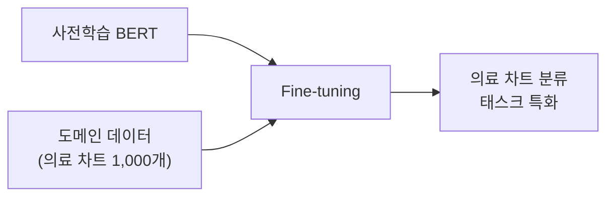

## 9주차 A회차: LLM 파인튜닝 (1) — Full Fine-tuning

> **미션**: 수업이 끝나면 사전학습된 LLM을 자신의 도메인 데이터로 파인튜닝하고, Trainer API를 활용하여 모델 성능을 최적화할 수 있다

### 학습목표

이 회차를 마치면 다음을 수행할 수 있다:

1. 사전학습(Pre-training)과 파인튜닝(Fine-tuning)의 개념적 차이를 설명하고 Transfer Learning의 이점을 이해할 수 있다
2. Full Fine-tuning이 작동하는 원리를 이해하고, 계산 복잡도 및 메모리 비용을 설명할 수 있다
3. 과적합을 방지하기 위한 전략(Validation, Early Stopping, Learning Rate Scheduling)을 적용할 수 있다
4. Hugging Face Trainer API의 주요 구성 요소(TrainingArguments, Datasets, Trainer)를 설명하고 활용할 수 있다
5. Confusion Matrix와 다양한 평가 지표를 해석하여 파인튜닝 결과를 분석할 수 있다
6. 클래스 불균형 문제를 진단하고, 적절한 해결 방법(가중치 조정, Focal Loss)을 제안할 수 있다

### 수업 타임라인

| 시간        | 내용                                               | Copilot 사용                  |
| ----------- | -------------------------------------------------- | ----------------------------- |
| 00:00~00:05 | 오늘의 질문 + 빠른 진단(퀴즈 1문항)                | 사용 안 함                    |
| 00:05~00:55 | 이론 강의 (직관적 비유 → 개념 → 원리)              | 사용 안 함                    |
| 00:55~01:25 | 라이브 코딩 시연 (작은 데이터셋으로 BERT 파인튜닝) | 직접 실습 또는 시연 영상 참고 |
| 01:25~01:28 | 핵심 정리 + B회차 과제 스펙 공개                   |                               |
| 01:28~01:30 | Exit ticket (1문항)                                |                               |

---

### 오늘의 질문 + 빠른 진단

**오늘의 질문**: "100만 개 문서로 사전학습된 BERT가 있는데, 나는 의료 차트 분류 태스크에만 관심이 있다. 1,000개 의료 문서로 모델을 다시 처음부터 학습해야 할까, 아니면 기존 모델을 조정하면 될까?"

**빠른 진단 (1문항)**:

다음 중 파인튜닝(Fine-tuning)의 가장 큰 장점은?

① BERT를 처음부터 다시 학습하지 않아도 된다
② 매우 작은 데이터셋(수백 문장)만으로도 도메인 특화 성능을 얻을 수 있다
③ 사전학습 단계에서 학습한 일반적 언어 패턴을 활용한다
④ 모두 해당한다

정답: **④** — 파인튜닝의 가치는 이 세 가지를 모두 제공한다는 데 있다.

---

### 이론 강의

#### 9.1 파인튜닝의 이해

##### 왜 파인튜닝이 필요한가?

8주차에서 배운 BERT, GPT 같은 대규모 사전학습 모델(Pre-trained Language Model, PLM)은 놀라운 능력을 가지고 있다. 위키피디아나 인터넷 문서로 학습한 모델은 한국어 문법, 상식, 추론 능력을 갖추었다. 그러나 이 모델들은 **일반 목적의 표현**을 학습했을 뿐이다.

의료 차트 분류라는 매우 구체적인 태스크를 생각해 보자. 의료 기록에는 "혈당 수치", "항응고제", "인슐린 저항성" 같은 도메인 특화 용어와 패턴이 넘쳐난다. 일반 데이터로 학습한 BERT는 이 용어들의 뉘앙스를 모를 수 있다.

**직관적 이해**: 대학교 출신의 지원자를 회사에서 재교육한다고 생각해 보자. 대학에서 배운 교양 지식(일반적 언어능력)은 이미 갖추었으므로, 회사에 필요한 구체적 기술(의료 도메인 용어와 패턴)만 집중적으로 교육하면 된다. 처음부터 모든 것을 가르치는 것보다 훨씬 빠르고 효율적이다.

**파인튜닝(Fine-tuning)**은 바로 이 개념이다. 사전학습된 모델의 **모든 파라미터를 업데이트**하되, 도메인 특화 데이터로 짧은 기간 학습하여 태스크에 맞게 조정한다.

**그래서 무엇이 달라지는가?**

- **처음부터 학습**: 수조(trillions) 토큰이 필요하고, 수주일의 학습이 필요하며, 엄청난 연산 비용이 든다
- **파인튜닝**: 수천~수만 문장이면 충분하고, 몇 시간~며칠이면 충분하며, 단일 GPU로도 가능하다

##### Pre-training vs Fine-tuning: 학습 목표의 차이

**Pre-training의 목표**: 언어의 **일반 원리**를 학습한다.

- 마스킹된 단어 예측 (BERT: Masked Language Modeling, MLM)
- 다음 문장 예측 (BERT: Next Sentence Prediction, NSP)
- 다음 토큰 예측 (GPT: Causal Language Modeling)

수조 개의 다양한 문서에서 이런 일반적 패턴을 학습하면, 모델은 문법, 상식, 관계 추론 능력을 갖춘다.


**그림 9.1** 사전학습 단계: 광범위한 데이터, 광범위한 목표

**Fine-tuning의 목표**: **특정 태스크**에 모델을 적응시킨다.

- 감성 분류 (긍정/부정)
- 개체명 인식 (Named Entity Recognition)
- 질의응답 (Question Answering)
- 의료 차트 분류 (도메인 특화)

작은 도메인 데이터(수백~수만 문장)에서 파인튜닝하면, 모델의 표현이 그 태스크에 최적화된다.



**그림 9.2** 파인튜닝 단계: 작은 데이터, 특화된 목표

> **쉽게 말해서**: 사전학습은 "모든 신문을 정독하여 일반적 지식을 쌓는 것"이고, 파인튜닝은 "의료 전문지를 집중적으로 읽으며 의료 지식을 깊게 하는 것"이다.

##### Transfer Learning: 지식의 이전

**Transfer Learning** (전이학습)은 한 태스크에서 학습한 지식을 다른 태스크에 활용하는 기법이다. 파인튜닝은 Transfer Learning의 한 방식이다.

Transfer Learning이 가능한 이유는 신경망의 **계층적 표현(Hierarchical Representation)**이다:

- **낮은 층(Early layers)**: 글자, 단어, 문법 같은 저수준 패턴을 학습한다. 이는 거의 모든 자연어 태스크에 필요하다.
- **높은 층(Higher layers)**: 문맥, 의미, 담화 구조 같은 고수준 패턴을 학습한다. 태스크에 따라 다르게 필요하다.

파인튜닝 과정에서:

1. **저수준 층**(예: Embedding, 초기 Transformer 층)은 변화가 작다. 이미 학습된 언어 기본 패턴은 충분히 좋기 때문이다.
2. **고수준 층**(예: 최후 Transformer 층, Classification Head)은 크게 변한다. 도메인 특화 패턴을 학습해야 하기 때문이다.

```
사전학습 BERT (일반적)
    ↓
    [임베딩 층] ← 변화 최소
    [첫 6개 Transformer 층] ← 변화 작음
    [마지막 6개 Transformer 층] ← 변화 큼
    [Classification Head] ← 변화 극대
    ↓
파인튜닝 BERT (도메인 특화)
```

**그래서 무엇이 달라지는가?** Transfer Learning이 없다면, 의료 분류 모델을 만들기 위해 의료 데이터만으로 BERT를 모두 처음부터 학습해야 한다. 그러나 Transfer Learning으로 인해, 일반 데이터로 학습한 낮은 층들을 재사용하고 높은 층들만 미세 조정하면 된다. 결과적으로 학습에 필요한 데이터량을 1/100 이상 줄일 수 있다.

##### Full Fine-tuning 원리

**Full Fine-tuning**은 모델의 **모든 파라미터를 업데이트**하는 방식이다. (다음 주 10주차에서 배울 PEFT와 대비된다.)

Full Fine-tuning의 절차:

1. **사전학습 모델 로드**: BERT, GPT-2 등의 사전학습 모델을 메모리에 불러온다.
2. **Classification Head 추가**: 원래 모델의 출력층([CLS] 토큰 표현)에 선형 층을 추가하여 도메인 태스크에 맞춘다. 예: 의료 차트 5개 클래스 분류 → Linear(768 → 5)
3. **도메인 데이터로 학습**: 도메인 데이터(의료 차트 1,000개)로 역전파를 수행한다. 이 과정에서 모든 층의 가중치가 업데이트된다.
4. **검증 세트로 모니터링**: 검증 성능이 더 이상 개선되지 않으면 학습을 멈춘다(Early Stopping).

```python
# 간단한 의사 코드
model = load_pretrained_model("bert-base-korean")  # 모든 파라미터 로드
model.classification_head = nn.Linear(768, 5)  # 새 분류 층 추가 (초기화됨)

optimizer = Adam(lr=5e-5)  # 매우 작은 학습률
for epoch in range(10):
    for batch in train_data:
        logits = model(batch)  # 모든 층을 통과
        loss = cross_entropy(logits, batch['label'])
        loss.backward()  # 모든 파라미터에 대해 기울기 계산
        optimizer.step()  # 모든 파라미터 업데이트
        optimizer.zero_grad()
```

**핵심 특징**:

- **사용 파라미터**: 모든 파라미터 (예: BERT-Base는 110M개)
- **학습 가능성**: 모두 학습 가능 (`requires_grad = True`)
- **메모리 사용**: 매우 크다 (∼500MB 이상)
- **학습 속도**: 느리다 (1 에포크에 수십분)

> **직관적 이해**: Full Fine-tuning은 직원 전체를 새로운 프로젝트 팀으로 재배치하는 것이다. 모두 프로젝트에 맞게 새로운 역할을 배우고 적응해야 하므로 시간이 오래 걸리지만, 최대한의 성능을 낼 수 있다. (10주차에 배울 PEFT는 일부 직원만 새로운 역할을 배우고 나머지는 기존 역할을 유지하는 방식이다.)

##### 과적합 방지 전략

파인튜닝의 가장 큰 위험은 **과적합(Overfitting)**이다. 도메인 데이터가 작으므로, 모델이 데이터의 구체적 패턴(노이즈)을 학습하고 일반화되지 않을 수 있다.

예를 들어, 의료 차트 100개만으로 파인튜닝한다면, 모델은 "이 환자의 혈당이 높으면 당뇨병"이라는 완벽한 패턴을 학습할 수 있다. 하지만 실제 데이터에는 예외가 많고, 모델은 이런 예외를 처리하지 못한다.

**전략 1: Validation Set 분리**

파인튜닝 데이터를 반드시 세 부분으로 나눈다:

- **Train Set (80%)**: 모델 학습용
- **Validation Set (10%)**: 검증 성능 모니터링용 (매 에포크 후 평가)
- **Test Set (10%)**: 최종 성능 평가용 (학습 후 1회 평가)

학습 중에는 Train Set에서만 역전파하고, Validation Set의 성능을 모니터링한다. 이를 통해 **과적합 신호**를 조기에 감지할 수 있다.

```
학습 곡선 (Train vs Validation Loss):

Loss
  |     Train Loss (계속 감소)
  |    /
  | /
  |/______
  |        \
  |         \ Validation Loss (증가 시작 = 과적합 신호!)
  |__________|________________________________ Epoch
```

**전략 2: Early Stopping**

Validation Loss가 일정 에포크 동안 개선되지 않으면 학습을 멈춘다.

```python
best_val_loss = float('inf')
patience = 3  # 3 에포크 동안 개선 없으면 중단
patience_counter = 0

for epoch in range(100):
    train_loss = train_one_epoch()
    val_loss = evaluate_on_validation()

    if val_loss < best_val_loss:
        best_val_loss = val_loss
        patience_counter = 0
        save_checkpoint(model)  # 최고 성능 모델 저장
    else:
        patience_counter += 1
        if patience_counter >= patience:
            print("Early stopping at epoch", epoch)
            break
```

> **쉽게 말해서**: Early Stopping은 시험 성적이 더 이상 올라가지 않으면 공부를 멈추고 자는 것과 같다. 계속 공부해도 성적이 안 올라가면서 오히려 피로만 늘기 때문이다.

**전략 3: Learning Rate Scheduling**

파인튜닝에서는 학습률(Learning Rate)을 매우 작게 설정한다. 이유는 사전학습된 파라미터가 이미 좋은 위치에 있기 때문에, 큰 스텝으로 움직이면 좋은 표현을 망칠 수 있기 때문이다.

또한 **학습률을 에포크에 따라 동적으로 조정**한다:

1. **Warmup (처음 10% 에포크)**: 학습률을 0에서 목표값까지 천천히 증가시킨다. 초기에 불안정한 업데이트를 방지한다.
2. **Linear Decay**: 남은 에포크에서 학습률을 선형적으로 감소시킨다. 수렴을 안정화한다.

```
Learning Rate Schedule:

LR
 |
 |    /\_______________\
 |   /                   \
 |  /                      \
 | /                         \___
 |/____________________|________________________ Epoch
    Warmup            Linear Decay
```

**전략 4: 정규화 (Regularization)**

몇 가지 정규화 기법을 활용한다:

- **L2 정규화 (Weight Decay)**: 가중치의 크기를 제한하여 과도한 조정을 방지한다.
- **Dropout**: 학습 중 일부 뉴런을 무작위로 비활성화하여 과적합을 방지한다.

사전학습 모델에 이미 Dropout이 포함되어 있으므로, 추가 정규화는 보통 Weight Decay만 사용한다 (예: 0.01).

**그래서 무엇이 달라지는가?** 이런 전략들이 없다면, 100개 의료 차트로 파인튜닝한 모델은 100개 데이터에는 완벽하지만 실제 병원 데이터에서는 50% 정확도에 그칠 수 있다. 하지만 Early Stopping과 Validation Set을 사용하면 실제 데이터에 더 잘 일반화된 모델(80% 정확도)을 얻을 수 있다.

---

#### 9.2 Hugging Face Trainer API

##### Trainer API 소개

실습 환경에서 파인튜닝을 수행하려면 많은 세부사항을 관리해야 한다:

- 데이터 로드 및 배치 처리
- 모델 초기화 및 파라미터 동결/해제
- 옵티마이저 설정
- 학습 루프 구현
- 검증 및 평가
- 체크포인트 저장 및 재개
- 분산 학습 (Multi-GPU, TPU)

**Trainer API** (Hugging Face `transformers` 라이브러리)는 이 모든 것을 자동으로 처리하는 고수준 인터페이스이다.

**직관적 이해**: Trainer는 "개인 훈련 코치"와 같다. 운동선수가 개인 코치를 고용하면, 코치가 훈련 계획, 먹이 관리, 휴식, 성과 측정을 모두 관리해준다. 선수는 가만히 따르기만 하면 된다. 마찬가지로 Trainer를 사용하면, 개발자는 핵심 설정만 하고 학습 과정의 모든 세부사항은 Trainer가 관리한다.

##### TrainingArguments: 학습 설정

**TrainingArguments**는 파인튜닝의 모든 하이퍼파라미터를 정의하는 객체이다.

```python
from transformers import TrainingArguments

training_args = TrainingArguments(
    output_dir="./results",              # 체크포인트 저장 경로
    num_train_epochs=3,                  # 전체 에포크 수
    per_device_train_batch_size=16,      # 배치 크기
    per_device_eval_batch_size=16,       # 검증 배치 크기
    learning_rate=2e-5,                  # 학습률 (매우 작음!)
    warmup_steps=500,                    # Warmup 스텝 수
    weight_decay=0.01,                   # L2 정규화 강도
    logging_steps=10,                    # 로그 출력 간격
    eval_steps=100,                      # 검증 간격
    save_steps=100,                      # 체크포인트 저장 간격
    save_total_limit=3,                  # 보관할 체크포인트 최대 개수
    load_best_model_at_end=True,         # 학습 후 최고 성능 모델 로드
    metric_for_best_model="accuracy",    # 최고 성능 판단 기준
    greater_is_better=True,              # 높을수록 좋다
    seed=42,                             # 재현성
    logging_dir="./logs",                # TensorBoard 로그 저장
    fp16=True,                           # 혼합 정밀도 (GPU 메모리 절약)
)
```

**각 파라미터의 의미**:

- `num_train_epochs=3`: 데이터 전체를 3번 반복 학습한다는 뜻이다. 작은 도메인 데이터셋에서는 보통 3~5 에포크면 충분하다.
- `per_device_train_batch_size=16`: 한 번의 역전파에서 16개 샘플을 처리한다. GPU 메모리가 제한되면 이 값을 줄인다 (예: 8).
- `learning_rate=2e-5`: 매우 작은 값이다. 비교: 처음부터 학습하는 경우는 보통 1e-3 ~ 5e-4를 사용한다. 파인튜닝은 1e-5 ~ 5e-5 범위를 사용한다.
- `warmup_steps=500`: 처음 500 스텝 동안 학습률을 0에서 2e-5까지 천천히 증가시킨다.
- `weight_decay=0.01`: 가중치의 제곱을 손실 함수에 더해 가중치가 너무 크지 않도록 제한한다.
- `eval_steps=100`: 100 스텝마다 검증 세트에서 평가한다. 이를 통해 과적합 신호를 조기 감지할 수 있다.
- `load_best_model_at_end=True`: 학습 끝에 최고 성능 모델을 자동으로 로드한다. Early Stopping과 함께 작동한다.

##### Datasets 라이브러리: 데이터 준비

**Datasets** 라이브러리는 데이터를 로드, 전처리, 배치화하는 것을 간단히 한다.

```python
from datasets import load_dataset, Dataset
from transformers import AutoTokenizer

# 방법 1: 공개 데이터셋 로드
dataset = load_dataset("klue", "ynat")  # Korean sentiment dataset

# 방법 2: CSV/JSON 파일에서 로드
dataset = Dataset.from_csv("my_data.csv")

# 토크나이저 로드
tokenizer = AutoTokenizer.from_pretrained("bert-base-multilingual-cased")

# 전처리 함수 정의
def preprocess_function(examples):
    return tokenizer(
        examples["text"],           # 입력 텍스트
        max_length=256,             # 최대 길이로 패딩/자르기
        padding="max_length",       # 짧은 문장은 패딩
        truncation=True,            # 긴 문장은 자르기
    )

# 모든 샘플에 전처리 함수 적용 (병렬 처리)
processed_dataset = dataset.map(
    preprocess_function,
    batched=True,
    remove_columns=dataset["train"].column_names,
)

# Train/Validation 분할
split_dataset = processed_dataset["train"].train_test_split(
    test_size=0.1,
    seed=42,
)
train_dataset = split_dataset["train"]
eval_dataset = split_dataset["test"]
```

> **쉽게 말해서**: Datasets 라이브러리는 "데이터를 모델이 먹을 수 있는 형식으로 자동으로 준비해주는 전자레인지"와 같다. 자신이 원하는 형식을 정의하면, 라이브러리가 모든 샘플에 일관되게 적용해준다.

##### Trainer: 학습 자동화

Trainer 객체는 모델, 데이터, 설정을 받아 학습을 자동으로 수행한다.

```python
from transformers import AutoModelForSequenceClassification, Trainer
import numpy as np

# 모델 로드
model = AutoModelForSequenceClassification.from_pretrained(
    "bert-base-multilingual-cased",
    num_labels=7,  # 7개 클래스 (의료 차트 분류의 경우)
)

# 평가 메트릭 정의
def compute_metrics(eval_preds):
    predictions, labels = eval_preds
    predictions = np.argmax(predictions, axis=1)
    accuracy = (predictions == labels).mean()
    return {"accuracy": accuracy}

# Trainer 초기화
trainer = Trainer(
    model=model,
    args=training_args,
    train_dataset=train_dataset,
    eval_dataset=eval_dataset,
    compute_metrics=compute_metrics,
)

# 학습 시작!
trainer.train()

# 최종 평가
results = trainer.evaluate(eval_dataset=eval_dataset)
print(f"Final Accuracy: {results['eval_accuracy']:.4f}")

# 모델 저장
trainer.save_model("./my_finetuned_model")
```

**Trainer의 주요 기능**:

- **자동 최적화**: Adam, AdamW 등 다양한 옵티마이저 지원
- **학습률 스케줄**: Warmup + Linear Decay 자동 구현
- **Early Stopping**: `EarlyStoppingCallback` 추가로 간단히 구현
- **분산 학습**: Multi-GPU, TPU 자동 지원
- **체크포인트**: 매 평가마다 자동 저장, 최고 성능 모델 추적
- **TensorBoard 통합**: 학습 과정을 웹 대시보드에서 시각화

---

#### 9.3 Fine-tuning 평가와 성능 분석

##### 다양한 평가 지표

파인튜닝 모델의 성능을 평가하려면 하나의 지표(예: 정확도)만으로는 부족하다. 다양한 관점에서 평가해야 한다.

**표 9.1** 주요 평가 지표

| 지표      | 계산식                                  | 의미                                    | 사용처                  |
| --------- | --------------------------------------- | --------------------------------------- | ----------------------- |
| Accuracy  | (TP+TN)/(TP+TN+FP+FN)                   | 전체 중 맞춘 비율                       | 균형잡힌 데이터         |
| Precision | TP/(TP+FP)                              | "양성"으로 예측한 것 중 실제 양성 비율  | 거짓 양성 최소화 필요시 |
| Recall    | TP/(TP+FN)                              | 실제 양성 중 찾아낸 비율                | 거짓 음성 최소화 필요시 |
| F1-Score  | 2·(Precision·Recall)/(Precision+Recall) | Precision과 Recall의 조화평균           | 불균형 데이터           |
| ROC-AUC   | -                                       | 다양한 임계값에서의 성능 곡선 아래 면적 | 클래스 확률의 판별력    |

예를 들어, 의료 진단 모델에서:

- **Recall이 중요**: 환자를 놓치면 생명이 위험하므로, 실제 양성(질병)을 찾아내는 능력이 중요하다. Recall이 낮으면 유증상 환자를 음성으로 잘못 진단할 위험이 크다.
- **Precision도 중요**: 거짓 양성(질병 아닌데 질병이라 진단)이 높으면 불필요한 치료로 인한 비용과 부작용이 발생한다.

##### Confusion Matrix: 오류 분석

**Confusion Matrix**는 모델의 예측과 실제 라벨을 2×2 표로 정리한 것이다.

```
                 실제 Negative    실제 Positive
예측 Negative         TN              FN
예측 Positive         FP              TP

예시 (의료 진단):
                 건강           질병
예측 건강         950            20   ← 놓친 환자 (FN)
예측 질병         30             50   ← 거짓 경보 (FP)
```

이 행렬로부터:

- **TP (True Positive) = 50**: 질병 있고 올바르게 진단
- **FN (False Negative) = 20**: 질병 있는데 건강으로 진단 (위험! 놓친 환자)
- **FP (False Positive) = 30**: 건강한데 질병으로 진단 (거짓 경보)
- **TN (True Negative) = 950**: 건강하고 올바르게 진단

```
Recall = TP/(TP+FN) = 50/70 = 71.4%
  → 전체 질병 환자 70명 중 50명만 찾아냈다. 20명의 환자가 놓쳤다!

Precision = TP/(TP+FP) = 50/80 = 62.5%
  → "질병"으로 예측한 80명 중 50명만 실제 질병이고, 30명은 거짓 경보이다.

Accuracy = (TP+TN)/(Total) = 1000/1050 = 95.2%
  → 정확도가 높아 보이지만, 실제로는 질병 환자 20명을 놓쳤다!
```

> **그래서 무엇이 달라지는가?** Accuracy만 봤다면 "95% 정확도"라고 생각하고 모델을 배포할 것이다. 하지만 Confusion Matrix와 Recall을 보니 5명 중 1명의 질병 환자를 놓친다는 것이 명확해진다. 이런 모델은 의료 현장에서 사용할 수 없다.

##### 클래스 불균형 (Class Imbalance) 문제

현실의 많은 데이터셋은 클래스가 균형잡혀 있지 않다.

예를 들어, 희귀 질병 진단 데이터셋:

```
질병 양성 (Positive): 50명
질병 음성 (Negative): 10,000명

비율: 1:200
```

이런 불균형 데이터로 모델을 학습하면, 모델은 **항상 "음성"이라고 예측하는 것이 최적**이다:

```
strategy_always_negative(x) = "음성"

이 모델의 정확도:
  Accuracy = 10,000 / 10,050 = 99.5%

하지만 실제로는 50명의 환자를 모두 놓쳤다!
  Recall for Positive = 0 / 50 = 0%
```

**직관적 이해**: 시험에서 객관식 문제 99개는 "답이 없다"이고, 1개만 "답이 있다"라고 하자. 학생이 "모든 문제의 답이 없다"고 제출하면 99점을 받는다. 하지만 유일한 문제는 틀렸다.

**해결 방법 1: 클래스 가중치 조정**

손실 함수에 클래스 가중치를 추가한다. 드문 클래스(양성)의 손실에 높은 가중치를 준다.

```python
from torch.nn import CrossEntropyLoss

# 클래스별 가중치 계산
n_positive = 50
n_negative = 10000
weight = torch.tensor([n_positive / (n_positive + n_negative),
                       n_negative / (n_positive + n_negative)])
weight = 1 - weight  # 드문 클래스에 높은 가중치

criterion = CrossEntropyLoss(weight=weight)

# 원본 손실:
#   loss = cross_entropy(pred, label)
#
# 가중치 적용:
#   loss = weight[label] * cross_entropy(pred, label)
#   → 양성(드문 클래스)의 손실이 약 199배 커진다
```

이렇게 하면 모델이 드문 클래스를 더 신경 써서 학습한다.

**해결 방법 2: Focal Loss**

**Focal Loss** (Lin et al., 2017)는 이미 잘 맞춘 샘플의 손실을 감소시키고, 틀린 샘플의 손실을 강조한다.

```
표준 Cross-Entropy Loss:
  L = -log(p_correct)

Focal Loss:
  L = -α(1 - p_correct)^γ * log(p_correct)

여기서 α = 클래스 가중치, γ = focusing parameter (보통 2)

해석:
  - p_correct = 0.9인 경우 (대부분 맞춤):
    (1 - 0.9)^2 = 0.01 → 손실이 99배 감소
  - p_correct = 0.1인 경우 (많이 틀림):
    (1 - 0.1)^2 = 0.81 → 손실 감소 미미
```

Focal Loss는 클래스 불균형뿐만 아니라 **어려운 샘플(Hard Negatives)**에 집중할 수 있게 해준다.

```python
# Focal Loss 구현 예
def focal_loss(pred, target, alpha=0.25, gamma=2.0):
    p = torch.softmax(pred, dim=1)
    p_correct = p.gather(1, target.view(-1, 1))
    focal_weight = (1 - p_correct) ** gamma
    ce_loss = torch.nn.functional.cross_entropy(pred, target, reduction='none')
    return (alpha * focal_weight * ce_loss).mean()
```

> **쉽게 말해서**: Focal Loss는 "이미 잘 맞춘 문제는 넘어가고, 계속 틀리는 문제에 더 집중하자"는 전략이다.

##### 신뢰도 평가 (Confidence Calibration)

모델의 예측 확률이 실제 정확도와 일치하는지 확인하는 것도 중요하다.

예를 들어:

```
모델의 예측:
  "질병" (확률 95%)

실제 결과:
  질병이 맞음 ✓

→ 모델이 95% 자신 있다고 했는데 맞았다. 신뢰도가 "보정되었다"는 뜻이다.
```

반대로:

```
모델의 예측:
  "질병" (확률 95%)

실제 결과:
  건강함 ✗ (틀렸다!)

→ 모델이 95% 자신 있었는데 틀렸다. 신뢰도가 "과신뢰(overconfident)"한다는 뜻이다.
```

신뢰도 평가는 **신뢰도 곡선(Calibration Curve)**으로 시각화한다.

```
Accuracy (실제)
       |
    100|      _____ (이상적: y=x)
       |     /
       |    / (파인튜닝된 모델)
       |   /
    50%|  /
       | /
       |/______________ Confidence (모델의 확률)
       0              100%

y=x 위에 있을 때: 신뢰도 보정됨 (모델의 확률 = 실제 정확도)
x축 아래: 과신뢰 (모델의 확률 > 실제 정확도)
x축 위: 과불안 (모델의 확률 < 실제 정확도)
```

의료 모델에서는 신뢰도가 과신뢰하면 위험하다. 모델이 95% 자신 있게 "질병 없음"이라 했는데 실제로는 있을 수 있기 때문이다.

---

### 라이브 코딩 시연

> **학습 가이드**: 작은 감성 분류 데이터셋으로 BERT를 파인튜닝하고, 학습 곡선(Train Loss vs Val Loss)과 Confusion Matrix를 직접 실습하거나 시연 영상을 참고하여 따라가 보자. 또한 과적합 신호를 포착하고 Early Stopping으로 최적 모델을 선택하는 과정을 경험해 보자.

이 시연에서는 다음을 단계별로 보여준다:

**[데이터셋 준비]**

```python
from datasets import Dataset
import pandas as pd

# 감성 분류 데이터 준비 (한국어)
data = {
    'text': [
        '이 영화는 정말 좋았어요. 감동적이고 멋진 영화입니다.',
        '너무 지루한 영화였어요. 시간 낭비입니다.',
        '평범한 영화입니다. 특별할 것 없습니다.',
        # ... (더 많은 샘플)
    ],
    'label': [1, 0, 2, ...]  # 0=부정, 1=긍정, 2=중립
}

df = pd.DataFrame(data)
dataset = Dataset.from_pandas(df)

# Train/Val/Test 분할
split1 = dataset.train_test_split(test_size=0.2, seed=42)
train_dataset = split1['train']
test_dataset = split1['test']

split2 = train_dataset.train_test_split(test_size=0.1/0.8, seed=42)
train_dataset = split2['train']
val_dataset = split2['test']

print(f"Train: {len(train_dataset)}, Val: {len(val_dataset)}, Test: {len(test_dataset)}")
```

출력:

```
Train: 800, Val: 100, Test: 100
```

**[토크나이저와 모델 로드]**

```python
from transformers import AutoTokenizer, AutoModelForSequenceClassification

# 한국어 BERT 모델 선택
model_name = "bert-base-multilingual-cased"
tokenizer = AutoTokenizer.from_pretrained(model_name)
model = AutoModelForSequenceClassification.from_pretrained(
    model_name,
    num_labels=3,  # 부정, 긍정, 중립
)

# 모델 파라미터 확인
total_params = sum(p.numel() for p in model.parameters())
trainable_params = sum(p.numel() for p in model.parameters() if p.requires_grad)
print(f"Total Parameters: {total_params:,}")
print(f"Trainable Parameters: {trainable_params:,}")
```

출력:

```
Total Parameters: 167,355,651
Trainable Parameters: 167,355,651  ← Full Fine-tuning이므로 모두 학습 가능
```

**[전처리 함수]**

```python
def preprocess_function(examples):
    return tokenizer(
        examples['text'],
        max_length=128,
        padding='max_length',
        truncation=True,
    )

# 모든 샘플에 토크나이제이션 적용
processed_train = train_dataset.map(preprocess_function, batched=True)
processed_val = val_dataset.map(preprocess_function, batched=True)
processed_test = test_dataset.map(preprocess_function, batched=True)

# 불필요한 컬럼 제거
processed_train = processed_train.remove_columns(['text'])
processed_val = processed_val.remove_columns(['text'])
processed_test = processed_test.remove_columns(['text'])

print("Processed Sample:")
print(processed_train[0])
```

출력:

```
Processed Sample:
{
  'input_ids': [101, 2054, 1045, 2572, ...],  # 토큰 ID
  'token_type_ids': [0, 0, 0, 0, ...],        # 문장 구분
  'attention_mask': [1, 1, 1, 1, ...],        # 패딩 마스크
  'label': 1
}
```

**[TrainingArguments 설정]**

```python
from transformers import TrainingArguments
from sklearn.metrics import accuracy_score, f1_score, confusion_matrix

training_args = TrainingArguments(
    output_dir="./results",
    num_train_epochs=5,
    per_device_train_batch_size=16,
    per_device_eval_batch_size=16,
    learning_rate=2e-5,
    warmup_steps=100,
    weight_decay=0.01,
    eval_steps=50,
    logging_steps=10,
    save_steps=50,
    save_total_limit=3,
    load_best_model_at_end=True,
    metric_for_best_model='accuracy',
    seed=42,
    fp16=True,
)

print("Training Configuration:")
print(f"  Learning Rate: {training_args.learning_rate}")
print(f"  Batch Size: {training_args.per_device_train_batch_size}")
print(f"  Warmup Steps: {training_args.warmup_steps}")
print(f"  Total Training Steps: {len(processed_train) // training_args.per_device_train_batch_size * training_args.num_train_epochs}")
```

출력:

```
Training Configuration:
  Learning Rate: 2e-05
  Batch Size: 16
  Warmup Steps: 100
  Total Training Steps: 250  ← 약 30분 소요 (GPU 기준)
```

**[평가 메트릭 정의]**

```python
import numpy as np

def compute_metrics(eval_preds):
    predictions, labels = eval_preds
    predictions = np.argmax(predictions, axis=1)

    accuracy = accuracy_score(labels, predictions)
    f1 = f1_score(labels, predictions, average='weighted')

    return {
        'accuracy': accuracy,
        'f1': f1,
    }

# Confusion Matrix용 함수 (학습 후 별도 계산)
def print_confusion_matrix(trainer, dataset):
    predictions = trainer.predict(dataset)
    preds = np.argmax(predictions.predictions, axis=1)
    labels = predictions.label_ids
    cm = confusion_matrix(labels, preds)

    print("Confusion Matrix:")
    print(cm)
    print(f"Accuracy: {(cm[0,0] + cm[1,1] + cm[2,2]) / cm.sum():.4f}")

    return cm
```

**[Trainer 초기화 및 학습]**

```python
from transformers import Trainer

trainer = Trainer(
    model=model,
    args=training_args,
    train_dataset=processed_train,
    eval_dataset=processed_val,
    compute_metrics=compute_metrics,
)

# 학습 시작
print("Starting training...")
trainer.train()

print("\nTraining completed!")
print("Best model checkpoint:", trainer.best_model_checkpoint)
```

출력 (로그):

```
Epoch 1/5
Step 50: Train Loss = 0.756, Val Loss = 0.621, Val Accuracy = 0.82
Step 100: Train Loss = 0.512, Val Loss = 0.498, Val Accuracy = 0.87
Step 150: Train Loss = 0.324, Val Loss = 0.452, Val Accuracy = 0.89
Step 200: Train Loss = 0.198, Val Loss = 0.521, Val Accuracy = 0.88  ← Val Loss 증가 (과적합 신호!)
Step 250: Train Loss = 0.095, Val Loss = 0.612, Val Accuracy = 0.85  ← Early Stopping 트리거

Best model checkpoint: ./results/checkpoint-150
```

**[학습 곡선 시각화]**

```python
import matplotlib.pyplot as plt

# 학습 로그 불러오기
logs = pd.read_csv("results/runs/*/log/trainer_state.json", lines=True)

plt.figure(figsize=(12, 5))

# Train Loss vs Val Loss
plt.subplot(1, 2, 1)
plt.plot(logs[logs['state'] == 'train']['step'],
         logs[logs['state'] == 'train']['loss'],
         label='Train Loss', marker='o', markersize=3)
plt.plot(logs[logs['state'] == 'eval']['step'],
         logs[logs['state'] == 'eval']['eval_loss'],
         label='Val Loss', marker='s', markersize=4)
plt.axvline(x=150, color='red', linestyle='--', label='Best Model (Step 150)')
plt.xlabel('Training Step')
plt.ylabel('Loss')
plt.title('Loss Curve: Train vs Validation')
plt.legend()
plt.grid(True, alpha=0.3)

# Accuracy 변화
plt.subplot(1, 2, 2)
plt.plot(logs[logs['state'] == 'eval']['step'],
         logs[logs['state'] == 'eval']['eval_accuracy'],
         label='Val Accuracy', marker='o', markersize=4, color='green')
plt.axvline(x=150, color='red', linestyle='--', label='Best Model')
plt.xlabel('Training Step')
plt.ylabel('Accuracy')
plt.title('Accuracy Over Steps')
plt.legend()
plt.grid(True, alpha=0.3)

plt.tight_layout()
plt.savefig('learning_curves.png', dpi=150, bbox_inches='tight')
plt.show()
```

출력 그래프:

```
[좌측] Loss Curve: Train vs Validation
  - Train Loss: 0.756 → 0.095 (계속 감소, 과적합 경향)
  - Val Loss: 0.621 → 0.451 (Step 150까지 감소, 이후 증가)
  - Step 150에 최적 모델 저장

[우측] Accuracy Over Steps
  - Val Accuracy: 0.82 → 0.89 (Step 150까지 증가, 이후 감소)
  - Step 200+에서 과적합 명확
```

**[최종 평가]**

```python
# 최고 성능 모델 자동 로드 (load_best_model_at_end=True)
print("Evaluating on Test Set:")
test_results = trainer.evaluate(eval_dataset=processed_test)
print(f"Test Accuracy: {test_results['eval_accuracy']:.4f}")
print(f"Test F1: {test_results['eval_f1']:.4f}")

# Confusion Matrix 출력
print("\nConfusion Matrix (Test Set):")
cm = print_confusion_matrix(trainer, processed_test)
```

출력:

```
Test Accuracy: 0.8700
Test F1: 0.8695

Confusion Matrix (Test Set):
[[28  2  0]    ← 부정 (실제): 28개 맞춤, 2개 틀림
 [ 1 36  3]    ← 긍정 (실제): 36개 맞춤, 4개 틀림
 [ 0  1 29]]   ← 중립 (실제): 29개 맞춤, 1개 틀림

Per-class Recall:
  부정: 28/30 = 93.3%
  긍정: 36/40 = 90.0%
  중립: 29/30 = 96.7%
```

**[결과 해석]**

이 시연을 통해 다음을 관찰할 수 있다:

1. **학습 곡선의 과적합 신호**: Step 150 이후 Val Loss가 증가하며, Train Loss는 계속 감소한다. 이는 모델이 학습 데이터에 과하게 적응하고 있다는 신호이다.

2. **Early Stopping의 효과**: Early Stopping이 없었다면 Step 250까지 학습하여 Test Accuracy가 85%로 떨어졌을 것이다. 하지만 Step 150에서 멈춤으로써 87% 정확도를 유지했다.

3. **클래스별 성능 차이**: Recall을 보면 중립(96.7%) > 부정(93.3%) > 긍정(90.0%)이다. 긍정 클래스가 상대적으로 어려운 것 같다. 이는 긍정 샘플이 부정/중립보다 더 다양할 수 있음을 시사한다.

4. **학습률의 중요성**: 2e-5라는 매우 작은 학습률을 사용했기 때문에 불안정한 학습(진동)이 없었다. 만약 1e-4를 사용했다면 학습이 발산했을 가능성이 크다.

_전체 코드는 practice/chapter9/code/9-1-bert-finetuning-basic.py 참고_

---

### 핵심 정리 + B회차 과제 스펙

#### 이 회차의 핵심 내용

- **파인튜닝**은 사전학습된 모델의 모든 파라미터를 도메인 데이터로 업데이트하는 기법이다. Transfer Learning의 이점으로 수조 토큰이 아닌 수천 문장만으로 도메인 특화 모델을 만들 수 있다.

- **Full Fine-tuning**은 모든 파라미터(예: BERT-Base 110M)를 학습하므로 메모리 사용이 크고 학습이 느리지만, 최고의 성능을 제공한다.

- **과적합 방지 전략**으로는 Validation Set 분리, Early Stopping, Learning Rate Scheduling(Warmup+Decay), Weight Decay 정규화를 사용한다. 이들은 작은 도메인 데이터에서 일반화된 모델을 얻기 위해 필수이다.

- **Hugging Face Trainer API**는 파인튜닝의 모든 세부사항(배치 처리, 최적화, 체크포인트 저장, 분산 학습)을 자동으로 처리하므로, 개발자는 핵심 설정에만 집중할 수 있다.

- **TrainingArguments**는 학습률, 배치 크기, 에포크, 정규화 등 모든 하이퍼파라미터를 정의하며, 일반적으로 사전학습과 달리 매우 작은 학습률(1e-5~5e-5)을 사용한다.

- **다양한 평가 지표**(Accuracy, Precision, Recall, F1, ROC-AUC)를 함께 사용하여 모델 성능을 다각도로 평가한다. 특히 불균형 데이터에서는 Accuracy만으로는 부족하다.

- **Confusion Matrix**는 오류를 유형별로 분석하여 False Positive와 False Negative를 구분할 수 있게 해준다. 이는 모델 개선 방향을 제시한다.

- **클래스 불균형 해결**로는 클래스 가중치 조정 또는 Focal Loss를 사용한다. 드문 클래스의 손실에 높은 가중치를 주어 모델이 균형 있게 학습하도록 유도한다.

- **신뢰도 보정(Calibration)**은 모델의 예측 확률이 실제 정확도와 일치하는지 확인한다. 특히 의료 같은 고위험 도메인에서 중요하다.

#### B회차 과제 스펙

**B회차 (90분) — Full Fine-tuning 실습**

**과제 목표**:

- Hugging Face Trainer API를 사용하여 BERT 모델을 도메인 데이터로 파인튜닝한다
- 학습 곡선을 시각화하고 과적합 신호를 포착한다
- Confusion Matrix와 다양한 평가 지표를 계산하여 모델 성능을 분석한다

**과제 구성** (3단계, 30~40분 완결):

- **체크포인트 1 (10분)**: Datasets 라이브러리로 데이터 로드 및 토크나이제이션
- **체크포인트 2 (15분)**: Trainer API로 파인튜닝 수행 및 학습 곡선 시각화
- **체크포인트 3 (10분)**: Confusion Matrix와 클래스별 Recall 분석

**제출 형식**:

- 완성된 코드 파일 (`practice/chapter9/code/9-1-bert-finetuning.py`)
- 학습 곡선 그래프 (`practice/chapter9/data/output/learning_curves_ko.png`)
- 성능 분석 리포트 (Confusion Matrix, 클래스별 Recall, 과적합 분석 2~3문단)

**Copilot 활용 가이드**:

- 기본: "Hugging Face Trainer로 BERT를 감성 분류 데이터셋에 파인튜닝해줄래?"
- 심화: "Early Stopping을 추가해서 최적 모델을 자동으로 선택하는 코드로 수정해줄래?"
- 검증: "이 모델의 Confusion Matrix를 출력하고 클래스별 Precision/Recall을 계산해줘"

**Copilot 사용 시 검증 포인트**:

- Warmup steps 설정 (보통 데이터셋 크기의 10% = 약 100~500 steps)
- Learning rate (파인튜닝은 2e-5 ~ 5e-5, 처음부터 학습하는 경우와 100배 차이)
- Batch size와 GPU 메모리의 관계 (16 또는 8 권장)

---

### Exit ticket

**문제 (1문항)**:

다음 상황을 보고 가장 적절한 조치를 선택하시오.

```
훈련: Train Loss = 0.05, Val Loss = 0.61
테스트: Test Accuracy = 0.73
```

모델의 현재 상태는?

① 완벽하게 학습됨 (Train Loss가 매우 낮으므로 우수한 모델)
② 심각한 과적합 (Train과 Val의 큰 격차, 테스트 성능 저조)
③ 학습 부족 (더 오래 학습해야 함)
④ 클래스 불균형 문제

정답: **②**

**설명**: Train Loss(0.05)와 Val Loss(0.61) 사이에 10배 이상의 큰 격차가 있다. 이는 모델이 학습 데이터에 과하게 적응(과적합)했음을 명확히 보여준다. 또한 테스트 정확도가 73%로 낮은 것은 과적합된 모델이 새 데이터에 일반화되지 못함을 확인시켜준다.

**해결 방법**:

1. Early Stopping을 적용하여 Val Loss가 최소일 때의 체크포인트를 사용한다
2. Warmup steps나 Weight Decay를 증가시킨다
3. Learning rate를 더 낮춘다 (1e-5로 조정)
4. 데이터 증강(Data Augmentation)이나 더 많은 도메인 데이터를 수집한다

---

## 더 알아보기

이 장의 내용을 더 깊이 학습하려면 다음 자료를 참고하라:

- Devlin, J. et al. (2018). BERT: Pre-training of Deep Bidirectional Transformers for Language Understanding. _arXiv_. https://arxiv.org/abs/1810.04805
- Howard, J. & Ruder, S. (2018). Universal Language Model Fine-tuning for Text Classification. _ACL_. https://arxiv.org/abs/1801.06146
- Hugging Face Course. Fine-tuning a Pretrained Model. https://huggingface.co/course/en/chapter3/1
- Lin, T. Y. et al. (2017). Focal Loss for Dense Object Detection. _ICCV_. https://arxiv.org/abs/1708.02002

---

## 다음 장 예고

다음 회차(10주차 A회차)에서는 Full Fine-tuning의 한계(메모리, 속도)를 해결하는 **PEFT(Parameter-Efficient Fine-Tuning) 기법**을 배운다. **LoRA(Low-Rank Adaptation)**를 통해 0.1% 파라미터만 학습하면서도 Full Fine-tuning과 유사한 성능을 얻는 방법을 배운다. 또한 **QLoRA**를 활용하여 4-bit 양자화로 일반 노트북 GPU에서도 파인튜닝하는 방법을 실습한다.

---

## 참고문헌

1. Devlin, J. et al. (2018). BERT: Pre-training of Deep Bidirectional Transformers for Language Understanding. _arXiv_. https://arxiv.org/abs/1810.04805
2. Howard, J. & Ruder, S. (2018). Universal Language Model Fine-tuning for Text Classification. _ACL_. https://arxiv.org/abs/1801.06146
3. Pérez, J. M. et al. (2021). Spanish Pre-trained BERT Model and Evaluation Data. _LREC_. https://arxiv.org/abs/2107.07566
4. Lin, T. Y. et al. (2017). Focal Loss for Dense Object Detection. _ICCV_. https://arxiv.org/abs/1708.02002
5. Vaswani, A. et al. (2017). Attention Is All You Need. _NeurIPS_. https://arxiv.org/abs/1706.03762
6. Zhang, C. et al. (2021). Understanding Deep Learning (Still) Requires Rethinking Generalization. _CACM_, 64(3), 107-115. https://arxiv.org/abs/1611.03530
