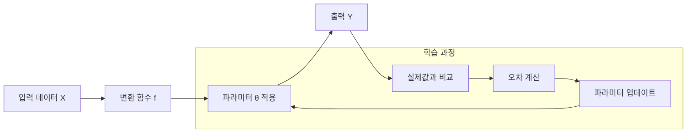
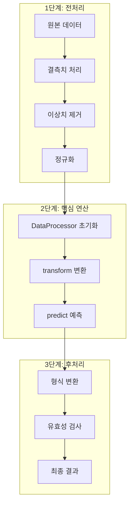

# 제N장: 장 제목

> 이 문서는 본문 작성의 표준 참조 문서입니다.
> 모든 장 작성 시 이 형식과 스타일을 따르세요.

## 집필 대상 및 방향
- **대상 독자**: 딥러닝과 자연어처리를 처음 배우는 학부생 (3~4학년)
- **집필 목표**: 이론과 방법을 쉽고 명확하게 설명
- **분량 기준**: 최소 500줄 (내용에 따라 탄력 조정)

---

## 학습 목표

이 장을 마치면 다음을 수행할 수 있다:
- 핵심 개념 1을 이해하고 설명할 수 있다
- 핵심 개념 2를 실무에 적용할 수 있다
- 관련 도구를 활용하여 실습을 수행할 수 있다

---

## N.1 첫 번째 절 제목

### 도입 (왜 필요한가)

이 절에서는 {주제}의 필요성과 배경을 먼저 살펴본다. 복잡한 개념을 바로 설명하기보다, 먼저 "왜 이것이 필요한지"를 이해하는 것이 중요하다.

**비유로 시작**: {주제}를 일상적인 비유로 먼저 소개하면 이해가 쉬워진다. 예를 들어, "어텐션(Attention)은 우리가 책을 읽을 때 중요한 단어에 더 집중하는 것과 같다"처럼 설명할 수 있다.

기존 방식은 다음과 같은 문제점을 가지고 있었다. 첫째, 처리 속도가 느려 대규모 데이터를 다루기 어려웠다. 둘째, 정확도가 낮아 실무 적용에 한계가 있었다. 셋째, 사용하기 복잡하여 전문가만 활용할 수 있었다.

이러한 문제를 해결하기 위해 {주제}가 등장했으며, 현재는 업계 표준으로 자리 잡았다.

### 핵심 개념

{주제}의 핵심 원리를 단계별로 살펴보자.

**1단계: 직관적 이해**
먼저, {주제}가 하는 일을 간단히 말하면 "입력 데이터를 받아서 원하는 형태의 출력으로 변환하는 것"이다. 이 과정을 수학적으로 표현하면 다음과 같다.

**2단계: 수식의 의미**
수학적으로 표현하면, 출력 Y는 입력 X와 파라미터 θ의 함수로 나타낼 수 있다:

Y = f(X; θ) + ε

이 수식의 각 요소가 의미하는 바를 살펴보자:
- **f**: 변환 함수 — 입력을 출력으로 바꾸는 규칙
- **θ (세타)**: 학습 가능한 파라미터 — 모델이 데이터를 통해 배우는 값
- **ε (엡실론)**: 오차항 — 모델이 완벽하지 않기에 발생하는 오차

**3단계: 왜 이것이 중요한가**
이 수식이 의미하는 바는 "데이터를 충분히 주면 모델이 스스로 적절한 파라미터를 찾아낼 수 있다"는 것이다. 이것이 딥러닝의 핵심 아이디어이다.

### 시각화로 이해하기

복잡한 개념은 다이어그램으로 표현하면 이해가 쉬워진다. 다음은 {주제}의 전체 흐름을 보여주는 다이어그램이다.



**그림 N.1** {주제}의 학습 과정 흐름도

위 그림에서 볼 수 있듯이, 입력 데이터가 변환 함수를 거쳐 출력으로 변환되고, 이 출력이 실제값과 비교되어 파라미터가 업데이트되는 과정이 반복된다. 이것이 딥러닝 모델의 기본 학습 원리이다.

### 비교 분석

**표 N.1** 주요 방법론 비교

| 항목 | 방법 A | 방법 B | 방법 C |
|------|--------|--------|--------|
| 정확도 | 높음 | 중간 | 낮음 |
| 속도 | 느림 | 빠름 | 매우 빠름 |
| 복잡도 | 높음 | 중간 | 낮음 |
| 적용 분야 | 연구 | 실무 | 프로토타입 |

위 표에서 알 수 있듯이, 각 방법은 서로 다른 장단점을 가지고 있다. 방법 A는 정확도가 높지만 속도가 느려 대규모 처리에는 적합하지 않다. 반면 방법 C는 빠르지만 정확도가 낮아 정밀한 분석에는 부적합하다. 실무에서는 상황에 따라 적절한 방법을 선택해야 하며, 대부분의 경우 방법 B가 균형 잡힌 선택이 된다.

---

## N.2 두 번째 절 제목

### 상세 원리

이 절에서는 앞서 소개한 개념의 상세 원리를 다룬다. 핵심 알고리즘은 크게 세 단계로 구성되어 있으며, 각 단계는 순차적으로 실행된다. 먼저 전체 흐름을 다이어그램으로 확인하자.



**그림 N.2** 알고리즘 처리 단계

첫 번째 단계에서는 입력 데이터를 전처리한다. 이 과정에서 결측치를 처리하고, 이상치를 제거하며, 데이터를 정규화한다. 전처리의 품질은 최종 결과에 큰 영향을 미치므로 신중하게 수행해야 한다.

두 번째 단계에서는 핵심 연산을 수행한다. 다음은 이 과정의 핵심 로직이다:

```python
# 핵심 처리 로직
processor = DataProcessor(config)
result = processor.transform(input_data)
output = processor.predict(result)
```

_전체 코드는 practice/chapter{N}/code/{N}-2-processing.py 참고_

세 번째 단계에서는 결과를 후처리하고 검증한다. 이 단계에서는 출력 형식을 변환하고, 결과의 유효성을 검사한다.

### 실행 결과

위 코드를 실행한 결과는 다음과 같다:

```
실행 결과:
처리된 레코드: 1,234개
처리 시간: 2.5초
정확도: 0.923 (92.3%)
F1 점수: 0.891
```

이 결과는 샘플 데이터셋을 기준으로 한 것이며, 실제 데이터에서는 다를 수 있다. 정확도 92.3%는 해당 분야에서 우수한 수준으로 평가되며, 실무 적용에 충분한 수준이다. 다만 F1 점수가 정확도보다 낮은 것은 클래스 불균형의 영향으로 보이며, 추가적인 샘플링 기법을 적용하면 개선될 수 있다.

---

## N.3 세 번째 절 제목

### 실무 적용

실무에서 이 기술을 적용할 때는 몇 가지 고려사항이 있다. 우선 데이터 품질을 확보해야 하며, 충분한 양의 학습 데이터가 필요하다. 일반적으로 최소 1,000개 이상의 샘플이 권장되며, 클래스별로 균형 있게 분포되어야 한다.

**주의**: 실제 운영 환경에서는 모델 성능이 학습 시보다 저하될 수 있다. 이를 방지하기 위해 정기적인 모니터링과 재학습이 필요하다.

**팁**: 초기 적용 시에는 작은 규모의 파일럿 프로젝트로 시작하는 것이 좋다. 이를 통해 문제점을 조기에 발견하고 수정할 수 있다.

### 적용 사례

국내 A사는 이 기술을 도입하여 업무 효율을 30% 향상시켰다. 기존에는 수작업으로 처리하던 업무를 자동화함으로써 처리 시간을 대폭 단축했으며, 오류율도 크게 감소했다.

해외 B연구소에서는 이 방법론을 활용하여 새로운 연구 성과를 도출했다. 특히 대규모 데이터 분석에서 기존 방법 대비 5배 빠른 처리 속도를 달성했다.

---

## N.4 실습: {실습 제목}

### 실습 목표

이 실습에서는 앞서 배운 개념을 직접 구현해본다. 실습을 완료하면 다음을 수행할 수 있게 된다:
- 데이터를 로드하고 전처리하기
- 핵심 알고리즘 적용하기
- 결과 분석 및 시각화하기

### 실습 환경 준비

```bash
cd practice/chapter{N}
python3 -m venv venv
source venv/bin/activate  # Windows: venv\Scripts\activate
pip install -r code/requirements.txt
```

### 실습 단계

**1단계: 데이터 로드**

먼저 실습용 데이터를 로드한다. 데이터는 CSV 형식으로 제공되며, 약 1,000개의 샘플을 포함한다.

```python
# 데이터 로드
from pathlib import Path
import pandas as pd

data_path = Path(__file__).parent.parent / "data" / "input" / "sample.csv"
df = pd.read_csv(data_path)
```

_전체 코드는 practice/chapter{N}/code/{N}-4-practice.py 참고_

**2단계: 전처리 및 분석**

로드한 데이터를 전처리하고 분석을 수행한다. 전처리 과정에서는 결측치 처리와 정규화를 적용한다.

**3단계: 결과 시각화**

분석 결과를 시각화하여 해석한다. 시각화 결과는 `practice/chapter{N}/data/output/` 폴더에 저장된다.

### 실습 결과

실습 코드를 실행하면 다음과 같은 결과를 얻을 수 있다:

**그림 N.1** 분석 결과 시각화

(이미지는 실제 실행 후 생성됨)

결과 해석: 시각화 결과에서 X축은 입력 변수, Y축은 예측값을 나타낸다. 그래프의 추세선을 통해 양의 상관관계가 있음을 확인할 수 있다.

---

## 핵심 정리

이 장에서 다룬 핵심 내용을 정리하면 다음과 같다:

- **개념 1**: {주제}는 기존 방식의 한계를 극복하기 위해 개발되었다
- **개념 2**: 핵심 알고리즘은 전처리, 처리, 후처리의 세 단계로 구성된다
- **개념 3**: 실무 적용 시 데이터 품질과 모니터링이 중요하다
- **실습**: 직접 코드를 작성하고 실행하여 결과를 확인했다

---

## 더 알아보기

이 장의 내용을 더 깊이 학습하려면 다음 자료를 참고하라:

- Smith, J. (2024). Advanced Data Processing. *Journal of Data Science*. https://doi.org/10.xxxx
- 공식 문서: https://docs.example.com/
- 온라인 튜토리얼: https://tutorial.example.com/

---

## 다음 장 예고

다음 장에서는 이 장에서 배운 기초 위에 심화 개념을 다룬다. 특히 대규모 데이터 처리와 성능 최적화 기법을 집중적으로 살펴볼 것이다.

---

## 참고문헌

1. Smith, J. (2024). Advanced Data Processing. *Journal of Data Science*, 15(3), 123-145. https://doi.org/10.xxxx
2. Kim, H. (2023). 데이터 분석의 이론과 실제. *한국데이터학회지*, 8(2), 45-67.
3. Official Documentation. (2024). Getting Started Guide. https://docs.example.com/
